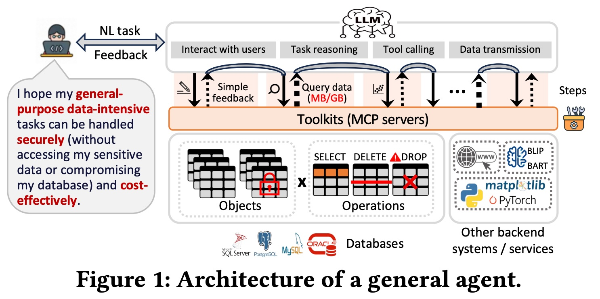
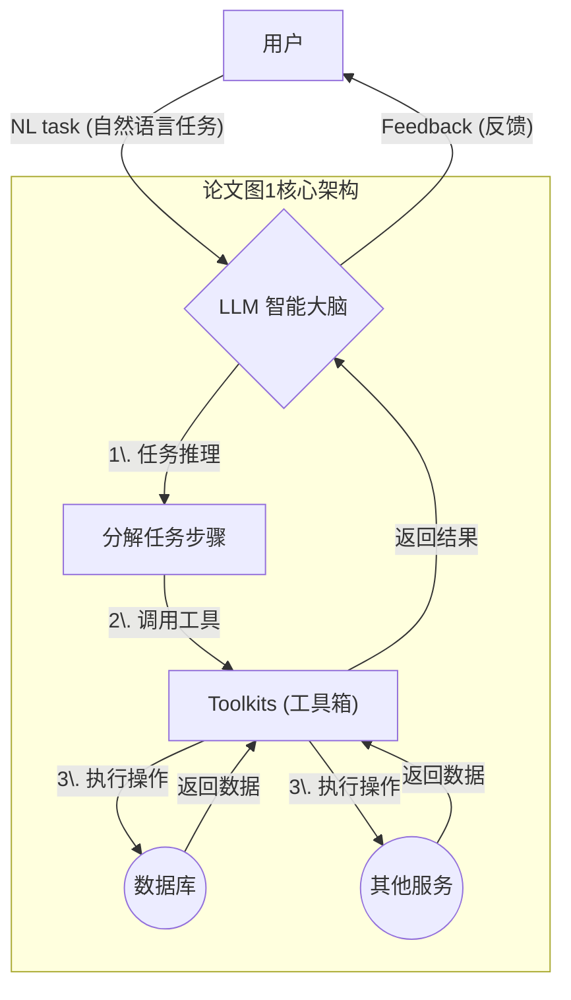
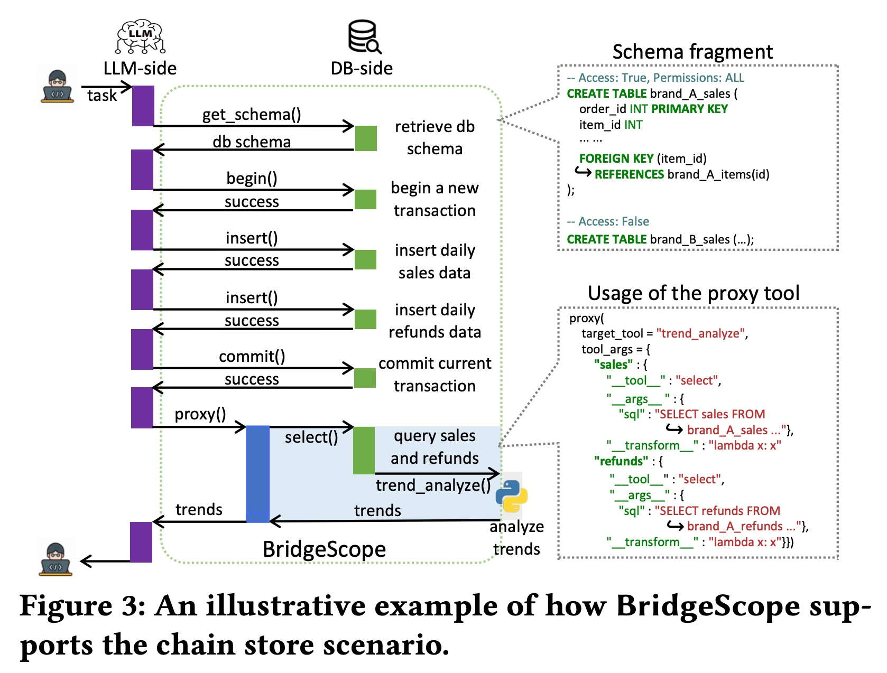
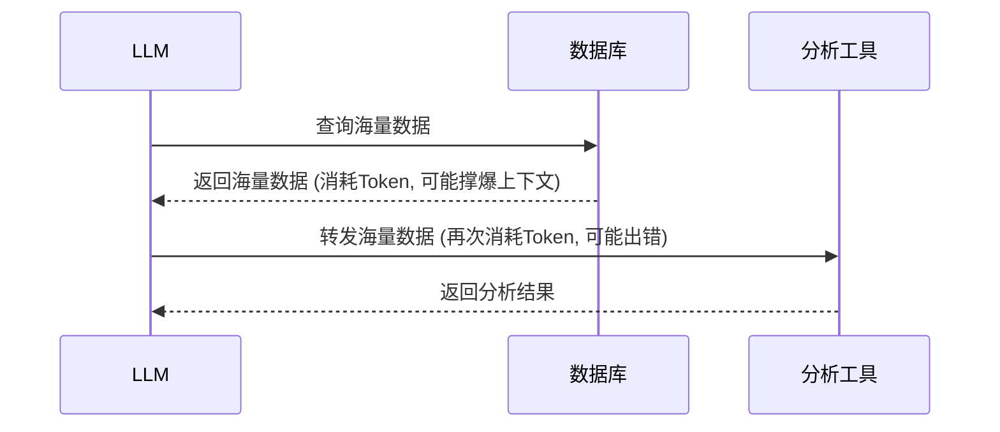
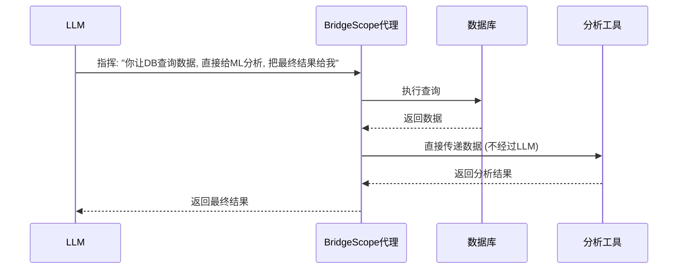
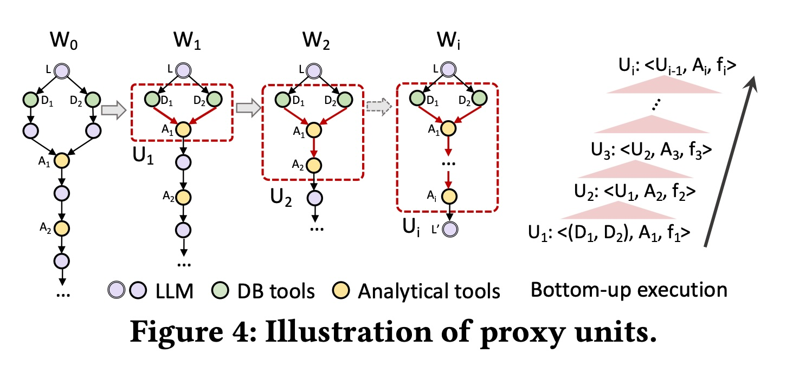
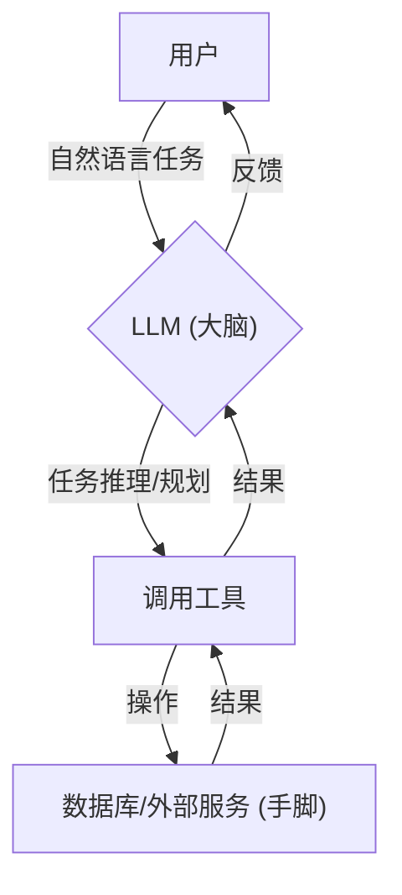
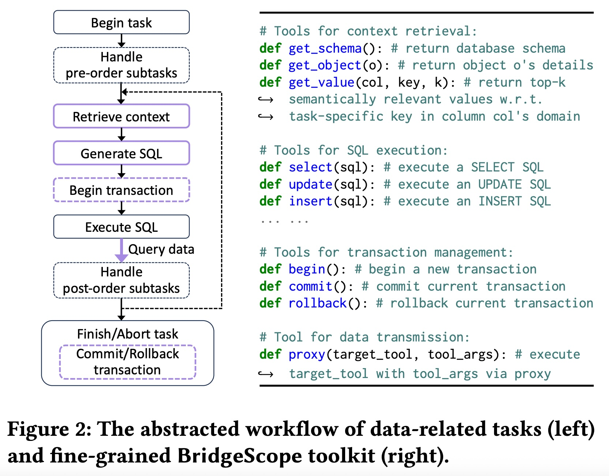
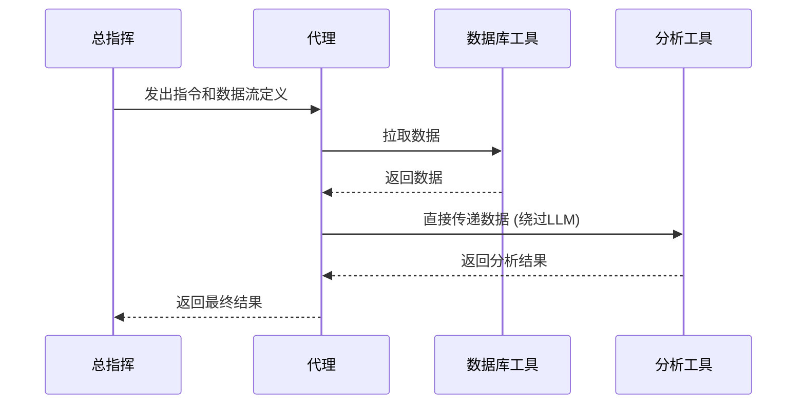

## AI论文解读 | BridgeScope: A Universal Toolkit for Bridging Large Language Models and Databases
        
### 作者        
digoal        
        
### 日期        
2025-10-10        
        
### 标签        
PostgreSQL , PolarDB , DuckDB , AI , 论文解读        
        
----        
        
## 背景  
      
https://arxiv.org/pdf/2508.04031        
  
提示:          
```          
读懂《BridgeScope: A Universal Toolkit for Bridging Large Language Models and Databases》这篇论文需要提前掌握哪些基础知识, 请使用中文通熟易懂的讲解这些基础知识, 可以引用论文中的图、表或使用Markdown支持的图形(text,mermaid等)增加解释性. 
  
使用中文通熟易懂的解读《BridgeScope: A Universal Toolkit for Bridging Large Language Models and Databases》这篇论文, 其中的关键内容请着重讲解, 可以引用论文中的图、表或使用Markdown支持的图形(text,mermaid等)增加解释性. 
  
提取《BridgeScope: A Universal Toolkit for Bridging Large Language Models and Databases》这篇论文中的重要术语, 使用中文对这些术语进行通熟易懂的讲解, 可以引用论文中的图、表或使用Markdown支持的图形(text,mermaid等)增加解释性. 
```     
  
## 1 前置知识 
  
好的，为了完全理解《BridgeScope》这篇论文，您需要对**大语言模型 (LLM)** 和**数据库**这两个领域的核心概念，以及它们如何**交互**有一个基本的认识。

下面我将用通俗易懂的方式，结合论文中的图示，为您讲解这些必备的基础知识。

### 1\. 大语言模型 (LLM) 与智能代理 (Agent)

想象一下，你正在和一个非常聪明的聊天机器人（比如 GPT-4）对话，它就是大语言模型（LLM）。

  * **LLM 基础**: LLM 能理解和生成人类语言。你给它一段文字（称为“提示”或 Prompt），它会给你一段回应。
  * **Token**: LLM 处理文本不是一个字一个字地处理，而是以 "Token" 为单位。一个 Token 可以是一个词、一个汉字或一部分单词。LLM 的计算成本和它处理的 Token 数量直接相关，同时它一次能处理的 Token 数量（即“上下文窗口”）是有限的。这就是为什么论文中反复提到要“减少 Token 使用”和避免“上下文窗口被耗尽” 。
  * **LLM 智能代理 (Agent)**: 如果我们不只让 LLM 聊天，还赋予它使用工具的能力，它就升级成了“智能代理”。这就像给了大脑（LLM）一双手（工具）。LLM 负责思考和规划，决定在什么时候、用什么工具、去完成什么任务。

论文的**图1**就完美展示了这个概念：    



在这个架构中 ，用户用自然语言提出一个复杂的、需要操作数据的任务（比如“帮我统计上个月A品牌的销售额，并分析趋势”）。LLM 作为大脑，会进行“任务推理” ，把这个大任务分解成小步骤（“1. 查询数据库获取销售数据”，“2. 调用分析工具进行趋势分析”），然后通过“工具调用”  来完成每一步。BridgeScope 正是为这个架构设计的一套强大的数据库“工具箱” (Toolkits) 。

### 2\. 数据库 (Database) 基础知识

数据库就是存储和管理数据的仓库。BridgeScope 主要面向的是**关系型数据库**（如论文中提到的 PostgreSQL ）。

  * **SQL (结构化查询语言)**: 这是我们与数据库沟通的语言。论文中提到的几种核心操作，你都需要了解：

      * `SELECT`: 查询数据（“读”）
      * `INSERT`: 插入新数据（“增”）
      * `UPDATE`: 更新现有数据（“改”）
      * `DELETE`: 删除数据（“删”）
      * 这四种操作合称为 **CRUD** (Create, Read, Update, Delete) 。

  * **数据库 Schema (模式)**: 这就像是数据库的“蓝图”或“目录”，它描述了数据库里有哪些表、每个表里有哪些列、列的数据类型是什么、以及表和表之间有什么关系（比如外键）。LLM 在生成 SQL 语句之前，必须先看懂 Schema，否则就像不知道房间结构就想在里面找东西一样，会出错。论文中的 `get_schema` 工具就是专门用来获取这个“蓝图”的 。

  * **事务管理 (Transaction Management) 与 ACID**: 当一个任务需要执行多个数据库修改操作时（比如，银行转账需要在一个账户减钱，在另一个账户加钱），我们希望这些操作要么**全部成功**，要么**全部失败**，不能只完成一半。这个“打包执行”的机制就是**事务**。

      * `begin()`: 开始一个事务 。
      * `commit()`: 确认事务，让所有修改永久生效 。
      * `rollback()`: 撤销事务，回到操作之前的状态 。
      * 这保证了数据库操作的 **ACID** 特性（原子性、一致性、隔离性、持久性），是确保数据可靠的关键 。BridgeScope 提供了专门的工具来管理事务 。

  * **权限管理 (Privilege Management)**: 在真实世界中，不是每个用户都能对数据库为所欲为。比如，一个普通分析师可能只有查询 (`SELECT`) 某些表的权限，而不能修改或删除数据 。数据库系统有精细的权限控制。论文强调，LLM Agent 在规划任务时必须了解并遵守这些权限，否则会做很多无用功（生成了无权执行的SQL）。

### 3\. LLM 与数据库交互的挑战 (论文要解决的问题)

了解了以上基础后，你就能理解现有方法（在 BridgeScope 之前）存在的问题了：

1.  **工具太粗糙 (Coarse-Grained Tooling)**: 以前的工具箱通常只提供一个 `execute_sql` 工具 。这相当于给了 LLM 一把“万能钥匙”，它可以用这把钥匙做任何事，包括执行危险操作（如 `DROP DATABASE`，删除整个数据库），非常不安全 。
2.  **权限意识缺失 (Privilege-Unaware Planning)**: LLM 不知道当前用户的权限，它可能会生成一个需要管理员权限的 SQL，结果被数据库拒绝 。这不仅浪费了计算资源（LLM 调用成本），还可能导致任务失败 。
3.  **数据传输瓶颈 (Data Transmission Bottlenecks)**: 当需要从数据库查询大量数据，并交给另一个工具（比如机器学习模型）进行分析时，传统做法是：`数据库 -> LLM -> 分析工具`。数据必须经过 LLM 中转。这会消耗大量 Token，可能超出 LLM 的上下文窗口限制，甚至 LLM 在中转时可能“犯迷糊”弄错数据（幻觉）。

### BridgeScope 的核心创新如何解决这些问题？

  * **针对问题1和2**: BridgeScope 提供了**细粒度的、与权限挂钩的工具集**。

      * 它不再提供万能的 `execute_sql`，而是根据操作类型和用户权限，提供独立的 `select(sql)` , `insert(sql)` , `update(sql)`  等工具。一个只读权限的用户，在他的工具箱里就只有 `select` 工具 。这从根本上防止了 LLM 进行越权操作。

  * **针对问题3**: BridgeScope 设计了**代理 (Proxy) 机制**。

      * 这相当于 LLM 从一个“数据搬运工”升级为了一个“总指挥”。它不再亲自搬运数据，而是调用 `proxy` 工具，并下达指令：“你（proxy）去调用`select`工具从数据库拿数据，然后直接把数据交给`trend_analyze`（趋势分析）工具处理，最后把分析结果给我就行” 。

论文中的**图3**生动地展示了这个过程：   

在这个例子中，LLM 首先通过 `get_schema` 了解数据库结构，然后通过 `begin`, `insert`, `commit` 完成数据的原子性写入 。最关键的是最后一步，它调用 `proxy` 工具 ，`proxy` 工具在后端协调了 `select` 工具和 `trend_analyze` 工具的数据流动 ，整个过程数据没有经过 LLM，极大地提升了效率和可靠性。

-----

**总结一下**，在阅读这篇论文前，您需要掌握的知识点可以归纳为：

  * **LLM & Agent**: 知道 LLM 是什么，以及 Agent 是“LLM大脑 + 工具”的模式。
  * **Database & SQL**: 了解数据库的基本构成（表、列、Schema），核心 SQL 操作（CRUD），以及事务（ACID）和权限管理的重要性。
  * **Interaction Challenges**: 理解为什么让 LLM 直接处理 SQL 和在工具间传递大量数据是低效且危险的。

有了这些背景知识，您在阅读《BridgeScope》时，就能非常清晰地理解它所解决的问题的价值，以及其提出的细粒度工具和代理机制等解决方案的巧妙之处。
  
## 2 解读论文 
  
好的，我们来一起用通俗易懂的方式解读《BridgeScope》这篇论文。

这篇论文的核心思想是：**为了让大语言模型（LLM）能够安全、高效、低成本地操作数据库，我们需要为它设计一套全新的、更智能的“工具箱”，而不是给它一把什么都能干的“万能钥匙”。** 这个全新的工具箱就是 **BridgeScope**。

-----

### 一、 为什么需要 BridgeScope？（解决了什么痛点）

想象一下，你请了一个非常聪明但没有经验的实习生（LLM Agent）来帮你管理公司的数据库。为了让他能干活，你给了他数据库的最高权限账号。可能会发生什么？

1.  **安全风险**：他可能会因为理解错你的指令，或者被外部恶意指令（提示词注入攻击）欺骗，不小心执行了 `DROP DATABASE` 这样的毁灭性操作，导致数据全部丢失 。
2.  **权限混乱**：你可能只想让他查询A部门的销售数据，但他却尝试去访问B部门的敏感薪酬数据，虽然数据库最终会拒绝他，但他在尝试的过程中已经浪费了时间和精力（LLM的计算成本） 。
3.  **效率低下和成本高昂**：当你让他“把A表的数据整理一下，导入B表进行分析”时，他可能会先把A表的几万行数据全部“读到自己的脑子里”（LLM的上下文窗口），然后再“复述”给B表的分析工具 。这个过程不仅慢，而且因为LLM按流量（Token）计费，成本会非常高，甚至可能因为数据量太大而“脑子宕机”（上下文窗口耗尽） 。

现有的方法，通常只给LLM提供一个通用的 `execute_sql`（执行SQL）工具 ，这就导致了上述所有问题。BridgeScope 就是为了解决这些痛点而诞生的。

### 二、 BridgeScope 是如何解决问题的？（三大核心创新）

BridgeScope 提出了三大创新设计，就像是为这位实习生制定了一套精细、安全、高效的工作流程和工具。

#### 创新一：细粒度的工具模块化 (Fine-Grained Tooling)

BridgeScope 不再提供一个万能的 `execute_sql` 工具，而是将数据库操作拆分成一个个具体、独立的工具。

  * **按功能拆分**：
      * **上下文获取工具**：比如 `get_schema()` (获取数据库结构)、`get_value()` (获取某列的示例值) 。这让LLM在动手前，能先看清“图纸”。
      * **SQL执行工具**：比如 `select()` (只执行查询)、`insert()` (只执行插入)、`update()` (只执行更新) 。
      * **事务管理工具**：`begin()` (开始事务)、`commit()` (提交)、`rollback()` (回滚) 。这保证了多步操作的原子性（要么都成功，要么都失败）。

**这样做的好处**：LLM 的“工具箱”里不再是一把万能工具，而是一套分工明确的专用工具。这降低了LLM选择工具的难度和认知负担 ，也为实现精细的权限控制打下了基础。

#### 创新二：权限感知的安全设计 (Privilege-Aware Security)

这是BridgeScope保障安全的关键。它通过两层机制，让LLM从一开始就知道“什么能做，什么不能做”。

1.  **工具层面的权限控制**：系统会根据当前用户的数据库权限和用户自定义的安全策略，动态地决定给LLM暴露哪些工具 。

      * 例如，一个只读权限的分析师，他的LLM工具箱里就**只有 `select()` 工具** ，根本不会有 `insert()` 或 `delete()` 工具。这样一来，LLM就算想执行修改操作，也“无具可用”，从根本上避免了越权行为。

2.  **数据层面的权限告知**：在LLM调用 `get_schema()` 获取数据库结构时，BridgeScope 会在返回结果中**明确标注出每个表、每个字段的权限信息** 。

      * 如下图（改编自论文图3），LLM能清楚地看到，它对 `brand_A_sales` 表有完全权限，但对 `brand_B_sales` 表则被限制访问 。    


```
-- User: store_manager
-- Privileges for table 'brand_A_sales': [SELECT, INSERT, UPDATE, DELETE]
CREATE TABLE brand_A_sales ( ... );

-- User: store_manager
-- Privileges for table 'brand_B_sales': [RESTRICTED]
CREATE TABLE brand_B_sales ( ... );
```

**这样做的好处**：LLM 在规划任务的第一步就了解了权限边界，会主动避免生成无法执行的计划，从而大大减少了无效的尝试。实验证明，这种设计在处理无权限任务时，**最高可减少80%的Token消耗** 。

#### 创新三：高效的数据代理传输机制 (Proxy Mechanism)

这是BridgeScope解决数据传输瓶颈问题的“杀手锏”。它让LLM从一个“数据搬运工”升级为“总指挥”。

**传统方式（低效）** :



**BridgeScope代理方式（高效）** :



如论文中的**图3**和**图4**所示，LLM只需调用一次 `proxy` 工具，并定义好数据流：数据源是什么（`producer`），目标工具是什么（`consumer`），以及数据格式是否需要转换（`adaptation function`） 。剩下的数据拉取、转换、传递等所有中间步骤都由代理在后端高效完成，完全不占用LLM的上下文和计算资源 。

    

**这样做的好处**：

  * **支持数据密集型任务**：即使是海量数据，也能在不同工具间无缝流转，这是现有工具无法做到的 。
  * **极大降低成本**：实验表明，相比传统方式，Token使用量可以**减少超过两个数量级** 。
  * **提升效率**：大大简化了工作流，减少了LLM的调用次数 。

### 三、 实验效果怎么样？

论文通过两个新构建的基准测试（BIRD-Ext 和 NL2ML）来验证效果：

  * **工具粒度的影响**：使用BridgeScope的细粒度工具后，LLM能更准确地执行任务，尤其是在需要事务管理的复杂数据修改场景下，正确率远超使用单一工具的基线模型 。
  * **权限感知有效性**：在面对因权限不足而无法完成的任务时，BridgeScope能帮助LLM迅速识别问题并提前终止任务，LLM调用次数减少了23%-71%，Token成本降低了30%-82% 。
  * **代理机制的威力**：在NL2ML（自然语言到机器学习模型训练）这个数据密集型任务上，传统工具因为数据传输瓶颈**完全无法完成任务** 。而BridgeScope凭借代理机制，不仅**100%完成了所有任务**，并且LLM调用次数接近理论最小值，成本极低 。

### 总结

《BridgeScope》这篇论文提出了一个强大而通用的数据库工具包，通过**细粒度的工具模块化**、**权限感知的安全设计**和**高效的数据代理机制**这三大创新，成功地解决了当前LLM Agent在与数据库交互时面临的**安全性、效率和成本**三大核心挑战。它为构建下一代智能、可靠、可扩展的数据自动化应用奠定了坚实的基础 。
  
## 3 术语 
  
好的，这是对《BridgeScope》论文中一些重要术语的通俗化中文讲解，并结合了论文中的图示和示例。

-----

### 1\. LLM-based agents (基于LLM的智能代理)

这指的是一种更高级的AI系统 。它不仅仅是一个能对话的聊天机器人，而是以大语言模型（LLM）为“大脑”，赋予其使用外部“工具”的能力，从而可以自主地规划步骤并执行复杂任务 。

论文的**图1**就清晰地展示了这种代理的架构。用户用自然语言提出一个任务，LLM负责推理和编排，然后调用不同的工具（Toolkits）来与数据库或其他系统交互，最终完成任务。   



### 2\. Fine-Grained Tooling (细粒度工具)

这指的是将一个宽泛、功能强大的工具（比如一个能执行任何SQL语句的`execute_sql`工具）拆分成多个功能专一、粒度更小的工具 。这是BridgeScope的核心设计原则之一。

论文的**图2 (右侧)** 就列出了这些细粒度的工具 。例如，它把SQL执行这一个大功能，拆分成了专门用于查询的 `select(sql)`、专门用于更新的 `update(sql)` 和专门用于插入的 `insert(sql)` 等。    

  * **传统粗粒度工具**: `execute_sql("DELETE FROM sales WHERE ...")`
  * **BridgeScope细粒度工具**: `delete("DELETE FROM sales WHERE ...")`

**好处**：这样做能让权限管理更精确（比如只给某个用户`select`工具），并降低LLM选择和使用工具的难度 。

### 3\. Privilege-Aware Planning (权限感知的规划)

指LLM在规划任务步骤时，能预先知晓并考虑到当前用户的数据库权限，从而避免生成超出权限范围的操作计划 。

BridgeScope通过两种方式实现这一点：

1.  **暴露有限的工具集**：一个只读用户，他的工具箱里压根就没有 `insert` 或 `delete` 工具，LLM想用也用不了 。
2.  **在Schema中标注权限**：调用 `get_schema()` 时，返回的信息会直接告诉LLM，当前用户对哪些表有权限，对哪些表没有。如论文**图3**的“Schema fragment”部分所示，它明确告知LLM对`brand_A_sales`有权限，而对`brand_B_sales`则受限 。   

这能有效避免LLM进行无效尝试，从而节省时间和Token成本 。

### 4\. CRUD

这是数据库操作中最基本、最常见的四种原子操作的缩写 ：

  * **C (Create)**: 创建/新增数据 (对应SQL的 `INSERT`)
  * **R (Read)**: 读取/查询数据 (对应SQL的 `SELECT`)
  * **U (Update)**: 更新/修改数据 (对应SQL的 `UPDATE`)
  * **D (Delete)**: 删除数据 (对应SQL的 `DELETE`)

论文提到，BridgeScope将这些操作模块化为独立的工具，以便进行更精确的功能控制 。

### 5\. ACID-compliant (符合ACID特性)

ACID是数据库事务（Transaction）必须保证的四个核心特性，用于确保数据的一致性和可靠性 。

  * **A (Atomicity - 原子性)**: 事务中的所有操作要么**全部成功**，要么**全部失败**，不会只执行一半。
  * **C (Consistency - 一致性)**: 事务执行前后，数据库都处于有效的状态。
  * **I (Isolation - 隔离性)**: 多个并发事务之间互不干扰。
  * **D (Durability - 持久性)**: 一旦事务被提交，其结果就是永久性的。

BridgeScope通过提供独立的 `begin()`, `commit()`, `rollback()` 工具，让LLM能够显式地管理事务，从而确保复杂的数据修改任务符合ACID要求 。

### 6\. Proxy Mechanism (代理机制)

这是BridgeScope为解决数据密集型任务中的传输瓶颈而设计的核心创新 。它允许数据在不同的工具之间**直接传递**，而无需通过LLM进行中转。

**传统方式（LLM是“搬运工”）** ：
`数据库 -> LLM -> 分析工具`
这个过程中的数据传输会消耗LLM大量的上下文窗口和Token，效率低下且成本高昂 。

**BridgeScope代理方式（LLM是“总指挥”）** ：
LLM调用`proxy`工具，下达一个指令，例如：“你（代理）去用`select`工具查数据，然后把结果直接喂给`trend_analyze`工具”。



如论文**图4**所示，这个机制可以将多个步骤打包成一个代理单元（proxy unit），由代理在后端执行，极大地提升了效率和可扩展性 。实验表明，该机制能够完成传统方式因数据量过大而无法处理的任务 。    

### 7\. Database-agnostic (数据库无关)

这个术语意味着BridgeScope的设计和实现不依赖于任何特定的数据库产品 。它的所有工具都建立在一套统一的数据库接口之上 。

这意味着，无论是PostgreSQL（论文中实现的版本）、MySQL还是其他关系型数据库，只需要为该数据库实现这套标准接口，BridgeScope的整个工具集就可以无缝迁移和使用 。这大大增强了它的通用性和灵活性。
  
## 参考        
         
https://arxiv.org/pdf/2508.04031    
        
<b> 以上内容基于DeepSeek、Qwen、Gemini及诸多AI生成, 轻微人工调整, 感谢杭州深度求索人工智能、阿里云、Google等公司. </b>        
        
<b> AI 生成的内容请自行辨别正确性, 当然也多了些许踩坑的乐趣, 毕竟冒险是每个男人的天性.  </b>        
  
    
#### [期望 PostgreSQL|开源PolarDB 增加什么功能?](https://github.com/digoal/blog/issues/76 "269ac3d1c492e938c0191101c7238216")
  
  
#### [PolarDB 开源数据库](https://openpolardb.com/home "57258f76c37864c6e6d23383d05714ea")
  
  
#### [PolarDB 学习图谱](https://www.aliyun.com/database/openpolardb/activity "8642f60e04ed0c814bf9cb9677976bd4")
  
  
#### [PostgreSQL 解决方案集合](../201706/20170601_02.md "40cff096e9ed7122c512b35d8561d9c8")
  
  
#### [德哥 / digoal's Github - 公益是一辈子的事.](https://github.com/digoal/blog/blob/master/README.md "22709685feb7cab07d30f30387f0a9ae")
  
  
#### [About 德哥](https://github.com/digoal/blog/blob/master/me/readme.md "a37735981e7704886ffd590565582dd0")
  
  

  
