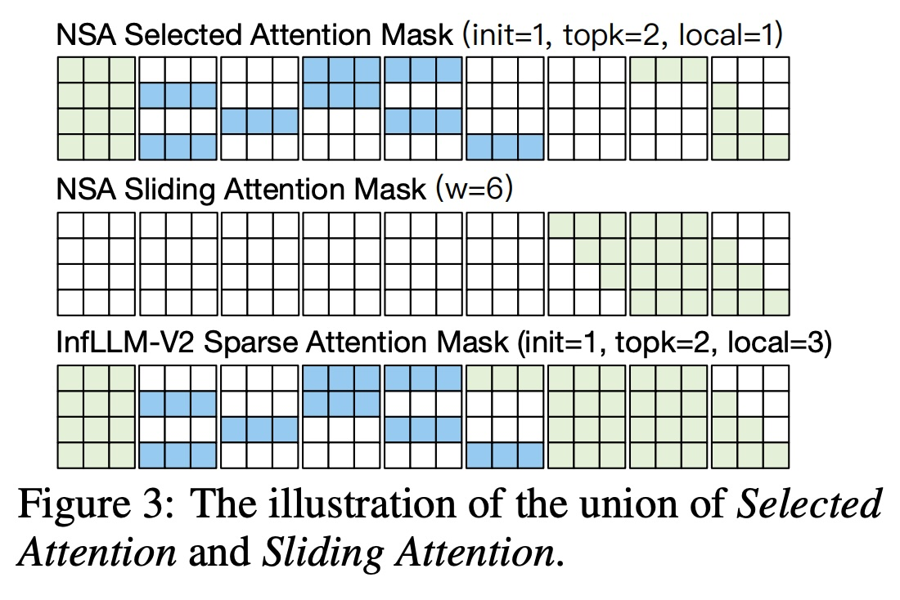
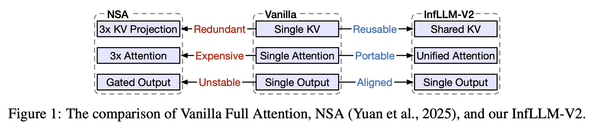
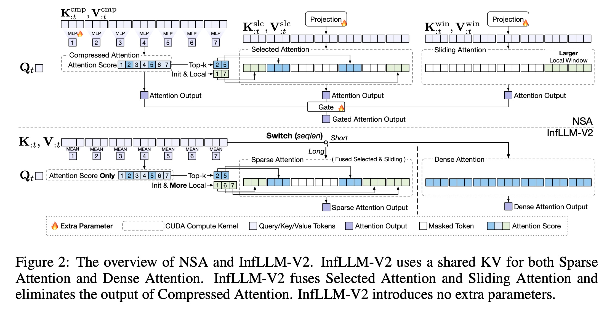
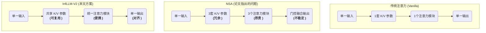
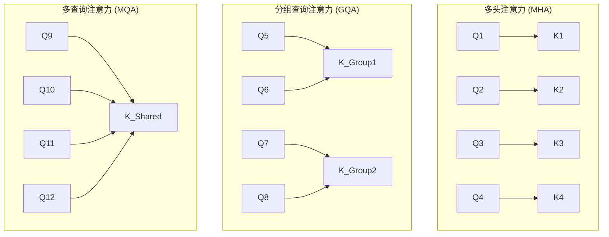
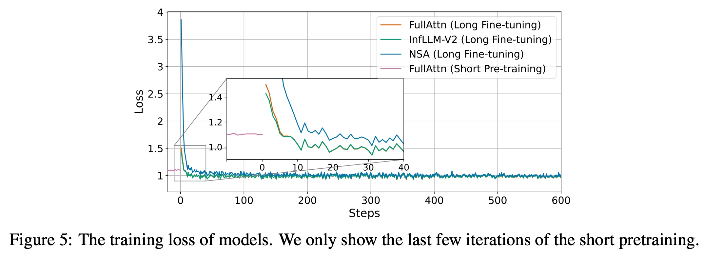
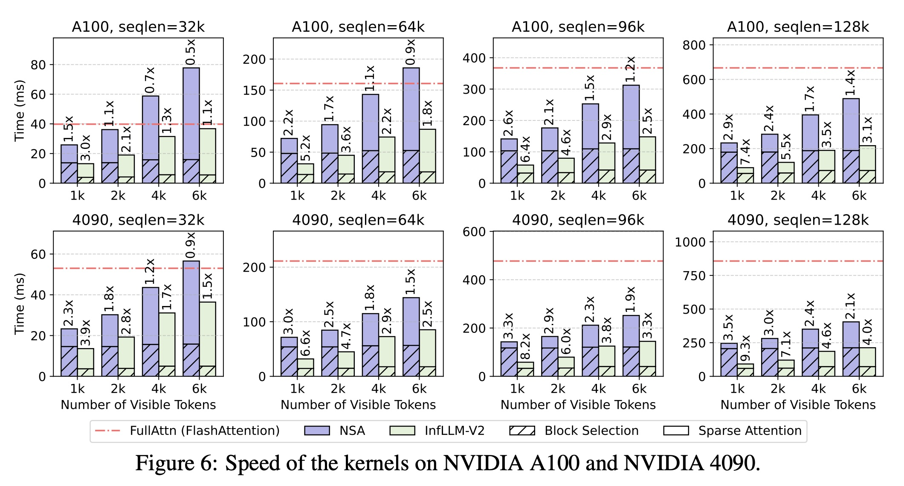
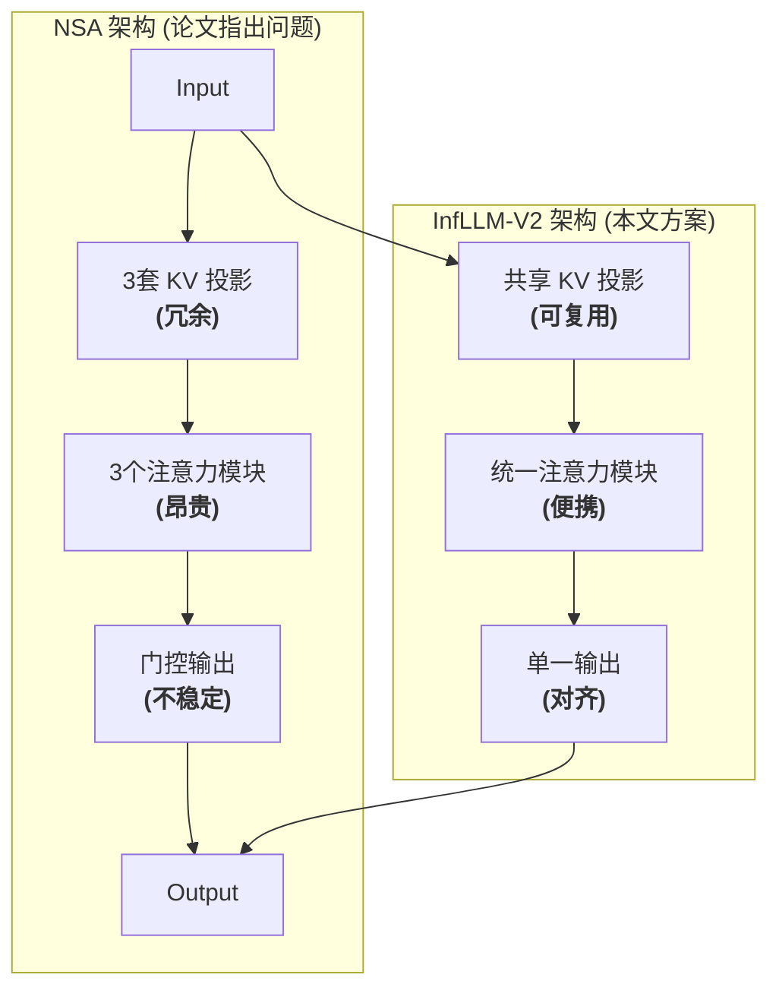

## AI论文解读 | INFLLM-V2: DENSE-SPARSE SWITCHABLE ATTENTION FOR SEAMLESS SHORT-TO-LONG ADAPTATION
        
### 作者        
digoal        
        
### 日期        
2025-10-10        
        
### 标签        
PostgreSQL , PolarDB , DuckDB , AI , 论文解读        
        
----        
        
## 背景  
      
https://arxiv.org/pdf/2509.24663        
  
提示:          
```          
读懂《INFLLM-V2: DENSE-SPARSE SWITCHABLE ATTENTION FOR SEAMLESS SHORT-TO-LONG ADAPTATION》这篇论文需要提前掌握哪些基础知识, 请使用中文通熟易懂的讲解这些基础知识, 可以引用论文中的图、表或使用Markdown支持的图形(text,mermaid等)增加解释性. 
  
使用中文通熟易懂的解读《INFLLM-V2: DENSE-SPARSE SWITCHABLE ATTENTION FOR SEAMLESS SHORT-TO-LONG ADAPTATION》这篇论文, 其中的关键内容请着重讲解, 可以引用论文中的图、表或使用Markdown支持的图形(text,mermaid等)增加解释性. 
  
提取《INFLLM-V2: DENSE-SPARSE SWITCHABLE ATTENTION FOR SEAMLESS SHORT-TO-LONG ADAPTATION》这篇论文中的重要术语, 使用中文对这些术语进行通熟易懂的讲解, 可以引用论文中的图、表或使用Markdown支持的图形(text,mermaid等)增加解释性. 
```     
  
## 1 前置知识 
  
好的，为了完全理解《INFLLM-V2》这篇论文，您需要掌握一些关于大语言模型（LLM）和 Transformer 架构的基础知识。下面我将用通俗易懂的中文，结合论文中的图表，为您讲解这些核心概念。

### 核心知识点概览

要读懂 InfLLM-V2，您需要先了解以下几个层层递进的概念：

1.  **核心问题**: 为什么处理长文本（如万字长文）对AI模型是个挑战？
2.  **基础架构**: Transformer 和自注意力（Self-Attention）机制是什么？
3.  **性能瓶颈**: 为什么自注意力机制处理长文本时会变得非常慢？
4.  **解决思路**: 什么是稀疏注意力（Sparse Attention）？
5.  **前人方案**: 论文中提到的 NSA 方法是什么，它有什么缺点？
6.  **重要优化**: 什么是分组查询注意力（Grouped-Query Attention, GQA）？

-----

### 1\. 核心问题：长序列处理（Long-Sequence Processing）

简单来说，**长序列处理**就是让大语言模型（LLM）能够阅读、理解和生成非常长的文本。

  - **短序列**：一句话、一个段落。
  - **长序列**：一篇几万字的报告、一本小说、一个复杂的代码库、或者持续很久的对话记录。

论文开篇就提到，现代LLM在处理深度研究、拥有长期记忆的聊天机器人、解决软件问题等场景时，处理长序列的能力至关重要 。

**通俗比喻**：
想象一下，一个记忆力不好的人只能记住你说的最后两三句话（短序列），你让他总结一部电影，他肯定做不到。而一个记忆力超群的人能记住整部电影的情节（长序列），就能很好地回答你的问题。InfLLM-V2 的目标就是让模型拥有这种“超强记忆力”。

-----

### 2\. 基础架构：Transformer 与自注意力机制（Self-Attention）

这是现代所有大语言模型（如GPT系列）的基石。

  - **Transformer**：一种神经网络架构，非常擅长处理序列数据，比如文本。
  - **自注意力机制 (Self-Attention)**：是 Transformer 的核心组件。它的作用是，在处理一个词的时候，能够“关注”到输入文本中所有其他的词，从而更好地理解这个词在当前语境下的确切含义。

**通俗比喻**：
想象你在阅读句子：“苹果公司发布了新款的苹果手机。”
当模型读到第一个“苹果”时，自注意力机制会同时看到“公司”这个词，于是理解这是一家公司。当读到第二个“苹果”时，它会同时看到“手机”，于是理解这是一种水果。

自注意力机制通过计算一个**注意力分数矩阵**来实现这一点，矩阵中的每个元素代表了序列中第 i 个词对第 j 个词的“关注”程度。

-----

### 3\. 性能瓶颈：为什么自注意力处理长文本很慢？

这是理解本篇论文动机的关键。标准自注意力机制有一个致命的缺点：**计算量和内存占用会随着序列长度的平方 ( $O(n^2)$ ) 增长** 。

  - **$n$** 是序列的长度（比如单词或字符的数量）。
  - 如果文本长度是1000，计算量是 $1000 \times 1000 = 100$ 万。
  - 如果文本长度翻倍到2000，计算量是 $2000 \times 2000 = 400$ 万，**翻了4倍**！
  - 如果文本长度达到32k（约32000），计算量会变成一个天文数字，任何现代GPU都难以承受。

**通俗比喻**：
这就像在一个派对里，为了让每个人都相互认识，要求每个人都必须和在场的其他所有人聊一遍天。

  - 10个人，需要 $10 \times 10 = 100$ 次对话。
  - 100个人，就需要 $100 \times 100 = 10000$ 次对话。
    人数稍多，这个派对就没法开下去了。这就是自注意力的“社交灾难”。

-----

### 4\. 解决思路：稀疏注意力（Sparse Attention）

既然让每个词都关注所有词计算量太大，一个自然的想法就是：**让每个词只关注一部分“重要”的词**。这就是稀疏注意力的核心思想 。

**通俗比喻**：
回到派对的比喻。你不需要和所有人聊天，你可能只需要：

1.  和你旁边的人聊聊（**局部注意力**）。
2.  和派对的主持人聊聊（**全局注意力**，关注特殊/重要的部分）。
3.  和你感兴趣的几个人聊聊（**Top-k注意力**，关注最相关的部分）。

这样一来，需要进行的对话次数就大大减少了。论文中的 **图3** 非常直观地展示了这一点：   

  * 上图是论文中的 **Figure 3** 的简化示意图 。
  * 每个小方格代表一个词。深色方格表示当前词（某一行）需要关注的词（某一列）。
  * 可以看到，大部分方格都是白色的，表示这些词之间的注意力计算被“跳过”了，从而实现了加速。
  * InfLLM-V2 的稀疏模式就是结合了关注初始位置（`init`）、最相关位置（`topk`）和邻近位置（`local`）的策略 。

-----

### 5\. 前人方案：NSA 及其缺点

NSA (Natively Trainable Sparse Attention) 是一个前人提出的可训练稀疏注意力方案 。InfLLM-V2 正是针对它的缺点进行改进的。

论文 **图1** 和 **图2** 清晰地对比了传统注意力、NSA 和 InfLLM-V2 的区别。      



*上图是根据论文 Figure 1  的逻辑绘制的流程图*

NSA 的主要问题是：

1.  **架构不一致**：它引入了三套独立的Key/Value参数和三个注意力模块（压缩、选择、滑动）。这导致在“先用短文本预训练，再用长文本微调”这个标准流程中，模型架构发生了剧变，使得训练不稳定 。
2.  **参数冗余**：引入了大量额外的参数 ，增加了模型的复杂度和计算成本。
3.  **效率问题**：即使处理短文本，也需要经过复杂的门控融合模块，造成不必要的计算开销 。

InfLLM-V2 通过**复用**原有的参数、**统一**稀疏模式、并设计了一个可以在密集（处理短文本时）和稀疏（处理长文本时）模式间**无缝切换**的框架，解决了这些问题 。

-----

### 6\. 重要优化：分组查询注意力 (Grouped-Query Attention, GQA)

这是 Transformer 注意力机制的一个变种，旨在平衡性能和效率 。理解它有助于明白论文的技术背景。

在标准的 **多头注意力（MHA）** 中，每个“查询头”（Query Head）都有自己专属的“键头”（Key Head）和“值头”（Value Head）。这就像每个提问者（Query）都有自己专属的档案库（Key/Value）来查找信息。

为了节省内存，后来出现了 **多查询注意力（MQA）** ，让所有的查询头共享同一套键/值头。这就像所有提问者都去同一个档案库查资料，非常高效但可能导致信息拥挤，性能下降。

**GQA** 则是两者的折中方案。它将查询头分成几组，每组共享一套键/值头 。



论文选择 GQA 作为其模型的基础骨架 ，因为它本身就是一种高效的注意力实现方式。

### 总结

当您掌握了以上这些基础知识后，再来阅读《INFLLM-V2》这篇论文就会豁然开朗：

  - 您会明白，论文旨在解决标准自注意力机制 $O(n^2)$ 的**性能瓶颈**。
  - 您会知道，它选择了**稀疏注意力**作为解决方案。
  - 您会理解，它的主要贡献是改进了 **NSA** 方案中存在的架构不匹配、参数冗余等问题，提出了一种可以**在密集和稀疏模式间无缝切换**的框架（dense-sparse switchable attention），从而更好地适应了“短文预训练、长文微调”的行业标准流程 。

希望这份讲解能帮助您顺利读懂这篇优秀的论文！
  
## 2 解读论文 
  
好的，我们来通俗易懂地解读一下《INFLLM-V2》这篇论文。

### **核心思想一句话总结**

这篇论文提出了一种名为 **InfLLM-V2** 的新方法，旨在解决大语言模型（LLM）处理长文本时的效率和性能问题。它的核心创新在于设计了一种可以在**密集注意力（Dense Attention）和稀疏注意力（Sparse Attention）之间无缝切换**的框架，使得模型既能高效处理短文本，也能在不牺牲太多性能的前提下，极大地加速长文本的处理 。

-----

### **1. 背景：大模型处理长文本的“老大难”问题**

现代大语言模型（如各类GPT）在理解和生成文本方面非常强大，但它们都有一个共同的痛点：**处理长文本时，计算量和内存消耗会急剧增加** 。

  * **根本原因**：这源于其核心组件“自注意力（Self-Attention）”机制。该机制要求文本中的每一个词都要和所有其他词进行计算，以理解上下文。如果文本长度为 $N$ ，计算复杂度就是 $O(N^2)$ 。当文本从1000个词增加到10000个词，计算量会增加近100倍，这在硬件上是难以承受的。
  * **解决方案**：一个主流的解决思路是采用**稀疏注意力（Sparse Attention）** 。即，不让每个词都关注所有词，而是只关注一部分最重要的词，从而大幅减少计算量。

-----

### **2. 现有方法的不足与 InfLLM-V2 的动机**

在InfLLM-V2之前，已经有了一些稀疏注意力的方案，其中一个代表是**NSA（Natively Trainable Sparse Attention）** 。但NSA存在一些关键问题，这也是InfLLM-V2想要解决的：

1.  **架构不匹配，训练不稳定**：

      * 行业标准的做法是“先用短文本预训练，再用长文本微调”（pretrain-on-short, finetune-on-long） 。
      * NSA为了实现稀疏注意力，引入了3套独立的Key/Value（KV）参数和3个独立的注意力计算模块，最后用一个“门控”结构把结果合起来 。
      * 这导致从预训练的“标准密集模型”（1套参数）切换到微调的“NSA稀疏模型”（3套参数）时，模型架构发生了剧变。这种“硬切换”会破坏模型已经学到的知识，导致训练过程不稳定，收敛变慢 。从论文的图5可以看出，NSA的训练损失（Loss）在微调初期有明显的抖动和上升 。   

2.  **参数冗余且效率低下**：

      * NSA引入了大量额外的参数（多出来的KV参数、门控模块等），这本身就是一种负担 。
      * 更糟糕的是，这种复杂的结构使得它在处理**短文本**时也必须走完整套流程，导致计算开销巨大，丧失了效率优势 。

**InfLLM-V2 的核心动机**：设计一种新的稀疏注意力框架，它必须：

  * **架构对齐**：与标准密集注意力架构保持一致，不引入额外参数，从而实现从短到长的平滑过渡。
  * **高效切换**：在处理短文本时能切换回高效的密集模式，处理长文本时再切换到加速的稀疏模式。

-----

### **3. InfLLM-V2 的核心设计与创新**

为了解决上述问题，InfLLM-V2 提出了三大创新，我们可以通过论文中的图1和图2来直观理解。      


*根据论文Figure 1逻辑绘制的对比图*

1.  **无缝的短长切换：共享参数与统一计算**

      * **共享KV参数**：InfLLM-V2没有像NSA那样引入新的参数，而是**直接复用**了预训练模型中原有的那一套KV参数 。这从根本上保证了模型架构在微调前后的一致性。
      * **统一注意力模块**：它将NSA中复杂的三个模块（Selected Attention, Sliding Attention, Compressed Attention）进行简化和融合 。它把 “关注局部” 和 “关注重要部分” 这两种稀疏模式合并成一个统一的稀疏注意力模块，并且去掉了其中一个模块的输出计算，只保留其注意力分数用于筛选关键信息 。
      * **动态切换**：最关键的是，InfLLM-V2可以根据输入序列的长度**动态决定**是使用标准的密集注意力还是优化后的稀疏注意力 。处理短文用密集，处理长文用稀疏，兼顾了性能和效率。

2.  **高效的块选择机制：为稀疏计算再提速**

      * 稀疏注意力的第一步是“选出那些值得关注的文本块（Block）”。这个“选择”过程本身也会消耗时间，如果太慢，就会抵消稀疏计算带来的加速优势 。
      * InfLLM-V2借鉴了FlashAttention的思想，设计了一种**硬件感知的高效实现**，通过两阶段（two-pass）计算和近似（LSE Approximation）等技术，大大减少了数据在GPU慢速显存（HBM）和快速缓存（SRAM）之间的读写次数 。
      * 实验结果（图6）表明，InfLLM-V2的块选择开销远低于NSA，从而让稀疏注意力的加速效果得以完全发挥 。    

3.  **参数零增加，保持模型轻量**

      * 整个InfLLM-V2框架没有引入任何额外的可训练参数 。这使得它非常轻量，易于集成到现有模型中，并且不会增加模型大小。

-----

### **4. 实验效果：又快又好**

论文通过大量实验证明了InfLLM-V2的有效性。

  * **性能方面**：

      * **长文本理解**：在RULER和LongBench等基准测试上，InfLLM-V2（SPARSE模式）的性能远超其他稀疏方法（包括NSA），达到了与全量密集注意力（FULLATTN）基线 **98.1%** 的水准，几乎没有性能损失 。
      * **长程推理**：在需要长步骤思考的数学和代码任务上，InfLLM-V2同样能保持与全量注意力相媲美的性能，达到了 **99.7%** 的水准 。
      * **短文本任务**：由于可以无缝切换回密集模式（DENSE），它在MMLU等通用短文本任务上的表现也和基线模型相当，没有因为长文本微调而“偏科” 。

  * **效率方面**：

      * **端到端速度**：在处理长序列时，InfLLM-V2的速度是传统密集注意力的 **4倍** 。具体来说，预填充（Prefilling）速度提升了**2.13倍**，解码（Decoding）速度提升了**2.32倍** 。
      * **核心算子速度**：其核心的稀疏注意力算子在A100 GPU上比FlashAttention快 **7.4倍**，比NSA快得多 。

### **结论**

InfLLM-V2 框架通过**参数复用、架构对齐和高效计算实现**，成功解决了现有可训练稀疏注意力方法在“短文预训练、长文微调”流程中的水土不服问题。它提供了一个实用且强大的解决方案，使得大语言模型能够以更高的效率、更低的成本处理长序列任务，同时几乎不牺牲模型在各类任务上的强大性能 。可以说，它为长文本时代的大模型发展铺平了道路。
  
## 3 术语 
  
好的，我们来提取并讲解《INFLL-V2》这篇论文中的核心术语。

-----

### 1\. 密集注意力 (Dense Attention / Full Attention)

  * **中文讲解**：这是标准Transformer模型中最原始的注意力机制 。在这种模式下，输入文本中的每一个词（Token）都需要计算与**所有**其他词的关联度分数 。
  * **通俗比喻**：想象你在一个教室里，老师要求你为了理解自己的角色，必须和班上其他每一位同学都单独对话一次。如果班上有50个人，你就需要进行49次对话。当班级人数增加时，对话次数会急剧增长，非常耗时。
  * **论文关联**：这是模型在处理短文本或作为性能基准时使用的模式。论文中将其称为 `FULLATTN` 。它的计算和内存瓶颈是所有稀疏注意力方法旨在解决的核心问题 。

### 2\. 稀疏注意力 (Sparse Attention)

  * **中文讲解**：为了解决密集注意力的效率问题，稀疏注意力让每个词只关注一部分（a subset）与自己最相关的词，而不是全部的词 。通过忽略掉大部分关联度不高的词，可以大幅减少计算量和内存占用 。

  * **通俗比喻**：回到教室的比喻，现在老师允许你只和你的同桌、前后桌（局部相关）以及班长（全局重要）对话。这样一来，你需要进行的对话次数就大大减少了，但你依然能很好地理解自己在班级里的角色。

  * **论文关联**：这是论文的核心技术方向。InfLLM-V2 的设计目标就是成为一个高效且性能优越的稀疏注意力框架。论文的 **图3** 直观地展示了稀疏注意力的工作方式，大部分位置的注意力计算都被跳过了（白色格子）。    

    *上图模仿了论文 Figure 3 的逻辑，展示了稀疏注意力只计算部分关键位置（彩色格子）的关联度。*

### 3\. 短长适配 (Short-to-Long Adaptation)

  * **中文讲解**：这是大语言模型训练领域一种主流且高效的策略，即先用海量的短文本（如4k长度）对模型进行预训练，然后再用少量长文本（如32k或更长）对模型进行微调，使其适应处理长序列任务 。
  * **通俗比喻**：这就像培养一名飞行员。先让他在模拟器上进行大量的基础飞行训练（短文预训练），掌握核心驾驶技能。然后，再让他驾驶真实飞机进行几次长途飞行训练（长文微调），以适应真实世界中的复杂情况。
  * **论文关联**：论文的一个核心论点是，现有的某些稀疏方法（如NSA）破坏了这个流程的无缝性 。而 InfLLM-V2 的设计目标就是实现“无缝的短长适配”（Seamless Short-to-Long Adaptation），确保模型架构在两个阶段保持一致，从而获得稳定、高效的训练效果 。

### 4\. 密集-稀疏可切换注意力 (Dense-Sparse Switchable Attention)

  * **中文讲解**：这是 InfLLM-V2 框架的核心特征。它指模型有能力根据输入文本的长度，动态地决定是采用计算密集的`密集注意力`（处理短文本时）还是计算高效的`稀疏注意力`（处理长文本时）。
  * **通俗比喻**：这就像一辆拥有两种驾驶模式的智能汽车。在市区道路（短文本），它使用平稳省油的“经济模式”（密集注意力）。一旦上了高速公路（长文本），它会自动切换到动力强劲的“运动模式”（稀疏注意力）以追求更高的效率。
  * **论文关联**：这个特性是InfLLM-V2相比于之前工作的巨大优势。它通过复用参数和统一计算流程，实现了两种模式的无缝切换 ，既保证了短文本处理的高性能，又获得了长文本处理的高效率 。

### 5\. NSA (Natively Trainable Sparse Attention)

  * **中文讲解**：这是 InfLLM-V2 主要对标和改进的一个前人提出的可训练稀疏注意力方法 。NSA 设计了三种不同的稀疏注意力模块，并为它们分别设置了独立的KV参数，最后通过一个门控模块将输出结果融合 。
  * **论文关联**：论文指出 NSA 存在三大缺陷：**参数冗余、架构不匹配、训练不稳定** 。InfLLM-V2 的设计在很大程度上是为了解决这些问题。论文的 **图1** 清晰地对比了 Vanilla（传统）、NSA 和 InfLLM-V2 的架构差异。   




*该图根据论文 Figure 1  的逻辑绘制，展示了 InfLLM-V2 如何简化 NSA 的复杂设计。*

### 6\. 分组查询注意力 (Grouped-Query Attention, GQA)

  * **中文讲解**：这是一种在性能和效率之间取得平衡的注意力机制变体 。在多头注意力中，每个“查询头”（Query）都有一套专属的“键/值”（Key/Value），计算量大。而 GQA 则是将多个查询头编成一组，组内共享一套“键/值”，从而减少内存占用和计算量 。
  * **论文关联**：InfLLM-V2 的模型骨干采用的是标准的 GQA 架构 。GQA 的分组特性也为 InfLLM-V2 实现高效的稀疏模式提供了便利，例如可以让组内的所有头共享相同的稀疏注意力模式 。
  
## 参考        
         
https://arxiv.org/pdf/2509.24663    
        
<b> 以上内容基于DeepSeek、Qwen、Gemini及诸多AI生成, 轻微人工调整, 感谢杭州深度求索人工智能、阿里云、Google等公司. </b>        
        
<b> AI 生成的内容请自行辨别正确性, 当然也多了些许踩坑的乐趣, 毕竟冒险是每个男人的天性.  </b>        
  
    
#### [期望 PostgreSQL|开源PolarDB 增加什么功能?](https://github.com/digoal/blog/issues/76 "269ac3d1c492e938c0191101c7238216")
  
  
#### [PolarDB 开源数据库](https://openpolardb.com/home "57258f76c37864c6e6d23383d05714ea")
  
  
#### [PolarDB 学习图谱](https://www.aliyun.com/database/openpolardb/activity "8642f60e04ed0c814bf9cb9677976bd4")
  
  
#### [PostgreSQL 解决方案集合](../201706/20170601_02.md "40cff096e9ed7122c512b35d8561d9c8")
  
  
#### [德哥 / digoal's Github - 公益是一辈子的事.](https://github.com/digoal/blog/blob/master/README.md "22709685feb7cab07d30f30387f0a9ae")
  
  
#### [About 德哥](https://github.com/digoal/blog/blob/master/me/readme.md "a37735981e7704886ffd590565582dd0")
  
  

  
