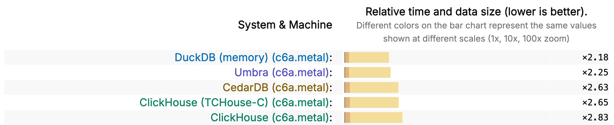

## 恭喜 DuckDB v1.4 拿下 ClickBench 排行榜第一名  
                                
### 作者                                
digoal                                
                                
### 日期                                
2025-10-11                               
                                
### 标签                                
PostgreSQL , PolarDB , DuckDB , tpch , ClickBench , OLAP数据库处理能力排行榜                       
                                
----                                
                                
## 背景    
恭喜 DuckDB v1.4 拿下 ClickBench 排行榜第一名.   
  
DuckDB v1.4 LTS 既快速又可扩展。在内存模式下，它是 ClickBench 上最快的系统。在基于磁盘的模式下，它可以在单台机器上对相当于 100 TB CSV 文件的数据集运行复杂的分析查询。  
  
截至 2025 年 10 月 9 日，DuckDB 在 ClickBench 数据库基准测试中排名第一：  
  
  
  
这一结果得益于DuckDB v1.4 中的几项性能优化。 详细介绍见: [《DuckDB 1.4.0 LTS 版解读!》](../202509/20250917_07.md)  [《DuckDB 1.4.0 新排序算法介绍(大幅性能提升)》](../202509/20250925_06.md)    
- Checkpointing In-Memory Tables  
- Sorting Rework  
- Materializing Common Table Expressions  
  
  
### TPC-H SF100,000  
DuckDB 不仅速度快，而且可扩展性强。最近在 SF100,000 数据集上运行了TPC-H query( https://duckdb.org/docs/stable/core_extensions/tpch.html )，该数据集相当于 100,000 GB 的 CSV 文件。  
  
在i8g.48xlarge EC2 实例上进行了实验，该实例拥有 1.5 TB RAM 和 192 个 CPU 核心（AWS Graviton4，Arm64）。该实例拥有 12 个 NVMe SSD 磁盘，每个磁盘大小为 3750 GB。我们用这些磁盘创建了一个 RAID-0 阵列，其中包含一个 45 TB 的分区，并使用XFS对其进行了格式化和优化配置( https://duckdb.org/docs/stable/guides/performance/environment.html#local-disk )。  
  
我们使用tpchgen-rs工具（TPC-H 生成器的纯 Rust 实现）生成数据集, 参考( [《tpchgen-rs, 居然比DuckDB还快!》](../202506/20250617_02.md)   )。生成 Parquet 文件块，并将其加载到 DuckDB 中。最终的 DuckDB 数据库大小约为 27 TB（单个文件大小！）。  
  
DuckDB 使用其超大内存处理能力完成了基准测试的全部 22 个查询。对于某些query，这需要将大约 7 TB 的数据溢出到磁盘, duckdb支持溢出内存的QUERY处理, 详见( https://duckdb.org/2024/07/09/memory-management.html )。查询运行时间中值为 1.19 小时，几何平均运行时间为 1.13 小时。  
    
期待DuckDB未来发布该实验的详细报告。  
    
#### [期望 PostgreSQL|开源PolarDB 增加什么功能?](https://github.com/digoal/blog/issues/76 "269ac3d1c492e938c0191101c7238216")
  
  
#### [PolarDB 开源数据库](https://openpolardb.com/home "57258f76c37864c6e6d23383d05714ea")
  
  
#### [PolarDB 学习图谱](https://www.aliyun.com/database/openpolardb/activity "8642f60e04ed0c814bf9cb9677976bd4")
  
  
#### [PostgreSQL 解决方案集合](../201706/20170601_02.md "40cff096e9ed7122c512b35d8561d9c8")
  
  
#### [德哥 / digoal's Github - 公益是一辈子的事.](https://github.com/digoal/blog/blob/master/README.md "22709685feb7cab07d30f30387f0a9ae")
  
  
#### [About 德哥](https://github.com/digoal/blog/blob/master/me/readme.md "a37735981e7704886ffd590565582dd0")
  
  

  
