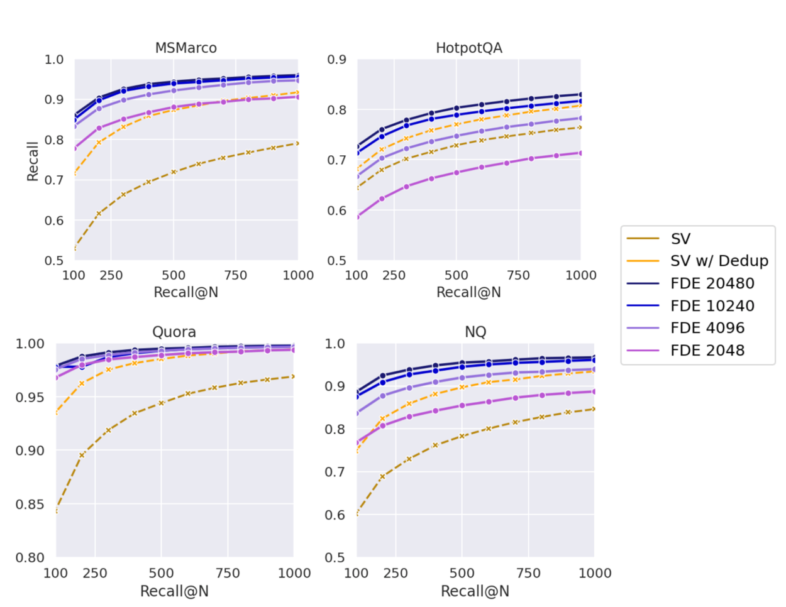

## 谷歌开源多向量近似计算高效算法和论文: MUVERA   
                                  
### 作者                                  
digoal                                  
                                  
### 日期                                  
2025-10-11                                 
                                  
### 标签                                  
PostgreSQL , PolarDB , DuckDB , embedding , 文本切片 , chunk embedding , token , token embedding , multi vector , MaxSim , 谷歌 , MUVERA , FDE , MIPS , 单向量点积 , 多向量相似度复杂计算 , vectorchord , milvus               
                                  
----                                  
                                  
## 背景      
关于多向量以及其应用场景, 在之前的文章中有过若干介绍:   
- [《什么是多向量(multi-vector)相似搜索?》](../202508/20250828_10.md)    
- [《不是混合搜索? 另一种解决方案提升向量搜索结果相关性! 使用 PostgreSQL vectorchord 多向量搜索 + ColBERT rerank 增强向量搜索相关性》](202508/20250827_05.md)    
  
简单回顾一下, 向量通常是文本、图片等物理世界在数字世界的高维空间中的多维数值(向量)描述, 通常在进行embedding(物理世界转数字世界向量表示)时, 例如是对一段文本(文本的切片,chunk)的转换.   
  
而实际上一段文本中又由更单一的token组成, 多向量可理解为对每个token都进行embedding, 综合多个embedding后的向量数组来表示一段文本.  
  
多向量包含更多的细节, 例如关键词可能通过多向量检索得到, 而单向量可能丢失其细节.   
  
抛开计算的复杂度和效率, 多向量搜索在召回率(相关性)方面明显优于单向量.   
  
市面上实现了多向量搜索的产品, 包括vectorchord, milvus等, 参考文档：  
- https://docs.vectorchord.ai/vectorchord/usage/indexing-with-maxsim-operators.html  
- https://milvus.io/docs/zh/multi-vector-search.md  
  
但是多向量的计算代价更高, 存储消耗的空间更多, 有什么好的解决方案呢?   
  
这就是本篇要介绍的, 谷歌开源了多向量近似计算高效算法和论文: MUVERA   
- 论文: https://arxiv.org/abs/2405.19504  
- 开源实现: https://github.com/google/graph-mining/tree/main/sketching/point_cloud  
  
以下内容来自如下文章:   
- https://research.google/blog/muvera-making-multi-vector-retrieval-as-fast-as-single-vector-search/  
  
# 谷歌开源多向量近似计算高效算法和论文: MUVERA  
  
**我们引入了 MUVERA，一种最先进的检索算法，它将复杂的多向量检索简化为单向量最大内积搜索。**  
  
[神经嵌入(embedding)](https://developers.google.com/machine-learning/crash-course/embeddings)模型已成为[现代信息检索(IR)](https://en.wikipedia.org/wiki/Information_retrieval)的基石。给定用户的查询（例如，“珠穆朗玛峰有多高？”），IR 的目标是从非常大的数据集合（例如，网络上数十亿的文档、图像或视频）中找到与查询相关的信息。嵌入模型将每个数据点转换为单向量“嵌入”，使得语义相似的数据点转换为数学相似的向量。通常通过[内积相似度](https://en.wikipedia.org/wiki/Inner_product_space#Euclidean_vector_space)来比较嵌入，从而通过优化的[最大内积搜索(MIPS) 算法](https://en.wikipedia.org/wiki/Maximum_inner-product_search)实现高效检索。  
  
然而，最近的进展，特别是像[ColBERT](https://www.answer.ai/posts/colbert-pooling.html)这样的多向量模型的引入，已经证明在 IR 任务中性能的显著提升。  
  
与单向量嵌入不同，多向量模型用一组嵌入(向量数组)来表示每个数据点(例如一段文本的切片, 包含很多标记(token))，并利用更复杂的相似性函数来捕捉数据点之间更丰富的关系。例如，最先进的多向量模型中使用的流行[Chamfer 相似性度量](https://www.sciencedirect.com/topics/engineering/chamfer-matching)可以捕捉一个多向量嵌入中的信息何时包含在另一个多向量嵌入中。虽然这种多向量方法提高了准确率并能够检索更相关的文档，但它带来了巨大的计算挑战。特别是，嵌入数量的增加和多向量相似性评分的复杂性使得检索成本显著增加。  
  
在[“MUVERA：通过固定维度编码实现多向量检索”](https://arxiv.org/abs/2405.19504)论文中，我们介绍了一种新颖的多向量检索算法，旨在弥合单向量检索和多向量检索之间的效率差距。我们通过构建查询和文档的 **固定维度编码 (FDE)** ，将多向量检索转化为一个更简单的问题。固定维度编码是单个向量，其内积近似于多向量相似度，从而将复杂的多向量检索简化为单向量最大内积搜索 (MIPS)。这种新方法使我们能够利用高度优化的 MIPS 算法检索一组初始候选集，然后可以使用精确的多向量相似度对其进行重新排序，从而在不牺牲准确性的情况下实现高效的多向量检索。我们在GitHub上提供了 [FDE 构建算法的开源实现](https://github.com/google/graph-mining/tree/main/sketching/point_cloud)。  
  
## 多向量检索的挑战  
多向量模型会为每个查询或文档生成多个嵌入，通常每个标记(token)一个嵌入。通常使用 Chamfer 匹配来计算查询和文档之间的相似度，该方法会测量每个`查询嵌入`与最接近的[`文档嵌入`](https://github.com/Yeema/ecommerce-review-score-classification/blob/master/resources/docs/TUTORIAL_5_DOCUMENT_EMBEDDINGS.md)之间的最大相似度，然后将所有查询向量的这些相似度相加（这是计算多向量相似度的标准方法）。因此，Chamfer 相似度可以“整体”地衡量**查询的每个部分**与**文档的某个部分**之间的关系。  
  
虽然多向量表示具有可解释性和泛化性等优点，但它们也带来了巨大的检索挑战：  
- **增加嵌入量** ：每个标记生成嵌入会大幅增加要处理的嵌入数量。  
- **复杂且计算密集的相似性评分** ：倒角匹配是一种非线性运算，需要矩阵积，这比计算[单个向量点积](https://en.wikipedia.org/wiki/Dot_product)更昂贵。  
- **缺乏高效的亚线性搜索方法** ：单向量检索得益于高度优化的算法（例如基于[空间分区](https://en.wikipedia.org/wiki/Space_partitioning)的算法），这些算法可以同时实现高精度和亚线性搜索时间，从而避免了**穷举比较**。多向量相似性的复杂性阻碍了这些快速几何技术的直接应用，从而阻碍了大规模高效检索。  
  
遗憾的是，传统的单向量 MIPS 算法无法直接应用于多向量检索 —— 例如，某个文档可能包含与单个查询标记高度相似的标记，但总体而言，该文档可能相关性不高。这个问题需要更复杂、计算量更大的检索方法。  
  
## MUVERA：具有固定维度编码的解决方案  
MUVERA 提供了一种优雅的解决方案，它将多向量相似性搜索简化为单向量 MIPS，从而显著加快对复杂多向量数据的检索速度。假设您有一个包含大量“多向量”（即向量数组）的数据集，其中每个多向量都描述某个数据点，但搜索每个多向量的速度非常慢。MUVERA 的诀窍是将整个多向量压缩成一个更易于处理的向量，我们称之为 **固定维编码(FDE)** 。关键在于，如果比较这些简化的 FDE，它们的结果与比较原始的、更复杂的多向量的结果非常接近。这让我们能够使用专为单向量设计的更快的搜索方法。  
  
以下是 MUVERA 工作原理的简化分解：  
- 1、 **FDE 生成** ：MUVERA 使用映射将查询和文档多向量转换为 FDE。这些映射旨在捕获固定长度向量中的基本相似性信息。  
- 2、 **基于 MIPS 的检索** ：使用标准 MIPS 求解器对文档的 FDE 进行索引。给定一个查询，计算其 FDE，然后 MIPS 求解器高效地检索最相似的文档 FDE。  
- 3、 **重新排序** ：使用原始的 Chamfer 相似度对 MIPS 检索到的初始候选者进行重新排序，以提高准确性。  
  
MUVERA 的一个关键优势在于 FDE 变换是数据无关的。这意味着它不依赖于特定的数据集，使其既能应对数据分布的变化，又适用于流式传输应用。此外，与模型生成的单向量不同，FDE 保证在指定的误差范围内近似真实的 Chamfer 相似度。因此，在重排序阶段(reranking)之后，MUVERA 保证能够找到最相似的多向量表示。  
  
    
  
*查询 FDE 构造示意图。每个标记（在本例中显示为一个单词）映射到一个高维向量（为简单起见，本例中为二维）。高维空间通过超平面切割随机划分。在输出 FDE 中，每个空间块都被分配一个坐标块，该坐标块设置为落在该块中的查询向量坐标之和。*  
  
    
  
*文档 FDE 构造的图示。该构造与查询构造相同，只是落在分区空间给定部分中的向量被取平均值而不是相加，这准确地捕捉到了 Chamfer 相似度的不对称性质。*   
  
## 理论基础  
我们的方法灵感源自[概率树嵌入（probability tree embeddings）](https://arxiv.org/abs/2111.03528)中使用的技术，它是几何算法理论中一个强大的工具。然而，我们调整了这些技术，使其能够处理内积和倒角相似性。  
  
**FDE 生成**的核心思想是将嵌入空间划分为多个部分（如上图所示）。如果查询和文档中的相似向量落入同一部分，我们就可以有效地近似它们的相似性。然而，由于我们事先不知道查询和文档向量之间的最佳匹配，因此我们使用了随机划分方案。  
  
我们还为 MUVERA 提供了理论保证，证明 FDE 能够提供对 Chamfer 相似度的强近似（您可以在[论文](https://arxiv.org/abs/2405.19504)中阅读更多内容）。这是一个重要的结果，因为它提供了一种使用单向量代理执行多向量检索的原则性方法，并且具有可证明的准确性。  
  
## 实验结果  
我们在[BEIR](https://arxiv.org/abs/2104.08663)基准测试的多个信息检索数据集上对 MUVERA 进行了评估。实验表明，与[之前最先进的方法PLAID](https://arxiv.org/pdf/2205.09707)相比，MUVERA 能够持续实现较高的检索准确率，同时显著降低延迟。  
  
我们的主要发现包括：  
  
**召回率提升** ： MUVERA 的表现优于单向量启发式方法（多向量检索中常用的方法，PLAID 也采用了这种方法），在显著减少候选文档数量的情况下实现了更高的召回率（如下图所示）。例如，FDE 的召回率固定，但检索的候选文档数量却减少了 5 到 20 倍。  
  
    
  
*回顾一下不同维度的固定维度编码 (FDE) 与单向量启发式 (SV) 的比较。需要注意的是，10240 维 FDE 的表示大小与原始向量表示（用于 SV 启发式）几乎相同，但搜索所需的比较次数却显著减少（即使对于 20k 维的 FDE 也是如此）。*  
  
**降低延迟** ：与基于单向量启发式算法的高度优化的多向量检索系统 PLAID 相比，MUVERA 在 BEIR 数据集上的召回率平均提升了 10%，同时延迟显著降低了 90%（如下图所示）。  
  
    
  
*MUVERA 与 PLAID 在 BEIR 基准上的比较。*  
  
此外，我们发现 MUVERA 的 FDE 可以使用乘积量化进行有效压缩，将内存占用减少 32 倍，同时对检索质量的影响最小。  
  
这些结果凸显了 MUVERA 显著加速多向量检索的潜力，使其更适合实际应用。  
  
## 结论  
我们提出了一种新颖高效的多向量检索算法 MUVERA，该算法对近似质量和良好的实际性能提供了可证明的保证。通过将多向量搜索简化为单向量 MIPS，MUVERA 利用现有的优化搜索技术，实现了最佳性能，并显著提高了效率。感兴趣的读者可以在[GitHub](https://github.com/google/graph-mining/tree/main/sketching/point_cloud)上找到我们 FDE 构造算法的开源实现。  
  
我们的工作为高效的多向量检索开辟了新的途径，这对于包括搜索引擎、推荐系统和自然语言处理在内的各种应用都至关重要。我们相信，对 MUVERA 的进一步研究和优化将带来更大的性能提升，并促进多向量检索技术的更广泛应用。  
  
## 致谢  
本博文中总结的工作是与 Majid Hadian、Jason Lee 和 Vahab Mirrokni 合作完成的。最后，感谢 Kimberly Schwede 对本博文动画制作的宝贵帮助。  
      
#### [期望 PostgreSQL|开源PolarDB 增加什么功能?](https://github.com/digoal/blog/issues/76 "269ac3d1c492e938c0191101c7238216")
  
  
#### [PolarDB 开源数据库](https://openpolardb.com/home "57258f76c37864c6e6d23383d05714ea")
  
  
#### [PolarDB 学习图谱](https://www.aliyun.com/database/openpolardb/activity "8642f60e04ed0c814bf9cb9677976bd4")
  
  
#### [PostgreSQL 解决方案集合](../201706/20170601_02.md "40cff096e9ed7122c512b35d8561d9c8")
  
  
#### [德哥 / digoal's Github - 公益是一辈子的事.](https://github.com/digoal/blog/blob/master/README.md "22709685feb7cab07d30f30387f0a9ae")
  
  
#### [About 德哥](https://github.com/digoal/blog/blob/master/me/readme.md "a37735981e7704886ffd590565582dd0")
  
  

  
