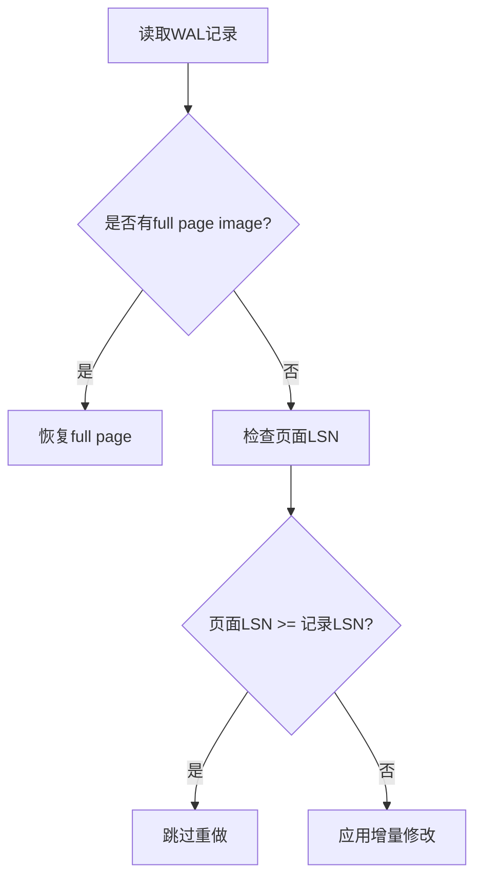

## PG Data Block中LSN的作用是什么?   
                                    
### 作者                                    
digoal                                    
                                    
### 日期                                    
2025-10-11                                   
                                    
### 标签                                    
PostgreSQL , PolarDB , DuckDB , page header , LSN , WAL record , WAL address , 增量备份 , 恢复               
                                    
----                                    
                                    
## 背景     
在PostgreSQL的Data Block头中, 包含LSN信息, 这个LSN是啥? 有什么用?  
  
LSN 可以简单理解为WAL record的寻址地址.  
  
当Data Block发生修改时, PG会生成该修改对应的WAL record, 并分配LSN. 同时在Block header写入对应的LSN.  
  
WAL 大家都懂的, 用于实现数据库的持久化、奔溃恢复、增量备份恢复、流复制、逻辑复制信息的存储解析和同步等.   
  
如何理解WAL的寻址? LSN地址是自增的. 简单理解就是每个wal文件多大, 根据epoch和每个wal文件的大小, 以及当前的LSN就可计算出对应的WAL文件名, 根据WAL文件名就可计算出这个文件包含什么LSN区间的数据.  
  
理解了LSN后, LSN有什么用呢?  
  
增量备份时: 例如上一次全量备份结束时记录的当时备份的WAL的最后一笔wal的最大LSN. 下次进行增量备份时, 检查data block header里的LSN是否大于这个LSN? 大于的话, 说明在上次全量备份后, 又对这个data block进行了修改, 所以这个数据块需要备份. 如果小于等于, 则不需要备份这个data block.  
   
而在恢复过程中“LSN检查”有两个不同场景：  
  
### 1. 一致性验证阶段   
在`xlogrecovery.c`中的LSN检查是用于**一致性验证**，而非决定是否重做  。这个检查发生在：  
- 已经应用了WAL记录的页面  
- 需要验证页面内容是否与WAL记录一致  
  
### 2. 重做决策阶段（实际的重做逻辑）  
真正的重做决策在`XLogReadBufferForRedo`函数中处理  ：  
  

  
## Full Page Write机制  
  
Full page write正是为了解决partial write问题  ：  
  
1. **触发时机**：checkpoint后第一次修改页面时  
2. **作用**：将整个页面内容写入WAL，而非仅记录增量修改  
3. **恢复时**：直接用full page image覆盖可能损坏的页面  
  
## 协同工作流程  
  
恢复时的完整流程：  
  
1. **读取WAL记录**，检查是否包含full page image  
2. **如果有full page image**：直接恢复整个页面，无需LSN检查  
3. **如果没有full page image**：  
   - 检查页面LSN是否 >= 记录LSN  
   - 如果是，说明修改已应用，跳过  
   - 如果否，应用增量修改  
  
## 关键点  
  
- **Full page write是预防措施**：确保checkpoint后的第一次修改能完全恢复页面  
- **LSN检查是优化措施**：避免重复应用已完成的修改  
- **两者不冲突**：full page write处理页面完整性，LSN检查处理重复应用问题  
  
这就是为什么即使有partial write的风险，LSN检查逻辑仍然有效的原因  。  
  
## Notes  
- LSN检查代码是在特定验证场景下，不是通用的重做决策逻辑  
- Full page write机制确保了即使发生partial write，也能从WAL中完全恢复页面  
- 实际的重做决策在XLogReadBufferForRedo函数中，会优先使用full page image  
  
  
  
  
    
#### [期望 PostgreSQL|开源PolarDB 增加什么功能?](https://github.com/digoal/blog/issues/76 "269ac3d1c492e938c0191101c7238216")
  
  
#### [PolarDB 开源数据库](https://openpolardb.com/home "57258f76c37864c6e6d23383d05714ea")
  
  
#### [PolarDB 学习图谱](https://www.aliyun.com/database/openpolardb/activity "8642f60e04ed0c814bf9cb9677976bd4")
  
  
#### [PostgreSQL 解决方案集合](../201706/20170601_02.md "40cff096e9ed7122c512b35d8561d9c8")
  
  
#### [德哥 / digoal's Github - 公益是一辈子的事.](https://github.com/digoal/blog/blob/master/README.md "22709685feb7cab07d30f30387f0a9ae")
  
  
#### [About 德哥](https://github.com/digoal/blog/blob/master/me/readme.md "a37735981e7704886ffd590565582dd0")
  
  

  
