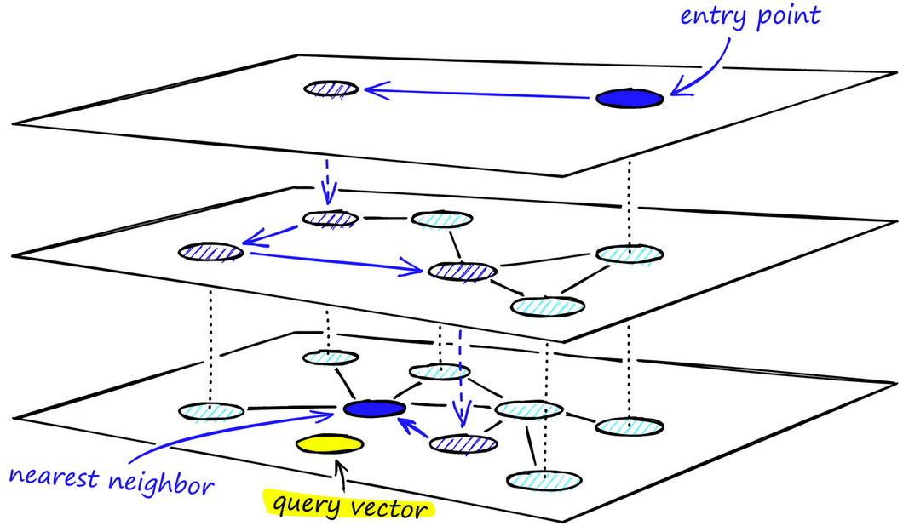

## VexDB Graph_Index 图索引原理与实践    
                                      
### 作者                                      
digoal                                      
                                      
### 日期                                      
2025-10-11                                     
                                      
### 标签                                      
PostgreSQL , PolarDB , DuckDB , VexDB , 向量 , 图索引 , HNSW , Graph_Index , 内存消耗               
                                      
----                                      
                                      
## 背景     
VexDB 是一款基于vastbase(来自`openGauss` <- `PG 9.x`)的向量数据库, 之前介绍过 [《在容器中体验VexDB!》](../202509/20250925_07.md) 以及其改良版的IVFPQ 索引(采用量化优化的IVFFlat).   
  
本文将继续介绍其改良过的HNSW图索引(主要是减少内存消耗), 在VexDB中叫作 Graph_Index.  
  
Graph_Index 索引通过构建一个多层次的图结构，利用图中节点的邻近关系，快速定位到离查询向量最近的向量节点。  
  
Graph_Index 是基于传统HNSW索引优化后得到的一种图索引，它解决了原生HNSW索引内存占用过高的问题。使用图索引的场景下，更推荐选择Graph_Index。  
  
HNSW的详细介绍可参考我之前写的论文解读和筑基课内容:   
- [《数据库筑基课 - 向量索引之 HNSW》](../202506/20250624_03.md)    
- [《AI论文解读 | Efficient and robust approximate nearest neighbor search using Hierarchical Navigable Small World graphs》](../202506/20250619_02.md)    
    
下面的内容主要来自VexDB手册关于Graph_Index的介绍  
- https://vexdb.com/docs/user-guide/graph_index    
  
## Graph_Index与原生HNSW  
传统的HNSW索引为了获得更好的查询性能，用更多的内存来存储额外的结构和信息，以实现快速且准确的近似最近邻搜索。例如：对于`1000w`数据量`1024`维索引，最低存储空间占用大小甚至高达`150GB`到`300GB`，因此，过高的内存占用是原生HNSW索引最显著的缺点。  
  
为了解决这一问题，Graph_Index从以下角度对原生HNSW进行了改良：  
  
1、引入缓存机制，大幅度降低了对机器规格的内存要求。  
  
使用[vector_buffers](https://vexdb.com/docs/user-guide/vector-guc#vector_buffers)存储向量部分的缓存数据，使用`shared_buffers`存储邻边关系和元数据等信息。向量索引上的增删改查操作均直接与缓存交互，不产生任何额外的内存申请消耗。  
  
个人猜测: 可简单理解为给每个向量分配了一个唯一ID(或直接使用heap ctid), 在`shared_buffer`中存储的是`ID`和`ID与ID的邻接关系(边)`. 向量的原始值则缓存在`vector_buffers`中. 因此搜索时更快、也更省内存? **问题是, 搜索时依旧要用原始向量值和目标向量值进行计算来求距离啊, 难道能真省内存?** 除非只存类似`VectorChord插件`用的残差量化值. 有没有知道内情的朋友可以透露一下?    
- [《残差矢量量化(RVQ) : 探索“神经音频编解码器”的核心技术》](../202508/20250827_04.md)   
- [《向量插件新贵 VectorChord(IVF+ RaBitQ量化), pgvector 和 milvus 都被秒杀了》](../202504/20250427_02.md)    
  
在同时使用多个向量索引的情况下，Graph_Index 能够根据使用情况分配不同大小的缓存给各个索引，有助于进一步减少资源占用。  
  
2、动态获取距离计算函数，根据当前机器架构选择最优计算指令集，不强制要求机器规格的指令集支持。  
  
并且，由于采取了向量的缓存措施，所有向量都有专门的内存对齐适配，进一步优化计算指令集使用，加速索引操作。  
  
## 原理介绍  
Graph_Index 通过构造多层图结构来近似表示数据的分布。每个节点代表一个数据点(embedding)，节点间连接的线表示数据点之间的相似性或距离( **疑问: 边的信息里有必要存距离吗? 因为搜索时要计算的是每个点与目标点的距离, 图中已存在的点与点之间的距离似乎并无作用!** 有没有知道内情的朋友可以透露一下? )。通过遍历这个图，我们可以快速找到与给定数据点相似的邻居。在图结构中进行最近邻查找，可以实现比聚类算法更高的查询加速比。  
  
### 搜索过程  
  
在创建索引时构建一个初始的图，然后随着向量数据的插入不断完善优化这个多层图结构，使得相似的数据点在图中更加接近。  
  
在搜索阶段，算法从顶层的起始点开始沿着图中的边逐步扩散，直到找到足够多的近似最近邻。  
  
1、顶层是查询的开始层，包含较少的节点，包含最长的链接。上层充当快速到达（接近）目标位置的导航，在深入更密集的更低层进行细致搜索之前，将搜索引导到更接近目标的位置。随着搜索向下层移动，链接长度变得越来越短，顶点数量越来越多。  
  
2、第一次搜索其邻居点，把它们按距离目标的远近顺序存储在定长的动态列表中(列表长度由参数`hnsw_ef_search`控制)。采用贪心算法, 之后的每一次查找，依次取出动态列表中的点，搜索其邻居点，将这些新探索的邻居点插入动态列表，每次插入动态列表时需要重新排序，保留前 N 个。如果列表有变化则继续查找，不断迭代直至达到稳态，然后以动态列表中的第一个点作为下一层的入口点，进入下一层。  
  
3、重复上述过程，在每一层使用贪心算法遍历完候选列表中的顶点以及它们的邻居点后，达到最底层(也就是0层)。我们将找不到比当前顶点更近的顶点，这是一个局部最小值，也是搜索的停止条件。  
  
  
  
### 多层图的构建过程  
个人理解: 下面描述的是图已经构成后的插入, 而不是创建索引时在内存中完成的构图过程. 在内存中构图速度更快, 不是逐点写入的方式. 当内存溢出时, 才会进入逐点写入的方式. 所以构建索引时, 内存足够大可以极大加速创建索引的过程.    
  
1、在图的构建过程中，向量逐个进行插入。向量在每一层的插入的概率由一个函数决定，对于每个层（除了第 0 层, 因为第0层也就是最底层包含了所有点, 因此不必计算概率, 或者说概率是100%），概率函数都会重复一次。将向量添加到其插入层以及下面的每一层。  
  
例如一个图有`0,1,2,3,4`几层, 顶层为`4`, 底层为`0`, 如果在插入点时, 通过概率函数算出来`4,3`层都不需要插入, `2`层需要插入, 那么这个点将插入到`2`及下面的所有层中, 即`2,1,0`这几层中.   
  
2、图的构建从顶层开始。在进入图之后，通过贪心算法遍历图，找到与我们插入的向量最近的 ef 个最近邻顶点，此时 ef = 1。  
  
3、在找到局部最小值（距离插入向量最近的连接顶点）之后，它转移到下一层（与搜索过程中所做的一样）。重复这个过程，直到到达我们选择的插入层(也就是第1步所说的概率函数认为这层要插入时)。这里开始了第二阶段的构建。(第二阶段要插入了, 所以会开始构图, 连线. 因此ef要发生变化, 也就是通过参数`ef_Construction`控制的值.)  
  
4、ef 值增加到 `ef_Construction`（索引构建参数），意味着将返回更多的最近邻顶点(和搜索过程一样, 使用贪心算法, 更新动态列表, 直到稳态.)。在第二阶段，这些最近邻顶点成为与新插入的元素 q 的链接的`候选顶点`，也是下一层的入口点。从这些候选顶点中选择`M`个最近邻作为链接顶点。 ( `M`指每个点在图中的最多边数, 如果因为插入导致某些点的边数超出, 可能还涉及切断原有连接的动作 ).   
  
5、经过多次迭代之后，当添加链接时，还会考虑参数 m（定义一个顶点可以拥有的最大链接数）。需要设置合适的 m 值以平衡搜索的召回率和性能。  
  
6、插入的停止条件是在第 0 层(图的最底层, 包含所有点)中找到局部最小值。    
  
## 索引参数  
### 索引构建参数  
参数名称 |	取值说明	| 参数描述  
---|---|---  
`m`	| 取值范围：`2~100` </br> 默认值：`16`	| 每个顶点/节点与其最近邻居的最大连接数。`m <= ef_construction`  
`ef_construction`	| 取值范围：`4~1000` </br> 默认值：`64`	| 控制索引构建过程中使用的候选列表的大小。  
`parallel_workers`	| 取值范围：`0~64` </br> 默认值：`0`	| 并行构建参数，构建索引并行计算线程数。  
  
### 查询参数  
参数名称	| 取值说明	| 参数描述  
---|---|---  
`hnsw_ef_search`	| 取值范围：`1~32767` </br>默认值：`100`	| 会话级参数，表示索引搜索过程中将考虑的最大候选邻居数。数值越高召回越精确，检索越慢。 </br> 实际生效值是`top-k`（查询的`limit n`）和`hnsw_ef_search`中更大的值。  </br> ( 个人备注: 是不是更小值? 各位可以试试. `hnsw_ef_search` 限制了更小值, 难道`limit N`还能得到更多记录? )  
  
### 索引构建操作符  
索引操作符	| 操作符描述  
---|---  
`floatvector_cosine_ops`	| 计算向量的余弦距离。  
`floatvector_l2_ops`	| 计算向量的欧几里得距离。  
`floatvector_ip_ops`	| 计算向量的内积。  
  
上述参数在索引构建阶段和向量查询阶段使用, 具体使用方式，可参考后面的使用示例。  
  
## 使用建议  
1、设置合适的 `maintenance_work_mem` 和 `max_process_memory` 值有利于加快索引构建速度，当 `maintenance_work_mem` 不能在索引`build`阶段容纳下所有向量值时, 会出现如下提示, 后续的向量将逐条插入图中, 速度会变得非常慢：  
```  
NOTICE: hnsw graph no longer fits into maintenance_work_mem after XXXXX tuples    
DETAIL: Building will take significantly more time.    
HINT: Increase maintenance_work_mem to speed up builds  
```  
  
2、但是也注意不要将 `maintenance_work_mem` 设置得太高，以免耗尽服务器的内存。  
  
3、`max_process_memory` 参数必须大于 `maintenance_work_mem`。  
  
4、建立索引后如果数据变化（删除、更新）较多， 死元组数大于候选队列数，可能导致查询结果变少，建议每更新 `40%~60%` 数据重建一次索引。  
  
(图索引维护成本太高, 插入时可能不会判断dead tuple是否有效, vacuum过程时也不会对图进行实时重构, 仅仅清理垃圾.)  
  
5、当需要提升索引构建速度， 可以适当增大 `parallel_workers`，建议设置为机器CPU核数的 `75%` ，最大值 `64`。  
  
6、当需要提升查询召回率时， 可考虑以下措施：  
- 适当增大 `m`，`m` 越大, 越有利于提高召回率，构建索引越慢，查询越慢，插入索引速度越慢。  
- 增大 `ef_construction`，`ef_construction` 越大, 越有利于提高召回率，构建索引越慢，插入索引速度越慢。  
- 增大 `hnsw_ef_search`，`hnsw_ef_search`越大，召回率越高但相应的查询延时会变高。  
  
7、如果向量检索时，查询未按照预期走索引，请参考[向量查询不走索引](https://vexdb.com/docs/user-guide/vector-faq#%E5%90%91%E9%87%8F%E6%9F%A5%E8%AF%A2%E4%B8%8D%E8%B5%B0%E7%B4%A2%E5%BC%95)中介绍的内容进行排查，确认查询是否满足走索引的条件。  
  
## 使用示例  
1、数据准备：创建生成随机向量的函数。  
```  
CREATE OR REPLACE FUNCTION random_array(dim integer,min_value int, max_value int)  
RETURNS text  
AS $$  
SELECT REGEXP_REPLACE(REGEXP_REPLACE(array_agg(round(random()* (max_value - min_value + 1) + min_value,3))::text,'{','['),'}',']')  
FROM generate_series(1, dim);  
$$  
LANGUAGE SQL  
VOLATILE  
COST 1;  
```  
  
2、创建含向量类型字段的测试表，并插入测试数据。  
```  
drop table if exists t_1194690;  
CREATE TABLE t_1194690(id BIGINT, v floatVECTOR(15));  
INSERT INTO t_1194690 SELECT i, random_array(15,1,3)::floatvector(15) FROM generate_series(1, 10000) AS i;  
```  
  
3、创建graph_index索引, 根据查询算法的需要选择创建。  
  
- 按余弦距离构建索引：  
```  
CREATE INDEX idx_1194690a ON t_1194690 USING graph_index(v floatvector_cosine_ops)  
WITH(m=16,ef_construction=64, parallel_workers=1);  
```  
  
- 按欧几里得距离构建索引：  
```  
CREATE INDEX idx_1194690b ON t_1194690 USING graph_index(v floatvector_l2_ops)  
WITH(m=16,ef_construction=64, parallel_workers=1);  
```  
  
- 按内积构建索引：  
```  
CREATE INDEX idx_1194690c ON t_1194690 USING graph_index(v floatvector_ip_ops)  
WITH(m=16,ef_construction=64, parallel_workers=1);  
```  
  
4、进行向量相似性搜索。  
  
设置查询参数：  
```  
set hnsw_ef_search = 100;  
```  
  
- 按余弦距离排序：  
```  
SELECT * FROM t_1194690   
ORDER BY v <=> '[1.0,1.0,1.0,1.0,1.0,1.0,1.0,1.0,1.0,1.0,1.0,1.0,1.0,1.0,1.0]'::floatvector  
LIMIT 10;  
```  
  
- 按欧几里得距离排序：  
```  
SELECT * FROM t_1194690   
ORDER BY v <-> '[1.0,1.0,1.0,1.0,1.0,1.0,1.0,1.0,1.0,1.0,1.0,1.0,1.0,1.0,1.0]'::floatvector  
LIMIT 10;  
```  
  
- 按内积排序：  
```  
SELECT * FROM t_1194690   
ORDER BY v <#> '[1.0,1.0,1.0,1.0,1.0,1.0,1.0,1.0,1.0,1.0,1.0,1.0,1.0,1.0,1.0]'::floatvector  
LIMIT 10;  
```  
      
#### [期望 PostgreSQL|开源PolarDB 增加什么功能?](https://github.com/digoal/blog/issues/76 "269ac3d1c492e938c0191101c7238216")
  
  
#### [PolarDB 开源数据库](https://openpolardb.com/home "57258f76c37864c6e6d23383d05714ea")
  
  
#### [PolarDB 学习图谱](https://www.aliyun.com/database/openpolardb/activity "8642f60e04ed0c814bf9cb9677976bd4")
  
  
#### [PostgreSQL 解决方案集合](../201706/20170601_02.md "40cff096e9ed7122c512b35d8561d9c8")
  
  
#### [德哥 / digoal's Github - 公益是一辈子的事.](https://github.com/digoal/blog/blob/master/README.md "22709685feb7cab07d30f30387f0a9ae")
  
  
#### [About 德哥](https://github.com/digoal/blog/blob/master/me/readme.md "a37735981e7704886ffd590565582dd0")
  
  

  
