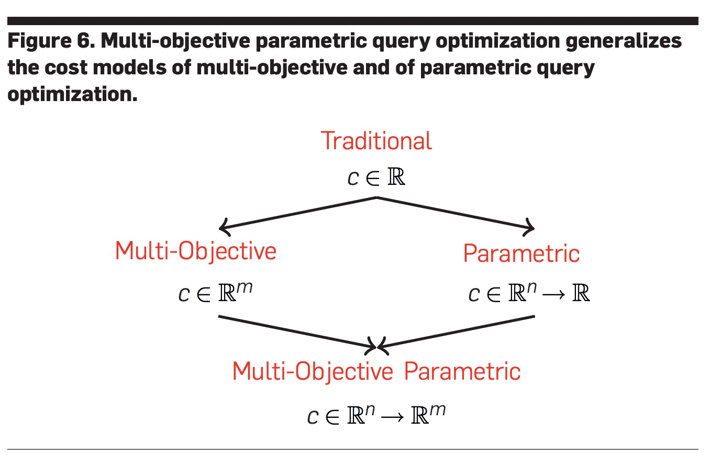
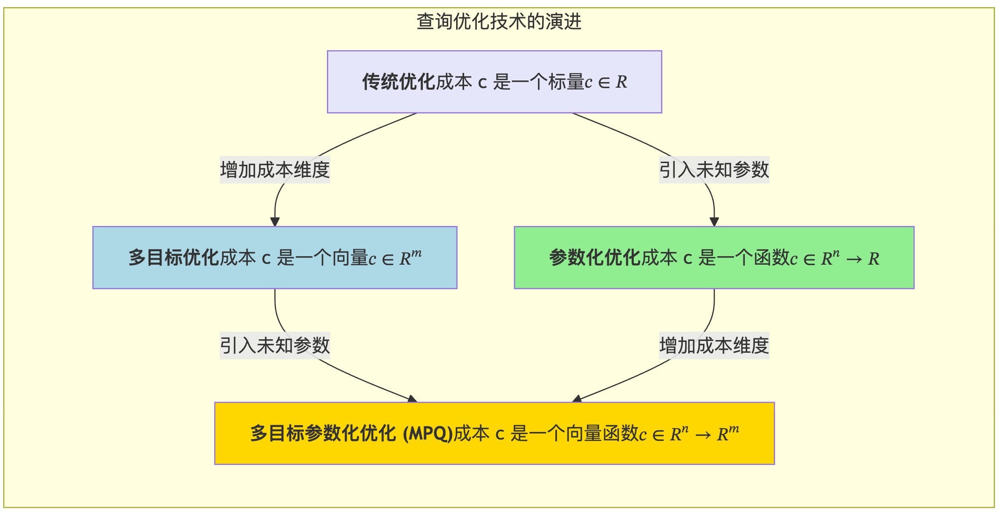
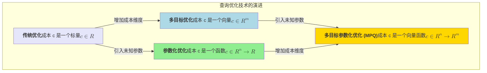
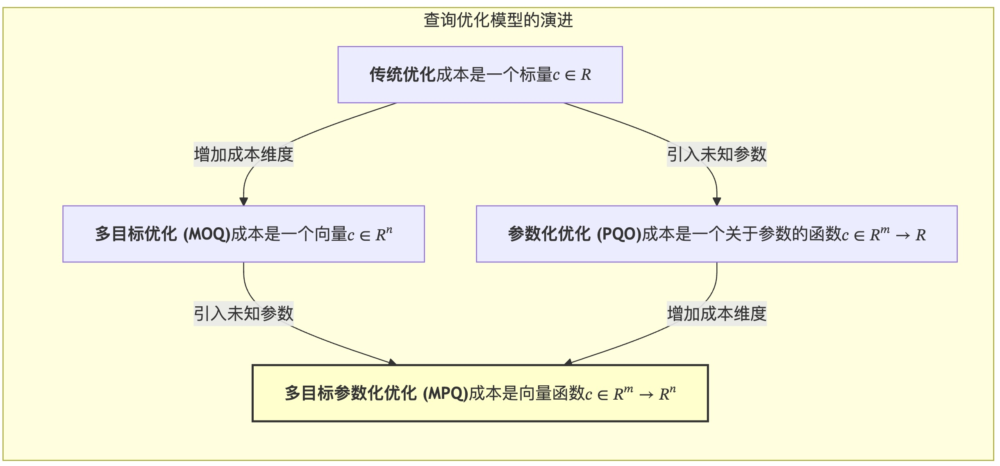
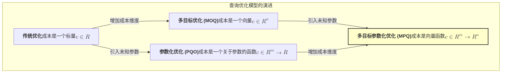
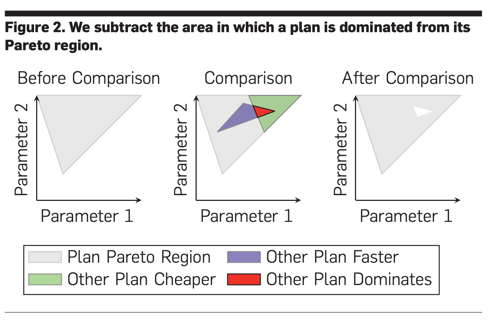
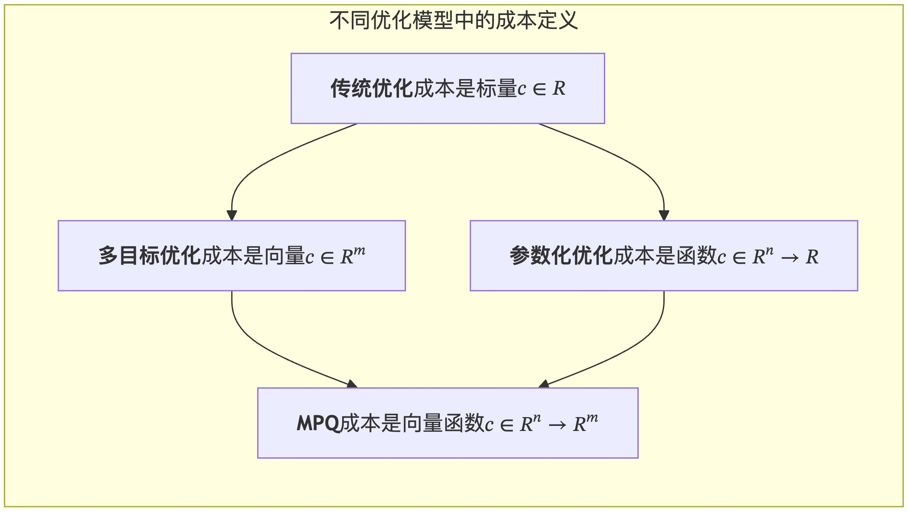

## AI论文解读 | Multi-Objective Parametric Query Optimization
        
### 作者        
digoal        
        
### 日期        
2025-10-11        
        
### 标签        
PostgreSQL , PolarDB , DuckDB , AI , 论文解读        
        
----        
        
## 背景  
      
https://dl.acm.org/doi/pdf/10.1145/3068612        
  
提示:          
```          
读懂《Multi-Objective Parametric Query Optimization》这篇论文需要提前掌握哪些基础知识, 请使用中文通熟易懂的讲解这些基础知识, 可以引用论文中的图、表或使用Markdown支持的图形(text,mermaid等)增加解释性. 
  
使用中文通熟易懂的解读《Multi-Objective Parametric Query Optimization》这篇论文, 其中的关键内容请着重讲解, 可以引用论文中的图、表或使用Markdown支持的图形(text,mermaid等)增加解释性. 
  
提取《Multi-Objective Parametric Query Optimization》这篇论文中的重要术语, 使用中文对这些术语进行通熟易懂的讲解, 可以引用论文中的图、表或使用Markdown支持的图形(text,mermaid等)增加解释性. 
```     
  
## 1 前置知识 
  
好的，为了读懂《Multi-Objective Parametric Query Optimization》这篇论文，我们需要掌握一些数据库、算法和数学方面的基础知识。下面我将用通俗易懂的中文，结合论文中的图表和例子来为你讲解这些概念。

我们可以把理解这篇论文的过程想象成学习一种高级的“地图规划”技术。

### 1\. 基础知识：什么是数据库查询优化？

**通俗理解：**
想象一下，你用地图App规划从家到公司的路线。你只输入了起点和终点，App内部会做什么呢？它会考虑所有可能的路线（走高架、走地面、坐地铁、组合方式等），然后根据你选择的偏好（如“时间最短”或“花费最少”）推荐一条最佳路线。

数据库查询优化（Query Optimization）做的就是类似的事情 。

  * **查询 (Query):** 你用SQL语言告诉数据库“我想要什么数据”，这就像输入起点和终点 。
  * **查询计划 (Query Plan):** 数据库内部为了获取这些数据而制定的具体执行步骤。比如是先合并两张大表格再筛选，还是先各自筛选完再合并？不同的步骤效率天差地别 。这就像地图App规划出的具体路线方案。
  * **成本 (Cost):** 评价一个查询计划好坏的标准，传统上主要指**执行时间** 。成本最低的计划，就是“最优”计划 。

**这篇论文的核心，就是对传统的“最优”二字提出了更复杂、更现代化的定义。**

### 2\. 核心知识一：多目标优化 (Multi-Objective Optimization)

**通俗理解：**
在规划路线时，你可能不只关心“时间”，还关心“金钱”（比如打车费、油费）。一个方案可能是时间最短但花费最高（打车），另一个可能是花费最少但时间最长（公交+步行）。这时，就不存在一个唯一的“最优”方案了。

多目标优化研究的就是这种需要在**多个冲突的目标之间做权衡**的问题 。

  * **目标 (Objective):** 论文中明确提到的目标是**执行时间 (execution time)** 和 **金钱开销 (monetary execution fees)** 。其他场景还可能包括能耗、结果精度等 。

  * **帕累托最优 (Pareto Optimal):** 这是多目标优化中的核心概念。一组解（查询计划）被称为帕累托最优解，指的是对于其中任何一个解，都**不可能在不牺牲任何一个目标的情况下，让另一个目标变得更好** 。

    > 例如，我们有三个计划：

    >   * 计划A：耗时10分钟，花费30元。
    >   * 计划B：耗时15分钟，花费15元。
    >   * 计划C：耗时12分钟，花费35元。

    > 在这里，计划A和B都是帕累托最优的。因为要想从A变得像B一样省钱，就必须牺牲时间；反之亦然。但是计划C就不是帕累托最优的，因为它在时间和金钱上都比计划A要差（被计划A“支配”了），所以计划C会被直接淘汰。

多目标优化的目标是找到所有帕累托最优的计划，形成一个“最优集”，让用户根据自己的偏好在运行时进行选择 。

### 3\. 核心知识二：参数化优化 (Parametric Optimization)

**通俗理解：**
继续规划路线，但这次你是在前一天晚上规划第二天的路线。此时一个关键信息是**未知**的：第二天的路况（堵不堵车）。这个“路况拥堵指数”就是一个**参数 (Parameter)** 。

由于这个参数的存在，任何一条路线的执行时间都不再是一个固定的值，而是一个**关于“路况”的函数** 。

  * **参数 (Parameter):** 论文中提到的参数包括云服务（如亚马逊EC2）的**实时价格** ，或者查询语句中某个过滤条件的**选择性**（即能过滤掉多少数据）。这些值在优化时是未知的，只有在运行时才能确定 。
  * **成本函数 (Cost Function):** 计划的成本不再是一个数值，而是一个从参数到成本的函数，例如 $成本 = f(参数)$ 。
  * **目标：** 参数化优化的目标不是立即找出一个最优计划，而是预先计算出一个**备选计划集**。这个集合能保证，**无论未来参数的具体值是多少，最优的那个计划一定能在这个集合里找到** 。这样，在运行时，一旦我们知道了参数的实际值（比如看到了实时路况），就可以非常快地从这个小集合里选出最优方案，避免了在运行时进行复杂且耗时的重新优化 。

### 4\. 终极概念：多目标参数化查询优化 (MPQ)

MPQ (Multi-Objective Parametric Query Optimization) 就是将上述两种思想结合起来的产物 。

**通俗理解：**
你需要在**前一天晚上**，为第二天的出行规划**一组备选方案**。这组方案需要满足：无论第二天 **实际路况（参数）** 如何，它都能提供在 **时间和金钱（多目标）** 上的所有帕累托最优选择。

  * **问题模型：** 在MPQ中，一个查询计划的成本是一个**向量函数**，它把代表未知信息的**参数空间**映射到代表多个性能指标的**成本空间** 。
  * **目标：** 找到一个计划集合，这个集合包含了在**任何可能参数组合**下的所有**帕累托最优**计划 。

论文中的 **图6** 非常清晰地展示了这几种查询优化技术的演进关系：      
````

````

*引自论文中的图6 ，这是一个更直观的表示。*

### 5\. 理解算法所需的基础

为了解决这个复杂的MPQ问题，论文提出了一种算法，要理解它，你需要了解：

  * **动态规划 (Dynamic Programming):** 这是一种经典的算法思想，通过将大问题分解成小问题来求解。在查询优化中，一个对多个表进行连接的复杂查询，可以被分解为对两个表连接的子查询。算法首先找到子查询的“最优计划集”，然后基于这些解来构建更复杂查询的解 。这被称为“最优性原则” 。
  * **分段线性函数 (Piecewise-linear Functions):** 论文假设成本函数是“分段线性”的 。这意味着函数图像是由多段直线组成的，就像出租车的计价规则。这种函数形式既能较好地逼近现实世界中的复杂成本模型，又在数学上相对容易处理 。
  * **凸多面体 (Convex Polytopes):** 在二维空间中，这可以理解为由若干条直线围成的凸多边形（如三角形、矩形）。在多维参数空间中，它是由一组线性不等式定义的区域 。论文用这个数学工具来划分参数空间，在每个划分出的“区域”内，成本函数的性质（比如是否线性）是确定的，从而简化了计划之间的比较 。算法的核心操作之一，就是判断在参数空间的哪个区域内，一个计划比另一个计划更优。

### 总结

要读懂这篇论文，你需要按以下顺序建立认知：

1.  **理解基础**：明白什么是数据库查询优化，即为一条SQL查询找到最高效的执行方案。
2.  **掌握核心扩展**：
      * **多目标**：意识到评判“高效”的标准不止一个（如时间和金钱），需要找到所有“不被碾压”的帕累托最优方案。
      * **参数化**：意识到“高效”的评估还依赖于一些未知信息（参数），因此需要找到一个在所有参数下都表现优异的备选方案集。
3.  **融合概念**：将“多目标”和“参数化”结合，理解MPQ的目标是在充满未知参数的环境下，预先计算出满足多目标帕累托最优的完整计划集。
4.  **了解算法工具**：对动态规划、分段线性函数和凸多面体等数学和算法工具有一个基本的概念，知道它们是用来解决这个复杂问题的武器。

有了这些知识储备，你就能更好地理解论文提出的问题背景、挑战以及其解决方案的精妙之处。
  
## 2 解读论文 
  
好的，这篇名为《Multi-Objective Parametric Query Optimization》（多目标参数化查询优化）的论文，提出了一种“升级版”的数据库查询优化方法，以适应现代云计算和大数据处理的需求。

简单来说，传统的数据库查询优化就像一个只会用“最快路线”导航的地图App。但这篇论文认为，现代用户需要的导航App应该更智能：

1.  **支持多目标 (Multi-Objective)**：不仅要考虑“时间”，还要考虑“费用”、“路况”等多个因素，并给出不同的权衡方案（比如“最快但不差钱”方案和“最省钱但耗时”方案）。
2.  **支持参数化 (Parametric)**：能够应对未知情况。比如在出发前就规划好路线，但此时并不知道第二天的实时路况（一个未知的“参数”）。App需要能给出一个备选计划集，无论第二天路况如何，最佳路线都在其中。

这篇论文提出的 **多目标参数化查询优化（MPQ）** ，就是这样一个能同时处理**多个优化目标**和**未知参数**的“高级导航算法”。

下面我们来深入解读其关键内容。

### 1\. MPQ要解决的核心问题：传统优化的局限性

传统的查询优化模型诞生于上世纪70年代，它有两个基本假设 ：

  * **单一成本指标**：评价一个查询计划（执行方案）好坏的标准只有一个，通常是执行时间 。
  * **信息完全已知**：在优化时，所有用于估算成本的信息都是已知的 。

然而，在现代数据处理平台（如云计算环境）中，这两个假设常常不成立 。

  * **多重成本考量**：在云上执行查询，我们不仅关心**执行时间**，还关心**金钱花费** 。有时还需要在**结果精度**和执行时间之间做权衡 。
  * **信息充满未知**：很多信息在优化时是未知的，例如云服务的**实时价格**（可能随时波动）、查询模板中未指定谓词的**选择性**（过滤数据的能力）等 。这些未知信息就是“参数”。

因此，MPQ要解决的，就是在一个**多成本维度**和**多未知参数**共存的环境下，如何为一条查询找到所有“可能最优”的执行计划 。

### 2\. MPQ模型：一个更通用的优化框架

MPQ通过将一个查询计划的成本建模为一个**从参数空间映射到成本空间的向量函数**（ $c \in \mathbb{R}^{m} \rightarrow \mathbb{R}^{n}$ ），概括了多种优化问题 。

论文中的图6非常清晰地展示了MPQ与其他优化变体的关系，我们可以用下面的Mermaid图来重现这个逻辑：     
````

````

*该图根据论文图6绘制*

  * **传统优化**：成本是一个固定的数值 。
  * **多目标优化**：成本是一个向量，每个分量代表一个成本指标（如[时间, 金钱]） 。目标是找到所有**帕累托最优**的计划（即没有其他计划在所有指标上都比它好） 。
  * **参数化优化**：成本是一个函数，其值依赖于未知的参数 。目标是找到一个计划集，确保对任何参数值，最优计划都在其中 。
  * **MPQ**：集大成者，同时处理多目标和多参数 。其目标是找到一个计划集，该集合包含**对于任何可能的参数组合**下的**所有帕累托最优计划** 。

### 3\. 核心算法：基于动态规划和“区域剪枝”

论文提出的算法基于经典的**动态规划 (Dynamic Programming)** 思想 。它将一个大查询递归地分解成子查询，先计算出子查询的所有相关计划，然后通过组合这些子计划来构建更大查询的计划 。

该算法最核心的创新在于其**剪枝 (Pruning) 机制**，即如何比较和淘汰“差”的计划 。

#### 关键概念：帕累托区域 (Pareto Region)

算法为每个查询计划P关联一个“帕累托区域” 。这个区域是参数空间中的一块地方，代表了**在该区域内的任何参数取值下，计划P都是帕累托最优的** 。如果一个计划的帕累托区域变为空集，意味着它在任何参数下都不是最优的，可以被安全地丢弃 。

#### 剪枝过程

剪枝通过计划之间的两两比较来不断压缩各自的帕累托区域 。

1.  **初始状态**：一开始，算法假设每个计划在整个参数空间内都是最优的，即它们的帕累托区域是全部参数空间 。
2.  **比较与削减**：当比较计划P1和P2时，算法会计算出一个区域X，在这个区域内P1在所有成本指标上都优于或等于P2（即P1“支配”P2） 。然后，就从P2的帕累托区域中“挖掉”区域X 。
3.  **淘汰**：如果某个计划的帕累托区域被挖空了，它就会被淘汰 。

论文中的**图2**直观地展示了这个过程：    

*图片来源于论文中的图2，展示了一个计划（灰色区域）在与另一个计划比较后，其帕累to区域被削减的过程 。*

为了实现这些操作，算法将成本函数建模为**分段线性函数** ，并将帕累托区域表示为**凸多面体 (convex polytopes) 的并集和差集** 。所有这些区域的计算和判断（如判断区域是否为空）都通过**线性规划 (Linear Programming)** 来解决 。

### 4\. 颠覆性的发现：MPQ不同于PQO

一个非常关键的理论发现是：参数化查询优化（PQO）中一条非常重要的“指导原则” **在MPQ中失效了** 。

  * **PQO的指导原则**：在一个凸多面体参数区域（比如一个区间或一个多边形）的**所有顶点**上，如果都是同一个计划最优，那么在这个区域**内部**所有点上，也一定是这个计划最优 。这使得很多PQO算法可以通过只检查顶点来简化问题 。

  * **MPQ的反例**：论文在**图4**中给出了一个反例，证明了上述原则在MPQ中不成立 。

  

*图片来源于论文中的图4 。*

在这个例子中：

  * 有两个成本目标（费用Fees和时间Time）和一个参数 。
  * 在参数区间的两个端点（参数值为0和2）上，都是计划1和计划3构成了帕累托最优集，而计划2都不是最优的 。
  * 然而，在区间的**内部**（例如0.5到1.5之间），计划2**却是帕累托最优的** 。

这个反例说明，**我们不能再通过只检查区域边界来推断内部的最优情况** 。因此，MPQ是一个比PQO更复杂的问题，必须使用像本文提出的这种全新的算法来解决 。

### 5\. 实验与性能

论文通过实验评估了算法的性能 。

  * **实验设置**：场景为云端SQL查询，优化目标是**执行时间**和**金钱花费** 。参数是查询谓词的**选择性** 。测试了两种典型的查询类型：链式查询 (chain queries) 和星型查询 (star queries) 。
  * **核心结论**：
      * **优化时间**：随着查询复杂性（表的数量）和参数数量的增加而增加，这符合理论预期 。星型查询由于其更复杂的连接可能性，优化时间增长更快 。
      * **可接受的成本**：虽然MPQ的优化时间远超传统优化，但它是一个 **预处理（或离线）** 步骤 。真正的计划选择在运行时会非常快 。因此，在运行前花费更长的时间进行优化是可以接受的 。

### 总结

《Multi-Objective Parametric Query Optimization》这篇论文做出了以下关键贡献：

1.  **定义了新问题**：首次提出并形式化了MPQ问题，精准地捕捉了现代数据处理平台中多成本权衡和信息不确定的双重挑战 。
2.  **提出了新算法**：设计了一种基于动态规划和新颖的“帕累托区域”剪枝机制的算法，能够有效求解MPQ问题 。
3.  **揭示了新特性**：证明了MPQ问题在性质上与之前的变体有根本不同（指导原则失效），凸显了开发新算法的必要性 。

总而言之，这篇论文为数据库查询优化领域开辟了一个新的、更符合时代需求的方向，并为其提供了坚实的理论基础和首个可行的解决方案。
  
## 3 术语 
  
好的，以下是论文《Multi-Objective Parametric Query Optimization》中的核心术语及其通俗易懂的中文讲解。

### 1\. 多目标参数化查询优化 (Multi-Objective Parametric Query Optimization, MPQ)

  * **通俗讲解**：这是一种“高级版”的数据库查询优化技术 。传统的查询优化好比一个只会按“时间最短”这单一标准来规划路线的导航软件 。MPQ则更强大，它像一个智能出行助手，能同时处理：

      * **多目标**：不仅考虑时间，还考虑费用、能耗等多个因素 。
      * **参数化**：能应对未知情况，比如在规划时还不知道第二天的实时路况（参数）。
        MPQ的目标是在充满未知参数的环境下，为用户预先计算出一整套包含了所有最佳权衡方案的“备选计划” 。

  * **论文定义**：MPQ是一种广义的查询优化问题，它根据多个执行成本指标来比较查询计划 ，并且将那些影响计划成本的未知信息建模为参数 。一个MPQ问题由查询q、参数空间X和成本空间C定义 。

### 2\. 查询计划 (Query Plan)

  * **通俗讲解**：当你向数据库请求数据时（例如，执行一条SQL语句），数据库内部为了完成这个任务而制定的具体“行动方案”或“执行步骤” 。比如，是先连接两张表再筛选数据，还是先筛选完再连接，这些不同的执行顺序和方法就是不同的查询计划 。

  * **论文定义**：查询计划描述了如何生成数据 。对于一个给定的查询q，所有能生成该查询所需数据的备选计划集合表示为 $P(q)$ 。

### 3\. 成本指标 (Cost Metrics) 与 成本向量 (Cost Vector)

  * **通俗讲解**：

      * **成本指标**：评价一个查询计划好坏的“维度” 。例如执行时间、金钱花费、能耗等都是不同的成本指标 。
      * **成本向量**：将一个计划在所有成本指标上的得分组合在一起，形成一个向量 。例如，一个计划的成本向量可能是 `[10秒, 5元]`，代表它耗时10秒，花费5元。

  * **论文定义**：MPQ会根据多个执行成本指标来比较计划 。每个计划都与一个成本向量 $c \in \mathbb{R}^{m}$ 相关联，其中m是成本指标的数量 。

### 4\. 参数 (Parameters) 与 参数空间 (Parameter Space)

  * **通俗讲解**：

      * **参数**：在进行优化时，那些会影响计划成本但其具体数值未知的变量 。例如，云服务的实时价格、用户查询条件的过滤能力（选择性）等 。
      * **参数空间**：所有这些未知参数可能取值的集合 。如果只有一个参数，参数空间就是一条线；如果有两个参数，参数空间就是一个平面。

  * **论文定义**：参数代表了在优化时尚未获得的信息 。所有可能的参数值向量的集合构成了n维参数空间 $X \subset \mathbb{R}^{n}$ 。

### 5\. 成本函数 (Cost Function)

  * **通俗讲解**：由于成本依赖于未知的参数，所以一个计划的成本不再是一个固定的值，而是一个函数 。这个函数描述了**输入**不同的参数值，会**输出**怎样的成本 。

  * **论文定义**：在MPQ中，每个查询计划p都关联一个成本函数 $c_p: X \rightarrow C$ ，它将n维的参数空间映射到m维的成本空间 。论文主要研究**分段线性 (piecewise-linear)** 成本函数 。
    下面的Mermaid图清晰地展示了不同优化模型中成本的定义：

    ````
    ```mermaid
    graph TD
        subgraph "不同优化模型中的成本定义"
            A[" <b>传统优化</b><br>成本是标量<br> $$c \in \mathbb{R}$$ "]
            B[" <b>多目标优化</b><br>成本是向量<br> $$c \in \mathbb{R}^{m}$$ "]
            C[" <b>参数化优化</b><br>成本是函数<br> $$c \in \mathbb{R}^{n} \rightarrow \mathbb{R}$$ "]
            D[" <b>MPQ</b><br>成本是向量函数<br> $$c \in \mathbb{R}^{n} \rightarrow \mathbb{R}^{m}$$ "]
        end
        A --> B; A --> C;
        B --> D; C --> D;
    ```
    ````

         

    *该图根据论文图6绘制*

### 6\. 支配 (Dominates) 与 帕累托最优 (Pareto-Optimal)

  * **通俗讲解**：在多目标场景下比较两个计划好坏的规则。

      * **支配**：如果计划A在**所有**成本指标上都比计划B好或相等（至少有一个指标更好），我们就说“计划A支配了计划B” 。被支配的计划B就是个“差”计划，可以被淘汰。
      * **帕累托最优**：一个计划如果没有被任何其他计划所支配，那它就是“帕累托最优”的 。这些计划都是“好”的候选计划，它们各有优劣，提供了不同的成本权衡。

  * **论文定义**：对于一个特定的参数值向量x，如果计划 $p_1$ 在每个成本指标上都比 $p_2$ 的成本低或相等，则称 $p_1$ 支配 $p_2$ ，记为 $p_1 \le_{x} p_2$ 。MPQ的目标是找到对于每个可能的参数值组合都处于帕累托最优状态的计划集 。

### 7\. 帕累托区域 (Pareto Region)

  * **通俗讲解**：这是本论文算法中的一个核心创新概念 。它指的是参数空间中的一块“地盘”，在这块地盘里的任何参数取值下，某个特定的查询计划都是帕累托最优的 。

  * **论文定义**：每个查询计划都关联一个帕累托区域，即它能够实现帕累托最优成本权衡的参数空间区域 。如果一个计划的帕累托区域变为空集，那么它就是不相关的 (irrelevant)，可以被丢弃 。

### 8\. 剪枝 (Pruning)

  * **通俗讲解**：在生成了大量候选计划后，需要一个“筛选淘汰”的过程来去除那些明显不好的计划，这个过程就叫剪枝 。论文算法的剪枝核心就是通过不断比较计划，来压缩和更新每个计划的“帕累托区域” 。

  * **论文定义**：剪枝的目标是识别并丢弃不相关的计划 。算法通过两两比较计划，确定一个计划支配另一个计划的参数区域，然后从被支配计划的帕累托区域中减去该区域 。论文中的**图2**直观地展示了这一过程。    
    *该图源自论文图2，左图为一个计划的初始帕累托区域，中图显示了它被另一个计划支配的区域（红色部分），右图为剪枝后被削减的帕累-托区域。*

### 9\. 凸多面体 (Convex Polytope)

  * **通俗讲解**：一个几何形状。在二维空间里，可以想象成一个凸多边形（如三角形、矩形）；在三维空间里，就是立方体、金字塔等。在更高维度的参数空间中，它是由一组线性不等式围成的一个“凸区域” 。

  * **论文定义**：凸多面体由一组线性不等式定义 。在论文的算法中，它被用来表示参数空间中的区域。例如，分段线性成本函数在每一个“段”内都是线性的，而这些“段”对应的参数区域就是凸多面体 。算法中的“帕累托区域”也被表示为凸多面体的并集与差集 。
  
## 参考        
         
https://dl.acm.org/doi/pdf/10.1145/3068612    
        
<b> 以上内容基于DeepSeek、Qwen、Gemini及诸多AI生成, 轻微人工调整, 感谢杭州深度求索人工智能、阿里云、Google等公司. </b>        
        
<b> AI 生成的内容请自行辨别正确性, 当然也多了些许踩坑的乐趣, 毕竟冒险是每个男人的天性.  </b>        
  
    
#### [期望 PostgreSQL|开源PolarDB 增加什么功能?](https://github.com/digoal/blog/issues/76 "269ac3d1c492e938c0191101c7238216")
  
  
#### [PolarDB 开源数据库](https://openpolardb.com/home "57258f76c37864c6e6d23383d05714ea")
  
  
#### [PolarDB 学习图谱](https://www.aliyun.com/database/openpolardb/activity "8642f60e04ed0c814bf9cb9677976bd4")
  
  
#### [PostgreSQL 解决方案集合](../201706/20170601_02.md "40cff096e9ed7122c512b35d8561d9c8")
  
  
#### [德哥 / digoal's Github - 公益是一辈子的事.](https://github.com/digoal/blog/blob/master/README.md "22709685feb7cab07d30f30387f0a9ae")
  
  
#### [About 德哥](https://github.com/digoal/blog/blob/master/me/readme.md "a37735981e7704886ffd590565582dd0")
  
  

  
