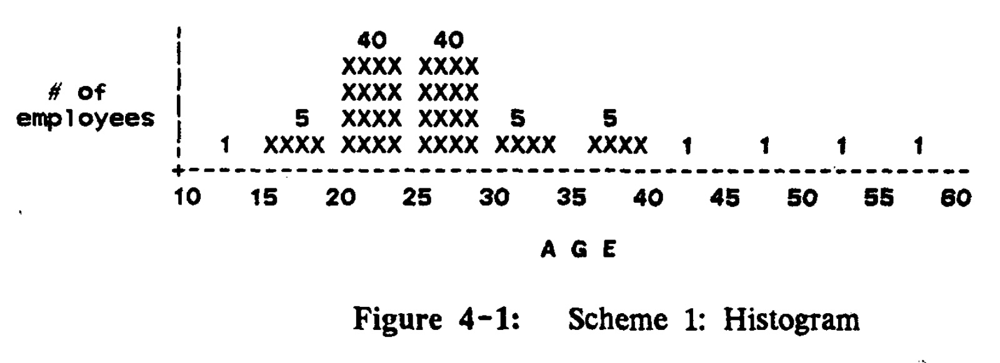
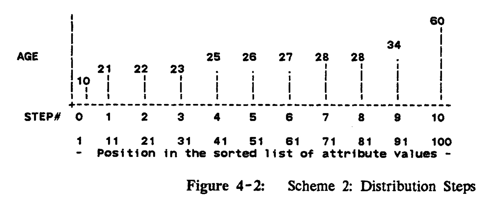
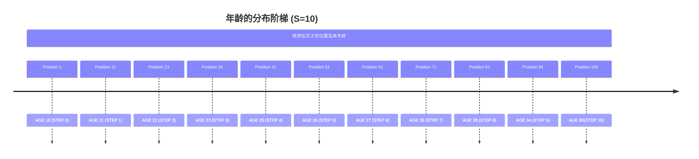
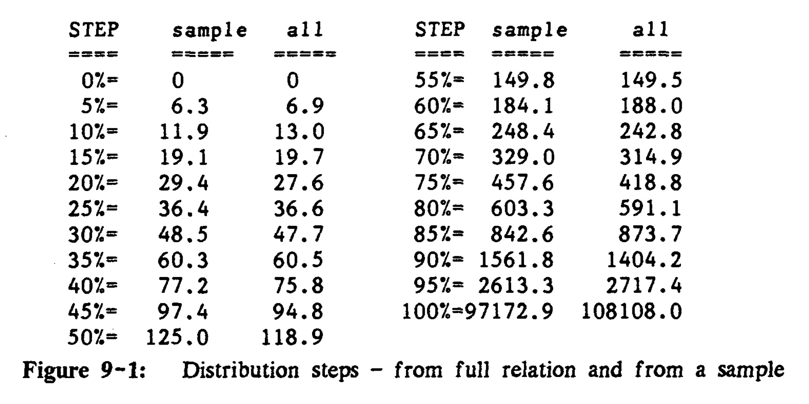

## AI论文解读 | Accurate Estimation Of The Number Of Tuples Satisfying A Condition
        
### 作者        
digoal        
        
### 日期        
2025-10-11        
        
### 标签        
PostgreSQL , PolarDB , DuckDB , AI , 论文解读        
        
----        
        
## 背景  
      
https://dl.acm.org/doi/pdf/10.1145/971697.602294        
  
提示:          
```          
读懂《Accurate Estimation Of The Number Of Tuples Satisfying A Condition》这篇论文需要提前掌握哪些基础知识, 请使用中文通熟易懂的讲解这些基础知识, 可以引用论文中的图、表或使用Markdown支持的图形(text,mermaid等)增加解释性. 
  
使用中文通熟易懂的解读《Accurate Estimation Of The Number Of Tuples Satisfying A Condition》这篇论文, 其中的关键内容请着重讲解, 可以引用论文中的图、表或使用Markdown支持的图形(text,mermaid等)增加解释性. 
  
提取《Accurate Estimation Of The Number Of Tuples Satisfying A Condition》这篇论文中的重要术语, 使用中文对这些术语进行通熟易懂的讲解, 可以引用论文中的图、表或使用Markdown支持的图形(text,mermaid等)增加解释性. 
```     
  
## 1 前置知识 
  
好的，为了帮助您更好地理解这篇经典的数据库论文《Accurate Estimation Of The Number Of Tuples Satisfying A Condition》，我将为您梳理和讲解所需的基础知识。这篇论文的核心是关于**查询优化**，即如何让数据库在执行查询时选择最快、最省资源的方法。而要做到这一点，关键在于**准确估算**满足特定条件的记录有多少条。

以下是您需要掌握的基础知识，我会尽量用通俗易懂的方式并结合论文中的例子来解释。

-----

### 1\. 数据库核心概念 (Relational Database Concepts)

这篇论文是建立在关系型数据库（Relational Database）的背景下的。您可以将其想象成一个由多个 Excel 表格组成的系统。

  * **关系 (Relation)**: 就是一张数据表，比如论文中提到的`Industrial Compustat`金融信息表 。

  * **元组 (Tuple)**: 就是表中的一行记录。例如，Compustat 表中的一行就代表一家公司某一年的财务数据 。

  * **属性 (Attribute)**: 就是表中的一列。例如，`SALES` (销售额) 或 `YEAR` (年份) 就是这张表的属性 。

  * **查询 (Query)**: 就是向数据库发出的提问。论文中的核心例子是：

    > `Find the number of tuples where SALES > 20 billion AND YEAR = 77` 
    > (找出销售额大于200亿且年份是77年的所有记录)

  * **索引 (Index)**: 就像书的目录，它可以帮助数据库快速找到包含特定值的行，而无需扫描整张表。比如，可以为 `SALES` 列或 `YEAR` 列建立索引 。

### 2\. 查询优化的基石：选择率 (Selectivity)

这是理解这篇论文**最核心**的概念。

  * **定义**: **选择率 (Selectivity)** 指的是一张表中，满足某个条件的元组（行）所占的**比例** 。

    例如，在一个人口数据库中，条件 `性别='女'` 的选择率大约是 0.5 (或 50%) 。如果一个条件的选择率很低，比如 0.01%，意味着它能筛选掉绝大部分数据，非常“有选择性”。

  * **为什么重要？**: 查询优化器需要决定执行查询的最佳路径。以上文的查询为例，它有两种基本方法 ：

    1.  **方法A**: 先用 `SALES` 索引，找到所有 `SALES > 200亿` 的记录，然后再逐一检查这些记录的 `YEAR` 是否为 `77` 。
    2.  **方法B**: 先用 `YEAR` 索引，找到所有 `YEAR = 77` 的记录，然后再逐一检查这些记录的 `SALES` 是否大于 `200亿` 。

    数据库应该选择哪种方法？答案是：**选择那个第一步能返回更少记录的方法** 。这就需要估算 `SEL(SALES > 20 billion)` 和 `SEL(YEAR = 77)` 这两个选择率。谁的选择率低，就先用谁的索引，因为这样后续需要处理的数据量就大大减少了，查询也就更快 。

    论文中，传统的 System R 优化器错误地估计 `SEL(SALES > 20 billion)` 很高（71%），而 `SEL(YEAR = 77)` 较低（5%），因此选择了方法 B，结果耗时137秒。而论文提出的新方法正确地估计出 `SEL(SALES > 20 billion)` 其实非常低（估算为2%，实际仅0.5%），于是选择了方法 A，最终只用了8秒，快了16倍 。

### 3\. 描述数据分布：从直方图到分布阶梯

为了准确估算选择率，我们必须了解一个属性列中数值的分布情况。

#### 3.1 传统直方图 (Histogram)

这是最常见的数据分布描述方法。它将数据的取值范围（如年龄从10到60）切分成若干个等宽的“桶”（buckets），然后统计每个桶里有多少个数据点。

论文中用图 4-1 里的员工年龄分布举例说明了传统直方图的**缺陷** 。   

*图 4-1: 传统直方图 (员工年龄分布)* 

从这个图中，如果我们想估算 `AGE < 29` 的选择率，会遇到麻烦。因为 29 落在 `25-30` 这个桶的中间，这个桶里有40名员工。我们只知道 `AGE < 25` 的有 `1+5+40=46` 人，但无法确定这40人里有多少是小于29岁的。因此，估算值只能在一个很大的范围内 `0.46 <= SEL(<29) <= 0.86` 。这种估算误差太大，几乎没有指导意义。

**核心问题**: 传统直方图是**等宽**的，如果数据分布不均匀（比如大部分员工年龄集中在20-30岁），就会导致某些“桶”特别高，从而使估算误差变得很大 。

#### 3.2 分布阶梯 (Distribution Steps) - 论文的核心创新

为了解决上述问题，作者提出了一种全新的数据结构，可以理解为一种 **“等高”的直方图** 。

  * **思想**: 我们不让每个桶的“宽度”（数值范围）相等，而是让每个桶的“高度”（包含的元组数量）相等 。
  * **构建方法**:
    1.  将属性列的所有值（例如，所有员工的年龄）进行排序 。
    2.  根据需要的精度 S，在排好序的列表中选取 S+1 个点。这些点均匀地分布在列表中，例如第1个、第 N/S 个、第 2N/S 个…… 直到最后一个 。
    3.  这些点上的数值就是 “分布阶梯” 。

下面是论文中图 4-2 的例子，它将100名员工的年龄数据做成了10个分布阶梯 (S=10)。   



*根据论文图4-2重绘* 

  * **STEP(0)** 是最小值 10。
  * **STEP(1)** 是第11个员工的年龄 21，代表大约10%的员工年龄小于等于21。
  * **STEP(8)** 是第81个员工的年龄 28，代表大约80%的员工年龄小于等于28 。
  * **STEP(9)** 是第91个员工的年龄 34，代表大约90%的员工年龄小于等于34 。

用这个结构来估算 `SEL(<29)`：
因为 29 介于 `STEP(8)=28` 和 `STEP(9)=34` 之间，所以我们能非常有信心地断定，`SEL(<29)` 在 80% 到 90% 之间 。这个范围比传统直方图给出的 `46% - 86%` 要精确得多。最大估算误差从 20% 降到了 5% 。

### 4\. 统计学与数学基础 (Statistics and Math Fundamentals)

  * **分位数 (Quantiles/Percentiles)**: “分布阶梯” 的思想其实就是统计学中的分位数。例如，`STEP(1)` 约等于10百分位数 (10th percentile)，`STEP(5)` 约等于中位数 (median, 50th percentile)。如果您理解分位数的概念，就能立刻明白分布阶梯的原理。

  * **抽样 (Sampling)**: 完整计算分布阶梯需要对整个属性列进行排序，当数据量巨大时，这个操作非常耗时 。论文的第9节提出，我们其实不需要读取所有数据，只需随机抽取一小部分样本（例如1064条记录），基于这个样本计算分布阶梯即可 。这种方法虽然会损失一些精度，但速度极快，且估算结果通常已经足够准确 。

  * **基础数学符号与逻辑**: 论文的第5和第6节提出了一些估算公式和应满足的公理（如一致性、单调性等）。理解这部分需要您对基本的数学变量（如 S, T, I）和逻辑推导不感到陌生。例如，一致性公理 `SEL(<X) + SEL(=X) + SEL(>X) = 1` ，它的直观意义是：任何一个值，它要么小于X，要么等于X，要么大于X，三者必居其一且互不相容，所以它们的概率（选择率）之和必须为1。

-----

### 总结

为了读懂这篇论文，您需要的基础知识可以归纳为下表：

| 知识领域 | 关键概念 | 对应论文中的作用 |
| :--- | :--- | :--- |
| **数据库基础** | `Relation`, `Tuple`, `Attribute`, `Query`, `Index` | 理解论文要解决的问题背景：数据库如何执行查询。 |
| **查询优化** | `Selectivity` (选择率), `Query Plan` (查询计划) | 理解论文的核心动机：为何要精确估算选择率，以及它如何影响查询性能。 |
| **数据分布与统计** | `Histogram` (直方图), `Data Skew` (数据倾斜), `Quantiles` (分位数), `Sampling` (抽样) | 理解论文提出的核心解决方案 `Distribution Steps` 的原理、优势以及如何高效地实现它。 |
| **基础数学** | 变量代数、逻辑公理 | 理解论文中如何将 `Distribution Steps` 转化为具体的、可计算的选择率估算公式。 |

总而言之，这篇论文通过一个巧妙的“等高直方图”（即分布阶梯）思想，极大地提升了数据库查询优化中选择率估算的准确性，是数据库领域一个里程碑式的工作。希望这份讲解能帮助您顺利地阅读和理解它。
  
## 2 解读论文 
  
好的，这篇于1984年发表的论文《Accurate Estimation Of The Number Of Tuples Satisfying A Condition》是数据库查询优化领域的经典之作。它的核心思想在于提出了一种创新的方法，来**精准地“猜”出满足某个查询条件的记录大概有多少条**，从而帮助数据库系统选择最高效的查询执行路径。

下面，我将为您通俗地解读这篇论文的关键内容。

### 核心问题：为什么要“猜”得准？

在数据库中，执行一个查询往往有多种方法（或路径）。例如，对于查询“找出销售额大于200亿且年份是1977年的公司记录”，数据库可以选择：

1.  **路径A**：先扫描`SALES`索引，找到所有销售额大于200亿的公司，然后再从这些结果中筛选出年份为1977的记录 。
2.  **路径B**：先扫描`YEAR`索引，找到所有年份为1977的记录，然后再从这些结果中筛选出销售额大于200亿的公司 。

选择哪条路径，取决于第一步筛选出的中间结果集哪个更小。如果满足`SALES > 200亿`的记录远少于满足`YEAR = 77`的记录，那么路径A就更快，反之亦然 。

因此，数据库的“查询优化器”必须在执行前对各个条件能筛选出多少记录进行估算。这个估算结果的准确性，直接决定了查询的效率。论文指出，当时主流的System R优化器因为估算不准，选择了一条耗时137秒的路径；而论文提出的新方法因为估算精准，选择了另一条路径，仅用时8秒，**性能提升了16倍** 。

### 传统估算方法的缺陷

论文首先分析了当时方法的不足之处。

#### 1\. 均匀分布假设

System R优化器假设数据在最大值和最小值之间是均匀分布的 。例如，要估算`SALES > 200亿`的比例，它会用这样的公式：`(最大值 - 200亿) / (最大值 - 最小值)` 。

**缺陷**：现实世界的数据极少是均匀分布的。论文以`SALES`属性为例，其最大值是1080亿，但95%的公司销售额都集中在小于26亿的区间内，仅占整个范围的2.4% 。在这种高度倾斜的数据上，均匀分布的假设会产生巨大的误差 。

#### 2\. 传统直方图（等宽直方图）

另一种方法是使用直方图，即将数值范围切分成若干个宽度相等的“桶”，并统计每个桶内的记录数 。

**缺陷**：这种“等宽”的直方图在数据倾斜时同样表现不佳。论文用一个员工年龄分布的例子（图 4-1）说明了这个问题：   

*图 4-1: 传统直方图 (员工年龄分布)*

假设我们要估算年龄小于29岁的员工比例。29岁落在了“25-30岁”这个桶里，这个桶非常“高”，包含了40%的员工 。我们只知道年龄小于25岁的员工占46%，但无法确定这40%的员工中有多少是小于29岁的。因此，真实的比例可能在46%到86%之间，估算的误差范围高达40% 。对于优化器来说，这种估算几乎是无效的。

### 论文的关键创新：分布阶梯 (Distribution Steps)

为了解决上述问题，论文提出了一个核心创新：**分布阶梯 (Distribution Steps)** 。这个概念可以理解为一种 **“等高”的直方图** 。

**核心思想**：我们不再让每个桶的“宽度”（数值范围）相等，而是让每个桶的“高度”（包含的记录数量）相等 。

**构建方法** ：

1.  将一个属性（如`AGE`）的所有值从数据库中取出并排序 。
2.  选择一个阶梯数S（例如S=10），这决定了精度 。
3.  在排好序的列表中，等间隔地选取S+1个位置的值 。例如，在100条记录中，我们可以选取第1、11、21、...、91、100个位置上的值 。
4.  这些被选中的值就构成了分布阶梯 。

我们用论文中图 4-2 的例子来看看分布阶梯的威力：   


*根据论文图4-2重绘*

  * **STEP(0)** 是最小值10。
  * **STEP(1)** 的值是21，代表大约10%的员工年龄小于等于21。
  * **STEP(8)** 的值是28，代表大约80%的员工年龄小于等于28 。
  * **STEP(9)** 的值是34，代表大约90%的员工年龄小于等于34 。

现在，我们再来估算年龄小于29岁的员工比例：
由于29介于`STEP(8)=28`和`STEP(9)=34`之间，我们可以非常有信心地断定，真实的比例在80%到90%之间 。这个估算区间的误差仅为10%，比传统直方图的40%精确了4倍 。

**优势**：分布阶梯的最大估算误差大约是 `1/S` 。这意味着我们可以通过增加阶梯数S来任意减小估算误差，从而获得所需的精度 。

### 实用化技术：使用抽样 (Sampling)

计算分布阶梯需要对一个属性的所有值进行排序，对于上百万甚至上亿条记录的大表来说，这个代价非常高昂 。

为了让这个方法变得实用，论文第9节提出了一个关键的工程优化：**使用抽样来近似计算分布阶梯** 。

  * **方法**：我们不需要读取和排序所有记录，只需从表中随机抽取一小部分样本（例如1064条记录） ，然后基于这个小样本计算分布阶梯 。
  * **理论依据**：根据统计学理论（柯尔莫哥洛夫统计量），这种方法非常可靠 。有趣的是，所需样本的大小与表的总记录数无关 。一个千条记录级别的样本，就足以高精度地反映整个表的分布情况。
  * **效果**：论文通过实验证明，基于1064条记录样本计算出的分布阶梯，与基于全量数据（约48000条）计算出的结果非常接近。

下表摘自论文中的图 9-1，对比了全量数据和抽样数据得到的`SALES`分布阶梯：    

| 阶梯 (百分比) | 抽样样本 (Sample) | 全量数据 (All) |
| :--- | :--- | :--- |
| 0% | 0 | 0 |
| 5% | 6.3 | 6.9 |
| 50% | 125.0 | 118.9 |
| 90% | 1561.8 | 1404.2 |
| 95% | 2613.3 | 2717.4 |
| 100% | 97172.9 | 108108.0 |

*数据来源：论文图 9-1*

可以看到，两者的数据非常吻合，证明了抽样方法的有效性。这意味着可以用极低的成本来维护这些统计信息，使其在动态变化的数据库中也能保持更新 。

### 总结

这篇论文的贡献可以概括为以下几点：

1.  **指明问题**：深刻揭示了传统选择率估算方法（均匀分布假设和等宽直方图）在处理非均匀数据时的严重缺陷。
2.  **提出创新方案**：设计了“分布阶梯”（等高直方图）这一全新的数据结构来存储属性值的分布信息，它能提供有保证的、可控的估算精度 。
3.  **完善理论**：基于分布阶梯，推导出了两套估算公式，一套旨在最小化最坏情况下的误差，另一套旨在降低平均误差，满足不同场景的需求 。
4.  **确保实用性**：提出了使用统计抽样来高效构建分布阶梯的方法，解决了在大数据量下的性能开销问题，使整个方案能够真正在实际系统（如FASTSCAN查询系统）中落地 。

该论文提出的方法后来被业界广泛采纳，成为现代主流数据库中直方图统计信息的核心思想之一，对数据库查询优化技术的发展产生了深远的影响。
  
## 3 术语 
  
好的，我们来一起解析《Accurate Estimation Of The Number Of Tuples Satisfying A Condition》这篇经典论文中的重要术语。

这篇论文的核心在于如何准确估算数据库中满足特定条件的元组（或称记录、行）数量，这对于数据库查询优化至关重要。以下是论文中一些关键术语的通俗讲解。

### 重要术语解析

#### 1\. 选择性 (Selectivity)

  * **定义**: 选择性指的是在一个关系（或称数据表）中，满足某个特定条件的元组所占的比例 。
  * **通俗讲解**: 想象一个班级有100个学生，其中50个是女生。那么“性别为女”这个条件的选择性就是 50/100 = 0.5 。在数据库查询中，如果一个条件的选择性很低，比如万分之一，意味着符合条件的记录非常少。查询优化器就会倾向于优先使用与这个低选择性条件相关的索引，因为这样可以迅速筛选掉大量无关数据，提高查询效率 。

#### 2\. 直方图 (Histogram)

  * **定义**: 一种描述属性值分布的传统方法。它将属性值的整个范围划分成若干个宽度相等的“桶”（buckets），然后统计每个桶中有多少个元组落入其中 。

  * **通俗讲解**: 比如，我们要统计一个公司员工的年龄分布，年龄范围是10岁到60岁。我们可以把这个范围分成5个等宽的区间（桶）：10-20岁, 21-30岁, 31-40岁, 41-50岁, 51-60岁。然后数一下每个年龄段有多少员工。

    论文中用一个图表演示了这种方法（如下图所示）。图中显示，大部分员工（各40人）集中在 20-25岁 和 25-30岁 这两个区间 。    

    ```text
         40   40
        XXXX XXXX
        XXXX XXXX
      5 XXXX XXXX 5   5
    1 XXXX XXXX XXXX XXXX 1   1   1   1
    +----+----+----+----+----+----+----+----+----+----+
    10   15   20   25   30   35   40   45   50   55   60
                           AGE
    ```

    *（根据论文图4-1简化和重现）*

  * **问题**: 论文指出，这种方法的缺点在于，如果数据分布非常不均匀，可能会导致几乎所有数据都落入少数几个桶里 。例如，在统计公司销售额时，绝大多数公司的销售额都很低，只有极少数公司销售额极高 。这样一来，大部分数据会挤在第一个桶里，导致估算误差非常大，可能接近50% 。

#### 3\. 分布阶梯 (Distribution Steps)

  * **定义**: 这是论文提出的一种创新的数据分布描述方法。与直方图的“等宽”相反，分布阶梯追求的是“等高”，即每个“桶”里包含的元组数量大致相等 。它通过选取S个分割点（阶梯值），将排序后的属性值列表分成S个区间，每个区间包含相同数量的元组 。

  * **通俗讲解**: 还是以100名员工的年龄为例，如果我们想创建10个分布阶梯。我们会将所有员工按年龄从小到大排序。然后，我们找到排在第10位、第20位、第30位……直到第100位的员工年龄。这些年龄值就是我们的“分布阶梯”值。

    例如，STEP(3) 的值就意味着大约有30%的员工年龄小于或等于这个值 。论文中的图4-2形象地展示了这一点 ：    

    ```text
    AGE      10   21   22   23   25   26   27   28   28   34        60
             |----|----|----|----|----|----|----|----|----|----|
    STEP #   0    1    2    3    4    5    6    7    8    9    10
    Position 1    11   21   31   41   51   61   71   81   91   100
    (in sorted list)
    ```

    *（根据论文图4-2简化和重现）*

  * **优势**: 这种方法的最大好处是，它能精确地控制估算误差的上限 。误差的上限大约是 1/S（S是阶梯的数量）。这意味着，只要我们增加阶梯的数量S，就可以任意减小估算误差 。

#### 4\. 估算公式的理想条件 (Desirable Conditions on the Selectivity Estimates)

论文提出，一个好的选择性估算方案应该满足三个基本公理，以确保其逻辑上的合理性和一致性 。

1.  **一致性 (Consistency)**:

      * $SEL\sim(<X) + SEL\sim(=X) + SEL\sim(>X) = 1$ 
      * $SEL\sim(\le X) = SEL\sim(<X) + SEL\sim(=X)$ 
      * $SEL\sim(\ge X) = SEL\sim(>X) + SEL\sim(=X)$ 
      * **讲解**: 这保证了小于、等于、大于某个值X的估算比例加起来总是等于1，并且“小于等于”和“大于等于”的估算值与其组成部分保持一致。

2.  **端点正确性 (Correctness on Ends)**:

      * $SEL\sim(>maxval) = 0$  (大于最大值的估算比例为0)
      * $SEL\sim(<minval) = 0$  (小于最小值的估算比例为0)
      * **讲解**: 这个很容易理解，估算结果不能超出实际数据的最大和最小值范围。

3.  **单调性 (Monotonicity)**:

      * 如果 $X < Y$ ，那么 $SEL\sim(<X) \le SEL\sim(<Y)$ 
      * $SEL\sim(=X) \ge 0$ 
      * **讲解**: 这保证了随着我们设定的比较值增大，估算出的“小于”这个值的比例也应该是非递减的。同时，任何一个值的估算比例都不能是负数。

#### 5\. 最小化最坏情况误差 (Minimizing Worst-Case Error) vs. 最小化平均情况误差 (Minimizing Average-Case Error)

论文基于分布阶梯，提出了两套不同的估算公式。

  * **最小化最坏情况误差的公式**: 这套公式的目标是，在任何可能的数据分布下，都保证估算误差不会超过一个特定的、最小化的上限 。例如，当一个查询值X落在两个阶梯值STEP(I)和STEP(I+1)之间时，这套公式给出的 $SEL\sim(=X)$ 估算值为 $1/(3S)$ 。

      * **缺点**: 虽然这套公式能提供最强的误差保证，但在实际应用中，对于 $SEL\sim(=X)$ 的估算值（ 比如 $1/3S$ ）通常会远高于实际值，因为大部分时候一个具体值对应的记录数是很少的 。

  * **最小化平均情况误差的公式**: 这套公式（在FASTSCAN查询系统中使用）的目标是，在大多数常见情况下，让估算结果更接近真实值，尤其是针对 $SEL\sim(=X)$ 的估算 。它引入了一个额外的参数——**属性密度 (attribute density)** 。

      * **属性密度 (Attribute Density)**: 不严格地说，它代表了属性值重复的平均程度 。如果所有元组的属性值都独一无二，密度就很低；如果某个值在大量元组中重复出现，密度就高 。这套公式使用密度来估算 $SEL\sim(=X)$ ，通常比 $1/3S$ 更准确 。
      * **代价**: 这套公式在平均情况下表现更好，但牺牲了对最坏情况误差的严格保证，其最坏误差会比前一套公式稍大一些 。

#### 6\. 抽样 (Sampling)

  * **定义**: 由于对整个关系（数据表）的所有属性值进行排序来计算分布阶梯成本非常高，特别是对于大型或频繁变化的数据库，论文提出可以使用抽样的方法来近似计算 。
  * **通俗讲解**: 我们不需要读取表中的全部几百万条记录，而是随机抽取一小部分（例如，论文中提到抽取1064个元组样本 ），然后仅基于这个样本来计算分布阶梯。
  * **优势与权衡**: 这种方法的计算成本极低 。虽然牺牲了结果的绝对精确性，但统计学理论（如柯尔莫哥洛夫统计量）保证了基于样本的估算结果能够以很高的置信度（例如99%）接近真实结果，且误差在一个可控的范围内（例如±0.05）。有趣的是，所需的样本大小与整个数据表的总记录数无关 。

通过这些术语和方法，这篇论文构建了一个既精确又高效的数据库查询选择性估算框架。
  
## 参考        
         
https://dl.acm.org/doi/pdf/10.1145/971697.602294    
        
<b> 以上内容基于DeepSeek、Qwen、Gemini及诸多AI生成, 轻微人工调整, 感谢杭州深度求索人工智能、阿里云、Google等公司. </b>        
        
<b> AI 生成的内容请自行辨别正确性, 当然也多了些许踩坑的乐趣, 毕竟冒险是每个男人的天性.  </b>        
  
    
#### [期望 PostgreSQL|开源PolarDB 增加什么功能?](https://github.com/digoal/blog/issues/76 "269ac3d1c492e938c0191101c7238216")
  
  
#### [PolarDB 开源数据库](https://openpolardb.com/home "57258f76c37864c6e6d23383d05714ea")
  
  
#### [PolarDB 学习图谱](https://www.aliyun.com/database/openpolardb/activity "8642f60e04ed0c814bf9cb9677976bd4")
  
  
#### [PostgreSQL 解决方案集合](../201706/20170601_02.md "40cff096e9ed7122c512b35d8561d9c8")
  
  
#### [德哥 / digoal's Github - 公益是一辈子的事.](https://github.com/digoal/blog/blob/master/README.md "22709685feb7cab07d30f30387f0a9ae")
  
  
#### [About 德哥](https://github.com/digoal/blog/blob/master/me/readme.md "a37735981e7704886ffd590565582dd0")
  
  

  
