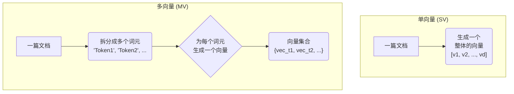
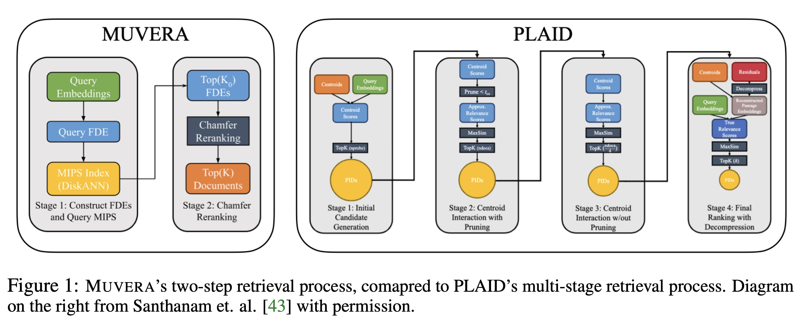
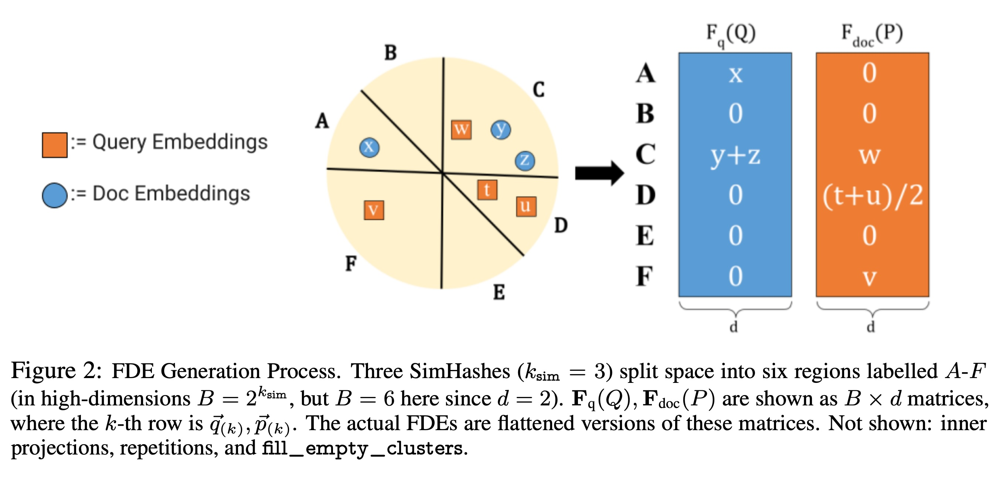

## AI论文解读 | MUVERA: Multi-Vector Retrieval via Fixed Dimensional Encodings
        
### 作者        
digoal        
        
### 日期        
2025-10-11        
        
### 标签        
PostgreSQL , PolarDB , DuckDB , AI , 论文解读        
        
----        
        
## 背景  
      
https://arxiv.org/pdf/2405.19504        
  
提示:          
```          
读懂《MUVERA: Multi-Vector Retrieval via Fixed Dimensional Encodings》这篇论文需要提前掌握哪些基础知识, 请使用中文通熟易懂的讲解这些基础知识, 可以引用论文中的图、表或使用Markdown支持的图形(text,mermaid等)增加解释性. 
  
使用中文通熟易懂的解读《MUVERA: Multi-Vector Retrieval via Fixed Dimensional Encodings》这篇论文, 其中的关键内容请着重讲解, 可以引用论文中的图、表或使用Markdown支持的图形(text,mermaid等)增加解释性. 
  
提取《MUVERA: Multi-Vector Retrieval via Fixed Dimensional Encodings》这篇论文中的重要术语, 使用中文对这些术语进行通熟易懂的讲解, 可以引用论文中的图、表或使用Markdown支持的图形(text,mermaid等)增加解释性. 
```     
  
## 1 前置知识 
  
好的，为了完全理解《MUVERA: Multi-Vector Retrieval via Fixed Dimensional Encodings》这篇论文，你需要掌握一些信息检索（IR）和机器学习领域的基础知识。下面我将用通俗易懂的中文为你逐一讲解，并结合论文中的图表来帮助理解。

### 核心知识地图

要读懂 MUVERA，你需要先了解以下几个环环相扣的概念：

1.  **信息检索 (Information Retrieval, IR) 的基本目标**：搜索。
2.  **向量嵌入 (Embeddings)**：如何让计算机“理解”文字。
3.  **两种不同的嵌入策略**：单向量 (Single-Vector) vs. 多向量 (Multi-Vector)。
4.  **两种不同的相似度计算方法**：内积 (Inner Product) vs. Chamfer 相似度。
5.  **面临的困境**：高质量的多向量模型速度太慢。
6.  **MUVERA 的解法思路**：将复杂的多向量问题“降维”成简单的单向量问题。

-----

### 1\. 什么是信息检索 (IR)？

最简单的理解就是 **“搜索”** 。当你在搜索引擎输入一个问题（Query），系统需要从海量的文档（Corpus）中，快速找到与你问题最相关的那些文档。这篇论文研究的就是如何让这个过程更精准、更快速。

### 2\. 什么是向量嵌入 (Embeddings)？

计算机不认识文字，只认识数字。向量嵌入技术就是用一个充满了数字的**向量 (Vector)** 来表示一个词、一句话或一篇文档。

  - **关键思想**：意思相近的文本，它们对应的向量在空间中的位置也应该相近。
  - **例子**：“国王” 和 “女王” 的向量很接近，但和 “香蕉” 的向量就很远。

这是现代AI驱动的搜索引擎的基石。

### 3\. 单向量 vs. 多向量 (论文的核心背景)

这是理解本论文最关键的分水岭。

#### A. 单向量表示 (Single-Vector, SV)

这是传统的方式。无论查询或文档有多长，都用**一个**固定长度的向量来概括它的全部语义。

  - **优点**：简单、存储开销小、计算快。
  - **缺点**：信息压缩严重，容易丢失细节。比如，“苹果公司发布了新款手机” 和 “我今天吃了一个苹果”，两个“苹果”的含义完全不同，但在一个向量里可能被模糊处理了。

#### B. 多向量表示 (Multi-Vector, MV)

这是以 ColBERT  为代表的新方法。它不追求用一个向量概括所有，而是为一个查询或文档中的**每个重要词元 (Token)** 都生成一个独立的向量。

  - **优点**：保留了词元的精细化语义，检索效果（准确度）显著优于单向量模型 。
  - **缺点**：计算和存储成本极高。一个文档从一个向量变成了几十甚至上百个向量 。

我们可以用一个简单的图来表示它们的区别：



### 4\. 不同的相似度计算方法

既然表示方法不同，比较它们是否相似的方法也不同。

#### A. 单向量相似度：最大内积搜索 (MIPS)

对于单向量，比较两个向量（一个来自查询，一个来自文档）是否相似，最常用的方法就是计算它们的**内积 (Inner Product)**。内积越大，通常代表它们越相似。

  - **MIPS (Maximum Inner Product Search)**：就是在一个巨大的向量数据库中，快速找到和查询向量内积最大的那个向量。这个技术已经非常成熟且高度优化 。

#### B. 多向量相似度：Chamfer 相似度

对于多向量，情况变得复杂。我们有两个向量**集合**（比如，查询Q有32个向量，文档P有100个向量），怎么判断它们相似呢？

论文中使用的 **Chamfer Similarity** (也叫 MaxSim)  解决了这个问题。其计算逻辑如下：

1.  从查询的向量集合 `Q` 中，拿出**第一个**向量 `q1`。
2.  用 `q1` 和文档向量集合 `P` 中的**所有**向量计算内积。
3.  找到其中**最大**的那个内积值。
4.  对查询集合 `Q` 中的**每一个**向量（`q2`, `q3`, ...）都重复一遍上面的过程。
5.  最后，把所有这些找到的最大内积值**相加**，就得到了最终的相似度分数。

**通俗解释**：对于查询里的每个词，我们都认为它只和文档里跟它最匹配的那个词产生关联，然后把所有这些“最强关联”的强度加起来，就是总分。

$$\text{CHAMFER}(Q, P) = \sum_{q \in Q} \max_{p \in P} \langle q, p \rangle$$

> 这里 $\langle q, p \rangle$ 表示向量 q 和 p 的内积。

### 5\. 面临的困境：质量与效率的矛盾

  - **多向量（MV）模型**：效果好，但 Chamfer 相似度的计算非常复杂，无法直接使用高效的 MIPS 技术 。
  - **单向量（SV）模型**：速度快，有成熟的 MIPS 方案，但效果不如 MV 模型。

现有的 MV 检索系统，如 PLAID ，采用的是非常复杂的多阶段流程来弥补速度问题，但流程繁琐、调参困难 。**论文中的图1** 直观地展示了这一点：   

> **图1解读**：左边的 **MUVERA** 流程极其简洁：1. 构建 FDE 并用 MIPS 查询；2. 重排序。而右边的 **PLAID** 有四个复杂的阶段，包括初始候选生成、多轮交互和剪枝，非常复杂 。

### 6\. MUVERA 的核心思想：降维打击

MUVERA 的目标是：**既要多向量模型的质量，也要单向量模型的速度**。

它的核心方法叫做 **固定维度编码 (Fixed Dimensional Encodings, FDEs)** 。本质上是一种巧妙的“降维”技巧，把一个**向量集合**（多向量）转换成一个**单一的向量**（单向量），并且保证转换后的单向量内积能**近似**于原始的 Chamfer 相似度 。

$$\langle F_q(Q), F_{doc}(P) \rangle \approx \text{CHAMFER}(Q, P)$$

>   - $F_q(Q)$ ：把查询的向量集 Q 转换成一个单向量。
>   - $F_{doc}(P)$ ：把文档的向量集 P 转换成一个单向量。

#### FDE 是如何工作的？(核心技术细节)

论文的 **图2** 是理解 FDE 生成过程的关键。    

**图2解读**:

1.  **空间划分 (Space Partitioning)**：想象一个高维空间，里面散布着查询和文档的词元向量（橙色方块是查询，蓝色圆圈是文档）。MUVERA 使用一种叫 **SimHash (一种 LSH)**  的技术，用几条随机的“线”（高维空间里是超平面）把这个空间切分成很多区域（图中是A-F六个区域）。**LSH 的特性是：距离近的向量，有很大概率被分到同一个区域**。

2.  **构建 FDE 向量**：FDE 向量是一个很长的向量，它的每个“块”对应一个划分好的区域。

      * **查询 FDE (Fq(Q))**：检查查询向量（橙色方块）落在了哪个区域。
          * 区域 A 有一个向量 `x`，所以在 FDE 的 A 块填上 `x`。
          * 区域 C 有两个向量 `y` 和 `z`，就把它们**相加** `y+z` 填入 C 块 。
          * 其他没落入向量的区域（B, D, E, F）都填 0。
      * **文档 FDE (Fdoc(P))**：检查文档向量（蓝色圆圈）落在了哪个区域。
          * 区域 C 有一个向量 `w`，所以在 FDE 的 C 块填上 `w`。
          * 区域 D 有两个向量 `t` 和 `u`，就把它们的**平均值** `(t+u)/2` 填入 D 块 。
          * 区域 F 有一个 `v`，填入 `v`。
          * 其他区域填 0。

3.  **近似计算**：当计算这两个 FDE 向量的内积时，只有在**相同区域**都有非零值的块才会产生贡献。比如 C 区域的贡献是 $\langle y+z, w \rangle$ 。通过这种方式，内积计算就巧妙地模拟了 Chamfer 相似度中“寻找最近邻”的过程。

此外，为了提高精度，MUVERA还会重复这个过程多次（`R_reps`），并把结果拼接起来，使得FDE向量更长，但近似效果也更好 。

-----

### 总结：你需要掌握的基础知识点

  - **信息检索 (IR)**：理解最终目标是“又快又准地搜索”。
  - **向量嵌入 (Embedding)**：知道文本如何变成计算机可处理的数字向量。
  - **单/多向量表示法**：理解二者的优缺点，这是论文的出发点。
  - **MIPS**：了解这是单向量检索的“加速器”，也是MUVERA想要利用的工具。
  - **Chamfer 相似度**：理解它是如何为多向量模型计算相似度的，从而明白为什么它很慢。
  - **LSH (局部敏感哈希)**：理解其“近邻碰撞”的核心思想，这是FDE技术能够奏效的理论基础。

掌握了这些，你就能明白 MUVERA 的贡献在于：它设计了一种聪明的 FDE 编码方式，成功地将复杂的、难以优化的多向量 Chamfer 相似度问题，转化为了一个可以被现有 MIPS 高速系统解决的单向量内积问题，从而实现了速度和质量的双赢 。
  
## 2 解读论文 
  
好的，这篇名为《MUVERA: Multi-Vector Retrieval via Fixed Dimensional Encodings》的论文，提出了一种创新的信息检索（搜索）技术。以下是对其核心内容的通俗解读。

### **一、论文解决的核心问题：搜索领域的“鱼与熊掌”**

在现代搜索引擎中，为了让计算机理解文字，我们通常会把文本转换成“向量”（即一长串数字），这个过程叫做**嵌入 (Embedding)**。但如何转换，存在两种主流方法，它们各有优劣：

1.  **单向量 (Single-Vector, SV) 表示法**：

      * **做法**：将一整篇文档或一个查询，浓缩成**一个**向量 。
      * **优点**：向量少，计算快，可以使用非常成熟的MIPS（最大内积搜索）技术进行超高速检索 。
      * **缺点**：信息压缩太狠，会丢失很多细节，导致搜索精度不够高。

2.  **多向量 (Multi-Vector, MV) 表示法**：

      * **做法**：以著名的ColBERT模型为代表，它为一篇文档或查询中的**每一个词元 (token)** 都生成一个独立的向量 。这样，一篇文档就变成了一个向量的**集合** 。
      * **优点**：保留了每个词的精细含义，搜索精度（召回率）远超单向量方法 。
      * **缺点**：计算和存储成本极高，而且其独特的相似度算法（Chamfer Similarity）无法直接利用MIPS进行加速，导致搜索速度很慢 。

**核心矛盾**：我们想要多向量模型的高精度，又想要单向量模型的超高速度。此前的方案（如PLAID）为了给多向量模型提速，设计了非常复杂繁琐的多阶段流程，难以调优 。

### **二、MUVERA的核心思想：降维打击**

MUVERA (Multi-Vector Retrieval Algorithm) 的目标就是解决上述矛盾。它的核心思想非常巧妙：

> **将复杂的多向量相似度搜索问题，转化为简单的单向量相似度搜索问题** 。

为此，它引入了一个关键技术——**固定维度编码 (Fixed Dimensional Encodings, FDEs)** 。

FDEs是一种转换函数，可以将一个**向量集合**（来自多向量模型）映射成一个**固定长度的单一向量** 。最关键的是，这种转换保证了两个FDE单向量的**内积**，能够高度**近似**原始多向量集合之间的**Chamfer相似度** 。

这样一来，就可以对所有文档的向量集合预先计算好FDE并存储。当用户查询时，也将其查询的向量集合转换成FDE，然后就可以利用成熟的MIPS技术进行高速的单向量检索了 。

论文中的 **图1** 直观地展示了MUVERA流程的简洁性：   

> **图1 解读**：左侧的MUVERA只有简单的两步：1. 将查询转换为FDE并在文档FDE数据库中进行MIPS搜索；2. 对返回的少量候选结果进行精确的Chamfer重排序 。而右侧的PLAID则需要经过候选生成、多轮剪枝等四个复杂阶段 。

### **三、关键技术：FDE是如何生成的？**

FDE的生成过程是论文的技术核心，我们可以通过解读 **图2** 来理解。   

**图2 解读**:

1.  **空间划分**：首先，想象一个高维空间，里面散布着所有可能的词元向量。MUVERA使用了一种名为**SimHash**（一种局部敏感哈希LSH）的技术，通过生成多条随机的分割线（在高维空间中是超平面），将整个空间切割成若干个区域（图中示例为A-F六个区域） 。LSH有一个重要特性：原始空间中彼此靠近的向量，有极大概率会被分到同一个区域中 。

2.  **构建FDE向量**：FDE是一个维度很高的向量，可以看作是由多个“块”拼接而成，每个块唯一对应一个划分好的区域。

      * **查询FDE (Query FDE)**：
          * 将查询的所有词元向量（图中的橙色方块）投入这个划分好的空间。
          * 对于每个区域，将掉入该区域的所有查询向量**相加**，结果存入FDE向量对应区域的块中 。例如，区域C中有两个查询向量y和z，FDE的C区块就存`y+z` 。
          * 如果一个区域没有任何查询向量落入，则对应块为零向量 。
      * **文档FDE (Doc FDE)**：
          * 对文档的词元向量（图中的蓝色圆圈）做同样的操作，但有一个关键区别：对于落入同一区域的多个文档向量，我们取它们的 **平均值（质心）** 填入FDE的对应块 。例如，区域D中有两个文档向量t和u，FDE的D区块就存`(t+u)/2` 。
          * 此外，为了避免信息丢失，如果一个区域（比如A区）有查询向量但没有文档向量，文档FDE会智能地从其他区域找到一个与该区域“最接近”的向量来填充，这个操作叫`fill_empty_clusters` 。

3.  **近似效果**：当计算查询FDE和文档FDE的内积时，只有在**相同区域**都有值的块才会对总分产生贡献。通过这种“分区域聚合再相乘”的方式，其结果就巧妙地近似了原始Chamfer相似度中“为每个查询向量在文档中找一个最相似向量”的过程。

为了进一步提高精度和鲁棒性，这个过程会使用不同的随机分割线重复多次（`R_reps`），并将得到的所有FDE向量拼接起来，形成最终的FDE 。

### **四、实验效果与结论**

MUVERA不仅理论上可行，实验效果也非常出色。

  * **FDE代理质量高**：实验证明，FDE是一种远比传统“单向量启发式”更高效的代理 。在MS MARCO数据集上，要达到相同的召回率，FDE需要检索的候选文档数量比后者少2-5倍 。例如，FDE用10240维向量检索60个候选就能达到80%的召回，而传统方法需要300个 。

  * **端到端性能优越**：与经过高度优化的PLAID系统相比，MUVERA在6个BEIR基准数据集上平均获得了**10%的召回率提升**，同时**延迟降低了90%** 。

  * **压缩与效率**：MUVERA还结合了 **乘积量化（PQ）** 技术，可以将FDE向量压缩32倍（例如，一个10240维的向量只需1280字节存储），而性能损失极小，这大大降低了内存占用并提升了QPS（每秒查询数） 。

### **总结**

《MUVERA》这篇论文的主要贡献可以概括为：

1.  **提出了一种有理论保证的、 principled 的方法（FDEs）** ，首次将昂贵的多向量搜索问题，可靠地简化为高效的单向量搜索问题 。
2.  **设计了一个简洁而强大的检索系统MUVERA**，它在多个数据集上实现了比现有最先进系统更好、更稳定的性能（更高召回、更低延迟） 。
3.  **易于调优和部署**，相比PLAID复杂的流水线，MUVERA的参数更少，鲁棒性更强，使其在实际应用中更具优势 。
  
## 3 术语 
  
好的，这是对《MUVERA》论文中关键术语的提取与通俗讲解。

-----

### **1. 多向量表示 (Multi-Vector, MV) vs. 单向量表示 (Single-Vector, SV)**

这是理解本论文的出发点。在信息检索中，为了让计算机处理文本，需要将文本转换成数字向量（嵌入）。

  * **单向量表示 (Single-Vector, SV)**：将一篇完整的文档或一个查询，不论长短，都压缩成**一个**固定长度的向量 。这就像给一整本书写一句摘要。

      * **优点**：简单、计算快。
      * **缺点**：信息损失严重，无法捕捉精细的语义细节。

  * **多向量表示 (Multi-Vector, MV)**：为一篇文档或查询中的**每一个词元 (token) 或重要片段都生成一个独立的向量** 。这就像把书中的每一页都单独做一张卡片笔记。ColBERT是开创这种方法的代表性模型 。

      * **优点**：保留了词元级别的精细信息，检索精度远高于SV模型 。
      * **缺点**：计算和存储开销巨大，检索速度慢 。


### **2. Chamfer 相似度 (Chamfer Similarity)**

这是多向量模型（MV）专用的相似度计算方法，也被称为**MaxSim** 。

  * **计算方式**：给定一个查询的向量集合Q和一个文档的向量集合P，其计算过程如下：

    1.  从查询Q中取出一个向量`q`。
    2.  计算`q`与文档P中**所有**向量的内积，并找到**最大**的那个值。
    3.  对查询Q中的**每一个**向量都重复以上步骤。
    4.  将所有找到的最大内积值**相加**，得到最终的总分 。

  * **通俗理解**：对于你问题中的每一个词，都在文档中找到一个与它最匹配的词，然后把这些“最佳匹配”的得分全部加起来。这个过程因为计算量大，导致MV模型检索速度慢 。

### **3. 最大内积搜索 (Maximum Inner Product Search, MIPS)**

这是单向量（SV）检索的核心技术。

  * **定义**：在一个庞大的向量数据库中，高效地找出与给定查询向量的**内积**最大的若干个向量 。
  * **意义**：MIPS算法经过了几十年的发展，已经高度优化，速度极快 。但它只能处理单向量之间的比较，无法直接用于计算Chamfer相似度 。

### **4. 固定维度编码 (Fixed Dimensional Encodings, FDEs)**

这是本论文**最核心的创新点**。它是一种将“多向量集合”转化为“单向量”的技术，充当了MV和SV之间的桥梁 。

  * **目标**：创建一个转换函数，使得转换后的两个单向量的内积，能够**近似等于**原始两个多向量集合之间的Chamfer相似度 。
  * **生成过程（参照论文图2）** ：   
    1.  **空间划分**：使用一种叫**SimHash**的技术，通过随机超平面将高维向量空间切割成许多小区域（桶）。
    2.  **向量聚合**：
          * **对于查询**：将所有落入同一个区域的查询向量**相加**，形成FDE向量中对应的一个“块” 。
          * **对于文档**：将所有落入同一个区域的文档向量取**平均值**，形成FDE向量中对应的一个“块” 。
    3.  **拼接**：将所有区域的“块”按顺序拼接起来，就形成了一个长长的、固定维度的单一向量，即FDE 。

> **论文图2解读**：左图展示了用线（超平面）将空间划分为A-F区。右图展示了如何根据向量落点构建FDE。例如，查询向量`y`和`z`都落入C区，则查询FDE的C区块就是`y+z`；文档向量`t`和`u`落入D区，则文档FDE的D区块就是它们的平均值`(t+u)/2` 。

### **5. MUVERA (Multi-Vector Retrieval Algorithm)**

这是论文提出的**整个检索系统的名称** 。它使用FDE技术，将复杂的MV检索流程简化。

  * **核心流程**：
    1.  **离线**：将数据库中所有文档的MV表示都预先转换成FDE并建立MIPS索引 。
    2.  **在线**：当一个查询到来时，将其MV表示实时计算成FDE，然后利用MIPS索引进行超高速的近似搜索，召回少量候选文档 。
    3.  **重排序**：对召回的少量候选文档，再使用精确但缓慢的Chamfer相似度进行计算，得到最终排序结果 。

这个流程在论文的 **图1** 中与之前的复杂方法PLAID进行了直观对比。   

### **6. PLAID**

这是在MUVERA之前，用于高效MV检索的**最先进（State-of-the-art）系统** 。

  * **特点**：它采用了一个非常复杂的**四阶段流水线**来进行检索和剪枝，以减少最终需要精确计算的候选数量 。
  * **问题**：虽然有效，但流程复杂，参数敏感，难以调优 。MUVERA旨在用更简洁、鲁棒的方案取代它。

### **7. 乘积量化 (Product Quantization, PQ)**

这是一种经典的**向量压缩技术**，MUVERA用它来进一步优化FDE。

  * **做法**：将一个高维向量（如FDE）切分成若干个低维的子向量块，然后对每个块分别进行量化（即用一个码本中最近的中心点来代替它）。
  * **效果**：论文中提到，使用PQ可以将FDE的存储占用压缩**32倍**，同时对检索质量的损失微乎其微 。这使得MUVERA在内存占用和查询速度上更具优势。
  
## 参考        
         
https://arxiv.org/pdf/2405.19504    
        
<b> 以上内容基于DeepSeek、Qwen、Gemini及诸多AI生成, 轻微人工调整, 感谢杭州深度求索人工智能、阿里云、Google等公司. </b>        
        
<b> AI 生成的内容请自行辨别正确性, 当然也多了些许踩坑的乐趣, 毕竟冒险是每个男人的天性.  </b>        
  
    
#### [期望 PostgreSQL|开源PolarDB 增加什么功能?](https://github.com/digoal/blog/issues/76 "269ac3d1c492e938c0191101c7238216")
  
  
#### [PolarDB 开源数据库](https://openpolardb.com/home "57258f76c37864c6e6d23383d05714ea")
  
  
#### [PolarDB 学习图谱](https://www.aliyun.com/database/openpolardb/activity "8642f60e04ed0c814bf9cb9677976bd4")
  
  
#### [PostgreSQL 解决方案集合](../201706/20170601_02.md "40cff096e9ed7122c512b35d8561d9c8")
  
  
#### [德哥 / digoal's Github - 公益是一辈子的事.](https://github.com/digoal/blog/blob/master/README.md "22709685feb7cab07d30f30387f0a9ae")
  
  
#### [About 德哥](https://github.com/digoal/blog/blob/master/me/readme.md "a37735981e7704886ffd590565582dd0")
  
  

  
