## AI论文解读 | PLAID: An Efficient Engine for Late Interaction Retrieval
        
### 作者        
digoal        
        
### 日期        
2025-10-11        
        
### 标签        
PostgreSQL , PolarDB , DuckDB , AI , 论文解读        
        
----        
        
## 背景  
      
https://arxiv.org/pdf/2205.09707        
  
提示:          
```          
读懂《PLAID: An Efficient Engine for Late Interaction Retrieval》这篇论文需要提前掌握哪些基础知识, 请使用中文通熟易懂的讲解这些基础知识, 可以引用论文中的图、表或使用Markdown支持的图形(text,mermaid等)增加解释性. 
  
使用中文通熟易懂的解读《PLAID: An Efficient Engine for Late Interaction Retrieval》这篇论文, 其中的关键内容请着重讲解, 可以引用论文中的图、表或使用Markdown支持的图形(text,mermaid等)增加解释性. 
  
提取《PLAID: An Efficient Engine for Late Interaction Retrieval》这篇论文中的重要术语, 使用中文对这些术语进行通熟易懂的讲解, 可以引用论文中的图、表或使用Markdown支持的图形(text,mermaid等)增加解释性. 
```     
  
## 1 前置知识 
  
好的，为了完全理解《PLAID: An Efficient Engine for Late Interaction Retrieval》这篇论文，你需要掌握一些信息检索（Information Retrieval, IR）和深度学习领域的基础知识。这篇论文的核心是介绍一种名为 **PLAID** 的高效引擎，旨在为一种叫做 **"延迟交互" (Late Interaction)** 的先进搜索模型（特别是 ColBERTv2）大幅提速。

下面我将用通俗易懂的方式，为你讲解这些必备的基础知识，并结合论文中的图表进行说明。

### 知识脉络图

我们可以用下面这个图来梳理理解这篇论文所需知识的层次关系：

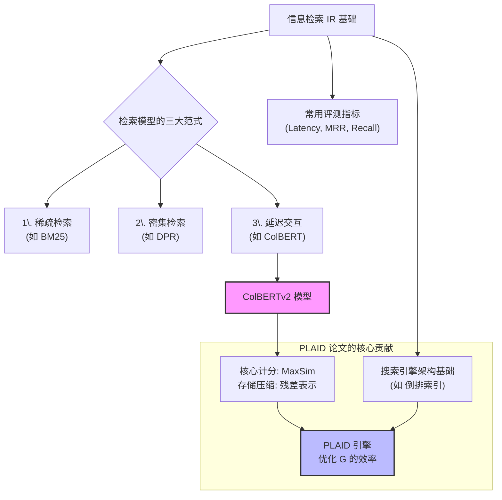

接下来，我们逐一讲解图中的每个关键概念。

-----

### 1\. 信息检索 (IR) 的基本概念

信息检索的核心任务是：当用户输入一个**查询 (Query)** 时，系统如何从一个庞大的**文档库 (Corpus)** 中，快速且准确地找到相关的**文档 (Document)** 或**段落 (Passage)**。

这篇论文主要关注的是**段落检索 (Passage Retrieval)**，即从数百万甚至上亿的文本段落中找出最匹配查询的几个。

### 2\. 检索模型的三大范式

为了实现检索，学术界和工业界发展出了不同的模型范式，它们在效果和效率之间做出了不同的权衡。

#### 范式一：稀疏检索 (Sparse Retrieval)

  - **核心思想**：基于“词袋模型”（Bag-of-Words），主要看查询和文档之间**关键词的匹配程度**。
  - **典型代表**：BM25。
  - **工作方式**：它会计算词频（TF）和逆文档频率（IDF）等统计信息，给每个词一个权重。如果一个词在查询和文档中都出现，并且这个词本身很稀有（信息量大），那么文档得分就高。
  - **优缺点**：速度飞快，技术成熟。但无法理解**语义相似性**，比如它不知道“汽车”和“轿车”是同义词。

#### 范式二：密集检索 (Dense Retrieval)

  - **核心思想**：利用深度学习模型（如 BERT）将查询和文档都转换成一个**固定长度的向量 (Vector)**，也叫**嵌入 (Embedding)**。这个向量可以捕捉文本的深层语义。
  - **典型代表**：DPR , ANCE 。
  - **工作方式**：
    1.  离线时，将所有文档都编码成一个个向量，存起来。
    2.  在线时，将用户的查询也编码成一个向量。
    3.  通过计算查询向量和所有文档向量的**点积 (dot-product)** 或**余弦相似度**，来衡量它们的语义相关性。分数最高的即为最相关的文档。
  - **优缺点**：能很好地理解语义，效果通常优于稀疏检索。但将整个文档的复杂语义压缩到一个向量中，可能会丢失一些细节，这被称为“点积瓶颈” 。

#### 范式三：延迟交互 (Late Interaction) - **本文重点**

  - **核心思想**：试图结合前两种范式的优点，既有语义理解能力，又能进行细粒度的匹配。

  - **典型代表**：ColBERT , ColBERTv2 。

  - **工作方式**：它与密集检索最大的不同在于，它不把整个文本压缩成一个向量，而是为文本中的**每个词元 (token) 都生成一个向量**。这样，一个查询和一个段落就分别表示为一个**向量矩阵**。

    我们可以借助论文中的 **图 1** 来理解这个过程： 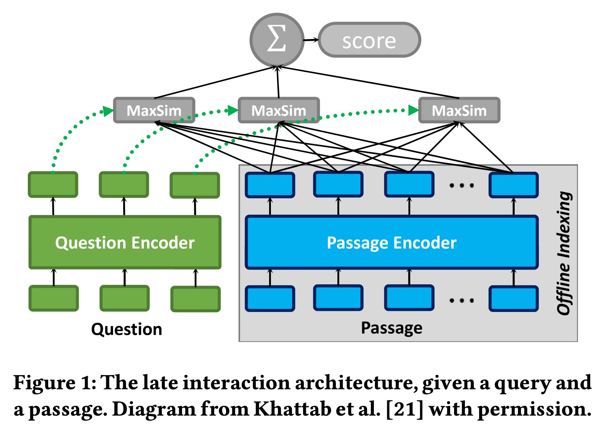  
    *图 1: 延迟交互架构*

    1.  **独立编码 (Offline Indexing)**：查询 (Question) 和段落 (Passage) 分别通过编码器，为每个词元生成一个向量（图中的小方块）。段落的编码可以提前离线完成 。
    2.  **交互计分 (MaxSim)**：在查询时，进行“最大相似度”计算。具体来说，对于**查询中的每一个词元向量**，都去段落的所有词元向量中**找到一个最相似的**（即点积最大）。
    3.  **最终得分 (Score)**：将所有查询词元找到的“最大相似度”分数**相加**，得到最终的相关性得分 。

  - **优缺点**：这种“词对词”的精细比较方式，使得它的检索质量非常高，是当前最先进的水平之一 。但缺点也显而易见：计算量和存储开销巨大，导致**检索速度（延迟）很慢** 。

**而 PLAID 这篇论文，就是要解决延迟交互模型速度慢的问题。**

### 3\. 理解 ColBERTv2: PLAID 的优化对象

PLAID 是为 ColBERTv2 模型设计的引擎，所以必须理解 ColBERTv2 的两个关键技术。

#### a. 核心计分方式: MaxSim

如上所述，它的得分公式为：
$$\hat{S}\_{q,d}=\sum_{i=1}^{|Q|}max_{j=1}^{|D|}Q_{i}\cdot D_{j}^{T}$$
其中， $Q_i$ 是查询的第 i 个词元向量， $D_j$ 是段落的第 j 个词元向量 。这个公式精确地描述了图 1 中的计分过程。

#### b. 存储与压缩: 残差表示 (Residual Representation)

ColBERTv2 为每个段落的每个词元都存储一个向量，索引会变得极其庞大（见论文表1，MS MARCO v2 数据集的索引大小达到 246GB ）。为了解决这个问题，ColBERTv2 提出了一种高效的压缩方法 ：  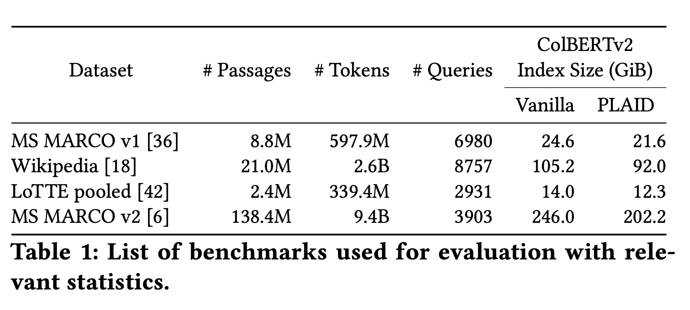  

1.  **质心 (Centroids)**：首先，通过 **k-means 聚类**算法，从所有文档的所有词元向量中，找出几万或几十万个具有代表性的“中心向量”，称为**质心**。每个质心都有一个唯一的 ID。
2.  **编码 (Encoding)**：对于任意一个原始的词元向量，不再存储它本身，而是存储两样东西：
      * **离它最近的那个质心的 ID** 。
      * 一个极小的**残差向量 (residual vector)**，表示原始向量与该质心之间的微小差异。这个残差向量会被极度压缩（量化到 1 或 2 比特） 。

这种方式极大地减小了索引的存储体积 。**PLAID 的一个核心创新，就是巧妙地利用了这个本为压缩而生的“质心”信息，来为检索过程加速** 。

### 4\. 搜索引擎架构与评测指标

#### a. 倒排索引 (Inverted Index)

这是一个经典的搜索引擎技术。传统的倒排索引是“词 -\> 文档列表”的映射。在 ColBERTv2 和 PLAID 的世界里，它变成了 **“质心 ID -\> 段落列表”** 的映射 。这意味着，通过一个质心 ID，可以快速找到所有包含“属于”该质心的词元的段落。这是实现快速候选段落生成的基础。

#### b. 评测指标

论文中用到了几个标准指标来衡量模型的好坏：

  - **延迟 (Latency)**：完成一次查询需要多长时间（单位是毫秒 ms）。这是 PLAID 主要优化的指标。**越低越好**。
  - **MRR@k (Mean Reciprocal Rank)**：衡量模型在**前 k 个结果**中找到**第一个**正确答案的能力。常用于问答任务。**越高越好**。
  - **Recall@k (召回率)**：在所有相关的正确答案中，模型返回的**前 k 个结果**里包含了其中百分之多少。**越高越好**。

-----

### 总结：如何理解 PLAID 的贡献

掌握了以上知识后，你就能清晰地理解 PLAID 的工作了：

1.  **背景**：延迟交互模型 (ColBERTv2) 效果虽好，但因为要对大量候选段落进行解压缩和完整的 MaxSim 计算，所以速度很慢（如图 2a 所示，索引查找和解压缩是巨大瓶颈 ）。  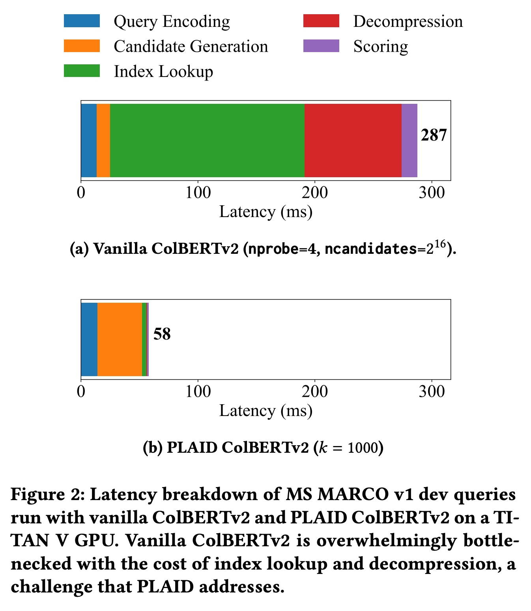  
2.  **PLAID 的洞察**：作者发现，仅使用压缩信息中的**质心**来进行一次粗略的 MaxSim 计算，就能以很高的召回率筛掉绝大部分不相关的段落 。
3.  **PLAID 的方法**：它设计了一个多阶段的过滤流水线（见论文图 5）。  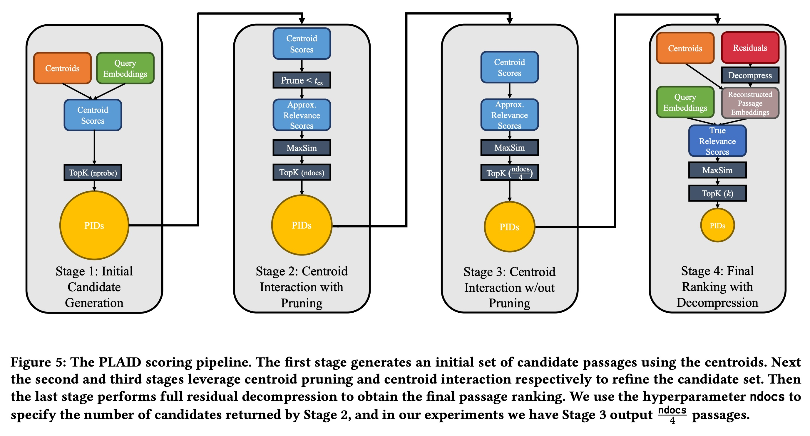  
      * **阶段1-3 (快速过滤)**：利用**质心交互 (Centroid Interaction)** 和**质心剪枝 (Centroid Pruning)**，在不解压残差向量的情况下，用非常低的成本，将候选段落从几十万个减少到几千甚至几百个 。
      * **阶段4 (最终排序)**：只对最后剩下的极少数“精英”候选段落，进行完整的残差解压缩和精确的 MaxSim 计算，得出最终排名 。

通过这种方式，PLAID 在几乎不损失检索质量的前提下，极大地降低了计算量，从而将在 GPU 上的速度提升了高达 7 倍，在 CPU 上更是达到了 45 倍 。

希望这份背景知识讲解能帮助你顺利读懂这篇优秀的论文！
  
## 2 解读论文 
  
好的，这篇名为《PLAID: An Efficient Engine for Late Interaction Retrieval》的论文，核心是介绍一种名为 **PLAID** 的高效引擎，它极大地提升了一种先进但缓慢的搜索技术 —— **“延迟交互”（Late Interaction）** —— 的运行速度，使其在实际应用中变得可行。

下面，我将为您深入浅出地解读这篇论文的关键内容。

### 核心问题：先进模型的“速度之痛”

首先，我们需要理解 PLAID 要解决的问题。近年来，一种名为 **ColBERT**  的搜索模型及其升级版 **ColBERTv2**  在许多信息检索任务上都取得了顶尖的效果 。这类模型属于“延迟交互”范式。

它的核心思想是：**不对整个文档和查询进行笼统的比较，而是将它们都拆解成一个个词元（token），为每个词元生成一个向量，然后进行精细化的“词元对词元”的相似度计算** 。这种细粒度的交互方式效果极佳，但代价是巨大的计算和存储开销，导致搜索**延迟（Latency）非常高** 。

论文中的 **图 2(a)** 直观地展示了这个问题。在一次查询中，原始 ColBERTv2 的绝大部分时间都耗费在了 **“索引查找 (Index Lookup)”** 和 **“解压缩 (Decompression)”** 这两个步骤上，而真正的核心计分（Scoring）只占一小部分。    

*图 2(a): 原始 ColBERTv2 的延迟分析，显示其瓶颈在于索引查找和解压缩 。*

**PLAID 的目标**：在不牺牲模型效果的前提下，攻克这两个性能瓶颈，让延迟交互模型跑得飞快 。

### PLAID 的两大核心洞察

PLAID 的成功建立在两个关键的发现之上，这两个发现都与 ColBERTv2 为了节省存储空间而设计的 **“残差表示法”** 有关。

简单来说，ColBERTv2 会将海量的词元向量通过聚类算法，找到几万个“中心点”，称为**质心 (Centroids)**。然后，每个原始向量都可以用“离它最近的那个质心的ID”加上一个微小的“残差向量”来表示和存储 。PLAID 巧妙地利用了这些本为压缩而生的“质心”。

#### 洞察一：仅用“质心”信息就能实现高召回率的初筛

作者们惊奇地发现，如果我们**只使用质心ID**来进行一次粗略的相关性计算，完全忽略掉需要大量计算才能解压的“残差向量”，得到的结果已经足够好了 。

**图 3** 完美地证明了这一点。该图显示，使用“仅质心”版本检索10000个候选段落，其中已经包含了由完整版 ColBERTv2 找出的前1000个最相关段落中的 99% 以上 。  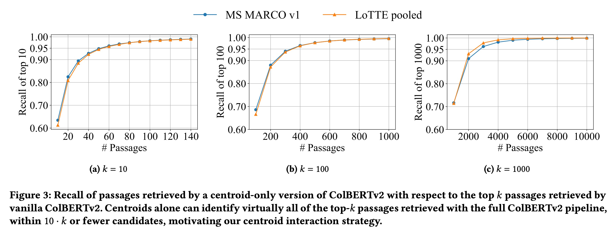  

*图 3: “仅质心”检索的召回率。横轴是“仅质心”方法召回的段落数量，纵轴是这些段落包含了多少完整版 ColBERTv2 的顶尖结果。可见，仅用质心就能以极高的概率找回所有重要结果 。*

这个发现意义重大：我们可以在前期用一种极低成本的方式，安全地过滤掉海量的不相关段落，而无需担心“错杀”真正的答案 。

#### 洞察二：对于单次查询，大部分“质心”并不重要

作者的第二个发现是，对于任意一个特定的查询，只有一小部分质心与之相关性较高，而绝大多数质心的得分都趋近于零 。

**图 4** 展示了15个不同查询的质心得分分布。可以看出，每个查询都只有一小撮“高分质心”，形成一个明显的“长尾效应” 。 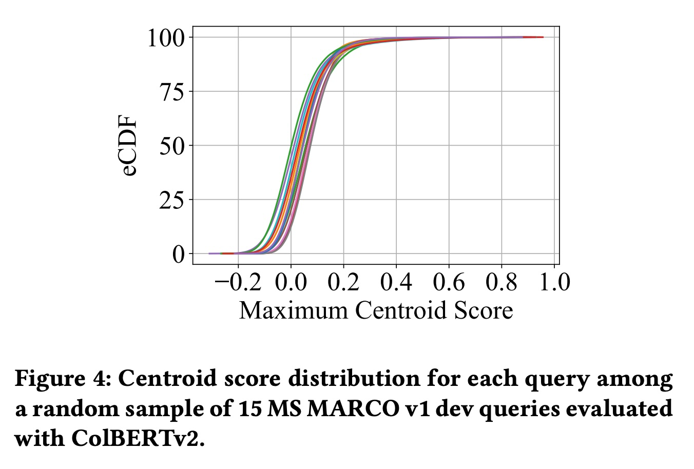  

*图 4: 不同查询的最大质心得分分布。大部分质心的得分都集中在0附近，只有少数得分较高 。*

这意味着，在计算时，我们可以**只关注那些高分质心**，而忽略掉其余大部分低分质心，从而进一步节省计算资源 。

### PLAID 的多阶段过滤流水线

基于以上洞察，PLAID 设计了一套精巧的多阶段过滤与排序流水线，如下图所示。其核心思想是 **“层层筛选，逐步精化”** 。

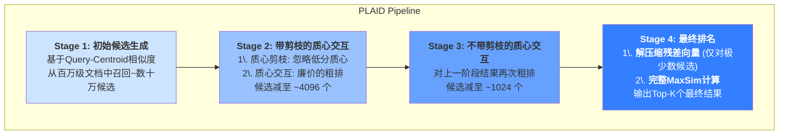

  * **阶段 1: 初始候选生成 (Initial Candidate Generation)**

      * 计算查询向量与所有质心向量的相似度 。
      * 通过倒排索引（从质心ID到段落ID的映射），快速找出包含高分质心的所有段落，形成一个庞大的初始候选集 。

  * **阶段 2: 质心交互与剪枝 (Centroid Interaction with Pruning)**

      * **质心剪枝**：基于“洞察二”，直接丢弃那些与当前查询最大相关性都低于某个阈值的质心及其对应的段落词元 。
      * **质心交互**：基于“洞察一”，对剩下的候选段落，用质心ID代替真实向量进行一次廉价版的 MaxSim 粗略排序 。
      * 经过这轮过滤，候选段落数量被大幅削减（例如，从几十万减少到几千个） 。

  * **阶段 3: 无剪枝的质心交互 (Centroid Interaction w/out Pruning)**

      * 对上一阶段幸存的候选集，再进行一次质心交互排序，进一步精选 。

  * **阶段 4: 最终排名 (Final Ranking with Decompression)**

      * 只有极少数（例如，约1000个）通过了所有考验的“精英”候选段落，才有资格进入此阶段 。
      * 此时，系统才会为它们**执行昂贵的残差向量解压缩**，恢复出完整的词元向量，并进行最终、最精确的 MaxSim 得分计算，得出最终排名 。

通过这个流程，PLAID 将最昂贵的计算（解压缩和完整版MaxSim）推迟到最后，并且只对极少数最有希望的候选者执行，从而极大地降低了整体延迟。

### 关键技术优化：“快上加快”的底层实现

除了算法流程的创新，PLAID 的极致性能还来源于其对底层计算的深度优化，论文中称之为 **“Fast Kernels”** 。

1.  **无填充MaxSim (Padding-Free MaxSim)**：常规的批处理为了对齐不同长度的段落，需要进行大量的“填充”操作，这既浪费内存又耗时 。PLAID 使用了定制的C++代码，可以直接在紧凑、无填充的数据上进行计算，大大提升了效率 。
2.  **优化解压缩 (Optimized Decompression)**：原始的解压缩需要复杂的位运算 。PLAID 则预先计算好所有可能的结果，存成一个**查找表 (lookup table)**。解压缩时，直接查表即可，将复杂的计算变成了简单的内存读取，速度飞快 。

### 惊人的实验结果

PLAID 的效果立竿见影。论文在多个数据集上进行了详尽的实验，结果如下：

  * **大幅提速**：与原始 ColBERTv2 相比，在几乎不损失检索质量的情况下，PLAID 在 **GPU 上实现了 2.5 至 7 倍的加速**，在 **CPU 上更是达到了惊人的 9 至 45 倍加速** 。
  * **极低延迟**：即使在处理高达1.4亿段落的超大规模数据集时，PLAID 也能在 GPU 上实现几十毫秒、在 CPU 上实现几十到几百毫秒的延迟 。
  * **贡献明确**：论文的**消融实验 (Ablation Study)** (图 6) 表明，无论是算法层面的“质心交互/剪枝”，还是实现层面的“Fast Kernels”，都对最终的性能提升做出了不可或缺的贡献 。  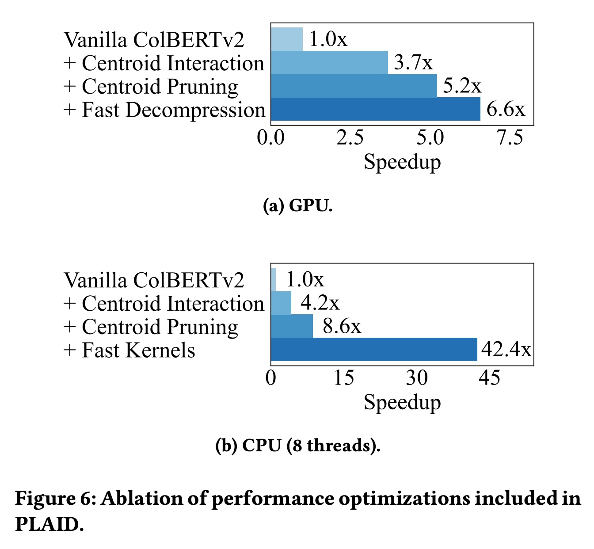  

| 数据集 (硬件) | 原始 ColBERTv2 延迟(ms) | PLAID 延迟(ms) | 加速倍数 | 质量 |
| :--- | :--- | :--- | :--- | :--- |
| MS MARCO v1 (CPU 8线程) | 4568.5  | 101.3  | **\~45x** | 基本无损  |
| MS MARCO v1 (GPU) | 259.6  | 38.4  | **\~6.8x** | 基本无损  |
| Wikipedia (CPU 8线程) | 5077.9  | 228.4  | **\~22x** | 基本无损  |
| Wikipedia (GPU) | 204.1  | 55.3  | **\~3.7x** | 基本无损  |

*根据论文表3和表4数据整理*

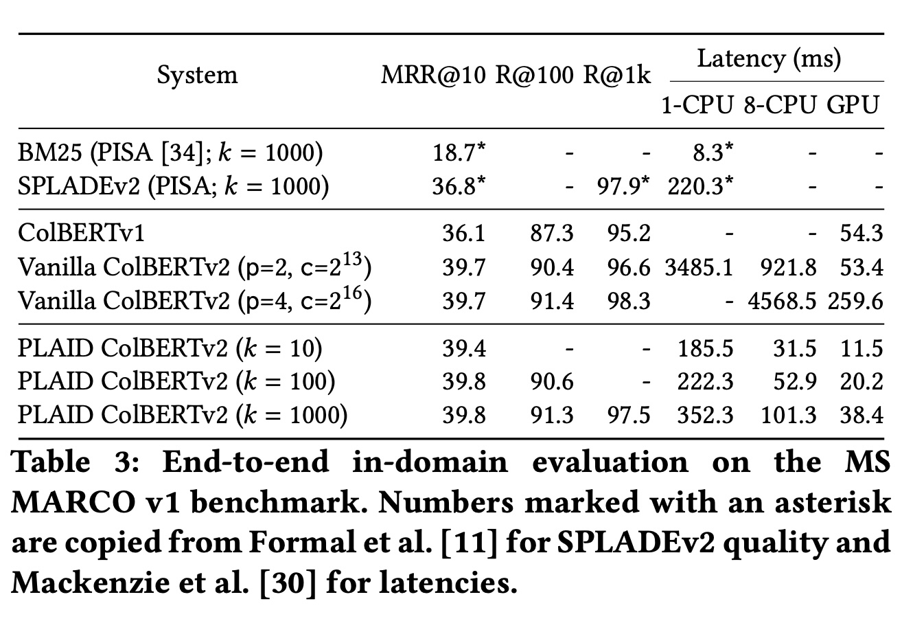  

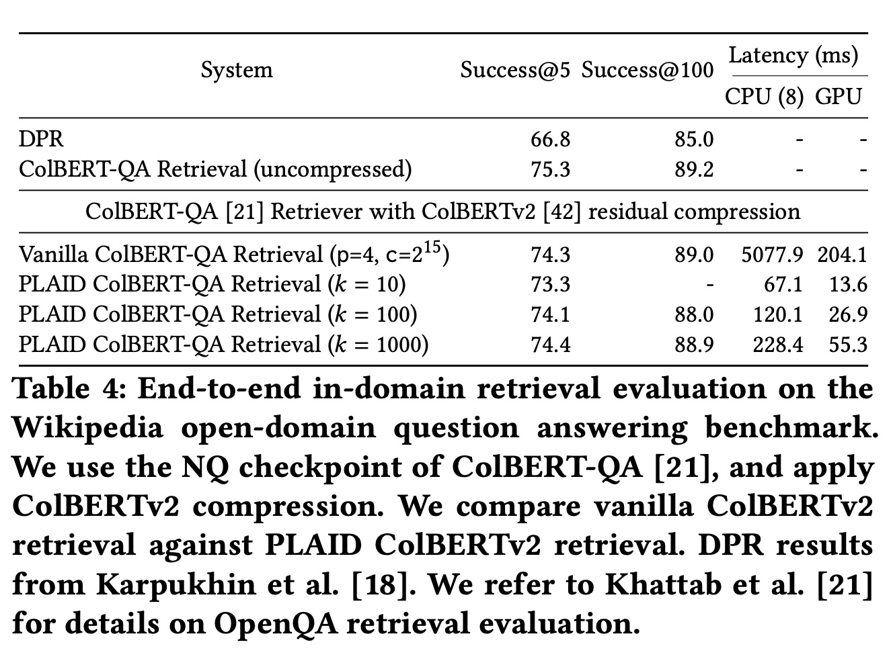  

### 结论

《PLAID》这篇论文的贡献是巨大的。它并没有提出一个全新的检索模型，而是设计了一个极其高效的**执行引擎**。通过对 ColBERTv2 压缩机制的深刻洞察，设计出“质心交互”和“质心剪枝”等廉价而高效的过滤算法，并结合底层的代码优化，成功地将“慢而精”的延迟交互模型变得“快又精”，极大地推动了其在对延迟要求苛刻的真实世界搜索场景中的应用潜力。
  
## 3 术语 
  
好的，这里是《PLAID: An Efficient Engine for Late Interaction Retrieval》这篇论文中的重要术语及其通俗易懂的中文讲解。

### 核心概念关系图

我们可以通过下面的流程图来理解这些关键术语之间的关系：

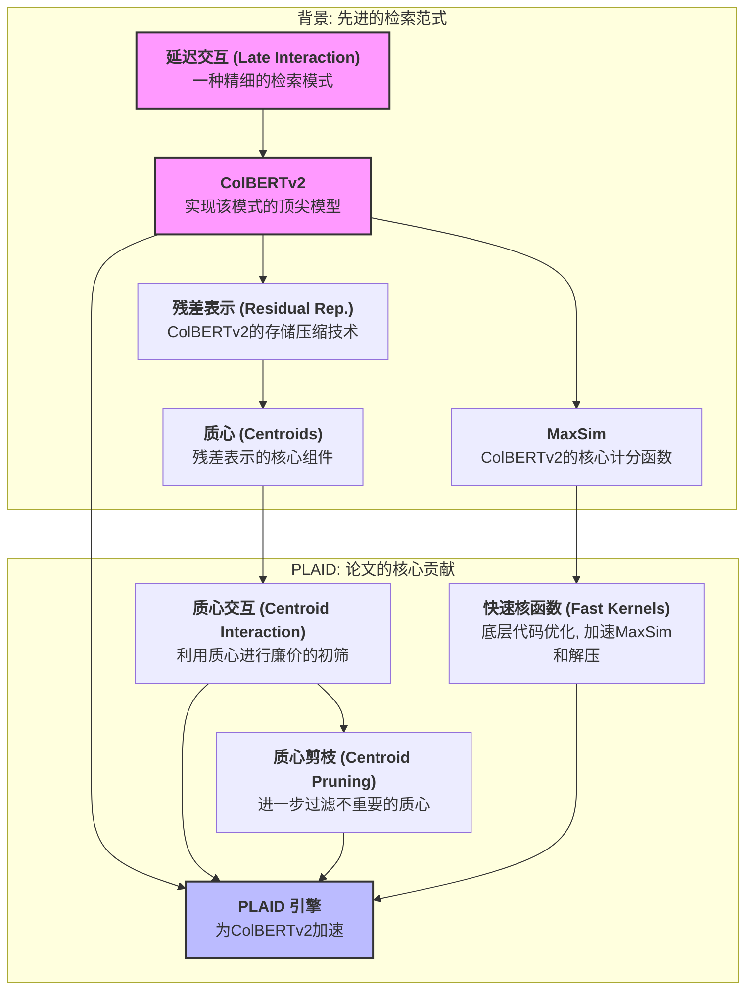

-----

### 1\. 延迟交互 (Late Interaction)

  - **讲解**：这是一种先进的信息检索模式，旨在实现更精细的匹配 。传统的密集检索模型会把整个查询和整个文档各自压缩成一个向量再进行比较，可能会丢失细节。而“延迟交互”则不同，它将查询和文档都看作是由多个**词元向量 (token-level vectors)** 组成的矩阵 。直到搜索的最后一刻（“延迟”），才让查询中的每个词元向量与文档中的所有词元向量进行充分的“交互”和计算，从而捕捉更细粒度的相关性 。

  - **图示**：论文的 **图 1** 直观地展示了这一过程。查询（Question）的每个小绿框（词元向量）都会和段落（Passage）的所有小蓝框进行比较。   

    *图 1: 延迟交互架构*

### 2\. ColBERTv2

  - **讲解**：ColBERTv2 是实现“延迟交互”范式的最先进模型之一 。它不仅检索质量高，还引入了一种高效的**残差表示法**来压缩庞大的索引，解决了存储问题 。PLAID 引擎正是为优化 ColBERTv2 的搜索速度而设计的 。

### 3\. MaxSim (最大相似度)

  - **讲解**：这是 ColBERT 模型家族的核心计分函数 。它的计算方式是：对于**查询中的每一个词元向量**，都去文档的所有词元向量中找到一个**最相似的**（即点积得分最高），然后将所有这些“最大相似度”得分**相加**，得到最终的相关性总分 。

  - **公式**： $\hat{S}\_{q,d}=\sum_{i=1}^{|Q|}max_{j=1}^{|D|}Q_{i}\cdot D_{j}^{T}$ 

### 4\. 残差表示 (Residual Representation) 与质心 (Centroids)

  - **讲解**：这是 ColBERTv2 为了大幅减小索引存储体积而采用的一种压缩技术 。

      * **质心 (Centroids)**：首先，通过 k-means 聚类算法，从所有文档的所有词元向量中，找出数万或数十万个具有代表性的“中心向量”，这些就是“质心” 。
      * **残差表示**：然后，任何一个原始的词元向量都不再被直接存储，而是被编码成两部分：1) 离它最近的那个**质心的ID**，以及 2) 一个极度压缩的**残差向量**，表示原始向量与该质心之间的微小差异 。

    **PLAID 的核心思想就是巧妙地利用了这个本为压缩而生的“质心”信息来为检索加速 。**

### 5\. PLAID (Performance-optimized Late Interaction Driver)

  - **讲解**：这是论文提出的核心贡献——一个为延迟交互模型打造的高性能驱动引擎 。它通过引入**质心交互**、**质心剪枝**和一系列**快速核函数**，在不牺牲检索质量的前提下，将 ColBERTv2 的搜索延迟在 GPU 上降低了高达 7 倍，在 CPU 上降低了高达 45 倍 。

### 6\. 质心交互 (Centroid Interaction)

  - **讲解**：这是 PLAID 提出的一种新颖、廉价的评分机制 。它将每个段落视作一个轻量的 **“质心袋” (bag of centroids)** 。在进行初步筛选时，它直接使用“质心”来代替完整、精确的词元向量进行近似的 MaxSim 计算 。这样做的好处是，可以在完全不加载和解压缩庞大的残差向量的情况下，快速地淘汰掉大量低分候选段落，极大地降低了计算开销 。

### 7\. 质心剪枝 (Centroid Pruning)

  - **讲解**：这是 PLAID 为了进一步提速而采用的另一种优化手段 。在进行质心交互之前，它会先计算查询向量与所有质心的相似度。如果一个质心与查询中**所有**词元向量的相似度都很低（低于一个阈值），那么这个质心就会被认为是“不重要的”，并在后续的计算中被直接“剪掉”或忽略 。这进一步减少了需要计算的对象数量。

### 8\. 快速核函数 (Fast Kernels)

  - **讲解**：指 PLAID 中为关键计算步骤专门编写的高度优化的底层代码，以实现极致性能 。
      * **无填充MaxSim (Padding-Free MaxSim)**：使用定制的 C++ 代码直接处理不同长度的段落数据，避免了传统批处理中为了对齐数据而进行的耗时“填充”(padding) 操作 。
      * **优化解压缩 (Optimized Decompression)**：将复杂的解压缩位运算，变成一次简单的**查表操作** 。通过预先计算所有可能的结果并存入查找表，极大地加快了残差向量的恢复速度 。
  
## 参考        
         
https://arxiv.org/pdf/2205.09707    
        
<b> 以上内容基于DeepSeek、Qwen、Gemini及诸多AI生成, 轻微人工调整, 感谢杭州深度求索人工智能、阿里云、Google等公司. </b>        
        
<b> AI 生成的内容请自行辨别正确性, 当然也多了些许踩坑的乐趣, 毕竟冒险是每个男人的天性.  </b>        
  
    
#### [期望 PostgreSQL|开源PolarDB 增加什么功能?](https://github.com/digoal/blog/issues/76 "269ac3d1c492e938c0191101c7238216")
  
  
#### [PolarDB 开源数据库](https://openpolardb.com/home "57258f76c37864c6e6d23383d05714ea")
  
  
#### [PolarDB 学习图谱](https://www.aliyun.com/database/openpolardb/activity "8642f60e04ed0c814bf9cb9677976bd4")
  
  
#### [PostgreSQL 解决方案集合](../201706/20170601_02.md "40cff096e9ed7122c512b35d8561d9c8")
  
  
#### [德哥 / digoal's Github - 公益是一辈子的事.](https://github.com/digoal/blog/blob/master/README.md "22709685feb7cab07d30f30387f0a9ae")
  
  
#### [About 德哥](https://github.com/digoal/blog/blob/master/me/readme.md "a37735981e7704886ffd590565582dd0")
  
  

  
