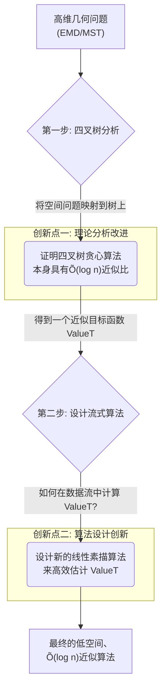

## AI论文解读 | New Streaming Algorithms for High Dimensional EMD and MST
        
### 作者        
digoal        
        
### 日期        
2025-10-11        
        
### 标签        
PostgreSQL , PolarDB , DuckDB , AI , 论文解读        
        
----        
        
## 背景  
      
https://arxiv.org/pdf/2111.03528        
  
提示:          
```          
读懂《New Streaming Algorithms for High Dimensional EMD and MST》这篇论文需要提前掌握哪些基础知识, 请使用中文通熟易懂的讲解这些基础知识, 可以引用论文中的图、表或使用Markdown支持的图形(text,mermaid等)增加解释性. 
  
使用中文通熟易懂的解读《New Streaming Algorithms for High Dimensional EMD and MST》这篇论文, 其中的关键内容请着重讲解, 可以引用论文中的图、表或使用Markdown支持的图形(text,mermaid等)增加解释性. 
  
提取《New Streaming Algorithms for High Dimensional EMD and MST》这篇论文中的重要术语, 使用中文对这些术语进行通熟易懂的讲解, 可以引用论文中的图、表或使用Markdown支持的图形(text,mermaid等)增加解释性. 
```     
  
## 1 前置知识 
  
好的，为了完全理解《New Streaming Algorithms for High Dimensional EMD and MST》这篇论文，您需要掌握一系列从基础理论到具体算法工具的知识。下面我将这些知识点分门别类，并用通俗易懂的中文进行讲解，同时引用论文内容和使用图示来帮助理解。

### 核心知识体系概览

理解这篇论文，可以从五个层面构建您的知识体系：

1.  **核心问题**：论文要解决的两个基本几何问题是什么？(EMD 和 MST)
2.  **计算模型**：算法是在怎样苛刻的环境下运行的？(数据流模型)
3.  **关键算法思想**：解决问题的宏观策略是什么？(近似、随机化、分治)
4.  **具体算法工具**：策略中使用了哪些具体的“瑞士军刀”？(线性素描、四叉树)
5.  **数学基础**：支撑这一切的数学语言是什么？(概率论、线性代数、度量空间)

-----

### 1\. 核心问题 (要知道“目标是什么”)

首先，要明白论文旨在为哪两个问题设计更高效的算法。

#### 1.1 推土机距离 (Earth Mover's Distance, EMD)

  * **是什么？** EMD，又称Wasserstein距离，衡量了将一个概率分布（或一堆“土”）变换成另一个分布（或填平一些“坑”）所需的最小“功” 。通俗地讲，想象有两个多重集（集合中允许有重复元素）A和B，大小均为n 。A代表了一堆沙堆，B代表了一堆坑。EMD就是将所有沙子从A的位置搬运到B的位置，以完全填满所有的坑所需要的最小总代价。代价的计算方式是 “搬运量 × 搬运距离” 的总和 。

  * **为什么重要？** EMD在很多领域都有应用，因为它能很好地衡量形状或内容的相似度。论文中提到了一个非常直观的应用：**词移距离 (Word Mover's Distance)** 。通过词嵌入技术，一篇文章可以被看作是空间中一堆点的集合 。两篇文章的EMD值越小，说明它们在语义上越相似，因为把一篇文章的“词语点”移动到另一篇的位置所需的总代价很低 。

#### 1.2 最小生成树 (Minimum Spanning Tree, MST)

  * **是什么？** 这是一个图论中的经典问题。给定空间中的n个点，MST的目标是找到一种连接所有点的方式，使得连接所有点的“边”的总长度之和最小，并且不能形成任何环路 。你可以想象要在n个村庄之间铺设光缆，MST就是成本最低的铺设方案。

  * **为什么重要？** MST在聚类分析、网络设计、计算机视觉等领域都有广泛应用 。在高维空间中，高效计算MST的成本对于理解数据点的内在结构至关重要。

### 2\. 计算模型 (要知道“规则是什么”)

这篇论文的算法是为一种特定的、资源受限的计算模型设计的。

#### 数据流模型 (Streaming Model)

  * **是什么？** 在数据流模型中，数据以一个连续、庞大的序列（“流”）的形式到达，算法必须依次处理每个数据项，但无法将所有数据都存储下来 。这是因为内存空间非常有限，通常远小于数据总量，理想情况下只有数据规模的多对数（polylog）级别 。
  * **旋转门模型 (Turnstile Model)**：这是数据流模型中功能最强大也最复杂的一种 。它不仅允许向数据集中**添加**点（插入），还允许**删除**点（删除）。想象一个计数器，不断有人进来（+1）和出去（-1），旋转门模型就是要处理这种动态变化。论文中的算法就是为这种模型设计的 。

### 3\. 关键算法思想与技术 (要知道“宏观策略是什么”)

由于计算模型的限制，无法使用传统算法。论文采用了一些核心思想来应对挑战。

#### 3.1 近似算法 (Approximation Algorithms)

  * **思想**：既然在有限空间内精确计算EMD或MST的成本极其困难甚至不可能，那么退而求其次，计算出一个与真实值足够接近的“近似值”。
  * **近似因子 (Approximation Factor)**：这是衡量近似算法好坏的关键指标。一个算法的近似因子为 $\alpha$ 意味着，它计算出的结果最多是真实最优解的 $\alpha$ 倍。这篇论文的一大贡献，就是将先前算法的 $O(\log n \cdot \min\{\log n, \log(\Delta d)\})$ 近似因子改进到了 $\tilde{O}(\log n)$ 。这里的 $\tilde{O}$ 符号表示忽略了其中更低阶的对数项。

#### 3.2 四叉树 (Quadtree) - 一种分而治之的策略

  * **是什么？** 四叉树是一种递归地划分空间的数据结构 。虽然名字叫“四叉”，源于在二维平面上每次将一个区域划分为四个象限 ，但在高维空间中，它会把一个区域（超立方体）划分为更多的子区域 。

  * **工作原理**：

    1.  从整个高维空间（根节点）开始。
    2.  随机选择一些坐标轴，并根据这些轴将当前空间区域切分成多个子区域（子节点）。
    3.  对每个子区域递归地进行此过程，直到区域小到一定程度（叶子节点）。
        这就在高维空间上建立了一棵树。空间中邻近的点，有很大概率会落在树中同一个叶子节点，或者它们的路径在树的较深层才会分开。

    您可以用下面的Mermaid图来形象地理解这个递归划分的过程：

    ```mermaid
    graph TD
        A("整个空间 [d维]") --> B(子空间1);
        A --> C(子空间2);
        A --> D(...);
        A --> E(子空间2^k);

        B --> B1(更小的子空间);
        B --> B2(...);

        C --> C1(更小的子空间);
        C --> C2(...);

        subgraph "根节点 (level 0)"
            A
        end

        subgraph level 1
            B
            C
            D
            E
        end

        subgraph level 2
            B1
            B2
            C1
            C2
        end
    ```

  * **在论文中的作用**：四叉树通过这种随机划分，将复杂的原始高维距离问题，转化为了一个更简单的树上距离问题 。EMD和MST的近似解可以在这棵树上通过自底向上的贪心策略高效构建 。这篇论文的核心贡献之一是对四叉树方法的分析进行了改进，证明了它能达到更好的近似效果 。

#### 3.3 线性素描 (Linear Sketches)

  * **是什么？** 这是处理旋转门数据流的“大杀器” 。其核心思想是将一个可能维度极高（比如 $\Delta^d$ 维）的向量 $f$ （代表数据点的指示向量）“压缩”成一个维度很低（比如 polylog( $n, d, \Delta$ ) 维）的向量，即“素描” (sketch)。
  * **如何工作？** 算法预先生成一个随机的“素描矩阵” $S$ （尺寸为 $k \times \Delta^d$ ，其中 $k$ 很小）。当数据流更新时，算法维护向量 $sk = S \cdot f$ 。由于矩阵乘法的线性性质，当 $f$ 发生变化（ 比如 $f \to f + \delta$ ），素描也相应地线性更新（ $sk \to sk + S\delta$ ）。数据流结束后，算法利用这个小小的素描向量 $sk$ 来估算原始向量 $f$ 的某些性质（例如它的 $l_1$ 范数），从而得到问题的近似解 。
  * **在论文中的作用**：这篇论文提出的所有流式算法都是线性素描 。作者们设计了新的线性素描方案，来估计基于四叉树和“数据依赖边权重”产生的目标值，这是实现单趟或两趟高效算法的关键 。

### 4\. 具体工具和概念 (要知道“工具箱里有什么”)

在上述宏观策略下，论文还依赖了一些具体的概率和算法工具。

  * **$l_p$ 范数 ( $l_p$ Norms ) 和 $l_p$ 采样 ( $l_p$-sampling )**

      * **$l_p$ 范数**：衡量向量大小的一种方式。 $l_1$ 范数是向量各元素绝对值之和，几何上对应“曼哈顿距离”。论文主要在 $l_p$ （ 其中 $p \in [1, 2]$ ）空间中研究问题 。
      * **$l_1$ 采样**：从一个向量中采样一个坐标，使得每个坐标被采样的概率与其绝对值大小成正比 。这是实现单趟EMD算法的一个核心步骤 。

  * **特定的素描算法 (Specific Sketching Algorithms)**

      * **Count-Sketch**：一种著名的线性素描，主要用于在数据流中识别“重击者”（heavy hitters），即那些出现频率非常高或数值非常大的项 。
      * **$l_1$-Sketch**：专门用于在数据流中近似计算向量 $l_1$ 范数的线性素描 。

  * **指数分布 (Exponential Distribution) 和 精准采样 (Precision Sampling)**

      * **指数分布**：一种连续概率分布，常用来表示独立随机事件发生的时间间隔。
      * **精准采样**：这是一种高级的采样技术，它为向量的每个坐标 $x_i$ 关联一个从指数分布中抽取的随机数 $t_i$ ，然后通过寻找 $x_i / t_i$ 的最大值来实现对 $x_i$ 的加权采样 。论文中将这种技术扩展到了所谓的“带元数据采样” (sampling with meta-data)，这是实现单趟算法的一个精妙之处 。

### 5\. 数学基础 (要知道“用什么语言描述”)

最后，要读懂论文的细节和证明，一些数学基础是必不可少的。

  * **概率论**：这是最重要的基础。您需要熟悉 **随机变量、期望、条件概率、概率分布（尤其是指数分布 ）、以及集中不等式（如马尔可夫不等式和切尔诺夫界）** ，因为整个算法的设计和分析都建立在概率之上。
  * **线性代数**：理解线性素描的核心——矩阵和向量的运算。
  * **度量空间 (Metric Spaces)**：EMD和MST问题都是在度量空间中定义的 。需要理解距离（度量）的基本性质，如三角不等式。
  * **图论**：对于MST问题，需要有基本的图论概念，如树、环、连通分量等。

### 总结

总的来说，要读懂这篇论文，您可以按照以下路径来准备：

1.  **打好基础**：回顾概率论、线代和图论的基本概念。
2.  **理解模型和问题**：弄清楚什么是 **数据流（特别是旋转门模型）** ，以及 **EMD** 和 **MST** 的定义。
3.  **掌握核心思想**：学习**近似算法**的基本理念，并深入理解**线性素描**和**四叉树**这两种核心技术。
4.  **了解具体工具**：对Count-Sketch、 $l_1$ 采样和精准采样等技术有一个概念性的认识。

有了这些知识储备，您在阅读这篇论文时，就能更好地理解作者为什么要这么设计算法，以及他们是如何在数学上证明其正确性和高效性的。
  
## 2 解读论文 
  
好的，我们来一起深入解读这篇重要的论文《New Streaming Algorithms for High Dimensional EMD and MST》。这篇论文为解决高维空间中的两个基本几何问题——**推土机距离 (EMD)** 和**最小生成树 (MST)**——在严格的**数据流模型**下，提出了近似比更优的新算法 。

### 论文简介与核心贡献

在高维数据分析中，我们经常需要衡量点集之间的相似度（EMD）或理解点集的内在连接结构（MST）。然而，当数据量巨大，无法一次性存入内存时，传统的算法便不再适用。这篇论文正是在这种“数据流”背景下展开的。

**核心贡献**可以概括为以下几点：

  * **改进了近似比**：对于EMD和MST问题，将之前最好的 $O(\log n \cdot \min\{\log n, \log(\Delta d)\})$ 近似比显著改进到了 $\tilde{O}(\log n)$ 。这里的 $n$ 是点的数量，这个改进意味着算法结果更接近真实值。
  * **高效的流式算法**：为MST问题提供了一个单趟（one-pass）流式算法 ，为EMD问题提供了一个两趟（two-pass）流式算法，以及一个带有少量可控附加误差的单趟算法 。
  * **创新的理论分析**：通过对一种名为“四叉树”的递归空间划分方法进行更精细的分析，证明了其本身就能达到 $\tilde{O}(\log n)$ 的近似比 。
  * **填补了理论空白**：首次为高维MST的流式计算问题建立了一个 $\Omega(\log n)$ 的近似比下界，证明了常数近似比是不可能实现的 。

-----

### 关键技术深度解析

论文的整体思路可以分为两大步骤，这也是其技术创新的核心所在。我们可以用下图来理解这个框架：



#### 第一步：更懂数据的四叉树 (Quadtree)

**1. 什么是四叉树？**
四叉树是一种递归划分空间的方法 。想象一下，我们有一个高维的“房间”（比如一个超立方体 `[Δ]^d`），房间里散落着很多数据点。

  * **第0层**：整个房间是树的根节点。
  * **第1层**：随机选择一个坐标轴，将房间沿该轴切成两半，形成两个子房间（子节点）。
  * **第2层**：再为每个子房间随机选择两个坐标轴，将其切成四份。
  * **依此类推**：在第 `j` 层，为每个区域随机选择 $2^j$ 个坐标轴进行划分 。

这个过程会形成一棵树，每个数据点最终都会落入树的一个叶子节点中。空间上靠近的点，有很大概率在树的较深层才会“分道扬镳”。

**2. 传统方法的局限**
以前的算法也用四叉树，它们给树的每条边赋予一个**固定的权重**（例如，边的权重只和它所在的深度有关）。这样做的好处是问题被简化了，可以直接套用现有的 $l_1$ 范数估计算法。但坏处是，这种“一刀切”的权重设定不够灵活，不能很好地适应数据的实际分布，导致最终的近似比不够理想 。

**3. 论文的核心创新：数据依赖的边权重 (Data-dependent Edge Weights)**
这篇论文的第一个突破在于，它提出了一种更智能的赋权方式 。

> **核心思想**：树中一条边 `(u, v)` (其中 `u` 是父节点，`v` 是子节点) 的权重，不再是固定的，而是定义为“随机从父节点 `u` 区域内取一个点，随机从子节点 `v` 区域内取一个点，它们之间距离的**平均值**” 。

这种权重是**数据依赖的**，因为它会根据实际落入这些区域的点来动态计算。如果点都聚集在一起，这个平均距离就会很小，反之则很大。这种方式能更真实地反映点集在不同尺度下的几何结构。

通过引入一个精巧的名为 **“检查员支付” (Inspector Payment)** 的分析框架，论文从数学上证明了，使用这种数据依赖权重的四叉树贪心算法，其计算结果与真实的EMD/MST值的差距被控制在 $\tilde{O}(\log n)$ 范围内 。这是论文在理论层面的一大贡献。

#### 第二步：实现数据依赖算法的流式计算

理论上的改进带来了新的算法挑战：**如何在一个内存极小的数据流中，计算这些依赖全体数据的平均距离呢？**

传统的方法失效了，因为边权重不再是固定的，整个问题不能再简单地归约为一个 $l_1$ 范数计算 。为此，论文设计了全新的线性素描算法。

**1. 两趟流式算法 (Two-Pass Algorithm)**
这是一个相对直观的解决方案：

  * **第一趟**：核心目标是“采样”。利用已有的 **$l_1$-采样** 技术，算法可以在数据流过一遍后，随机抽样出一个或多个树中的节点 `v`，被抽中的概率正比于这个节点的重要性（ 即它的“流量不平衡度” $|A_v| - |B_v|$ ）。
  * **第二趟**：核心目标是“估计元数据”。对于第一趟中采样到的每个节点 `v`，算法在数据流过第二遍时，集中精力估算与之相关的那个“数据依赖的平均距离” 。

通过重复这个过程足够多次，就可以得到对总成本的一个很好的近似。

**2. 单趟流式算法 (One-Pass Algorithm) 与“带元数据的采样”**
实现单趟算法是更难、也更精妙的部分。作者们引入并解决了一个更普适的问题，可称之为 **“带元数据的采样” (Sampling with Meta-data)** 。

> **问题**：我们想从一个向量中按权重采样一个坐标 `i`，同时还需要得到与 `i` 相关的“元数据” $\lambda_i$ （在我们的场景里，元数据就是那个数据依赖的平均距离）。

作者们基于一种叫做 **“精准采样” (Precision Sampling)** 的技术 ，设计了一个巧妙的两步采样方案来解决这个问题：

1.  **第一步：采样父节点**。算法并不直接去采样一个子节点 `v`，而是先采样它的父节点 `u` 。采样的权重正比于这个父节点下所有子节点的总“不平衡度”之和。
2.  **第二步：在父节点内采样**。一旦确定了父节点 `u`，算法再在其所有子节点中，按权重采样一个子节点 `v` 。

这个两步走的设计非常关键，它避免了直接对所有子节点进行采样时，由于父节点信息被重复计算而导致的“元数据范数爆炸”问题 。通过对两次采样过程中使用的随机数（来自指数分布）进行复杂的分析，作者成功设计出了一个单趟就能完成任务的线性素描算法，代价是引入了一个微小的、与问题规模相关的附加误差 $\epsilon d \Delta n$ 。

-----

### 主要成果总结

综合以上技术，论文最终取得了一系列理论和算法上的成果：

| 成果 | 描述 | 近似比 | 空间复杂度 |
| :--- | :--- | :--- | :--- |
| **MST流式算法** (Theorem 1) | 存在一个单趟（one-pass）旋转门流式算法来近似MST的成本 。 | $O(\log n)$ | polylog( $n, d, \Delta$ ) |
| **EMD两趟流式算法** (Theorem 2) | 存在一个两趟（two-pass）旋转门流式算法来近似EMD的成本 。 | $O(\log n)$ | polylog( $n, d, \Delta$ ) |
| **EMD单趟流式算法** (Theorem 3) | 存在一个单趟（one-pass）旋转门流式算法，其结果带有一个附加误差项 。 | $O(\log n)$ (相对误差) + $\epsilon d \Delta n$ (附加误差) | $O(1/\epsilon) \cdot$ polylog( $n, d, \Delta$ ) |
| **四叉树近似比** (Theorem 4) | 证明了基于四叉树的贪心匹配/生成树算法本身就能达到很好的近似效果 。 | $\tilde{O}(\log n)$ | (这是一个离线算法的分析) |
| **MST下界** (Theorem 5) | 证明了任何使用有限空间的流式算法，其近似比至少是 $\Omega(\log n)$ 。 | - | - |

总而言之，这篇论文通过对四叉树方法的深刻理论洞察，结合精巧的、适应数据依赖特性的新型线性素描算法设计，成功地在高维EMD和MST这两个基本问题的流式计算上取得了重大突破。
  
## 3 术语 
  
好的，这里是对论文《New Streaming Algorithms for High Dimensional EMD and MST》中一些重要术语的通俗化中文讲解。

-----

### 1\. 核心问题术语

#### 推土机距离 (Earth Mover's Distance, EMD)

  * **论文定义**: 给定两个大小相同（均为n）的多重集 A 和 B，EMD 是将 A 中的每个点与 B 中的一个唯一の点进行匹配的最小代价。总代价是所有匹配对之间距离的总和 。
  * **通俗讲解**: 想象 A 是一堆沙堆，B 是一系列坑洞。EMD 就是将所有沙子从 A 的位置搬运到 B 的位置以填满所有坑洞，所需要付出的最小“劳力” 。这里的“劳力”= (搬运量 × 搬运距离) 的总和。如果两个点集的 EMD 很小，说明它们的分布很相似。
  * **应用实例**: 论文中提到了一个很酷的应用叫“词移距离” (Word Mover's Distance) 。通过“词嵌入”技术，一篇文章可以被看作是高维空间中的一堆点 。两篇文章的 EMD 就是把一篇文章的“词语点云”移动、变换成另一篇的最小代价，这个代价越小，说明两篇文章在语义上越相似 。

#### 最小生成树 (Minimum Spanning Tree, MST)

  * **论文定义**: 对于空间中的一个点集 X，MST 是一棵连接所有点的树，它没有任何环路，并且所有边的长度之和是最小的 。
  * **通俗讲解**: 假设你需要在 n 个村庄之间铺设光缆，让所有村庄都能互相通信。MST 就是成本最低的铺设方案，它用最短的总光缆长度将所有村庄连接起来，且不会出现多余的环路连接 。

### 2\. 计算模型与算法类型

#### 旋转门数据流模型 (Turnstile Streaming Model)

  * **论文定义**: 这是一种处理数据序列的计算模型，数据以流的形式不断到达。这个模型的功能非常强大，因为它不仅允许**增加**数据点（插入），也允许**删除**数据点（删除）。算法必须在极小的内存限制下处理这些动态更新，而不能把所有数据都存下来 。
  * **通俗讲解**: 想象一个体育场的旋转门，不断有人进来（+1）和出去（-1）。你是一个记性不好但反应很快的保安，不能记住所有在场观众的脸，只能在他们进出时看一眼。旋转门模型下的算法，就像你只用一个小本子，通过观察人流的进出，来估算场内观众的某个特征（比如平均年龄）。

#### 线性素描 (Linear Sketches)

  * **论文定义**: 这是一种先进的流式算法技术。它将一个维度可能极高的数据向量 `f`（代表所有数据点的信息）压缩成一个维度很低的“素描”向量。这是通过将 `f` 左乘一个随机生成的“素描矩阵” `S` 来实现的，算法只需维护这个小得多的结果向量 `S*f` 。
  * **通俗讲解**: 想象你有一张极其巨大、细节丰富的照片（高维向量 `f`）。线性素描就像一位漫画家（随机矩阵 `S`）看了这张照片后，用寥寥数笔画出了一幅神似的简笔画（素描向量 `S*f`）。虽然简笔画丢失了很多细节，但你仍然可以从它身上看出原照片的一些关键特征（比如照片里的是人还是猫）。这篇论文的所有算法都属于这种类型 。

### 3\. 核心技术与创新概念

#### 四叉树 (Quadtree)

  * **论文定义**: 一种通过递归地、随机地划分空间来组织数据点的方法，从而形成一棵树状结构 。虽然名字叫“四叉树”（源于在二维平面中每次划分成四个象限），但论文将其作为一个通用术语，用于指代在高维空间中的类似划分方法 。

  * **通俗讲解与图示**: 这是一个“分而治之”的策略。从整个空间（树根）开始，不断地随机“切蛋糕”，把大空间切成小空间。空间中离得近的点，很大概率会一起被分到同一个小块里，在树上的路径也更长 。

    ```mermaid
    graph TD
        A("整个d维空间 (根节点)") --> B("子区域 1");
        A --> C("子区域 2");
        A --> D("...");
        B --> B1("更小的子区域");
        B --> B2("...");
        C --> C1("更小的子区域");
    ```

    通过这种方式，复杂的高维距离问题被巧妙地转化为了一个相对简单的树上距离问题。

#### 数据依赖的边权重 (Data-dependent Edge Weights)

  * **论文定义**: 这是本文在理论分析上的一个核心创举。它为四叉树的边赋予了一种新的权重。一条边 `(u, v)`（`u`是父节点）的权重不再是固定的，而是定义为 **“从父节点`u`的区域内随机取一个点，再从子节点`v`的区域内随机取一个点，计算它们之间距离的平均值”** 。
  * **通俗讲解**: 以前的方法给树上的“道路”（边）设定了固定的“通行费”（权重）。这篇论文让“通行费”变得智能了：如果一条路连接的两个区域里的点都挤在一起，那么这条路的“通行费”就很低；如果点分布得很散，“通行费”就高。这种权重更能反映数据的真实分布情况，使得基于四叉树的估算更加精准 。

#### 带元数据的采样 (Sampling with Meta-data)

  * **论文定义**: 这是为实现单趟EMD算法而提出的一个抽象问题。目标是在数据流中，不仅要按照某个权重分布 `x_i` 随机采样出一个坐标 `i`，还要同时估算出与 `i` 相关的附加信息，即“元数据” `λ_i`（在这里，元数据就是那个复杂的数据依赖边权重）。
  * **通俗讲解**: 想象一个在线抽奖活动。每个参与者（坐标 `i`）的中奖概率（权重 `x_i`）不同，同时每个参与者还有一个隐藏的“幸运值”（元数据 `λ_i`）。“带元数据的采样”就好比设计一个高效的抽奖系统，它转一次就能**既公平地抽出中奖者，又立刻知道这位中奖者的幸运值是多少**，而不需要把所有参与者的信息都看一遍。

#### 检查员支付 (Inspector Payment)

  * **论文定义**: 这是论文为了证明其“数据依赖边权重”分析的正确性而引入的一种巧妙的数学工具 。为了分析任意两点 `a` 和 `b` 在四叉树中的扭曲程度，作者虚构了一个“检查员”的角色。这个检查员从树的根节点出发去寻找 `a` 和 `b`。当 `a` 和 `b` 的路径在树中分叉后，检查员需要为后续的每一步“支付”一笔费用，费用的大小与 `a`（或`b`）到当前区域内其他点的平均距离有关 。
  * **通俗讲解**: 这是一种强大的“思想实验”或证明技巧。与其直接硬磕复杂的数学公式，不如讲一个“检查员花钱”的故事。通过证明这个检查员的总花费期望值很小（被控制在 $\tilde{O}(\log n) \cdot \|a-b\|_1$ 内），论文间接地证明了他们提出的数据依赖四叉树算法的成本也很小，从而保证了其优秀的近似效果 。
  
## 参考        
         
https://arxiv.org/pdf/2111.03528    
        
<b> 以上内容基于DeepSeek、Qwen、Gemini及诸多AI生成, 轻微人工调整, 感谢杭州深度求索人工智能、阿里云、Google等公司. </b>        
        
<b> AI 生成的内容请自行辨别正确性, 当然也多了些许踩坑的乐趣, 毕竟冒险是每个男人的天性.  </b>        
  
    
#### [期望 PostgreSQL|开源PolarDB 增加什么功能?](https://github.com/digoal/blog/issues/76 "269ac3d1c492e938c0191101c7238216")
  
  
#### [PolarDB 开源数据库](https://openpolardb.com/home "57258f76c37864c6e6d23383d05714ea")
  
  
#### [PolarDB 学习图谱](https://www.aliyun.com/database/openpolardb/activity "8642f60e04ed0c814bf9cb9677976bd4")
  
  
#### [PostgreSQL 解决方案集合](../201706/20170601_02.md "40cff096e9ed7122c512b35d8561d9c8")
  
  
#### [德哥 / digoal's Github - 公益是一辈子的事.](https://github.com/digoal/blog/blob/master/README.md "22709685feb7cab07d30f30387f0a9ae")
  
  
#### [About 德哥](https://github.com/digoal/blog/blob/master/me/readme.md "a37735981e7704886ffd590565582dd0")
  
  

  
