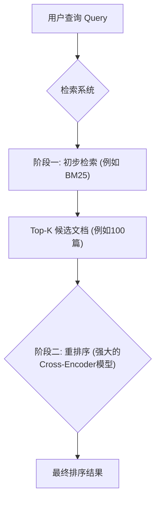
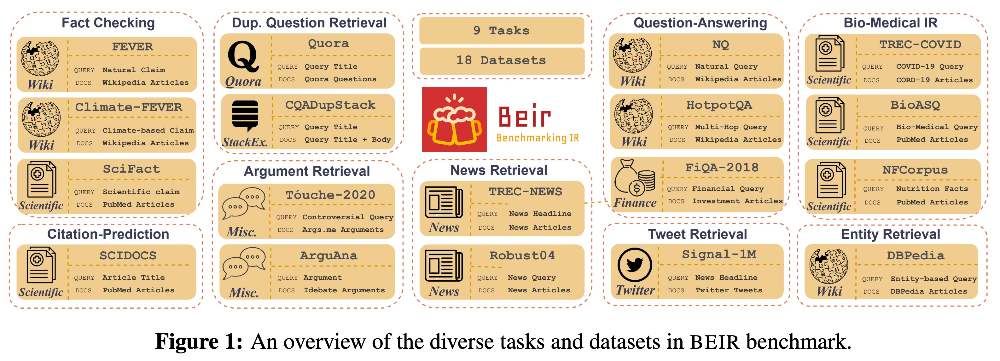
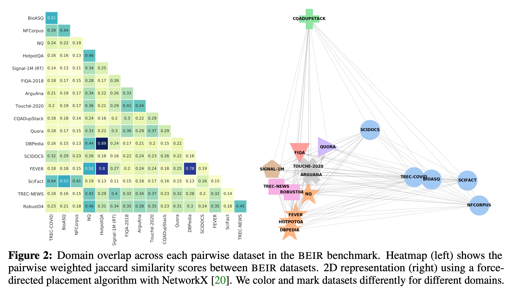
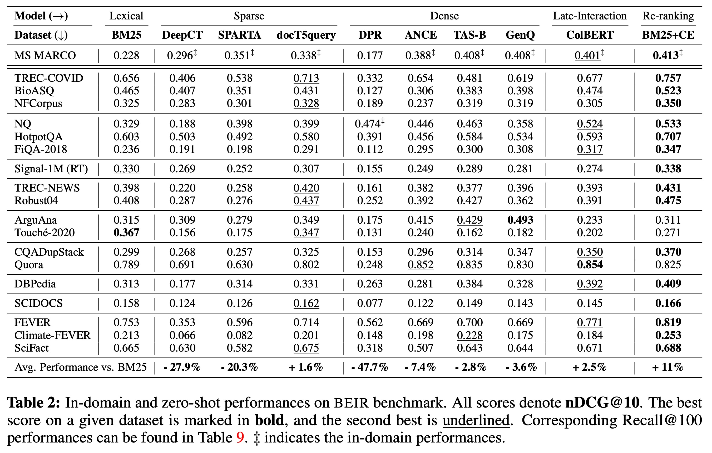
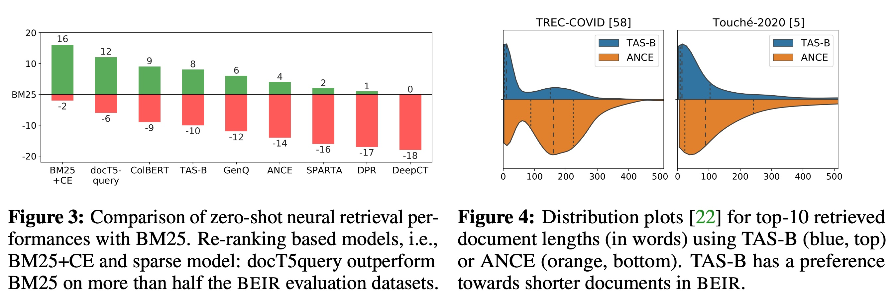
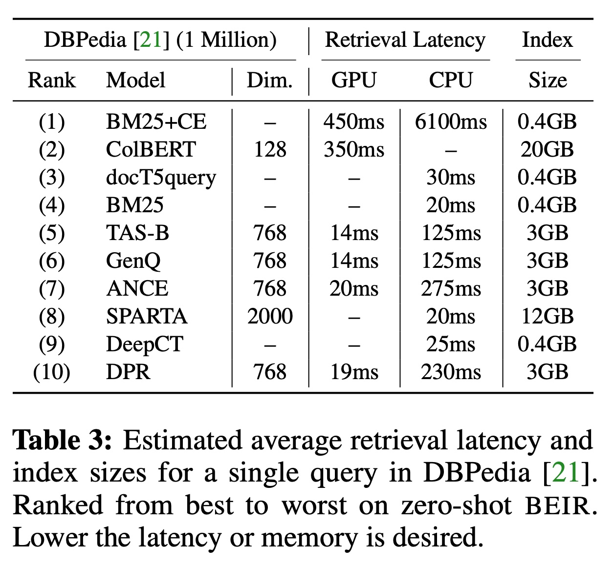
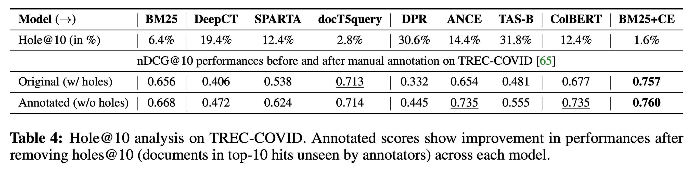
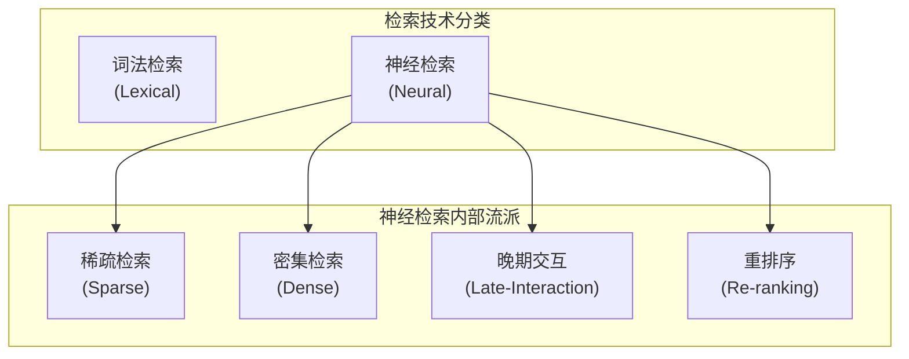

## AI论文解读 | BEIR: A Heterogeneous Benchmark for Zero-shot Evaluation of Information Retrieval Models
        
### 作者        
digoal        
        
### 日期        
2025-10-12        
        
### 标签        
PostgreSQL , PolarDB , DuckDB , AI , 论文解读        
        
----        
        
## 背景  
      
https://arxiv.org/pdf/2104.08663        
  
提示:          
```          
读懂《BEIR: A Heterogeneous Benchmark for Zero-shot Evaluation of Information Retrieval Models》这篇论文需要提前掌握哪些基础知识, 请使用中文通熟易懂的讲解这些基础知识, 可以引用论文中的图、表或使用Markdown支持的图形(text,mermaid等)增加解释性. 
  
使用中文通熟易懂的解读《BEIR: A Heterogeneous Benchmark for Zero-shot Evaluation of Information Retrieval Models》这篇论文, 其中的关键内容请着重讲解, 可以引用论文中的图、表或使用Markdown支持的图形(text,mermaid等)增加解释性. 
  
提取《BEIR: A Heterogeneous Benchmark for Zero-shot Evaluation of Information Retrieval Models》这篇论文中的重要术语, 使用中文对这些术语进行通熟易懂的讲解, 可以引用论文中的图、表或使用Markdown支持的图形(text,mermaid等)增加解释性. 
```     
  
## 1 前置知识 
  
好的，为了完全理解《BEIR: A Heterogeneous Benchmark for Zero-shot Evaluation of Information Retrieval Models》这篇论文，您需要掌握以下几个核心基础知识。我会用通俗易懂的方式，并结合论文中的图表来解释它们。

### 1\. 什么是信息检索 (Information Retrieval, IR)？

这是最基础的概念。简单来说，信息检索就是**从一个庞大的信息集合（比如网页、论文库、商品列表）中，根据用户的需求（查询），找出相关的几条信息**。

  - **查询 (Query)**：用户输入的关键词、问题或一句话。
  - **文档 (Document)**：信息集合中的每一条信息单元，可以是一篇新闻、一个段落、一条推文等。
  - **语料库 (Corpus)**：所有文档的集合。

您可以把这个过程想象成在图书馆找书。你的“查询”是你想研究的课题，图书馆里所有的书就是“语料库”，而你最终找到的那几本最相关的书就是检索结果。这篇论文中反复提到的`query`和`document`就是指这个过程中的两个核心元素 。

### 2\. 什么是“零样本” (Zero-shot) 评估？

这是理解这篇论文**核心贡献**的关键。

通常，我们训练一个AI模型，会用大量的“问题-答案”对（训练数据）来教它。比如，我们用10万个关于“MS MARCO”数据集的问题来训练它，然后用另外1万个“MS MARCO”的问题来测试它，看它学得好不好。这叫**领域内 (in-domain)** 评估。

而“零样本”评估则是一种更苛刻、更接近现实的测试方式：**让模型去回答它从未学习过领域的问题** 。

**打个比方**：你让一个学生学习了《内科学》的所有知识（训练），然后不让他接触任何其他领域的书，直接拿一份《金融学》的卷子去考他（测试）。这场考试就是“零样本”评估。

这个评估能真实地反映出模型的**泛化能力 (Generalization Capability)** ，即把学到的知识应用到全新未知领域的能力。BEIR这个 benchmark 的主要目的就是为了方便大家进行这种零样本评估 。

### 3\. 传统与现代的IR方法：从“文字匹配”到“语义理解”

信息检索的技术一直在发展，论文中对比了两种主流方法。

#### 3.1 传统方法 - 词法检索 (Lexical Retrieval)

这种方法的核心是**关键词匹配**。它不真正“理解”文字的意思，而是看查询和文档中有多少相同的词，以及这些词的重要性。

  - **代表技术：BM25** 。这是论文中最重要的基准（Baseline）模型。它是一个非常强大的关键词匹配算法。
  - **优点**：速度快，效果稳健。
  - **缺点**：存在 **“词法鸿沟” (Lexical Gap)** 。比如，你搜“汽车发动机维修指南”，但一篇文章的标题是“车辆马达修理手册”，尽管意思完全一样，但因为关键词不匹配，BM25可能就找不到这篇文章。

#### 3.2 现代方法 - 神经检索 (Neural Retrieval)

这种方法使用深度学习模型（特别是像BERT这样的预训练语言模型），来**理解文字的语义（含义）** 。

  - **核心思想**：将查询和文档都转换成一串数字，称为**向量 (Vector)** 或 **嵌入 (Embedding)**。在向量空间中，意思相近的文本，它们的向量也更接近。
  - **优点**：能够跨越“词法鸿沟”，找到语义相关但用词不同的文档。
  - **缺点**：计算成本高，且在未知领域的表现（零样本能力）参差不齐，这也是BEIR要重点考察的。

### 4\. 神经检索的几种“流派”（架构）

论文中评估了多种神经检索模型，它们可以大致分为以下几类 ，了解它们的区别对读懂论文的实验部分至关重要。

1.  **密集检索 (Dense Retrieval)**：

      * **原理**：为每个查询和文档生成一个“浓缩”的向量（比如768维）。检索时，计算查询向量和所有文档向量的相似度，找出最接近的。这就像把所有文本在“语义地图”上进行定位，然后找离查询点最近的几个点 。
      * **优点**：检索速度极快。
      * **缺点**：论文发现这类模型在零样本场景下表现不佳，容易“水土不服” 。

2.  **稀疏检索 (Sparse Retrieval)**：

      * **原理**：可以看作是传统词法检索的“智能升级版”。它使用AI模型来判断哪些词更重要，或者为原始文档“脑补”出一些相关的关键词（文档扩展，Document Expansion），然后再用类似BM25的方式进行检索 。
      * **代表**：`docT5query` 模型通过生成可能的查询来扩展文档。

3.  **晚期交互 (Late-Interaction)**：

      * **原理**：这是一种折中方案。它不像密集检索那样把整个文档压缩成一个向量，而是为文档中的每个词都生成一个上下文相关的向量。检索时，再将查询中每个词的向量与文档中所有词的向量进行细致比较 。
      * **代表**：`ColBERT` 模型。

4.  **重排序 (Re-ranking)**：

      * **原理**：这是一个两阶段过程。
        1.  **第一阶段**：用一个快速的方法（比如BM25）先从海量文档中粗略地选出前100个候选者。
        2.  **第二阶段**：用一个非常强大但计算缓慢的“精排”模型（如Cross-Encoder）来仔细阅读这100个候选文档，并给出最精准的排序 。
      * **优点**：效果通常是最好的，因为它结合了速度和精度。论文发现它在零样本场景下泛化能力最强 。
      * **缺点**：计算成本和延迟最高。

下面这个流程图可以帮助你理解“重排序”的工作模式：



### 5\. 如何评价检索模型的好坏？（评估指标）

评价检索系统不能只看“找没找到”，还要看“排得好不好”，即相关文档是否排在前面。论文主要使用了一个指标：**nDCG@10**。

  - **nDCG (Normalized Discounted Cumulative Gain)** 的通俗解释 ：
      - **Gain (增益)**：检索到的相关文档是有价值的。文档越相关，价值（分数）越高。
      - **Cumulative (累积)**：计算前K个结果的总价值。
      - **Discounted (折损)**：排在越后面的结果，价值会打折扣。排在第1位比排在第10位价值高得多。
      - **Normalized (归一化)**：将得到的分数与“理想中最好排序”的分数做比较，得出一个0到1之间的值。这样便于在不同查询之间进行公平比较。
  - **@10**：表示我们只关心排名前10的结果 。

简单来说，**nDCG@10分数越高，说明模型不仅找到了相关文档，还把它们排在了最前面**。

### 6\. BEIR到底是什么？

掌握了以上知识后，我们就能清晰地定义BEIR了：

BEIR不是一个模型，而是一个**用于对信息检索模型进行零样本评估的、异构的、多样化的基准测试平台** 。

  - **异构性 (Heterogeneous)**：它包含了9种完全不同的检索任务，比如事实核查、问答、生物医疗文献检索、寻找重复问题等 。

      * *图1展示了BEIR所包含的丰富任务和数据集。* 
          

  - **多样性 (Diverse)**：它囊括了18个来自不同领域的数据集，比如维基百科、科学出版物、新闻、推特、金融论坛等 。

      * *图2的右侧部分通过力导向图展示了不同数据集之间的“距离”。点与点之间离得越远，说明它们的内容（词汇）重叠度越低，领域差异越大。这证明了BEIR是一个极具挑战性的基准测试。* 
          

**总结一下**：要读懂这篇论文，您需要先了解**信息检索**的基本概念，然后理解**零样本评估**对于测试模型泛化能力的重要性。接着，您要能区分**词法检索 (BM25)** 和**神经检索**，并对神经检索的几种主流架构（**密集、稀疏、晚期交互、重排序**）有基本的认识。最后，了解**nDCG@10**这个评估指标是如何衡量检索质量的。有了这些基础，您就能明白BEIR作为一个测试平台，其设计思想和核心价值所在。
  
## 2 解读论文 
  
好的，这篇名为《BEIR: A Heterogeneous Benchmark for Zero-shot Evaluation of Information Retrieval Models》的论文，是信息检索（Information Retrieval, IR）领域一篇非常重要的工作。我们可以把它通俗地理解为一篇 **“IR模型通用能力大摸底”的说明书和成绩单** 。

下面，我将为您深入浅出地解读这篇论文的核心内容。

### 1\. 论文解决了什么“痛点”？—— “偏科”与“真实世界”的脱节

在BEIR出现之前，研究人员通常在一个或少数几个特定的数据集上训练和测试他们的AI检索模型。例如，一个模型在“MS MARCO”这个问答数据集上训练，又在它的测试集上考试，取得了很高的分数 。

这就带来了一个严重的问题： **模型很可能会“偏科”** 。它可能只是死记硬背了这个特定领域的知识和模式，一旦遇到一个全新的、从未见过的任务或领域（比如从日常问答切换到生物医学论文检索），表现可能一落千丈 。这种只在“课内”表现好，一到“课外”就失灵的现象，限制了模型在真实世界中的应用价值，因为现实中的检索需求是多种多样的。

为了解决这个问题，作者们提出了BEIR，其核心目标是评估模型在 **“零样本”（Zero-shot）** 设置下的表现，即 **在没有任何针对性训练的情况下，模型处理全新任务的通用能力** 。

### 2\. BEIR是什么？—— 一个全面且严苛的“高考考纲”

BEIR本身不是一个模型，而是一个**基准测试平台（Benchmark）** 。它就像一套为所有IR模型设计的“高考考纲”，旨在全面、公平地检验它们的“通用知识水平”。

BEIR的核心特点是**异构性（Heterogeneous）和多样性（Diverse）** 。

  * **任务异构**：它汇集了9大类完全不同的检索任务 ，包括：
      * 事实核查 (Fact Checking) 
      * 问答 (Question-Answering) 
      * 生物医疗IR (Bio-Medical IR) 
      * 重复问题检索 (Duplicate Question Retrieval) 
      * 以及新闻、推文、论点检索等 。
  * **领域多样**：它精选了18个公开的数据集 ，这些数据集的来源和文体千差万别，覆盖了维基百科、科学文献、新闻、推特、金融论坛等多个领域 。

论文中的 **图1** 直观地展示了BEIR所包含的丰富任务和数据集，就像一张内容丰富的“考纲地图”。   

> **图解**：这张图清晰地列出了BEIR所包含的9大任务分类和隶属于它们的18个具体数据集，展示了其全面的覆盖范围 。

### 3\. “大摸底”的参赛选手和考试成绩

作者们利用BEIR这个平台，对当时10个主流的检索模型进行了“摸底考试” 。这些模型涵盖了从传统到现代的五大技术流派 。

| 模型架构 (Architecture) | 代表模型 | 技术简介 |
| :--- | :--- | :--- |
| **词法检索 (Lexical)** | **BM25** | 传统的关键词匹配算法，速度快，是重要的基准 。 |
| **稀疏检索 (Sparse)** | DeepCT, docT5query | 利用AI模型优化或扩展关键词，再进行匹配 。 |
| **密集检索 (Dense)** | DPR, ANCE, TAS-B | 将文本转换为语义向量，进行“意思”上的匹配，速度快 。 |
| **晚期交互 (Late-Interaction)** | ColBERT | 对文本中的每个词都生成向量，进行更精细的匹配，是速度和效果的折中 。 |
| **重排序 (Re-ranking)** | BM25+CE | 先用BM25快速筛选，再用强大的模型精排，效果最好但最慢 。 |

#### **关键发现与成绩解读 (Table 2)**

论文的 **表2** 是核心的“成绩单”，揭示了几个颠覆性的发现：   

> **表格解读**：上图模拟了论文表2的结构，展示了不同模型在各个数据集上的nDCG@10得分（分数越高越好）。

1.  **“老将”BM25依然强大**：传统的BM25模型虽然在它熟悉的MS MARCO数据集上远不如神经网络模型，但在零样本的BEIR测试中，它的平均表现却超过了很多更复杂的模型，是一个非常稳健的基线 。
2.  **“偏科生”密集检索**：像ANCE和TAS-B这类密集检索模型，虽然在某些任务上表现优异，但在许多其他任务上表现急剧下降，甚至远不如BM25，显示出其泛化能力有很大提升空间 。
3.  **“全能选手”重排序和晚期交互**：
      * **重排序模型 (BM25+CE)** 表现最好，在18个数据集中有16个都战胜了BM25，展现出强大的泛化能力 。
      * **晚期交互模型 (ColBERT)** 紧随其后，也表现出色 。
      * 这说明模型内部的 **交叉注意力机制（cross-attention）** ，即允许查询和文档的每个词之间进行充分比较，对于泛化到新领域至关重要 。

论文中的 **图3** 更直观地展示了各模型与BM25的胜负关系。    

> **图解**：该图显示了每个模型在BEIR的18个数据集上，比BM25表现更好（柱子向上）或更差（柱子向下）的数据集数量 。可以看到，`BM25+CE` 和 `docT5query` 胜出的次数最多 。

### 4\. 性能与效率的权衡 (Table 3)

优秀的模型不仅要效果好，还要跑得快、占内存小。论文在 **表3** 中分析了模型的效率。    

  * **性能王者，速度青铜**：效果最好的重排序模型（BM25+CE）和晚期交互模型（ColBERT）延迟极高（\>350ms），索引尺寸也很大，不适用于需要实时响应的场景 。
  * **速度先锋，性能尚可**：密集检索模型速度极快（\<20ms），是重排序模型的20-30倍，索引尺寸也小，但在零样本性能上表现不稳 。

这个发现揭示了一个残酷的现实：在当前的AI技术下，**最佳的通用性能往往需要以高昂的计算成本为代价**。

### 5\. 深入反思：数据集本身公平吗？—— 注释选择偏见

这是论文一个非常深刻的洞见。作者们指出，很多数据集在创建时，是通过 **词法检索（如BM25）** 来筛选候选文档，再由人工进行标注的 。

这会导致一种 **“注释选择偏见”（Annotation Selection Bias）** ：

  * 如果一个神经网络模型（如密集检索）找到了一个语义相关但**关键词完全不同**的文档，由于这个文档当初很可能没有被BM25选入候选池，所以它在数据集中被标记为“不相关” 。
  * 这对非词法模型是**极其不公平**的，因为它们找到的“创新”答案被默认判错了 。

作者们在 `TREC-COVID` 数据集上做了一个实验来验证这一点（见 **表4**）：他们检查了各个模型找出的、但数据集中未被标注的文档（称为“Holes”），并**手动补充标注** 。    

结果惊人：

  * BM25的性能几乎没有变化，因为它的结果大部分已经被标注过了 。
  * 而密集检索模型ANCE的性能**从0.654飙升到0.735**，一举从略低于BM25变为远超BM25 。

这个实验有力地证明了，现有数据集存在偏向词法检索的偏见，未来的研究需要使用更多样化的方法来构建数据集，以实现公平评估 。

### 总结

《BEIR》这篇论文的核心贡献可以概括为：

1.  **构建了一个“照妖镜”** ：创建了BEIR这个全面、异构、多样化的基准平台，首次让学界能量化评估IR模型在零样本场景下的真实泛化能力 。
2.  **揭示了行业真相**：通过大规模实验证明，当时的SOTA（State-of-the-art）模型普遍存在“偏科”问题，领域内性能无法代表通用能力 。传统的BM25依然是不可忽视的强大基线 。
3.  **指明了未来方向**：强调了交叉注意力等机制对提升泛化能力的重要性，并深刻揭示了现有数据集中的“注释偏见”，呼吁构建更公平的评估环境 。

总而言之，BEIR不仅提供了一个实用的工具，更推动了整个信息检索领域从追求“榜单高分”向打造“通用全能”模型的方向发展，具有里程碑式的意义。
  
## 3 术语 
  
好的，我们来一起解读《BEIR》这篇论文中的核心术语。我会用通俗的语言，并结合论文中的图表来解释它们。

### 核心概念

#### 1\. 信息检索 (Information Retrieval, IR)

  * **讲解**：这是最基础的概念，指的是从一个大规模的资料库（如互联网、论文数据库）中，根据用户的查询（Query），找出相关信息（Document）的过程 。简单来说，就是搜索引擎的核心技术。
  * **论文中的应用**：BEIR平台就是为了测试各种IR技术而生的 。

#### 2\. 零样本评估 (Zero-shot Evaluation)

  * **讲解**：这是一种严格的测试方法，指的是让一个AI模型去解决它在训练阶段从未见过的全新任务或数据集 。这就像一位只学过《内科学》的医生，直接让他去诊断《儿科学》的病例，以此来检验他的通用医学知识水平有多高。
  * **论文中的应用**：BEIR benchmark的核心目标就是提供一个统一的平台，来对IR模型进行零样本评估，考察它们的**泛化能力**（Out-of-Distribution Generalization）。

#### 3\. BEIR (Benchmarking-IR)

  * **讲解**：这是论文作者构建的基准测试平台的名称。它不是一个模型，而是一个“考场”，专门用来给各种IR模型进行“大摸底” 。
  * **特点**：这个“考场”非常全面且严苛，因为它具有 **异构性（Heterogeneous）** ，包含了9大类任务和18个完全不同的数据集 ，如下图1所示。   

> **图解**：BEIR平台覆盖了从事实核查到生物医疗IR等9种不同的任务类型，确保了测试的全面性 。

#### 4\. 词法鸿沟 (Lexical Gap)

  * **讲解**：指用户查询的用词和相关文档的用词不一致的现象 。例如，用户搜索“如何修理汽车引擎”，但一篇高质量文章的标题是“车辆发动机维修指南”，尽管意思相同，但因为关键词不匹配，传统搜索引擎可能就找不到了。
  * **论文中的应用**：这是传统**词法检索**（如BM25）的主要弊端，也是**神经检索**模型试图解决的核心问题之一 。

-----

### 模型架构 (Architectures)

论文评估了多种IR模型，它们的技术路线（架构）各不相同。



#### 5\. 词法检索 (Lexical Retrieval)

  * **讲解**：基于关键词匹配的传统检索方法 。**BM25**是其中最著名、效果最稳健的模型，论文中频繁用它作为所有先进模型的比较基准 。

#### 6\. 神经检索 (Neural Retrieval)

  * **讲解**：使用深度学习模型（如BERT）来理解文本的 **语义（含义）** ，而不仅仅是匹配表面上的关键词 。

#### 7\. 密集检索 (Dense Retrieval / Bi-encoder)

  * **讲解**：这是一种高效的神经检索方法。它将查询和文档分别“压缩”成一个固定长度的数学向量（Embedding）。检索时，系统只需在海量文档的向量库中寻找与查询向量最“靠近”的几个向量即可，速度极快 。论文中测试的`DPR`、`ANCE`、`TAS-B`都属于此类 。

#### 8\. 稀疏检索 (Sparse Retrieval)

  * **讲解**：可以理解为词法检索的“智能升级版”。它利用AI模型来做两件事之一：要么学习文档中哪些词更重要（如`DeepCT` ），要么为文档自动补充相关的关键词（如`docT5query` ），然后再用传统方式检索。

#### 9\. 晚期交互 (Late-Interaction)

  * **讲解**：一种介于“速度”和“精度”之间的模型架构 。它不像密集检索那样把整个文档粗暴地压缩成一个向量，而是为文档中的每个词都生成一个向量。在检索时，查询中的词向量会和文档中的所有词向量进行更精细的比较 。`ColBERT`是该架构的代表 。

#### 10\. 重排序 (Re-ranking / Cross-encoder)

  * **讲解**：一种“先粗后精”的两阶段策略 。
    1.  **第一阶段**：使用一个快速模型（如BM25）先从海量文档中初步筛选出Top-100个候选文档 。
    2.  **第二阶段**：使用一个强大但计算缓慢的“精排”模型，将查询和这100个候选文档逐一配对进行深度阅读和打分，最后给出最精准的排序 。
  * **论文中的发现**：这种架构（`BM25+CE`）在零样本测试中泛化能力最强，效果最好 。

-----

### 评估与分析

#### 11\. nDCG@10

  * **讲解**：这是BEIR平台使用的主要**评估指标**，用来衡量检索结果的质量 。它综合考虑了排名前10的结果：(1) **相关性**：找到的文档是否对用户有用；(2) **排序位置**：越相关的文档是否排得越靠前 。分数越高，代表检索质量越好。

#### 12\. 注释选择偏见 (Annotation Selection Bias)

  * **讲解**：这是一个非常深刻的洞见，指的是许多数据集在制作过程中存在的“先天缺陷”。因为当初制作数据集时，通常是用**BM25**这类词法模型来筛选候选文档，再让人工去标注“相关”或“不相关” 。
  * **带来的问题**：这会导致一种不公平：如果一个新的神经模型找到了一个语义相关、但关键词完全不同的文档，这个文档很可能因为当初没被BM25选上而从未被标注。系统会自动判定它为“不相关”，从而**低估了神经模型的真实能力** 。
  * **论文中的验证**：作者在`TREC-COVID`数据集上手动标注了那些被神经模型找到、但未被标注的“遗漏”文档后，发现神经模型（如ANCE）的性能得分大幅提升，而BM25的得分基本不变（见下表4）。    

> **表格解读**：在补充了“遗漏”的相关文档标注后（Annotated行），像ANCE和ColBERT这样的神经模型分数显著提高，证明了它们原本的能力被“注释偏见”所掩盖 。
  
## 参考        
         
https://arxiv.org/pdf/2104.08663    
        
<b> 以上内容基于DeepSeek、Qwen、Gemini及诸多AI生成, 轻微人工调整, 感谢杭州深度求索人工智能、阿里云、Google等公司. </b>        
        
<b> AI 生成的内容请自行辨别正确性, 当然也多了些许踩坑的乐趣, 毕竟冒险是每个男人的天性.  </b>        
    
#### [期望 PostgreSQL|开源PolarDB 增加什么功能?](https://github.com/digoal/blog/issues/76 "269ac3d1c492e938c0191101c7238216")
  
  
#### [PolarDB 开源数据库](https://openpolardb.com/home "57258f76c37864c6e6d23383d05714ea")
  
  
#### [PolarDB 学习图谱](https://www.aliyun.com/database/openpolardb/activity "8642f60e04ed0c814bf9cb9677976bd4")
  
  
#### [PostgreSQL 解决方案集合](../201706/20170601_02.md "40cff096e9ed7122c512b35d8561d9c8")
  
  
#### [德哥 / digoal's Github - 公益是一辈子的事.](https://github.com/digoal/blog/blob/master/README.md "22709685feb7cab07d30f30387f0a9ae")
  
  
#### [About 德哥](https://github.com/digoal/blog/blob/master/me/readme.md "a37735981e7704886ffd590565582dd0")
  
  

  
