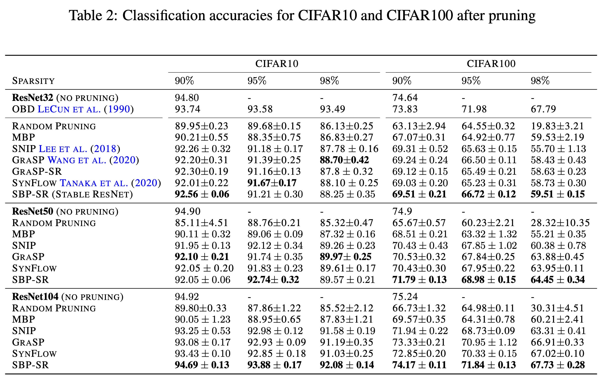

## AI论文解读 | ROBUST PRUNING AT INITIALIZATION
        
### 作者        
digoal        
        
### 日期        
2025-10-12        
        
### 标签        
PostgreSQL , PolarDB , DuckDB , AI , 论文解读        
        
----        
        
## 背景  
      
https://arxiv.org/pdf/2002.08797        
  
提示:          
```          
读懂《ROBUST PRUNING AT INITIALIZATION》这篇论文需要提前掌握哪些基础知识, 请使用中文通熟易懂的讲解这些基础知识, 可以引用论文中的图、表或使用Markdown支持的图形(text,mermaid等)增加解释性. 
  
使用中文通熟易懂的解读《ROBUST PRUNING AT INITIALIZATION》这篇论文, 其中的关键内容请着重讲解, 可以引用论文中的图、表或使用Markdown支持的图形(text,mermaid等)增加解释性. 
  
提取《ROBUST PRUNING AT INITIALIZATION》这篇论文中的重要术语, 使用中文对这些术语进行通熟易懂的讲解, 可以引用论文中的图、表或使用Markdown支持的图形(text,mermaid等)增加解释性. 
```     
  
## 1 前置知识 
  
好的，为了完全理解《ROBUST PRUNING AT INITIALIZATION》这篇论文，你需要掌握一些关于神经网络、模型压缩以及深度学习理论的基础知识。这篇论文的核心思想是**运用“混沌边缘（Edge of Chaos）”这一理论来指导和改进神经网络在初始化阶段的剪枝**，从而获得一个既稀疏又易于训练的网络。

下面我将为你通俗易懂地讲解这些必备的基础知识，并结合论文中的图表进行说明。

### 1\. 神经网络剪枝 (Neural Network Pruning)

首先，你需要了解什么是神经网络剪枝。

  * **是什么？** 现代神经网络（特别是深度神经网络）通常含有数百万甚至数十亿的参数（权重）。但研究发现，其中很多参数是冗余的，对模型的最终性能贡献不大，甚至为零。神经网络剪枝就像修剪树枝一样，识别并“剪掉”（设置为零）这些不重要的参数，从而得到一个更小、更高效的网络。

  * **为什么要做？**

      * **减小模型体积**：便于在手机、嵌入式设备等资源有限的硬件上部署。
      * **加快推理速度**：参数越少，计算量越小，模型运行得越快。
      * **节省能源**：计算量减少，能耗也随之降低。

  * **什么时候剪？**

    1.  **训练后剪枝**：先花费大量资源训练一个庞大的模型，然后剪枝，再进行微调（Fine-tuning）来恢复精度。这是最传统的方式。
    2.  **训练中剪枝**：在训练过程中动态地进行剪枝。
    3.  **初始化时剪枝**：这是本篇论文的重点。在模型开始训练之前，仅根据其初始状态就判断哪些权重应该被剪掉。这样做的好处是**极大地节省了训练大模型的计算和内存开销** 。

### 2\. 核心剪枝方法：基于敏感度的剪枝 (Sensitivity-Based Pruning, SBP)

论文主要分析和改进的是一种叫做“基于敏感度”的剪枝方法。

  * **基本思想**：一个权重的重要性，可以通过“如果把它移除，会对模型的损失函数(Loss)产生多大影响”来衡量。影响越大，说明它越重要，越不应该被剪掉。

  * **如何衡量影响？** 论文中提到的 SBP 使用 $|\tilde{W}\frac{\partial\mathcal{L}}{\partial W}|$ 这个指标来作为权重的“重要性分数”或“敏感度分数” 。

      * $\mathcal{L}$ 是损失函数，代表模型的预测错误程度。
      * $\frac{\partial\mathcal{L}}{\partial W}$ 是损失对权重 $W$ 的梯度，表示权重 $W$ 的微小变化会对损失产生多大影响。
      * $W\frac{\partial\mathcal{L}}{\partial W}$ 可以看作是**将权重 $W$ 变成 0 时，损失函数 $\mathcal{L}$ 变化的近似值**。
      * 取绝对值 $|\cdot|$ 是因为我们只关心影响的大小，不关心是让损失变大还是变小。

著名的 **SNIP** 算法  就是这种方法的典型代表。它在模型初始化后，用一小批数据计算出所有权重的这个敏感度分数，然后保留分数最高的权重，剪掉分数低的。

### 3\. 关键理论基础：神经网络动态学与“混沌边缘” (Edge of Chaos, EOC)

这是理解这篇论文**最核心、也最关键**的背景知识。传统的剪枝方法很少关注这一点，而这正是本文的创新之处。

想象一下信息（数据信号）和梯度（学习信号）在深层网络中逐层传递的过程。

  * **是什么？** “混沌边缘”是一种理论，用于描述深度神经网络在初始化时应处于的理想状态。这个理论源于对信号如何在网络中传播的数学分析，通常借助“**平均场理论 (Mean-Field Theory)**” ，该理论将一层中的大量神经元视为一个整体，分析其统计特性（如方差和相关性）。

网络初始化后可能处于三种状态：

1.  **有序相 (Ordered Phase)**：信号在传播过程中迅速收敛，不同输入经过网络后会得到非常相似甚至相同的输出 。这会导致梯度在反向传播时急剧衰减，即“**梯度消失**” 。网络无法学习到输入之间的差异，变得难以训练。

2.  **混沌相 (Chaotic Phase)**：信号在传播过程中被无限放大，输入的微小差异会被指数级放大，导致输出变得毫无规律 。这会导致梯度在反向传播时急剧增大，即“**梯度爆炸**” 。训练过程会非常不稳定。

3.  **混沌边缘 (Edge of Chaos, EOC)**：介于有序和混沌之间的“临界状态” 。在此状态下，信息可以有效且稳定地在网络中深度传播，既不会消失也不会爆炸 。梯度也能够平稳地流动。**EOC 状态被认为是让深度网络变得“可训练”的关键** 。

#### 论文的核心论点之一：EOC 对 SBP 至关重要

论文指出，如果网络初始化不在 EOC，SBP 方法会出大问题。

  * **在混沌相**：由于梯度爆炸，网络前几层的梯度会异常大，导致它们的敏感度分数极高。根据 SBP 规则，这些层的所有权重都会被保留，而后面几乎所有层的权重都会因为得分相对较低而被剪掉。这就造成了“**层崩塌 (layer-collapse)**”——整层网络被完全剪掉，模型直接失效 。

  * **在有序相**：由于梯度消失，网络后几层的梯度会非常小，导致它们的权重更容易被剪掉。

论文中的 **图 1** 非常直观地展示了这一点：  

  

  * **(a) 混沌边缘 (Edge of Chaos)**：当网络初始化在 EOC 时，剪枝（图中被保留的权重，颜色越亮表示保留比例越高）均匀地分布在网络的每一层。
  * **(b) 混沌相 (Chaotic phase)**：由于梯度爆炸，网络底部（前几层）的权重几乎全部保留，而顶部（后几层）的权重则被大量剪除，出现了大片黑色区域，代表整个层被剪掉。

### 4\. 论文提出的核心解决方案

基于以上理论，论文提出了两个核心的解决方案：

#### 方案一：针对普通网络 (FFNN/CNN) 的“重缩放技巧 (Rescaling Trick)”

  * **问题**：即使一个网络最初是在 EOC 状态下初始化的，经过剪枝后，其结构发生了变化，会导致它**偏离 EOC 状态**，从而变得难以训练 。
  * **解决方案**：在剪枝之后，通过一个简单的数学公式重新计算每层权重的缩放因子，将剪枝后的稀疏网络**重新拉回到 EOC 状态** 。这个技巧使得深度、高度稀疏的网络也变得容易训练。

#### 方案二：针对残差网络 (ResNet) 的“稳定残差网络 (Stable ResNet)”

  * **背景知识：残差网络 (ResNet)**：你需要知道 ResNet 通过“跳跃连接 (skip connections)”允许信号直接跨越多层传播，极大地缓解了深度网络的梯度消失问题。

  * **论文发现**：ResNet 的结构使其**天生就“生活在”EOC 上**，这使得它比普通网络更适合在初始化时进行剪枝 。

  * **问题**：标准的 ResNet 虽然在 EOC，但随着深度增加，仍然存在**梯度爆炸的风险**，这会影响 SBP 的稳定性 。

  * **解决方案**：论文提出对 ResNet 的结构进行微小的修改，在每个残差块的输出上乘以一个因子 $\frac{1}{\sqrt{L}}$ （ $L$ 是残差块的数量 ）。这个改动被称为 **Stable ResNet**，它可以在保持网络处于 EOC 状态的同时，有效抑制梯度的指数级增长，让剪枝过程更加稳定和均匀 。

论文中的 **图 2** 展示了 Stable ResNet 的效果：

  

图中橙色线（标准 ResNet）的剪枝率在每个模块内波动较大，而蓝色线（Stable ResNet）则更加平滑和均匀，尤其是在网络的深层部分，避免了过度剪枝 。

### 总结与逻辑流程

为了更好地梳理，你可以通过下面的流程图来理解论文的整体逻辑：


因此，要读懂这篇论文，你需要：

1.  **了解剪枝的基本概念**，特别是初始化剪枝的动机和挑战。
2.  **理解基于敏感度（特别是 SNIP）的剪枝原理**。
3.  **牢牢掌握“混沌边缘 (EOC)”理论**，这是理解本文所有创新点的基础。
4.  **对 ResNet 的基本结构有所了解**。

掌握了这些知识后，你就能轻松地理解论文为什么要提出这些方法，以及它们背后的深刻原理了。
  
## 2 解读论文 
  
好的，我们来一起通俗易懂地解读《ROBUST PRUNING AT INITIALIZATION》这篇重要的剪枝论文。

### 论文核心思想概览

这篇论文的中心思想是：**要想在神经网络训练开始前就成功地剪枝，关键在于保证网络初始化在一个被称为“混沌边缘”（Edge of Chaos, EOC）的理想动态状态**。

传统的初始化剪枝方法（比如SNIP）有时会“剪坏”，例如把网络某一层完全剪掉，导致模型无法训练 。作者们通过深入的理论分析发现，这个问题的根源在于网络初始化的“动态特性”不对。他们不仅解释了为什么会失败，还针对不同类型的网络架构，提出了简单而有效的解决方案，使得初始化剪枝变得更加稳定和强大。

### 关键内容深度解析

#### 1\. 问题所在：为什么在初始化时剪枝容易失败？

在训练前剪枝，我们依据的是权重在初始状态下对损失函数（Loss）的“敏感度” 。一个常用的指标是 $|W\frac{\partial\mathcalL}{\partial W}|$ ，即权重大小与其梯度的乘积的绝对值 。这个值越大，说明权重越“重要”。

但这个方法有个致命缺陷：它严重依赖于梯度在网络中的传播方式。如果梯度在反向传播时出现**爆炸**或**消失**，这个“重要性”评估就会产生严重偏差。

  * **梯度爆炸**：网络前几层的梯度会变得极大，导致它们的权重被错误地判断为“极其重要”，而后面所有层的权重则因为相对得分太低而被大量剪掉，最终可能导致 **“层崩塌”（Layer-Collapse）** —— 整个网络层被废掉 。
  * **梯度消失**：与梯度爆炸相反，这会导致网络前几层的权重被过度剪枝 。

#### 2\. 理论基石：“混沌边缘” (Edge of Chaos, EOC)

为了解决上述问题，论文引入了“混沌边缘”这一关键理论。该理论将神经网络初始化后的状态分为三种：

1.  **有序相 (Ordered Phase)**：信息在网络中传播时会趋于一致，导致梯度消失，网络难以学习 。
2.  **混沌相 (Chaotic Phase)**：信息的微小差异会被指数级放大，导致梯度爆炸，训练不稳定 。
3.  **混沌边缘 (EOC)**：介于两者之间的理想状态。在此状态下，信息和梯度都能稳定地在深层网络中传播，从而保证网络是“可训练的” 。

论文的第一个核心论点是：**只有当网络初始化在EOC状态时，基于敏感度的剪枝（SBP）才是有效的** 。否则，网络就会处于“病态”（ill-conditioned），剪枝时极易发生层崩塌 。

论文中的 **图 1** 直观地证明了这一点：

  

  * **(a) 混沌边缘 (EOC)**：初始化在EOC时，剪枝后保留的权重（图中彩色部分）均匀地分布在网络的各个层中，网络结构得以保持完整 。
  * **(b) 混沌相 (Chaotic Phase)**：由于梯度爆炸，网络底部（前几层）的权重几乎被全部保留，而顶部（后几层）则被过度剪枝，出现了大片黑色区域，这就是“层崩塌”现象 。

#### 3\. 解决方案一：针对普通网络 (FFNN/CNN) 的“重缩放技巧”

对于像VGG这样的常规卷积网络（CNN）和全连接网络（FFNN），作者提出了一个两步走的策略：

1.  **必须在 EOC 进行初始化**：这是成功剪枝的前提 。
2.  **剪枝后使用“重缩放技巧” (Rescaling Trick)**：作者发现，即使网络最初在EOC，剪枝操作本身（即移除大量权重）会破坏这个理想状态，使网络偏离EOC，从而再次变得难以训练 。解决方案非常巧妙：在剪枝完成后，对每一层剩余的权重乘以一个特定的、可以被简单计算出来的缩放因子，从而**将剪枝后的稀疏网络“拉回”到EOC状态** 。

**图 3** 的实验结果清晰地展示了这一技巧的威力：

  

  * **(c) 有序相初始化**：网络在稀疏度（Sparsity）超过40%或深度（Depth）超过60层时就完全无法训练了 。
  * **(b) EOC 初始化**：情况有所改善，但对于深度和稀疏度都很高的网络，依然无法训练 。
  * **(a) EOC 初始化 + 重缩放**：效果惊人。即使在极高的稀疏度（如90%）和深度（如100层）下，网络依然能够被成功训练，精度保持得很好 。

#### 4\. 解决方案二：针对残差网络 (ResNet) 的“稳定残差网络”

对于ResNet，情况有所不同。

  * **优点**：由于其独特的跳跃连接结构，ResNet**天生就“生活在”EOC上**，所以它比普通网络更适合在初始化时进行剪枝 。
  * **缺点**：标准的ResNet在网络很深时，依然会面临**梯度爆炸**的问题，这会干扰剪枝的稳定性 。

为此，作者提出了一种名为 **“稳定残差网络”（Stable Resnet, SR）** 的改进结构 。改动非常简单：在每个残差块的输出上乘以一个缩放因子 $\frac{1}{\sqrt{L}}$ （L是网络中残差块的总数） 。这个小小的改动，可以在保持ResNet处于EOC状态的同时，有效地抑制梯度随深度增加而爆炸的问题 。

将这个“稳定残差网络”与基于敏感度的剪枝（SBP）相结合，就得到了论文的核心算法：**SBP-SR** 。

### 实验结果与算法对比

论文通过在CIFAR-10, CIFAR-100, Tiny ImageNet和ImageNet等多个数据集上的大量实验，证明了其方法的优越性 。

**表 1** 和 **表 2** 中的数据显示，SBP-SR算法在各种深度（ResNet32, 50, 104）和稀疏度下，其性能通常优于或持平于其他主流的初始化剪枝算法，如SNIP、GraSP和SynFlow 。

    

特别地，**随着网络深度和稀疏度的增加，SBP-SR的优势愈发明显**。例如，在CIFAR-10数据集上，对于ResNet104，SBP-SR在所有稀疏度下都全面超过了其他算法 。在99.5%的极高稀疏度下，ResNet104依然能保持约87%的准确率，这是一个非常出色的成绩 。

### 论文逻辑总结

我们可以用一个流程图来总结这篇论文的逻辑脉络：


### 结论

《ROBUST PRUNING AT INITIALIZATION》这篇论文为“初始化剪枝”这一领域提供了深刻的理论洞见和简单实用的解决方案。它清晰地指出，**关注并控制网络在初始化时的动态特性（即保持在EOC）是实现稳定、高效剪枝的关键**。其提出的“重缩放技巧”和“稳定ResNet”都是即插即用的改进，为在资源受限环境下训练和部署大型模型提供了强有力的工具。
  
## 3 术语 
  
好的，这是对论文《ROBUST PRUNING AT INITIALIZATION》中重要术语的中文讲解。

### 核心术语概览

这篇论文主要探讨了如何在神经网络（NN） **初始化** 阶段就进行有效的**剪枝**，从而获得更小、更高效的网络模型，这个过程被称为 **“初始化剪枝”** （Pruning at Initialization）。

以下是论文中的几个核心术语及其通俗易懂的讲解：

1.  **剪枝 (Pruning)**
2.  **初始化剪枝 (Pruning at Initialization)**
3.  **基于敏感度的剪枝 (Sensitivity-Based Pruning, SBP)**
4.  **混沌边缘 (Edge of Chaos, EOC)**
5.  **重缩放技巧 (Rescaling Trick)**
6.  **稳定残差网络 (Stable Resnet)**
7.  **SBP-SR 算法**

-----

### 1\. 剪枝 (Pruning)

**剪枝**是一种神经网络压缩技术，旨在减少模型的复杂度和计算需求 。其核心思想是识别并移除神经网络中那些对模型性能贡献不大的权重（连接）。

可以把一个庞大的神经网络想象成一个拥有许多道路的复杂交通网络。其中一些道路是交通主干道，至关重要；而另一些则是很少有车辆通行的小路。剪枝就像是市政规划，关闭那些冗余或低效的小路，从而在不严重影响整体交通效率的前提下，降低维护成本。

传统的剪枝方法通常在网络被完全训练好之后进行 ，而这篇论文聚焦于一种更高效的方式——初始化剪枝。

-----

### 2\. 初始化剪枝 (Pruning at Initialization)

**初始化剪枝**指的是在神经网络开始训练之前，即在权重刚刚被随机初始化的那一刻，就进行剪枝 。

这种方法的巨大优势在于，它完全不需要训练庞大的原始网络，因此极大地节省了内存和计算资源 。这使得在计算能力有限的设备（如手机）上训练深度神经网络成为可能 。

然而，这种方法也面临挑战：剪枝后的网络可能难以训练 ，甚至可能出现 **“层坍塌”（Layer-Collapse）** 现象，即整个网络层被完全剪掉，导致网络无法工作 。

-----

### 3\. 基于敏感度的剪枝 (Sensitivity-Based Pruning, SBP)

**SBP** 是论文中重点分析和改进的一种初始化剪枝标准 。它的核心思想是：一个权重的重要性取决于它对损失函数（Loss）的影响。如果一个权重的微小变动能引起损失函数的剧烈变化，那么它就是重要的。

具体来说，SBP 通过计算每个权重 $W$ 在初始化时对其自身的敏感度得分 $|W \frac{\partial\mathcal{L}}{\partial W}|$ 来评估其重要性，其中 $\mathcal{L}$ 是损失函数 。得分越高的权重被保留，得分低的则被剪掉。这种方法需要少量数据来计算梯度，因此是一种数据依赖的“一次性剪枝”（One-shot Pruning）方法 。

一个知名的 SBP 算法是 SNIP 。

-----

### 4\. 混沌边缘 (Edge of Chaos, EOC)

**EOC** 是一个理论概念，用来描述神经网络初始化的“最佳状态” 。一个好的初始化应该能让信息（信号和梯度）在网络中顺畅地向前和向后传播，既不会在传播中消失（梯度消失），也不会无限放大（梯度爆炸）。

论文将神经网络的初始化状态比作三个区域：

  * **有序相 (Ordered Phase)**: 信号和梯度在传播中迅速衰减，网络学不到东西 。
  * **混沌相 (Chaotic Phase)**: 信号和梯度在传播中被放大，导致梯度爆炸，训练不稳定 。
  * **混沌边缘 (Edge of Chaos, EOC)**: 介于上述两者之间的理想状态，信息可以稳定地在深层网络中传播，使得网络具备良好的“可训练性” 。

论文通过理论和实验证明，**对于前馈神经网络（FFNN）和卷积神经网络（CNN）来说，一个处于 EOC 状态的初始化对于 SBP 剪枝至关重要** 。如果初始化不在 EOC，剪枝时很容易发生“层坍塌”现象 。

下面的图 1 直观地展示了这一点。在 EOC 状态下（a），剪枝后保留的权重均匀分布在网络各层；而在混沌相（b），由于梯度爆炸，网络的前几层（图中上方深色区域）被完全剪掉。 


**图 1: EOC 对剪枝的影响**

  * **(a) 混沌边缘 (Edge of Chaos)**: 权重在各层均匀保留。
  * **(b) 混沌相 (Chaotic Phase)**: 发生梯度爆炸，导致顶部网络层被完全剪除。

  

-----

### 5\. 重缩放技巧 (Rescaling Trick)

论文发现，即使一个网络最初在 EOC 状态下初始化，经过剪枝后，其状态也会偏离 EOC，从而变得难以训练 。

**重缩放技巧**是论文针对 FFNN 和 CNN 提出的一种简单而有效的解决方案 。它通过在剪枝后对每一层保留下来的权重进行一次特定的缩放计算，将剪枝后的稀疏网络重新“推回”到 EOC 状态，从而使其变得易于训练 。

图 3 的实验结果有力地支持了这一观点。对于非常深和稀疏的网络，只有同时使用“EOC 初始化”和“重缩放”技巧 (a)，网络才能被成功训练并获得高准确率。

  

  * **(a) EOC 初始化 & 重缩放**: 即使在深度很大、稀疏度很高的情况下，模型依然可训练。
  * **(b) 仅 EOC 初始化**: 深度和稀疏度增加时，模型变得难以训练。
  * **(c) 有序相初始化**: 模型在很低的深度和稀疏度下就失效了。

-----

### 6\. 稳定残差网络 (Stable Resnet)

对于残差网络（ResNet），论文分析发现它具有一个天然的优势：**它天生就“活在”混沌边缘（EOC）上**，即使在剪枝之后也是如此，因此不需要重缩放技巧 。

然而，标准的 ResNet 存在梯度随深度指数级增长的问题 ，这会影响 SBP 剪枝的稳定性。为了解决这个问题，论文提出了一种新的参数化方法，称为**稳定残差网络 (Stable Resnet)** 。

具体做法是在 ResNet 的每个残差块（Residual Block）前乘以一个缩放因子 $\frac{1}{\sqrt{L}}$ ，其中 $L$ 是残差块的总数 。这个简单的修改可以有效防止剪枝准则的方差随网络深度指数级增长，让剪枝在深层网络中更加均匀和稳定 。

-----

### 7\. SBP-SR 算法

**SBP-SR** 是这篇论文提出的核心算法，它结合了 **SBP（基于敏感度的剪枝）** 和 **SR（稳定残差网络）** 。该算法专门用于对 ResNet 架构进行初始化剪枝。

由于 Stable Resnet 解决了标准 ResNet 梯度爆炸的问题，使得 SBP 剪枝更加稳定，因此 SBP-SR 算法在处理深度 ResNet 时表现尤为出色 。

论文中的多个表格（如 Table 1, 2, 3）展示了 SBP-SR 在 CIFAR10、CIFAR100 和 Tiny ImageNet 数据集上与 SNIP、GraSP、SynFlow 等其他先进的初始化剪枝算法的对比结果。结果显示，特别是在网络更深、稀疏度更高的情况下，SBP-SR 算法通常能取得最优或极具竞争力的性能 。        

**Table 1 示例 (ResNet104 在 CIFAR10 上的准确率):**

| 算法 | 90% 稀疏度 | 95% 稀疏度 | 98% 稀疏度 | 99.5% 稀疏度 |
| :--- | :--- | :--- | :--- | :--- |
| SNIP | 93.25±0.53 | 92.98±0.12 | 91.58±0.19 | 33.63±33.27 |
| **SBP-SR** | **94.69±0.13** | **93.88±0.17** | **92.08±0.14** | **87.47±0.23** |

*(数据来源: Table 1 )*

从这个例子可以看出，在极高的稀疏度（如99.5%）下，SBP-SR 算法依然能保持约87%的准确率，而 SNIP 算法的性能已大幅下降 。
  
## 参考        
         
https://arxiv.org/pdf/2002.08797    
        
<b> 以上内容基于DeepSeek、Qwen、Gemini及诸多AI生成, 轻微人工调整, 感谢杭州深度求索人工智能、阿里云、Google等公司. </b>        
        
<b> AI 生成的内容请自行辨别正确性, 当然也多了些许踩坑的乐趣, 毕竟冒险是每个男人的天性.  </b>        
    
#### [期望 PostgreSQL|开源PolarDB 增加什么功能?](https://github.com/digoal/blog/issues/76 "269ac3d1c492e938c0191101c7238216")
  
  
#### [PolarDB 开源数据库](https://openpolardb.com/home "57258f76c37864c6e6d23383d05714ea")
  
  
#### [PolarDB 学习图谱](https://www.aliyun.com/database/openpolardb/activity "8642f60e04ed0c814bf9cb9677976bd4")
  
  
#### [PostgreSQL 解决方案集合](../201706/20170601_02.md "40cff096e9ed7122c512b35d8561d9c8")
  
  
#### [德哥 / digoal's Github - 公益是一辈子的事.](https://github.com/digoal/blog/blob/master/README.md "22709685feb7cab07d30f30387f0a9ae")
  
  
#### [About 德哥](https://github.com/digoal/blog/blob/master/me/readme.md "a37735981e7704886ffd590565582dd0")
  
  

  
