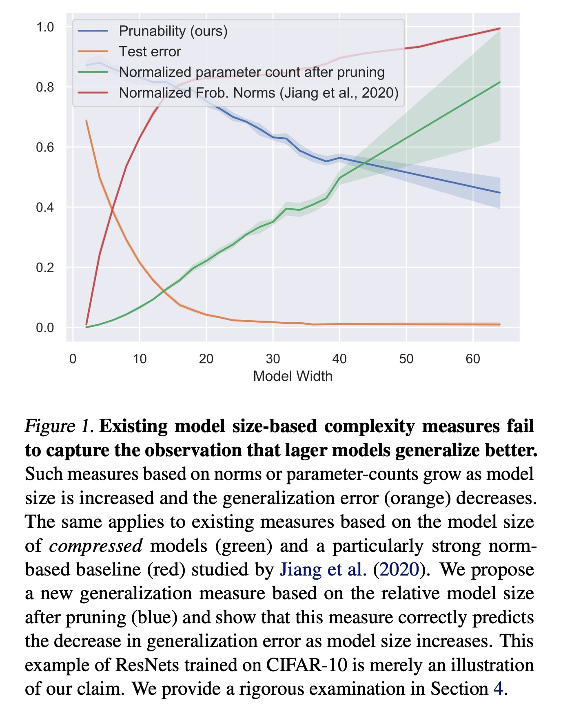
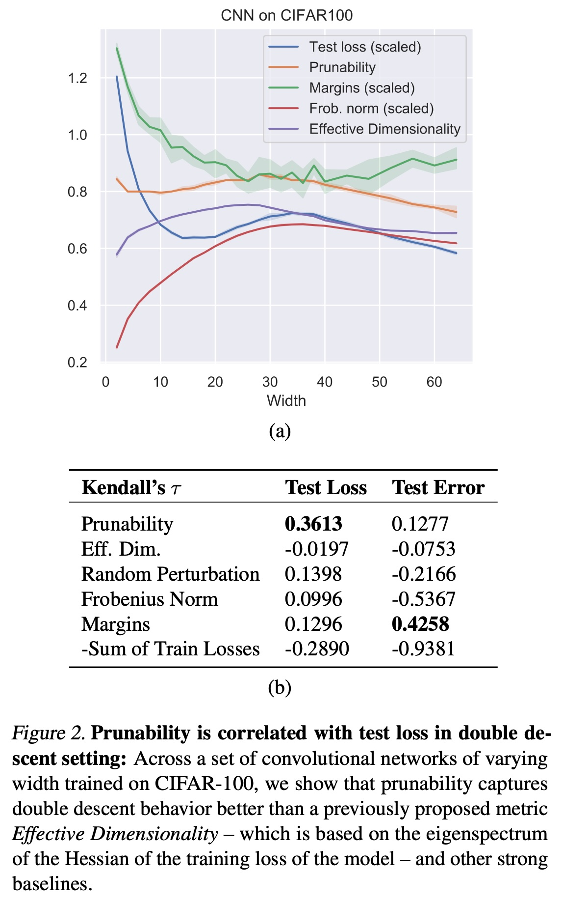
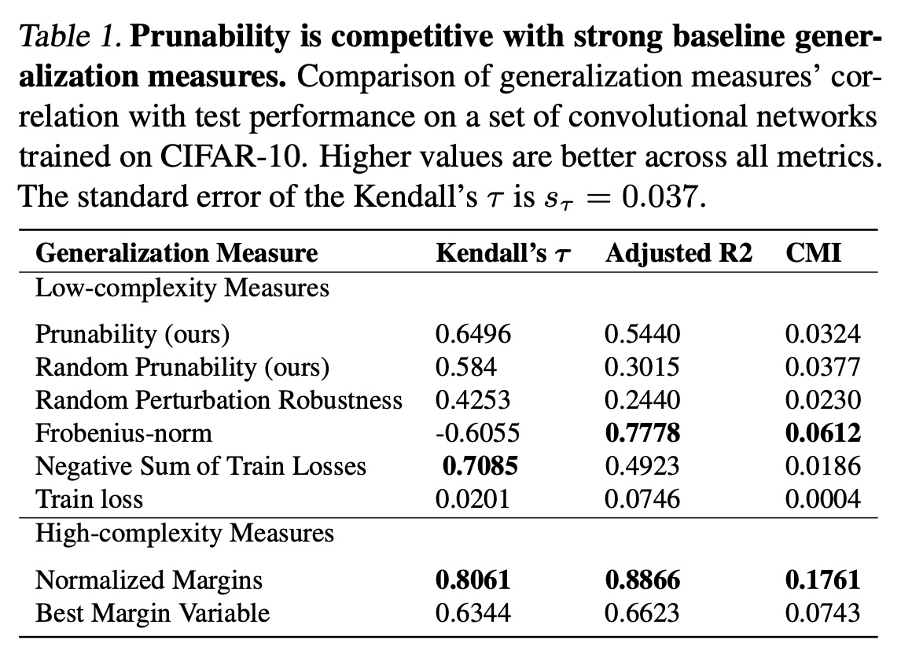
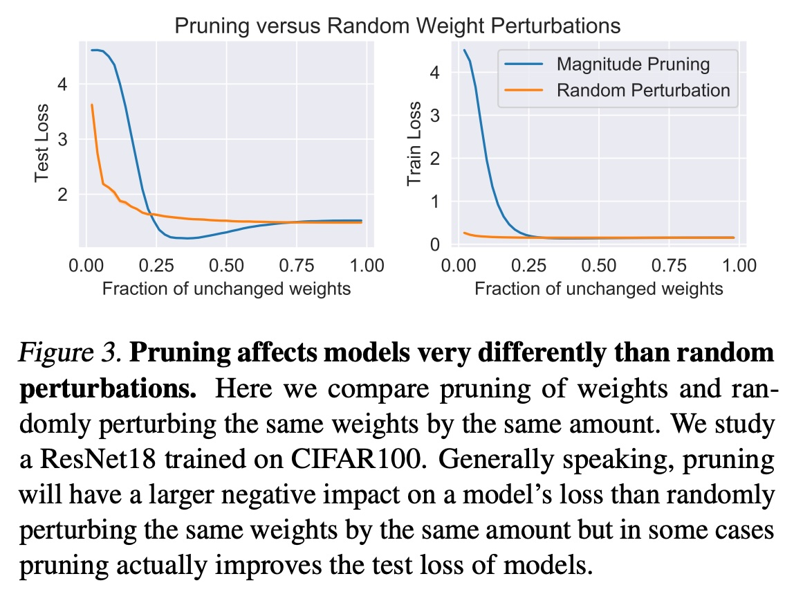
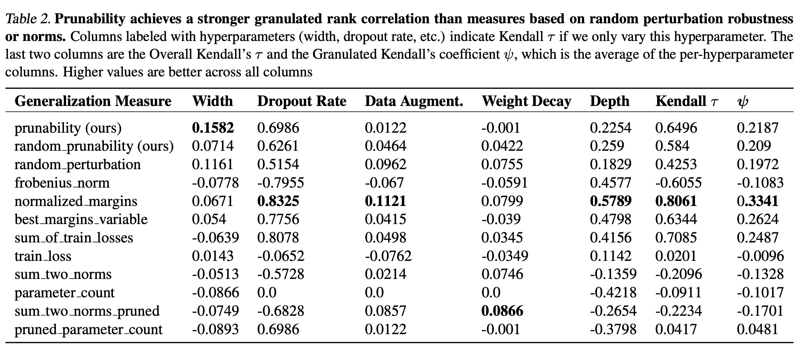

## AI论文解读 | Robustness to Pruning Predicts Generalization in Deep Neural Networks
        
### 作者        
digoal        
        
### 日期        
2025-10-12        
        
### 标签        
PostgreSQL , PolarDB , DuckDB , AI , 论文解读        
        
----        
        
## 背景  
      
https://arxiv.org/pdf/2103.06002        
  
提示:          
```          
读懂《Robustness to Pruning Predicts Generalization in Deep Neural Networks》这篇论文需要提前掌握哪些基础知识, 请使用中文通熟易懂的讲解这些基础知识, 可以引用论文中的图、表或使用Markdown支持的图形(text,mermaid等)增加解释性. 
  
使用中文通熟易懂的解读《Robustness to Pruning Predicts Generalization in Deep Neural Networks》这篇论文, 其中的关键内容请着重讲解, 可以引用论文中的图、表或使用Markdown支持的图形(text,mermaid等)增加解释性. 
  
提取《Robustness to Pruning Predicts Generalization in Deep Neural Networks》这篇论文中的重要术语, 使用中文对这些术语进行通熟易懂的讲解, 可以引用论文中的图、表或使用Markdown支持的图形(text,mermaid等)增加解释性. 
```     
  
## 1 前置知识 
  
好的，为了帮助您更好地理解《Robustness to Pruning Predicts Generalization in Deep Neural Networks》这篇论文，我将为您梳理和讲解阅读此文前需要掌握的核心基础知识。这些知识点就像是攀登这座学术山峰前的“登山杖”和“地图”，能让您的阅读过程更加顺畅。

我们将从以下五个方面展开：

1.  **核心困境：深度学习中的“泛化”之谜**
2.  **核心技术：什么是神经网络“剪枝”？**
3.  **核心目标：如何衡量模型的“泛化能力”？**
4.  **前沿现象：令人费解的“双下降”**
5.  **核心工具：论文中用到的评估方法与理论框架**

-----

### 1\. 核心困境：深度学习中的“泛化”之谜 (Generalization)

这是理解整篇论文的出发点。

  * **什么是泛化？**

      * **训练 (Training):** 我们用已有的数据（训练集）来教一个神经网络模型学习某个任务，比如识别猫狗图片。模型在训练集上的表现好坏用**训练误差 (Training Error)** 来衡量。
      * **测试 (Testing):** 训练好后，我们用模型没见过的新数据（测试集）来评估它的真实能力。模型在新数据上的表现好坏用**测试误差 (Test Error)** 来衡量。
      * **泛化能力 (Generalization):** 指的是模型在“没见过的新数据”上表现良好的能力。
      * **泛化差距 (Generalization Gap):** `泛化差距 = 测试误差 - 训练误差` 。这个差距越小，说明模型的泛化能力越强。

  * **“泛化”之谜是什么？**

      * **传统智慧 (奥卡姆剃刀原则):** 理论上，模型越简单（参数越少），泛化能力越好。过于复杂的模型会“死记硬背”训练数据（这叫**过拟合 Overfitting**），导致在测试数据上表现很差。
      * **深度学习的“反常”现象:** 研究者发现，在深度学习中，模型变得越来越大、参数越来越多（即“过参数化”），其泛化能力反而经常变得更好 。这与传统理论相悖，是当前领域的一大谜题。

  * **论文中的图示解释 (Figure 1):**
    这张图非常直观地展示了这个谜题。    

      * **横轴 (Model Width):** 代表模型的宽度，可以理解为模型的“尺寸”或“复杂度”。越往右，模型越大。
      * **橙色线 (Test error):** 测试误差。我们可以看到，随着模型变大，测试误差**反而下降了**，说明大模型泛化得更好。
      * **红色/绿色线 (传统的复杂度衡量指标):** 如参数数量(`Normalized parameter count`)或参数的范数(`Normalized Frob. Norms`)。它们都随着模型变大而**上升**。
      * **矛盾点:** 传统的复杂度指标（红色/绿色线）告诉我们“模型变复杂了，泛化会变差”，但实际结果（橙色线）却是“泛化变好了”。这说明我们需要一种新的、更好的指标来解释这个现象。这正是该论文要解决的问题。

-----

### 2\. 核心技术：什么是神经网络“剪枝”？ (Pruning)

这是论文提出解决方案的核心工具。

  * **剪枝的通俗理解:**
    想象一下修剪一棵盆栽。我们会剪掉那些多余、不重要的枝叶，保留下主干和关键的枝条，让盆栽更美观、更健康。神经网络剪枝与此类似，它指的是 **移除神经网络中“不重要”的参数（权重）** ，通常是将它们的值设为0，从而得到一个更小、更稀疏的网络 。

  * **为什么要做剪枝？**

      * **模型压缩:** 获得更小、计算更快的模型，方便部署在手机、嵌入式设备上。
      * **提升泛化:** 有时剪掉一些参数反而能提高模型的泛化能力 。

  * **常见的剪枝方法 (论文中提到的):**

      * **幅度剪枝 (Magnitude Pruning):** 最简单直接的方法。认为绝对值越小的权重越不重要，于是将网络中绝对值最小的一批权重移除 。这是本文默认使用的方法 。
      * **随机剪枝 (Random Pruning):** 随机地选择一部分权重进行移除 。

这篇论文的创新之处在于，它不只是为了压缩模型而剪枝，而是反过来利用“**一个模型能被剪掉多少而不影响其性能**”这个特性，来作为衡量其泛化能力的指标。

-----

### 3\. 核心目标：如何衡量模型的“泛化能力”？ (Generalization Measures)

这是论文的研究领域。一个好的“泛化衡量指标”应该在不看测试集的情况下，就能预测出模型的泛化差距。

  * **传统的衡量指标 (论文认为有缺陷):**

      * **参数数量:** 认为参数越少越好。如前所述，这在深度学习中不成立 。
      * **范数 (Norms):** 衡量网络中所有参数值的大小。认为参数值整体越小越好。同样，这个指标也常常随着模型增大而增大，无法解释大模型泛化更好的现象 。你可以从Figure 1的**红线**看出这一点。   

  * **更前沿的衡量指标 (论文的“竞争对手”):**

      * **损失函数最小值的“平坦度” (Flatness of Minima):** 认为模型参数如果处在损失函数 landscape 的一个“宽阔平坦的盆地”里，而不是一个“尖锐狭窄的峡谷”里，那么它的泛化能力就更好。因为在平坦区域，即使输入数据有微小扰动，输出结果也相对稳定 。
      * **间隔 (Margin):** 衡量训练样本点距离分类边界的远近。间隔越大，模型对数据分类的“信心”越足，泛化能力通常也越好 。

本文提出的 **“可剪枝性” (Prunability)** ，将作为一种全新的泛化衡量指标，与上述这些指标进行比较。

-----

### 4\. 前沿现象：令人费解的“双下降” (Double Descent)

这是一个更深层次、更具挑战性的现象，论文用它来“极限测试”自己提出的新指标。

  * **经典U型曲线:** 传统机器学习认为，随着模型复杂度增加，测试误差会先下降（欠拟合改善），达到一个最优点后，开始上升（过拟合出现），形成一个“U”型曲线。

  * **双下降曲线:** 在深度学习中，人们发现当模型复杂度越过某个“临界点”后，测试误差在上升后，**竟然会再次下降** 。

    ```mermaid
    graph LR
        subgraph "传统认知 (U-Shape)"
            A(简单模型/欠拟合) --> B(最佳点) --> C(复杂模型/过拟合);
        end
        subgraph "深度学习 (Double Descent)"
            D(简单模型) --> E(最佳点) --> F(过拟合临界点) --> G(超大模型/再次泛化);
        end
    ```

  * **为什么这个现象很重要？**
    因为它对很多泛化指标提出了巨大挑战。一个好的泛化指标，其数值变化趋势应该和测试误差的“双下降”曲线保持一致。而很多传统指标（如范数）只会单调增加，无法捕捉到第二个下降阶段 。

  * **论文中的图示解释 (Figure 2):**     

      * **蓝色线 (Test loss):** 可以看到一个明显的“先降、再升、又降”的双下降形态。
      * **橙色线 (Prunability):** 本文提出的“可剪枝性”指标。它的曲线形态与测试误差**高度相似**，也呈现出双下降的趋势 。这有力地证明了“可剪枝性”是一个非常优秀的泛化衡量指标，甚至能捕捉到如此复杂的现象。

-----

### 5\. 核心工具：论文中用到的评估方法与理论框架

要读懂论文中的表格（如Table 1），你需要了解作者是如何定量评估一个泛化指标好坏的。   

  * **肯德尔等级相关系数 (Kendall's Rank Correlation / Kendall's τ):**
    这是一种衡量“排序一致性”的指标。它不关心指标的具体数值，只关心它们的排序。例如，有模型A、B、C，它们的真实泛化差距排名是 A \> B \> C。如果一个泛化指标预测的排名也是 A \> B \> C，那么它们就是正相关。如果预测的是 C \> B \> A，就是负相关。系数在-1到1之间，**绝对值越接近1，说明指标的预测排序能力越强** 。

  * **调整R方 (Adjusted R²):**
    来自统计学，衡量一个变量（泛化指标）能在多大程度上“解释”另一个变量（泛化差距）的变化。**值越接近1，说明解释能力越强** 。

  * **条件互信息 (Conditional Mutual Information / CMI):**
    一个更高级的工具，用来探索两个变量之间是否存在更直接的（类似因果的）关系，而不仅仅是简单的相关性。它会控制其他变量（如模型宽度、深度等超参数），然后看泛化指标是否**仍然**能提供关于泛化差距的**新信息**。**值越高，说明两者关系越紧密、越直接** 。

  * **PAC-Bayes 理论框架:**
    这是一个来自计算学习理论的数学框架，可以为模型的泛化误差提供一个理论上的“上界”。你不需要深入理解其复杂的数学推导，只需要知道，作者用这个理论来**从理论上启发和支撑**他们提出的“可剪枝性”指标是合理的 。它为经验发现提供了理论依据。

### 总结

掌握了以上知识后，您就可以带着清晰的脉络来阅读这篇论文了。您的阅读思路应该是：

1.  **背景:** 深度学习中“大模型泛化反而更好”的现象很奇怪，传统的复杂度指标（参数量、范数）都解释不了（**知识点1**）。
2.  **问题:** 我们需要一个更好的泛化衡量指标（**知识点3**）。
3.  **作者的方案:** 提出使用“可剪枝性 (Prunability)”作为新指标。即一个模型在训练性能不显著下降的前提下，能被剪掉的参数比例越大（剩下的比例越小），它的泛化能力就越强（**知识点2**）。
4.  **验证:**
      * 通过一系列实验，使用肯德尔相关系数、R²等工具（**知识点5**），证明“可剪枝性”比很多现有指标更能预测泛化能力。
      * 在一个极具挑战性的“双下降”场景（**知识点4**）下，“可剪枝性”依然表现出色，其变化趋势与真实测试误差高度吻合。
5.  **结论:** “可剪枝性”是一个强大、有效且能捕捉复杂现象的新泛化衡量指标。

希望这份“预备知识”讲解能助您顺利读懂这篇优秀的论文！
  
## 2 解读论文 
  
好的，我们来一起通俗易懂地解读这篇深度学习领域的优秀论文——《Robustness to Pruning Predicts Generalization in Deep Neural Networks》（对剪枝的鲁棒性可预测深度神经网络的泛化能力）。

简单来说，这篇论文提出了一个全新的、简单而有效的指标，叫做 **“可剪枝性” (Prunability)** ，并证明它能非常准确地预测一个深度学习模型的“真实水平”，即它在处理从未见过的新数据时的表现（泛化能力）。

-----

### 一、核心问题：为什么大模型反而表现更好？一个难解的谜题

在深度学习领域，一个长期存在的“谜题”是：传统的机器学习理论（如奥卡姆剃刀原则）告诉我们，模型应该越简单越好，否则容易“死记硬背”（过拟合），导致在新问题上表现很差 。但在实践中，我们却发现神经网络模型参数越来越多、结构越来越复杂（即“过参数化”），其泛化能力（处理新数据的能力）反而越来越强 。

许多传统的衡量模型复杂度的指标，比如**参数数量**或**参数范数**（衡量所有参数值的大小），都无法解释这个现象。随着模型变大，这些指标值会上升，预示着模型会变差，但这与实际观察到的“测试误差下降”完全相反 。

论文中的 **图1** 非常直观地展示了这一矛盾：   

> **图1 解读:**
>
>   * **横轴 (Model Width):** 代表模型的大小/复杂度，越往右模型越大。
>     * **橙色线 (Test error):** 这是模型的真实表现。可以看到，随着模型变大，测试误差**持续下降**，说明大模型泛化得更好 。
>     * **绿色/红色线 (传统指标):** 无论是剪枝后剩下的绝对参数数量（绿色）还是参数的范数（红色），都随着模型增大而**上升** 。
>   * **矛盾:** 传统指标（红/绿线）的预测与真实结果（橙线）完全相反。这说明我们需要一个新的指标来解决这个谜题。

-----

### 二、核心方案：提出“可剪枝性” (Prunability) 作为新指标

为了解决上述矛盾，作者提出了一个全新的视角： **我们不应该看模型原来有多大，而应该看它在保持性能基本不变的情况下，能变得有多“小”** 。

这就是“可剪枝性”的核心思想。

> **定义：可剪枝性 (Prunability)**
>
> 对于一个训练好的模型，在保持其**训练损失**不显著增加（例如，不超过原有损失的10%）的前提下，通过剪枝后能够**保留下来的最小参数比例** 。

这个定义有几个关键点：

  * **目标：** 保留最少的参数。
  * **约束：** 训练集上的性能不能变差太多 。
  * **结果：** 一个**比例值**。例如，如果一个模型能被剪掉95%的参数而性能不掉，那么它的“可剪枝性”指标值就是5% (0.05)。
  * **直观理解：** 这个值越小，说明模型越“冗余”，它实现当前性能所“真正需要”的核心参数越少，也就意味着模型越“简单”，其泛化能力可能就越强 。

再回到 **图1**，看一下作者提出的新指标的表现：    

  * **蓝色线 (Prunability):** 这是“可剪枝性”指标（即剪枝后保留的参数比例）。我们发现，随着模型宽度增加，这条线**持续下降** 。
  * **完美匹配:** 蓝色线的下降趋势与橙色线（测试误差）的下降趋势高度吻合！这表明，“可剪枝性”成功地预测了“越大的模型泛化能力越强”这一现象 。

-----

### 三、关键验证一：在“双下降”现象下的惊人表现

为了进一步证明“可剪枝性”的强大，作者在一个更具挑战性的场景 —— **“双下降” (Double Descent)** 现象中对其进行了测试。“双下降”指的是，随着模型复杂度增加，测试误差会先下降，经过一个“过拟合”的峰值后，竟然会再次下降，这让许多传统泛化指标彻底失效 。

**图2** 展示了“可剪枝性”在这一极限测试中的表现：    

> **图2 解读:**
> * **蓝色线 (Test loss):** 呈现出典型的“降-升-降”双下降曲线 。
> * **橙色线 (Prunability):** “可剪枝性”指标的曲线，惊人地复现了与测试损失相似的“降-升-降”趋势 。
> * **对比其他指标:** 无论是基于Hessian矩阵特征谱的`Effective Dimensionality`，还是其他强大的基准指标，都无法像“可剪枝性”一样完美地捕捉到这个现象 。
> * **结论:** 这有力地证明了“可剪枝性”不仅仅是与模型大小相关，而是真正抓住了影响泛化能力的核心内在属性 。

-----

### 四、关键验证二：它和其他指标有什么不同？

“可剪枝性”听起来和另一类指标——基于“**损失平面平坦度 (Flatness)**”的指标有些相似。这类指标认为，模型参数如果位于一个平坦宽阔的“盆地”中，那么对参数的微小扰动就不会对结果产生太大影响，泛化能力就好。“可剪枝性”和这类指标（如随机扰动鲁棒性）都衡量了模型对权重扰动的敏感度 。

它们是一回事吗？作者通过实验证明：**不是一回事，而且剪枝是更好的衡量方式**。    

> **图3 解读:**
> * **左图 (Test Loss):** 对于**测试集**，适度的剪枝（绿色线）可以 **降低损失（提升性能）** ，而同样幅度的随机扰动（橙色线）只会让性能变差 。
> * **右图 (Train Loss):** 对于**训练集**，剪枝（绿色线）对性能的破坏比随机扰动（橙色线）更大 。
> * **核心差异:** 剪枝（特别是移除小权重）是一种有目的性的、结构化的扰动，它可能移除了模型中的“噪声”，从而提升了泛化。而随机扰动则没有这个效果。这种差异使得“可剪枝性”比基于平坦度的指标更具预测力 。

**表1** 的数据也证实了这一点，“Prunability (ours)”在多项评估指标（如`Kendall's`相关系数）上都优于`Random Perturbation Robustness`。  

  

| Generalization Measure | Kendall's | Adjusted R2 | CMI |
| :--- | :--- | :--- | :--- |
| **Prunability (ours)** | **0.6496** | **0.5440** | **0.0324** |
| Random Perturbation Robustness | 0.4253 | 0.2440 | 0.0230 |
| Negative Sum of Train Losses | 0.7085 | 0.4923 | 0.0186 |
| Frobenius-norm | -0.6055 | 0.7778 | 0.0612 |

> (数据来源: 论文 Table 1 )

-----

### 论文总结与贡献

总的来说，这篇论文做出了以下几个关键贡献：

1.  **提出了“可剪枝性” (Prunability)**：一个新颖、直观且计算简单的泛化能力衡量指标，它衡量模型在保持性能下的“内在简洁性” 。
2.  **解决了核心矛盾**：成功解释了为什么在深度学习中更大的模型常常能获得更好的泛化能力，克服了传统基于模型尺寸或范数的指标的缺陷 。
3.  **通过了极限测试**：在极具挑战性的“双下降”场景中，“可剪枝性”依然表现出色，证明了其强大的预测能力 。
4.  **揭示了与现有指标的区别**：证明了“可剪枝性”捕捉到的信息与基于“平坦度”的指标不同，并且是一种更有效的衡量方式 。

这项工作为我们理解深度学习的泛化之谜提供了一个全新的、有力的工具，并为未来从理论上分析剪枝与泛化之间的关系奠定了坚实的经验基础 。
  
## 3 术语 
  
好的，这是对论文《Robustness to Pruning Predicts Generalization in Deep Neural Networks》中重要术语的中文通俗讲解。

-----

### 1\. 泛化 & 泛化差距 (Generalization & Generalization Gap)

  * **讲解**：
      * **泛化 (Generalization)** 是指一个机器学习模型在训练结束后，对于它从未见过的“新”数据表现得有多好 。一个好的模型不仅仅是“背下”了训练题的答案，而是学会了解决这类问题的通用方法。
      * **泛化差距 (Generalization Gap)** 是模型在“新”数据上的表现（测试误差）与在“旧”数据上的表现（训练误差）之间的差距 。这个差距越小，说明模型的泛化能力越强。
      * **论文中的应用**：这篇论文的核心目标就是寻找一个能够准确预测泛化差距的指标 。

### 2\. 过参数化 (Overparameterization)

  * **讲解**：指神经网络的参数数量远远超过了训练数据的数量 。传统理论认为，这会导致模型“死记硬背”（即过拟合），泛化能力会很差。然而，在深度学习中，过参数化的大模型泛化能力反而常常更好，这是一个待解的谜题 。

### 3\. 剪枝 (Pruning)

  * **讲解**：剪枝是一种压缩神经网络的技术，通过移除（通常是设置为0）网络中“不重要”的权重参数，来得到一个更小、更稀疏的模型 。
  * **论文中提到的主要类型**：
      * **幅度剪枝 (Magnitude Pruning)**：移除网络中绝对值最小的那些权重参数 。
      * **随机剪枝 (Random Pruning)**：随机地移除一部分权重参数 。

### 4\. 可剪枝性 (Prunability)

  * **讲解**：这是**本文提出的核心指标**。它定义为：对于一个训练好的模型，在保持其**训练损失**不显著增加（论文中设定的容忍度为10%）的前提下，通过剪枝后所能**保留下来的最小参数比例** 。

    ```mermaid
    graph TD
        A["训练好的大模型 (100%参数)"] -->|进行剪枝| B(剪掉不重要的参数);
        B --> C{训练性能是否显著下降?};
        C -->|否| B;
        C -->|是| D[找到性能下降前的临界点];
        D --> E["这个临界点保留的参数比例<br/>就是“可剪枝性”指标值"];
    ```

  * **直观理解**：这个值越小，说明模型越“冗余”，实现当前性能所“真正需要”的核心参数越少，作者认为这样的模型内在更“简单”，泛化能力也越强 。

  * **论文图示**：在下图1中，蓝色线（Prunability）随着模型变大（Model Width增加）而下降，这与测试误差（橙色线）的下降趋势高度吻合，证明了它的有效性 。    

### 5\. 泛化衡量指标 (Generalization Measures)

  * **讲解**：这是一类试图在不查看测试数据的情况下，仅通过分析模型自身、训练数据或训练过程，来预测模型泛化能力的指标 。
  * **论文中对比的几类指标**：
      * **基于范数的指标 (Norm-based Measures)**：认为网络中所有参数的整体数值越小，泛化能力越好 。但论文指出这类指标通常会随模型增大而增大，错误地预测大模型会变差 。
      * **基于平坦度的指标 (Flatness-based Measures)**：认为模型参数若处在损失函数的一个“宽阔平坦的盆地”中，则泛化能力更好 。论文中的`Random Perturbation Robustness`（随机扰动鲁棒性）就属于此类 。
      * **基于间隔的指标 (Margin-based Measures)**：认为训练样本点距离分类边界越远（间隔越大），泛化能力越好 。

### 6\. 双下降 (Double Descent)

  * **讲解**：这是一个在深度学习中观察到的反常现象。传统上，随着模型复杂度增加，测试误差会先降后升（形成U型曲线）。但在“双下降”现象中，当模型复杂度越过某个临界点后，测试误差在上升之后**竟然会再次下降** 。
  * **论文中的应用**：这个现象对很多单调变化的泛化指标构成了巨大挑战 。作者使用该现象来“极限测试”他们提出的“可剪枝性”，并证明其能成功捕捉到这种复杂的行为模式 。
  * **论文图示**：在下图2中，“可剪枝性”（橙色线）的曲线形态与测试损失（蓝色线）的“降-升-降”趋势非常吻合 。    

### 7\. 肯德尔等级相关系数 (Kendall's Rank Correlation / Kendall's τ)

  * **讲解**：一种统计学指标，用于衡量两个变量的“排序一致性” 。它不关心数值本身，只关心排名。例如，如果模型A比B好，一个好的泛化指标也应该预测A的得分高于B。该系数取值在-1到1之间，绝对值越接近1，说明泛化指标对模型好坏的排序预测能力越强 。
  * **论文中的应用**：这是评估泛化指标好坏的核心标准之一，在**表1和表2**中被广泛使用 。      

### 8\. 条件互信息 (Conditional Mutual Information / CMI)

  * **讲解**：一种更高级的信息论工具，用于探索两个变量之间是否存在更直接的（类似因果的）关系，而不仅仅是简单的相关性 。通过控制其他变量（如模型宽度等超参数）的影响，它来判断一个泛化指标是否**依然**能为预测泛化差距提供**新的、独立的信息** 。值越高，说明两者关系越直接、越紧密 。

### 9\. PAC-Bayes 框架 (PAC-Bayes Framework)

  * **讲解**：一个源于计算学习理论的数学框架，可以为模型的泛化误差提供一个理论上的“上界” 。你不需要深究其复杂的数学细节，只需知道作者用这个框架来**从理论上启发和论证**为什么“可剪枝性”是一个合理的泛化指标 。它为论文的经验发现提供了一定的理论支撑。
  
## 参考        
         
https://arxiv.org/pdf/2103.06002    
        
<b> 以上内容基于DeepSeek、Qwen、Gemini及诸多AI生成, 轻微人工调整, 感谢杭州深度求索人工智能、阿里云、Google等公司. </b>        
        
<b> AI 生成的内容请自行辨别正确性, 当然也多了些许踩坑的乐趣, 毕竟冒险是每个男人的天性.  </b>        
    
#### [期望 PostgreSQL|开源PolarDB 增加什么功能?](https://github.com/digoal/blog/issues/76 "269ac3d1c492e938c0191101c7238216")
  
  
#### [PolarDB 开源数据库](https://openpolardb.com/home "57258f76c37864c6e6d23383d05714ea")
  
  
#### [PolarDB 学习图谱](https://www.aliyun.com/database/openpolardb/activity "8642f60e04ed0c814bf9cb9677976bd4")
  
  
#### [PostgreSQL 解决方案集合](../201706/20170601_02.md "40cff096e9ed7122c512b35d8561d9c8")
  
  
#### [德哥 / digoal's Github - 公益是一辈子的事.](https://github.com/digoal/blog/blob/master/README.md "22709685feb7cab07d30f30387f0a9ae")
  
  
#### [About 德哥](https://github.com/digoal/blog/blob/master/me/readme.md "a37735981e7704886ffd590565582dd0")
  
  

  
