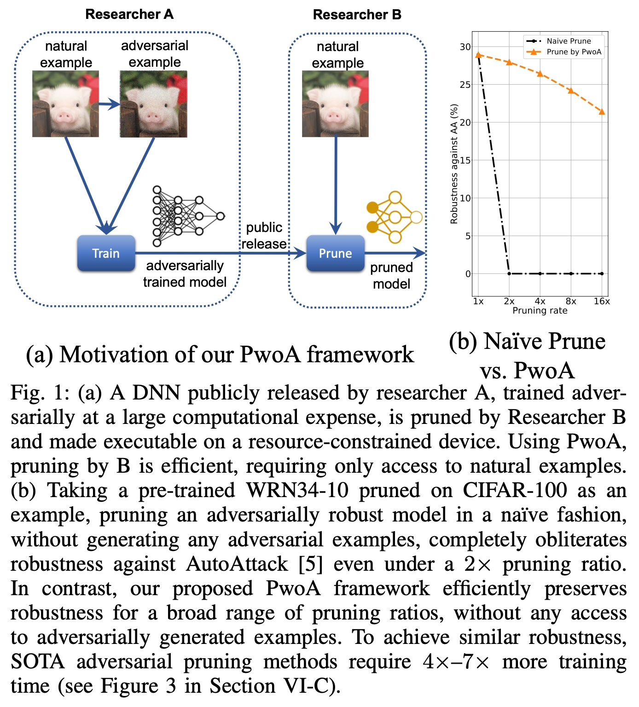
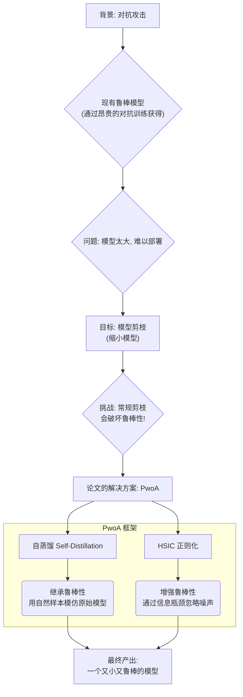
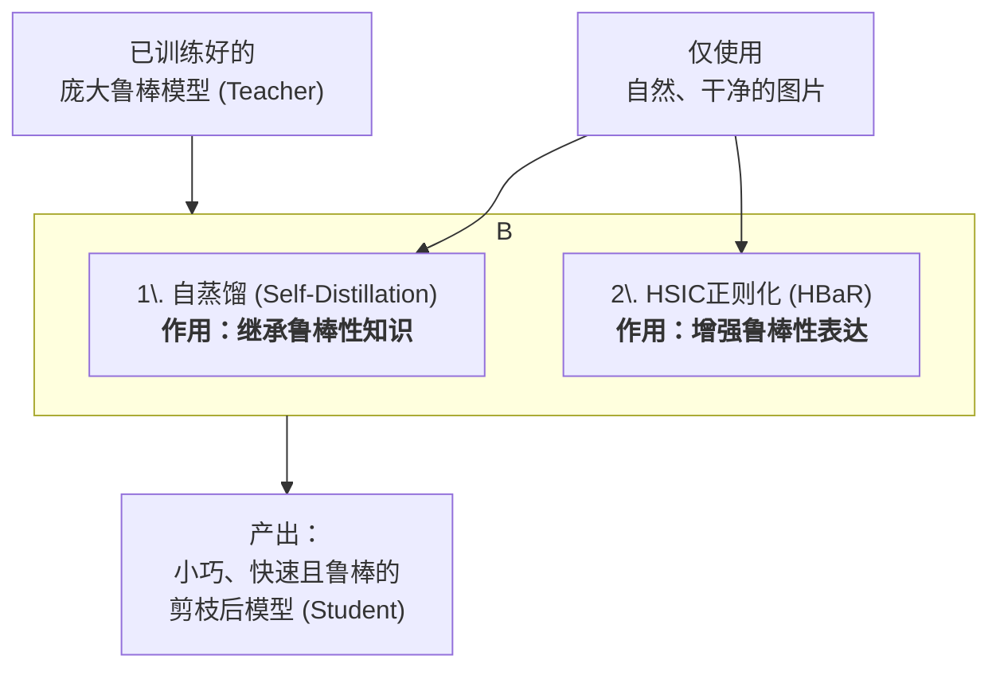
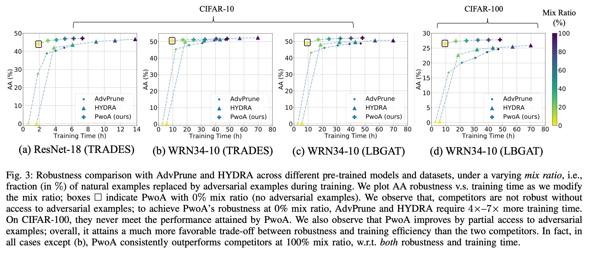
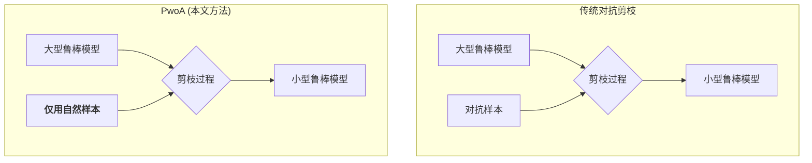

## AI论文解读 | Pruning Adversarially Robust Neural Networks without Adversarial Examples
        
### 作者        
digoal        
        
### 日期        
2025-10-12        
        
### 标签        
PostgreSQL , PolarDB , DuckDB , AI , 论文解读        
        
----        
        
## 背景  
      
https://arxiv.org/pdf/2210.04311        
  
提示:          
```          
读懂《Pruning Adversarially Robust Neural Networks without Adversarial Examples》这篇论文需要提前掌握哪些基础知识, 请使用中文通熟易懂的讲解这些基础知识, 可以引用论文中的图、表或使用Markdown支持的图形(text,mermaid等)增加解释性. 
  
使用中文通熟易懂的解读《Pruning Adversarially Robust Neural Networks without Adversarial Examples》这篇论文, 其中的关键内容请着重讲解, 可以引用论文中的图、表或使用Markdown支持的图形(text,mermaid等)增加解释性. 
  
提取《Pruning Adversarially Robust Neural Networks without Adversarial Examples》这篇论文中的重要术语, 使用中文对这些术语进行通熟易懂的讲解, 可以引用论文中的图、表或使用Markdown支持的图形(text,mermaid等)增加解释性. 
```     
  
## 1 前置知识 
  
好的，为了完全理解《Pruning Adversarially Robust Neural Networks without Adversarial Examples》这篇论文，您需要掌握以下几个核心基础知识。我会用通俗易懂的方式，并结合论文中的图表来为您讲解。

### 核心知识框架

理解这篇论文，可以分为三个层次：

1.  **为什么要做这件事？** (背景问题：对抗攻击与模型压缩的矛盾)
2.  **这件事的目标是什么？** (研究目标：在不使用对抗样本的前提下，对鲁棒模型进行剪枝)
3.  **这件事是怎么做的？** (核心技术：知识蒸馏与HSIC正则化)

下面我们来逐一分解。

-----

### 1\. 深度神经网络、对抗攻击与鲁棒性 (背景)

#### 1.1 深度神经网络 (Deep Neural Networks, DNNs)

您可以把它想象成一个复杂的信息处理机器，由许多相互连接的“神经元”层组成。我们给它输入数据（比如一张图片），它通过层层计算，最终输出一个结果（比如图片的分类：“猪”）。模型中最重要的部分是它的“权重”（weights），这些权重是在训练过程中学习到的参数，决定了模型如何处理信息。

#### 1.2 对抗攻击 (Adversarial Attacks)

这是理解本论文的起点。深度学习模型虽然强大，但也很脆弱。攻击者可以在原始图片上添加一些人眼几乎无法察觉的微小扰动（称为“对抗扰动”），形成“对抗样本”。这个被修改后的图片在人看来没有变化，但却能轻易地骗过神经网络，让它做出错误的判断。

论文的 **图1(a)** 就生动地展示了这一点：

  * **左侧 (Researcher A)**：一张“自然样本”（natural example）的猪图片被模型正确识别。但在其上添加微小扰动后，变成了“对抗样本”（adversarial example），模型可能就把它识别成“飞机”或其他类别了，尽管图片看起来还是一只猪 。

  

图1(a)中的对抗样本示例

#### 1.3 对抗鲁棒性 (Adversarial Robustness)

“鲁棒性”指的就是模型抵抗这种对抗攻击的能力。一个“鲁棒”的模型，即使面对对抗样本，也能够保持正确的预测。

**如何获得鲁棒性？** 最有效的方法是 **对抗训练 (Adversarial Training)** 。简单说，就是在训练模型时，不断地制造对抗样本，然后把这些“假想敌”喂给模型，强迫它学习如何正确识别它们。这个过程极大地增强了模型的鲁棒性，但缺点是计算成本非常高，训练时间可能是普通训练的3到30倍 。

-----

### 2\. 模型剪枝 (Model Pruning) (目标)

#### 2.1 什么是模型剪枝？

一个经过训练的神经网络，其内部的权重有很多是冗余的，就像一棵枝叶繁茂的大树，很多细枝末节对整体形态贡献不大。**模型剪枝**  就是一个“修剪”的过程，它会移除掉那些不重要的权重（通常是数值接近于零的权重），让模型变得更“稀疏”。

**为什么要剪枝？**

  * **模型更小**：占用更少的存储空间。
  * **计算更快**：推理时需要计算的量变少了。
  * **能效更高**：非常适合部署在手机、嵌入式设备等资源有限的硬件上 。

#### 2.2 剪枝带来的新问题

这篇论文的核心矛盾点来了：常规的剪枝方法在追求模型小巧高效的同时，会严重破坏模型的对抗鲁棒性。

论文的 **图1(b)** 用实验数据清晰地揭示了这个问题： 

  * **横轴**是“剪枝率”（Pruning rate），2x代表模型大小被压缩到原来的1/2。
  * **纵轴**是“鲁棒性”（针对AA攻击的准确率）。
  * 黑色的虚线 **"Naïve Prune"** 代表“天真的剪枝方法”。你可以看到，哪怕只进行2倍的剪枝，模型的鲁棒性就瞬间从接近30%暴跌到几乎为0 。

  

图1(b)中的“天真剪枝” vs 论文方法 PwoA 

**论文的核心目标**：设计一种新的剪枝框架，叫做 **PwoA (Pruning without Adversarial examples)**，它可以在**不依赖昂贵的对抗样本**的情况下，对一个已经训练好的鲁棒模型进行剪枝，同时最大限度地保留其来之不易的对抗鲁棒性 。如图1(b)中橙色曲线所示，PwoA在很高的剪枝率下依然能保持很高的鲁棒性 。

-----

### 3\. PwoA框架的核心技术 (方法)

为了实现上述目标，PwoA框架巧妙地结合了两种技术：**自蒸馏** 和 **HSIC正则化**。

#### 3.1 自蒸馏 (Self-Distillation) - "继承鲁棒性"

**知识蒸馏 (Knowledge Distillation)** 是一个很经典的概念。把它比作“师徒传承”：

  * 有一个强大但复杂的“教师模型”（Teacher）。
  * 有一个小巧但待训练的“学生模型”（Student）。
  * 我们不直接用标准答案（hard labels, 如“猪”就是类别1）去教学生，而是让学生去模仿老师的“思考过程”，也就是老师输出的概率分布（soft labels, 如“90%像猪，5%像猫，1%像狗...”）。这些“软标签”包含了更丰富的信息，能帮助学生学得更好 。

**自蒸馏 (Self-Distillation)** 是知识蒸馏的一种特殊形式。在这篇论文里：

  * **“教师”** ：就是那个已经通过昂贵对抗训练得到的、又大又鲁棒的原始模型。
  * **“学生”** ：是这个教师模型经过剪枝后的稀疏版本。

PwoA让“学生”（剪枝后的模型）去模仿“教师”（原始鲁棒模型）在**普通、干净的自然样本**上的输出。通过这种方式，原始模型的“鲁棒性知识”被“蒸馏”并继承到了小模型中，整个过程完全不需要再生成和使用对抗样本 。

#### 3.2 HSIC瓶颈作为正则化器 (HBaR) - "增强鲁棒性"

这是论文中更偏理论、但非常关键的一个创新点，用于在使用自然样本剪枝时进一步**增强**鲁棒性。

**HSIC (Hilbert-Schmidt Independence Criterion)** 是一种衡量两个变量之间**非线性依赖关系**的统计工具 。数值越大，表示依赖性越强。

PwoA将HSIC设计成一个“正则化项”（一种惩罚机制），包含两个目标 ：

1.  **最小化 `HSIC(输入X, 模型中间层输出Z)`**:

      * **通俗理解**：让模型的内部表示（Z）不要“过分依赖”原始输入（X）的全部细节。
      * **为什么能增强鲁棒性？** 因为对抗扰动是输入X的一部分。降低对输入的依赖，就相当于让模型学会“忽略”那些无关紧要的扰动噪声，只关注核心的、对分类有用的信息，从而变得更加鲁棒 。

2.  **最大化 `HSIC(最终输出Y, 模型中间层输出Z)`**:

      * **通俗理解**：在“忽略”输入细节的同时，必须保证模型的内部表示（Z）与正确的标签（Y）高度相关。
      * **为什么需要这个？** 这是为了防止模型在“忽略”噪声的同时，把有用的信息也丢了，导致连正常的分类准确率都无法保证 。

这两个目标形成了一种“信息瓶颈”：只允许对最终分类（Y）有用的信息从输入（X）流向模型的内部表示（Z）。

### 总结

为了读懂这篇论文，您需要掌握的基础知识可以用以下流程图来概括：



简而言之，这篇论文的精髓在于：承认对抗训练是获得鲁棒性的好方法，但不希望在后续的压缩（剪枝）阶段再次付出高昂的代价。于是，它提出了一种“知识转移”的策略，通过**自蒸馏**来继承已有的鲁棒性，再通过**HSIC正则化**在使用干净数据微调时进一步巩固和增强这种鲁棒性，最终实现了高效、低成本的鲁棒模型压缩。
  
## 2 解读论文 
  
好的，我们来一起通俗易懂地解读这篇重要的论文：《在没有对抗样本的情况下剪枝对抗鲁棒神经网络》。

### 论文核心思想一览

想象一个场景：

  * **研究员A** 花费了巨大的计算资源（比如几周的GPU时间），通过“对抗训练”打造了一个非常强大的神经网络。这个网络不仅识别图片准确，而且非常“鲁棒”，能够抵抗恶意攻击（即对抗攻击）。然而，这个模型非常庞大和臃肿。
  * **研究员B** 想把这个强大的模型部署到资源有限的设备上，比如手机或智能摄像头。他需要对模型进行“剪枝”，把它变小变快。

**核心矛盾**：如果研究员B使用常规方法剪枝，模型的“鲁棒性”会瞬间消失殆尽，变得不堪一击。而如果想在剪枝时保持鲁棒性，传统方法（如AdvPrune, HYDRA）又要求他像研究员A一样，不断生成对抗样本来辅助训练，这同样非常耗时耗力。

这篇论文就是要解决研究员B的困境，提出了一个名为 **PwoA (Pruning without Adversarial examples)** 的框架。它的目标是：**在完全不使用（或很少使用）对抗样本的情况下，高效地对一个已有的鲁棒模型进行剪枝，同时最大限度地保留其宝贵的对抗鲁棒性。**

-----

### 关键内容深度解读

#### 1\. 问题根源：天真剪枝的“灾难性遗忘”

对抗鲁棒性是模型通过对抗训练学习到的一种特殊“知识”。常规的剪枝方法只关心如何保持模型在正常图片上的准确率，完全忽略了这种特殊知识。

论文中的 **图1(b)** 非常直观地展示了这个问题：

  

图1(b): 天真剪枝 vs. PwoA

  * **黑色虚线 (Naïve Prune)**：代表直接对鲁棒模型进行剪枝。可以看到，哪怕只剪掉一半的参数（Pruning rate = 2x），模型的鲁棒性（纵坐标，对抗AA攻击的准确率）就从近30%断崖式下跌到0 。这说明模型的鲁棒性被完全破坏了。
  * **橙色虚线 (PwoA)**：代表论文提出的方法。即使在很高的剪枝率下（如8x、10x），模型依然保持了很高的鲁棒性 。

#### 2\. PwoA框架的两大“法宝”

PwoA框架之所以能在不看“假想敌”（对抗样本）的情况下保持战斗力，主要依赖于两个核心技术：



**法宝一：自蒸馏 (Self-Distillation) —— 向自己学习，继承鲁棒性**

  * **基本原理**：知识蒸馏是一种“师徒传承”的技术，让一个小的“学生”模型去模仿一个强大的“教师”模型的输出。
  * **PwoA的创新用法**：在这里，“教师”就是原始的、庞大的鲁棒模型，“学生”则是正在被剪枝的、稀疏版本的自己。PwoA强迫“学生”模型在看到**正常的、干净的图片**时，其输出要尽可能地模仿“教师”的输出 。
  * **为什么有效？** 强大的教师模型在对抗训练中已经学会了如何区分细微的差异。它对一张正常图片输出的概率（比如“95%是猪，3%是狗，2%是猫”）包含了比一个简单标签“猪”丰富得多的“鲁棒性知识”。通过模仿这个输出，学生模型间接地学会了教师的“思维方式”，从而继承了鲁棒性，而整个过程完全不需要看到对抗样本 。

**法宝二：HSIC正则化 —— 抓住本质，增强鲁棒性**

这是论文中更具技术深度的部分，其核心是构建了一个“信息瓶颈”，让模型学会在剪枝时“去粗取精”。

  * **HSIC是什么？** 它可以衡量两个变量之间的依赖关系。
  * **PwoA的目标**：通过HSIC正则化，同时实现两个看起来有点矛盾的目标 ：
    1.  **减少模型内部表示对输入的依赖** `(min HSIC(Input, Representation))`：对抗扰动是输入的一部分。降低模型对输入的“敏感度”，可以让它学会忽略那些微小的、恶意的扰动，从而变得更鲁棒 。
    2.  **增加模型内部表示对正确标签的依赖** `(max HSIC(Representation, Label))`：在忽略噪声的同时，必须保证模型抓住了分类任务的“本质信息”，否则连正常的识别能力都会丧失 。
  * **效果**：这个机制迫使模型在压缩过程中，优先保留那些对最终分类最重要、且对输入扰动不敏感的特征，从而进一步增强了鲁棒性。

#### 3\. 实验结果：效果与效率的双重胜利

论文通过大量的实验证明了PwoA的优越性。

  * **鲁棒性对比 (表 II, III, IV)**：在MNIST, CIFAR-10, CIFAR-100三个数据集上，PwoA (`L_D + L_H`)的表现全面优于仅使用交叉熵(`L_CE`，即天真剪枝)或仅使用蒸馏(`L_D`)的方法。例如，在CIFAR-100数据集上，4倍剪枝率下，`L_CE`方法的鲁棒性（AA）为0，而PwoA能达到26.44% 。这证明了PwoA两大组件的协同作用是成功的。

  * **效率对比 (图3)**：这是最惊艳的结果之一。下图展示了在达到相似鲁棒性水平时，不同方法所需的训练时间。


  

图3: 鲁棒性 vs. 训练时间 

  * **方框标记**：代表PwoA在**完全不使用对抗样本**（mix ratio=0%）时的表现 。
  * **其他曲线**：代表AdvPrune和HYDRA等SOTA方法，它们需要不断增加对抗样本的比例才能提升鲁棒性。
  * **结论**：可以看到，为了达到PwoA（方框）的鲁棒性水平，AdvPrune和HYDRA需要**4到7倍**的训练时间 。在CIFAR-100数据集上，它们甚至无论花费多长时间都达不到PwoA的初始性能 。这证明了PwoA在效率上的巨大优势。

### 总结

《在没有对抗样本的情况下剪枝对抗鲁棒神经网络》这篇论文做出了以下关键贡献：

1.  **提出了首个无需对抗样本的鲁棒剪枝框架(PwoA)**：它创造性地解决了模型压缩与鲁棒性保持之间的矛盾，使得对大型鲁棒模型的轻量化变得高效、可行。
2.  **巧妙结合自蒸馏与HSIC正则化**：通过“继承”与“增强”两条路径，仅利用自然样本就成功地保留和强化了模型的对抗鲁棒性。
3.  **实现了巨大的效率提升**：实验证明，PwoA相比于依赖对抗样本的SOTA方法，可以取得相当甚至更好的鲁棒性，同时将训练时间缩短了**4至7倍** 。

这项工作极大地降低了部署鲁棒AI模型的门槛，对于推动安全、可靠的人工智能在资源受限设备上的应用具有重要的现实意义。
  
## 3 术语 
  
好的，这是对论文《Pruning Adversarially Robust Neural Networks without Adversarial Examples》中关键术语的通俗解读。

-----

### 1\. 对抗样本 (Adversarial Example)

**通俗讲解**：
对抗样本指的是一种经过特殊设计的“欺骗性”输入数据 。攻击者在原始的、干净的图片上添加一些人眼几乎无法察觉的微小扰动，但这种改动足以让一个训练有素的神经网络模型做出完全错误的判断 。

**图解**：
论文的图1(a)生动地展示了这一点。左边是一张正常的猪的图片（natural example），模型可以正确识别。右边是加入了微小扰动后的对抗样本（adversarial example），人眼看仍然是猪，但模型可能就会把它识别成其他完全不相关的物体 。

  

图1(a)中的对抗样本示例 

### 2\. 对抗鲁棒性 (Adversarial Robustness)

**通俗讲解**：
对抗鲁棒性指的是一个神经网络模型抵抗上述“对抗样本”攻击的能力 。一个鲁棒性强的模型，即使面对这些经过恶意篡改的输入，也能够保持其预测的准确性 。这是衡量模型在安全关键应用中是否可靠的重要指标 。

### 3\. 对抗训练 (Adversarial Training)

**通俗讲解**：
这是目前获得对抗鲁棒性最常用且最有效的方法 。它的核心思想是在模型的训练过程中，不断地“左右互搏”：

1.  **生成假想敌**：针对当前的模型，实时生成一批对抗样本 。
2.  **进行针对性训练**：将这些对抗样本喂给模型，强迫它学习如何正确识别这些“骗局” 。

通过这种方式，模型会逐渐变得更加健壮。但它的主要缺点是计算成本极高，训练时间通常是普通训练的3到30倍 。

### 4\. 权重剪枝 (Weight Pruning)

**通俗讲解**：
权重剪枝是一种模型压缩技术，旨在减小神经网络模型的尺寸，使其运行得更快、占用内存更少 。它的原理类似于园丁修剪树木：移除掉模型中那些“不重要”或“冗余”的连接权重（通常是数值接近于零的权重），只保留最核心的骨干结构 。

### 5\. 对抗剪枝 (Adversarial Pruning)

**通俗讲解**：
这是一个结合了“对抗鲁棒性”和“模型剪枝”的领域 。其目标是在对模型进行剪枝、使其变小的同时，还能保持其强大的对抗鲁棒性 。**然而，这篇论文之前的绝大多数对抗剪枝方法，都需要在剪枝过程中依赖昂贵的对抗训练** ，这极大地影响了效率 。

### 6\. PwoA (Pruning without Adversarial examples)

**通俗讲解**：
PwoA是这篇论文提出的**核心框架**的名称，意为“**无对抗样本的剪枝**” 。它的目标是，在不对抗训练产生依赖的前提下，高效地剪枝一个已经训练好的鲁棒模型，并保持其鲁棒性 。



### 7\. 自蒸馏 (Self-distillation)

**通俗讲解**：
这是PwoA框架中用于 **“继承”鲁棒性** 的关键技术。

  * **知识蒸馏**：好比一位经验丰富的“教师”（大模型）教一个“学生”（小模型）。学生不只学习标准答案，更重要的是模仿老师的“思考过程”（即模型输出的完整概率分布，也叫软标签）。
  * **自蒸馏**：在这篇论文里， **“教师”和“学生”是同一个模型的不同版本** 。“教师”是原始的、庞大且鲁棒的模型，“学生”则是正在被剪枝的稀疏版本 。学生通过模仿教师在**普通、干净的自然样本**上的输出，来学习并继承教师已经具备的鲁棒性知识 。

### 8\. HSIC 瓶颈作为正则化器 (HBaR)

**通俗讲解**：
这是PwoA框架中用于 **“增强”鲁棒性** 的另一个关键技术。

  * **HSIC**：一种衡量两个变量之间非线性依赖关系的统计工具 。
  * **HBaR 的作用**：它像一个“信息过滤器”，在剪枝时对模型施加两种约束 ：
    1.  **减少对输入的依赖**：迫使模型忽略输入数据中的冗余或噪声信息（对抗扰动就是一种噪声）。
    2.  **保留关键分类信息**：同时，确保模型保留了与正确分类标签最相关的信息 。

通过这种方式，模型在被压缩的同时，学会了更关注任务的本质，从而进一步增强了鲁棒性，而这一切也只发生在自然样本上 。

### 9\. 混合比例 (Mix Ratio)

**通俗讲解**：
这是论文在进行**实验对比**时使用的一个术语。它指的是在训练过程中，使用的**对抗样本占总训练样本的百分比** 。

  * **Mix Ratio = 0%**：表示完全不使用对抗样本进行训练。这是PwoA的核心优势所在。
  * **Mix Ratio \> 0%**：表示混合了一定比例的对抗样本。

论文通过调整这个比例，公平地比较了PwoA和其他需要对抗样本的方法（如AdvPrune, HYDRA）在不同训练成本下的性能，从而突显出PwoA的巨大效率优势 。
  
## 参考        
         
https://arxiv.org/pdf/2210.04311    
        
<b> 以上内容基于DeepSeek、Qwen、Gemini及诸多AI生成, 轻微人工调整, 感谢杭州深度求索人工智能、阿里云、Google等公司. </b>        
        
<b> AI 生成的内容请自行辨别正确性, 当然也多了些许踩坑的乐趣, 毕竟冒险是每个男人的天性.  </b>        
    
#### [期望 PostgreSQL|开源PolarDB 增加什么功能?](https://github.com/digoal/blog/issues/76 "269ac3d1c492e938c0191101c7238216")
  
  
#### [PolarDB 开源数据库](https://openpolardb.com/home "57258f76c37864c6e6d23383d05714ea")
  
  
#### [PolarDB 学习图谱](https://www.aliyun.com/database/openpolardb/activity "8642f60e04ed0c814bf9cb9677976bd4")
  
  
#### [PostgreSQL 解决方案集合](../201706/20170601_02.md "40cff096e9ed7122c512b35d8561d9c8")
  
  
#### [德哥 / digoal's Github - 公益是一辈子的事.](https://github.com/digoal/blog/blob/master/README.md "22709685feb7cab07d30f30387f0a9ae")
  
  
#### [About 德哥](https://github.com/digoal/blog/blob/master/me/readme.md "a37735981e7704886ffd590565582dd0")
  
  

  
