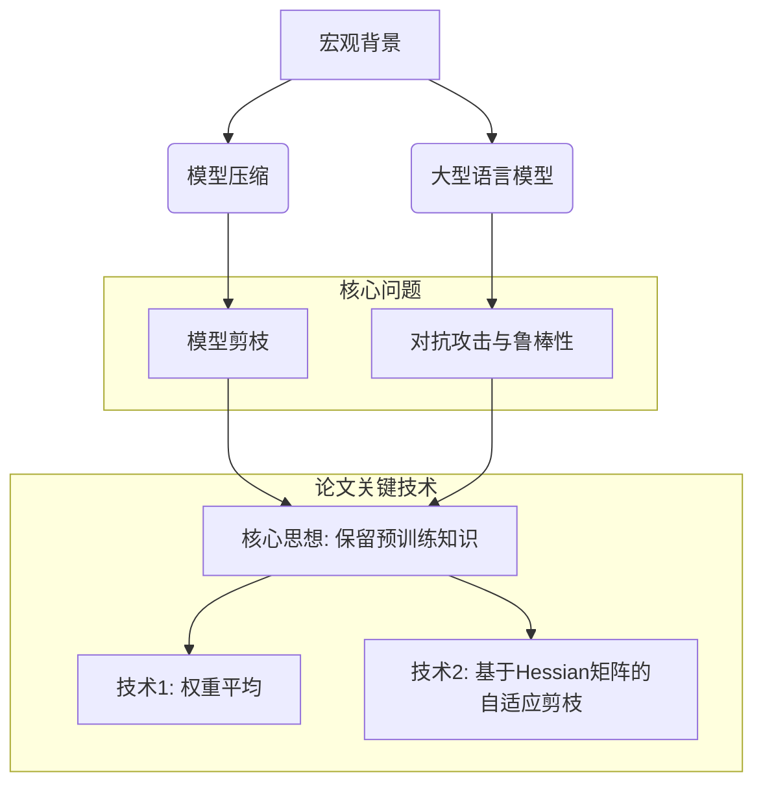
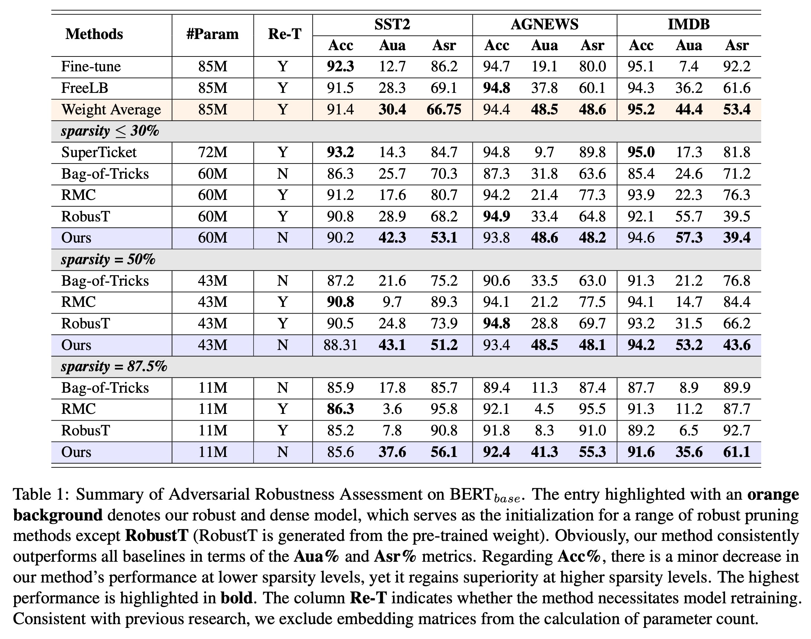
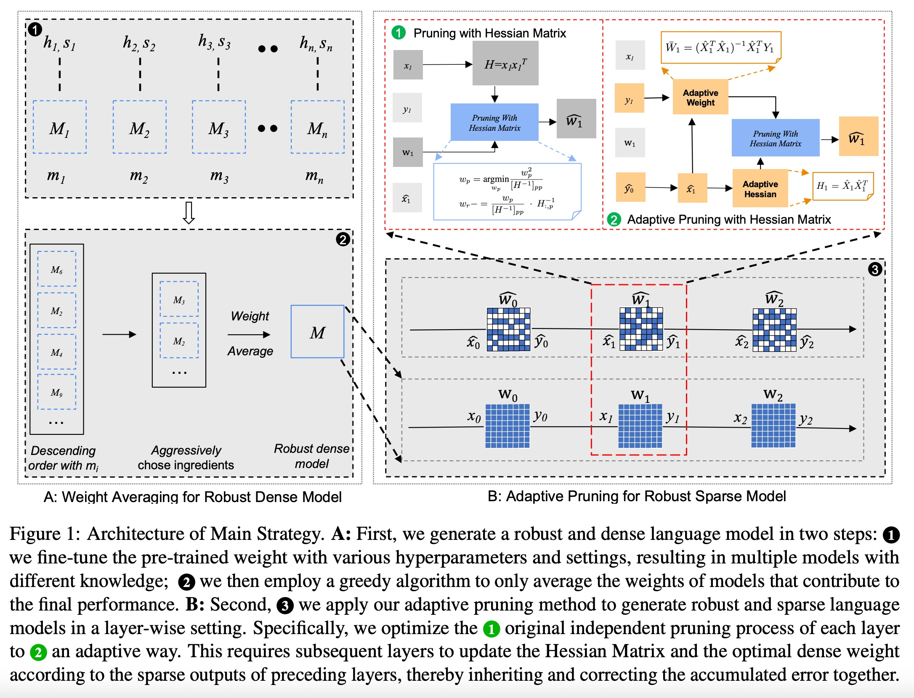
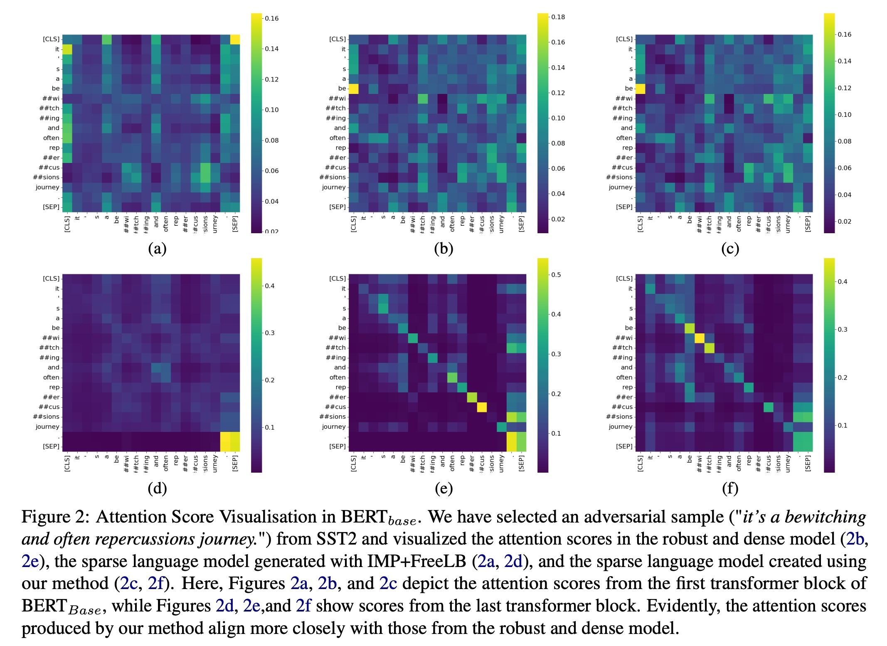
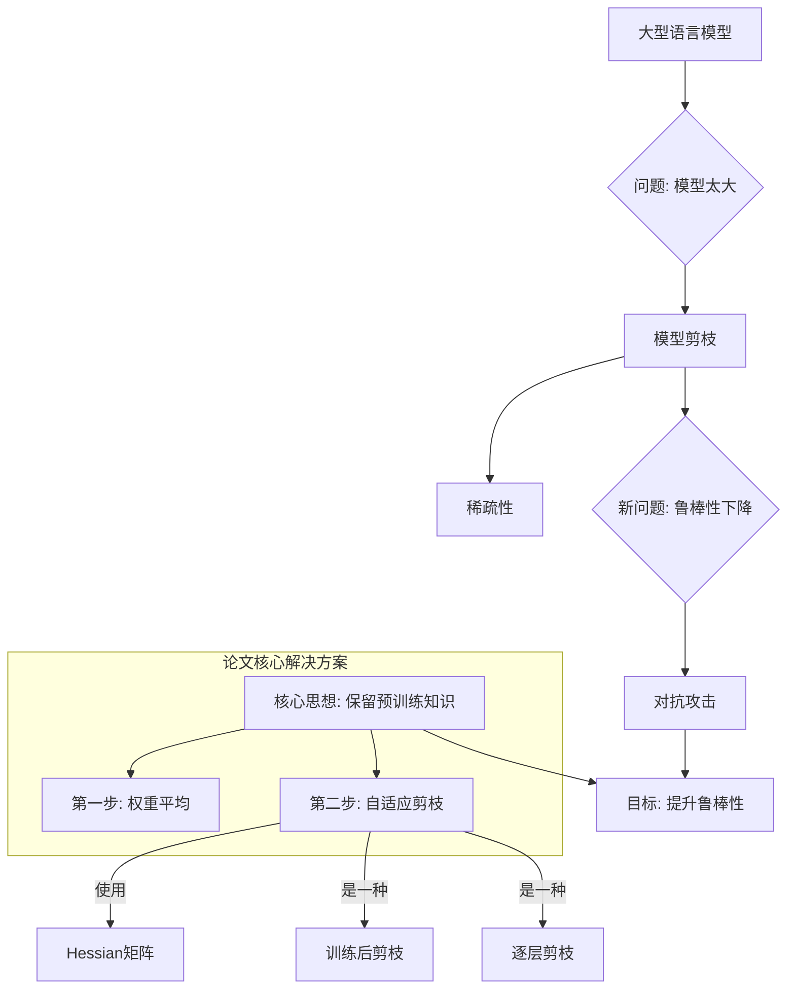

## AI论文解读 | Towards Robust Pruning: An Adaptive Knowledge-Retention Pruning Strategy for Language Models
        
### 作者        
digoal        
        
### 日期        
2025-10-12        
        
### 标签        
PostgreSQL , PolarDB , DuckDB , AI , 论文解读        
        
----        
        
## 背景  
      
https://arxiv.org/pdf/2310.13191        
  
提示:          
```          
读懂《Towards Robust Pruning: An Adaptive Knowledge-Retention Pruning Strategy for Language Models》这篇论文需要提前掌握哪些基础知识, 请使用中文通熟易懂的讲解这些基础知识, 可以引用论文中的图、表或使用Markdown支持的图形(text,mermaid等)增加解释性. 
  
使用中文通熟易懂的解读《Towards Robust Pruning: An Adaptive Knowledge-Retention Pruning Strategy for Language Models》这篇论文, 其中的关键内容请着重讲解, 可以引用论文中的图、表或使用Markdown支持的图形(text,mermaid等)增加解释性. 
  
提取《Towards Robust Pruning: An Adaptive Knowledge-Retention Pruning Strategy for Language Models》这篇论文中的重要术语, 使用中文对这些术语进行通熟易懂的讲解, 可以引用论文中的图、表或使用Markdown支持的图形(text,mermaid等)增加解释性. 
```     
  
## 1 前置知识 
  
好的，为了完全理解《Towards Robust Pruning: An Adaptive Knowledge-Retention Pruning Strategy for Language Models》这篇论文，你需要掌握一些从宏观到具体技术的基础知识。下面我将用通俗易懂的中文，并结合论文中的图表，为你逐一讲解。

### 知识结构导览

我们可以将所需的基础知识分为三个层次：



-----

### 1\. 宏观背景：我们为什么要关心这个问题？

#### 1.1. 大型语言模型 (Large Language Models, LLMs)

  * **是什么**：你可以把LLMs想象成一个“超级大脑”，比如BERT、GPT等。它们通过阅读海量的文本（比如整个维基百科）来学习语言的规律、知识和逻辑。
  * **有什么问题**：这些“超级大脑”非常庞大，包含了数亿甚至数千亿的参数（可以理解为神经元连接的强度）。这导致两个主要问题：
    1.  **部署成本高**：需要强大的硬件（如昂贵的GPU）才能运行。
    2.  **推理速度慢**：模型做一次计算（比如回答一个问题）需要很长时间。

#### 1.2. 模型压缩 (Model Compression)

  * **是什么**：为了解决LLMs过于庞大的问题，研究人员提出了模型压缩技术，就像把一个巨大的文件压缩成一个更小的zip包。论文中提到的“剪枝”（Pruning）就是其中最主流的一种方法。
  * **目标**：在尽可能不损失模型性能（如准确率）的前提下，减小模型体积，加快运行速度 。

### 2\. 核心问题：剪枝带来的新挑战

#### 2.1. 模型剪枝 (Model Pruning)

  * **是什么**：模型剪枝就像修剪盆栽，把模型中那些“不那么重要”的参数（通常是数值接近于0的权重）直接删除，从而让模型变得更“稀疏”（Sparsity）。
  * **传统方法的局限**：传统的剪枝方法主要关注在“干净”的数据集上保持高准确率。但它们忽略了一个严重的问题：剪枝后的模型可能会变得非常脆弱。

#### 2.2. 对抗攻击 (Adversarial Attacks) 与鲁棒性 (Robustness)

  * **是什么**：对抗攻击是指对输入数据做一些人眼难以察觉的微小改动，从而让模型做出完全错误的判断 。在自然语言处理（NLP）领域，这通常意味着替换句子中的某个词为其近义词 。
      * **例子**：
          * 原始句子：“这部电影的表演**好极了**。” -\> 模型预测：正面情感
          * 对抗样本：“这部电影的表演**太棒了**。” -\> 一个脆弱的模型可能预测：负面情感
  * **鲁棒性**：一个模型的“鲁棒性”强，意味着它能抵抗住这种对抗攻击，即使输入有微小变化，也能保持正确的判断。
  * **剪枝与鲁棒性的冲突**：研究发现，经过剪枝的模型虽然在普通任务上表现不错，但其鲁棒性往往会急剧下降，更容易被对抗攻击“欺骗” 。这正是本篇论文要解决的核心矛盾。

为了直观理解，可以看论文中的**表1**。   

| Methods | Acc | **Aua** | **Asr** |
| :--- | :---: | :---: | :---: |
| Fine-tune | 92.3 | **12.7** | 86.2 |
| RMC (一种剪枝方法) | 90.8 | **9.7** | 89.3 |
| **Ours (本文方法)** | 88.31 | **43.1** | 51.2 |

  * `Acc` (Clean Accuracy): 在正常、干净数据上的准确率。
  * `Aua` (Accuracy Under Attack): 遭受对抗攻击后的准确率。**这个值越高，说明模型越鲁棒。**
  * `Asr` (Attack Success Rate): 攻击成功率。这个值越低越好。

从表中可以看到，传统剪枝方法（如RMC）的`Aua`非常低，而本文方法在`Aua`上远超其他方法，证明了其强大的鲁棒性。

### 3\. 论文关键技术：如何实现“鲁棒剪枝”？

这篇论文的核心观点是：**模型的鲁棒性与它保留了多少“预训练知识”成正比** 。一个模型之所以能理解近义词，正是因为它在预训练阶段学到了丰富的语义知识。剪枝如果粗暴地破坏了这些知识，模型自然就变得脆弱了。

为了实现这一目标，论文设计了两步走的策略，如下图1所示：

  

#### 3.1. 技术一：权重平均 (Weight Averaging) - 先打造一个强大的“底座”

  * **做什么**：在剪枝之前，先创建一个鲁棒性足够强的**密集模型**（dense model，即未剪枝的原始模型）。
  * **怎么做** (对应上图 A 部分)：
    1.  **训练多个模型**：使用不同的超参数（学习率、优化器等）对原始的预训练模型进行多次微调，得到多个“各有所长”的模型 M1, M2, ..., Mn 。
    2.  **贪心平均**：像“熬制一锅浓汤”一样，不是简单地把所有模型的权重加起来平均，而是采用一种贪心策略，逐个尝试加入能提升最终鲁棒性的模型，最后将筛选出的模型权重进行平均，得到一个强大的“鲁棒密集模型” M 。
  * **目的**：确保我们剪枝的起点是一个高质量、高鲁棒性的模型，而不是一个本身就存在缺陷的模型 。

#### 3.2. 技术二：基于Hessian矩阵的自适应剪枝 (Ada-Pruning) - 做一个“聪明的园丁”

这是论文最核心的技术创新。传统剪枝方法是孤立地看待每一层，剪完一层就不管了。而本文提出的`Ada-Pruning`（自适应剪枝）认为，剪枝是一个**连锁反应**，前一层的误差会累积并传递到后一层 。

  * **做什么** (对应上图 B 部分)：逐层剪枝，同时在每一层都**自适应地**纠正前面所有层累积下来的误差，目标是让剪枝后每一层的输出都尽可能地与原始密集模型的输出保持一致 。
  * **怎么做**：这里涉及到一个关键的数学工具——**Hessian矩阵 (Hessian Matrix)**。
      * **Hessian矩阵的通俗理解**：你不需要深入理解它的数学定义。在这里，你可以把它想象成一个 **“影响评估器”** 。对于模型中的每一个权重，Hessian矩阵可以告诉我们：如果删掉这个权重，会对模型的最终输出造成多大的影响（误差）。
      * **剪枝过程**：
        1.  **选择性删除**：在每一层，利用Hessian矩阵找到删除后对输出影响最小的那个权重，然后将其删除 。
        2.  **误差补偿**：删除一个权重后，会产生误差。算法会立刻**更新**该层中其他**保留**的权重，来补偿这个误差 。
        3.  **自适应更新 (Adaptive Update)**：这是最关键的一步。当剪枝完第 `l` 层后，其输出 `Ŷl` 已经带有误差了。这个带有误差的输出将作为下一层（`l+1` 层）的输入 `X̂l+1` 。此时，下一层的Hessian矩阵和最优权重都发生了变化，因为输入已经变了。因此，算法会**重新计算**下一层的Hessian矩阵和理想的密集权重，以适应这个包含了累积误差的新输入 。

这个过程就像一个非常精细的手术，每切除一小部分组织，都要立刻对周围的组织进行调整，并重新评估下一步手术方案，从而将对整个系统的影响降到最低。

### 总结

要读懂这篇论文，你需要掌握以下知识点：

1.  **背景**：了解大型语言模型很大，需要通过**剪枝**等方法进行**压缩**。
2.  **问题**：剪枝会损害模型的**鲁棒性**，使其容易受到**对抗攻击**。
3.  **论文方案**：
      * **核心思想**：通过保留**预训练知识**来维持鲁棒性。
      * **第一步**：用**权重平均**法先构建一个鲁棒的密集模型。
      * **第二步**：使用基于**Hessian矩阵**的**自适应剪枝**方法，在剪枝的同时动态补偿和纠正累积误差。

理解了这些概念，你就能很好地把握这篇论文的动机、挑战和核心贡献了。
  
## 2 解读论文 
  
好的，我们来通俗易懂地解读一下《Towards Robust Pruning: An Adaptive Knowledge-Retention Pruning Strategy for Language Models》这篇论文。

您可以将这篇论文的核心思想理解为一个“**智能瘦身手术**”，其目标不仅是让庞大的语言模型（比如BERT）变小变快，更重要的是让“瘦身”后的模型依然**强壮**，能够抵御外界的“**恶意攻击**”。

-----

### 1\. 背景：为什么要给语言模型“瘦身”？它有什么风险？

首先，我们需要了解两个基本概念：

  * **模型剪枝 (Pruning)**：现在的大型语言模型（LLMs）参数动辄上亿，运行起来又贵又慢 。模型剪枝就像修剪树枝，砍掉模型中那些“不那么重要”的参数，让模型变得更小、更稀疏（Sparsity），从而降低部署成本、加快推理速度 。
  * **对抗攻击 (Adversarial Attack)**：这是考验模型“强壮”程度的一种方式。攻击者会对输入数据做一些人眼难以察觉的修改（比如把“这部电影很**棒**”改成“这部电影很**赞**”），来欺骗模型，让它做出错误的判断 。一个能抵御这种攻击的模型，我们就说它**鲁棒性 (Robustness)** 好 。

**核心矛盾**：以往的剪枝方法在追求“瘦”（高稀疏度）和“准”（高准确率）的同时，往往会牺牲模型的“壮”（鲁棒性） 。剪枝后的模型在常规任务上表现尚可，但一遇到对抗攻击就变得不堪一击 。

这篇论文要解决的，就是如何在剪枝的同时，**保持甚至提升模型的鲁棒性**，并且**不需要昂贵的重新训练** 。

-----

### 2\. 核心观点：鲁棒性的关键在于“知识留存”

作者提出了一个非常直观的观点：**一个剪枝后模型的鲁棒性，取决于它保留了多少原始模型的“预训练知识”** 。

为什么这么说呢？因为语言模型之所以能理解“棒”和“赞”是近义词，正是得益于它在海量文本中学到的深层语义知识 。如果剪枝过程粗暴地破坏了这些知识，模型就会退化，无法分辨这种细微的语义变化，自然也就容易被攻击者欺骗了 。

因此，论文的目标就变成了：设计一种剪枝方法，能最大限度地**复现**原始密集模型（dense model）在每一层的 embedding 空间和 feature 空间，从而**保留**这些宝贵的预训练知识 。

-----

### 3\. 解决方案：两步走的“自适应知识保留剪枝”策略

为了实现上述目标，作者设计了一个精巧的两步策略，我们可以通过论文的**图1**来理解整个流程。

  

> **图1**: 论文提出的核心策略架构图 

#### **第一步 (图A)：权重平均，打造一个“鲁棒的密集模型”** 

在开始“手术”（剪枝）之前，得先确保“病人”本身足够健康。作者认为，如果原始模型本身就不够鲁棒，那么剪枝后的模型脆弱就不足为奇了 。

  * **做法**：
    1.  他们会用不同的超参数（学习率、优化器等）训练出多个不同版本的模型 。
    2.  然后，像调配鸡尾酒一样，通过一个贪心算法，只选择那些能对最终鲁棒性有贡献的模型的权重进行“平均” 。
  * **目的**：得到一个鲁棒性极强的密集模型，作为后续剪枝的完美起点 。

#### **第二步 (图B)：自适应剪枝，实现“鲁棒的稀疏模型”** 

这是论文最核心的技术创新，也是“智能”的体现。传统剪枝方法是“一层一层地剪，剪完就不管了” 。而作者认为，剪枝是一个**连锁反应**，**前一层的误差会累积并传递到后一层** 。

因此，他们提出了一种**自适应 (Adaptive)** 的剪枝方法。

  * **核心工具：Hessian 矩阵**

      * 你不需要理解复杂的数学，可以把它想象成一个“**影响评估器**” 。在剪枝时，它能帮助我们：
        1.  **识别**：找到删除后对该层输出结果**影响最小**的那个权重 。
        2.  **补偿**：删掉一个权重后，立刻调整其他保留的权重，来**弥补**这次删除带来的损失 。

  * **创新的“自适应”机制**

      * 当第 `l` 层剪枝完成后，它的输出 `Ŷ` 其实已经带上了微小的误差。这个带误差的输出将成为下一层（`l+1` 层）的输入 `X̂` 。
      * 此时，传统方法会继续用旧的信息去剪枝下一层，但本文的方法会做两件“自适应”的更新：
        1.  **自适应更新 Hessian 矩阵**：由于输入 `X̂` 变了，原来的“影响评估器”就不准了 。算法会根据这个新的、带有累积误差的输入，**重新计算**一个更精确的 Hessian 矩阵 。
        2.  **自适应更新密集权重**：同理，为了让新的输入 `X̂` 依然能得到原始的理想输出 `Y`，算法会**重新计算**一个当前层最优的“目标权重” `W̄` 。
      * 这个过程确保了每一步剪枝都是在**纠正前面所有步骤累积的误差**，而不是让误差滚雪球 。

-----

### 4\. 实验效果：成果斐然

论文的策略是否有效，最终要靠数据说话。我们可以看**表1**中的核心数据。   

| 方法 | 模型参数 | 重训练 | 数据集 | 干净准确率 (Acc) | **攻击后准确率 (Aua)** | **攻击成功率 (Asr)** |
| :--- | :---: | :---: | :---: | :---: | :---: | :---: |
| RobusT | 43M | 是 | IMDB | 93.2 | **31.5** | 66.2 |
| **Ours (本文方法)** | 43M | **否** | IMDB | 94.2 | **53.2** | 43.6 |
| RMC | 11M | 是 | SST2 | 86.3 | **3.6** | 95.8 |
| **Ours (本文方法)** | 11M | **否** | SST2 | 85.6 | **37.6** | 56.1 |

> **表1**: 论文在 BERTbase 模型上的对抗鲁棒性评估摘要  (已简化)

从表中可以清晰地看到：

  * **鲁棒性大幅提升**：在各种稀疏度下，本文方法（Ours）的“攻击后准确率 (Aua)”远超其他所有基线方法，同时“攻击成功率 (Asr)”也大幅降低 。例如，在 IMDB 数据集上将模型压缩一半（50%稀疏度）后，本文方法的 Aua 高达 **53.2%**，而强劲的对手 RobusT 仅有 **31.5%** 。
  * **成本效益极高**：注意“重训练 (Re-T)”这一列，本文方法的值是“N”（否），意味着它是一种**训练后 (Post-training)** 方法，不需要进行耗时耗力的模型重训练，这在实际应用中是一个巨大的优势 。
  * **知识保留的可视化证明**：论文中的**图2**通过可视化注意力得分，直观地展示了本文方法剪枝后的模型（图2c, 2f）其内部的“思考模式”与强大的原始密集模型（图2b, 2e）更为接近，而其他方法则相差甚远 。这有力地证明了该方法确实更好地保留了模型的原始知识 。    

### 总结

这篇论文为解决模型剪枝中的鲁棒性下降问题提供了一个非常有效的方案。其核心贡献可以概括为：

1.  **提出了一个新颖的观点**：将剪枝的鲁棒性与**预训练知识的保留程度**直接挂钩。
2.  **设计了一套创新的自适应剪枝流程 (Ada-Pruning)**：通过逐层**适应并纠正累积误差**，实现了对原始模型知识的高保真复现。
3.  **实现了卓越的性能**：在**无需重训练**的前提下，大幅提升了稀疏模型的鲁棒性，在准确性、稀疏度、鲁棒性和剪枝成本之间取得了前所未有的平衡 。
  
## 3 术语 
  
好的，这篇论文《Towards Robust Pruning: An Adaptive Knowledge-Retention Pruning Strategy for Language Models》中包含了一些非常关键的专业术语。为了帮助你更好地理解其核心思想，我将这些术语提取出来，并用通俗易懂的中文进行讲解，同时会引用论文中的图表来辅助说明。

### 核心术语关系图

我们可以用下面这张图来理解这些关键术语之间的逻辑关系：



-----

### 重要术语详解

#### 1\. 模型剪枝 (Model Pruning)

  * **通俗讲解**：可以把它想象成给一个臃肿的程序“瘦身”。语言模型由数亿个参数（权重）组成，其中很多参数的作用微乎其微。模型剪枝就是识别并“剪掉”这些不重要的参数，从而在不严重影响模型性能的前提下，大幅减小模型的大小，让它运行得更快 。
  * **在文中的作用**：这是整篇论文讨论的核心技术，旨在解决大型语言模型部署成本高、推理速度慢的问题 。

#### 2\. 稀疏性 (Sparsity)

  * **通俗讲解**：这是模型剪枝追求的一个目标状态。一个未经剪枝的模型是“密集”的，意味着大部分参数都是非零的。经过剪枝后，大量参数变为零，模型就变得“稀疏”了。稀疏性越高，意味着模型被压缩得越厉害。
  * **在文中的作用**：论文在不同的稀疏度水平（如30%, 50%, 87.5%）下评估了其方法的性能，以证明其在高度压缩模型上的有效性 。

#### 3\. 鲁棒性 (Robustness)

  * **通俗讲解**：指模型抵抗干扰的能力，就像一个人的身体“强壮”程度。一个鲁棒性强的模型，即使输入数据有微小的、合理的变动，也能保持稳定和正确的输出 。
  * **在文中的作用**：这是本文关注的**核心性能指标**。传统剪枝方法往往会牺牲鲁棒性，而本文提出的策略旨在剪枝的同时，维持甚至提升模型的鲁棒性。

#### 4\. 对抗攻击 (Adversarial Attacks)

  * **通俗讲解**：这是一种专门用来测试模型鲁棒性的“恶意”方法。攻击者会故意在输入数据上做一些人眼难以察觉的修改，来“欺骗”模型，使其做出错误的判断。在文本领域，这通常指将句子中的某个词换成其近义词 。
      * **例子**：原始句子：“这个演员的演技很**出色**。”，模型正确判断为正面。
      * 对抗样本：“这个演员的演技很**卓越**。”，一个不够鲁棒的模型可能会错误地判断为负面。
  * **在文中的作用**：论文使用对抗攻击（如TextFooler ）来评估不同剪枝方法得到的模型的鲁棒性。 **“攻击后准确率 (Aua)”** 是衡量鲁棒性的关键指标，越高越好。

#### 5\. 预训练知识 (Pre-trained Knowledge)

  * **通俗讲解**：这是大型语言模型在海量文本数据（如维基百科、书籍）上进行预训练时学到的语言规律、事实知识和常识推理能力 。可以理解为模型的“内功”或“世界观”。
  * **在文中的作用**：这是**论文的立论基础**。作者认为，剪枝后模型鲁棒性下降的根本原因在于**预训练知识的丢失** 。因此，他们的方法核心就是尽可能地保留这些知识。

#### 6\. 训练后剪枝 (Post-training Pruning)

  * **通俗讲解**：指在模型已经完全训练好之后才进行的剪枝操作。这种方法的优点是**成本低、效率高**，因为它不需要对剪枝后的模型进行漫长而昂贵的重新训练（retraining） 。
  * **在文中的作用**：本文提出的方法属于训练后剪枝，这使其相比那些需要边剪枝边训练或剪枝后需要重训练的方法，具有显著的效率优势。在论文的性能对比表（如**表1**）中，“Re-T”列为“N”的方法就属于此类 。    

#### 7\. Hessian 矩阵 (Hessian Matrix)

  * **通俗讲解**：这是一个数学工具，你不需要理解它的复杂计算。在这里，可以把它看作一个“**影响评估器**”。对于模型中的每一个参数，Hessian矩阵可以告诉我们两件事：
    1.  如果删除这个参数，会对模型的输出造成多大的误差（即“重要性”）。
    2.  删除之后，应该如何调整其他保留的参数，来最好地补偿这个误差 。
  * **在文中的作用**：它是本文核心剪枝算法的**技术基石**。算法利用Hessian矩阵来做出最明智的剪枝决策，即每次都剪掉那个“最不重要”的参数，并立刻修复带来的损伤 。

#### 8\. 权重平均 (Weight Averaging)

  * **通俗讲解**：这是一种提升模型性能和鲁棒性的技巧。具体做法是，用不同的设置（如不同的学习率、随机种子）训练出好几个模型，然后把它们的参数（权重）平均起来，得到一个集百家之长的“超级模型” 。
  * **在文中的作用**：对应**图1**的A部分，这是本文策略的**第一步**。在剪枝之前，先通过权重平均打造一个异常鲁棒的密集模型，为后续的剪枝提供一个高质量的起点。   

#### 9\. 自适应剪枝 (Adaptive Pruning)

  * **通俗讲解**：这是本文提出的**最核心的创新点**。传统的逐层剪枝是“孤立”的，剪完一层就不管它对后续层的影响。而自适应剪枝认为，剪枝是一个**连锁反应**，前一层的误差会累积并传递到后一层。因此，在剪枝第 `N` 层时，算法会**自适应地**考虑并**纠正**从第1层到第 `N-1` 层累积下来的所有误差 。
  * **在文中的作用**：对应**图1**的B部分。通过“自适应更新Hessian矩阵”和“自适应更新密集权重”，该方法确保了剪枝过程的全局最优性，从而最大限度地保留了预训练知识。

#### 10\. 逐层剪枝 (Layer-wise Pruning)

  * **通俗讲解**：一种剪枝的执行策略，即将一个庞大的神经网络拆分成独立的层，然后一层一层地进行剪枝，而不是一次性处理整个网络 。
  * **在文中的作用**：本文的方法是基于逐层剪枝框架的，但通过引入“自适应”机制，克服了传统逐层剪枝方法忽略层间依赖性的缺陷。
  
## 参考        
         
https://arxiv.org/pdf/2310.13191    
        
<b> 以上内容基于DeepSeek、Qwen、Gemini及诸多AI生成, 轻微人工调整, 感谢杭州深度求索人工智能、阿里云、Google等公司. </b>        
        
<b> AI 生成的内容请自行辨别正确性, 当然也多了些许踩坑的乐趣, 毕竟冒险是每个男人的天性.  </b>        
    
#### [期望 PostgreSQL|开源PolarDB 增加什么功能?](https://github.com/digoal/blog/issues/76 "269ac3d1c492e938c0191101c7238216")
  
  
#### [PolarDB 开源数据库](https://openpolardb.com/home "57258f76c37864c6e6d23383d05714ea")
  
  
#### [PolarDB 学习图谱](https://www.aliyun.com/database/openpolardb/activity "8642f60e04ed0c814bf9cb9677976bd4")
  
  
#### [PostgreSQL 解决方案集合](../201706/20170601_02.md "40cff096e9ed7122c512b35d8561d9c8")
  
  
#### [德哥 / digoal's Github - 公益是一辈子的事.](https://github.com/digoal/blog/blob/master/README.md "22709685feb7cab07d30f30387f0a9ae")
  
  
#### [About 德哥](https://github.com/digoal/blog/blob/master/me/readme.md "a37735981e7704886ffd590565582dd0")
  
  

  
