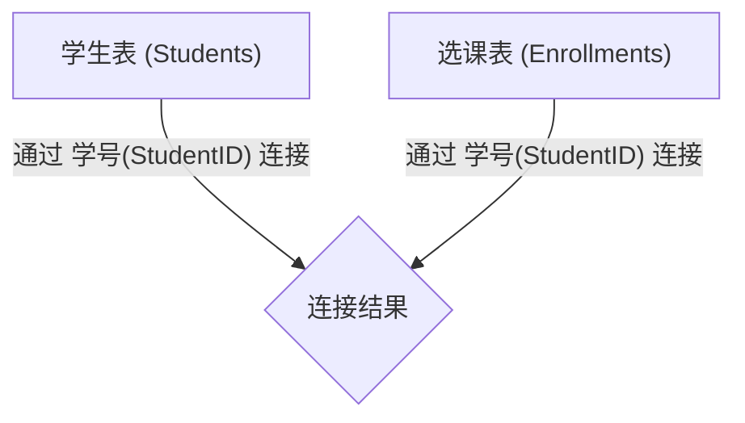
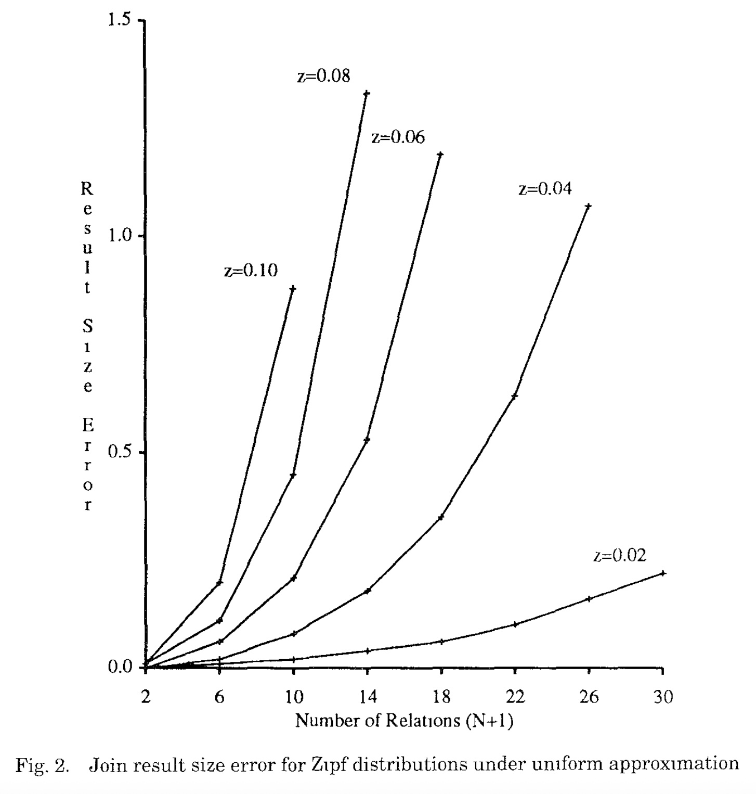
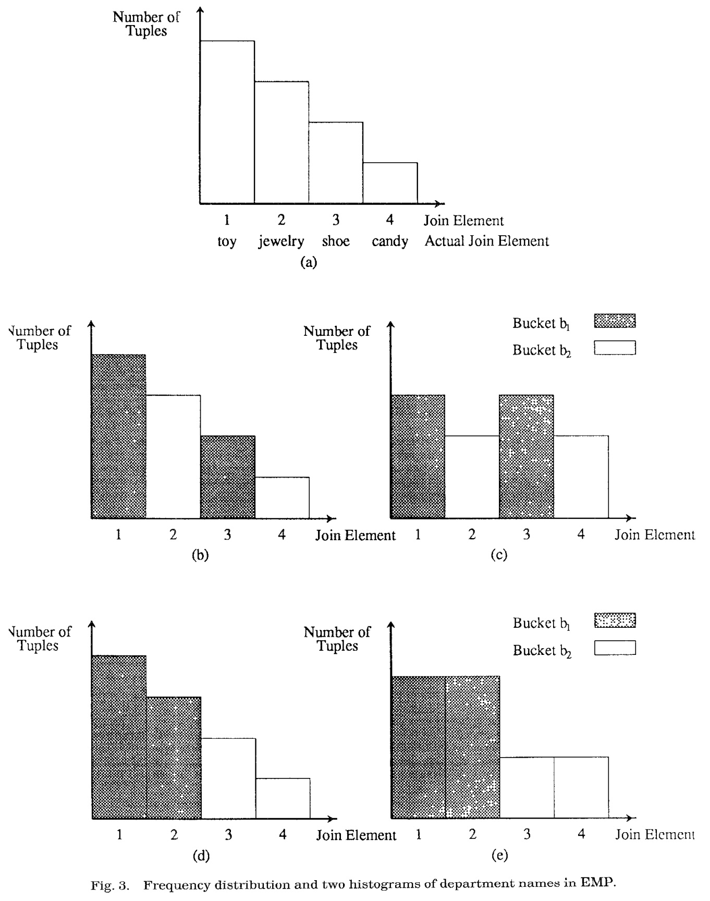

## AI论文解读 | Optimal Histograms For Limiting Worst-Case Error Propagation In The Size Of Join Results
        
### 作者        
digoal        
        
### 日期        
2025-10-12        
        
### 标签        
PostgreSQL , PolarDB , DuckDB , AI , 论文解读        
        
----        
        
## 背景  
      
https://dl.acm.org/doi/pdf/10.1145/169725.169708        
  
提示:          
```          
读懂《Optimal Histograms For Limiting Worst-Case Error Propagation In The Size Of Join Results》这篇论文需要提前掌握哪些基础知识, 请使用中文通熟易懂的讲解这些基础知识, 可以引用论文中的图、表或使用Markdown支持的图形(text,mermaid等)增加解释性. 
  
使用中文通熟易懂的解读《Optimal Histograms For Limiting Worst-Case Error Propagation In The Size Of Join Results》这篇论文, 其中的关键内容请着重讲解, 可以引用论文中的图、表或使用Markdown支持的图形(text,mermaid等)增加解释性. 
  
提取《Optimal Histograms For Limiting Worst-Case Error Propagation In The Size Of Join Results》这篇论文中的重要术语, 使用中文对这些术语进行通熟易懂的讲解, 可以引用论文中的图、表或使用Markdown支持的图形(text,mermaid等)增加解释性. 
```     
  
## 1 前置知识 
  
好的，为了完全理解这篇经典的数据库论文《Optimal Histograms For Limiting Worst-Case Error Propagation In The Size Of Join Results》，你需要掌握一些关于**关系数据库、查询优化、统计信息**以及一个相对冷门的数学分支——**Majorization Theory (主化理论)** 的基础知识。

下面我将用通俗易懂的方式，结合论文中的图表，为你逐一讲解这些必备知识点。

-----

### 1\. 核心数据库概念 (The Basics of Databases)

想象一个数据库就是一堆精心组织的Excel表格。

  * **关系 (Relation)**: 就是一张二维表，比如学生信息表。
  * **属性 (Attribute)**: 就是表中的一列，比如“专业”这一列。
  * **查询 (Query)**: 就是你从这些表中获取数据的请求，最常用的语言是SQL。
  * **连接 (Join)**: 这是理解这篇论文最重要的操作。它用于根据某些共同的列，将两张或多张表合并起来。例如，我们有“学生表”和“选课表”，可以通过“学号”这个共同列将它们连接，从而知道每个学生选了哪些课。




**关键问题**: 连接操作产生的结果表（连接结果）可能非常大，也可能非常小。它的确切大小在执行查询之前是未知的。

### 2\. 问题背景：查询优化的核心——成本估算 (The "Why")

数据库系统里有一个非常聪明的组件叫做**查询优化器 (Query Optimizer)**。当你发送一条SQL查询时，优化器不会马上执行它。它会先生成许多种可能的**执行计划 (Access Plan)**。

  * **执行计划**: 完成一次查询的具体步骤。比如，是先连接学生表和选课表，再筛选“计算机系”的学生？还是先筛选出“计算机系”的学生，再去做连接？

这两种计划的执行效率可能天差地别。优化器的任务就是从众多计划中，选择一个**成本最低**（通常意味着执行最快）的计划。

为了做到这一点，优化器必须能够**估算**每个步骤的成本。而估算成本最关键的一个指标就是：**这个步骤会产生多少条数据？** 尤其是Join操作，其结果集大小的估算（Size Estimation）是重中之重。如果估算不准，优化器很可能会选出一个非常糟糕的执行计划，导致查询慢如蜗牛。

### 3\. 关键工具：直方图 (The "How")

既然要估算，数据库就需要一些关于表中数据分布的**统计信息 (Statistics)**。最常用的统计工具就是**直方图 (Histogram)**。

  * **频率分布 (Frequency Distribution)**: 指一个列中，每个值出现了多少次。例如，“专业”列中，“计算机”出现500次，“物理”出现200次，“化学”出现50次。
  * **直方图**: 它是一种对频率分布的**近似描述**，是一种压缩的统计信息。它不会记录每一个值的频率，而是将所有值分到几个**桶 (Bucket)** 里，然后只记录每个桶的摘要信息（例如，桶内所有值的平均频率）。

**为什么需要直方图？**
因为如果一个列中有上百万个不同的值，为每个值都存储其频率会占用巨大空间。直方图用很少的空间（比如200个桶）就能大致描绘出数据的分布情况。

**直方图带来的问题：误差与误差传播 (Error & Error Propagation)**
直方图是近似的，所以它带来的估算必然存在**误差 (Error)**。

  * **单个操作的误差**: 比如估算`专业='计算机'`的学生有多少，可能会有5%的误差。
  * **误差传播 (Error Propagation)**: 这是论文的核心。当一个查询包含多个Join操作时，第一个Join估算的微小误差，会作为第二个Join的输入，导致误差被放大。以此类推，经过一连串的Join后，最初微不足道的误差可能会被**指数级放大**，最终导致灾难性的估算结果。

论文中的**图2 (Figure 2)** 非常直观地展示了这一点：   

> **图解**:
>
>   * **X轴 (Number of Relations)**: 查询中参与Join的表的数量。数量越多，Join操作就越多。
>   * **Y轴 (Result Size Error)**: 最终结果大小的相对误差。
>   * **曲线**: 你可以看到，随着Join数量的增加，误差呈指数级增长，很快就变得无法接受。

这篇论文的目标就是：**我们应该如何构建直方图（即如何划分桶），才能最大限度地抑制这种最坏情况下的误差传播？**

### 4\. 论文中的特定概念与假设 (The Paper's World)

为了能进行数学分析，论文定义了一些重要的概念和假设：

  * **频率向量 (Frequency Vector)**: 将一个属性所有不同值的频率，从高到低排列，形成一个向量（一串数字）。例如，频率为 `{100, 50, 50, 10}`，排序后就是 `t = <100, 50, 50, 10>`。
  * **t-clique Queries**: 论文将研究范围限定在一种特殊的Join查询上。其核心特征是：**任何一个表在参与多个Join时，总是使用相同的属性进行连接** 。这大大简化了数学模型，使得Join结果集的大小可以直接通过计算频率向量的**内积**得到 。
  * **串行直方图 (Serial Histograms)**: 这是论文提出的一个核心概念。传统的直方图可能按照值的大小来划分桶（比如，年龄0-10岁一个桶，11-20岁一个桶）。而串行直方图是**根据频率高低**来划分桶的 。也就是说，频率最高的几个值在一个桶，频率次之的在另一个桶，以此类推。

论文中的**图3 (Figure 3)** 对比了这两种思路。假设我们按字母序（相当于按值）分的桶是 `(candy, jewelry)` 和 `(shoe, toy)`，这是一种非串行直方图。而如果我们把频率最高的 `toy` 和 `jewelry` 分在一个桶，频率低的 `shoe` 和 `candy` 在另一个桶，这就是串行直方图。    

> **图解**:
>
>   * 图 (a) 是原始的频率分布，按频率从高到低是 `toy, jewelry, shoe, candy`。
>   * 图 (b) 和 (c) 展示了一种**非串行**直方图，桶的划分与频率顺序无关。
>   * 图 (d) 和 (e) 展示了一种**串行**直方图，桶 `{1,2}` 包含了频率最高的两个值，桶 `{3,4}` 包含了频率最低的两个值。

论文的一个关键结论是，**最优的直方图一定是串行直方图** 。

### 5\. 核心数学理论：主化理论 (Majorization Theory)

这是理解论文推导过程最硬核的部分。主化理论是数学中用来比较向量“离散程度”或“不均匀度”的工具。

**定义 (Definition 2.1)** 
假设有两个长度相同的向量 `a` 和 `b`，并且它们的元素都已经从大到小排好序。如果满足以下两个条件，我们就说 **`a` 主化 (majorizes) `b`**，记作 `a ≻ b`。

1.  对于任意的 `k` (从1到向量长度减1)，`a` 的前 `k` 个元素之和 **大于等于** `b` 的前 `k` 个元素之和。
2.  `a` 和 `b` 的所有元素之和 **完全相等**。

**通俗理解**: 如果 `a` 主化 `b`，意味着向量 `a` 的“贫富差距”更大，分布更不均匀；而向量 `b` 则更“平均”，分布更均匀。

  * **例子**:
      * `a = <10, 1, 1>` (总和12)
      * `b = <4, 4, 4>` (总和12)
      * 前1项和: `10 > 4`
      * 前2项和: `10+1 > 4+4`
      * 总和: `12 = 12`
      * 所以，`a` 主化 `b`。你可以看到 `a` 的分布非常极端，而 `b` 是完全均匀的。

**主化理论如何应用于论文？**

1.  **关键定理 (Theorem 2.1)**: 如果 `a` 主化 `b`，并且有一个单调递减的向量 `x`，那么它们的内积满足 `a * x ≥ b * x`。
2.  **与直方图的联系**: 论文证明了，一个**真实的频率向量 `t`** (排序后) **总是主化**它对应的**任何一种直方图的频率向量 `t^e`** 。这是因为直方图在桶内做了“平均化”，使得其分布变得更均匀。
3.  **与误差的联系**: Join大小的计算是内积。因此，真实的Join大小（用 `t` 计算）会大于等于用直方图估算的Join大小（用 `t^e` 计算）。为了让误差最小，我们希望估算值 $S^e$ 尽可能地大，从而逼近真实值 $S$ 。这意味着我们需要寻找一种直方图，它所对应的频率向量 `t^e` 被真实向量 `t` 主化的“程度”最弱，即 `t^e` 本身尽可能地“不均匀”。

### 总结

掌握了以上知识，你就可以这样来理解这篇论文的整体思路了：

1.  **目标**: 减少多表Join查询中结果集大小估算的**最坏情况误差**。
2.  **问题**: 误差会随着Join数量的增加而**指数级传播**。
3.  **工具**: 使用**直方图**来近似数据的真实频率分布。
4.  **切入点**: 我们应该如何设计直方图（划分桶），才能得到最优的估算？
5.  **核心论点**:
      * 通过限定研究对象为 **t-clique** 查询，将Join大小的计算简化为频率向量的**内积**。
      * 运用**主化理论**这个数学工具，证明了**真实的频率向量**总是**主化**其**直方图向量**。
      * 推导出最优的直方图必须是**串行直方图**，因为它最大限度地保留了原始数据频率的“不均匀性”。
      * 最终，论文根据Join数量的多少（2-way join vs. very large join），给出了构建具体最优串行直方图的数学标准和建议 。

希望这份详细的讲解能帮助你扫清阅读这篇论文的障碍！
  
## 2 解读论文 
  
好的，這就為您通俗易懂地解讀這篇經典論文《Optimal Histograms For Limiting Worst-Case Error Propagation In The Size Of Join Results》。

這篇由 Yannis E. Ioannidis 和 Stavros Christodoulakis 撰寫的論文，主要探討了在數據庫系統中，如何構建最優的**直方圖 (Histograms)**，以最大程度地減少在估算**連接 (Join)** 操作結果大小時的**最壞情況錯誤 (Worst-Case Error)**。

-----

### **核心問題：為什麼估算會出錯，而且錯得離譜？**

想像一下，數據庫的查詢優化器就像一個城市的交通規劃師。在決定最佳行車路線（查詢計劃）之前，它需要估算每條道路的車流量（中間結果集的大小）。如果一開始對某個路口的車流量估算有微小偏差，經過一連串的路口後，這個偏差可能會被急遽放大，導致最終的交通流量預測與實際情況大相逕庭，從而做出錯誤的路線規劃。

在數據庫中，這種現象被稱為**錯誤傳播 (Error Propagation)** 。數據庫系統通常使用**直方圖**來近似地存儲數據的分佈信息 。然而，直方圖本身就是一種近似，存在固有誤差 。當查詢變得複雜，尤其是涉及多次連接（Join）操作時，初始的微小誤差會像雪球一樣越滾越大，呈指數級增長 ，最終可能導致查詢優化器選擇一個極其低效的查詢執行計劃。

論文中的 **圖 2** 非常直觀地展示了這個問題。它顯示了在一個假設的數據分佈（Zipf 分佈）下，隨著連接的關係數量（橫軸）增加，估算結果大小的相對誤差（縱軸）是如何爆炸性增長的。即使數據分佈的偏離度（由參數 `z` 控制）很小，誤差也會迅速變得無法容忍 。

  

*圖 2 解讀：展示了隨著查詢中關係數量的增加，結果大小的估算誤差呈指數級增長。* 

-----

### **論文的目標和研究範圍**

為了應對這個嚴峻的挑戰，作者們的目標是找到一種構建直方圖的方法，使得在**最壞情況**下，連接結果大小的估算誤差最小。

他們將研究範圍聚焦在一類特定的查詢上，稱為 **t-clique 查詢** 。這類查詢有兩個主要特點：

1.  所有連接都是**等值連接**（例如 `R1.a = R2.a`），且不含函數 。
2.  每個關係在所有其參與的連接中，都使用**相同的屬性** 。

這個限制聽起來可能有些嚴格，但它涵蓋了所有兩路連接查詢（2-way join）以及許多常見的多路連接場景 。

-----

### **關鍵概念：直方圖的類型**

在深入探討最優化方案之前，我們需要理解論文中定義的幾種關鍵的直方圖類型。構建直方圖的核心是將屬性值（更準確地說是它們的**頻率**）分組到不同的**桶 (buckets)** 中 。

論文提出，為了找到最優直方圖，我們不應該按照屬性值的自然順序（如字母或數字大小）來分桶，而應該**根據值的出現頻率**來排序和分桶 。

**1. 串行直方圖 (Serial Histograms)**
這是一個核心概念。如果一個直方圖的所有桶都可以按照其包含的數據頻率“一字排開”，即一個桶裡所有值的頻率都高於（或低於）下一個桶裡所有值的頻率，那麼它就是串行的 。

  * **非串行 (Nonserial)**：桶內值的頻率是混雜的。例如，桶 A 包含頻率為 {100, 10} 的值，桶 B 包含頻率為 {50, 5} 的值。
  * **串行 (Serial)**：桶內值的頻率是連續的。例如，桶 A 包含頻率為 {100, 50} 的值，桶 B 包含頻率為 {10, 5} 的值。

**圖 3** 中的 (d) 和 (e) 展示了一個串行直方圖，其中桶 `b1` 包含頻率最高的兩個值（toy, jewelry），而桶 `b2` 包含頻率較低的兩個值（shoe, candy） 。

  

*圖 3 解讀：(a) 原始的按頻率排序的分佈。 (b)(c) 一個非串行直方圖。 (d)(e) 一個串行直方圖。* 

**2. 端點偏置直方圖 (End-Biased Histograms)**
這是串行直方圖的一個重要子類 。它的大部分桶都是**單值桶 (univalued buckets)**，每個桶只包含一個頻率值，從而精確記錄該頻率 。剩下所有其他頻率的值則被放入一個大的**多值桶 (multivalued bucket)** 中 。

  * **高偏置 (High-Biased)**: 精確記錄**頻率最高**的幾個值 。
  * **低偏置 (Low-Biased)**: 精確記錄**頻率最低**的幾個值 。

-----

### **核心結論：如何選擇最優的直方圖？**

論文通過嚴謹的數學推導（主要使用了**馬氏不等式理論 (Majorization Theory)** ），得出了一系列深刻的結論。

**結論一：最優直方圖一定是串行的 (Theorem 4.2)**
這是論文的基石。作者證明，對於任意一個非串行直方圖，總能找到一個與之對應的串行直方圖，其估算結果比前者更接近（或等於）真實的最大值 。這意味著，在尋找最優直方圖時，我們只需要在**串行直方圖**的範圍內尋找即可，大大縮小了搜索空間 。

**表 II** 的實驗數據也支持了這一點。在一個兩路連接查詢中，串行直方圖的誤差 (1.10%) 遠遠小於非串行直方圖 (4.60%) 和傳統的均勻分佈假設（Trivial, 4.64%） 。

| Histogram | Error |
| :--- | :--- |
| Trivial | 4.64% |
| Nonserial | 4.60% |
| **Serial** | **1.10%** |
| High-biased | 2.15% |
*表 II 解讀：串行直方圖在減少誤差方面表現出色。* 

**結論二：對於“小查詢”（例如兩路連接），最優選擇取決於數據分佈**
對於連接數量較少的查詢，應該優先記錄 **更稀有（rarer）** 的頻率 。

  * 如果數據分佈中，高頻值很少，大部分是低頻值（像 Zipf 分佈），那麼這些**高頻值**就是“稀有”的，應該被精確記錄。
  * 反之，如果大部分值都是高頻的，只有少數是低頻的，那麼這些**低頻值**反而更“稀有”，更具信息量，應該被優先記錄 。

論文給出了一個判斷準則（**Theorem 5.4**），幫助我們決定是應該構建高偏置還是低偏置的直方圖 。

**結論三：對於“大查詢”（多路連接），高偏置直方圖是漸進最優的 (Theorem 6.1)**
隨著查詢中連接的關係數量趨於無窮大，**高頻值**在決定最終結果大小時的主導作用會越來越強 。因此，在這種情況下，**高偏置直方圖 (High-biased histograms)** 總是最佳選擇 。

**表 IV** 的數據驗證了這一點。當查詢從兩路連接變為五路連接時，高偏置直方圖的誤差 (16.43%) 已經優於了普通的串行直方圖 (25.00%) 。

| Histogram | Error |
| :--- | :--- |
| Trivial | 79.42% |
| Nonserial | 78.79% |
| Serial | 25.00% |
| **High-biased** | **16.43%** |
*表 IV 解讀：對於更複雜的查詢，高偏置直方圖的優勢凸顯。* 

-----

### **實踐建議和總結**

綜合以上理論，論文為數據庫管理員提供了非常實用的建議：

1.  **首選串行直方圖**：構建直方圖時，應始終根據數據的**頻率**進行排序和分桶，而不是值的自然順序 。
2.  **優先考慮高頻值**：在大多數現實世界的數據分佈中（如 Zipf 分佈），高頻值往往更“稀有”且對結果影響更大。因此，一個穩妥的通用策略是使用**高偏置直方圖**，即用單獨的桶精確記錄那些出現頻率最高的值 。
3.  **權衡與取捨**：對於一個需要應對各種規模查詢的通用數據庫系統，最佳實踐是主要採用高偏置策略，同時可以為剩餘的中低頻值構建一些桶，以兼顧小型查詢的準確性 。

總而言之，這篇論文不僅深刻地揭示了數據庫查詢優化中錯誤傳播的嚴重性，更通過嚴謹的數學證明和實驗，為如何設計和選擇直方圖以抑制這種誤差提供了清晰、有效的指導，對後來的數據庫系統設計產生了深遠的影響。
  
## 3 术语 
  
您好！我已经提取了您提供的论文《Optimal Histograms For Limiting Worst-Case Error Propagation In The Size Of Join Results》中的重要术语，并用通俗易懂的中文进行了解释和阐述。

---

## 论文重要术语及其解释

### 1. 直方图 (Histograms)

* **定义 (Definition):** 直方图是数据库系统中常用的统计信息类型，用于**近似**关系（表）中某个属性值频率分布的方法 。
* **通俗解释:** 想象一个数据库表格，比如员工的“部门”属性。直方图就是将“部门”这个属性的所有值（例如：'销售', '研发', '行政'）分成若干个 **桶（Buckets）** 。对于每个桶，系统只记录一些**聚合信息**，例如该桶中包含多少条记录（元组） 。
* **用途:** 数据库查询优化器使用这些近似信息来**估计查询结果的大小**和**评估访问计划的成本** 。

### 2. 最坏情况误差传播 (Worst-Case Error Propagation)

* **定义 (Definition):** 错误传播是指原始数据库统计信息（如直方图）中的**错误**，对后续导出的估计值（如复杂的查询结果大小估计）产生**传递性影响**的现象 。
* **通俗解释:** 在处理多表连接（Multi-Join）等复杂查询时，优化器需要先估计中间结果的大小，然后用这个估计值去估计后续操作的结果。如果最初的直方图统计信息存在微小错误，这些错误会在一系列操作中像滚雪球一样**指数级增长**（指数级传播），最终导致对整个查询结果大小的估计产生**巨大偏差**，甚至使优化器做出错误的决策 。本文的目标就是找到最优直方图来**限制这种最坏情况下的误差** 。
* **图示说明 (以连接数 $N$ 为变量的指数级误差增长):** 论文中的图 2 显示了相对误差 ( $D$ ) 随关系数量（ Join 次数 $N$ ）的增加而**指数级**增长（在 Zipf 分布和均匀近似假设下），验证了这一现象 。   

### 3. t-clique 查询 (t-clique Queries)

* **定义 (Definition):** 一种受限制的等值连接查询类型，需满足两个假设:
    * (A1) 必须是**等值连接**（Equality Join），且**不含函数符号**。
    * (A2) **每个关系（表）参与的所有连接，都基于完全相同的属性集**。
* **通俗解释:** 这是一种结构严格的多表连接查询。例如，表 $R_0$ 和 $R_1$ 在属性 `a` 上连接，同时 $R_0$ 和 $R_2$ 也必须在属性 `a` 上连接。如果 $R_0$ 和 $R_1$ 在 `a` 上连接，而 $R_0$ 和 $R_2$ 在 `b` 上连接，那就**不是**t-clique 查询 。
* **重要性:** 本文的研究聚焦于这类查询，并证明了**最优直方图**对于这类查询总是**串行的** 。

### 4. 串行直方图 (Serial Histograms)

* **定义 (Definition):** 在构造直方图前，首先需要将属性值按**频率高低进行排序**。如果一个直方图的所有桶 (buckets) 都是由**频率上连续**的一组属性值组成的，那么它就是一个串行直方图 。
* **通俗解释:** 串行直方图的构建原则是 **“物以类聚”** ：它将频率相近的属性值归入同一个桶中 。例如，频率排名前 100 的值分到一个桶，排名 101 到 200 的值分到另一个桶，以此类推。
* **核心结论:** 论文证明，对于减少 t-clique 查询**最坏情况误差**而言，**最优直方图总是串行的** 。

### 5. 端偏置直方图 (End-Biased Histograms)

* **定义 (Definition):** 串行直方图的一个子类。它包含 $L$ 个**单值桶 (univalued buckets)** 和一个**多值桶 (multivalued bucket)** 。
    * **单值桶 (Univalued Bucket):** 桶内的所有属性值频率都**相等**。对于这些值，直方图能**准确**记录它们的频率 。
    * **多值桶 (Multivalued Bucket):** 桶内的属性值频率**不全相等** 。
    * **端偏置特性:** $L$ 个单值桶对应于**最高**的 $L_1$ 种不同频率，以及**最低**的 $L_2$ 种不同频率（ 其中 $L = L_1 + L_2$ ) 。
* **通俗解释:** 端偏置直方图是一种特殊的、**不均匀**的抽样方法。它选择性地**精确记录**那些**非常高**和/或**非常低**的频率，而将剩下的频率值打包到一个大桶中，用一个平均值来近似表示 。
* **重要子类:**
    * **高偏置直方图 (High-Biased Histograms):** $L$ 个单值桶全部用于**最高的 $L$ 种**频率值 ( $L_1 = L, L_2 = 0$ ) 。这种直方图在某些商业系统中有所应用 。
    * **低偏置直方图 (Low-Biased Histograms):** $L$ 个单值桶全部用于**最低的 $L$ 种**频率值 ( $L_1 = 0, L_2 = L$ ) 。
* **核心结论 (针对大型查询):** 对于**连接数非常多**（趋于无穷大）的 t-clique 查询，**高偏置直方图**总是渐近最优的 。

### 6. **向量优超理论** (Vector Majorization Theory)

* **定义 (Definition):** 优超 (Majorization) 是一种数学工具，用于比较两个具有相同分量总和的非负向量的“分散程度” 。
    * 向量 $\underline{a}$ **优超** $\underline{b}$ ( $\underline{a} \succ \underline{b}$ )，当它们的元素按非增序排列时：
        1.  前 $K$ 个元素的和，对于 $\underline{a}$ 来说**大于或等于** $\underline{b}$ 的和（ $K < M$ ） 。
        2.  所有元素的总和**相等**（ $\sum a_i = \sum b_i$ ） 。
* **通俗解释:** 如果一个向量 $\underline{a}$ 优超另一个向量 $\underline{b}$ ，则 $\underline{a}$ 的元素分布比 $\underline{b}$ **更不均匀、更集中**（即“更尖锐”）。例如： $\underline{a} = \langle 10, 5, 1 \rangle$ 优超 $\underline{b} = \langle 6, 6, 4 \rangle$ （总和都是 16）。
* **在论文中的应用:**
    * **结果大小最大化:** 论文利用优超理论证明：在频率集合（Multiset）给定的情况下，连接查询结果的大小在频率向量按**非增序**（从大到小）排列时达到**最大值** 。这个最大值对应的频率分布，正是**最坏情况误差**出现时的频率分布 。
    * **最优性证明:** 优超理论是证明**串行直方图**最优性的关键数学工具 。
  
## 参考        
         
https://dl.acm.org/doi/pdf/10.1145/169725.169708    
        
<b> 以上内容基于DeepSeek、Qwen、Gemini及诸多AI生成, 轻微人工调整, 感谢杭州深度求索人工智能、阿里云、Google等公司. </b>        
        
<b> AI 生成的内容请自行辨别正确性, 当然也多了些许踩坑的乐趣, 毕竟冒险是每个男人的天性.  </b>        
  
    
#### [期望 PostgreSQL|开源PolarDB 增加什么功能?](https://github.com/digoal/blog/issues/76 "269ac3d1c492e938c0191101c7238216")
  
  
#### [PolarDB 开源数据库](https://openpolardb.com/home "57258f76c37864c6e6d23383d05714ea")
  
  
#### [PolarDB 学习图谱](https://www.aliyun.com/database/openpolardb/activity "8642f60e04ed0c814bf9cb9677976bd4")
  
  
#### [PostgreSQL 解决方案集合](../201706/20170601_02.md "40cff096e9ed7122c512b35d8561d9c8")
  
  
#### [德哥 / digoal's Github - 公益是一辈子的事.](https://github.com/digoal/blog/blob/master/README.md "22709685feb7cab07d30f30387f0a9ae")
  
  
#### [About 德哥](https://github.com/digoal/blog/blob/master/me/readme.md "a37735981e7704886ffd590565582dd0")
  
  

  
