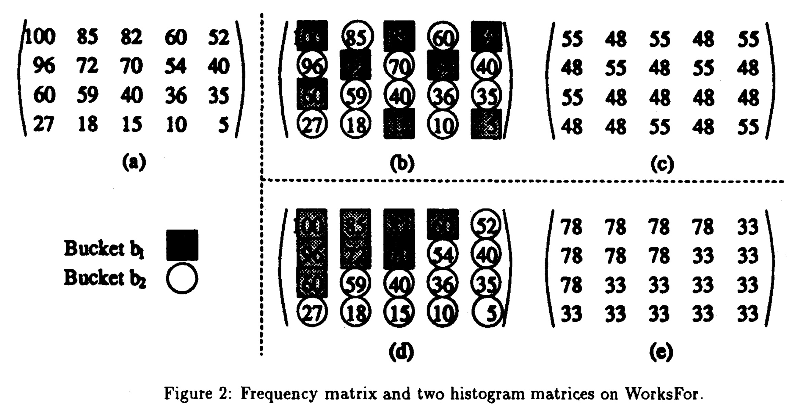

## AI论文解读 | Universality Of Serial Histograms
        
### 作者        
digoal        
        
### 日期        
2025-10-13        
        
### 标签        
PostgreSQL , PolarDB , DuckDB , AI , 论文解读        
        
----        
        
## 背景  
      
https://www.vldb.org/conf/1993/P256.PDF        
  
提示:          
```          
读懂《Universality Of Serial Histograms》这篇论文需要提前掌握哪些基础知识, 请使用中文通熟易懂的讲解这些基础知识, 可以引用论文中的图、表或使用Markdown支持的图形(text,mermaid等)增加解释性. 
  
使用中文通熟易懂的解读《Universality Of Serial Histograms》这篇论文, 其中的关键内容请着重讲解, 可以引用论文中的图、表或使用Markdown支持的图形(text,mermaid等)增加解释性. 
  
提取《Universality Of Serial Histograms》这篇论文中的重要术语, 使用中文对这些术语进行通熟易懂的讲解, 可以引用论文中的图、表或使用Markdown支持的图形(text,mermaid等)增加解释性. 
```     
  
## 1 前置知识 
  
好的，为了完全理解《Universality of Serial Histograms》这篇论文，您需要掌握以下几个核心的基础知识。这篇论文的最终目的是证明一种名为“串行直方图”（Serial Histogram）的统计工具，在某些极端情况下，对于数据库查询优化是“最优”的。

下面我将为您通俗地讲解这些必备知识，并引用论文中的图表来帮助理解。

### 1\. 基础背景：数据库查询优化 (The "Why")

想象一下，你向数据库发出一个指令，比如“找出所有在‘玩具’部门工作，并且在1990年之后入职的员工”。数据库接收到这个指令后，它可能会有多种方式来查找数据：

  * **方案A：** 先找到所有在“玩具”部门工作的员工（可能几千人），然后再从这些人里筛选1990年后入职的。
  * **方案B：** 先找到所有1990年后入职的员工（可能几万人），然后再从这些人里筛选在“玩具”部门工作的。

哪个方案更快？这取决于中间步骤产生的数据量大小。如果“玩具”部门只有3个员工，那么方案A显然更好。如果1990年后入职的员工只有10个，那么方案B可能更优。

**查询优化器（Query Optimizer）** 就是数据库的“大脑”，它的工作就是预测不同执行方案的成本（主要是计算量和数据读写量），然后选择成本最低的那个方案 。为了做出准确的预测，优化器需要知道数据是怎么分布的。例如，它需要估算“‘玩具’部门的员工有多少？”这个问题的答案。

这就是**直方图（Histogram）** 发挥作用的地方。

### 2\. 核心工具：直方图 (The "What")

#### a. 什么是直方图？

在数据库中，直方图是一种**数据分布的摘要信息** 。由于完整地记录每个值的精确数量太占空间，数据库会使用直方图来近似地描述数据分布。

它的原理很简单：将所有可能的数据值分成若干个“桶”（buckets），然后只记录每个“桶”里的平均信息 。当需要估算某个范围内的数据量时，优化器就去查这个直方图。

#### b. 论文的关键概念：串行直方图 (Serial Histogram)

这篇论文的核心是定义并证明一种特殊的直方图——**串行直方图**——的优越性。

  * **普通（非串行）直方图**：可以随意地将数据点分到不同的桶里。
  * **串行直方图**：要求分桶必须依据数据值的**频率**（即出现次数）高低来划分。所有频率相近的值会被分到同一个桶里，不会出现一个桶里既有高频值又有低频值的情况 。

让我们用论文中的**图2**来直观理解一下：    

```text
图2(a): 原始的频率矩阵 (数值代表出现次数)
| 100 | 85 | 82 | 60 | 52 |
| 96  | 72 | 70 | 54 | 40 |
| 60  | 59 | 40 | 36 | 35 |
| 27  | 18 | 15 | 10 | 5  |
```

  * **非串行直方图 (图2(b))**:

      * 这个直方图创建了两个桶，用方块和圆圈表示。
      * 你可以看到，方块桶（Bucket b1）里的值有`96, 60, 27`等，圆圈桶（Bucket b2）里的值有`85, 70, 59, 18`等。
      * 这种分桶方式是“跳跃的”，高频和低频的值混杂在同一个桶内。例如，圆圈桶里既有频率高达`85`的值，也有频率只有`10`的值 。

  * **串行直方图 (图2(d))**:

      * 这个直方图也创建了两个桶。
      * 但是，方块桶（Bucket b1）包含了所有频率从`59`到`100`的高频值。
      * 圆圈桶（Bucket b2）包含了所有频率从`5`到`54`的低频值。
      * 分界线非常清晰：**所有在一个桶里的值的频率，要么都大于（或等于）另一个桶里的所有值的频率，要么都小于（或等于）** 。这就是“串行”的含义，它根据频率大小“排着队”进行划分 。

论文的主要工作就是证明，在估算查询结果集的**最大**或**最小**可能规模时，图2(d)这种**串行直方图**的估算误差是最小的 。

### 3\. 数学建模：频率矩阵与查询规模计算 (The "How")

为了能用数学方法证明这一点，论文将问题进行了抽象。

#### a. 频率矩阵 (Frequency Matrix)

论文使用**频率矩阵**来表示两个关联属性的数据分布 。以上文的图2(a)为例，行可以代表“部门”（dname），列可以代表“入职年份”（year）。矩阵中的数字 $t_{kl}$ 就代表“在第k个部门，且在第l年入职”的员工具体有多少人 。   

  * $T_0$ : 第一个关系（表）的频率矩阵（通常是一个行向量）
  * $T_1$ : 第二个关系（表）的频率矩阵
  * ...
  * $T_N$ : 最后一个关系（表）的频率矩阵（通常是一个列向量）

#### b. 查询结果集大小的计算

对于一个链式的连接查询（例如`R₀ JOIN R₁ JOIN R₂ ... JOIN Rₙ`），论文建立了一个非常关键的数学模型：

**查询结果集的大小 S = $T_0 T_1 \cdots T_N$** 

也就是说，**最终查询返回的总行数，等于所有参与连接的表的频率矩阵的乘积**。这个公式是整篇论文进行数学推导的基石。

有了这个模型，“如何减少查询结果规模的估算误差”这个问题，就转化为了一个纯数学问题：“**如何让近似矩阵（由直方图生成）的乘积，最接近原始矩阵的乘积**”。

### 4\. 核心数学理论：Majorization (The "Secret Sauce")

这是理解这篇论文证明过程最关键，也是最抽象的一个部分。**Majorization（优超或控制）理论**是用来比较两个向量（或矩阵）“不均匀程度”或“离散程度”的数学工具 。

#### a. 什么是 Majorization？

假设有两个长度相同、所有元素之和也相同的向量 **a** 和 **b**。如果向量 **a** 的元素分布比 **b** 更“极端”或“不均匀”，我们就说 **a** majorizes **b** (记作 **a** \> **b**) 。

**通俗理解**：
想象有同样多的钱分给同样多的人。

  * 向量 **a** = (100, 0, 0)：极度不均，一个人拿了所有钱。
  * 向量 **b** = (50, 50, 0)：比较不均，两个人平分了钱。
  * 向量 **c** = (33.3, 33.3, 33.3)：完全平均。

这里，**a** majorizes **b**，**b** majorizes **c**。

**数学定义**：
要判断 **a** \> **b**，需要先将两个向量从大到小排序。然后，检查它们的前k个元素的部分和。如果对于所有的k，**a** 的部分和都大于等于 **b** 的部分和，那么 **a** \> **b** 。

  * 例如，向量 $\underline{a} = (10, 5, 1)$ 和 $\underline{b} = (6, 6, 4)$ 。
      * 总和都是 16。
      * 部分和比较：
          * k=1: $10 \ge 6$
          * k=2: $10+5 \ge 6+6 \implies 15 \ge 12$
          * k=3: $10+5+1 = 6+6+4 \implies 16 = 16$
      * 所有条件都满足，所以向量 $\underline{a}$ majorizes 向量 $\underline{b}$ 。

#### b. Majorization 和论文有什么关系？

论文巧妙地利用了 Majorization 理论的两个关键特性：

1.  **最大化矩阵乘积**：当一系列矩阵的元素按“非递增”（从大到小）顺序排列时，它们的乘积（也就是查询结果集的大小）会达到**最大值** 。这种非递增排列的矩阵，在 Majorization 意义上是最“不均匀”的。
2.  **串行直方图与Majorization**：论文证明，由**串行直方图**生成的近似频率矩阵，总是 majorizes 由**非串行直方图**生成的近似矩阵 。这意味着串行直方图更好地保留了原始数据“不均匀”的特性。

**结论**：当真实数据分布很不均匀（导致查询结果集规模巨大）时，串行直方图由于最能保持这种“不均匀”的特性，其估算结果也最接近真实的最大值，因此它的误差是最小的。这就证明了它在极端情况下的“普适性”或“最优性”。

### 总结

要读懂这篇论文，你需要按以下顺序理解几个环环相扣的概念：

1.  **背景**：数据库的**查询优化器**需要估算中间结果的大小来选择最佳执行路径。
2.  **工具**：**直方图**是用来进行这种估算的统计摘要。论文提出了一种特殊的**串行直方图**，它按频率高低来划分数据桶。
3.  **建模**：查询的最终结果行数可以通过参与表的**频率矩阵**相乘得到。
4.  **理论**：**Majorization理论**是一个衡量向量/矩阵“不均匀度”的数学工具。串行直方图能更好地保持数据的不均匀性。

将这四点串联起来，你就能理解论文的核心论证：通过运用 Majorization 理论分析频率矩阵的乘积，可以证明串行直方图在最大化/最小化查询结果规模的场景下，是一种最优的估算工具。
  
## 2 解读论文 
  
好的，这篇名为《Universality of Serial Histograms》（串行直方图的普适性）的论文，核心思想是为数据库系统中的一个经典难题——“如何准确估算查询结果的大小”——提供了一个强有力的解决方案。

下面我将为您通俗地解读这篇论文的关键内容。

### 核心问题：为何需要估算查询结果？

在数据库中，当您执行一个复杂的查询（例如，关联多张大表）时，查询优化器会制定多种执行计划 。为了选出最高效的计划，优化器必须估算每个步骤会产生多少数据 。**直方图 (Histograms)** 正是数据库用来近似描述数据分布、从而进行估算的一种常用统计工具 。如果估算不准，优化器就可能选错执行计划，导致查询性能急剧下降 。

这篇论文研究的核心问题是：**在所有类型的直方图中，哪一种对于减小查询结果的估算误差是“最优”的？**

### 关键概念一：什么是串行直方图 (Serial Histogram)？

直方图通过将数据值分到不同的“桶 (buckets)”中来工作，并假设每个桶内的数据是均匀分布的 。论文定义了一种特殊的直方图，名为 **串行直方图**。

**串行直方图** 的关键特征是：它根据数据值的**出现频率（频数）** 从高到低进行分桶 。所有频率相近的值会被划分到同一个桶中 。

让我们通过论文中的 **图2** 来直观理解“串行”与“非串行”的区别。   

**图2(a) - 原始数据频率矩阵**
假设这是一个记录员工信息的频率矩阵，数值代表拥有该属性组合的元组（或记录）数量。数值越大，代表频率越高。

```text
      (a) 原始频率
| 100 | 85 | 82 | 60 | 52 |
| 96  | 72 | 70 | 54 | 40 |
| 60  | 59 | 40 | 36 | 35 |
| 27  | 18 | 15 | 10 | 5  |
```

  * **非串行直方图 (Non-Serial) - 图2(b)和(c)**

      * 这种直方图随意地将数据点分入不同的桶中（用方块和圆圈区分） 。
      * 您可以看到，方块桶和圆圈桶中的值在频率上是相互交错的 。例如，圆圈桶中既有频率为 `85` 的高频值，也有频率为 `10` 的低频值。
      * 图2(c)显示了估算结果：每个桶内的所有值都被替换为该桶内所有原始值的平均数 。

  * **串行直方图 (Serial) - 图2(d)和(e)**

      * 这种直方图严格按照频率高低来划分 。
      * 方块桶包含了所有频率最高的连续一部分值 (例如从100到59)。
      * 圆圈桶则包含了剩下所有频率较低的值 (例如从54到5)。
      * **关键区别**：任意一个桶中的所有值的频率，要么全部高于，要么全部低于另一个桶中所有值的频率 。这就像是把所有频率值从高到低排队，然后在队伍中切几刀来分桶，因此称为“串行”。
      * 图2(e)是它对应的估算结果矩阵 。

论文认为，这种按频率排序划分的**串行直方图**，在理论上具有无可比拟的优越性。

### 关键内容二：数学建模与核心结论

为了证明串行直方图的优越性，论文建立了一套数学模型。

1.  **频率矩阵 (Frequency Matrix)**：论文使用矩阵来表示一个关系（表）中两个连接属性的数据分布 。矩阵中的每个元素 $t_{kl}$ 代表拥有特定属性值组合的元组数量 。

2.  **查询结果大小的计算**：对于一个形如 $R_0$ JOIN $R_1$ JOIN ... JOIN $R_N$ 的查询，其结果集的大小 $S$ 可以通过这些表的频率矩阵相乘得到 。
    $$S = \underline{T}_{0}\underline{T}_{1}\cdot\cdot\cdot T_{N} \text{}$$
    这个公式是整篇论文分析的基础。它将一个数据库问题转化成了一个线性代数问题。

#### 核心结论：串行直方图在“极端情况”下最优

论文的核心贡献在于证明了以下几点：

  * **对于最大化查询结果的场景**：当数据的实际分布使得查询结果数量达到**最大值**时（通常是高频值与高频值对齐连接的情况 ），**串行直方图**在估算这个最大值时产生的误差是最小的 。这个结论无论“属性独立性假设”是否成立，都是正确的 。

  * **对于最小化查询结果的场景**：当数据的实际分布使得查询结果数量达到**最小值**时（通常是高频值与低频值对齐连接的情况 ），并且“属性独立性假设”成立时，**串行直方图**同样是最优的 。

  * **“属性独立性假设”下的情况**：在数据库中，系统常常假设一张表中的不同属性的取值是相互独立的 。在这种假设下，二维的频率矩阵可以分解为两个一维向量的乘积 。这使得多路连接查询的估算问题，可以分解为多个独立的两路连接估算问题 。论文证明，在这种简化模型下，串行直方图依然是最优的 。

#### 为何关注“极端情况”？

您可能会问，为什么只关心最大和最小这两种极端情况？论文在第6节给出了一个深刻的答案：

  * **所有直方图的“期望误差”都为零**：如果考虑所有可能的数据排列组合，计算出的查询结果大小的期望值（即平均值），任何一种直方图（无论串行还是非串行）给出的估算期望值都是完全准确的 。这意味着，试图通过优化“平均情况下的误差”来选择直方图是**毫无意义的** 。
  * 因此，我们唯一能做的，就是选择那种能够有效控制 **最坏情况（极端情况）** 下误差的直方图，避免灾难性的估算错误 。

### 论文的实践意义和总结

这篇论文的结论非常清晰且具有很强的实践指导意义：

1.  **普适的最优选择**：对于树形的等值连接查询，**串行直方图**是一种“普适”的最优选择，因为它能在最坏情况下将估算误差降至最低 。
2.  **构建直方图的新思路**：传统上，直方图常常根据属性值的自然顺序（例如，年龄从小到大）来分桶 。这篇论文颠覆了这种思路，指出应该根据**频率的接近程度**来分桶，这才是减小连接查询误差的关键 。

**总而言之，《Universality of Serial Histograms》通过严谨的数学推导（主要运用了Majorization理论），证明了串行直方图在控制查询规模估算的最坏误差方面具有普适的优越性，并论证了为何优化目标应该聚焦于极端情况而非平均情况，为现代数据库查询优化器的设计提供了重要的理论依据。**
  
## 3 术语 
  
好的，以下是对《Universality of Serial Histograms》这篇论文中关键术语的中文解读，旨在帮助您更轻松地理解其核心概念。

### 1\. 直方图 (Histogram)

  * **讲解**:
    直方图是数据库系统用来近似描述数据分布的一种常用统计工具 。由于精确存储每个数据值出现了多少次会占用大量空间，系统便采用直方图作为一种摘要信息 。它的工作原理是将数据值范围划分成若干个“桶”（buckets），并假设每个桶内的数据是均匀分布的 。当查询优化器需要估算某个查询会返回多少行数据时，它就会查询这个直方图来获得一个快速的近似值 。

### 2\. 串行直方图 (Serial Histogram)

  * **讲解**:
    这是整篇论文的核心概念。串行直方图是一种特殊的直方图，它划分“桶”的依据不是数据值的自然大小（如年龄、薪水），而是这些数据值出现的**频率（频数）** 。简单来说，就是将出现次数相近的值分到同一个桶里 。

  * **图解 (引用论文图2)**:
    下图清晰地展示了“串行”与“非串行”的区别。图(a)是原始的频率数据。   

    ```text
          (a) 原始频率矩阵
    | 100 | 85 | 82 | 60 | 52 |
    | 96  | 72 | 70 | 54 | 40 |
    | 60  | 59 | 40 | 36 | 35 |
    | 27  | 18 | 15 | 10 | 5  |
    ```

      * **非串行直方图 (图2b)**：桶内频率交叉。例如，圆圈桶里既有高频的 `85`，也有中频的 `59` 和低频的 `10` 。这种分桶方式是杂乱的。
      * **串行直方图 (图2d)**：严格按频率高低分桶。方块桶包含了所有频率从 `100` 到 `59` 的高频值，而圆圈桶则包含了所有剩下从 `54` 到 `5` 的低频值 。这种划分方式保证了一个桶里的所有值的频率，要么都高于，要么都低于另一个桶里的所有值 。

    论文的核心就是证明，图(d)这种串行直方图在估算极端查询结果时误差最小 。

### 3\. 频率矩阵 (Frequency Matrix)

  * **讲解**:
    频率矩阵是论文用来进行数学分析的基础模型。它是一个二维矩阵，用于表示一个关系（数据表）中参与连接的两个属性的数据分布情况 。矩阵中的每一个元素 $t_{kl}$ 的值，代表了拥有第 $k$ 个和第 $l$ 个属性值组合的元组（记录）的数量 。

  * **在论文中的作用**:
    这篇论文的一个关键贡献是建立了查询结果大小 $S$ 与频率矩阵 $\underline{T}_{j}$ 之间的关系：**查询结果的总行数 = 各个关系频率矩阵的乘积** 。
    $$S = \underline{T}_{0}\underline{T}_{1}\cdot\cdot\cdot T_{N}$$
    这个公式将数据库的查询估算问题，成功转化为了一个可以进行严谨证明的线性代数问题 。

### 4\. 优超/控制 (Majorization)

  * **讲解**:
    这是论文用来进行理论证明的核心数学工具，来源于一个名为“Majorization Theory”的数学分支 。它用于比较两个向量或矩阵的“不均匀程度”或“离散程度” 。
    如果向量 **a** 优超（majorizes）向量 **b**，直观上可以理解为 **a** 的元素分布比 **b** 更“极端”、更“不均衡” 。例如，向量 `(10, 1, 1)` 就比向量 `(4, 4, 4)` 更不均匀，前者优超后者。

  * **在论文中的作用**:
    论文巧妙地运用该理论证明：

    1.  将频率矩阵按照“非递增”（从大到小）排列时，其乘积（即查询结果大小）会达到最大值 。
    2.  串行直方图所生成的近似矩阵，在“优超”意义上总是比非串行直方图的近似矩阵更接近那个最优的、非递增的真实矩阵 。
        因此，串行直方图在估算最大查询结果时误差最小。

### 5\. 属性独立性假设 (Attribute Independence Assumption)

  * **讲解**:
    这是许多数据库系统在进行估算时采用的一种简化假设 。它假定一张数据表中的不同属性列的取值是相互独立的，互不影响 。例如，假设员工的“部门”和“入职年份”是独立的，某个员工在哪个部门工作，与他是哪年入职的没有关系。

  * **在论文中的作用**:
    当这个假设成立时，二维的频率矩阵可以被分解为两个一维向量（一个垂直向量，一个水平向量）的乘积 。这使得复杂的连接查询估算问题得以简化 。论文证明了，即使在这种简化模型下，串行直方图对于估算最大和最小查询结果仍然是最优的 。

### 6\. 非递增/非递减矩阵 (Nonincreasing/Nondecreasing Matrix)

  * **讲解**:
    这是一个矩阵元素的排列状态。

      * **非递增矩阵**: 矩阵的每一行和每一列的元素值都是从大到小（或相等）排列的 。
      * **非递减矩阵**: 矩阵的每一行和每一列的元素值都是从小到大（或相等）排列的 。

  * **在论文中的作用**:
    这些特殊的矩阵排列方式决定了查询结果的**极值**。

      * **最大值**: 当所有参与连接的频率矩阵都按“非递增”排列时，查询结果的大小达到最大值 。
      * **最小值**: 对于两张表的连接，当一个表的频率向量是“非递增”而另一个是“非递减”时，查询结果的大小达到最小值 。
        论文正是围绕着如何最准确地估算这两种极端情况，来展开对串行直方图最优性的论证的。
  
## 参考        
         
https://www.vldb.org/conf/1993/P256.PDF    
        
<b> 以上内容基于DeepSeek、Qwen、Gemini及诸多AI生成, 轻微人工调整, 感谢杭州深度求索人工智能、阿里云、Google等公司. </b>        
        
<b> AI 生成的内容请自行辨别正确性, 当然也多了些许踩坑的乐趣, 毕竟冒险是每个男人的天性.  </b>        
    
#### [期望 PostgreSQL|开源PolarDB 增加什么功能?](https://github.com/digoal/blog/issues/76 "269ac3d1c492e938c0191101c7238216")
  
  
#### [PolarDB 开源数据库](https://openpolardb.com/home "57258f76c37864c6e6d23383d05714ea")
  
  
#### [PolarDB 学习图谱](https://www.aliyun.com/database/openpolardb/activity "8642f60e04ed0c814bf9cb9677976bd4")
  
  
#### [PostgreSQL 解决方案集合](../201706/20170601_02.md "40cff096e9ed7122c512b35d8561d9c8")
  
  
#### [德哥 / digoal's Github - 公益是一辈子的事.](https://github.com/digoal/blog/blob/master/README.md "22709685feb7cab07d30f30387f0a9ae")
  
  
#### [About 德哥](https://github.com/digoal/blog/blob/master/me/readme.md "a37735981e7704886ffd590565582dd0")
  
  

  
