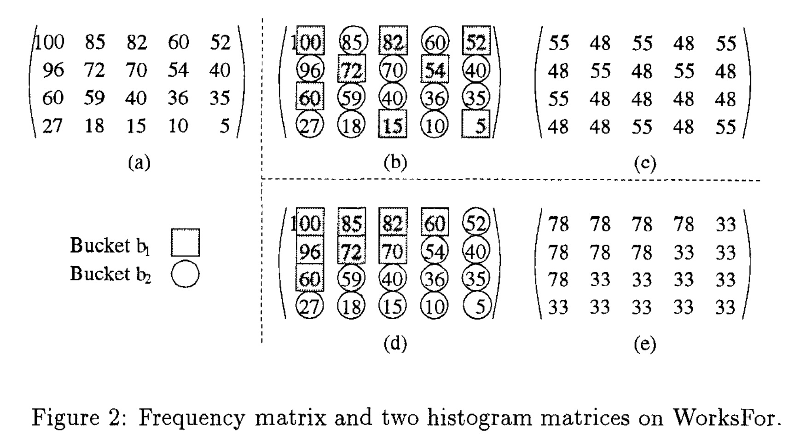

## AI论文解读 | Balancing Histogram Optimality And Practicality For Query Result Size Estimation
        
### 作者        
digoal        
        
### 日期        
2025-10-13        
        
### 标签        
PostgreSQL , PolarDB , DuckDB , AI , 论文解读        
        
----        
        
## 背景  
      
https://dl.acm.org/doi/pdf/10.1145/568271.223841        
  
提示:          
```          
读懂《Balancing Histogram Optimality And Practicality For Query Result Size Estimation》这篇论文需要提前掌握哪些基础知识, 请使用中文通熟易懂的讲解这些基础知识, 可以引用论文中的图、表或使用Markdown支持的图形(text,mermaid等)增加解释性. 
  
使用中文通熟易懂的解读《Balancing Histogram Optimality And Practicality For Query Result Size Estimation》这篇论文, 其中的关键内容请着重讲解, 可以引用论文中的图、表或使用Markdown支持的图形(text,mermaid等)增加解释性. 
  
提取《Balancing Histogram Optimality And Practicality For Query Result Size Estimation》这篇论文中的重要术语, 使用中文对这些术语进行通熟易懂的讲解, 可以引用论文中的图、表或使用Markdown支持的图形(text,mermaid等)增加解释性. 
```     
  
## 1 前置知识 
  
好的，为了读懂这篇经典的数据库论文《Balancing Histogram Optimality And Practicality For Query Result Size Estimation》，您需要先掌握一些关于数据库系统、查询优化和统计学的核心基础知识。下面我将用通俗易懂的中文为您讲解这些概念，并引用论文中的图表来帮助理解。

### 1. 关系数据库和查询优化器 (Relational Databases & Query Optimizer)

首先，您需要了解数据库是如何工作的。当我们向数据库发送一个查询请求时（例如，`SELECT * FROM A, B WHERE A.id = B.id`），数据库并不会立即开始查找数据。它内部有一个非常智能的组件叫做**查询优化器 (Query Optimizer)** 。

查询优化器的任务就像一个GPS导航系统。对于同一个目的地（查询结果），它会分析多条可能的“路线”（称为**访问计划 Access Plan**），比如是先读取A表还是先读取B表，使用哪种连接算法等。然后，它会**估算**每条路线的“成本”（通常是执行时间），并选择成本最低的那条去执行 。

这篇论文的核心，就是研究如何让这个“估算”过程更准确。

### 2. 查询结果集大小估计 (Query Result Size Estimation)

优化器估算成本最关键的一步，是预测查询执行过程中会产生多少数据，尤其是连接（JOIN）操作后中间结果集的大小 。如果估算错误，优化器很可能会选错“路线”，导致查询变得极慢 。

例如，如果优化器认为连接A和B的结果只有100行，它可能会选择一个适合小数据集的方案。但如果实际结果有100万行，这个方案就会变得非常低效。

因此，数据库需要一种方法来近似地了解表里面数据的分布情况，从而做出准确的估算。这就是直方图（Histogram）发挥作用的地方。

### 3. 直方图 (Histograms) 的基本概念

**直方图**是数据库系统中最常用的数据分布统计工具之一 。它的核心思想是，不记录每一个值的精确数量，而是将属性值分成若干个“桶”（buckets），然后只记录每个桶的统计信息 。

**核心假设**：在一个“桶”内部，数据被认为是**均匀分布**的 。也就是说，桶里所有值的频率都被当做是这个桶的平均频率 。

论文中提到了几种经典的直方图类型：
* **等宽直方图 (Equi-width Histogram)**：每个桶覆盖的属性值范围是相同的 。比如，年龄1-10岁一个桶，11-20岁一个桶。
* **等深直方图 (Equi-depth/Equi-height Histogram)**：每个桶里的数据元组数量大致相同 。比如，1000个用户数据，每200个用户分一个桶。对于数据倾斜的情况，这种直方图通常比等宽的更准确 。

### 4. 数据分布 (Data Distribution) 的基本认识

现实世界的数据很少是均匀分布的，通常是**倾斜 (skewed)** 的。一个典型的例子就是“二八定律”，即少数热门值占据了大部分数据。

这篇论文为了模拟这种真实情况，频繁使用了一个经典的数学分布——**Zipf 分布 (Zipf distribution)** 。

* **Zipf 分布的特点**：少数几个值拥有非常高的频率（出现次数多），而大量的值拥有非常低的频率 。
* **看懂论文中的 Figure 1**：这张图完美地展示了Zipf分布。    

    Figure 1: Zipf frequency distribution.
    * **X轴 (Rank of Attribute Value)**：将所有属性值按其出现频率从高到低排名。排名第1的就是最频繁的值。
    * **Y轴 (Number of Tuples)**：该排名对应的属性值的频率（即元组数量）。
    * **z 参数**：这是“倾斜因子” 。`z=0` 时是完全均匀的分布（所有值的频率都一样），`z` 越大，数据分布越倾斜，曲线越陡峭 。

理解了Zipf分布，您就能明白为什么简单的均匀分布假设经常出错，以及为什么需要更智能的直方图。

### 5. 频率矩阵 (Frequency Matrix) 和查询计算

这是理解论文数学模型的核心。论文将关系表中的数据分布抽象成一个**频率矩阵 (Frequency Matrix)** 。

* 对于单属性选择，可以想象成一个向量（一维矩阵），每个元素是对应属性值的频率。
* 对于多属性连接，就是一个多维矩阵。

**核心公式 (Theorem 2.1)**：一个链式连接查询 `R0 JOIN R1 JOIN ... JOIN RN` 的最终结果大小 `S`，可以被计算为各个关系对应的频率矩阵的乘积 。   
$$S = \underline{T}_0 \underline{T}_1 \dots \underline{T}_N$$

**看懂论文中的 Example 2.2**: 这个例子清晰地解释了频率矩阵的概念 。    
* 关系 $R_0$ 有两个属性值 { $v_1, v_2$ }，频率分别是20和15。它的频率矩阵 $\underline{T}_0$ 就是一个行向量 `(20 15)`。
* 关系 $R_1$ 连接 $R_0$ 的属性和 $R_2$ 的属性，它的频率矩阵 $\underline{T}_1$ 是一个二维矩阵，记录了 `<v, u>` 值对的频率。
* 关系 $R_2$ 有三个属性值 { $u_1, u_2, u_3$ }，频率分别是21, 16, 5。它的频率矩阵 $\underline{T}_2$ 就是一个列向量。
* 最终查询结果的数量就是这三个矩阵相乘的结果： $S = \underline{T}_0 \underline{T}_1 \underline{T}_2 = 19,265$ 。

当数据库使用直方图时，它实际上是在用一个**近似的**、**简化的**频率矩阵（每个桶内的值都用平均频率代替）来进行这个乘法运算，从而得到一个估算值 $S'$ 。这篇论文研究的就是如何构建直方图，才能让 $S'$ 和真实的 `S` 之间的误差最小。

### 6. 论文的核心概念预览

掌握了以上知识后，您就可以开始理解论文的核心贡献了。在阅读时，请重点关注以下几个由论文提出或重点讨论的概念：

* **串行直方图 (Serial Histograms)**：这是论文提出的一个非常重要的概念。它构建桶的原则不是依据属性值的大小，而是依据**频率的高低** 。简单来说，就是把频率相近的值放在同一个桶里 。论文中的 Figure 2(d) 就是一个串行直方图的例子 。   
* **端偏置直方图 (End-biased Histograms)**：这是一种实践中非常有效且高效的串行直方图 。它的策略是：用单独的桶精确记录频率最高和/或最低的几个值，然后把剩下的大量“普通”值都放到一个大桶里，并假设它们是均匀分布的 。
* **最优性 (Optimality) vs. 实用性 (Practicality)**：论文的标题就点明了这是一个权衡。最优的直方图可能构建起来非常耗时（指数级复杂度）且占用空间大 。因此，需要寻找一种“足够好”且“足够快、足够省”的实用方案。论文的结论是，**端偏置直方图**就是这个最佳平衡点 。

**总结一下，阅读这篇论文前需要掌握的知识点清单**：

| 核心概念 | 通俗解释 |
| :--- | :--- |
| **查询优化器** | 数据库中为查询选择最快执行路径的“导航系统”。 |
| **结果集大小估计** | 优化器预测查询会返回多少行数据的过程，是其决策的关键依据。 |
| **直方图** | 一种将数据分桶来近似表示数据分布的统计工具。 |
| **数据倾斜与Zipf分布** | 真实数据通常不均匀，Zipf分布是模拟这种“二八现象”的常用模型。 |
| **频率矩阵** | 将数据分布数学化为矩阵，查询的计算可看作矩阵乘法。 |

带着这些基础知识去阅读，您会发现论文的思路会清晰很多：它首先定义了问题（如何准确估算），然后建立了数学模型（频率矩阵），接着探讨了现有方法的不足，并提出了更优的理论模型（串行直方图），最后给出了一个在理论和实践上都表现出色的解决方案（端偏置直方图）。
  
## 2 解读论文 
  
好的，我们来一起深入解读这篇数据库领域的经典论文——《Balancing Histogram Optimality And Practicality For Query Result Size Estimation》。

这篇论文的核心在于解决一个数据库查询优化中的根本性矛盾：我们想要最 **精确（Optimality）** 的查询成本估算，但又必须保证获取和维护这些统计信息的方法是 **高效可行（Practicality）** 的 。论文最终给出了一个非常优雅且影响深远的解决方案。

-----

### 论文的起点：为什么需要估算以及估算的困境

在数据库中，当你执行一个SQL查询时，查询优化器会生成多种执行计划（比如先Join表A和B，还是先过滤表C）。为了选择最高效的计划，优化器必须估算每个计划的“成本”，其中最关键的一环就是估算每一步操作会产生多少数据，即**结果集大小**。

估算不准的后果是灾难性的。错误的估算可能导致查询时间从几秒钟变成几小时 。而直方图（Histogram）是商业数据库系统（如DB2, Ingres）中最常用的估算工具 。

然而，如何构建一个“好”的直方图，正是这篇论文要探讨的核心问题。

### 论文的数学基石：频率矩阵

为了从理论上分析这个问题，论文首先将数据分布抽象成一个数学工具——**频率矩阵 (Frequency Matrix)**。

  * **定义**：一个关系（表）中，连接属性（Join Columns）的数据分布可以用一个矩阵来表示，矩阵中的每个元素 $t_{kl}$ 代表了不同属性值组合出现的频率（次数） 。
  * **核心洞察 (Theorem 2.1)**：一个链式Join查询的结果集大小 `S`，等于其各个关系（表）的频率矩阵的乘积 。    
    $$S = \underline{T}_0 \underline{T}_1 \dots \underline{T}_N$$
    这个公式是论文后续所有推导的基础。它意味着，只要我们能用直方图准确地**近似**每个表的频率矩阵，我们就能准确地估算出最终结果的大小。

**示例 (Example 2.2)** 
假设查询为 `R0 JOIN R1 JOIN R2`，它们的频率矩阵分别是：   

$$\underline{T}_0 = (20 \quad 15)$$  
$$\underline{T}\_1 = \begin{pmatrix} 25 & 10 & 6 \\ 12 & 4 & 3 \end{pmatrix}$$  
$$\underline{T}\_2 = \begin{pmatrix} 21 \\ 16 \\ 5 \end{pmatrix}$$  

那么真实的结果集大小就是 $S = \underline{T}_0 \underline{T}_1 \underline{T}_2 = 19,265$ 。而直方图估算的过程，就是用近似的矩阵 $\underline{T}'$ 去做这个乘法，得到估算值 $S'$ 。论文的目标就是让 $|S - S'|$ 尽可能小。

### 关键贡献一：串行直方图 (Serial Histograms) 的理论最优性

传统的直方图（如等宽、等深）是根据**属性值**来划分“桶”的。而论文提出了一个颠覆性的观点：**最优的划分方式应该依据频率**。

**定义 (Definition 2.1)**：**串行直方图**是一种将**频率相近**的属性值放入同一个桶的直方图 。   

我们可以通过论文中的**Figure 2**来直观理解其优越性：     

  * **(a)** 是原始的、真实的数据频率矩阵。
  * **(b) & (c)** 是一种普通的划分方式，高低频率的值（如100和27）被混在一个桶里，导致桶内平均值（55, 48）与真实值差异巨大。
  * **(d) & (e)** 是**串行**的划分方式。频率高的（如100, 96, 85...）被分到一起，频率低的（如27, 18, 15...）被分到一起。这样每个桶的平均值（78, 33）都更能代表桶内真实的数据情况。

**理论支撑 (Theorem 3.1)**：论文证明，在查询结果集大小最大化（这通常是产生最大估算误差的场景）的情况下，**最优的直方图一定是串行直方图** 。这从理论上确立了串行直方图的霸主地位。   

### 关键贡献二：从理论最优到工程实用

虽然串行直方图理论上最优，但存在一个致命的实践问题：**构建成本太高**。
要找到全局最优的串行划分，需要尝试所有可能的组合，这是一个指数级复杂度的算法 。

**论文中的 Table 1** 震撼地展示了这个问题 ：   

| 属性值数量 | 最优串行直方图 (V-OptHist) | 端偏置直方图 (V-OptBiasHist) |
| :--- | :--- | :--- |
| **100** | $\beta=3$ : 0.18秒<br> $\beta=5$ : **128.60秒** | $\beta=10$ : 0.00秒 |
| **1000** | $\beta=3$ : 156.70秒<br> $\beta=5$ : (慢到无法计算) | $\beta=10$ : 0.01秒 |
| **1M** | (无法计算) | $\beta=10$ : 1.80秒 |

> $\beta$ 是桶的数量

可见，最优串行直方图的构建成本随着桶数和数据量的增加而急剧恶化，在工程上完全不可行。

于是，论文提出了两个关键的妥协，以实现**实用性**：

#### 1\. 聚焦于“端偏置直方图” (End-biased Histograms)

这是一种非常实用的串行直方图。它的策略是：

  * 用 `β-1` 个桶，每个桶只存放一个**高频值**（或低频值） 。
  * 用剩下的1个桶，存放所有其他“普通”频率的值，并假设它们在此桶内均匀分布 。

这样做的好处是显而易见的：

  * **构建极快**：我们只需要找到频率最高/最低的几个值即可，算法复杂度接近线性 。从上表可见其速度优势。
  * **存储高效**：只需存储少数几个“明星”值和它们的频率，以及一个覆盖其他所有值的“平均频率” 。
  * **效果显著**：在现实世界常见的Zipf数据分布（少数热门项占主导）中，抓住了高频值就等于抓住了数据分布的“主要矛盾”，因此估算精度很高。

#### 2\. 提出“V-最优性” (v-optimality) 并简化问题

另一个实践难题是，一个表的直方图应该为哪个查询服务？最优直方图似乎与整个查询（包括所有Join的表）有关 。这使得为每个表独立维护直方图变得不可能。

论文通过引入**v-最优性**解决了这个问题。v-最优性的目标不再是最小化单次估算的绝对误差，而是最小化所有可能数据排列组合下的**误差平方的期望（即方差）** 。

基于此，论文得出了一个里程碑式的结论：
**Theorem 3.3**: 对于一个任意复杂的查询，要获得v-最优的直方图组合，我们只需要为**每个表独立地**构建其 **自连接 (self-join)** 查询下的最优直方图即可 。     

这个定理的意义极其重大：

  * **解耦**：为表A构建直方图时，再也无需关心它将与表B还是表C进行Join 。维护直方图变成了每个表自己的事，这在工程上是可行的。
  * **简化**：复杂的多表Join优化问题，被简化为了一系列单表的自连接优化问题。

### 实验验证：实践是检验真理的唯一标准

论文的最后一部分通过详尽的实验，验证了上述妥协是值得的。

  * **Figure 3, 4, 5**: 在自连接场景下，比较了5种直方图。结论很明确：最优串行 \> **端偏置** \>\> 等深 \> 等宽/均匀 。端偏置直方图的精度非常接近理论最优，且远超传统方法。尤其在数据高度倾斜时（Figure 5, z值大），优势更加明显 。
  * **Figure 6 & 7**: 在更复杂的多表Join场景下，验证了“v-最优端偏置直方图”的性能。
      * **Figure 7** 显示，对于一个5表Join的复杂查询，只需要5个桶（`β=5`），端偏置直方图就能将平均相对误差控制在非常低的水平 。
      * 实验同时表明，端偏置直方图（End-Biased）和更复杂的v-最优串行直方图（Serial）的估算精度相差无几，证明了前者的性价比极高 。

    

### 结论与影响

这篇论文完美地演绎了如何在理论最优和工程现实之间取得平衡。

1.  它首先从理论上指明了方向：**串行直方图**是正确的模型。
2.  然后正视了理论模型的实践困境（构建成本过高）。
3.  最后通过**端偏置直方图**和**基于自连接的v-最优性**这两个关键简化，找到了一条切实可行的道路。

其最终结论——**为每个表独立地构建和维护v-最优的端偏置直方图** ——已经成为现代数据库系统查询优化器设计的标准实践之一，影响深远。
  
## 3 术语 
  
好的，这篇论文《Balancing Histogram Optimality and Practicality for Query Result Size Estimation》探讨了数据库中一个核心问题：如何在查询优化的准确性和实用性之间取得平衡。以下是论文中一些重要术语的通俗化中文讲解，并引用了文中的图表示例。

### 1\. 柱状图 (Histogram)

  * **讲解**:
    在数据库中，柱状图是一种统计工具，用来近似地表示某个字段（属性）中不同数据值的分布情况 。想象一下，你想知道一个“城市”字段里，“北京”、“上海”、“广州”等各个城市分别出现了多少次。如果数据量巨大，为每个城市都精确计数会非常耗时且占用大量存储空间。

    柱状图的解决方法是，把这些城市值分组（称为“桶”，Bucket），然后只记录每个“桶”里的平均出现次数 。例如，可以把“北京”和“上海”放在一个桶里，计算它们的总出现次数，然后用平均值来代表这个桶里每个城市的频率 。这样一来，数据库系统就不需要存储每个值的精确频率，只需要存储少量“桶”的统计信息，大大节省了空间 。

    当数据库需要估算查询结果的大小时（例如，`SELECT * FROM users WHERE city = '北京'`），它会查看“北京”所在的桶，并使用该桶的平均频率来进行估算 。

### 2\. 频率分布 (Frequency Distribution)

  * **讲解**:
    频率分布描述了一个字段中各个不同值出现的频繁程度 。在数据库中，数据通常不是均匀分布的。例如，在一个订单表中，“热门商品”的出现频率会远高于“冷门商品”。这种分布的不均衡性（倾斜度，Skew）会极大地影响查询性能。

    论文中频繁提到的 **Zipf 分布 (Zipf distribution)** 就是一种典型的非均匀分布 。它的特点是：少数几个值的频率非常高，而绝大多数值的频率则非常低 。这非常符合现实世界的数据模式（比如少数热门网站占据了绝大部分网络流量）。

    下图（论文中的 Figure 1）展示了不同倾斜度（z 参数）下的 Zipf 分布。z 值越大，数据分布越不均匀（倾斜度越高）。   

    *图 1: Zipf 频率分布。x 轴代表值的频率排名，y 轴代表值的频率（元组数）。曲线越陡峭，表示数据越倾斜 。*

### 3\. 查询结果集大小估算 (Query Result Size Estimation)

  * **讲解**:
    这是数据库查询优化器的一项核心任务 。在执行一个复杂的查询（尤其是多表连接 Join）之前，优化器需要“猜一下”这个查询会返回多少条数据 。这个估算结果会直接影响它选择哪种执行计划（比如，是先过滤A表还是先连接B表）。如果估算不准，可能会导致优化器选择一个非常低效的执行计划，使得查询速度慢成百上千倍 。

    而柱状图就是进行这种估算最常用的工具之一 。

### 4\. 不同类型的柱状图

论文对比了多种柱状图，核心区别在于如何将数据值划分到不同的“桶”中。

#### a. 等宽柱状图 (Equi-width Histogram)

  * **讲解**:
    这种柱状图的划分标准是“值的范围”。它将属性值的整个范围（例如，年龄从0到100岁）切分成若干个等宽的区间（0-20岁，21-40岁...），每个区间是一个桶 。这种方法简单直观，但如果数据分布不均，效果会很差 。比如，大部分人的年龄集中在20-40岁，那么这个桶里的数据分布会非常复杂，用一个平均值来代表会产生巨大误差。

#### b. 等深/等高柱状图 (Equi-depth/Equi-height Histogram)

  * **讲解**:
    这种柱状图的划分标准是“元组数量”。它会调整每个桶的边界，确保每个桶包含大致相同数量的记录（元组）。相比等宽柱状图，它能更好地适应数据倾斜的分布，因此估算误差通常更小 。

#### c. 串行柱状图 (Serial Histogram)

  * **讲解**:
    这是论文提出的一个核心概念。它不关心数据值本身的大小或顺序，而是**根据值的频率高低**来划分桶 。具体来说，它会把频率相近的值分到同一个桶里 。

      * **一个重要的推论**: 为了减少估算误差，应该将频率相似的值分在一组 。
      * **与传统方法的区别**: 传统方法可能按值的自然顺序分组（如年龄、日期），而串行柱状图是按频率顺序分组，这两者可能完全不相关 。

    下图（论文中的 Figure 2）给出了一个直观对比：   

    ```mermaid
    graph TD
        subgraph "原始频率矩阵 (a)"
            direction LR
            A1["100, 85, 82, 60, 52"]
            A2["96, 72, 70, 54, 40"]
            A3["60, 59, 40, 36, 35"]
            A4["27, 18, 15, 10, 5"]
        end

        subgraph "非串行柱状图 (b)"
            direction LR
            B1["(100) (85) [82] [60] (52)"]
            B2["[96] [72] (70) [54] [40]"]
            B3["(60) (59) [40] (36) [35]"]
            B4["[27] [18] (15) [10] (5)"]
        end
        subgraph "串行柱状图 (d)"
            direction LR
            D1["[100] [85] [82] [60] [52]"]
            D2["[96] [72] [70] [54] [40]"]
            D3["[60] [59] (40) (36) (35)"]
            D4["(27) (18) (15) (10) (5)"]
        end
        subgraph "说明"
           S1["[]: 桶1"]
           S2["(): 桶2"]
        end

        A --> B1 & B2 & B3 & B4
        A --> D1 & D2 & D3 & D4
        B1 --> S1 & S2
        D1 --> S1 & S2
    ```

    *说明：上图模拟了论文 Figure 2 的划分方式。在“非串行柱状图 (b)”中，高频和低频的值被随意地混合在两个桶里。而在“串行柱状图 (d)”中，频率较高的值（如100, 96, 85...）被归入桶1，频率较低的值（如40, 36, 35...）被归入桶2，这种划分更优 。*

#### d. 端偏置柱状图 (End-biased Histogram)

  * **讲解**:
    这是串行柱状图的一个非常实用且高效的特例 。它的策略是：

    1.  **精确记录**: 挑出频率最高和/或最低的几个值，为它们各自创建一个“单值桶” (univalued bucket)，精确记录其频率 。
    2.  **统一估算**: 将剩下的大量“普通”频率的值全部放入一个大的“多值桶” (multivalued bucket) 中，并用一个平均值来代表它们 。

    

      * **优点**: 这种方法抓住了数据分布的“重点”（最高频和最低频），同时构建和维护的成本非常低 。论文的实验证明，它的估算效果接近最优的串行柱状图，但构建速度快了几个数量级 。

    下表（根据论文 Table 1 数据简化）展示了构建最优串行柱状图和最优端偏置柱状图的时间差异：   

| 属性值数量 | 串行柱状图 (5个桶) | 端偏置柱状图 (10个桶) |
| :--- | :--- | :--- |
| 100 | 128.60 秒 | **0.00 秒** |
| 1000 | (时间过长未测) | **0.01 秒** |
| 1,000,000 | (时间过长未测) | **1.80 秒** |

*表格 1: 两种柱状图的构建成本对比 。可以看出端偏置柱状图的效率极高。*

### 5\. v-最优 (v-optimal)

  * **讲解**:
    这是论文提出的一个衡量柱状图好坏的新标准。传统的“最优”可能指在某个特定查询和特定数据下的误差最小 。但这种“最优”不具备通用性，一旦查询或数据变化，柱状图可能就失效了 。

    “v-最优”则是在**不知道具体数据排列**（只知道频率集合）的情况下，追求**平均估算误差的方差 (Variance) 最小** 。方差小，意味着估算结果虽然不一定每次都最准，但表现最稳定，不会出现离谱的巨大误差。

    论文最重要的一个结论是：**一个表的 v-最优柱状图，是针对这个表自己和自己做连接（self-join）时的最优柱状图** 。这个结论极为重要，因为它意味着：

      * **本地化和解耦**: 计算一个表的最优柱状图不再需要考虑它会和哪个表、以何种方式连接。只需要分析这个表自身的数据分布即可 。
      * **实用性**: 这使得为数据库中每个表独立地、一次性地计算好最优（或近似最优）的柱状图成为可能，极大地增强了方法的实用性 。

### 总结

这篇论文的核心贡献在于，它通过理论和实验证明了：

1.  **串行柱状图 (Serial Histogram)**，特别是其实用版本 **端偏置柱状图 (End-biased Histogram)**，在估算查询结果集大小方面远优于传统的等宽或等深柱状图 。
2.  通过引入 **v-最优 (v-optimal)** 的概念，可以将柱状图的优化问题从“依赖全局信息”转变为“仅依赖本地信息”，即只需考虑表自身的自连接（self-join）查询即可 。

最终，论文给出了一个兼具**准确性 (Optimality)** 和 **实用性 (Practicality)** 的方案：为每个表构建 v-最优的端偏置柱状图，从而在很低的成本下实现高效、稳定且准确的查询估算 。
  
## 参考        
         
https://dl.acm.org/doi/pdf/10.1145/568271.223841    
        
<b> 以上内容基于DeepSeek、Qwen、Gemini及诸多AI生成, 轻微人工调整, 感谢杭州深度求索人工智能、阿里云、Google等公司. </b>        
        
<b> AI 生成的内容请自行辨别正确性, 当然也多了些许踩坑的乐趣, 毕竟冒险是每个男人的天性.  </b>        
    
#### [期望 PostgreSQL|开源PolarDB 增加什么功能?](https://github.com/digoal/blog/issues/76 "269ac3d1c492e938c0191101c7238216")
  
  
#### [PolarDB 开源数据库](https://openpolardb.com/home "57258f76c37864c6e6d23383d05714ea")
  
  
#### [PolarDB 学习图谱](https://www.aliyun.com/database/openpolardb/activity "8642f60e04ed0c814bf9cb9677976bd4")
  
  
#### [PostgreSQL 解决方案集合](../201706/20170601_02.md "40cff096e9ed7122c512b35d8561d9c8")
  
  
#### [德哥 / digoal's Github - 公益是一辈子的事.](https://github.com/digoal/blog/blob/master/README.md "22709685feb7cab07d30f30387f0a9ae")
  
  
#### [About 德哥](https://github.com/digoal/blog/blob/master/me/readme.md "a37735981e7704886ffd590565582dd0")
  
  

  
