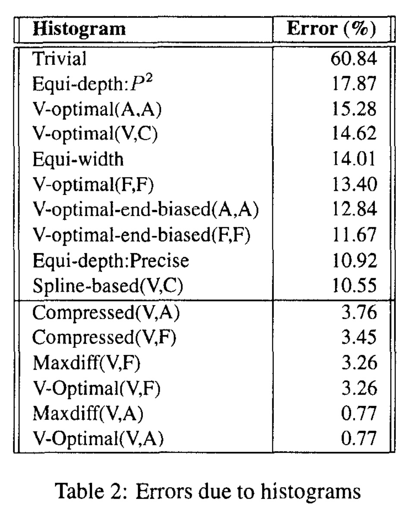

## AI论文解读 | Improved Histograms For Selectivity Estimation Of Range Predicates
        
### 作者        
digoal        
        
### 日期        
2025-10-13        
        
### 标签        
PostgreSQL , PolarDB , DuckDB , AI , 论文解读        
        
----        
        
## 背景  
      
https://dl.acm.org/doi/pdf/10.1145/235968.233342        
  
提示:          
```          
读懂《Improved Histograms For Selectivity Estimation Of Range Predicates》这篇论文需要提前掌握哪些基础知识, 请使用中文通熟易懂的讲解这些基础知识, 可以引用论文中的图、表或使用Markdown支持的图形(text,mermaid等)增加解释性. 
  
使用中文通熟易懂的解读《Improved Histograms For Selectivity Estimation Of Range Predicates》这篇论文, 其中的关键内容请着重讲解, 可以引用论文中的图、表或使用Markdown支持的图形(text,mermaid等)增加解释性. 
  
提取《Improved Histograms For Selectivity Estimation Of Range Predicates》这篇论文中的重要术语, 使用中文对这些术语进行通熟易懂的讲解, 可以引用论文中的图、表或使用Markdown支持的图形(text,mermaid等)增加解释性. 
```     
  
## 1 前置知识 
  
好的，为了帮助您顺利读懂《Improved Histograms For Selectivity Estimation Of Range Predicates》这篇经典的数据库论文，我将为您梳理和讲解需要预先掌握的核心基础知识。我会尽量用通俗易懂的语言，并结合论文中的图表来进行解释。

---

### 核心脉络

这篇论文的核心目标是：**让数据库更“聪明”地估计一个查询会返回多少条数据**。这个“估计”的准确性至关重要，因为它直接影响数据库选择哪种执行计划去真正地运行查询，最终决定了查询的快慢。论文通过提出一个全新的、系统的**直方图分类法 (Histogram Taxonomy)**，并在此基础上发明了多种更精确的新型直方图，来解决这个问题。

要理解这篇论文，您需要掌握以下几个关键概念：

1.  **查询优化与基于成本的优化器 (Query Optimization & Cost-Based Optimizer)**
2.  **选择性 (Selectivity) 与基数估计 (Cardinality Estimation)**
3.  **直方图 (Histogram) 的基本概念**
4.  **论文的核心：直方图分类法 (Histogram Taxonomy)**
5.  **经典直方图类型：等宽直方图与等深直方图**
6.  **解决性能问题：采样 (Sampling)**
7.  **评估方法：数据分布 (如 Zipf 分布)**

---

### 1. 查询优化与基于成本的优化器

这是理解整篇论文动机的“大背景”。

* **是什么？**
    当你向数据库发送一条SQL查询（比如一个复杂的多表连接查询）时，数据库并不会立刻开始执行。它会先启动一个叫做“**查询优化器 (Query Optimizer)**”的组件。这个组件的任务是生成多种可能的执行“路径”或“计划”(Access Plan)，然后从中挑选一个它认为成本最低、速度最快的计划去执行 。

* **为什么重要？**
    一个好的计划和一个坏的计划，执行时间可能相差成千上万倍。优化器是如何判断哪个计划“成本低”的呢？它依赖一个**基于成本的模型**。这个模型会估算执行计划中每一步操作（如扫描表、连接、排序）的开销 。而所有这些估算的核心，都依赖于一个关键数据：**每一步操作会处理多少条记录**。

* **和论文的关系？**
    论文研究的直方图，就是为了给查询优化器提供更准确的“会处理多少条记录”的估计值，从而让它能做出更明智的决策。

### 2. 选择性 (Selectivity) 与基数估计 (Cardinality Estimation)

这是查询优化器需要估算的具体目标。

* **是什么？**
    * **选择性 (Selectivity)**：指一个查询条件（比如 `WHERE age > 30`）能从总数据中筛选出多大比例的记录。它是一个介于0和1之间的小数。
    * **基数 (Cardinality)**：指满足查询条件的记录的**具体数量**。它等于 `总记录数 × 选择性`。

    论文标题中的 "Selectivity Estimation" 指的就是估算选择性的过程，这等同于估算查询结果的大小（基数）。

* **例子**：
    一个表有1,000,000条记录。
    * 查询 `WHERE gender = 'Male'`，如果男女各半，那么选择性是 0.5，基数是 500,000。
    * 查询 `WHERE id = 123`，如果 `id` 是主键，选择性接近 0 (1/1,000,000)，基数是 1。

* **和论文的关系？**
    论文提出的各种直方图，就是用来近似地表示数据是如何分布的，从而能够快速估算任意范围查询（如 `age BETWEEN 30 AND 40`）的选择性。

### 3. 直方图 (Histogram) 的基本概念

这是论文研究的核心工具。

* **是什么？**
    直方图是一种统计工具，它不存储每一条具体的数据，而是将数据**分桶 (buckets)**，然后只记录每个桶的摘要信息（比如桶里有多少数据、数据的最大/最小值等）。这就像人口普查，我们不关心每个人的具体年龄，而是统计“0-10岁”、“11-20岁”等年龄段各有多少人。

* **为什么用它？**
    它的主要优点是空间占用小，估算速度快 。数据库系统可以将这些小巧的直方图存储在系统目录中，优化器在需要时可以快速查询，而无需扫描庞大的原始数据表。

* **一个简单的例子**：
    假设我们有一列数据 `[1, 2, 5, 6, 7, 8, 20, 21, 22, 30]`。
    我们可以用一个包含3个桶的直方图来表示它：
    * **桶1**: 范围 [1, 10]，包含值 `{1, 2, 5, 6, 7, 8}`，共6个值。
    * **桶2**: 范围 [11, 20]，包含值 `{20}`，共1个值。
    * **桶3**: 范围 [21, 30]，包含值 `{21, 22, 30}`，共3个值。

    有了这个直方图，当被问到 `WHERE value BETWEEN 5 AND 15` 会返回多少条数据时，优化器就可以根据桶1和桶2的信息进行快速估算，而无需扫描原始数据。

### 4. 论文的核心：直方图分类法 (Histogram Taxonomy)

这篇论文最大的贡献之一，就是系统性地提出，一个直方图可以由几个**相互独立的正交属性 (orthogonal properties)** 来定义 。这就像定义一个人，可以从身高、体重、国籍等不同维度来描述。

论文将这些属性整理成了一个分类法，如下表所示（类似论文中的Figure 2和Figure 3）。      

| 分类维度 | 可选项 | 中文解释 |
| :--- | :--- | :--- |
| **Sort Parameter** | Value(V), Frequency(F), Area(A) | **排序参数**：在分桶前，数据按什么标准排序？是按数值大小(V)，还是按出现频率(F)，或是论文新提出的按“面积”(A)？ |
| **Source Parameter** | Spread(S), Frequency(F), Area(A), Cum. Freq(C) | **源参数**：在分桶时，我们希望桶内的哪个“源”属性尽可能均匀或满足某个约束？是值的范围(S)，值的频率(F)，还是“面积”(A)？ |
| **Partition Constraint**| Equi-sum, V-Optimal, Maxdiff, Compressed | **划分约束**：桶的边界如何确定？是让每个桶的源参数之和相等（Equi-sum），还是让桶内方差最小（V-Optimal），或是论文提出的在差异最大的地方切分（Maxdiff）等。|
| **Partition Class** | Serial, End-biased, Biased | **划分类型**：分桶的规则是什么？是必须连续划分（Serial），还是把出现频率极高/极低的值单独分桶（End-biased）？|
| **Bucket Approximation**| Continuous, Point, Uniform Spread | **桶内近似方法**：桶内的数据分布如何假设？是假设所有可能值都连续存在（Continuous），还是用一个点代表整个桶（Point），或是论文提出的更优的均匀跨度假设（Uniform Spread）？|

理解了这个分类法，你就能明白论文是如何将已有的直方图（如等宽、等深）放入这个框架，并如何通过**组合这些属性的不同选项来创造出新的、更强大的直方图**。例如，一个经典的等宽直方图，在论文的分类法下就被命名为 `Equi-sum(V,S)` 。

### 5. 经典直方图类型：等宽与等深

这是理解论文改进点的前置知识。

* **等宽直方图 (Equi-width / Equi-sum(V,S))**:
    将数据的取值范围（最大值-最小值）进行等分。比如年龄范围是0-100岁，分成10个桶，那么每个桶的宽度就是10岁 。这种方法实现简单，但如果数据分布不均（例如，大部分人都在20-40岁），就会导致某些桶数据很密集，某些桶很稀疏，估算误差大。

* **等深直方图 (Equi-depth / Equi-height / Equi-sum(V,F))**:
    切分桶，使得每个桶包含的**记录数量**大致相等 。这样可以更好地适应数据倾斜（skew）的情况，在数据密集的区域桶的范围会很窄，在稀疏区域桶的范围会很宽。但论文指出，精确构建等深直方图的代价很高 。

### 6. 解决性能问题：采样 (Sampling)

构建一个完美的直方图需要扫描全量数据，对于非常大的表来说，这个过程本身就非常耗时 。

* **是什么？**
    采样就是不读取所有数据，而是随机地抽取一小部分数据（样本），然后基于这个样本来构建直方图 。

* **为什么重要？**
    论文证明了基于采样的构建方法不仅**成本极低**（只需单次扫描数据），而且构建出的直方图**准确度非常高**，甚至优于一些在全量数据上构建的传统直方图 。论文中提到了一个具体的采样算法叫**蓄水池采样 (Reservoir Sampling)**，它的优点是可以在不知道数据总量的情况下，只遍历一次数据就获得一个公平的随机样本 。

下表是论文中的Table 1，它清晰地展示了使用采样技术（如Compressed, MaxDiff等）构建直方图的耗时（毫秒级），与不使用采样或使用低效算法（如Equi-Depth: by P²）的耗时（秒级）之间的巨大差距 。    

| Histogram | Time Taken (msec) |
| :--- | :--- |
| Compressed | 5.9 |
| Equi-sum | 6.2 |
| MaxDiff | 7.0 |
| V-optimal | 42.9 |
| **Equi-Depth: by P²** | **4992** |

### 7. 评估方法：数据分布 (如 Zipf 分布)

为了验证新提出的直方图是否有效，论文需要设计实验。

* **是什么？**
    论文没有仅使用真实数据，而是人工生成了遵循特定数学分布的数据集，因为这样可以自由地控制数据的各种特性（如倾斜程度），从而全面地测试直方图的性能。其中最常用的一种是**Zipf 分布 (Zipf distribution)** 。

* **Zipf 分布的通俗理解**：
    它是一种“二八定律”的体现。一个很小的z值（如z=0）代表**均匀分布**，所有值的出现频率都差不多。随着z值增大，数据**倾斜**程度越来越高，即少数几个值占据了绝大多数的出现次数，而大量其他值很少出现 。这非常符合真实世界的数据特点（如：少数热门商品占据了大部分销量）。

* **和论文的关系？**
    通过在不同Zipf参数（不同倾斜度）的数据集上进行测试，论文可以系统地评估哪种直方图在哪种数据分布下表现最好。例如，论文中的 Figure 5 展示了在不同频率倾斜度(z)下，几种新型直方图的平均误差，可以看出它们在处理中度倾斜(z=1)的数据时挑战最大 。   

---

### 总结

掌握了以上知识后，您就可以带着这些问题去阅读论文了：

1.  **背景**：数据库优化器需要估算查询结果的大小来选择最佳执行计划。
2.  **问题**：传统的直方图（如等宽、等深）在处理各种复杂数据分布时不够准确或构建成本高。
3.  **论文的解决方案**：
    * 提出一个系统的**分类法**来解构和理解所有直方图。
    * 基于这个分类法，引入了新的参数（如`Area`）和新的划分约束（如`Maxdiff`），创造了**多种新型直方图**。
    * 引入了新的桶内数据假设（`Uniform Spread`）来提高精度。
    * 倡导使用高效的**采样**方法来低成本地构建这些直方图。
4.  **验证**：通过在各种人工生成的（如**Zipf**分布）数据集上进行大量实验，证明了新提出的`V-Optimal(V,A)`和`Maxdiff(V,A)`等直方图在准确性上远超传统方法。

希望这份导读能帮助您更轻松地理解这篇论文的精髓！
  
## 2 解读论文 
  
好的，我们来一起深入解读这篇数据库领域的经典论文——《Improved Histograms For Selectivity Estimation Of Range Predicates》。

这篇论文的核心贡献在于 **系统性地分析和改进了直方图（Histogram）** ，使其能更准确地估算数据库范围查询（如 `age BETWEEN 30 AND 40`）的结果数量，从而帮助数据库的“大脑”——查询优化器——选择最高效的查询执行计划 。

-----

### **核心问题：为什么数据库需要“猜”得更准？**

想象一下，你问数据库：“请找出所有年龄在30到40岁之间的员工”。数据库在执行前，需要做一个关键决策：是应该一行一行地扫描整个员工表，还是利用“年龄”这个字段的索引来快速定位？

这个决策严重依赖于一个估算：到底有多少员工符合这个年龄范围？

  * 如果估算出只有几个人，用索引会非常快。
  * 如果估算出90%的员工都在这个范围，那么直接扫描全表可能反而比用索引更快（因为避免了大量的随机I/O）。

查询优化器正是基于这类估算来选择成本最低的执行计划 。如果估算不准，选错了计划，查询性能可能会相差成百上千倍 。而**直方图**，就是目前商业数据库系统中最常用、最核心的估算工具 。

-----

### **论文精髓一：创建直方图的“万能公式”——直方图分类法**

这篇论文最大的创新之处，是首次提出了一个全面的**直方图分类法 (Histogram Taxonomy)** 。作者认为，任何一种直方图都可以由几个相互独立的关键属性来定义和构建。理解了这个框架，不仅能看懂所有已有的直方图，还能像搭积木一样创造出新的、更强大的直方图。

以下是这些关键属性的通俗解读：

1.  **排序参数 (Sort Parameter)**

      * **含义**：在对数据进行分桶（grouping）之前，我们应该按什么标准给数据排个序？
      * **选项**：
          * **值 (Value, V)**：按数据本身的数值大小排序（例如，年龄从小到大）。这是最常见的排序方式。
          * **频率 (Frequency, F)**：按每个值出现的次数多少来排序。
          * **面积 (Area, A)**：论文**新提出**的参数，定义为 `频率 × 跨度` (spread)，综合了值和频率的特性 。

2.  **源参数 (Source Parameter)**

      * **含义**：这是我们分桶时，希望在每个桶内保持某种“均衡”或“相似性”的依据。
      * **选项**：可以是值的跨度 (Spread, S)、频率 (F)、面积 (A) 或累积频率 (Cumulative Frequency, C) 。

3.  **划分约束 (Partition Constraint)**

      * **含义**：确定桶与桶之间边界的具体规则是什么？
      * **经典选项**:
          * **Equi-sum (等和)**：让每个桶的“源参数”之和大致相等。这是最经典的约束，它衍生出两种著名的直方图：
              * **等宽直方图 (Equi-width)**：当源参数是“值的跨度(S)”时，每个桶的数值范围相同 。在论文的分类法下记为 `Equi-sum(V, S)`。
              * **等深直方图 (Equi-depth)**：当源参数是“频率(F)”时，每个桶包含的数据点数量相同 。记为 `Equi-sum(V, F)`。
          * **V-Optimal (方差最优)**：通过复杂的计算，找到一种分桶方式，使得每个桶内源参数的方差之和最小 。
      * **论文新提出的约束**:
          * **Maxdiff (最大差异)**：在相邻数据点源参数差异最大的 `β-1` 个地方“切一刀”，形成 `β` 个桶 。这种方法直观且高效，旨在将差异巨大的值分到不同的桶中。
          * **Compressed (压缩)**：先把源参数值最高的那些数据单独放进“单身桶”（singleton buckets），剩下的数据再使用等和的方式划分 。这是一种专门处理数据高度倾斜（skewed）的有效策略。

4.  **桶内近似方法 (Approximation within a bucket)**

      * **含义**：数据被分进一个桶后，我们只存这个桶的摘要信息。那么，当需要估算时，如何“还原”桶内的数据分布？
      * **传统假设**:
          * **连续值假设 (Continuous values assumption)**：假设桶内的所有可能值都存在，且频率均匀 。
      * **论文新提出的假设**:
          * **均匀跨度假设 (Uniform spread assumption)**：除了记录桶的最高/最低值和平均频率，还额外记录桶内**不同值的个数** 。这使得对桶内数据分布的近似更加准确，是论文提升估算精度的关键之一。

下图（改编自论文的Figure 3）展示了这个分类法如何将旧的（实线框）和新的（虚线框）直方图统一到一个框架下。    


-----

### **论文精髓二：新参数、新约束、新方法的威力**

基于上述分类法，论文提出了一系列新型直方图，并通过实验证明了它们的优越性。

  * **引入“面积(A)”参数**：传统直方图要么只关心值的分布（等宽），要么只关心频率的分布（等深）。而“面积”参数 `(Area = Frequency × Spread)` 同时考虑了这两者，能更全面地捕捉数据的特征 。实验表明，使用面积作为源参数可以显著提升在值分布不均匀情况下的准确性 。

  * **Maxdiff 和 Compressed 约束大放异彩**：这两种新的划分方法在处理数据倾斜和突变时非常有效。它们的目标是“把最不像的邻居分开”，而不是机械地等分范围或数量。

  * **采样技术实现低成本构建**：精确构建复杂的直方图（尤其是等深和V-Optimal）需要对海量数据进行排序，成本极高 。论文大力倡导使用**采样 (Sampling)** 技术，特别是**蓄水池采样 (Reservoir Sampling)** 。这种方法只需对数据进行一次扫描，就能以极低的成本构建出非常精确的直方图 。

    从论文的 **Table 1** 可以直观看到成本差异：   

    | 直方图构建方法 | 耗时 (毫秒) |
    | :--- | :--- |
    | Compressed (基于采样) | 5.9 - 9.3  |
    | MaxDiff (基于采样) | 7.0 - 12.8  |
    | V-optimal (基于采样) | 42.9 - 67.0  |
    | Equi-Depth: by P² (一种全量近似算法) | **4992 - 10524**  |

    结论显而易见：基于采样的现代直方图构建方法，在成本上比传统近似算法低了**近千倍**。

-----

### **实验结果与最终结论**

论文通过在各种人工生成的、具有不同数据分布特征（特别是不同倾斜程度的Zipf分布）的数据集上进行了大量实验 。

**Table 2** 的结果非常具有代表性，它展示了在一次典型实验中各种直方图的估算误差（误差越小越好）：    

| 直方图类型 | 误差 (%) | 类别 |
| :--- | :--- | :--- |
| Trivial (最简单的均匀分布假设) | 60.84  | 效果差 |
| Equi-width (等宽) | 14.01  | 效果较差 |
| V-optimal(F,F) (传统V-Optimal) | 13.40  | 效果较差 |
| Equi-depth:Precise (精确等深) | 10.92  | 效果一般 |
| **Compressed(V,F)** (新) | **3.45**  | **效果好** |
| **Maxdiff(V,F)** (新) | **3.26**  | **效果好** |
| **Maxdiff(V,A)** (新) | **0.77**  | **效果极好** |
| **V-Optimal(V,A)** (新) | **0.77**  | **效果极好** |

从上表可以清晰地看到一道分水岭：论文提出的新型直方图（尤其是那些使用 **V(值)** 作为排序参数，并结合 **A(面积)** 作为源参数的类型），其误差比所有传统直方图都低了一个数量级。

### **总结与启示**

这篇论文的最终结论和带给业界的启示是：

1.  **面积(Area)是最佳源参数**：因为它同时捕捉了值的分布和频率的倾斜，适用性最广 。
2.  **值(Value)是最佳排序参数**：这保证了桶覆盖的是连续的数值范围，对范围查询最有利 。
3.  **Maxdiff(V,A) 和 V-Optimal(V,A) 是最优选择**：这两者在绝大多数情况下表现最好 。考虑到 `Maxdiff` 的构建算法更简单、速度更快，论文认为 **`Maxdiff(V,A)` 是在准确性和构建成本之间取得了最佳平衡的“首选直方图”** 。
4.  **采样大法好**：基于采样的构建方法是实现低成本、高精度直方图的关键，应当成为业界标准 。

总而言之，这篇论文不仅仅是提出了几种新的直方图算法，更重要的是提供了一套系统性的框架和思想，指导人们如何去设计和评估一个好的直方图，深刻地影响了后续所有商业数据库系统的查询优化器设计。
  
## 3 术语 
  
好的，这是对论文《Improved Histograms For Selectivity Estimation Of Range Predicates》中关键术语的提取和通俗化中文讲解。

-----

### 1\. 直方图 (Histogram)

  * **英文**: Histogram
  * **通俗讲解**:
    直方图是一种数据摘要工具，它不保存所有原始数据，而是将数据值分组到称为“桶” (buckets) 的子集中 。对于每个桶，它只存储一些汇总统计信息（例如桶内有多少数据、最大/最小值等），以此来近似地表示原始数据的分布情况 。数据库使用直方图来快速估算查询结果的大小，而无需扫描整个数据表，因此几乎没有运行时开销 。
  * **核心优势**: 占用空间小，估算速度快 。

### 2\. 选择性估计 (Selectivity Estimation)

  * **英文**: Selectivity Estimation
  * **通俗讲解**:
    “选择性”指的是一个查询条件（谓词）能从数据表中筛选出多大比例的数据。选择性估计就是预测这个比例的过程，它等同于估算查询结果的大小（也称基数估计）。这个估算值对于数据库的查询优化器至关重要，因为优化器会根据它来选择成本最低、速度最快的查询执行计划 。估算错误可能会随着复杂查询（如多表连接）而指数级增长，严重影响查询性能 。

### 3\. 范围谓词 (Range Predicate)

  * **英文**: Range Predicate
  * **通俗讲解**:
    这是论文重点关注的一类查询条件，其形式为 `a ≤ X ≤ b`，其中 X 是一个属性列，a 和 b 是常量 。这类条件覆盖了很广的查询范围，包括：
      * **两边范围查询**: 例如 `age BETWEEN 30 AND 40`。
      * **单边范围查询**: 例如 `salary <= 5000` (此时 a 可以看作是负无穷) 。
      * **等值查询**: 例如 `id = 100` (此时 a 等于 b) 。

### 4\. 直方图分类法 (Histogram Taxonomy)

  * **英文**: Histogram Taxonomy

  * **通俗讲解**:
    这是本文最核心的贡献。作者们提出了一个系统性的框架，认为任何直方图都可以由几个相互独立（正交）的属性来定义 。这个分类法不仅涵盖了所有已知的直方图类型，还启发了许多新的、更有效的组合 。
    以下是构成这个分类法的关键属性：

    ```mermaid
    graph TD
        subgraph "直方图分类法 (Histogram Taxonomy)"
            A[排序参数<br/>Sort Parameter]
            B[源参数<br/>Source Parameter]
            C[划分约束<br/>Partition Constraint]
            D[桶内近似方法<br/>Bucket Approximation]
        end

        A --> E{按什么排序?}
        B --> F{均衡什么指标?}
        C --> G{如何切分桶?}
        D --> H{如何描述桶内分布?}
    ```

      * **排序参数 (Sort Parameter)**: 在分桶前，数据依据什么标准进行排序 。常见的有按**数值 (Value)** 或**频率 (Frequency)** 。
      * **源参数 (Source Parameter)**: 分桶时，我们希望桶内的哪个指标尽可能地相似或满足某个约束 。常见的有值的**跨度 (Spread)**、**频率 (Frequency)** 。
      * **划分约束 (Partition Constraint)**: 确定桶边界的具体规则 。
      * **桶内近似方法 (Approximation within a bucket)**: 如何用摘要信息来描述一个桶内部的数据分布 。

### 5\. 等宽与等深直方图 (Equi-width and Equi-depth Histograms)

  * **通俗讲解**:
    这是两种最经典的直方图类型，可以在上述分类法中找到它们的准确定位。
      * **等宽直方图 (Equi-width)**: 它将属性值的整个范围（最大值 - 最小值）进行等分，使得每个桶覆盖的数值区间宽度相同 。在论文的分类法中，它被称为 **Equi-sum(V, S)**，即“按值(V)排序，让跨度(S)的和相等” 。
      * **等深直方图 (Equi-depth / Equi-height)**: 它切分数据，使得每个桶包含大致相等数量的记录 。在论文的分类法中，它被称为 **Equi-sum(V, F)**，即“按值(V)排序，让频率(F)的和相等” 。

### 6\. 面积 (Area)

  * **英文**: Area
  * **通俗讲解**:
    这是论文**独创的一个新参数**，旨在同时捕捉数据的数值分布和频率分布特征 。
      * **定义**: `面积 (a_i) = 频率 (f_i) × 跨度 (s_i)` 。
      * **动机**: 传统的直方图要么只关注值的范围（等宽），要么只关注值的频率（等深），而“面积”参数综合了这两方面的信息，因此能更全面地指导如何进行有效的分桶 。实验证明，使用“面积”作为源参数的直方图在估算准确性上表现优异 。

### 7\. Maxdiff 直方图 (Maxdiff Histogram)

  * **英文**: Maxdiff Histogram
  * **通俗讲解**:
    这是论文提出的一种新型高效直方图，其分桶逻辑非常直观 。
      * **规则**: 在（按排序参数排好序的）相邻数据点之间，计算它们的“源参数”的差值。找到差值最大的 `β-1` 个位置，在这些地方“切一刀”，从而形成 `β` 个桶 。
      * **动机**: 避免将源参数值差异巨大的数据点划分到同一个桶中 。
      * **优势**: 构建算法非常高效，只需计算差值并找到最大的几个即可 。在实验中，`Maxdiff(V,A)` 被证明是在准确性和构建成本上综合表现最好的直方图之一 。

### 8\. 压缩直方图 (Compressed Histogram)

  * **英文**: Compressed Histogram
  * **通俗讲解**:
    这是一种专门为处理数据**高度倾斜 (skewed)** 而设计的新型直方图 。
      * **规则**: 首先识别出那些源参数值最高的“异常点”，将它们单独存放到各自的“单人桶”(singleton buckets) 中 。然后，将其余的大量“普通”数据点采用等和（equi-sum）的方式划分到剩下的桶中 。
      * **优势**: 通过隔离高频值或高“面积”值，可以极大地提高对倾斜数据分布的近似准确度 。

### 9\. 均匀跨度假设 (Uniform Spread Assumption)

  * **英文**: Uniform Spread Assumption
  * **通俗讲解**:
    这是论文提出的一个**更精确的桶内数据分布近似方法**，用于解决传统假设的不足 。
      * **做法**: 除了存储桶的最高/最低值和平均频率外，还额外存储桶内**不同值的个数** 。在估算时，它假设桶内这些不同值是均匀分布的（即它们之间的跨度是相等的）。
      * **优势**: 相比于传统的“连续值假设”（假设所有可能值都存在），均匀跨度假设能更准确地反映桶内实际值的稀疏或密集程度，显著减少估算误差 。

### 10\. 蓄水池采样 (Reservoir Sampling)

  * **英文**: Reservoir Sampling
  * **通俗讲解**:
    一种高效的随机采样算法，论文推荐使用它来低成本地构建直方图。
      * **特点**: 可以在**单次遍历**数据的情况下，从一个大小未知的数据库表中公平地随机抽取一个固定大小的样本 。
      * **优势**: 避免了传统精确构建方法所需的高昂排序成本 。论文的实验数据（见 Table 1）表明，基于采样的构建方法比传统近似算法的**CPU成本低几个数量级**，并且构建出的直方图准确性更高 。   
  
## 参考        
         
https://dl.acm.org/doi/pdf/10.1145/235968.233342    
        
<b> 以上内容基于DeepSeek、Qwen、Gemini及诸多AI生成, 轻微人工调整, 感谢杭州深度求索人工智能、阿里云、Google等公司. </b>        
        
<b> AI 生成的内容请自行辨别正确性, 当然也多了些许踩坑的乐趣, 毕竟冒险是每个男人的天性.  </b>        
    
#### [期望 PostgreSQL|开源PolarDB 增加什么功能?](https://github.com/digoal/blog/issues/76 "269ac3d1c492e938c0191101c7238216")
  
  
#### [PolarDB 开源数据库](https://openpolardb.com/home "57258f76c37864c6e6d23383d05714ea")
  
  
#### [PolarDB 学习图谱](https://www.aliyun.com/database/openpolardb/activity "8642f60e04ed0c814bf9cb9677976bd4")
  
  
#### [PostgreSQL 解决方案集合](../201706/20170601_02.md "40cff096e9ed7122c512b35d8561d9c8")
  
  
#### [德哥 / digoal's Github - 公益是一辈子的事.](https://github.com/digoal/blog/blob/master/README.md "22709685feb7cab07d30f30387f0a9ae")
  
  
#### [About 德哥](https://github.com/digoal/blog/blob/master/me/readme.md "a37735981e7704886ffd590565582dd0")
  
  

  
