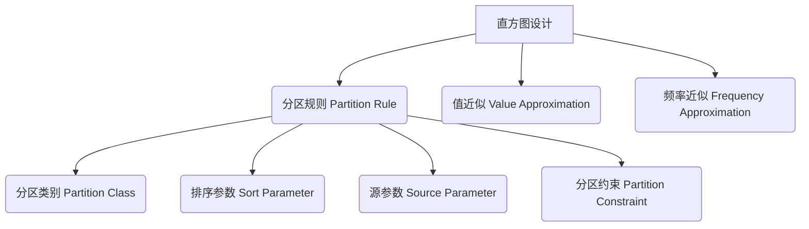
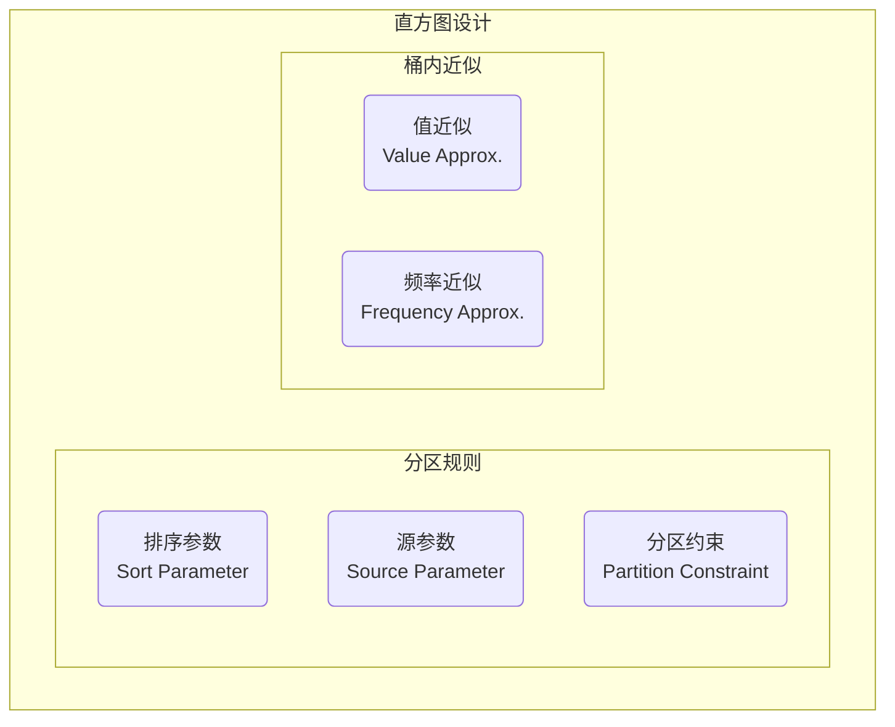
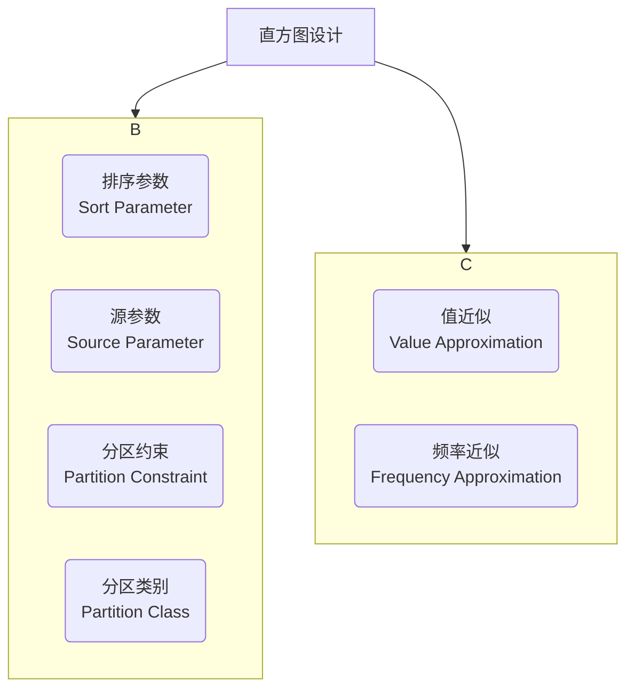

## AI论文解读 | The History Of Histograms
        
### 作者        
digoal        
        
### 日期        
2025-10-13        
        
### 标签        
PostgreSQL , PolarDB , DuckDB , AI , 论文解读        
        
----        
        
## 背景  
      
https://www.vldb.org/conf/2003/papers/S02P01.pdf        
  
提示:          
```          
读懂《The History Of Histograms》这篇论文需要提前掌握哪些基础知识, 请使用中文通熟易懂的讲解这些基础知识, 可以引用论文中的图、表或使用Markdown支持的图形(text,mermaid等)增加解释性. 
  
使用中文通熟易懂的解读《The History Of Histograms》这篇论文, 其中的关键内容请着重讲解, 可以引用论文中的图、表或使用Markdown支持的图形(text,mermaid等)增加解释性. 
  
提取《The History Of Histograms》这篇论文中的重要术语, 使用中文对这些术语进行通熟易懂的讲解, 可以引用论文中的图、表或使用Markdown支持的图形(text,mermaid等)增加解释性. 
```     
  
## 1 前置知识 
  
好的，为了更好地理解《The History Of Histograms》这篇论文，我们需要掌握一些数据库和统计学的基础知识。这篇论文虽然标题是“历史”，但它实际上是一篇深入探讨直方图在数据库领域，特别是 **查询优化（Query Optimization）** 中应用的学术综述。

我会将所需的基础知识分为三个层面：**核心概念**、**技术核心**和**拓展知识**。

-----

### 第一部分：核心概念：直方图与数据库查询优化

在阅读论文之前，最关键的是要理解“为什么数据库系统需要直方图？”

#### 1.1 什么是直方图 (Histogram)？

从根本上说，直方图是一种统计图表，用于展示数据的分布情况 。它将数据划分为若干个连续的区间（称为“桶”或“bins”），然后统计每个区间内数据出现的频次 。

**通俗举例：**
假设我们有30名学生的数学成绩，我们想了解成绩的分布情况。

  * **原始数据：** `85, 92, 78, 65, 72, 88, 76, 95, 89, 71, 68, 82, 79, 91, 73, 81, 77, 86, 90, 74, 69, 83, 70, 93, 84, 75, 80, 87, 94, 78`
  * **制作直方图：**
    1.  **分组/分桶：** 我们按分数段分组：60-69, 70-79, 80-89, 90-100。
    2.  **计数：** 统计每个分数段的人数。
          * 60-69: 3人
          * 70-79: 11人
          * 80-89: 10人
          * 90-100: 6人
    3.  **可视化：** 将结果画成柱状图。


```text
      人数
      |
  11  |       ██
  10  |       ██  ██
   9  |       ██  ██
   8  |       ██  ██
   7  |       ██  ██
   6  |       ██  ██  ██
   5  |       ██  ██  ██
   4  |       ██  ██  ██
   3  | ██    ██  ██  ██
   2  | ██    ██  ██  ██
   1  | ██    ██  ██  ██
      +---------------------> 分数段
        60-69 70-79 80-89 90-100
```

这篇论文中的直方图，本质上就是这种思想的延伸，但它更多地被当作一种**纯粹的数学对象**来压缩和近似数据分布，而不一定需要可视化 。

#### 1.2 为什么数据库需要直方图：查询优化与选择度估计 (Selectivity Estimation)

这是理解整篇论文的**核心动机**。当你向数据库发送一个查询请求时（例如 `SELECT * FROM sales WHERE amount > 1000;`），数据库并不会立即开始埋头查找数据。它会先生成多个可能的执行计划（比如，是先扫描整个表，还是先使用索引），然后选择一个它**认为**最快的计划去执行。

这个“认为”的过程，就是**查询优化**。为了做出明智的决策，优化器需要**估算**各种操作的成本。其中一个关键的估算就是 **选择度（Selectivity）** —— 即查询条件会过滤出多少数据 。

  * **选择度估算举例：**
      * `WHERE country = '梵蒂冈'`：优化器会猜测，符合这个条件的数据非常少。
      * `WHERE country = '中国'`：优化器会猜测，符合这个条件的数据非常多。

这个猜测的准确性，直接影响了执行计划的好坏。如果数据库没有数据的分布信息，它可能会做出非常糟糕的猜测（比如，假设所有值都是均匀分布的）。

**直方图的作用**：直方图为优化器提供了一种关于数据分布的、被压缩的“小地图” 。通过查询这个“小地图”，优化器可以更准确地估算出特定查询条件（如 `amount > 1000` 或 `age BETWEEN 30 AND 40`）会返回大概多少条记录，从而选择更优的执行计划 。

-----

### 第二部分：论文的技术核心：直方图的分类法

论文的第2.3节  提出了一个非常重要的直方图分类框架。理解这个框架是读懂论文后续内容的关键。该框架指出，设计一个直方图需要考虑多个方面 。

下面我用一个Mermaid流程图来展示这个分类体系，并逐一解释：



#### 2.1 分区规则 (Partition Rule) 

这是构建直方图最核心的部分，它决定了数据如何被划分到不同的“桶”里。它又细分为以下几个方面：

  * **排序参数 (Sort Parameter):** 在分桶前，我们先按什么标准给数据点排序？

      * **值 (Value, V):** 按数据本身的数值大小排序（例如，按年龄从小到大）。
      * **频率 (Frequency, F):** 按每个值出现的次数多少来排序 。
      * **面积 (Area, A):** 论文中定义为“频率 × 跨度”，是一个更复杂的参数 。

  * **源参数 (Source Parameter):** 这是我们希望在每个桶内尽量保持“相似”或“均匀”的属性。

      * **跨度 (Spread, S):** 值的范围。
      * **频率 (Frequency, F):** 值的出现次数。
      * **面积 (Area, A):** 值的频率和跨度的乘积。

  * **分区约束 (Partition Constraint):** 这是具体划分桶的数学规则。

      * **等和 (Equi-sum):** 让每个桶的“源参数”之和大致相等 。这是两种最传统直方图的基础：
          * **等宽直方图 (Equi-width):** 源参数是“跨度(S)”，让每个桶的数值范围（宽度）相等 。
          * **等深/等高直方图 (Equi-depth/Equi-height):** 源参数是“频率(F)”，让每个桶包含的数据点数量大致相等 。
      * **V-Optimal:** 一种更高级的约束，目标是最小化每个桶内源参数的方差，使得桶内数据尽可能相似 。
      * **MaxDiff:** 将桶的边界设置在相邻（按排序参数排序后）的源参数值差异最大的地方 。
      * **Compressed:** 将出现频率最高的几个值单独放入自己的桶，剩下的数据再用等深的方式分桶 。

#### 2.2 桶内近似方法 (Approximation within Buckets)

当数据被分入一个桶后，我们就丢失了桶内数据的具体分布信息。这时需要用一种假设来近似。

  * **值近似 (Value Approximation):**

      * **连续值假设 (Continuous Value Assumption):** 假设桶内的值是连续且均匀分布的 。
      * **均匀跨度假设 (Uniform Spread Assumption):** 记录桶内有多少个独立的值，并假设这些值在桶的范围内是等间距分布的 。

  * **频率近似 (Frequency Approximation):**

      * **均匀分布假设 (Uniform Distribution Assumption):** 这是最主要的方法，假设桶内所有值的频率都相同，等于桶内所有真实频率的平均值 。

-----

### 第三部分：拓展知识：多维与动态直方图

在理解了上述基础后，论文中提到的其他概念就更容易掌握了。

  * **多维直方图 (Multi-dimensional Histograms):**

      * **背景：** 现实中的查询往往涉及多个字段，例如 `WHERE age > 50 AND salary < 100000`。如果简单地假设年龄和薪水两个字段的分布是相互独立的，估算误差可能会很大。
      * **概念：** 多维直方图尝试直接对多个字段的联合数据分布进行划分和近似 。这比一维直方图要复杂得多，因为不再有简单的排序顺序 。

  * **动态直方图 (Dynamic Histograms):**

      * **背景：** 数据库中的数据是不断变化的（增删改）。静态的直方图在数据更新后会逐渐“过时”，导致估算不准 。
      * **概念：** 动态或自适应直方图是指那些能够随着数据的更新而自动调整的直方图，而不需要完全重新计算 。

### 总结

要读懂这篇论文，你需要具备以下知识地图：

1.  **基础统计知识：** 明白直方图是描述数据分布的工具。
2.  **数据库核心问题意识：** 深刻理解查询优化器需要通过**选择度估计**来挑选最佳执行计划，而直方图是实现这一目标的关键数据结构。
3.  **论文的分类框架：** 熟练掌握论文第二部分介绍的分类法，特别是**排序参数**、**源参数**和**分区约束**这三个概念，因为它们是区分不同类型直方图（如等宽、等深、V-Optimal等）的基石。

带着这些知识去阅读论文，你会发现论文的脉络非常清晰：它首先定义了直方图和它的分类方法，然后按照时间线回顾了各种不同类型的直方图是如何被提出、演进并解决特定问题的。
  
## 2 解读论文 
  
好的，这篇由 Yannis Ioannidis 教授撰写的《The History of Histograms (abridged)》虽然名为“历史”，但实际上是一篇非常经典和重要的学术综述。它系统地梳理了直方图（Histogram）在数据库领域，特别是**查询优化**中的发展脉络、关键技术和未来挑战。

下面，我将为您通俗地解读这篇论文的核心内容。

### 1\. 核心问题：数据库为什么需要直方图？

在解读历史之前，我们必须先明白直方图在数据库里要解决的根本问题：**选择性估算（Selectivity Estimation）** 。

当您向数据库发送一个查询，比如 `SELECT * FROM sales WHERE amount > 1000 AND region = 'Asia';` 时，数据库的“大脑”——查询优化器（Query Optimizer）——会制定一个执行计划。为了找出最高效的计划，它必须猜测这个查询条件会返回多少条数据 。

  * 如果 `amount > 1000` 的记录非常少，那么先执行这个条件会很高效。
  * 如果 `region = 'Asia'` 的记录非常少，那么先执行那个条件可能更好。

这个“猜测”的准确性至关重要 。如果数据库对数据分布一无所知，它可能会做出最坏的假设（例如，所有数据都是均匀分布的），从而导致一个极其缓慢的执行计划 。

**直方图**就是解决这个问题的核心工具。它是一种数据摘要（Synopsis），用很小的空间存储数据的大致分布情况，帮助优化器做出更精准的估算 。

### 2\. 直方图的诞生与早期发展

  * **词源与发明**: "Histogram" (ιστόγραμμα) 这个词源于希腊语，由 'istos' (ιστος, 意为“桅杆”) 和 'gramma' (γραμμα, 意为“文字”) 组成，形象地描述了其柱状的外形 。这个术语由著名统计学家卡尔·皮尔逊（Karl Pearson）在1892年的讲座中首次提出 。但作为一种图形表示方法，它的使用要早于其命名 。
  * **首次进入数据库**: 论文指出，直方图最早由 Kooi 在其1980年的博士论文中被引入数据库系统 。他提出的形式是最简单的**等宽直方图 (Equi-width Histograms)** 。
      * **工作原理**：将数据的取值范围（例如，年龄从0到100岁）切分成N个等长的区间（如0-10, 11-20, ...），然后统计每个区间的记录数 。
  * **第一次进化**: 几年后，研究者提出了**等深直方图 (Equi-depth Histograms)**，也叫等高直方图 。
      * **工作原理**：不再让每个桶的“宽度”相等，而是让每个桶包含的记录数（“深度”或“高度”）大致相等 。
      * **优势**：事实证明，等深直方图在估算精度上通常远胜于等宽直方图，因此很快被各大商业数据库系统采用 。

### 3\. 技术爆发：直方图分类法与关键创新（论文核心）

这篇论文最重要的贡献之一，是系统化地提出了一个描述直方图的分类框架 。理解这个框架，就能理解直方图技术的演进方向。



**分区规则 (Partition Rule)** 决定了如何将数据划分到不同的桶（Bucket）里，这是直方图技术创新的核心战场。

  * **排序参数 (Sort Parameter)**: 分桶前按什么排序？传统直方图按 **值（Value）** 排序 ，但后续研究发现按 **频率（Frequency）** 排序在某些场景下更优 。
  * **源参数 (Source Parameter)**: 我们希望桶内的哪个属性尽可能保持一致？这通常是**频率（F）或面积（A，频率与跨度的乘积）** 。
  * **分区约束 (Partition Constraint)**: 这是划分桶的具体数学规则，也是催生各种新型直方图的关键。
      * **等和 (Equi-sum)**: 让每个桶的源参数之和相等。等宽和等深直方图都属于此类 。
      * **V-Optimal**: 目标是最小化每个桶内源参数的**方差** 。通俗讲，就是让每个桶内部的数据尽可能地“相似”，把差异大的数据点分开到不同的桶里。
      * **MaxDiff**: 将桶的边界放在那些源参数值差异最大的相邻数据点之间 。
      * **Compressed**: 将频率最高的几个值单独放在自己的“VIP桶”里，剩下的数据再用等深的方式分桶 。这种方法在工业界很受欢迎，例如DB2就采用了这种思想 。

论文指出，像 **V-Optimal** 和 **MaxDiff** 这类新的分区约束，其核心思想都是“避免将差异巨大的值分到同一个桶里”，这使得它们的估算精度远超传统的等深直方图 。

### 4\. 从一维到多维：应对现实世界的复杂查询

现实查询往往涉及多个列的组合条件，比如 `age > 30 AND salary < 5000`。如果假设年龄和薪资的分布是独立的，估算误差会非常大。为此，**多维直方图 (Multi-dimensional Histograms)** 应运而生。

  * **早期尝试**: 最早的多维直方图是二维的等深直方图，它像切豆腐一样，轮流沿着一个维度将数据空间切分开 。
  * **关键进展 (MHIST)**: 论文中提到的 MHIST-2 算法是一种更智能的划分方法 。它不再机械地轮流切分，而是每次都选择“最需要”被切分的桶和维度进行分裂，从而能更有效地处理数据不均匀的分布 。
  * **其他创新**: 之后还出现了允许桶重叠的 GENHIST ，以及能在桶内“挖洞”形成不规则形状的 STHoles ，这些都是为了更灵活地捕捉复杂的数据分布模式。

### 5\. 工业界的应用与现状

直方图不仅是学术研究的热点，更是所有主流商业数据库系统的标配 。

  * **DB2**: 采用了 **Compressed** 直方图，将高频值单独存储，其余数据用等深方式处理 。
  * **Oracle**: 仍在使用经典的**等深直方图**，但增加了动态采样等能力来获取更准确的依赖信息 。
  * **SQL Server**: 采用了 **MaxDiff** 直方图，将桶的边界设置在数据分布变化最剧烈的地方 。

一个重要的共同点是：尽管学术界对多维直方图研究很多，但截至论文发表时，主流商业系统仍然主要使用**一维直方图**，并通过其他方式（如利用复合索引）来间接处理多维查询，很大程度上仍依赖于属性值独立的假设 。

### 6\. 直方图的未来：开放性问题与挑战

论文最后展望了直方图未来值得研究的几个方向，极具启发性：

1.  **直方图与聚类 (Clustering) 的融合**: 直方图分桶的过程，本质上和数据聚类非常相似，都是将相似的数据点分到一组 。那么，两个领域的技术能否相互借鉴甚至融合？
2.  **更智能的桶内表示**: 目前桶内的近似方法（如假设均匀分布）还比较粗糙 。未来能否让直方图自动学习每个桶内数据的最佳表示方法（例如，某些桶用线性函数，某些用常数），而不是一刀切？
3.  **直方图与索引 (Indices) 的结合**: 数据库的 B+ 树索引的结构天然地对数据进行了划分 。能否将索引的每一层节点都变成一个直方图，从而构建出一个“层级式直方图”？ 这样的结构既能用于快速查找，也能提供不同粒度的统计信息，或许能平衡精确查询与近似查询的需求 。

### 总结

《The History of Histograms》这篇论文以历史为线索，实际上为我们描绘了一幅数据库查询优化核心技术的全景图。它告诉我们，直方图技术从最初简单的“等宽”模型，发展到考虑数据内在方差和分布差异的“V-Optimal”、“MaxDiff”模型，再到处理多维数据和动态数据的复杂模型，其核心驱动力始终是**在有限的存储成本下，实现对真实数据分布更精准的近似，从而赋能查询优化器，提升整个数据库的性能**。论文最后提出的开放性问题，至今仍然是数据库研究领域的重要方向。
  
## 3 术语 
  
好的，这是从《The History of Histograms》论文中提取的关键术语及其通俗易懂的中文讲解。

### 核心概念

#### 1\. 直方图 (Histogram)

  * **讲解**：直方图是一种数据压缩和近似技术，它将数据的分布划分成多个互不相交的子集，称为“桶”（buckets），并对每个桶内的数值和频率进行统一的近似处理 。在数据库领域，它不一定需要被可视化，更多是作为一种数学工具，为查询优化器提供关于数据分布的摘要信息 。
  * **词源**：这个词由希腊语 "isto-s" (ιστος, 意为“桅杆”) 和 "gram-ma" (γραμμα, 意为“书写的东西”) 组成，形象地描述了其由多个垂直“桅杆”组成的形态 。该术语由统计学家卡尔·皮尔逊 (Karl Pearson) 创造 。

#### 2\. 选择度估计 (Selectivity Estimation)

  * **讲解**：这是直方图在数据库中最主要的应用之一 。它是指数据库的查询优化器在执行查询前，估算一个查询条件（如 `age > 30`）能够筛选出数据表中多大比例记录的过程 。一个准确的估算能帮助优化器选择最高效的查询执行计划。

#### 3\. 查询优化 (Query Optimization)

  * **讲解**：这是数据库系统的“大脑”。当收到一个SQL查询时，优化器会生成多种可能的执行路径（比如是先用索引还是先全表扫描），然后利用包括直方图在内的统计信息去估算每条路径的成本，最终选择一个它认为成本最低、速度最快的计划来执行 。

### 直方图的分类框架 (Histogram Taxonomy)

论文提出了一个系统化的分类框架来描述和区分不同类型的直方图 。这套框架是理解本文的关键。



#### 4. 分区规则 (Partition Rule) 

  * **讲解**：这是构建直方图最核心的规则，它决定了数据如何被划分到不同的“桶”里。它由以下几个关键部分组成。

      * **a. 排序参数 (Sort Parameter)** 

          * **讲解**：在分桶之前，先按照什么标准对数据进行排序。常见的排序参数有：
              * **值 (Value, V)**：按数据本身的数值大小排序 。
              * **频率 (Frequency, F)**：按每个数据点出现的次数多少来排序 。

      * **b. 源参数 (Source Parameter)** 

          * **讲解**：这是我们希望在每个桶内尽量保持“相似”或“均匀”的属性，是分桶约束作用的对象 。常见源参数有：
              * **跨度 (Spread, S)**：指数据值的范围 。
              * **频率 (Frequency, F)**：指数据值的出现次数 。
              * **面积 (Area, A)**：定义为频率与跨度的乘积 。

      * **c. 分区约束 (Partition Constraint)** 

          * **讲解**：这是具体划分桶的数学规则，它作用于源参数，以确定桶的边界 。不同约束催生了不同类型的直方图。
              * **等和 (Equi-sum)**：要求每个桶的源参数之和大致相等 。这是两种最古老直方图的基础：
                  * **等宽直方图 (Equi-width)**：当源参数是“跨度”时，就形成了等宽直方图，即每个桶的数值范围宽度相等 。
                  * **等深/等高直方图 (Equi-depth/Equi-height)**：当源参数是“频率”时，就形成了等深直方图，即每个桶包含的数据记录数大致相等 。
              * **V-Optimal (V-最优)**：一种更高级的约束，其目标是最小化每个桶内源参数值的方差，使得桶内数据尽可能相似 。
              * **MaxDiff (最大差异)**：将桶的边界设置在那些（按排序参数排序后）相邻源参数值差异最大的地方 。
              * **Compressed (压缩)**：将源参数值最高（通常是频率最高）的数据点单独放入自己的桶，剩下的数据再用等和（如等深）的方式分桶 。

### 桶内近似方法

当数据被分入一个桶后，原始的详细信息就丢失了，数据库需要用一个统一的假设来近似桶内的分布。

#### 5. 值近似 (Value Approximation) 

  * **讲解**：指如何近似一个桶内包含哪些具体数值。
      * **连续值假设 (Continuous Value Assumption)**：只记录桶的最大值和最小值，并假设桶内所有可能的值都是连续且均匀分布的 。
      * **均匀跨度假设 (Uniform Spread Assumption)**：除了记录最大值和最小值，还记录桶内有多少个离散的数据值，并假设这些值在范围内是等间距分布的 。

#### 6. 频率近似 (Frequency Approximation) 

  * **讲解**：指如何近似一个桶内各个数值的出现频率。
      * **均匀分布假设 (Uniform Distribution Assumption)**：这是最主流的方法，它假设桶内所有数据值的出现频率都相同，等于桶内所有真实频率的平均值 。

### 拓展术语

#### 7\. 多维直方图 (Multi-dimensional Histogram)

  * **讲解**：用于对多个数据属性（列）的联合分布进行近似的直方图 。例如，同时考虑“年龄”和“薪水”的分布，而不是将它们视为相互独立的。这对于处理包含多个条件的查询（如 `WHERE age > 50 AND salary < 100000`）至关重要 。

#### 8\. 动态/自适应直方图 (Dynamic/Adaptive Histogram)

  * **讲解**：指那些能够随着数据库中数据的增加、删除或修改而自动进行调整的直方图，而不需要数据库管理员手动触发完全的重新计算 。这对于数据变化频繁的环境，如数据流，尤其重要 。
  
## 参考        
         
https://www.vldb.org/conf/2003/papers/S02P01.pdf    
        
<b> 以上内容基于DeepSeek、Qwen、Gemini及诸多AI生成, 轻微人工调整, 感谢杭州深度求索人工智能、阿里云、Google等公司. </b>        
        
<b> AI 生成的内容请自行辨别正确性, 当然也多了些许踩坑的乐趣, 毕竟冒险是每个男人的天性.  </b>        
    
#### [期望 PostgreSQL|开源PolarDB 增加什么功能?](https://github.com/digoal/blog/issues/76 "269ac3d1c492e938c0191101c7238216")
  
  
#### [PolarDB 开源数据库](https://openpolardb.com/home "57258f76c37864c6e6d23383d05714ea")
  
  
#### [PolarDB 学习图谱](https://www.aliyun.com/database/openpolardb/activity "8642f60e04ed0c814bf9cb9677976bd4")
  
  
#### [PostgreSQL 解决方案集合](../201706/20170601_02.md "40cff096e9ed7122c512b35d8561d9c8")
  
  
#### [德哥 / digoal's Github - 公益是一辈子的事.](https://github.com/digoal/blog/blob/master/README.md "22709685feb7cab07d30f30387f0a9ae")
  
  
#### [About 德哥](https://github.com/digoal/blog/blob/master/me/readme.md "a37735981e7704886ffd590565582dd0")
  
  

  
