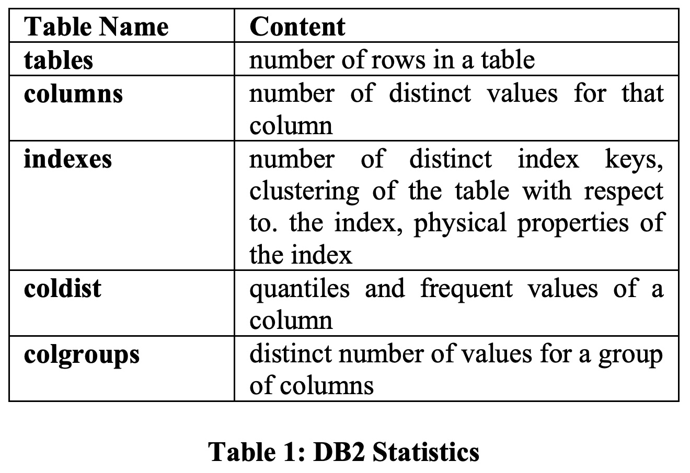
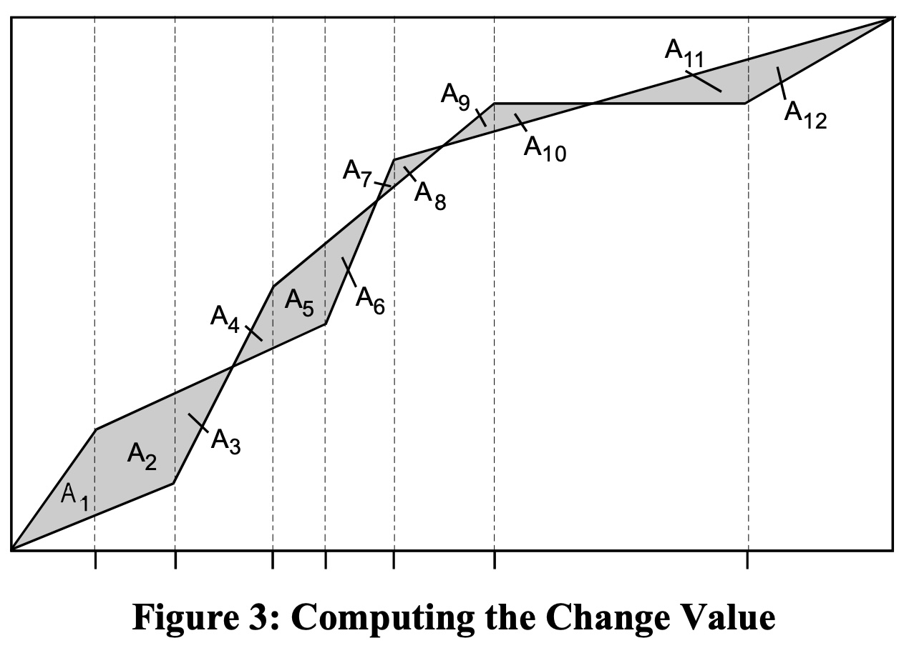
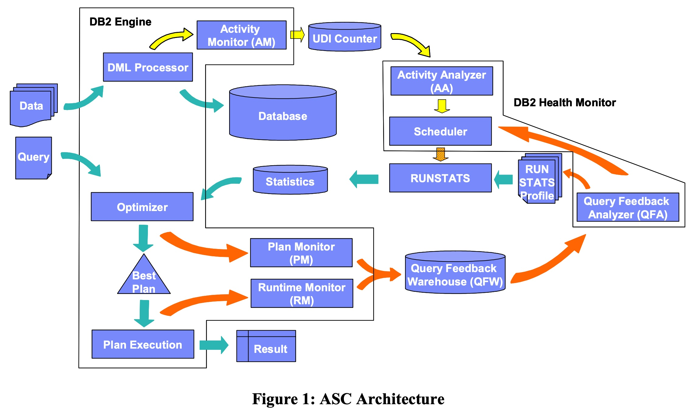
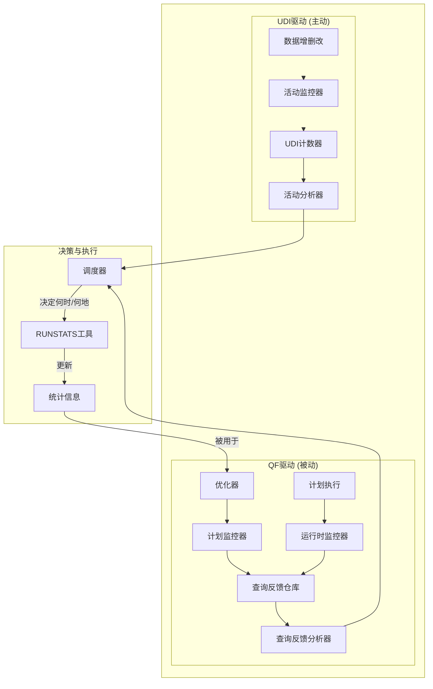
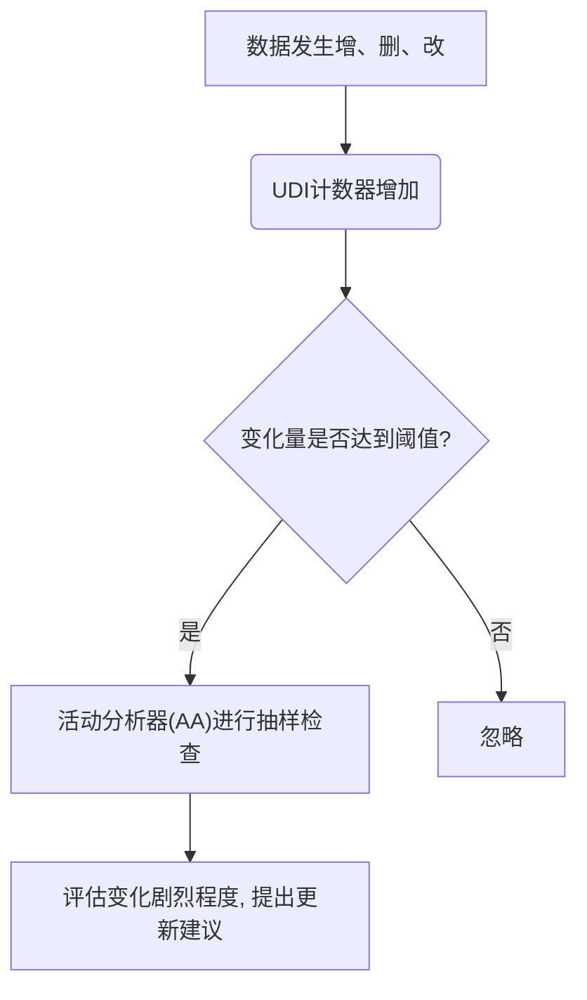
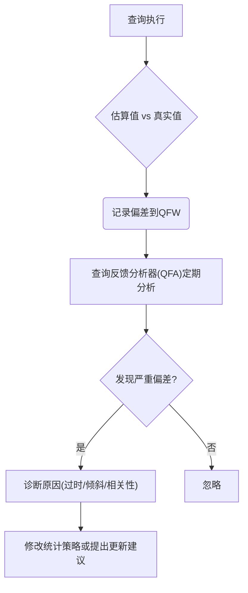
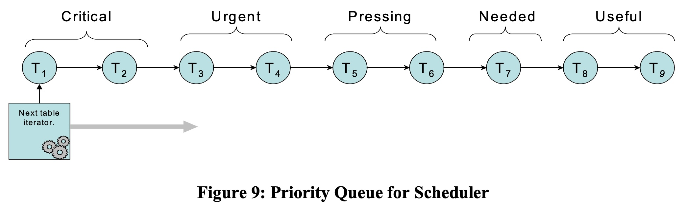
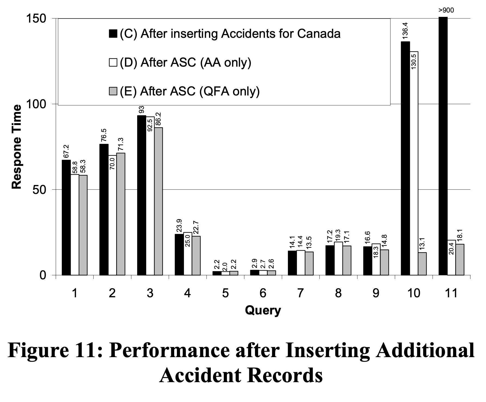
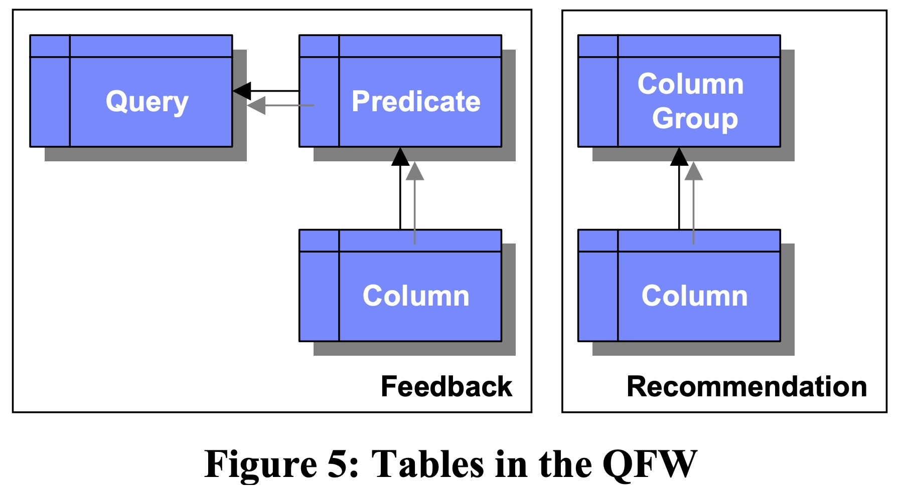
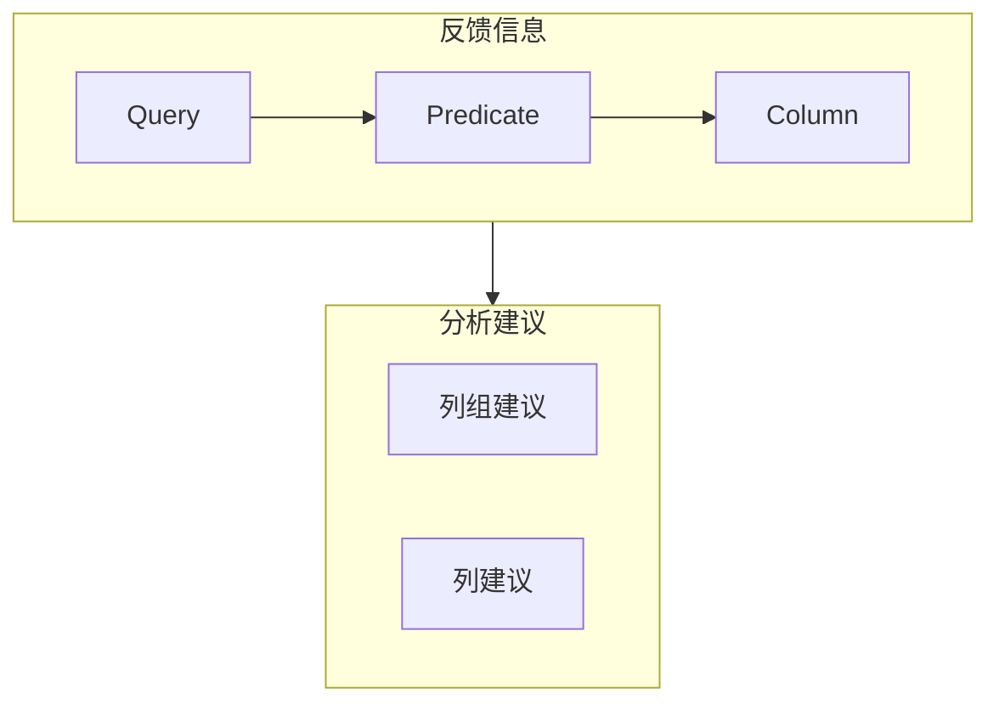

## AI论文解读 | Automated Statistics Collection In Db2 Udb
        
### 作者        
digoal        
        
### 日期        
2025-10-13        
        
### 标签        
PostgreSQL , PolarDB , DuckDB , AI , 论文解读        
        
----        
        
## 背景  
      
https://www.vldb.org/conf/2004/IND5P3.PDF        
  
提示:          
```          
读懂《Automated Statistics Collection In Db2 Udb》这篇论文需要提前掌握哪些基础知识, 请使用中文通熟易懂的讲解这些基础知识, 可以引用论文中的图、表或使用Markdown支持的图形(text,mermaid等)增加解释性. 
  
使用中文通熟易懂的解读《Automated Statistics Collection In Db2 Udb》这篇论文, 其中的关键内容请着重讲解, 可以引用论文中的图、表或使用Markdown支持的图形(text,mermaid等)增加解释性. 
  
提取《Automated Statistics Collection In Db2 Udb》这篇论文中的重要术语, 使用中文对这些术语进行通熟易懂的讲解, 可以引用论文中的图、表或使用Markdown支持的图形(text,mermaid等)增加解释性. 
```     
  
## 1 前置知识 
  
好的，为了让您能顺利读懂《Automated Statistics Collection in DB2 UDB》这篇论文，我将为您梳理和讲解所需的基础知识。这些知识主要围绕数据库如何处理查询以及为什么“统计信息”至关重要。

### 1\. 核心前提：数据库查询优化器 (Query Optimizer)

想象一下，你用导航软件从家开车去一个很远的地方，导航软件会规划出几条路线（比如走高速、走国道、抄近路），然后根据实时路况、距离、收费等信息，推荐一条“最佳路线”。

数据库中的 **查询优化器** 就扮演着类似导航软件的角色。

  * **查询 (Query)**：就是你向数据库提出的请求，例如“查找所有2023年在北京卖出的、价格高于50万的红色汽车”。
  * **执行计划 (Execution Plan)**：数据库完成这个查询可以有很多种方法。比如，它可以：
      * **方法A**：先找出所有汽车，然后筛选出红色的，再筛选出在北京卖的，再筛选价格和年份。
      * **方法B**：先找出2023年的销售记录，然后筛选出北京地区的，再关联汽车信息，最后筛选颜色和价格。
        这两种方法的效率可能天差地别。一个执行计划可能只需几秒，另一个则可能要几个小时。
  * **优化器的任务**：就是从成千上万种可能的执行计划中，挑选出它认为成本最低、速度最快的一个。论文开篇就指出，一个糟糕的执行计划会导致“无法接受的漫长查询处理时间” 。

**结论：** 优化器是数据库性能的决定性因素。整个ASC技术（论文的核心）都是为了服务好这个优化器。

### 2\. 优化器的“导航地图”：数据库统计信息 (Database Statistics)

导航软件需要地图和实时路况才能做出最佳规划。同样，查询优化器也需要“数据地图”来做决策，这个地图就是 **数据库统计信息**。

统计信息是描述数据库中数据长什么样的“元数据”，它并不关心具体每一行数据的内容，而是从宏观上进行总结。论文中的 **表1 (Table 1)**  清晰地列出了DB2使用的几种关键统计信息：   

| 统计信息存储位置 | 描述的内容  | 通俗解释 |
| :--- | :--- | :--- |
| `tables` | 表的行数 (number of rows) | 这个“汽车销售”表里总共有多少条记录？ |
| `columns` | 列的唯一值数量 (number of distinct values) | “颜色”这一列，总共有多少种不同的颜色？ |
| `coldist` | 列的分位数和最常见值 (quantiles and frequent values) | 在“颜色”列里，“红色”是不是最常见的？各种颜色的车大概各占多少比例？ |
| `colgroups` | 列组的唯一值数量 (distinct number of values for a group of columns) | “本田-雅阁”这种【品牌+型号】的组合总共有多少种？ |
| `indexes` | 索引的物理属性和聚集情况 (properties of the index) | 关于索引的统计数据，帮助判断走索引的成本。 |

**为什么重要？** 优化器严重依赖这些信息来做 **基数估计 (Cardinality Estimation)** 。

### 3\. 优化的核心技术：基数估计 (Cardinality Estimation)

**基数 (Cardinality)** 指的是一个数据集合中有多少行记录。**基数估计** 就是优化器在执行查询前，对每一步操作会产生多少行结果的“猜测”过程 。

  * **举例**：对于查询“查找所有红色的汽车”，优化器需要估计会找到多少辆。
      * 它会查看统计信息：汽车表总共有1000万行，颜色列有10个唯一值（红、黑、白...）。
      * **如果优化器假设颜色是均匀分布的**，它会估计红色汽车的数量是 1000万 / 10 = 100万。
      * **如果统计信息告诉它“红色”是个高频词，占了30%**，它就会估计有 1000万 \* 30% = 300万辆。

这个估计值至关重要。如果估计只有1万行，优化器可能会选择一种适合处理小数据量的算法；如果估计有300万行，它就会选择另一种适合处理大数据的算法。**错误的估计是导致性能灾难的主要原因** 。

### 4\. 问题的根源：统计信息为什么会“变质”？

统计信息不是实时更新的，因为它太耗费资源了。所以，当你的数据发生大量变化（比如增、删、改）后，之前收集的统计信息就会变得“过时”和“不准确” 。

  * **过时 (Outdated)**：你新进了一大批白色的车，但统计信息还认为红色车最多。
  * **不准确 (Inaccurate)**：统计信息收集的粒度不够细。例如，它只记录了最常见的10种颜色，但你的查询恰好在查第11种常见的颜色，优化器对这个颜色的数量就只能靠猜。

传统上，何时以及如何更新这些统计信息，完全依赖数据库管理员（DBA）手动操作，这是一项“繁琐且耗时”的工作 。

### 5\. 论文的解决方案：自治计算 (Autonomic Computing)

这篇论文的核心就是介绍DB2的 **自动化统计信息收集 (ASC, Automated Statistics Collection)**  技术，它是一种 **自治计算** 的实现，目标就是把DBA从繁重的维护工作中解放出来 。

ASC通过两种互补的自动化流程来决定何时、对哪些表的哪些列收集统计信息：

#### A. UDI驱动 (UDI-driven)：主动出击

这个流程像一个“巡警”，主动监控数据的变化。

  * **监控方式**：通过一个 **UDI计数器 (UDI Counter)**  记录每个表的增(Insert)、删(Delete)、改(Update)操作次数。
  * **决策逻辑**：当一个表的UDI计数达到总行数的一定比例（比如10%），ASC就认为这个表的统计信息可能过时了。
  * **进一步分析**：为了避免不必要的开销，它还会通过少量采样，分析数据分布的真实变化。论文中的 **图3 (Figure 3)**  形象地展示了这一过程：通过计算新旧数据分布曲线之间的面积 ，来量化数据变化的剧烈程度。面积越大，更新的需求越迫切。   

#### B. QF驱动 (QF-driven)：事后复盘

这个流程像一个“侦探”，通过分析已经发生的“案件”（执行得很慢的查询）来发现问题。

  * **监控方式**：它会比较查询计划中的“估计基数”和查询实际运行时的“真实基数” 。这两个值会被存放在一个叫 **查询反馈仓库 (Query Feedback Warehouse, QFW)**  的地方。
  * **决策逻辑**：如果在QFW中发现某个查询的基数估计总是错得离谱，系统就会反推出是某个或某几个列的统计信息有问题 。
  * **高级功能**：QF驱动不仅能发现过时的统计信息，还能发现更深层次的问题，比如：
      * **需要收集“最常见值”** ：某个列的数据倾斜严重，需要专门记录下那些高频出现的值 。
      * **需要收集“列组统计”** ：比如“品牌”和“型号”两列是强相关的（品牌是‘本田’，型号才可能是‘雅阁’），如果分开估计就会出错。QF驱动能发现这种**相关性 (Correlation)** ，并建议为这两列创建联合统计信息。

### 总结与架构图理解

掌握了以上知识后，我们再回头看论文中的 **图1：ASC架构图 (Figure 1: ASC Architecture)** ，就会非常清晰：   



  * **上半部分**是两条信息收集路径：**UDI驱动**  关注数据本身的变化，**QF驱动**  关注查询性能的表现。
  * **分析器 (AA 和 QFA)**  分别是两条路径的“大脑”，它们分析收集到的信息并提出建议。
  * **调度器 (Scheduler)**  是总指挥，它合并来自两方的建议，排出优先级，最终调用 **RUNSTATS**  工具在合适的时间（比如系统空闲的“维护窗口” ）去执行真正的统计信息收集工作。

简单来说，要读懂这篇论文，您只需要记住：**优化器很重要 -\> 优化器依赖统计信息 -\> 统计信息会过时 -\> ASC用“主动巡查”和“事后侦查”两种自动化手段来决定何时以及如何更新统计信息，从而让优化器始终保持高效。**
  
## 2 解读论文 
  
好的，这篇名为《Automated Statistics Collection in DB2 UDB》的论文是数据库自治管理领域的经典之作。它详细介绍了一项旨在将数据库管理员（DBA）从繁重的手动维护工作中解放出来的“黑科技”。

我将为您通俗地解读这篇论文的核心思想与关键技术。

### 论文要解决的核心问题：导航地图为什么会过时？

您可以将数据库的 **查询优化器 (Query Optimizer)** 想象成一个智能的汽车导航系统 。当您输入一个目的地（一条SQL查询）时，它会分析各种可能的路线（查询执行计划），并根据它手中的地图和实时路况（**数据库统计信息**）来选择一条最优路线 。

这个“地图和路况”——也就是统计信息——描述了数据的大致样貌，例如：

  * 一个表里有多少行数据 。
  * 某一列（比如“城市”）有多少个不重复的值 。
  * 哪些值是“热门”的（比如“北京”这个值出现的频率最高） 。

问题在于，数据库中的数据是不断变化的（增加、删除、修改），而维护这些统计信息的操作开销很大，不能实时进行 。这就导致优化器手中的“地图”会变得陈旧、不准确 。使用过时的地图进行导航，结果很可能是选择了一条极其拥堵的“慢路”，导致查询变得奇慢无比 。

在过去，何时以及如何更新这份“地图”，完全依赖DBA的经验和手动操作，这是一项非常繁琐且容易出错的工作 。

### 解决方案：ASC - 一套“自我修复”的智能系统

这篇论文提出的 **自动化统计信息收集 (ASC, Automated Statistics Collection)** 系统，就是为了解决上述问题而设计的。它的核心思想是 **“自治” (Autonomic)**，即让数据库自己学会判断何时需要更新统计信息，以及如何更新，整个过程无需人工干预 。

ASC的精髓在于它**同时采用了两种互补的策略**来监控数据库的健康状况：一种是**主动出击**，另一种是**被动学习** 。

-----

### 关键内容一：UDI驱动的主动巡查 (Proactive)

这部分策略像一个勤奋的巡警，它主动去检查数据的变化情况，防患于未然 。

1.  **监控数据变化**：系统为每张表维护了一个**UDI计数器** (Update-Delete-Insert Counter) 。每当表中的一行数据被修改、删除或插入时，这个计数器就会加一 。
2.  **触发分析**：当一个表的UDI计数值超过了该表总行数的一个阈值（例如10%）时，系统就认为这张表的“变化足够大”，需要引起注意了 。
3.  **精确分析**：为了避免不必要的开销，系统并不会立即进行全面的统计信息收集。它会先进行一次轻量级的“抽样检查”，通过分析少量数据样本来评估数据分布的真实变化程度 。论文中提到一种方法，即计算新旧数据分布曲线之间的面积（如下图3所示），面积越大，说明变化越剧烈，更新的优先级就越高 。   

这个流程可以用下面的简图来表示：



**优点**：这种方法非常主动，能够在问题查询出现之前就更新好统计信息，为未知的、新的查询做好准备 。

-----

### 关键内容二：QF驱动的被动学习 (Reactive)

这部分策略像一个事后复盘的侦探，它通过分析已经执行过的查询来发现问题，并从中学习 。

1.  **记录“犯罪现场”** ：系统会监控查询的实际执行情况。它会记录下优化器在执行前的“估算结果”（例如，认为会返回100行数据）和查询运行时的“真实结果”（例如，实际返回了100万行数据） 。这些宝贵的反馈信息被存储在一个名为**查询反馈仓库 (QFW, Query Feedback Warehouse)** 的地方 。
2.  **分析偏差**：**查询反馈分析器 (QFA, Query Feedback Analyzer)** 会定期分析QFW中的数据 。当它发现估算值和真实值之间存在巨大且频繁的偏差时，就意味着优化器的“地图”在某个区域出了严重问题 。
3.  **智能诊断与建议**：QFA不仅能发现问题，还能诊断出问题的根源，并提出具体的“治疗方案”：
      * **统计信息过时**：如果一张表的总行数估算错了，说明最基础的统计信息已经过时，需要更新 。
      * **数据倾斜问题**：如果某个查询条件（如 `color = 'red'`）的估算总是错，QFA会建议系统在收集统计信息时，专门记录下'red'这个值的出现频率（即增加“最常见值”的数量） 。
      * **列相关性问题**：这是最高级的功能。例如，查询条件是 `make = 'Honda'` AND `model = 'Accord'`。通常优化器会假设“品牌”和“型号”是独立的，分别计算它们的概率再相乘。但实际上它们是强相关的。QFA能通过分析估算偏差发现这种**相关性**，并建议系统为【品牌, 型号】这个**列组**创建一个联合统计信息，从而大幅提升估算的准确性 。

这个流程可以概括为：



**优点**：这种方法非常有针对性，能精确地解决那些对当前业务（Workload）影响最大的问题，从而高效地利用系统资源 。

-----

### 关键内容三：智能调度器 - 优先级大师

ASC系统拥有了“主动巡警”（UDI驱动）和“事后侦探”（QF驱动）两条线索来源，但最终由谁来决定先处理哪个案子呢？这就是**调度器 (Scheduler)** 的工作 。

调度器会将所有待处理的表（即需要更新统计信息的表）根据其紧迫性分为五个等级，如下图所示，形成一个优先级队列 。

  

*Figure 9: Priority Queue for Scheduler*

  * **Critical (危急)**：从未有过统计信息，或者很久没更新过的“被遗忘”的表 。
  * **Urgent (紧急)**：既被QF驱动发现有问题，数据变化又很大的表 。
  * **Pressing (紧迫)**：数据变化量极大的表（例如超过50%） 。
  * **Needed (需要)**：被QF驱动发现有问题的表 。
  * **Useful (有用)**：数据有一定变化，但不算剧烈的表 。

调度器会在系统比较空闲的“维护窗口”内，按照从“危急”到“有用”的顺序，依次对这些表执行统计信息收集 。这种机制确保了最重要、最紧急的任务总是被优先处理。

### 实验效果：ASC真的有用吗？

论文通过一个案例研究证明了ASC的强大效果。在下图（Figure 11）中：   

  * **(C) 柱状图**：在插入大量新数据后，使用旧的统计信息，查询10和11的响应时间极长，尤其是查询10，几乎无法完成 。
  * **(D) 柱状图**：仅使用UDI驱动（AA only）更新统计信息后，查询11的性能大幅提升，但查询10因为涉及复杂的列相关性问题，性能依然很差 。
  * **(E) 柱状图**：在UDI驱动的基础上，再启用QF驱动（QFA only），系统自动发现了查询10中的列相关性问题并创建了列组统计。最终，查询10的性能获得了**几个数量级的提升** 。

*Figure 11: Performance after Inserting Additional Accident Records*

这个案例完美地证明了**UDI驱动和QF驱动相结合的必要性和巨大威力** 。

### 总结

《Automated Statistics Collection in DB2 UDB》这篇论文的核心贡献在于：

1.  **提出了一套完整的自动化、自治的统计信息维护框架 (ASC)**，将DBA从繁琐的手动任务中解放出来 。
2.  **独创性地结合了UDI驱动（主动）和QF驱动（被动）两种策略**，使得系统既能为未知查询做准备，又能精确解决当前业务中的性能瓶颈 。
3.  **设计了智能的调度和优先级机制**，确保有限的维护资源总是用在最关键的表上 。
4.  **通过实验证明了该方案的有效性**，能够带来数量级的性能提升，且系统自身的开销极小 。

这套系统不仅解决了数据库管理中的一个长期痛点，也为后续数据库的“智能化”和“自动化”发展方向提供了重要的思路和范例。
  
## 3 术语 
  
好的，以下是从《Automated Statistics Collection in DB2 UDB》论文中提取的重要术语及其通俗易懂的中文讲解。

### 1\. 数据库统计信息 (Database Statistics)

  * **讲解**：
    您可以把数据库统计信息想象成一份“人口普查报告” 。它并不记录每个公民（每一行数据）的具体信息，而是从宏观上描述数据的整体分布情况 。例如，这份报告会告诉你一个城市（表）的总人口（总行数）、有多少个不同的姓氏（列的唯一值数量），以及哪些姓氏是“大姓”（最常见的值）。
  * **用途**：
    数据库的“查询优化器”会依赖这份报告来制定最高效的查询策略 。一份准确的报告能让优化器做出明智的决策，反之则可能导致灾难性的性能问题 。
  * **论文中的示例 (表1)**：    
    论文中的 **表1** 列出了DB2中的几种核心统计信息 。

| 存储位置   | 统计内容                             | 通俗解释                                       |
| :--------- | :----------------------------------- | :--------------------------------------------- |
| `tables`   | 表的行数 (number of rows)            | 这张表里总共有多少条记录？           |
| `columns`  | 列的唯一值数量 (number of distinct values) | “颜色”这一列，总共有多少种不同的颜色？  |
| `coldist`  | 列的分位数和最常见值 (quantiles and frequent values) | 在“颜色”列里，“红色”是不是最常见的？    |
| `colgroups` | 列组的唯一值数量 (distinct number of values for a group) | “本田-雅阁”这种【品牌+型号】的组合有多少种？  |

### 2\. 查询优化器 (Query Optimizer)

  * **讲解**：
    查询优化器是数据库的大脑 。当您向数据库发出一个查询请求时，优化器会分析成百上千种可能的执行方法（即“执行计划”），然后利用数据库统计信息来估算每种方法的成本（比如要读取多少数据）。最终，它会选择一个它认为成本最低、速度最快的计划去执行 。

### 3\. 基数估计 (Cardinality Estimation)

  * **讲解**：
    这是查询优化器最核心的工作之一 。**基数 (Cardinality)** 指的是一个数据集合中有多少行记录 。基数估计就是优化器在执行查询前，对每一步操作会产生多少行结果的“猜测”过程 。例如，优化器需要估计“全国所有红色的汽车”大概有多少辆。这个猜测的准确性直接决定了最终执行计划的优劣 。

### 4\. 自动化统计信息收集 (ASC - Automated Statistics Collection)

  * **讲解**：
    这是论文介绍的核心技术，一套能让数据库“自我维护”的智能系统 。它的目标是将数据库管理员(DBA)从“何时以及如何更新统计信息”这项繁琐且耗时的工作中解放出来 。ASC能自动监控数据和查询的变化，并智能地决定在何时、对哪些数据收集统计信息 。

### 5\. UDI驱动 (UDI-driven)

  * **讲解**：
    这是一种**主动式 (proactive)** 的监控策略，时刻关注数据的变化 。**UDI** 是 **Update (更新)**, **Delete (删除)**, **Insert (插入)** 的缩写 。
      * **工作原理**：系统为每张表维护一个 **UDI计数器 (UDI Counter)** 。当一张表的数据修改、删除、插入次数累计到一定程度时，ASC就会认为这张表的统计信息可能“过时”了，需要进行检查和更新 。
      * **优点**：能为未知的、新的查询提前做好准备，防患于未然 。

### 6\. QF驱动 (QF-driven)

  * **讲解**：
    这是一种**反应式 (reactive)** 的学习策略，通过分析历史查询来发现问题 。**QF** 代表 **Query Feedback (查询反馈)** 。
      * **工作原理**：系统会比较查询优化器的“估算基数”和查询实际运行时的“真实基数” 。如果两者频繁出现巨大偏差，这些信息（即查询反馈）会被记录在**查询反馈仓库 (QFW)** 中 。**查询反馈分析器 (QFA)** 会分析这些偏差，反推出是哪些统计信息出了问题，并提出改进建议 。
      * **优点**：非常有针对性，能集中资源解决对当前业务影响最大的性能瓶颈 。

### 7\. 查询反馈仓库 (QFW - Query Feedback Warehouse)

  * **讲解**：
    这是QF驱动策略的核心数据存储区，可以理解为一个“错题本” 。它以关系表的形式，详细记录了历史查询中优化器估算错误的所有细节，包括估算值、实际值、涉及的表和列等 。分析器(QFA)就是通过分析这个“错题本”来学习和改进的 。论文中的 **图5** 展示了QFW中存储信息的表结构关系 。    




*图5: QFW中的表结构示意图* 

### 8\. 调度器 (Scheduler)

  * **讲解**：
    调度器是ASC系统的总指挥 。它负责收集来自UDI驱动和QF驱动两方面的“更新建议”，然后根据一套复杂的优先级规则，对这些建议进行排序 。
  * **优先级队列**：
    论文中的 **图9** 形象地展示了这个优先级队列 。调度器将任务分为“危急(Critical)”、“紧急(Urgent)”、“紧迫(Pressing)”、“需要(Needed)”、“有用(Useful)”五个等级，确保最关键的任务能被优先处理 。    

*Figure 9: Priority Queue for Scheduler* 

### 9\. 相关性 (Correlation)

  * **讲解**：
    指两个或多个列之间的值存在关联关系 。例如，“品牌”和“型号”两列就是强相关的（品牌是‘本田’，型号才可能是‘雅阁’）。如果优化器不知道这种关系，它会假设它们是独立的，从而导致严重的基数估算错误 。QF驱动的一个高级功能就是能自动发现这种隐藏的相关性，并建议系统创建“列组统计信息”来解决这个问题 。

### 10\. 维护窗口 (Maintenance Window)

  * **讲解**：
    这是由DBA预先设定的一段时间，通常在系统负载较低的夜间或周末 。ASC的调度器会集中在这个时间窗口内执行主要的统计信息收集任务，以确保这些维护工作不会影响到正常的业务运行 。
  
## 参考        
         
https://www.vldb.org/conf/2004/IND5P3.PDF    
        
<b> 以上内容基于DeepSeek、Qwen、Gemini及诸多AI生成, 轻微人工调整, 感谢杭州深度求索人工智能、阿里云、Google等公司. </b>        
        
<b> AI 生成的内容请自行辨别正确性, 当然也多了些许踩坑的乐趣, 毕竟冒险是每个男人的天性.  </b>        
    
#### [期望 PostgreSQL|开源PolarDB 增加什么功能?](https://github.com/digoal/blog/issues/76 "269ac3d1c492e938c0191101c7238216")
  
  
#### [PolarDB 开源数据库](https://openpolardb.com/home "57258f76c37864c6e6d23383d05714ea")
  
  
#### [PolarDB 学习图谱](https://www.aliyun.com/database/openpolardb/activity "8642f60e04ed0c814bf9cb9677976bd4")
  
  
#### [PostgreSQL 解决方案集合](../201706/20170601_02.md "40cff096e9ed7122c512b35d8561d9c8")
  
  
#### [德哥 / digoal's Github - 公益是一辈子的事.](https://github.com/digoal/blog/blob/master/README.md "22709685feb7cab07d30f30387f0a9ae")
  
  
#### [About 德哥](https://github.com/digoal/blog/blob/master/me/readme.md "a37735981e7704886ffd590565582dd0")
  
  

  
