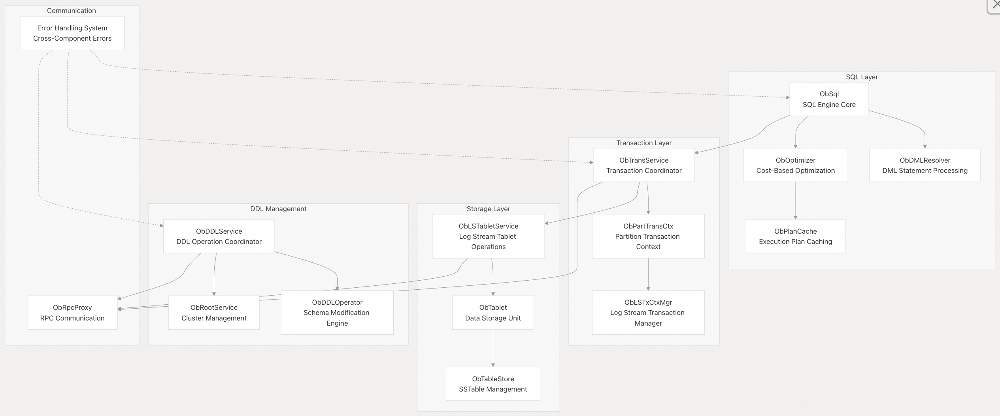
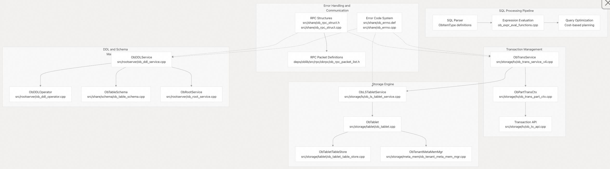

## 体系化剖析开源OB代码: 1 设计蓝图   
                                              
### 作者                                              
digoal                                              
                                              
### 日期                                              
2025-10-13                                             
                                              
### 标签                                              
PostgreSQL , PolarDB , DuckDB , MySQL , OceanBase                    
                                              
----                                              
                                              
## 背景          
作为兼容MySQL的国产开源分布式数据库, 大家耳熟能详的代表产品有OceanBase、PolarDB-X、TiDB(结合个人感官同时参考Qwen3-Max的回复). 这几个产品各有千秋, TiDB开源最早, PolarDB-X最接近MySQL(DN模块基于MySQL二次开发), OceanBase以100%全自研著称.   
  
市面上的文案以宣传这些产品的解决方案居多, 官方文档则主要面向DBA和应用开发者. 从代码角度分析这些产品原理的则相对较少. 正好借着AI, 体系化剖析一下OB代码.   
  
第一篇, 从蓝图开始.   
  
# 体系化剖析开源OB代码: 1 蓝图  
本文将全面概述 OceanBase。OceanBase 是一款专为高可用性、可扩展性和 ACID 合规性而设计的分布式关系数据库系统。OceanBase 采用无共享(shared-nothing)架构，具备分布式存储、事务管理和 SQL 处理能力。  
  
OB系统围绕几个核心子系统构建，包括 SQL 处理、分布式存储引擎、事务管理、DDL 操作和系统配置管理。  
  
## 系统架构概述  
OceanBase 遵循分层架构，SQL 处理、事务协调和分布式存储之间有明确的分离：  
  
  
  
**源文件:**  
- https://github.com/oceanbase/oceanbase/blob/8e2580cf/src/rootserver/ob_ddl_service.cpp#L105-L146
- https://github.com/oceanbase/oceanbase/blob/8e2580cf/src/storage/tx/ob_trans_part_ctx.cpp#L61-L176
- https://github.com/oceanbase/oceanbase/blob/8e2580cf/src/storage/ls/ob_ls_tablet_service.cpp#L69-L117
- https://github.com/oceanbase/oceanbase/blob/8e2580cf/src/share/ob_rpc_struct.h#L14-L108
  
## 核心组件架构  
下图将主要的系统组件“SQL 处理、分布式存储引擎、事务管理、DDL 操作”映射到它们的代码实体：  
  
  
  
**源文件:**  
- https://github.com/oceanbase/oceanbase/blob/8e2580cf/src/objit/include/objit/common/ob_item_type.h#L21-L90
- https://github.com/oceanbase/oceanbase/blob/8e2580cf/src/sql/engine/expr/ob_expr_eval_functions.cpp#L13-L103
- https://github.com/oceanbase/oceanbase/blob/8e2580cf/src/storage/tx/ob_trans_service_v4.cpp#L26-L57 
- https://github.com/oceanbase/oceanbase/blob/8e2580cf/src/share/ob_errno.def#L32-L103
- https://github.com/oceanbase/oceanbase/blob/8e2580cf/deps/oblib/src/rpc/obrpc/ob_rpc_packet_list.h#L23-L43
  
## 关键组件交互模式  
OceanBase 在其主要组件之间实现了几个关键的交互模式：  
  
### 交易处理流程  
事务系统通过由 `ObPartTransCtx` 实现和 `ObTransService` 管理的两阶段提交协议协调跨多个存储节点的分布式操作。每个事务上下文都维护保证 ACID 的状态，同时通过 `ObLSTabletService` 与存储层协调。  
  
### DDL 操作协调  
schema 模式变更由 `ObDDLService` 操作，并与 `ObRootService` 协调进行集群范围的操作。系统使用 `ObDDLOperator` 修改存储在 `ObSchema` 及其子类结构中的模式定义，并通过 `ob_rpc_struct.h` 中定义的 RPC 系统进行传递。  
  
### 存储层组织  
存储引擎围绕由 `ObLSTabletService` 管理的 `ObTablet` 实例构建。每个 `tablet` 包含 `ObTabletTableStore` 组织的数据，该数据由 `ObTenantMetaMemMgr` 进行内存管理。该架构支持基于行和列的存储格式。  
  
### 错误处理和通信  
系统通过集中式错误代码系统（定义于 `ob_errno.def`）实现了全面的错误处理，该系统包含超过 10,000 个错误代码，涵盖所有子系统。分布式组件之间的通信使用 `ob_rpc_struct.h` 中定义的 RPC 结构，数据包定义于 `ob_rpc_packet_list.h` 。  
  
**源文件:**  
- https://github.com/oceanbase/oceanbase/blob/8e2580cf/src/storage/tx/ob_trans_part_ctx.h#L47-L47
- https://github.com/oceanbase/oceanbase/blob/8e2580cf/src/rootserver/ob_ddl_service.h#L105-L117
- https://github.com/oceanbase/oceanbase/blob/8e2580cf/src/storage/tablet/ob_tablet.h#L86-L99
- https://github.com/oceanbase/oceanbase/blob/8e2580cf/src/share/ob_errno.def#L1-L31
- https://github.com/oceanbase/oceanbase/blob/8e2580cf/src/share/ob_rpc_struct.h#L121-L136
  
## 系统能力  
OceanBase 提供企业级数据库能力，包括：  
- 分布式 SQL 处理：完整的 SQL 支持，具有基于成本的优化和计划缓存  
- ACID 事务：完全符合分布式两阶段提交协议的 ACID  
- 高可用性：跨节点的自动故障转移和数据复制  
- 水平扩展：具有自动负载均衡的动态集群扩展  
- schema模式演进：在线 DDL 操作，服务中断少  
- 多租户：多租户的资源隔离和管理  
- 灾难恢复：时间点恢复和跨区域复制  
  
OB旨在处理具有强大一致性保证的关键任务工作负载，同时在分布式环境中保持高性能和可用性。  
  
**源文件:**  
- https://github.com/oceanbase/oceanbase/blob/8e2580cf/src/sql/ob_sql_trans_control.cpp#L1-L11
- https://github.com/oceanbase/oceanbase/blob/8e2580cf/src/storage/tx/ob_trans_define_v4.h#L1-L11
- https://github.com/oceanbase/oceanbase/blob/8e2580cf/src/rootserver/ob_root_service.cpp#L15-L64
    
#### [期望 PostgreSQL|开源PolarDB 增加什么功能?](https://github.com/digoal/blog/issues/76 "269ac3d1c492e938c0191101c7238216")
  
  
#### [PolarDB 开源数据库](https://openpolardb.com/home "57258f76c37864c6e6d23383d05714ea")
  
  
#### [PolarDB 学习图谱](https://www.aliyun.com/database/openpolardb/activity "8642f60e04ed0c814bf9cb9677976bd4")
  
  
#### [PostgreSQL 解决方案集合](../201706/20170601_02.md "40cff096e9ed7122c512b35d8561d9c8")
  
  
#### [德哥 / digoal's Github - 公益是一辈子的事.](https://github.com/digoal/blog/blob/master/README.md "22709685feb7cab07d30f30387f0a9ae")
  
  
#### [About 德哥](https://github.com/digoal/blog/blob/master/me/readme.md "a37735981e7704886ffd590565582dd0")
  
  

  
