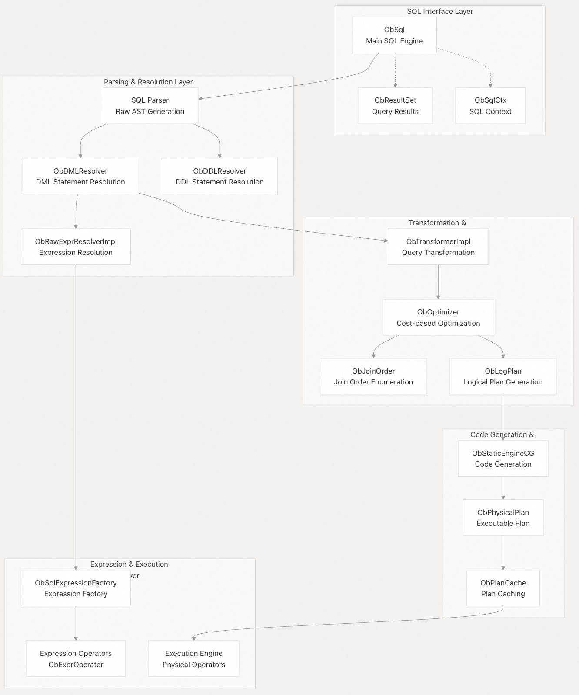
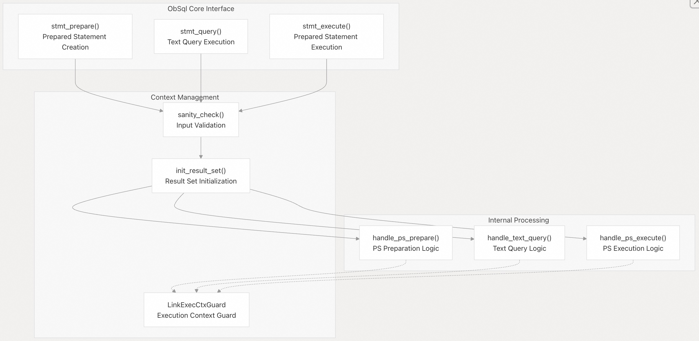
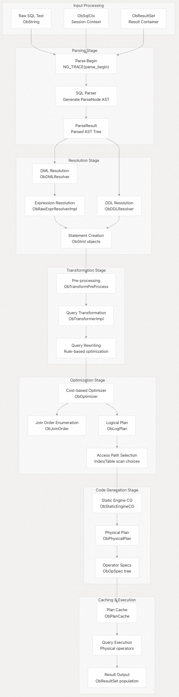
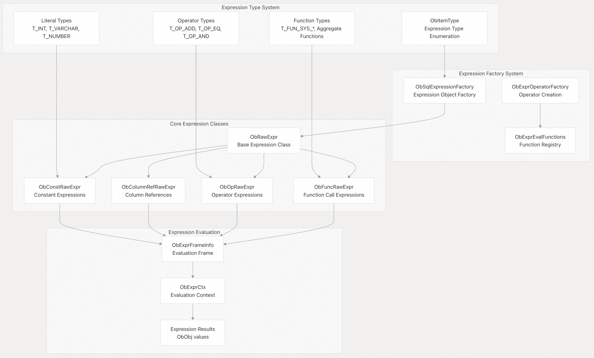
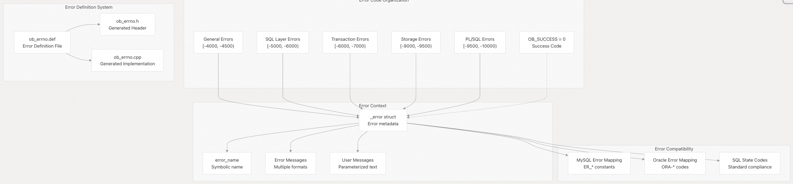
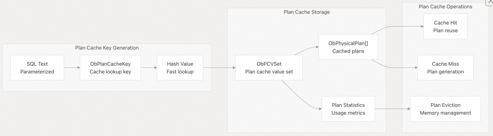

## 体系化剖析开源OB代码: 2 SQL 处理系统     
                                                
### 作者                                                
digoal                                                
                                                
### 日期                                                
2025-10-13                                               
                                                
### 标签                                                
PostgreSQL , PolarDB , DuckDB , MySQL , OceanBase                      
                                                
----                                                
                                                
## 背景            
SQL 处理系统是 OceanBase 中负责解析、优化和执行 SQL 语句的核心组件。涵盖了从原始 SQL 文本解析到执行的完整 SQL 处理流水线，包括查询解析、语义分析、优化、计划缓存和执行。该系统同时处理标准 SQL 语句和预处理语句(prepared statement)，并支持 MySQL 和 Oracle 兼容模式。  
  
## 架构概述  
SQL 处理系统遵循分层架构，其中 SQL 语句在执行之前要经过多个处理阶段：  
  
    
  
**源文件:**  
- https://github.com/oceanbase/oceanbase/blob/8e2580cf/src/sql/ob_sql.cpp#L132-L152
- https://github.com/oceanbase/oceanbase/blob/8e2580cf/src/sql/engine/ob_physical_plan.h#L60-L150
- https://github.com/oceanbase/oceanbase/blob/8e2580cf/src/sql/plan_cache/ob_plan_cache.cpp#L28-L40
  
## 核心 SQL 引擎  
`ObSql` 类是所有 SQL 处理操作的入口点。它为不同类型的 SQL 执行提供了三个主要接口：  
  
    
  
`ObSql` 类维护几个关键组件：  
- `opt_stat_mgr_` ：基于成本优化的统计管理器  
- `transport_` ：用于分布式执行的 RPC 传输  
- `vt_partition_service_` ：虚拟表分区服务  
- `rs_mgr_` ：用作集群协调的根服务管理器  
  
**源文件:**  
- https://github.com/oceanbase/oceanbase/blob/8e2580cf/src/sql/ob_sql.cpp#L59-L89
- https://github.com/oceanbase/oceanbase/blob/8e2580cf/src/sql/ob_sql.h#L27-L50
  
## SQL处理管道  
SQL 处理管道通过多个阶段将原始 SQL 文本最终生成可执行计划：  
  
    
  
管道中的关键处理方法：  
- `handle_text_query()` ：SQL 文本查询处理的主入口点  
- `fill_result_set()` ：使用字段元数据和执行计划填充结果集  
- `sanity_check()` ：验证输入参数和系统状态  
  
**源文件:**  
- https://github.com/oceanbase/oceanbase/blob/8e2580cf/src/sql/ob_sql.cpp#L154-L201
- https://github.com/oceanbase/oceanbase/blob/8e2580cf/src/sql/ob_sql.cpp#L254-L400
  
## 表达式系统  
表达式系统通过全面的类型系统和评估框架(表达式计算)处理所有 SQL 表达式：  
  
    
  
表达式类型系统包括 2000 多种不同的表达式类型，涵盖：  
- 基本数据类型（`T_NULL`，`T_INT`，`T_VARCHAR`，`T_NUMBER`）  
- 算术运算符（`T_OP_ADD`, `T_OP_MINUS`, `T_OP_MUL`, `T_OP_DIV`）  
- 比较运算符（`T_OP_EQ`, `T_OP_LT`, `T_OP_GT`, `T_OP_LIKE`）  
- 系统函数（`T_FUN_SYS_SUBSTR`、`T_FUN_SYS_UPPER`、`T_FUN_SYS_COUNT`）  
- 聚合函数（`T_FUN_MAX`、`T_FUN_MIN`、`T_FUN_SUM`、`T_FUN_AVG`）  
  
**源文件:**  
- https://github.com/oceanbase/oceanbase/blob/8e2580cf/src/objit/include/objit/common/ob_item_type.h#L21-L2000
- https://github.com/oceanbase/oceanbase/blob/8e2580cf/src/sql/engine/expr/ob_expr_eval_functions.cpp#L1-L50
- https://github.com/oceanbase/oceanbase/blob/8e2580cf/src/sql/engine/expr/ob_expr_operator_factory.cpp#L14-L30
  
## 错误处理框架  
OceanBase 实现了完善的错误处理体系，错误码超过 10000 个，按功能域组织如下：  
  
    
  
关键错误处理组件：  
- 按子系统划分错误代码的范围，以避免冲突  
- 每个错误都包含与 MySQL 和 Oracle 兼容的错误代码和消息  
- 错误消息支持动态上下文信息的参数化  
- SQL 状态码支持标准 SQL 错误分类  
  
常见SQL处理错误代码：  
- `OB_ERR_PARSE_SQL`（-5000）：SQL parsing 错误  
- `OB_ERR_RESOLVE_SQL`（-5001）：SQL resolution 错误  
- `OB_ERR_GEN_PLAN`（-5002）：计划生成错误  
- `OB_TIMEOUT`（-4012）：查询超时错误  
  
**源文件:**  
- https://github.com/oceanbase/oceanbase/blob/8e2580cf/src/share/ob_errno.def#L1-L100
- https://github.com/oceanbase/oceanbase/blob/8e2580cf/src/share/ob_errno.h#L12-L50
- https://github.com/oceanbase/oceanbase/blob/8e2580cf/src/share/ob_errno.cpp#L40-L100
- https://github.com/oceanbase/oceanbase/blob/8e2580cf/deps/oblib/src/lib/ob_errno.h#L20-L150
  
## 执行计划缓存集成  
SQL 处理系统与计划缓存紧密集成，以实现高效的计划重用：  
  
    
  
计划缓存系统提供：  
- SQL 参数化，支持类似 Query 的计划重用  
- 采用多版本计划存储支持 schema 模式的演化  
- 根据内存压力和使用样式自动驱逐计划缓存  
- 收集 plan 统计信息用于性能监控  
  
**源文件:**  
- https://github.com/oceanbase/oceanbase/blob/8e2580cf/src/sql/plan_cache/ob_plan_cache.cpp#L200-L300
- https://github.com/oceanbase/oceanbase/blob/8e2580cf/src/sql/plan_cache/ob_plan_cache_value.cpp#L20-L100
- https://github.com/oceanbase/oceanbase/blob/8e2580cf/src/sql/plan_cache/ob_sql_parameterization.cpp#L30-L80
  
## 与事务解绑的语句级路由支持  
SQL 处理系统支持对Transaction-Free事务解绑的语句级路由特殊处理，允许在临时节点上执行某些语句：  
  
Transaction-Free 仅支持特定语句类型：  
- DML 语句（`SELECT`，`INSERT`，`UPDATE`，`DELETE`）  
- 变量集操作（`SET` 命令）  
- 数据库使用操作（`USE DATABASE`）  
- prepared statement 操作（启用时）  
  
系统通过`CHECK_STMT_SUPPORTED_BY_TXN_FREE_ROUTE`宏来验证 Transaction-Free 路由兼容性，从而确保：  
- 该语句类型在允许列表中  
- 物理计划不包含数据库链接  
- 会话已正确配置将要执行的临时节点  
      
**源文件:**  
- https://github.com/oceanbase/oceanbase/blob/8e2580cf/src/sql/ob_sql.cpp#L102-L129
- https://github.com/oceanbase/oceanbase/blob/8e2580cf/src/sql/ob_sql.cpp#L144-L178
- https://github.com/oceanbase/oceanbase/blob/8e2580cf/src/sql/ob_sql.cpp#L228-L240
  
#### [期望 PostgreSQL|开源PolarDB 增加什么功能?](https://github.com/digoal/blog/issues/76 "269ac3d1c492e938c0191101c7238216")
  
  
#### [PolarDB 开源数据库](https://openpolardb.com/home "57258f76c37864c6e6d23383d05714ea")
  
  
#### [PolarDB 学习图谱](https://www.aliyun.com/database/openpolardb/activity "8642f60e04ed0c814bf9cb9677976bd4")
  
  
#### [PostgreSQL 解决方案集合](../201706/20170601_02.md "40cff096e9ed7122c512b35d8561d9c8")
  
  
#### [德哥 / digoal's Github - 公益是一辈子的事.](https://github.com/digoal/blog/blob/master/README.md "22709685feb7cab07d30f30387f0a9ae")
  
  
#### [About 德哥](https://github.com/digoal/blog/blob/master/me/readme.md "a37735981e7704886ffd590565582dd0")
  
  

  
