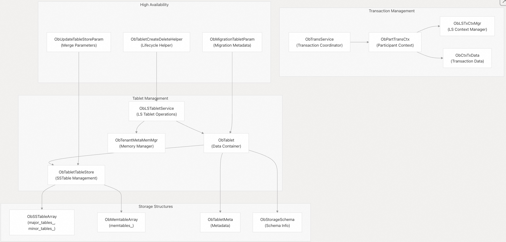
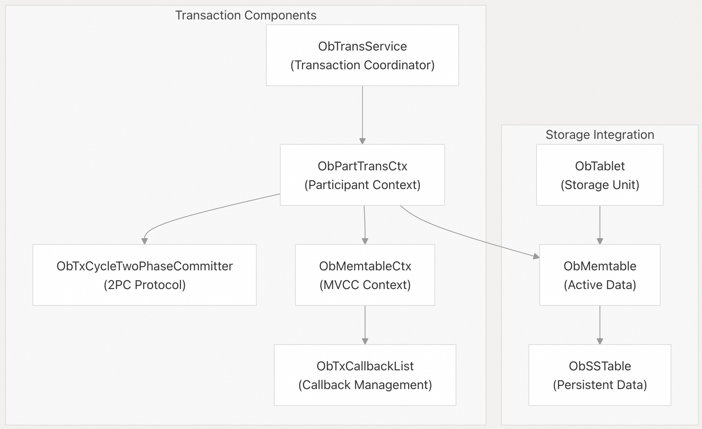
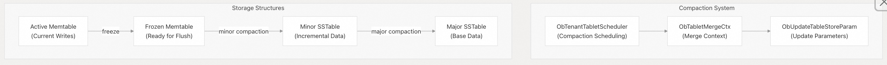
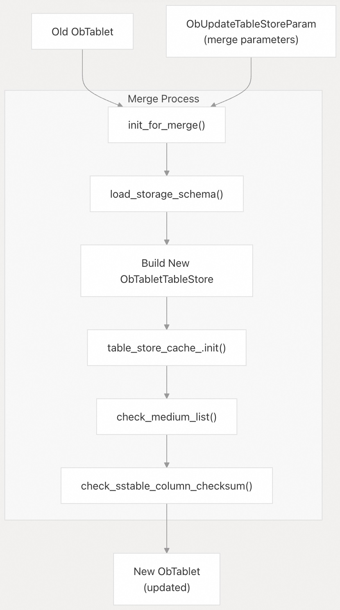
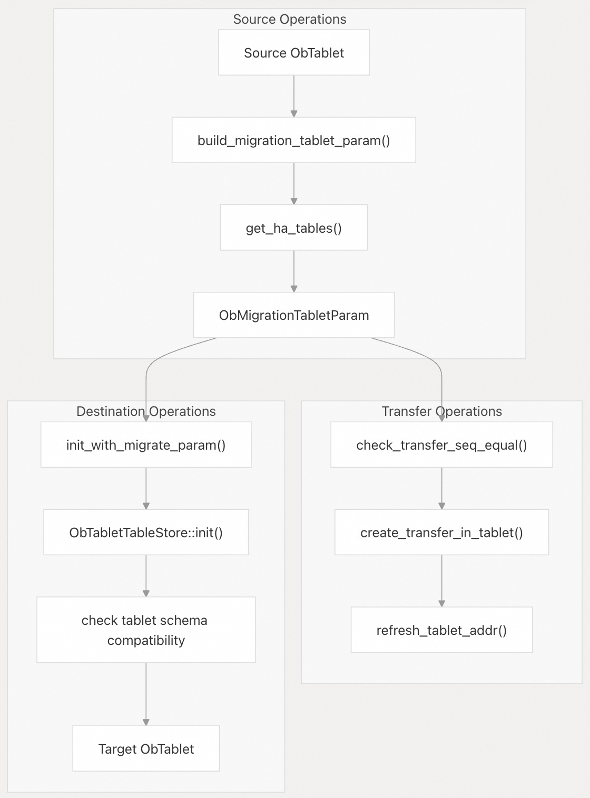
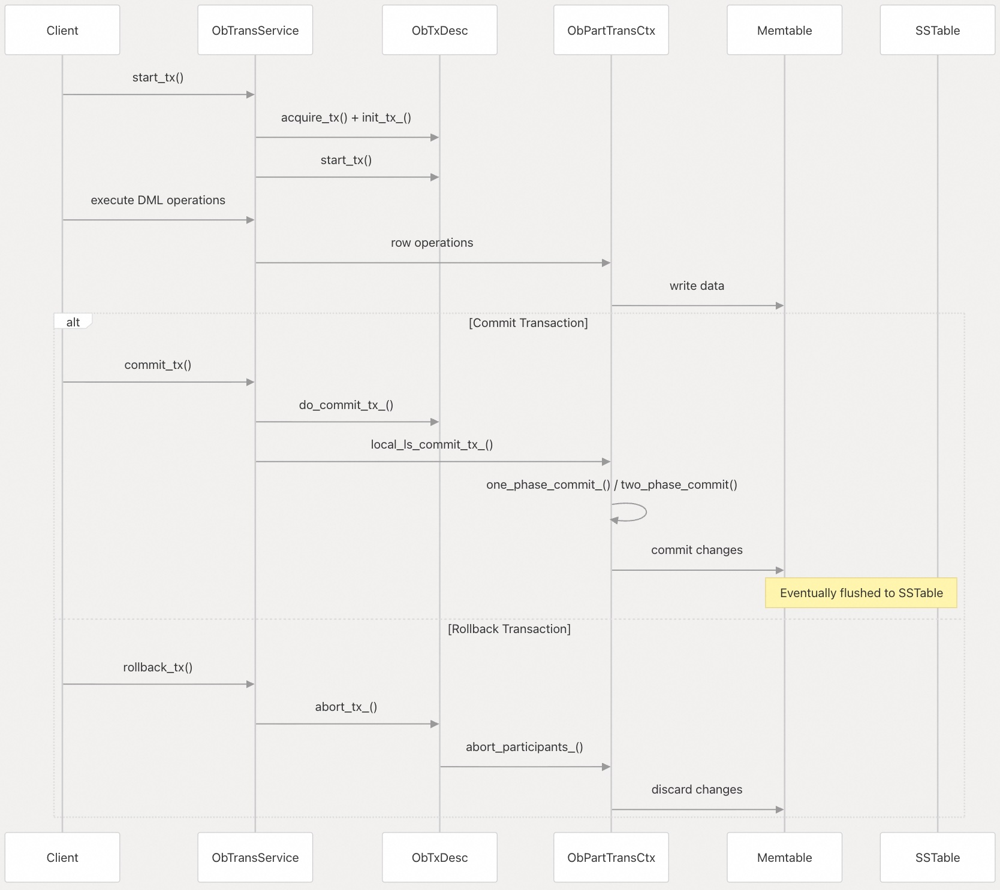
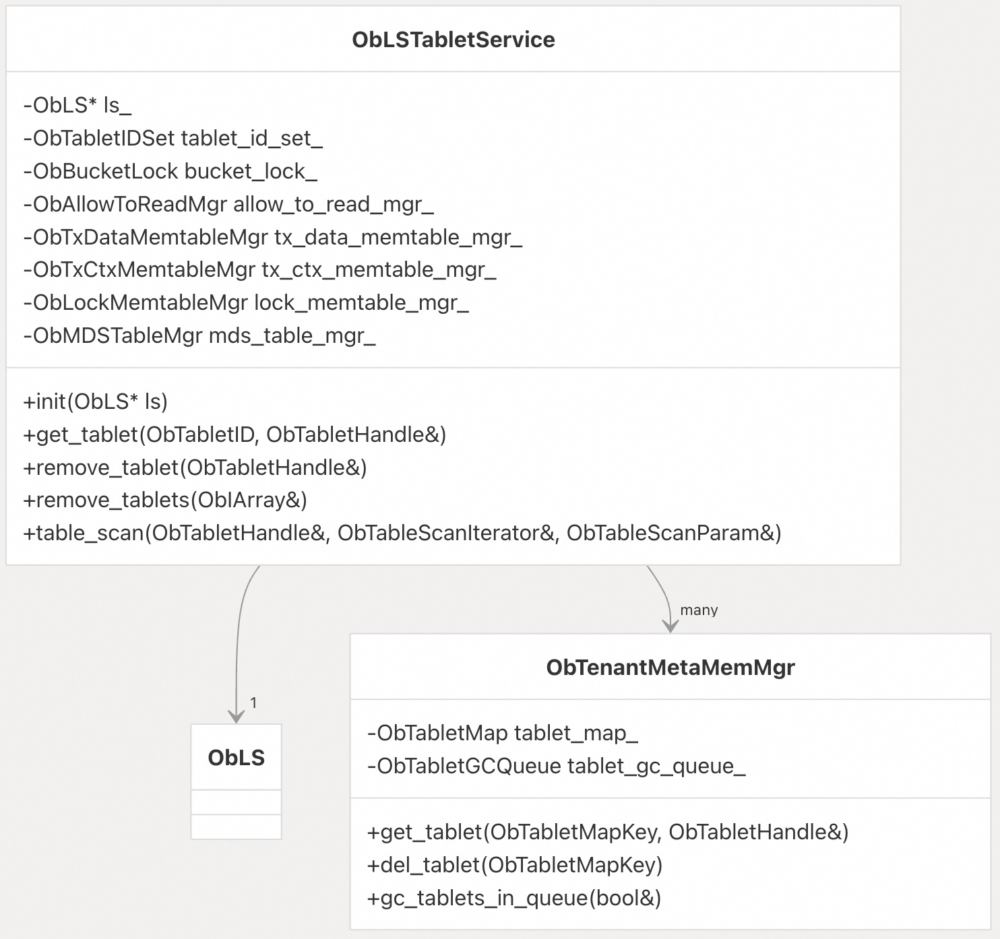
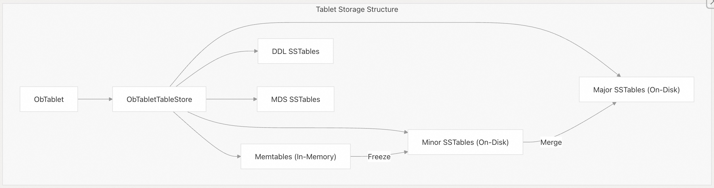

## 体系化剖析开源OB代码: 3 存储引擎      
                                                  
### 作者                                                  
digoal                                                  
                                                  
### 日期                                                  
2025-10-13                                                 
                                                  
### 标签                                                  
PostgreSQL , PolarDB , DuckDB , MySQL , OceanBase                        
                                                  
----                                                  
                                                  
## 背景              
OceanBase 存储引擎提供分布式存储、事务管理和数据持久化服务。该引擎以 Tablet（`ObTablet`）为基本存储单元，通过日志流（`ObLS`）进行管理，并通过复杂的事务系统进行协调。  
  
## 架构概述  
存储引擎架构包括四个关键子系统.   
  
核心存储架构:   
  
  
  
## 事务管理  
事务系统使用两阶段提交协议管理跨 Tablet 的分布式 ACID 事务。核心组件负责处理事务生命周期、并发控制和一致性保证。  
  
### 事务架构  
事务处理流程:   
  
  
  
### 事务上下文管理  
相关代码: src/storage/tx/ob_trans_part_ctx.cpp  
  
`ObPartTransCtx` 类管理每个参与 `tablet` 内的事务状态：  
  
函数	| 用途  
---|---  
`init()`	| 初始化事务上下文	  
`start_trans()`	| 开始交易处理	  
`commit()`	| 执行提交协议	  
`handle_timeout()`	| 管理事务超时	  
`trans_kill_()`	| 强制中止交易	  
`trans_clear_()`	| 清理交易状态	  
  
上下文维护的关键状态包括：  
- `mt_ctx_` ：MVCC 操作相关的 Memtable 上下文  
- `ctx_tx_data_` ：事务提交/终止信息  
- `exec_info_` ：执行元数据，包括参与者列表  
- `mds_cache_` ：多数据源操作缓存  
  
### 两阶段提交协议  
对于分布式事务，系统要用到 `ObTxCycleTwoPhaseCommitter` 来处理如下动作 ：  
- 1、准备阶段：参与者准备提交并投票  
- 2、提交/中止阶段：协调员做出最终决定  
- 3、清理：释放资源并通知参与者  
  
该协议确保跨多个 `tablets` 的原子性，并通过超时管理和重试机制处理故障情况。  
  
  
## Tablet 管理  
Tablet 是基本存储单元, 在每个日志流内部通过 `ObLSTabletService` 进行管理。每个 Tablet 维护自己的存储结构和元数据。  
  
### Tablet 核心结构  
`ObTablet` 内部组织架构. `ObTablet` 的主要成员包括：  
- `wash_score_` ：用于内存管理和 tablet 驱逐  
- `pointer_hdl_` ：管理 tablet 指针  
- `allocator_` ：tablet 的内存分配器  
- `log_handler_` ：与事务日志系统集成  
  
### Tablet 生命周期操作  
`ObLSTabletService` 提供 Tablet 管理操作：  
  
操作	| 方法	|用途  
---|---|---  
Create	| `create_tablet()`	| 使用schema模式初始化新的 tablet  
Access	| `get_tablet()`	| 接受相关的tablet handle以进行访问操作  
Update	| `update_tablet_table_store()`	| 修改 tablet 存储结构  
Remove	| `remove_tablet()/remove_tablets()`	| 删除 tablet 并清理  
Migrate	| `create_transfer_in_tablet()`	| 处理 tablet 迁移  
  
### Tablet初始化过程  
Tablets 支持不同场景的多种初始化模式：  
  
初始化类型	| 方法	| 目的	| 关键参数  
---|---|---|---  
首次创建	| `init_for_first_time_creation()`	| 创建新的 tablet | 	`ObCreateTabletSchema`，`need_create_empty_major_sstable`  
Merge 操作	| `init_for_merge()`	| Post-compaction 更新	| `ObUpdateTableStoreParam`  
迁移	| `init_with_migrate_param()`	| 跨节点迁移	| `ObMigrationTabletParam`，`is_transfer` flag  
SSTable 替换	| `init_for_sstable_replace()`	| 批量 SSTable 更新	| `ObBatchUpdateTableStoreParam`  
Medium Update	| `init_with_update_medium_info()`	| Medium compaction info update	| Medium info changes  
MDS SSTable	| `init_with_mds_sstable()`	| MDS 表集成 | 	`mds_flush_scn`，MDS SSTable  
  
每个初始化方法处理：  
- 通过 `ObArenaAllocator` 分配内存  
- 通过 `inner_inc_macro_ref_cnt()` 对宏块进行引用计数  
- 通过 `table_store_cache_.init()` 初始化表存储缓存  
- 通过 `check_tablet_schema_mismatch()` 检查 schema 兼容性  
  
  
## 存储压缩(Compaction)  
存储系统采用多级压缩策略来优化存储布局和查询性能。压缩将多个 SSTable 合并为更少、更大的表。  
  
### 压缩架构  
存储层组织如下:   
  
  
  
### 表存储管理  
`ObTabletTableStore` 管理不同类型的存储结构：  
  
SSTable 类型 |	作用	| 管理行为  
---|---|---  
Major Tables	| 基础数据快照	| 重大压缩/迁移  
Minor Tables	| 数据增量变化	| 内存表冻结/轻微压缩  
DDL 表	| schema 变更数据	| DDL 操作  
MDS 表	| Multi-data source info	| MDS 刷新操作  
  
### 压缩操作  
通过多种 tablet 方法和表存储操作来处理压缩的具体行为：  
  
压缩合并处理流程如下:  
  
  
  
压缩合并过程包括：  
- schema 同步：`ObStorageSchemaUtil::update_tablet_storage_schema()` 处理 schema 演变  
- 表存储构建：使用合并后的 SSTables 新建 `ObTabletTableStore`  
- medium信息管理：`tablet_meta_.update_extra_medium_info()` 跟踪压缩进度  
- 引用管理：`inner_inc_macro_ref_cnt()` 管理宏块生命周期  
- 验证：多重检查确保合并后的 tablet 完整性  
  
  
## 高可用性和数据恢复  
该系统通过 Tablet 迁移、数据传输和恢复功能提供全面的高可用性。这些操作确保了数据的持久性和服务的连续性。  
  
### HA 架构组件  
高可用相关组件如下:  
  
  
  
关键 HA 组件包括：  
- 迁移参数生成器：`build_migration_tablet_param()` 收集 tablet 元数据, 生成相关迁移参数  
- 传输步骤验证：`check_transfer_seq_equal()` 确保迁移的具体操作顺序  
- 模式兼容性：`check_tablet_schema_mismatch()` 验证 schema 兼容性  
- 原子更新：`ObTenantStorageMetaService` 提供元数据原子更新  
  
### 迁移和转移操作  
由专门的初始化方法支持 tablet 的多种 HA 操作：  
  
操作	| 方法	| 用例  
---|---|---  
迁移	| `init_with_migrate_param()`	| 在节点之间移动 tablet  
转移		| `create_transfer_in_tablet()`	| 转入不同的LS  
恢复		| `build_migration_tablet_param()`	| 从备份还原  
重建		| `get_ha_tables()`	| 从源重建副本  
  
### HA 期间的数据一致性  
HA 系统通过以下方式维护数据一致性：  
- 1、传输步骤验证：`check_transfer_seq_equal()` 确保操作作用于正确的 `tablet` 版本  
- 2、schema 兼容性：在迁移期间验证 schema 的兼容性  
- 3、SSTable 验证：检查 SSTable 完整性和列的checksum  
- 4、原子操作：使用`ObTenantStorageMetaService` 保证元数据的原子更新  
  
### 恢复和重建过程  
恢复过程涉及多个步骤, 并依赖专门的参数结构协调：  
- 1、参数构建：`build_migration_tablet_param()` 收集 tablet 元数据  
- 2、SSTable 迁移：`build_migration_sstable_param()` 处理 SSTable 传输  
- 3、schema 迁移：确保 schema 兼容性  
- 4、初始化：`init_with_migrate_param()` 在目标端创建 tablet  
- 5、验证：验证 tablet 的完整性和就绪情况  
  
## 事务管理系统  
事务管理系统确保数据库操作的 ACID 属性，处理跨多个 tablet 和节点的分布式事务。  
  
### 事务处理流程  
  
  
  
### 事务上下文和描述  
事务由 `ObTxDesc` 和 `ObPartTransCtx` 类表示：  
- `ObTxDesc` ：表示会话级事务描述符，维护事务的元数据。  
- `ObPartTransCtx` ：表示参与者事务上下文，管理特定 tablet 内的事务状态。  
  
事务流程涉及：  
- 1、事务开始：客户端通过 `start_tx()` 启动事务，从而创建事务描述符。  
- 2、事务操作：对内存表中的数据进行修改。  
- 3、事务结束：事务通过 `commit_tx()` 提交或通过 `rollback_tx()` 回滚。  
  
对于分布式事务，OceanBase 采用 `ObTxCycleTwoPhaseCommitter` 两阶段提交协议来确保多个参与者之间的一致性。  
  
### 隔离级别  
OceanBase支持多种事务隔离级别，定义在 `ObTxIsolationLevel` ：  
  
隔离级别	| 值	 | 描述  
---|---|---  
读未提交	| 0	| 事务可以读取其他未提交事务的数据  
读已提交	| 1	| 事务只能读取其他已提交事务的数据  
可重复读	| 2	| 事务在整个执行过程中读取一致的数据(事务开始时已提交的数据)  
串行化	| 3	| 事务彼此完全隔离  
  
  
## LS Tablet 服务  
LogStream Tablet Service（`ObLSTabletService`）管理 LogStream 中的 tablet，提供 tablet 创建、访问和删除操作。  
  
### 关键组件和服务  
  
  
  
### Tablet 生命周期操作  
`ObLSTabletService` 提供全面的 Tablet 管理操作：  
  
操作类别	| 方法	| 主要功能  
---|---|---  
Creation |	`create_tablet()`，`batch_create_tablets()`	| 使用 schema 初始化新的 tablet  
Access |	`get_tablet()`	| 访问具有超时和 MDS 模式支持的 tablet 句柄  
Modification |	`update_tablet_table_store()`	| post-compaction 后更新存储结构  
Removal |	`remove_tablet()`，`remove_tablets()`	| 删除 单个/批量 tablet 并进行清理  
Migration |	`create_transfer_in_tablet()`，`migrate_update_tablet()`	 | Cross-LS tablet 传输操作  
HA 操作 |	`build_ha_tablet_new_table_store()`	| 高可用 tablet 重建  
  
  
tablet 访问模式如下:   
  
  
  
  
`ObLSTabletService` 服务维护：  
- `tablet_id_set_` ：活跃 tablet 的 ID 哈希集, 用于快速查找  
- `bucket_lock_` ：基于哈希的并发访问锁  
- `allow_to_read_mgr_` ：读取权限管理  
- 与 `tx_data_memtable_mgr_`、`tx_ctx_memtable_mgr_`、`lock_memtable_mgr_` 集成  
  
## 存储结构  
OceanBase采用多种存储结构来高效地存储和访问数据。  
  
### Memtables 和 SSTables  
  
  
  
OceanBase 中的数据主要存储为两种结构：  
  
1、`Memtables`：内存数据结构, 用于存储最近修改的数据。当 `Memtable` 达到一定大小或使用期限时，它会被“冻结”并转换为 `SSTable`。  
  
2、`SSTables`（排序字符串表）：不可变的磁盘数据结构，组织如下：  
- Major SSTables：通过合并 Minor SSTables 创建，包含被合并的数据快照。  
- Minor SSTables：由冻结的内存表创建，包含增量数据。  
- DDL SSTables：存储 schema 的变更信息。  
- MDS（Multi-Data Source）SSTables：存储多数据源信息。  
  
存储结构旨在有效处理 OLTP 和 OLAP 工作负载，重点是保持一致性，同时提供高性能。  
  
## 高可用性功能  
OceanBase 的存储引擎包含几个高可用特性来保证数据的持久性和可用性：  
  
### Tablet 迁移和恢复  
存储引擎支持 tablet 迁移和恢复操作，允许 tablet 在节点之间移动或从备份中恢复：  
  
1、Tablet 迁移：在 `ObLSMigration` 中实现，允许 tablet 在节点之间移动。  
  
2、Tablet 恢复：在 `ObLSRestoreHandler` 中实现，允许从备份中恢复 tablet 。  
  
这两种操作都确保传输过程中的数据一致性，确保不会丢失数据并且事务保持一致。  
  
## 事务处理细节  
OceanBase 中的事务处理需要多个组件协同工作以确保 ACID 特性。  
  
### 单阶段提交和两阶段提交  
OceanBase同时支持单阶段提交和两阶段提交协议：  
  
1、单阶段提交：用于涉及单个 tablet 的事务，在 `one_phase_commit_()` 中实现。  
  
2、两阶段提交：用于涉及多个 tablet 或 node 的分布式事务，通过 `ObTxCycleTwoPhaseCommitter` 实现。  
  
两阶段提交协议确保事务在所有参与的 tablet 上提交或回滚，从而保持整个分布式系统的一致性。  
  
  
### 事务内存管理  
事务上下文在内存池中进行管理，当不再需要时将被回收：  
  
1、上下文分配：事务上下文通过 `ObTenantMetaMemMgr` 分配。  
  
2、上下文重用：事务上下文完成后可以通过 `reuse_tx()` 方法重新使用。  
  
3、上下文垃圾收集：垃圾收集机制会删除不再使用的事务上下文。  
  
该内存管理系统确保高效利用内存，同时保持事务隔离性和持久性。  
  
## 小结  
OceanBase 存储引擎为数据库系统提供了强大的基础，并专注于性能、可扩展性和可靠性。其基于 Tablet 的存储系统结合完善的事务管理机制，使其能够在保持 ACID 特性的同时处理大规模分布式数据库工作负载。  
  
OceanBase 存储引擎的主要优势包括：  
- 分布式存储：基于 tablet 的系统允许数据分布在多个节点上。  
- ACID 事务：事务管理系统确保一致性，即使在分布式环境中也是如此。  
- 性能：使用 `memtables` 和 `SSTables` 兼顾OLTP和OLAP工作负载, 实现高效的数据访问和修改。  
- 高可用性：迁移和恢复机制确保数据的可用性和持久性。  
  
这些组件共同为OceanBase数据库提供可扩展、可靠的存储系统。  
    
#### [期望 PostgreSQL|开源PolarDB 增加什么功能?](https://github.com/digoal/blog/issues/76 "269ac3d1c492e938c0191101c7238216")
  
  
#### [PolarDB 开源数据库](https://openpolardb.com/home "57258f76c37864c6e6d23383d05714ea")
  
  
#### [PolarDB 学习图谱](https://www.aliyun.com/database/openpolardb/activity "8642f60e04ed0c814bf9cb9677976bd4")
  
  
#### [PostgreSQL 解决方案集合](../201706/20170601_02.md "40cff096e9ed7122c512b35d8561d9c8")
  
  
#### [德哥 / digoal's Github - 公益是一辈子的事.](https://github.com/digoal/blog/blob/master/README.md "22709685feb7cab07d30f30387f0a9ae")
  
  
#### [About 德哥](https://github.com/digoal/blog/blob/master/me/readme.md "a37735981e7704886ffd590565582dd0")
  
  

  
