## 体系化剖析开源OB代码: 4 分布式管理系统       
                                                    
### 作者                                                    
digoal                                                    
                                                    
### 日期                                                    
2025-10-13                                                   
                                                    
### 标签                                                    
PostgreSQL , PolarDB , DuckDB , MySQL , OceanBase                          
                                                    
----                                                    
                                                    
## 背景                
OceanBase 中的分布式系统管理组件负责协调集群中节点的操作，确保数据一致性、高可用性以及分布式操作的可靠执行。该系统负责处理集群范围层面的协调、schema 管理、分布式 DDL 执行以及跨节点通信。  
  
## 系统架构概述  
OceanBase 中的分布式系统管理由几个主要组件组成，它们共同提供完整的管理解决方案：  
  
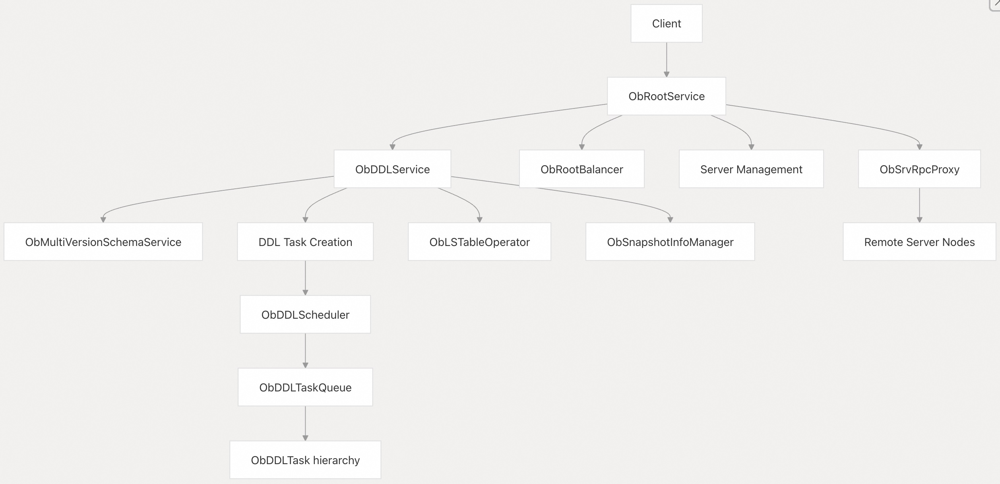    
  
## 根服务  
Root Service（由 `ObRootService` 实现）是整个 OceanBase 集群的中央协调实体，它作为分布式操作的入口，并将不同任务委托给其他特定组件。  
  
### 职责  
- 服务器生命周期管理（添加/删除/启动/停止）  
- 通过 `ObStatusChangeCallback` 处理服务器状态变化  
- 集群角色管理（领导者 leader / 追随者 follower）  
- DDL 任务提交和跟踪  
- 资源的负载均衡与分配  
  
### 关键组件  
  
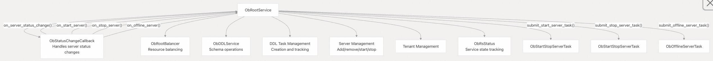    
  
## DDL 类型和分类  
OceanBase 根据 DDL 操作的复杂度、执行时长、对系统的影响等，将 DDL 操作分为不同的类型，从而决定每个操作的执行策略。  
  
### DDL 类型层次结构  
  
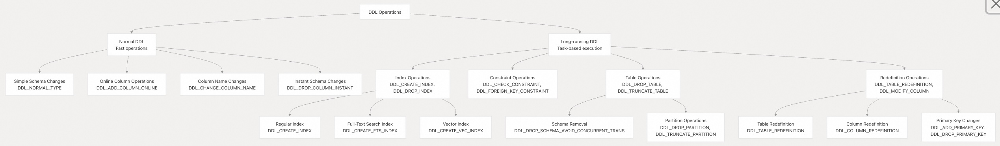    
  
### DDL 任务状态流  
DDL 任务的状态流遵循明确定义的进程，以确保一致性和可恢复性：  
  
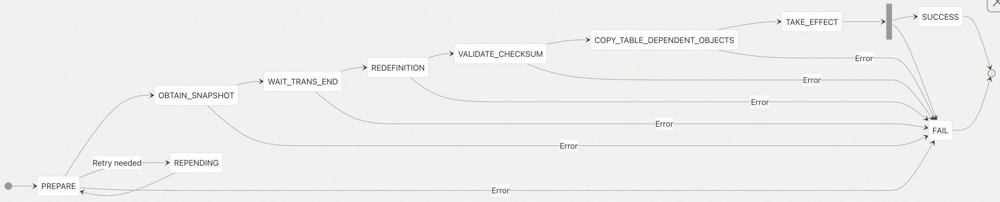    
  
## DDL 服务  
DDL 服务（由 `ObDDLService` 实现）管理整个集群中的所有分布式 DDL 操作，确保 schema 更改在所有节点上一致应用。  
  
### 职责  
- 执行 schema 操作（create/alter/drop tables, indexes, etc.）  
- 管理跨节点的 schema 一致性  
- 处理 DDL 操作的分布式事务  
- 创建和跟踪 DDL 任务  
  
### 关键操作  
  
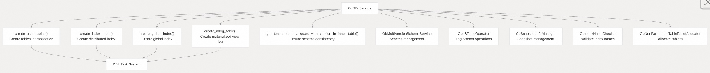   
  
## DDL 任务系统  
对于长时间运行的 DDL 操作，OceanBase 采用基于任务的方法，将 DDL 操作作为具有明确生命周期的任务执行。这提供了可靠性、可恢复性和进度跟踪。  
  
### 任务层次结构  
  
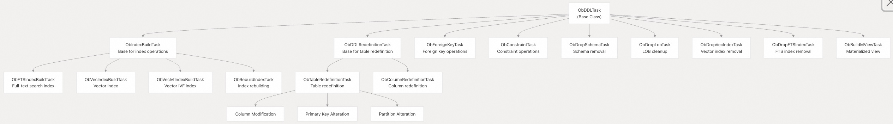   
  
### 任务生命周期  
DDL 任务通过一个明确定义的状态机来跟踪进度并确保可恢复性：  
  
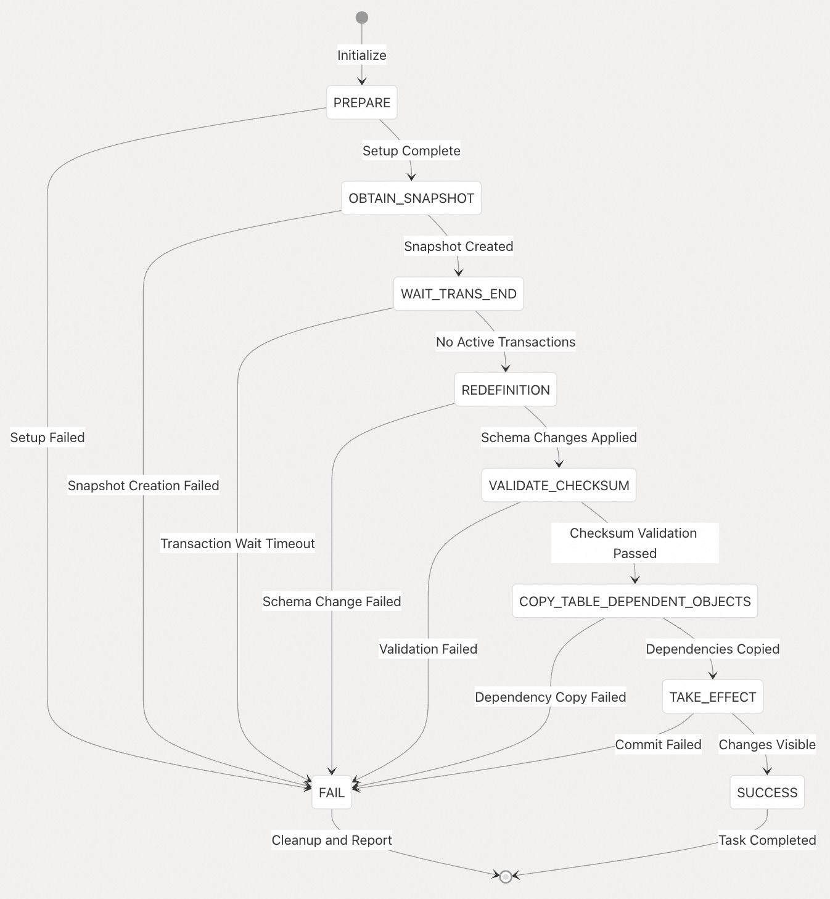   
  
## DDL 任务调度  
DDL 调度程序（`ObDDLScheduler`）管理 DDL 任务的执行，处理：  
- 任务优先级和调度  
- 执行任务的线程池管理  
- 任务超时检测和处理  
- 任务状态持久化和恢复  
- 任务之间的依赖管理  
  
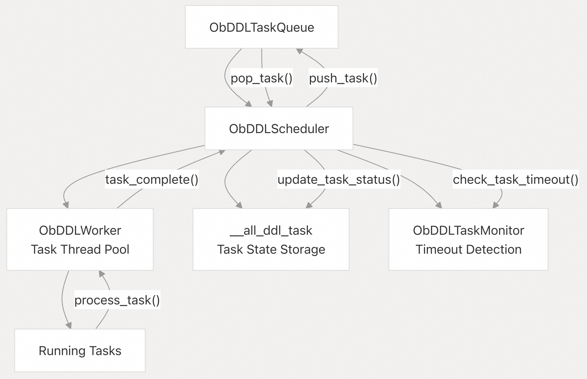   
  
## RPC通信  
RPC 系统构成了 OceanBase 中分布式通信的骨干，使节点能够协调 schema 更改、DDL 任务执行和其他分布式操作。  
  
### 关键组件  
数据包代码：定义于`ob_rpc_packet_list.h`（例如，`CREATE_TABLE：0x203，DROP_TABLE：0x204`）  
RPC 结构：定义于`ob_rpc_struct.h`和`ob_ddl_args.h`  
错误代码：分布式错误处理, 定义在`ob_errno.def`中  
  
### DDL相关的RPC包代码  
数据包代码	| 名称	 | 描述  
---|---|---  
0x201	| OB_FETCH_SCHEMA	| 从远程节点获取 schema  
0x202	| OB_SWITCH_SCHEMA	| 切换到新的 schema 版本  
0x203	| OB_CREATE_TABLE	| 创建表操作  
0x204	| OB_DROP_TABLE	| 删除表操作  
0x205	| OB_ALTER_TABLE	| 修改表操作  
0x208	| OB_CREATE_DATABASE	| 创建数据库操作  
0x209	| OB_DROP_DATABASE	| 删除数据库操作  
0x20E	| OB_CREATE_INDEX	| 创建索引操作  
0x20F	| OB_DROP_INDEX	| 删除索引操作  
0x217	| OB_CREATE_VIEW	| 创建视图操作  
0x21D	| OB_TRUNCATE_TABLE	| 截断表操作  
0x238	| OB_START_REDEF_TABLE	| 开始表重定义  
0x23A	| OB_FINISH_REDEF_TABLE	| 完成表重定义  
0x23B	| OB_ABORT_REDEF_TABLE	| 中止表重定义  
  
  
### 通信流  
  
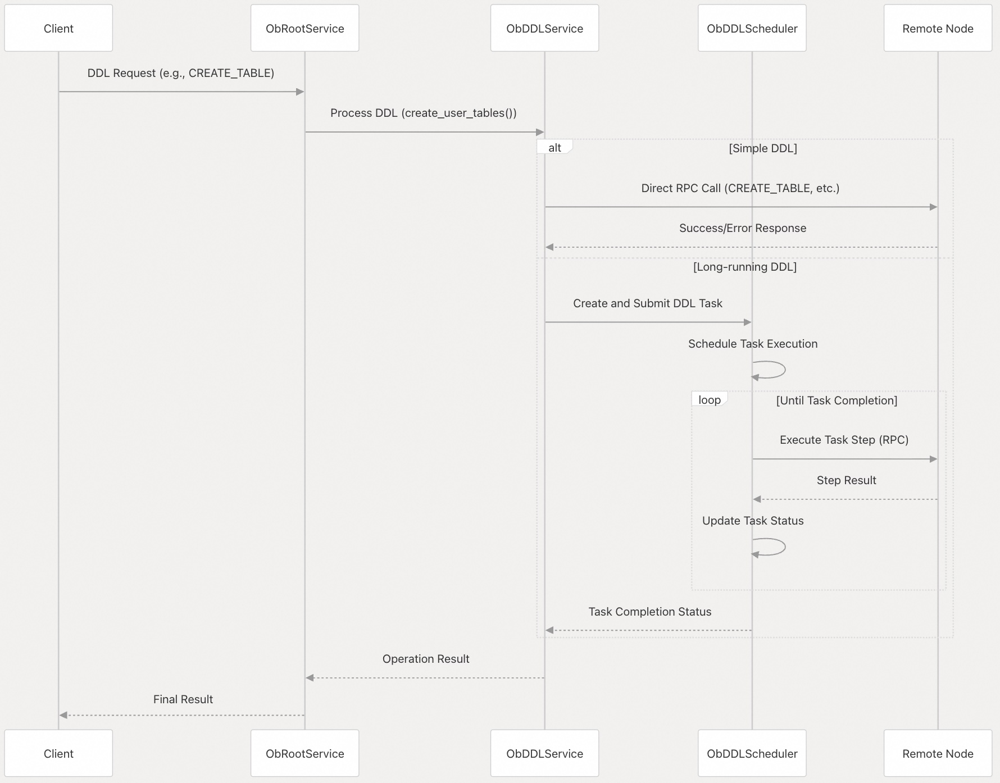   
  
## 错误处理机制  
OceanBase 针对分布式操作实现了一套健壮的错误处理机制，有专门针对分布式场景的错误码。  
  
### DDL 错误处理  
DDL 操作具有专门的错误处理来应对分布式执行挑战：  
  
1、错误消息表：DDL 错误记录在专用表中，用于跟踪和诊断 DDL 错误  
  
2、模拟点：调试钩子允许模拟 DDL 执行中特定点的故障  
  
3、基于任务的恢复：长时间运行的 DDL 操作可以通过恢复任务从故障中恢复  
  
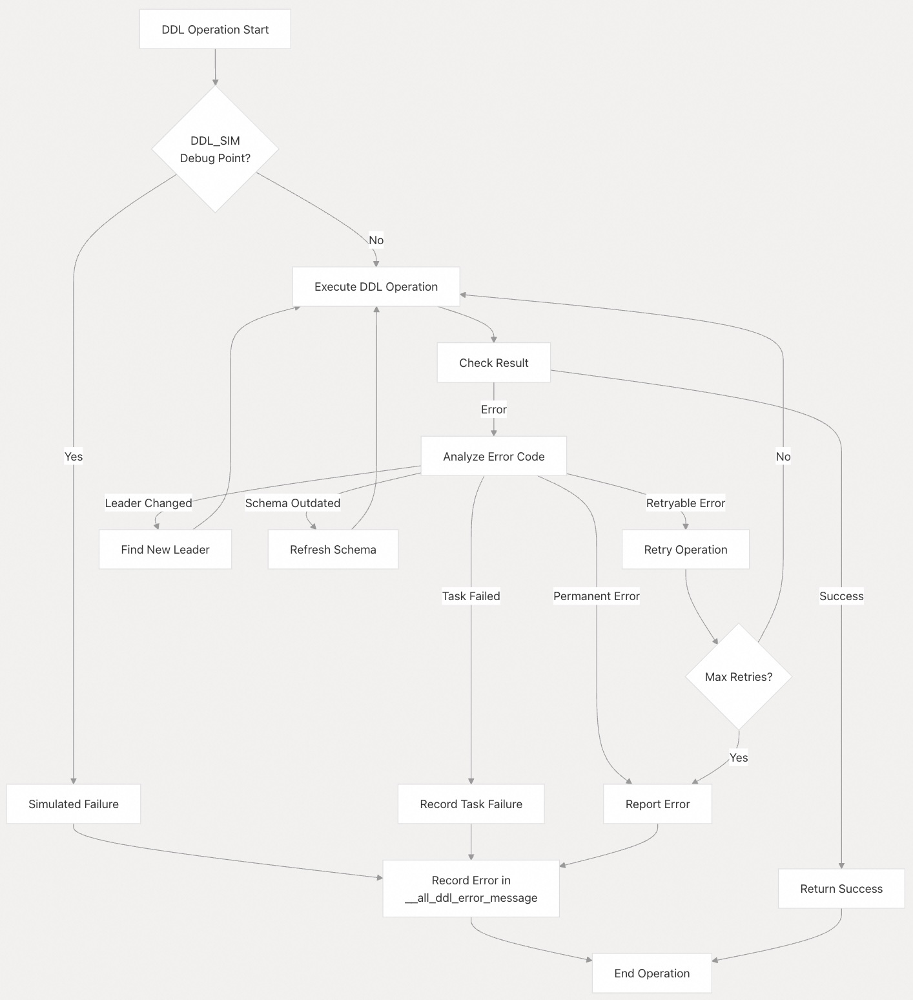   
  
### 关键错误代码  
错误代码	| 名称 |	描述  
---|---|---  
-4038	| OB_NOT_MASTER	| observer 或 zone 不是 master  
-4209	| OB_LEADER_不存在	| 分区没有 leader   
-4214	| OB_PARTITION_NOT_LEADER	| 分区不是 master 分区  
-4346	| OB_SCHEMA_NOT_UPTODATE	| schema 版本已过时  
-4660	| OB_SCHEMA_ERROR	| DDL 操作期间的 schema 错误  
-4661	| OB_DDL_TASK_EXIST	| DDL 任务已存在  
-4662	| OB_SCHEMA_EAGAIN	| schema 需要刷新  
-4663	| OB_SCHEMA_MISMATCH	| 操作期间 schema 不匹配  
  
## Schema 一致性  
分布式系统管理的一个关键方面是维护跨节点的 Schema 一致性。OceanBase 使用：  
- Schema 版本跟踪以识别过时的 Schema   
- Schema 广播以传播 Schema 更改  
- Schema 保护，确保操作期间的 Schema 访问一致  
- 确保 Schema 更新的事务机制(原子性)  
  
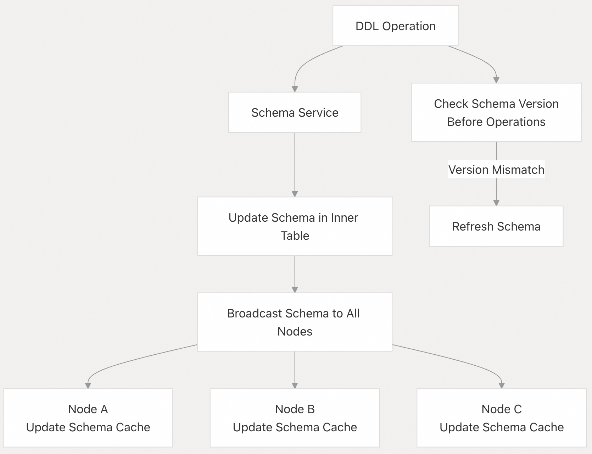   
  
分布式系统管理组件为 OceanBase 跨多个节点可靠运行提供了基础，确保 Schema 更改、DDL 操作和其他分布式活动在整个集群中保持一致性和正确性。  
         
#### [期望 PostgreSQL|开源PolarDB 增加什么功能?](https://github.com/digoal/blog/issues/76 "269ac3d1c492e938c0191101c7238216")
  
  
#### [PolarDB 开源数据库](https://openpolardb.com/home "57258f76c37864c6e6d23383d05714ea")
  
  
#### [PolarDB 学习图谱](https://www.aliyun.com/database/openpolardb/activity "8642f60e04ed0c814bf9cb9677976bd4")
  
  
#### [PostgreSQL 解决方案集合](../201706/20170601_02.md "40cff096e9ed7122c512b35d8561d9c8")
  
  
#### [德哥 / digoal's Github - 公益是一辈子的事.](https://github.com/digoal/blog/blob/master/README.md "22709685feb7cab07d30f30387f0a9ae")
  
  
#### [About 德哥](https://github.com/digoal/blog/blob/master/me/readme.md "a37735981e7704886ffd590565582dd0")
  
  

  
