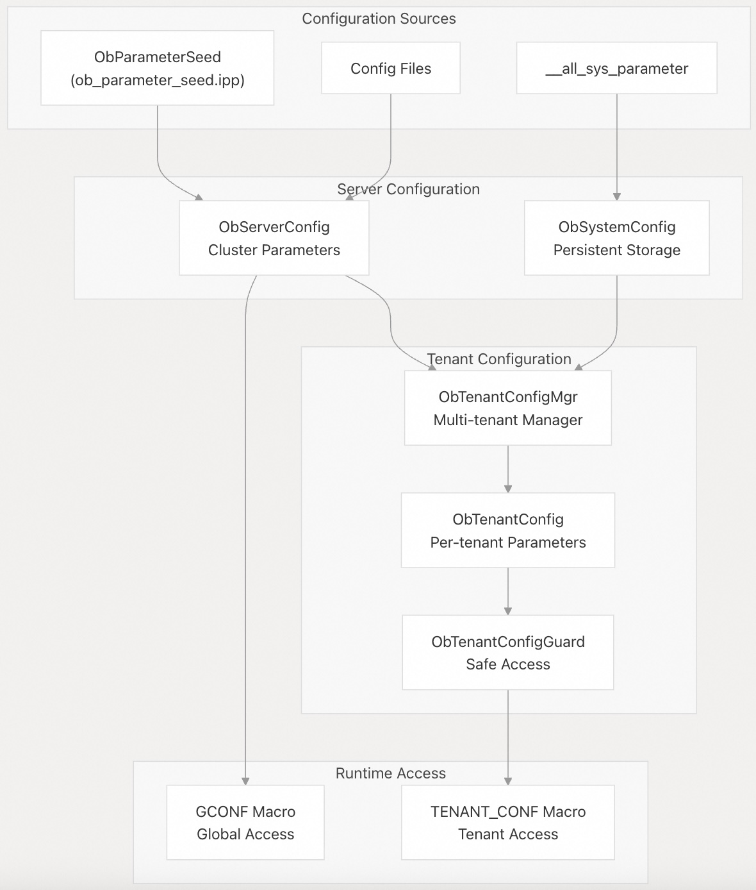

## 体系化剖析开源OB代码: 5 配置与系统状态管理       
                                                      
### 作者                                                      
digoal                                                      
                                                      
### 日期                                                      
2025-10-13                                                     
                                                      
### 标签                                                      
PostgreSQL , PolarDB , DuckDB , MySQL , OceanBase                            
                                                      
----                                                      
                                                      
## 背景                  
本文涵盖 OceanBase 的配置与系统状态管理的基础架构，包括分层参数配置系统、会话状态管理和内部模式(schema)管理。该系统提供运行时配置功能，维护 SQL 会话状态，并通过虚拟表来提供系统信息的访问。  
  
## 参数配置架构  
OceanBase实现了分层配置体系，具有集群级和租户级的参数，可以在运行时动态管理。  
  
### 配置层次结构  
  
  
  
**源文件:**  
- https://github.com/oceanbase/oceanbase/blob/8e2580cf/src/share/parameter/ob_parameter_seed.ipp
- https://github.com/oceanbase/oceanbase/blob/8e2580cf/src/share/config/ob_server_config.h
- https://github.com/oceanbase/oceanbase/blob/8e2580cf/src/observer/omt/ob_tenant_config_mgr.h
  
## 参数定义系统  
参数以结构化格式定义，指定其作用范围、类型和验证规则：  
  
参数类型	| 作用范围	| 例子  
---|---|---  
`OB_CLUSTER_PARAMETER`	| 集群层面 |	`data_dir`，`mysql_port`  
`OB_TENANT_PARAMETER`	| 每租户 |	`max_stale_time_for_weak_consistency`  
  
关键参数类别包括：  
- 存储参数：`data_dir`，`datafile_size`，`redundancy_level`  
- 网络参数：`rpc_port`，`net_thread_count`，`mysql_port`  
- 内存参数：`memory_limit`，`memstore_limit_percentage`  
- 安全参数：`ssl_cipher`，`enable_sql_audit`  
  
**源文件:**  
- https://github.com/oceanbase/oceanbase/blob/8e2580cf/src/share/parameter/ob_parameter_seed.ipp#L26-L60
- https://github.com/oceanbase/oceanbase/blob/8e2580cf/src/share/config/ob_server_config.h#L14-L29
  
## 会话管理系统  
会话管理系统在客户端交互过程中维护 SQL 连接状态、系统变量和事务上下文。  
  
### 会话架构  
  
  
  
**源文件:**  
- https://github.com/oceanbase/oceanbase/blob/8e2580cf/src/sql/session/ob_basic_session_info.h#L186-L440
- https://github.com/oceanbase/oceanbase/blob/8e2580cf/src/sql/session/ob_sql_session_info.h#L92-L199
  
### 系统变量管理  
OceanBase 在保持兼容 MySQL 系统变量的同时，也加入了自己的扩展：  
  
  
  
**源文件:**  
- https://github.com/oceanbase/oceanbase/blob/8e2580cf/src/share/system_variable/ob_system_variable_init.json#L1-L50
- https://github.com/oceanbase/oceanbase/blob/8e2580cf/src/share/system_variable/ob_system_variable_factory.h#L26-L124
- https://github.com/oceanbase/oceanbase/blob/8e2580cf/src/sql/session/ob_basic_session_info.h#L800-L900
  
### 会话状态同步  
对于分布式执行，会话状态必须跨节点进行同步：  
  
同步类型	| 内容	| 用途  
---|---|---  
`SESSION_SYNC_SYS_VAR`	| 系统变量	| 查询执行上下文  
`SESSION_SYNC_USER_VAR`	| 用户变量	| 变量状态传播  
`SESSION_SYNC_TXN_STATIC_INFO`	| 事务基本信息	| 分布式事务  
`SESSION_SYNC_APPLICATION_INFO`	| 应用程序上下文	| 会话标识  
  
**源文件:**  
- https://github.com/oceanbase/oceanbase/blob/8e2580cf/src/sql/session/ob_sql_session_info.h#L227-L242
- https://github.com/oceanbase/oceanbase/blob/8e2580cf/src/sql/session/ob_sql_session_info.cpp#L264-L299
  
## 内部表模式(schema)管理  
OceanBase 通过虚拟表公开系统配置和运行时状态，这些虚拟表提供对内部信息的 SQL 访问。  
  
### 系统参数虚拟表  
  
  
  
**源文件:**  
- https://github.com/oceanbase/oceanbase/blob/8e2580cf/tools/deploy/mysql_test/test_suite/inner_table/r/mysql/all_virtual_sys_parameter_stat.result#L5-L23
- https://github.com/oceanbase/oceanbase/blob/8e2580cf/src/share/parameter/ob_parameter_seed.ipp#L26-L50
  
### 参数 Categories 和 Sections  
虚拟表按功能和 Sections 组织参数：  
  
Section	| 说明 	| 示例参数  
---|---|---  
`SSTABLE`	| 存储配置	| `data_dir`，`datafile_size`  
`OBSERVER`	| 服务器行为	| `rpc_port`，`mysql_port`  
`TENANT`	| 特定租户	| `memstore_limit_percentage`  
`ROOT_SERVICE`	| 集群管理	| `enable_major_freeze`  
`DAILY_MERGE`	| 后台操作	| `major_freeze_duty_time`  
  
  
### 配置访问模式  
  
  
  
**源文件:**  
- https://github.com/oceanbase/oceanbase/blob/8e2580cf/tools/deploy/mysql_test/test_suite/inner_table/r/mysql/all_virtual_sys_parameter_stat.result#L697-L698
- https://github.com/oceanbase/oceanbase/blob/8e2580cf/src/share/config/ob_server_config.cpp#L93-L130
  
配置和系统管理基础设施为 OceanBase 的 runtime 行为提供了基础，确保整个分布式系统的一致参数管理，同时保持与 MySQL 的配置兼容性。  
    
#### [期望 PostgreSQL|开源PolarDB 增加什么功能?](https://github.com/digoal/blog/issues/76 "269ac3d1c492e938c0191101c7238216")
  
  
#### [PolarDB 开源数据库](https://openpolardb.com/home "57258f76c37864c6e6d23383d05714ea")
  
  
#### [PolarDB 学习图谱](https://www.aliyun.com/database/openpolardb/activity "8642f60e04ed0c814bf9cb9677976bd4")
  
  
#### [PostgreSQL 解决方案集合](../201706/20170601_02.md "40cff096e9ed7122c512b35d8561d9c8")
  
  
#### [德哥 / digoal's Github - 公益是一辈子的事.](https://github.com/digoal/blog/blob/master/README.md "22709685feb7cab07d30f30387f0a9ae")
  
  
#### [About 德哥](https://github.com/digoal/blog/blob/master/me/readme.md "a37735981e7704886ffd590565582dd0")
  
  

  
