## 体系化剖析开源OB代码: 2.1 语法解析器(Parsing)和语义解析器(Resolution)   
            
### 作者    
digoal    
            
### 日期      
2025-10-13          
     
### 标签          
PostgreSQL , PolarDB , DuckDB , MySQL , OceanBase     
           
----       
       
## 背景    
[《Parsing 和 Resolution 的区别》](../202510/20251013_11.md)    
    
本文分享 OceanBase 如何处理 SQL 查询，从初始语法解析阶段(parsing)到语义解析阶段(resolution)。它涵盖了如何将原始 SQL 文本转换为结构化的内部表示，以便进一步优化和执行。  
  
## Query Resolution 流程概述   
OceanBase 中的查询语义解析过程将原始 SQL 文本转换为可优化和执行的结构化表示。这个过程包含几个关键步骤：  
- 1、SQL 语法解析：使用解析器将 SQL 文本转换为解析树  
- 2、语句 语义解析：将解析树转换为逻辑语句表示  
- 3、表达式 语义解析：语义级解析 SQL 语句中的表达式、列和其他元素  
- 4、类型推导：确定表达式和列的数据类型  
  
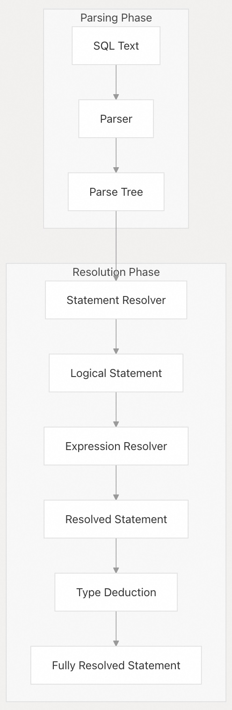  
  
**源文件:**  
- https://github.com/oceanbase/oceanbase/blob/8e2580cf/src/sql/resolver/dml/ob_dml_resolver.cpp#L60-L88
- https://github.com/oceanbase/oceanbase/blob/8e2580cf/src/sql/resolver/expr/ob_raw_expr_resolver_impl.cpp#L28-L64
- https://github.com/oceanbase/oceanbase/blob/8e2580cf/src/sql/resolver/expr/ob_raw_expr_deduce_type.cpp#L35-L75
  
## SQL Parsing  
SQL 语法解析(Parsing)阶段将原始 SQL 文本转换为表示查询的语法结构的结构化解析树。  
  
### Parser Components  
OceanBase 使用 Bison 生成的 parser 来分析 SQL 语句，该解析器定义在 `sql_parser_mysql_mode.y` (MySQL 模式)，在 Oracle 模式下有单独的解析器。  
  
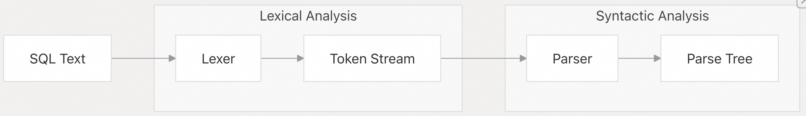  
  
解析器处理不同的 SQL 语句类型，包括：  
- SELECT 语句  
- DML 语句（INSERT、UPDATE、DELETE）  
- DDL 语句（CREATE、ALTER、DROP）  
- DCL 语句（GRANT、REVOKE）  
  
**源文件:**  
- https://github.com/oceanbase/oceanbase/blob/8e2580cf/src/sql/parser/sql_parser_mysql_mode.y#L13-L388
- https://github.com/oceanbase/oceanbase/blob/8e2580cf/src/sql/parser/non_reserved_keywords_mysql_mode.c#L1-L43
  
### Parse Tree Structure  
解析树由代表 SQL 语句不同元素的 `ParseNode` 结构组成。每个节点都有类型、值和子节点。  
  
关键节点类型包括：  
- T_SELECT（用于 SELECT 语句）  
- T_INSERT（用于 INSERT 语句）  
- T_UPDATE（用于 UPDATE 语句）  
- T_DELETE（用于 DELETE 语句）  
- T_CREATE_TABLE（用于 CREATE TABLE 语句）  
  
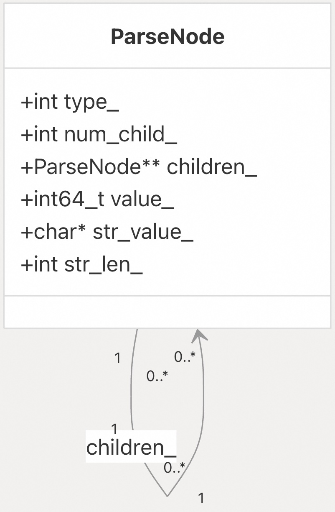  
  
**源文件:**  
- https://github.com/oceanbase/oceanbase/blob/8e2580cf/src/sql/parser/sql_parser_mysql_mode.y#L388-L1000
  
## Statement Resolution  
语句语义解析阶段将解析树转换为捕获查询语义的逻辑语句表示。  
  
### Resolver Hierarchy  
OceanBase 使用层次结构的解析器类来处理不同类型的 SQL 语句：  
  
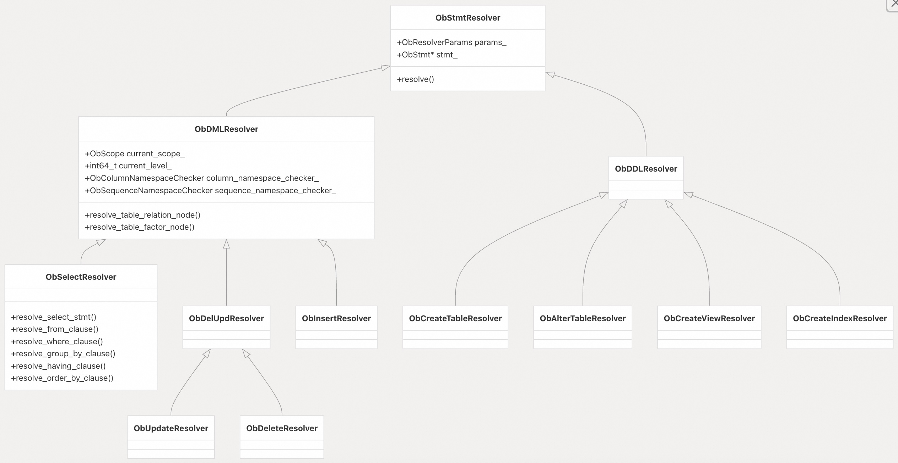  
  
**源文件:**  
- https://github.com/oceanbase/oceanbase/blob/8e2580cf/src/sql/resolver/dml/ob_dml_resolver.h#L43-L79
- https://github.com/oceanbase/oceanbase/blob/8e2580cf/src/sql/resolver/dml/ob_select_resolver.h#L1-L26
- https://github.com/oceanbase/oceanbase/blob/8e2580cf/src/sql/resolver/ddl/ob_ddl_resolver.h#L13-L29
  
### Statement Types  
OceanBase 使用专门的语句类来表示不同的SQL语句：  
  
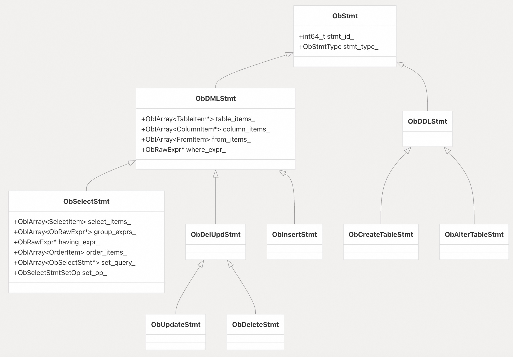  
  
**源文件:**  
- https://github.com/oceanbase/oceanbase/blob/8e2580cf/src/sql/resolver/dml/ob_dml_stmt.h#L1-L69
- https://github.com/oceanbase/oceanbase/blob/8e2580cf/src/sql/resolver/dml/ob_dml_stmt.cpp#L1-L75
- https://github.com/oceanbase/oceanbase/blob/8e2580cf/src/sql/resolver/dml/ob_select_stmt.cpp#L1-L75
  
## Resolution Process for SELECT Statements  
SELECT 语句的语义解析是查询解析阶段中最复杂的过程之一。它涉及解析各种子句并构建查询的逻辑表示。  
  
### SELECT Statement Resolution Flow  
  
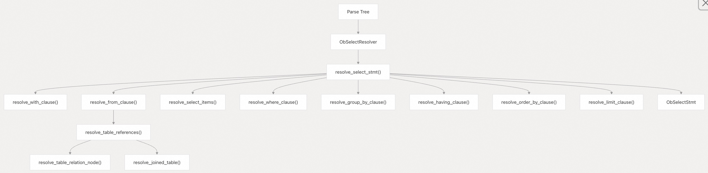  
  
**源文件:**  
- https://github.com/oceanbase/oceanbase/blob/8e2580cf/src/sql/resolver/dml/ob_select_resolver.cpp#L37-L92
- https://github.com/oceanbase/oceanbase/blob/8e2580cf/src/sql/resolver/dml/ob_select_resolver.cpp#L93-L207
  
### FROM Clause Resolution  
FROM 子句语义解析涉及识别查询中的表、视图和 JOIN ，并在语句中创建相应的表项。  
  
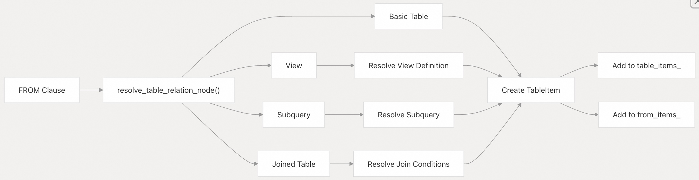  
  
**源文件:**  
- https://github.com/oceanbase/oceanbase/blob/8e2580cf/src/sql/resolver/dml/ob_dml_resolver.cpp#L127-L193
- https://github.com/oceanbase/oceanbase/blob/8e2580cf/src/sql/resolver/dml/ob_select_resolver.cpp#L208-L329
  
### SELECT Items Resolution  
SELECT 项语义解析涉及识别 SELECT 列表中的列、表达式和别名，并在语句中创建相应的选择项。  
  
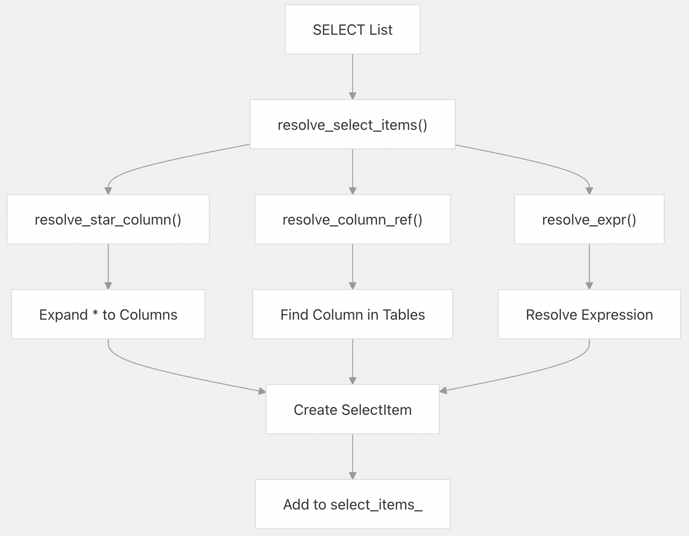  
  
**源文件:**  
- https://github.com/oceanbase/oceanbase/blob/8e2580cf/src/sql/resolver/dml/ob_select_resolver.cpp#L330-L450
  
### WHERE Clause Resolution  
WHERE 子句语义解析涉及解析 WHERE 子句中的表达式并设置语句中的 `where_expr_`。  
  
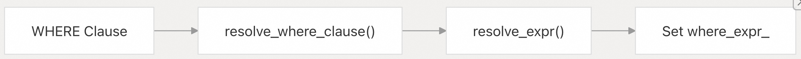  
  
**源文件:**  
- https://github.com/oceanbase/oceanbase/blob/8e2580cf/src/sql/resolver/dml/ob_select_resolver.cpp#L451-L500
  
### GROUP BY and HAVING Clause Resolution  
GROUP BY 和 HAVING 子句语义解析涉及解析这些子句中的表达式并在语句中设置相应的字段。  
  
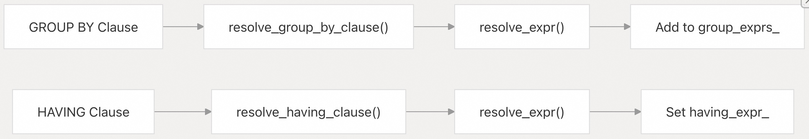  
  
**源文件:**  
- https://github.com/oceanbase/oceanbase/blob/8e2580cf/src/sql/resolver/dml/ob_select_resolver.cpp#L501-L600
  
### ORDER BY and LIMIT Clause Resolution  
ORDER BY 和 LIMIT 子句语义解析涉及解析这些子句中的表达式并在语句中设置相应的字段。  
  
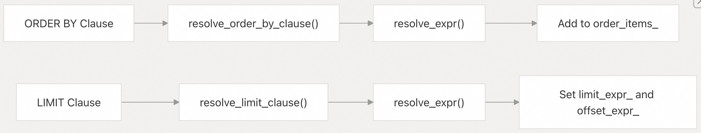  
  
**源文件:**  
- https://github.com/oceanbase/oceanbase/blob/8e2580cf/src/sql/resolver/dml/ob_select_resolver.cpp#L601-L700
  
## Expression Resolution  
表达式语义解析是查询解析过程的关键部分。它涉及将表示表达式的解析树节点转换为可在查询执行期间进行评估(表达式计算)的结构化表示。  
  
### Expression Resolver Components  
  
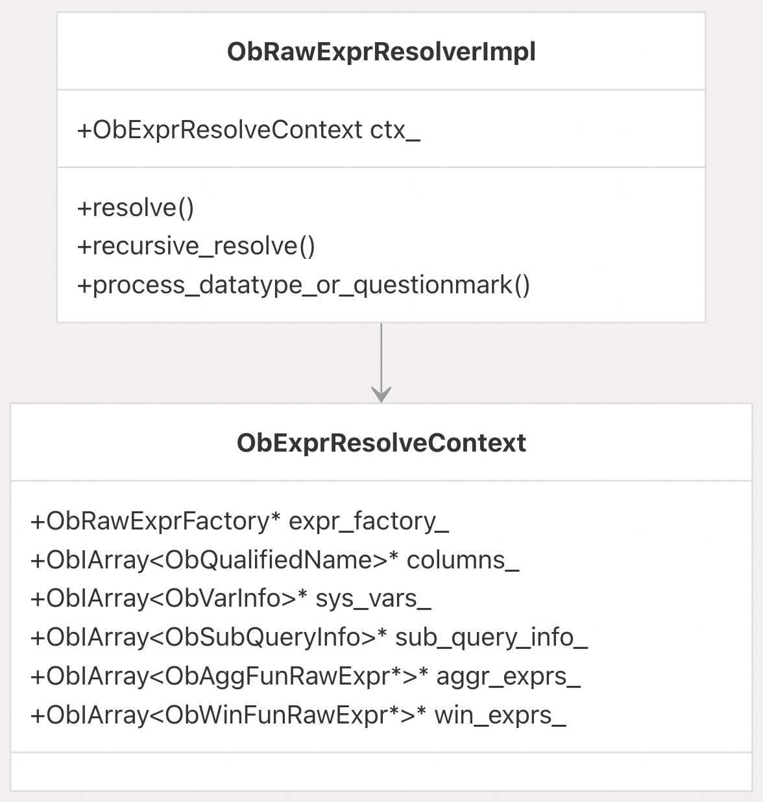  
  
**源文件:**  
- https://github.com/oceanbase/oceanbase/blob/8e2580cf/src/sql/resolver/expr/ob_raw_expr_resolver_impl.cpp#L28-L64
- https://github.com/oceanbase/oceanbase/blob/8e2580cf/src/sql/resolver/expr/ob_raw_expr_resolver_impl.cpp#L241-L309
  
### Expression Types  
OceanBase 使用专门的表达式类来表示不同类型的表达式：  
  
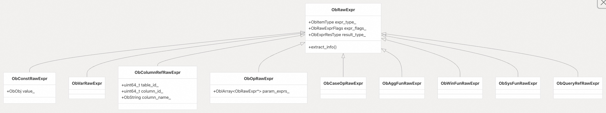  
  
**源文件:**  
- https://github.com/oceanbase/oceanbase/blob/8e2580cf/src/sql/resolver/expr/ob_raw_expr_resolver_impl.cpp#L310-L500
  
### Expression Resolution Process  
表达式语义解析过程涉及递归遍历解析树并创建相应的原始表达式对象：  
  
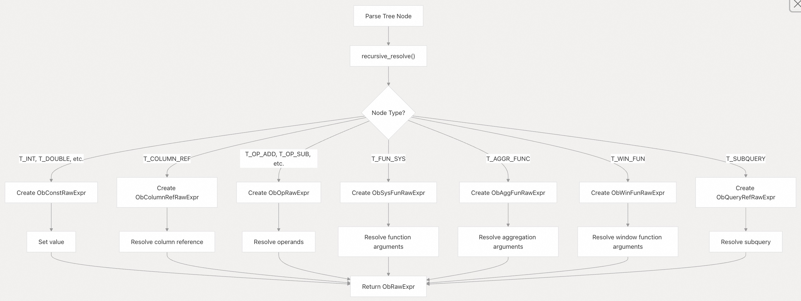  
  
**源文件:**  
- https://github.com/oceanbase/oceanbase/blob/8e2580cf/src/sql/resolver/expr/ob_raw_expr_resolver_impl.cpp#L241-L309
  
## 类型推导(Type Deduction)  
表达式被解析后，需要通过称为类型推导的过程来确定其数据类型。  
  
### 类型推导过程  
  
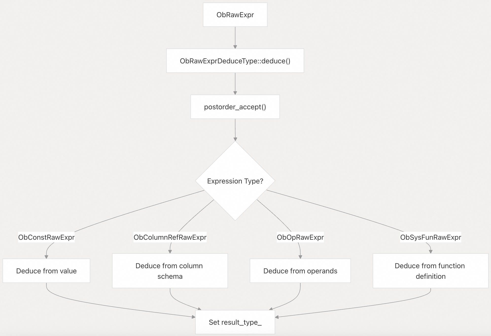  
  
**源文件:**  
- https://github.com/oceanbase/oceanbase/blob/8e2580cf/src/sql/resolver/expr/ob_raw_expr_deduce_type.cpp#L35-L75
- https://github.com/oceanbase/oceanbase/blob/8e2580cf/src/sql/resolver/expr/ob_raw_expr_deduce_type.cpp#L76-L173
  
### 运算符的类型推导  
对于运算符(操作符)，类型推断涉及根据操作数类型确定结果类型：  
  
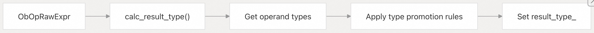  
  
**源文件:**  
- https://github.com/oceanbase/oceanbase/blob/8e2580cf/src/sql/resolver/expr/ob_raw_expr_deduce_type.cpp#L225-L311
  
## 特殊语义解析案例(Special Resolution Cases)  
### 通用表表达式（CTEs）  
OceanBase 支持在 SELECT 语句中使用通用表表达式（WITH 子句）。CTE 的语义解析需要特殊处理以支持递归查询。  
  
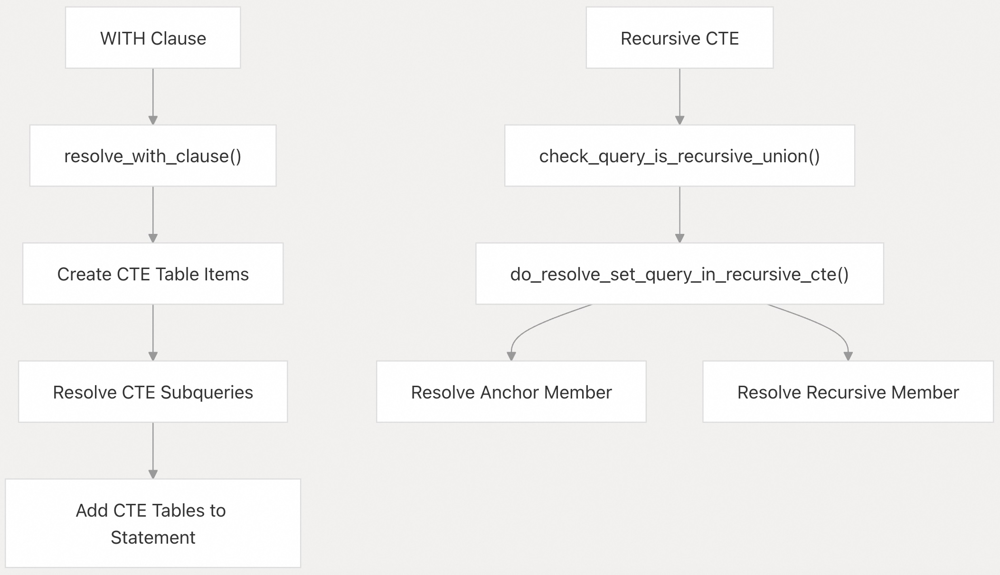  
  
**源文件:**  
- https://github.com/oceanbase/oceanbase/blob/8e2580cf/src/sql/resolver/dml/ob_select_resolver.cpp#L93-L207
  
### JSON Path Expressions  
OceanBase 支持使用 JSON path 表达式来访问 JSON 数据，JSON path 表达式的语义解析需要特殊处理。  
  
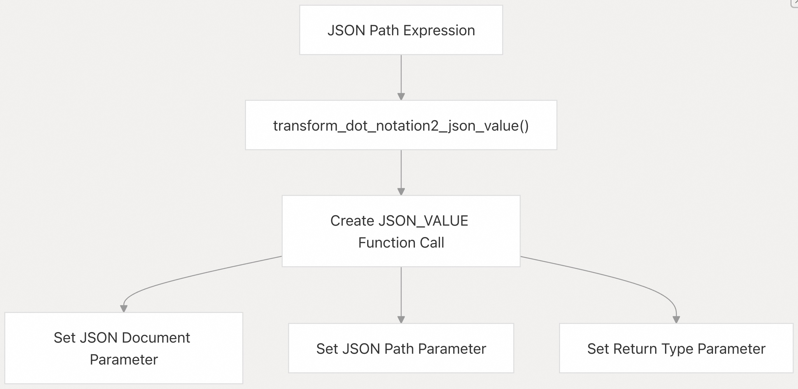  
  
**源文件:**  
- https://github.com/oceanbase/oceanbase/blob/8e2580cf/src/sql/resolver/dml/ob_dml_resolver.cpp#L513-L725
  
### Vector and Full-Text Search Indexes  
OceanBase 支持向量索引和全文索引，这些索引的语义解析需要特殊处理。  
  
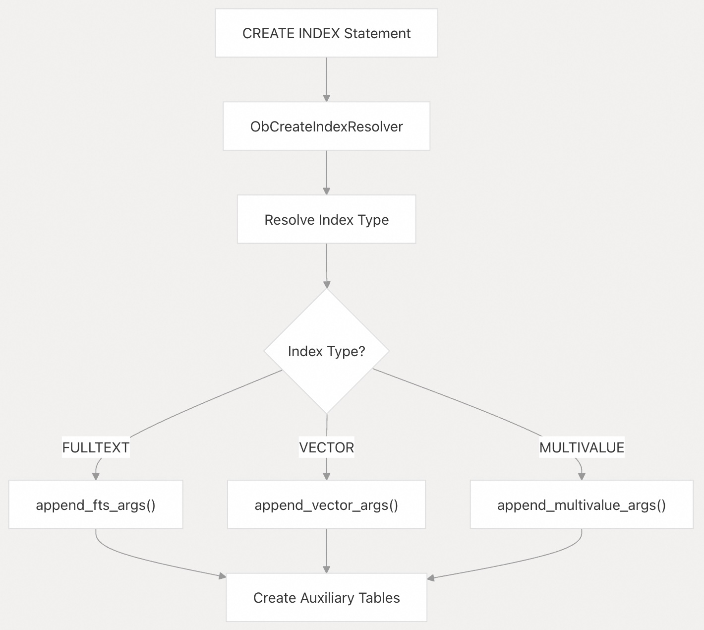  
  
**源文件:**  
- https://github.com/oceanbase/oceanbase/blob/8e2580cf/src/sql/resolver/ddl/ob_ddl_resolver.cpp#L131-L248
- https://github.com/oceanbase/oceanbase/blob/8e2580cf/src/share/ob_fts_index_builder_util.cpp#L1-L24
  
## 小结  
OceanBase 中的查询语法解析和语义解析过程是一个复杂但结构良好的系统，它将原始 SQL 文本转换为可优化和执行的逻辑表示。它涉及语法解析、语句语义解析、表达式语义解析和类型推断等多个阶段。  
  
本文分享了查询语法解析和语义解析所涉及的关键组件和流程。  
       
#### [期望 PostgreSQL|开源PolarDB 增加什么功能?](https://github.com/digoal/blog/issues/76 "269ac3d1c492e938c0191101c7238216")
  
  
#### [PolarDB 开源数据库](https://openpolardb.com/home "57258f76c37864c6e6d23383d05714ea")
  
  
#### [PolarDB 学习图谱](https://www.aliyun.com/database/openpolardb/activity "8642f60e04ed0c814bf9cb9677976bd4")
  
  
#### [PostgreSQL 解决方案集合](../201706/20170601_02.md "40cff096e9ed7122c512b35d8561d9c8")
  
  
#### [德哥 / digoal's Github - 公益是一辈子的事.](https://github.com/digoal/blog/blob/master/README.md "22709685feb7cab07d30f30387f0a9ae")
  
  
#### [About 德哥](https://github.com/digoal/blog/blob/master/me/readme.md "a37735981e7704886ffd590565582dd0")
  
  

  
