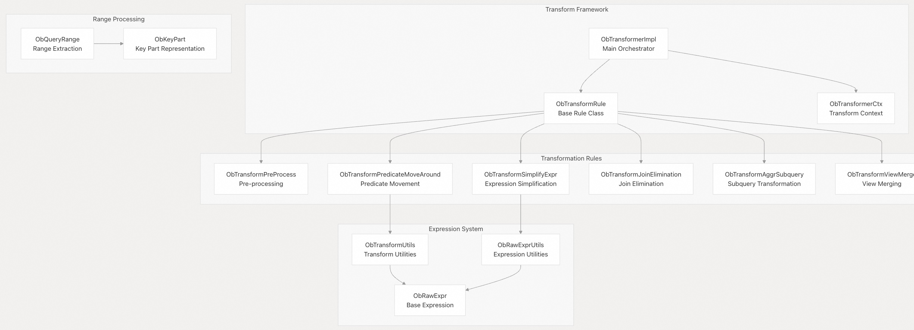
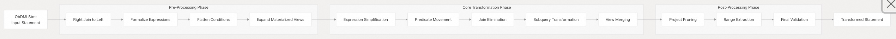
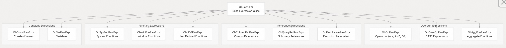
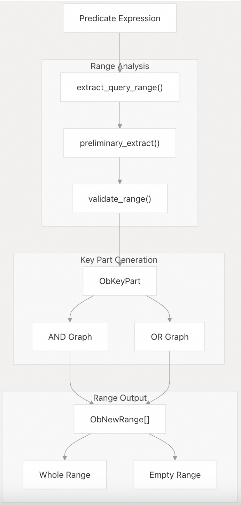
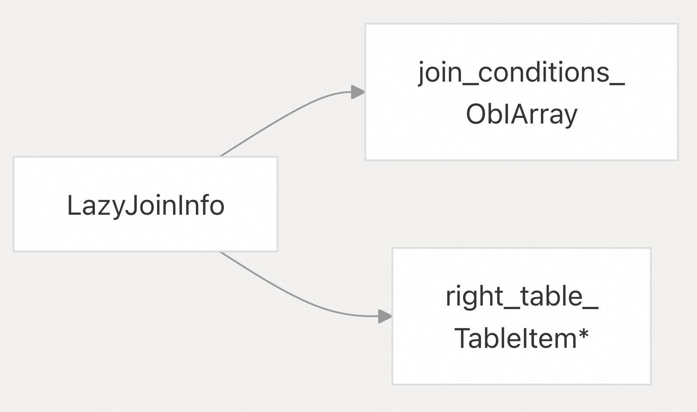

## 体系化剖析开源OB代码: 2.2 查询重写和转换   
              
### 作者      
digoal      
              
### 日期        
2025-10-13            
       
### 标签            
PostgreSQL , PolarDB , DuckDB , MySQL , OceanBase       
             
----         
         
## 背景      
OceanBase 中的查询重写和转换系统在parsing/resolution和optimization阶段之间处理 SQL 语句。它采用基于规则的转换来提高查询执行效率和正确性，并支持高级优化。该系统通过各种重写规则对解析后的 SQL 语句 (`ObDMLStmt`) 进行转换，然后将其传递给基于代价/成本的优化器(`CBO`)。  
  
## 架构  
转换系统采用基于规则的架构，多个转换规则按顺序应用于 SQL 语句。该系统设计为可扩展的，可以轻松添加新的转换规则。  
  
核心架构图  
  
  
  
**源文件:**  
- https://github.com/oceanbase/oceanbase/blob/8e2580cf/src/sql/rewrite/ob_transformer_impl.cpp#L1-L50
- https://github.com/oceanbase/oceanbase/blob/8e2580cf/src/sql/rewrite/ob_transform_rule.cpp#L1-L30
- https://github.com/oceanbase/oceanbase/blob/8e2580cf/src/sql/rewrite/ob_transform_utils.h#L1-L50
  
## 转换管道(Transformation Pipeline)  
转换过程遵循明确定义的管道，语句经过多个阶段进行处理。每个阶段应用特定类型的转换。  
  
### 管道工作流  
  
  
  
**源文件:**  
- https://github.com/oceanbase/oceanbase/blob/8e2580cf/src/sql/rewrite/ob_transform_pre_process.cpp#L32-L358
- https://github.com/oceanbase/oceanbase/blob/8e2580cf/src/sql/rewrite/ob_transformer_impl.cpp#L100-L200
  
## 核心组件  
### ObTransformerImpl  
主协调器类, 管理转换过程并以正确的顺序应用规则。  
  
方法	| 描述  
---|---  
`transform()`	| 语句转换的入口点  
`do_transform()`	| 按顺序应用转换规则  
`check_transform_validity()`	| 验证转换结果  
  
### ObTransformRule  
所有转换规则的基类，提供通用的功能和接口。  
  
成员	| 描述  
---|---  
`ctx_`	| 转换包含会话信息和factories的上下文  
`transform_one_stmt()`	| 每个规则实现的虚拟方法  
`need_transform()`	| 确定是否要应用规则  
  
### ObTransformerCtx  
包含转换期间所需的共享资源的上下文对象。  
  
成员	| 描述  
---|---  
`expr_factory_`	| 创建新表达式的 Factory  
`session_info_`	| SQL 会话信息  
`allocator_`	| 内存分配器  
`schema_checker_`	| schema 验证  
  
**源文件:**  
- https://github.com/oceanbase/oceanbase/blob/8e2580cf/src/sql/rewrite/ob_transformer_impl.h#L1-L100
- https://github.com/oceanbase/oceanbase/blob/8e2580cf/src/sql/rewrite/ob_transform_rule.h#L1-L150
  
## 表达式处理系统  
表达式系统为所有查询转换提供了基础，`ObRawExpr` 作为所有表达式类型的基类。  
  
### 表达式层次结构  
  
  
  
**源文件:**  
- https://github.com/oceanbase/oceanbase/blob/8e2580cf/src/sql/resolver/expr/ob_raw_expr.h#L200-L400
- https://github.com/oceanbase/oceanbase/blob/8e2580cf/src/sql/resolver/expr/ob_raw_expr.cpp#L1-L100
  
## 转换类型(Transformation Types)  
### 预处理转换  
`ObTransformPreProcess` 类处理初始语句清理和规范化：  
- 右连接转换：将右连接转换为左连接以实现标准化  
- 表达式形式化：确保表达式的正确输入和验证  
- 条件展平：将嵌套的 AND/OR 条件展平为简化形式  
- 物化视图扩展：将物化视图扩展为其底层查询  
  
### 表达式简化  
`ObTransformSimplifyExpr` 类执行各种表达式优化：  
- 常量折叠：在编译时运算常量表达式  
- NULL条件替换：尽可能简化`IS NULL`条件  
- 布尔表达式优化：简化`TRUE/FALSE`表达式  
- 冗余表达式删除：消除不必要的表达式  
  
### 谓词转换  
`ObTransformPredicateMoveAround` 类优化了谓词位置：  
- 谓词下推：将谓词移近数据源  
- 谓词提取：在有益时从子查询中提取谓词  
- 连接条件推导：从现有谓词中推导出新的连接条件  
  
**源文件:**  
- https://github.com/oceanbase/oceanbase/blob/8e2580cf/src/sql/rewrite/ob_transform_pre_process.cpp#L60-L120
- https://github.com/oceanbase/oceanbase/blob/8e2580cf/src/sql/rewrite/ob_transform_simplify_expr.cpp#L23-L106
- https://github.com/oceanbase/oceanbase/blob/8e2580cf/src/sql/rewrite/ob_transform_predicate_move_around.cpp#L40-L100
  
## 查询范围处理  
`ObQueryRange` 系统从谓词中提取范围条件以实现高效的索引使用。  
  
### 范围提取过程  
  
  
  
### 关键数据结构  
类	| 作用  
---|---  
`ObQueryRange`	| 协调范围提取  
`ObKeyPart`	| 表示索引列上的范围条件  
`ObQueryRangeCtx`	| 范围提取过程的上下文  
`ObNewRange`	| 最终的范围表示  
  
**源文件:**  
- https://github.com/oceanbase/oceanbase/blob/8e2580cf/src/sql/rewrite/ob_query_range.cpp#L276-L358
- https://github.com/oceanbase/oceanbase/blob/8e2580cf/src/sql/rewrite/ob_query_range.h#L200-L400
- https://github.com/oceanbase/oceanbase/blob/8e2580cf/src/sql/rewrite/ob_key_part.cpp#L1-L100
  
## 实用程序  
`ObTransformUtils` 类为转换提供了必要的实用程序：  
  
### 核心实用程序  
功能类别	| 主要功能  
---|---  
表达式操作	| `decorrelate()`，`extract_param_exprs()`，`replace_expr()`   
表操作	| `add_new_table_item()`，`merge_from_items_as_inner_join()`  
创建列	| `create_new_column_expr()`，`create_columns_for_view()`  
谓词分析	| `is_correlated_expr()`，`is_simple_correlated_pred()`  
唯一性检查	| `is_column_unique()`，`is_columns_unique()`  
  
### LazyJoinInfo 结构  
  
  
  
**源文件:**  
- https://github.com/oceanbase/oceanbase/blob/8e2580cf/src/sql/rewrite/ob_transform_utils.cpp#L33-L42
- https://github.com/oceanbase/oceanbase/blob/8e2580cf/src/sql/rewrite/ob_transform_utils.h#L176-L195
  
## 与 SQL 处理集成  
转换系统可以与其他 SQL 处理组件无缝集成, 包括：  
  
### 转换系统上接语义解析器  
- 接收具有类型表达式的已完成解析的 `ObDMLStmt` 对象  
- 列引用绑定到 schema 信息  
- 子查询正确嵌套和关联  
  
### 转换系统结果输出至优化器  
- 生成简化和优化的语句结构  
- 提取范围信息以进行索引选择  
- 连接条件针对连接排序算法进行了规范化  
  
### 与计划缓存的协调  
- 转换结果可以缓存用于参数化查询  
- 维护表达式参数信息以供计划重用  
   
**源文件:**  
- https://github.com/oceanbase/oceanbase/blob/8e2580cf/src/sql/rewrite/ob_transformer_impl.cpp#L200-L300
- https://github.com/oceanbase/oceanbase/blob/8e2580cf/src/sql/rewrite/ob_query_range.cpp#L360-L450  
      
#### [期望 PostgreSQL|开源PolarDB 增加什么功能?](https://github.com/digoal/blog/issues/76 "269ac3d1c492e938c0191101c7238216")
  
  
#### [PolarDB 开源数据库](https://openpolardb.com/home "57258f76c37864c6e6d23383d05714ea")
  
  
#### [PolarDB 学习图谱](https://www.aliyun.com/database/openpolardb/activity "8642f60e04ed0c814bf9cb9677976bd4")
  
  
#### [PostgreSQL 解决方案集合](../201706/20170601_02.md "40cff096e9ed7122c512b35d8561d9c8")
  
  
#### [德哥 / digoal's Github - 公益是一辈子的事.](https://github.com/digoal/blog/blob/master/README.md "22709685feb7cab07d30f30387f0a9ae")
  
  
#### [About 德哥](https://github.com/digoal/blog/blob/master/me/readme.md "a37735981e7704886ffd590565582dd0")
  
  

  
