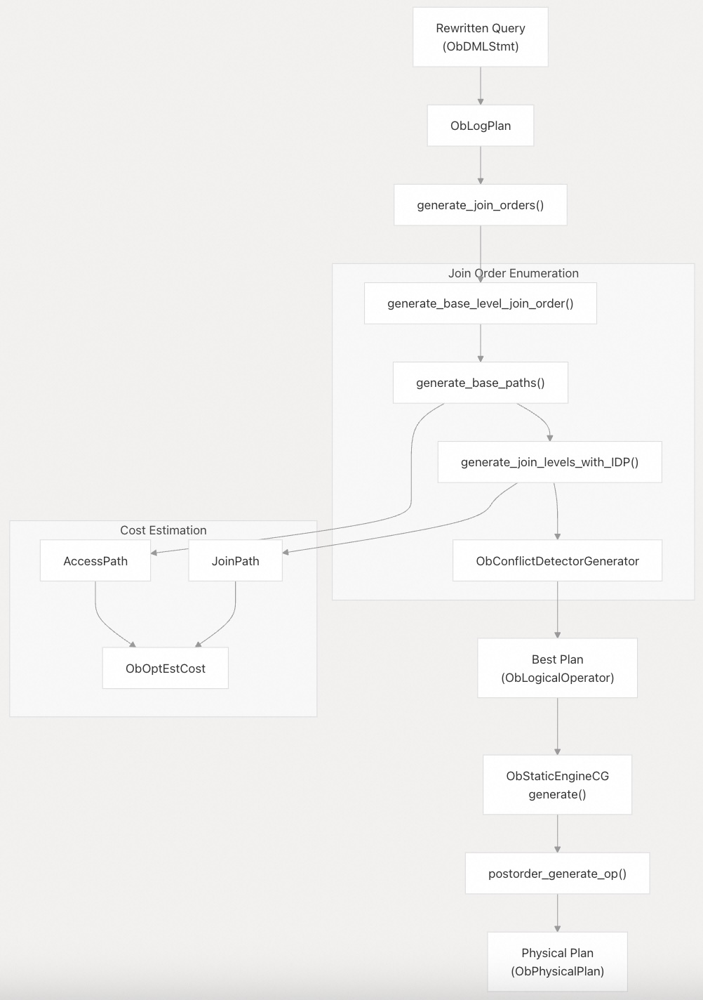
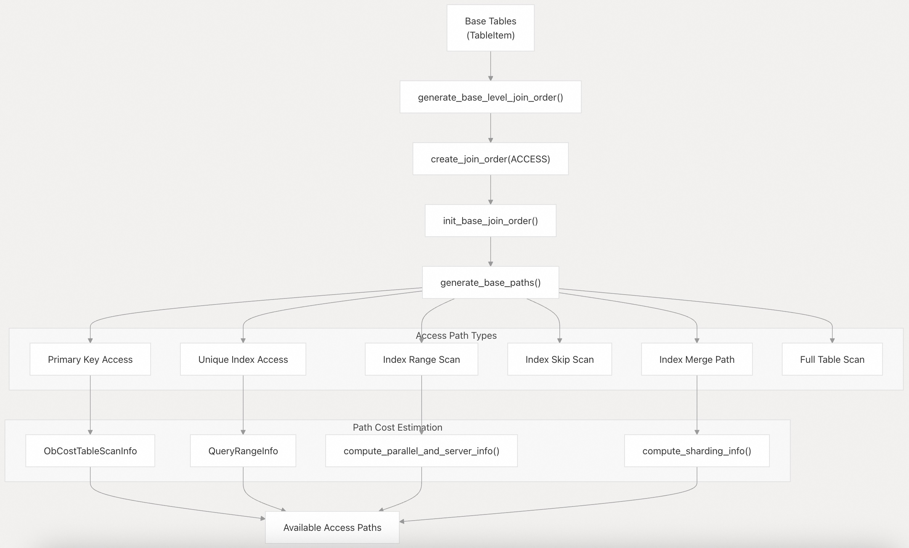
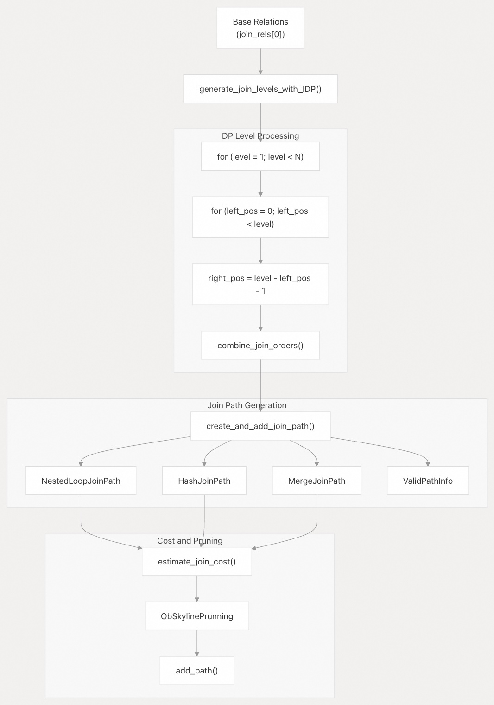
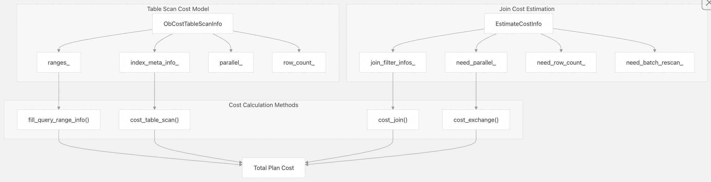
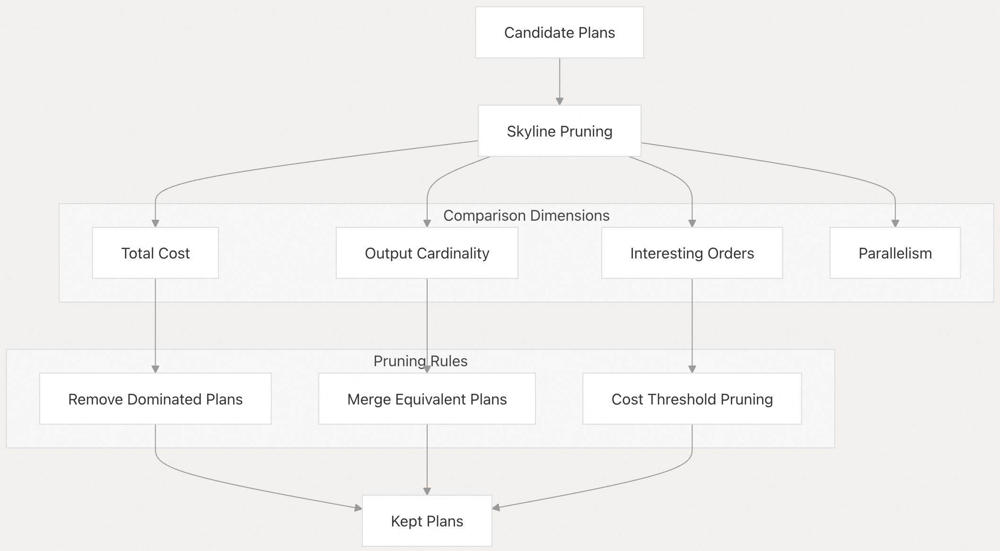
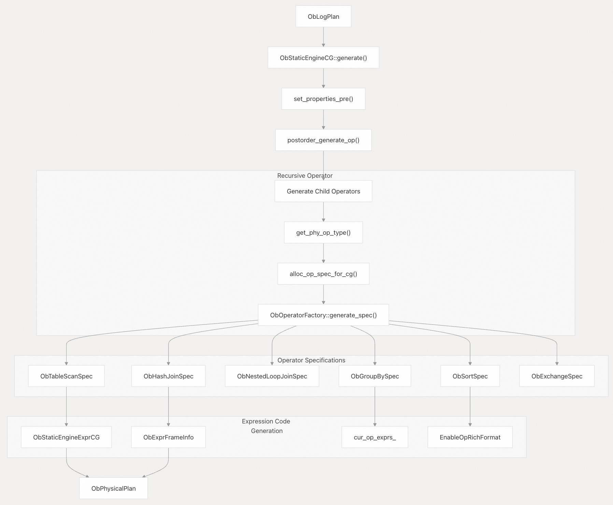
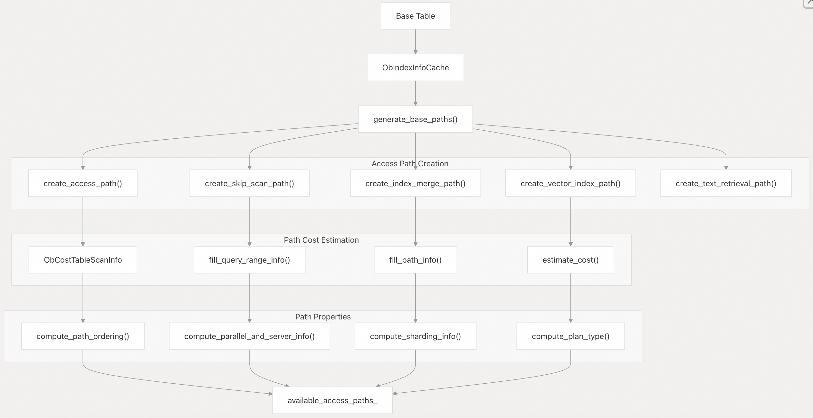
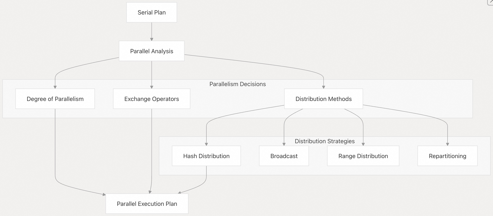

## 体系化剖析开源OB代码: 2.3 优化器    
                
### 作者        
digoal        
                
### 日期          
2025-10-13              
         
### 标签              
PostgreSQL , PolarDB , DuckDB , MySQL , OceanBase         
               
----           
           
## 背景        
本文介绍 OceanBase 中基于成本的查询优化器(`CBO`)，重点介绍连接顺序枚举、访问路径选择和物理计划生成。该优化器接受逻辑重写的查询，并使用动态规划和成本估算生成最优的物理执行计划。  
  
## 架构概述  
查询优化器对 `ObLogPlan` 表示的逻辑计划进行操作，并通过 `ObStaticEngineCG` 生成物理执行计划。核心优化过程使用 `ObJoinOrder` 管理的“连接顺序枚举的动态规划”。  
  
  
  
## 连接顺序枚举(Join Order Enumeration)  
优化器使用动态规划来枚举连接顺序，从单个表到完整的连接树自下而上地构建解决方案。此过程由表示每个级别的部分连接结果的 `ObJoinOrder` 管理。  
  
### 基础级别生成  
优化器首先使用 `generate_base_level_join_order()` 生成基表的访问路径：  
  
  
  
### 动态规划算法  
连接枚举使用 `generate_join_levels_with_IDP()` 进行逐级动态规划：  
  
  
  
## 基于成本的优化器  
优化器使用框架来评估和比较执行计划。成本估算通过`ObOptEstCost`和`ObCostTableScanInfoEstimateCostInfo`结构来考虑 CPU、I/O 和网络成本。  
  
### 成本估算组件  
  
  
  
### Skyline Pruning  
为了管理指数级搜索空间，优化器使用 Skyline Pruning 来消除 dominated plan：  
  
  
  
## 物理计划生成  
选择最优逻辑计划后，`ObStaticEngineCG::generate()` 通过递归遍历将逻辑运算符树转换为物理运算符表示。  
  
### 代码生成过程  
  
  
  
## 关键类和组件  
类	| 用途	| 主要方法  
---|---|---  
`ObJoinOrder` |	表示 DP 枚举中的部分JOIN结果	| `generate_base_paths()`，`generate_join_paths()`  
`ObLogPlan` |	逻辑计划的主容器	| `generate_join_orders()`，`generate_raw_plan()`  
`ObLogicalOperator` |	逻辑运算符的基类	| `get_cost()`，`allocate_exchange()`，`get_card()`  
`ObStaticEngineCG` |	物理计划的代码生成器	| `generate()`，`postorder_generate_op()`  
`AccessPath` |	表访问方法	| `get_cost()`，`get_interesting_order_info()`  
`JoinPath` |	连接操作路径	| `get_join_method()`，`get_join_dist_algo()`  
  
## 优化算法  
### 索引选择和访问路径生成  
优化器通过 `generate_base_paths()` 和专门的路径创建方法评估多个索引的访问路径：  
  
  
  
### 并行执行计划  
优化器确定并行度和数据分布策略：  
  
  
    
#### [期望 PostgreSQL|开源PolarDB 增加什么功能?](https://github.com/digoal/blog/issues/76 "269ac3d1c492e938c0191101c7238216")
  
  
#### [PolarDB 开源数据库](https://openpolardb.com/home "57258f76c37864c6e6d23383d05714ea")
  
  
#### [PolarDB 学习图谱](https://www.aliyun.com/database/openpolardb/activity "8642f60e04ed0c814bf9cb9677976bd4")
  
  
#### [PostgreSQL 解决方案集合](../201706/20170601_02.md "40cff096e9ed7122c512b35d8561d9c8")
  
  
#### [德哥 / digoal's Github - 公益是一辈子的事.](https://github.com/digoal/blog/blob/master/README.md "22709685feb7cab07d30f30387f0a9ae")
  
  
#### [About 德哥](https://github.com/digoal/blog/blob/master/me/readme.md "a37735981e7704886ffd590565582dd0")
  
  

  
