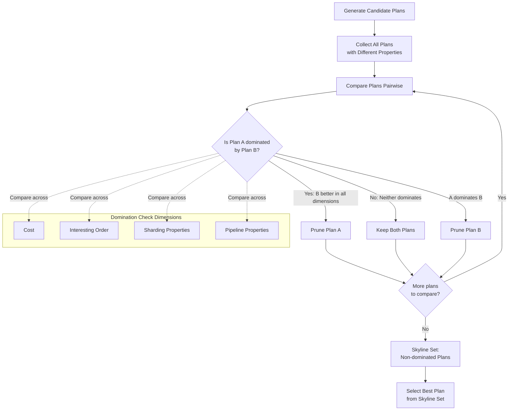
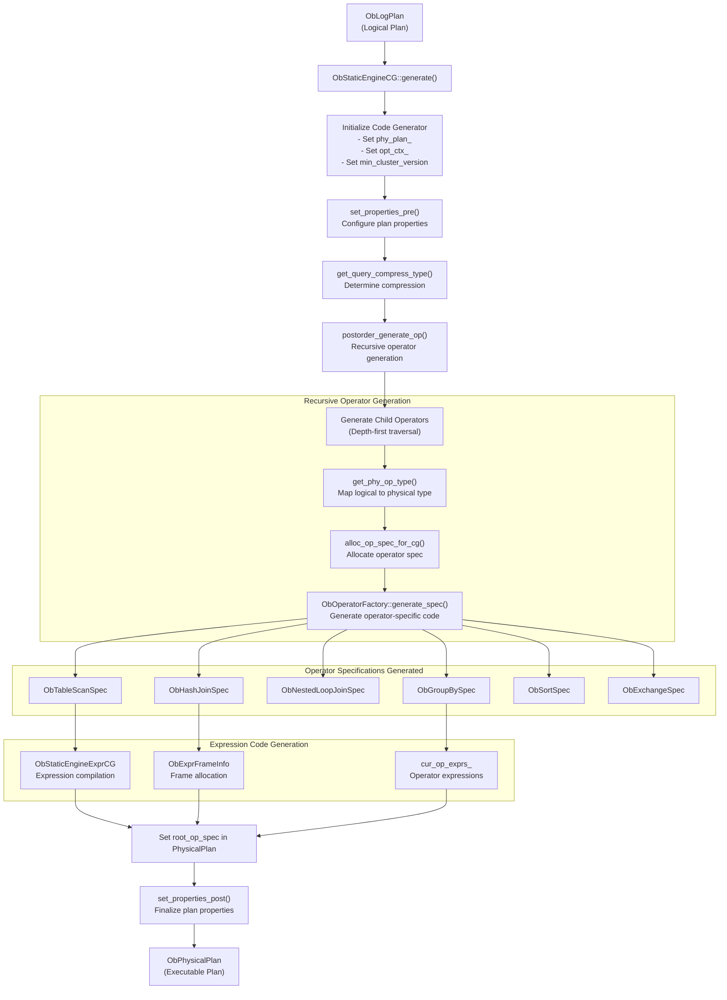
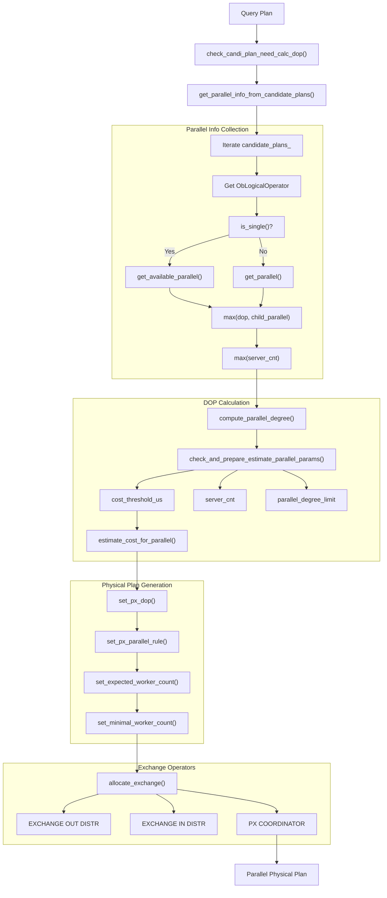

## 体系化剖析开源OB代码: 2.3 优化器    
                
### 作者        
digoal        
                
### 日期          
2025-10-13              
         
### 标签              
PostgreSQL , PolarDB , DuckDB , MySQL , OceanBase         
               
----           
           
## 背景        
本文介绍 OceanBase 中基于成本的查询优化器(`CBO`)，重点介绍连接顺序枚举、访问路径选择和物理计划生成。该优化器接受逻辑重写的查询，并使用动态规划和成本估算生成最优的物理执行计划。  
  
## 架构概述  
查询优化器对 `ObLogPlan` 表示的逻辑计划进行操作，并通过 `ObStaticEngineCG` 生成物理执行计划。核心优化过程使用 `ObJoinOrder` 管理的“连接顺序枚举的动态规划”。  
  
  
  
**源文件:**  
- https://github.com/oceanbase/oceanbase/blob/8e2580cf/src/sql/optimizer/ob_log_plan.cpp#L262-L396
- https://github.com/oceanbase/oceanbase/blob/8e2580cf/src/sql/optimizer/ob_join_order.cpp#L49-L116
- https://github.com/oceanbase/oceanbase/blob/8e2580cf/src/sql/code_generator/ob_static_engine_cg.cpp#L160-L214
  
## 连接顺序枚举(Join Order Enumeration)  
优化器使用动态规划来枚举连接顺序，从单个表到完整的连接树自下而上地构建解决方案。此过程由表示每个级别的部分连接结果的 `ObJoinOrder` 管理。  
  
### 基础级别生成  
优化器首先使用 `generate_base_level_join_order()` 生成基表的访问路径：  
  
  
  
**源文件:**  
- https://github.com/oceanbase/oceanbase/blob/8e2580cf/src/sql/optimizer/ob_log_plan.cpp#L709-L732
- https://github.com/oceanbase/oceanbase/blob/8e2580cf/src/sql/optimizer/ob_join_order.cpp#L684-L723
- https://github.com/oceanbase/oceanbase/blob/8e2580cf/src/sql/optimizer/ob_join_order.cpp#L314-L391
  
### 动态规划算法  
连接枚举使用 `generate_join_levels_with_IDP()` 进行逐级动态规划：  
  
  
  
**源文件:**  
- https://github.com/oceanbase/oceanbase/blob/8e2580cf/src/sql/optimizer/ob_log_plan.cpp#L371-L373
- https://github.com/oceanbase/oceanbase/blob/8e2580cf/src/sql/optimizer/ob_join_order.h#L744-L900
- https://github.com/oceanbase/oceanbase/blob/8e2580cf/src/sql/optimizer/ob_skyline_prunning.h#L15-L35
  
## 基于成本的优化器  
优化器使用框架来评估和比较执行计划。成本估算通过`ObOptEstCost`和`ObCostTableScanInfoEstimateCostInfo`结构来考虑 CPU、I/O 和网络成本。  
  
### 成本/代价估算组件  
  
  
  
代价模型框架:  

```mermaid
graph TD
    A["ObOptEstCost<br/>(Static Interface)"] --> B["GET_COST_MODEL Macro"]
    B --> C["ObOptEstCostModel<br/>(Normal Model)"]
    B --> D["ObOptEstVectorCostModel<br/>(Vector Model)"]
    
    E["ObOptimizerContext"] --> F["cost_model_type"]
    F -->|"VECTOR_MODEL"| D
    F -->|"Default"| C
    
    C --> G["ObOptCostModelParameter<br/>(cost_params_normal)"]
    D --> H["ObOptCostModelParameter<br/>(cost_params_vector)"]
    
    C --> I["OptSystemStat"]
    D --> I
    
    J["Cost Estimation Methods"] --> A
    
    J --> K["Join Operations"]
    K --> K1["cost_nestloop"]
    K --> K2["cost_mergejoin"]
    K --> K3["cost_hashjoin"]
    
    J --> L["Aggregation Operations"]
    L --> L1["cost_merge_group"]
    L --> L2["cost_hash_group"]
    L --> L3["cost_scalar_group"]
    
    J --> M["Table Access"]
    M --> M1["cost_table"]
    M --> M2["cost_index_back"]
    M --> M3["calc_range_cost"]
    
    J --> N["Sort & Exchange"]
    N --> N1["cost_sort"]
    N --> N2["cost_exchange"]
    N --> N3["cost_sort_and_exchange"]
    
    J --> O["Set Operations"]
    O --> O1["cost_union_all"]
    O --> O2["cost_merge_set"]
    O --> O3["cost_hash_set"]
    
    J --> P["DML Operations"]
    P --> P1["cost_update"]
    P --> P2["cost_delete"]
    P --> P3["cost_insert"]
    
    style A fill:#e1f5ff
    style C fill:#fff4e1
    style D fill:#fff4e1
    style G fill:#f0f0f0
    style H fill:#f0f0f0
    style I fill:#f0f0f0
```
  

  
**源文件:**  
- https://github.com/oceanbase/oceanbase/blob/8e2580cf/src/sql/optimizer/ob_join_order.cpp#L54-L116
- https://github.com/oceanbase/oceanbase/blob/8e2580cf/src/sql/optimizer/ob_join_order.h#L246-L293
- https://github.com/oceanbase/oceanbase/blob/8e2580cf/src/sql/optimizer/ob_opt_est_cost.h
  
### Skyline Pruning  
为了管理指数级搜索空间，优化器使用 Skyline Pruning 来消除 dominated plan：  
  
  
  
Skyline Pruning for Plan Selection:  
  

  
**源文件:**  
- https://github.com/oceanbase/oceanbase/blob/8e2580cf/src/sql/optimizer/ob_skyline_prunning.h
- https://github.com/oceanbase/oceanbase/blob/8e2580cf/src/sql/optimizer/ob_join_order.cpp#L1794-L1900
  
## 物理计划生成  
选择最优逻辑计划后，`ObStaticEngineCG::generate()` 通过递归遍历将逻辑运算符树转换为物理运算符表示。  
  
### 代码生成过程  
  
  
  
Physical Plan Code Generation Pipeline:  
  

  
**源文件:**  
- https://github.com/oceanbase/oceanbase/blob/8e2580cf/src/sql/code_generator/ob_static_engine_cg.cpp#L160-L214
- https://github.com/oceanbase/oceanbase/blob/8e2580cf/src/sql/code_generator/ob_static_engine_cg.cpp#L216-L412
- https://github.com/oceanbase/oceanbase/blob/8e2580cf/src/sql/code_generator/ob_static_engine_cg.cpp#L329-L357
  
## 关键类和组件  
**Core Optimizer Classes**  
  
类	| 用途	| 主要方法  
---|---|---  
`ObJoinOrder` |	表示 DP 枚举中的部分JOIN结果	| `generate_base_paths()`，`generate_join_paths()`  
`ObLogPlan` |	逻辑计划的主容器	| `generate_join_orders()`，`generate_raw_plan()`  
`ObLogicalOperator` |	逻辑运算符的基类	| `get_cost()`，`allocate_exchange()`，`get_card()`  
`ObStaticEngineCG` |	物理计划的代码生成器	| `generate()`，`postorder_generate_op()`  
`AccessPath` |	表访问方法	| `get_cost()`，`get_interesting_order_info()`  
`JoinPath` |	连接操作路径	| `get_join_method()`，`get_join_dist_algo()`  
  
**源文件:**  
- https://github.com/oceanbase/oceanbase/blob/8e2580cf/src/sql/optimizer/ob_join_order.h#L51-L157
- https://github.com/oceanbase/oceanbase/blob/8e2580cf/src/sql/optimizer/ob_log_plan.h#L162-L215
- https://github.com/oceanbase/oceanbase/blob/8e2580cf/src/sql/optimizer/ob_logical_operator.h#L376-L435
  
## 优化算法  
### 索引选择和访问路径生成  
优化器通过 `generate_base_paths()` 和专门的路径创建方法评估多个索引的访问路径：  
  
  
  
Index Selection and Access Path Generation:

```mermaid
flowchart TD
    START["create_access_paths()"] --> GENCOLQUAL["get_generated_col_index_qual()"]
    GENCOLQUAL --> TEXTRETRIEVAL["init_basic_text_retrieval_info()"]
    TEXTRETRIEVAL --> INDEXMERGE["create_index_merge_access_paths()"]
    
    INDEXMERGE --> CHECKIGNORE{ignore_normal_access_path?}
    CHECKIGNORE -->|Yes| END["Return access_paths"]
    CHECKIGNORE -->|No| GETVALID["get_valid_index_ids()"]
    
    GETVALID --> FILLCACHE["fill_index_info_cache()"]
    FILLCACHE --> HEURISTICS["add_table_by_heuristics()"]
    
    HEURISTICS --> CHECKVALID{valid_index_ids empty?}
    CHECKVALID -->|Yes| SKYLINE["skyline_prunning_index()"]
    CHECKVALID -->|No| ITERATE
    SKYLINE --> ITERATE
    
    subgraph "For each valid index"
        ITERATE["Iterate valid_index_ids"] --> WILLDAS["will_use_das()"]
        WILLDAS --> WILLSKIP["will_use_skip_scan()"]
        WILLSKIP --> WILLCOLSTORE["will_use_column_store()"]
        
        WILLCOLSTORE --> CREATEDASROW{create DAS row store path?}
        CREATEDASROW -->|Yes| CREATEONE1["create_one_access_path()<br/>use_das=true, use_column_store=false"]
        CREATEONE1 --> PUSHPATH1["Push to access_paths"]
        
        PUSHPATH1 --> CREATEDASCOLUMN{create DAS column store path?}
        CREATEDASCOLUMN -->|Yes| CREATEONE2["create_one_access_path()<br/>use_das=true, use_column_store=true"]
        CREATEONE2 --> PUSHPATH2["Push to access_paths"]
        
        PUSHPATH2 --> CREATEBASICROW{create basic row store path?}
        CREATEBASICROW -->|Yes| CREATEONE3["create_one_access_path()<br/>use_das=false, use_column_store=false"]
        CREATEONE3 --> PUSHPATH3["Push to access_paths"]
        
        PUSHPATH3 --> CREATEBASICCOLUMN{create basic column store path?}
        CREATEBASICCOLUMN -->|Yes| CREATEONE4["create_one_access_path()<br/>use_das=false, use_column_store=true"]
        CREATEONE4 --> PUSHPATH4["Push to access_paths"]
    end
    
    PUSHPATH4 --> COMPUTECOST["compute_cost_and_prune_access_path()"]
    COMPUTECOST --> COMPUTESHARDING["compute_sharding_info_for_base_paths()"]
    COMPUTESHARDING --> COMPUTEPARALLEL["compute_parallel_and_server_info_for_base_paths()"]
    COMPUTEPARALLEL --> PRUNEUNSTABLE["pruning_unstable_access_path()"]
    PRUNEUNSTABLE --> END
    
    subgraph "Skyline Pruning Details"
        SKYLINE --> TRYPRUNE["try_prune_non_unique_index()"]
        TRYPRUNE --> CALDIM["For each candidate index:<br/>cal_dimension_info()"]
        CALDIM --> RECORDER["ObSkylineDimRecorder::add_index_dim()"]
        RECORDER --> GETDOMINATED["get_dominated_idx_ids()"]
    end
    
    subgraph "Access Path Creation Details"
        CREATEONE1 --> ALLOCAP["Allocate AccessPath"]
        ALLOCAP --> FILLRANGE["fill_query_range_info()"]
        FILLRANGE --> FILLFILTERS["fill_filters()"]
        FILLFILTERS --> INITFILTERSEL["init_filter_selectivity()"]
        INITFILTERSEL --> INITCOLSTORE["init_column_store_est_info()"]
        INITCOLSTORE --> COMPUTEBATCH["compute_access_path_batch_rescan()"]
    end
    
    subgraph "Path Property Computation"
        COMPUTESHARDING --> SETSHARDING["set_sharding_info_for_base_path()"]
        SETSHARDING --> COMPUTEPLANTYPE["compute_base_table_path_plan_type()"]
        COMPUTEPLANTYPE --> COMPUTEORDERING["compute_base_table_path_ordering()"]
    end
```

  
**源文件:**  
- https://github.com/oceanbase/oceanbase/blob/8e2580cf/src/sql/optimizer/ob_join_order.cpp#L2925-L3300
- https://github.com/oceanbase/oceanbase/blob/8e2580cf/src/sql/optimizer/ob_join_order.cpp#L592-L658
- https://github.com/oceanbase/oceanbase/blob/8e2580cf/src/sql/optimizer/ob_log_table_scan.cpp#L146-L172
  
### 并行执行计划  
优化器确定并行度和数据分布策略：  
  
  
  
Parallel Execution Planning:  

  
**源文件:**  
- https://github.com/oceanbase/oceanbase/blob/8e2580cf/src/sql/optimizer/ob_join_order.cpp#L679-L717
- https://github.com/oceanbase/oceanbase/blob/8e2580cf/src/sql/optimizer/ob_logical_operator.cpp#L45-L129
    
#### [期望 PostgreSQL|开源PolarDB 增加什么功能?](https://github.com/digoal/blog/issues/76 "269ac3d1c492e938c0191101c7238216")
  
  
#### [PolarDB 开源数据库](https://openpolardb.com/home "57258f76c37864c6e6d23383d05714ea")
  
  
#### [PolarDB 学习图谱](https://www.aliyun.com/database/openpolardb/activity "8642f60e04ed0c814bf9cb9677976bd4")
  
  
#### [PostgreSQL 解决方案集合](../201706/20170601_02.md "40cff096e9ed7122c512b35d8561d9c8")
  
  
#### [德哥 / digoal's Github - 公益是一辈子的事.](https://github.com/digoal/blog/blob/master/README.md "22709685feb7cab07d30f30387f0a9ae")
  
  
#### [About 德哥](https://github.com/digoal/blog/blob/master/me/readme.md "a37735981e7704886ffd590565582dd0")
  
  

  
