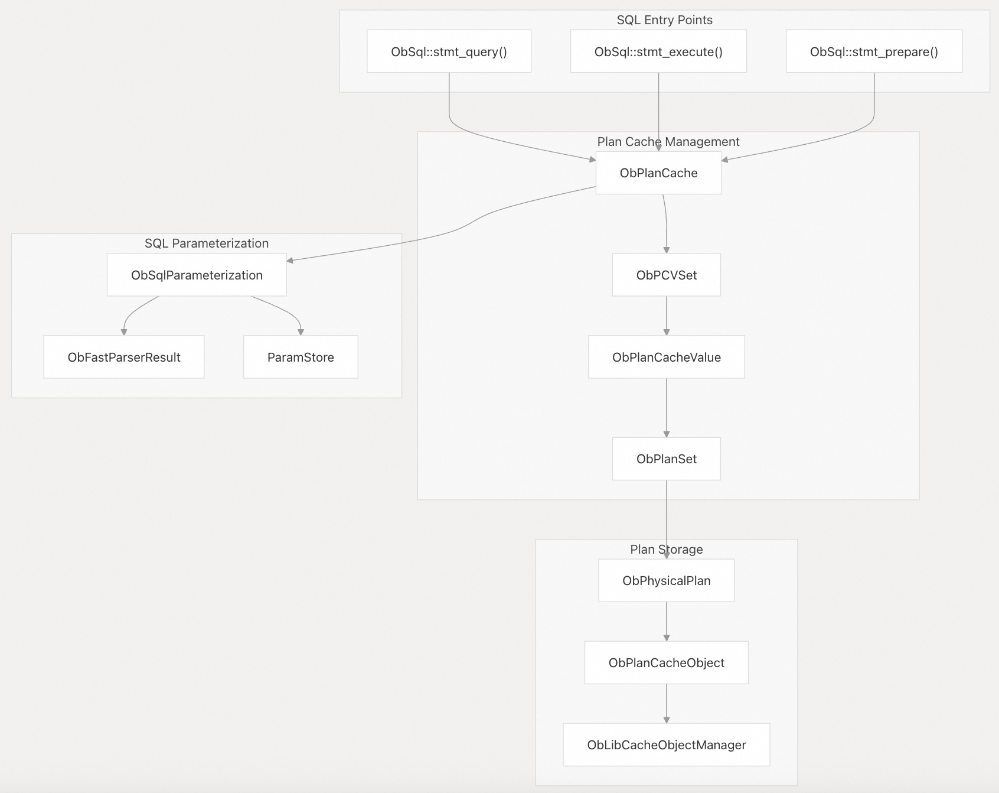
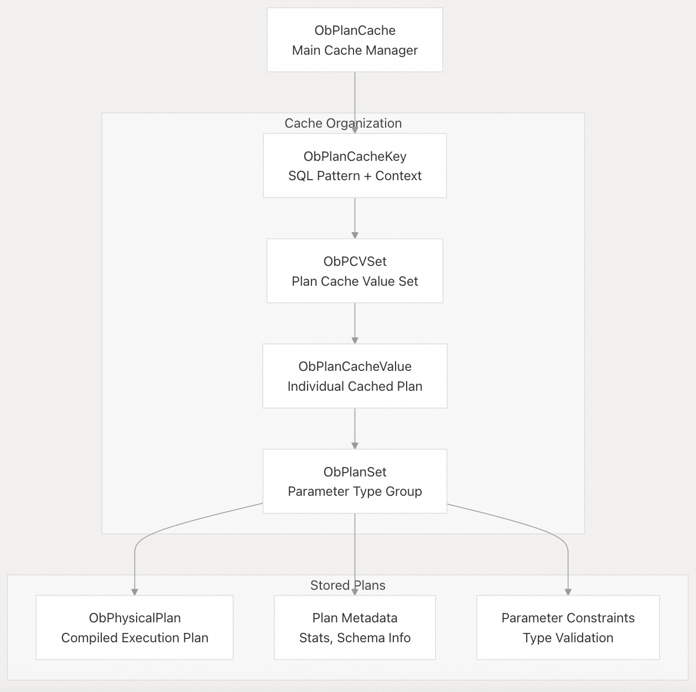
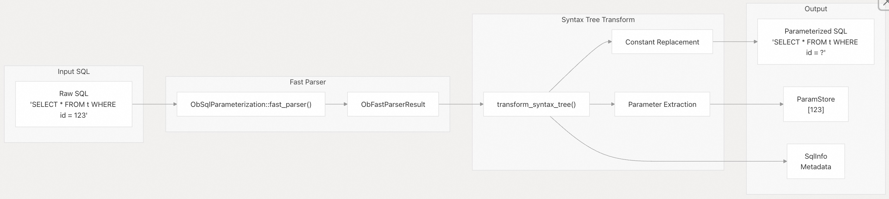
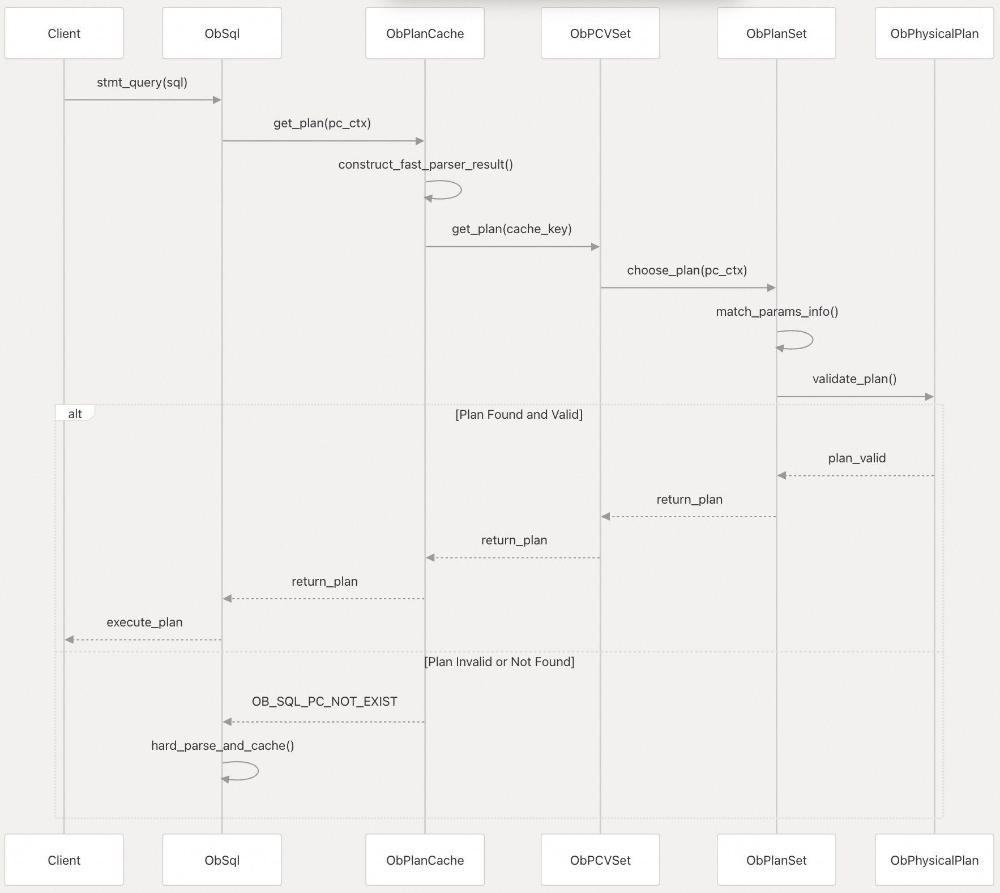
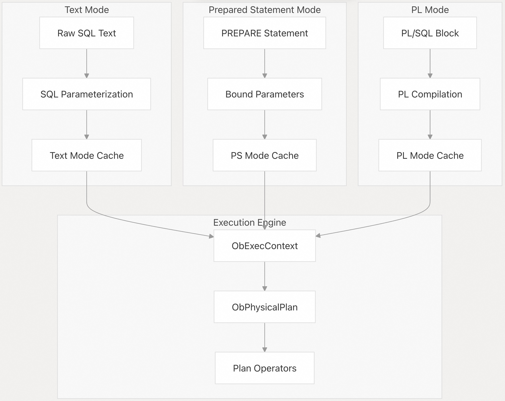
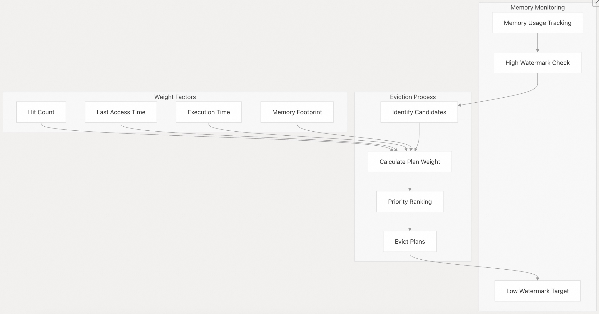
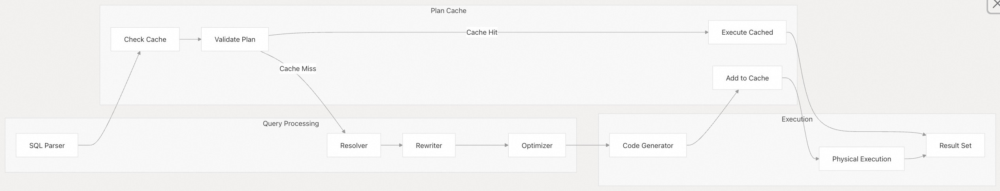

## 体系化剖析开源OB代码: 2.4 计划缓存与执行器      
                  
### 作者          
digoal          
                  
### 日期            
2025-10-13                
           
### 标签                
PostgreSQL , PolarDB , DuckDB , MySQL , OceanBase           
                 
----             
             
## 背景          
计划缓存和执行器系统负责管理 OceanBase 中已编译好的 SQL 执行计划的缓存、检索和执行。该系统通过存储常用的执行计划以避免重新编译来优化 SQL 性能，同时还处理 SQL 参数化，以最大限度地提高类似查询的计划重用。  
  
## 系统概述  
计划缓存是已编译好的执行计划的中央存储库，它实现了一套复杂的缓存策略，包括 SQL 参数化、plan 验证和自动驱逐。系统通过维护一个可重用的物理计划池来弥补查询`编译和执行`之间的差距。  
  
### 核心架构  
  
    
  
**源文件:**  
- https://github.com/oceanbase/oceanbase/blob/8e2580cf/src/sql/ob_sql.cpp#L132-L241
- https://github.com/oceanbase/oceanbase/blob/8e2580cf/src/sql/plan_cache/ob_plan_cache.cpp#L353-L436
- https://github.com/oceanbase/oceanbase/blob/8e2580cf/src/sql/plan_cache/ob_plan_cache_value.cpp#L153-L387
  
  
## 计划缓存结构  
计划缓存实现了分层结构，以便根据 SQL pattern 和参数类型有效地组织和检索缓存中的计划。  
  
### 缓存层次结构  
  
    
  
**源文件:**  
- https://github.com/oceanbase/oceanbase/blob/8e2580cf/src/sql/plan_cache/ob_plan_cache.h#L353-L435
- https://github.com/oceanbase/oceanbase/blob/8e2580cf/src/sql/plan_cache/ob_plan_cache_value.h#L153-L620
- https://github.com/oceanbase/oceanbase/blob/8e2580cf/src/sql/plan_cache/ob_plan_set.h#L34-L200
  
### 关键组件  
组件	| 类	| 用途  
---|---|---  
缓存管理器	| `ObPlanCache` | 	整体缓存管理、驱逐策略  
缓存键值	| `ObPlanCacheKey` | 	通过 SQL pattern 和上下文识别缓存的计划  
值集	| `ObPCVSet` | 	对相同 SQL pattern 的计划进行分组  
缓存值	| `ObPlanCacheValue` | 	使用元数据包装(Wraps)各个缓存计划  
计划设置	| `ObPlanSet` | 	将具有相同结构但不同参数类型的计划分组  
物理计划	| `ObPhysicalPlan` | 	实际编译的执行计划  
  
**源文件:**  
- https://github.com/oceanbase/oceanbase/blob/8e2580cf/src/sql/plan_cache/ob_plan_cache_struct.h#L54-L147
- https://github.com/oceanbase/oceanbase/blob/8e2580cf/src/sql/engine/ob_physical_plan.h#L94-L680
  
## SQL 参数化  
SQL 参数化对于计划重用至关重要，将 SQL 语句中的文字值转换为参数，以使多个类似的查询共享相同的执行计划。  
  
### 参数化过程  
  
    
  
**源文件:**  
- https://github.com/oceanbase/oceanbase/blob/8e2580cf/src/sql/plan_cache/ob_sql_parameterization.cpp#L132-L228
- https://github.com/oceanbase/oceanbase/blob/8e2580cf/src/sql/plan_cache/ob_sql_parameterization.h#L23-L128
  
### 参数化规则  
系统采用复杂的规则(rule)来确定哪些常量可以安全地参数化：  
- 可参数化：`WHERE` 子句中的简单文字、`INSERT` values  
- 不可参数化：`ORDER BY` 位置中的常量、`LIMIT` 子句、需要指定类型的函数参数  
- 上下文相关：聚合函数中的常量、时间表达式  
  
**源文件:**  
- https://github.com/oceanbase/oceanbase/blob/8e2580cf/src/sql/plan_cache/ob_sql_parameterization.cpp#L298-L378
- https://github.com/oceanbase/oceanbase/blob/8e2580cf/src/sql/plan_cache/ob_sql_parameterization.cpp#L448-L900  
  
## 计划的检索和验证  
计划缓存实现了多阶段验证过程，以确保缓存的计划保持有效并与当前执行上下文兼容。  
  
### 计划的查找流程  
  
    
  
**源文件:**  
- https://github.com/oceanbase/oceanbase/blob/8e2580cf/src/sql/plan_cache/ob_plan_cache.cpp#L572-L641
- https://github.com/oceanbase/oceanbase/blob/8e2580cf/src/sql/plan_cache/ob_plan_cache_value.cpp#L467-L620
  
### 计划的验证检查  
系统在返回缓存计划之前执行多项验证检查：  
  
验证类型	| 执行	| 验证检查目的  
---|---|---  
schema 版本	| `check_schema_version()`	| 确保引用的对象没有改变  
参数类型	| `match_params_info()`	| 验证参数类型兼容  
权限	| `match_priv_cons()`	| 	检查用户是否仍具有所需权限  
会话变量	| `match_variable_meta()`	| 	依赖会话变量时的变量验证  
计划到期	| `is_expired()`	| 	检查执行计划是否需要重新生成  
  
**源文件:**  
- https://github.com/oceanbase/oceanbase/blob/8e2580cf/src/sql/plan_cache/ob_plan_set.cpp#L71-L219
- https://github.com/oceanbase/oceanbase/blob/8e2580cf/src/sql/engine/ob_physical_plan.cpp#L594-L685
  
## 计划执行模式  
OceanBase 支持不同的执行模式，这些模式会影响计划的缓存和执行方式。  
  
### 执行模式  
  
    
  
**源文件:**  
- https://github.com/oceanbase/oceanbase/blob/8e2580cf/src/sql/ob_sql.cpp#L154-L201
- https://github.com/oceanbase/oceanbase/blob/8e2580cf/src/sql/ob_sql.cpp#L203-L240
- https://github.com/oceanbase/oceanbase/blob/8e2580cf/src/sql/plan_cache/ob_plan_cache_struct.h#L45-L52  
  
## 计划驱逐和内存管理  
计划缓存实现了复杂的内存管理，以在内存压力下保持最佳性能。  
  
### 驱逐策略  
  
    
  
**源文件:**  
- https://github.com/oceanbase/oceanbase/blob/8e2580cf/src/sql/plan_cache/ob_plan_cache.cpp#L276-L351
- https://github.com/oceanbase/oceanbase/blob/8e2580cf/src/sql/engine/ob_physical_plan.cpp#L496-L574  
  
### 计划统计信息以及自适应管理  
系统跟踪每个计划的详细统计数据，以告知缓存用于决策后续动作：  
  
统计项	| 目的	| 何时触发统计  
---|---|---  
`hit_count_` | 	跟踪计划重用频率	| 每次计划被检索时  
`execute_times_` | 	总执行次数	| 每次执行完成  
`elapsed_time_` | 	跟踪累计执行时间	| 每次执行  
`cpu_time_` | 	监视 CPU 使用率	| 每次执行  
`rows_processed_` | 	跟踪被处理的记录数	| 每次执行  
`last_active_time_` | 	识别不活跃计划	| 每次访问  
  
**源文件:**  
- https://github.com/oceanbase/oceanbase/blob/8e2580cf/src/sql/engine/ob_physical_plan.cpp#L496-L574
- https://github.com/oceanbase/oceanbase/blob/8e2580cf/src/sql/plan_cache/ob_plan_cache_util.h#L444-L520
  
## 与 SQL 处理管道集成  
计划缓存与更广泛的 SQL 处理管道无缝集成，充当了查询编译器和执行器之间的桥梁。  
  
### SQL 处理集成  
  
    
  
**源文件:**  
- https://github.com/oceanbase/oceanbase/blob/8e2580cf/src/sql/ob_sql.cpp#L132-L201
- https://github.com/oceanbase/oceanbase/blob/8e2580cf/src/sql/plan_cache/ob_plan_cache.cpp#L572-L641
  
计划缓存和执行系统是关键的性能优化组件，它通过全面的验证机制，减少 SQL 编译开销，同时确保执行的正确性。其先进的参数化和缓存策略，可实现不同工作负载的高性能查询处理。  
      
#### [期望 PostgreSQL|开源PolarDB 增加什么功能?](https://github.com/digoal/blog/issues/76 "269ac3d1c492e938c0191101c7238216")
  
  
#### [PolarDB 开源数据库](https://openpolardb.com/home "57258f76c37864c6e6d23383d05714ea")
  
  
#### [PolarDB 学习图谱](https://www.aliyun.com/database/openpolardb/activity "8642f60e04ed0c814bf9cb9677976bd4")
  
  
#### [PostgreSQL 解决方案集合](../201706/20170601_02.md "40cff096e9ed7122c512b35d8561d9c8")
  
  
#### [德哥 / digoal's Github - 公益是一辈子的事.](https://github.com/digoal/blog/blob/master/README.md "22709685feb7cab07d30f30387f0a9ae")
  
  
#### [About 德哥](https://github.com/digoal/blog/blob/master/me/readme.md "a37735981e7704886ffd590565582dd0")
  
  

  
