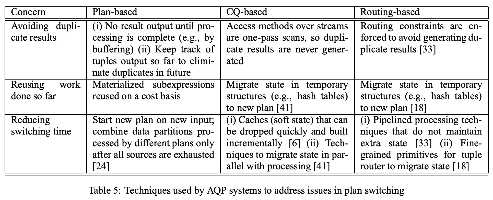

## AI论文解读 | Adaptive Query Processing In The Looking Glass
        
### 作者        
digoal        
        
### 日期        
2025-10-14        
        
### 标签        
PostgreSQL , PolarDB , DuckDB , AI , 论文解读        
        
----        
        
## 背景  
      
https://people.csail.mit.edu/tdanford/6830papers/babu-adaptive-query-processing.pdf        
  
提示:          
```          
读懂《Adaptive Query Processing In The Looking Glass》这篇论文需要提前掌握哪些基础知识, 请使用中文通熟易懂的讲解这些基础知识, 可以引用论文中的图、表或使用Markdown支持的图形(text,mermaid等)增加解释性. 
  
使用中文通熟易懂的解读《Adaptive Query Processing In The Looking Glass》这篇论文, 其中的关键内容请着重讲解, 可以引用论文中的图、表或使用Markdown支持的图形(text,mermaid等)增加解释性. 
  
提取《Adaptive Query Processing In The Looking Glass》这篇论文中的重要术语, 使用中文对这些术语进行通熟易懂的讲解, 可以引用论文中的图、表或使用Markdown支持的图形(text,mermaid等)增加解释性. 
```     
  
## 1 前置知识 
  
好的，为了完全理解《Adaptive Query Processing in the Looking Glass》这篇论文，您需要先掌握一些数据库查询处理领域的基础知识。这篇论文并非提出一个全新的自适应查询处理（AQP）技术，而是对当时（2005年）已有的各类AQP技术进行系统性的梳理、分类和比较，如同“照镜子”一样审视整个领域。

以下我将为您通俗易懂地讲解所需的基础知识，并引用论文中的图表来加深理解。

### 基础知识一：传统的数据库查询处理流程

这是理解所有“自适应”思想的出发点。传统数据库在执行一条SQL查询时，遵循一个严格的、分两步走的策略，论文中称之为 **“先计划，后执行” (plan-first execute-next)** 。

这个流程可以分解为三个核心角色，正如论文中的 **Figure 2** 所示：

  

图 1: 传统的查询处理方法 (引用自论文 Figure 2 )

1.  **查询优化器 (Optimizer)** ：

      * **作用**：它是数据库的“大脑”。当收到一条查询语句（例如SQL）后，它的任务不是立即执行，而是先找出“最好”的执行方式。
      * **执行计划 (Execution Plan)**：所谓“最好的方式”，就是生成一个被称为**执行计划**的东西。执行计划是一个由多个基本操作（称为“算子”，如“表扫描”、“索引扫描”、“哈希连接”等）组成的树状结构，它详细规定了数据如何被读取、处理和连接，最终得出结果。
      * **决策依据**：优化器如何判断哪个计划“最好”？它依赖于一个**成本模型**和存储在数据库中的**统计信息 (Statistics)** ，比如表有多大、某个字段的数据分布是否均匀等。通过这些信息，它估算每个可能计划的执行成本（如CPU和I/O开销），然后选择成本最低的那个。

2.  **执行器 (Executor)** ：

      * **作用**：它是一个“忠实的工人”。一旦优化器选定了执行计划，执行器就严格按照这个计划去操作数据，一步步完成计算，直到生成最终查询结果 。在整个执行过程中，它不会再“思考”这个计划好不好了。

3.  **统计信息跟踪器 (Statistics Tracker)** ：

      * **作用**：负责收集和更新优化器所依赖的统计信息 。这个过程通常不是自动和实时的，需要数据库管理员（DBA）手动执行命令（如 `runstats`）来更新 。

**简单比喻**：您要去一个陌生地方，传统方法就像您出发前，用一张旧地图（统计信息）规划出一条自认为最优的路线（执行计划），然后无论路上遇到堵车还是新修了近路（实际数据情况），您都必须严格按照原定路线走到底。

### 基础知识二：传统方法的“痛点”——为什么需要自适应？

这篇论文的核心动机，就是解决传统“先计划，后执行”方法的固有缺陷。当计划所依赖的“地图”不准时，最终的执行效率可能会非常糟糕。

论文在第2节  总结了几个主要原因：

1.  **错误的统计信息 (Optimizer Mistakes)**：

      * **过时**：统计信息可能很久没更新了，与真实数据情况严重不符 。
      * **不准**：为了节省开销，统计信息通常是抽样估算出来的，本身就有误差。
      * **假设不成立**：优化器常常做一些理想化假设，比如认为不同列之间的数据是相互独立的，但这在现实世界中往往不成立 。这些错误可能导致优化器选出的“最优”计划，实际上比其他计划慢几个数量级 。

2.  **未知的统计信息 (Unknown Statistics)**：

      * 查询可能涉及外部数据源，如Web服务，这些数据源根本不提供统计信息 。此时优化器只能“盲猜”，计划质量全凭运气。

3.  **动态变化的环境 (Changes in Input/System Conditions)**：

      * 对于需要长时间运行的查询（例如，在数据流系统中的**连续查询 (Continuous Queries)**），数据本身的特性和系统负载（如可用内存）都可能在查询执行期间发生巨大变化 。一个在开始时最优的计划，可能在几分钟后就变得非常低效。

### 基础知识三：核心概念——什么是自适应查询处理（AQP）？

理解了传统方法的痛点后，AQP 的概念就水到渠成了。

AQP 的核心思想是：**将优化和执行交织在一起 (interleaved)** 。它不再是“一次性”规划，而是在执行过程中持续监控，并根据实际情况动态调整执行策略。

**简单来说，就是“边执行、边观察、边调整”。**

论文中的 **Figure 3** 很好地展示了这种新模式（以其中的“plan-based”系统为例）：

  

图 2: Plan-based AQP 系统中的处理流程 (引用自论文 Figure 3 )

与图1相比，这里出现了关键的反馈循环：

  * 执行器在执行计划的同时，会嵌入一些额外的操作来**实时追踪统计信息** (Statistics on query subexpressions) 。
  * 将**观察到的真实统计信息** (observed statistics)  与优化器最初的估算进行比较。
  * 如果发现两者差异巨大，就会触发**重优化 (re-optimize)** ，让优化器基于更新、更准确的信息，为“剩下”的查询任务生成一个新的、更好的计划。

**继续用导航比喻**：AQP 就像使用一个实时在线地图（如谷歌地图）。您出发时它会规划一条路线，但在行驶过程中，它会持续监控实时路况。如果前方出现严重拥堵，它会立即为您重新规划一条更快的路线。

### 基础知识四：关键的物理执行算子

要理解 AQP 如何“调整”计划，您需要对执行计划中的一些基本组件（物理算子）有初步了解。因为所谓的“调整”，很多时候就是替换一个算子或改变算子之间的顺序。

  * **数据访问方法**：
      * **全表扫描 (Table Scan)**：从头到尾读取整张表。
      * **索引扫描 (Index Scan)**：通过索引快速定位到所需数据，适合高选择性的查询（只返回少量数据）。
  * **连接 (Join) 方法**：当查询涉及多表关联时，连接方法的选择至关重要。
      * **嵌套循环连接 (Nested-Loop Join)**：对于一张小表和一张大表（且大表在连接字段上有索引）的连接非常高效。
      * **哈希连接 (Hash Join)**：对于两张大表的等值连接通常是最高效的，但需要较多内存。
      * **排序归并连接 (Sort-Merge Join)**：如果两个表都已经按连接键排好序，则此方法非常快。

了解这些算子的不同适用场景，您就能明白为什么当 AQP 系统发现一个表比预期大得多时，可能会将原计划中的“嵌套循环连接”动态切换为“哈希连接”。

### 总结

掌握以上四点基础知识后，您就可以顺利读懂这篇论文了：

1.  **传统查询处理** 是 AQP 要改进的背景板。
2.  **传统方法的痛点** 是 AQP 存在的核心价值。
3.  **AQP的核心思想**（执行与优化交织）是所有技术分支的共同灵魂。
4.  **物理算子** 是 AQP 进行动态调整的具体“零件”。

有了这些铺垫，您在阅读论文时，就能轻松理解它为何要将众多 AQP 系统分为 **plan-based (基于计划的)**、**CQ-based (基于连续查询的)** 和 **routing-based (基于路由的)**  这三个类别，并能看懂作者从计划质量、统计监控、计划迁移和可扩展性等多个维度对它们进行的深入比较和剖析 。
  
## 2 解读论文 
  
好的，这篇《Adaptive Query Processing in the Looking Glass》（镜中自适应查询处理）是一篇在数据库领域非常重要的综述性论文。它的核心价值不在于提出了一个全新的革命性技术，而在于它首次对当时（2005年）已经出现的各种自适应查询处理（AQP）技术进行了系统性的梳理、分类和比较，如同让整个 AQP 领域“照镜子”来审视自己 。

下面，我将为您通俗易懂地解读这篇论文的关键内容。

### 一、 核心动机：为什么传统数据库查询“不够智能”？

要理解“自适应”的好处，首先要明白传统方法的局限。

传统数据库采用一种被称为 **“先计划，后执行” (plan-first, execute-next)** 的刚性策略 。这就像你出门前用一张旧地图规划好一条“最优”路线，然后无论路上遇到堵车还是新修了近路，都必须严格按原路线走到底。

这个过程依赖于三个角色，正如论文中的 **Figure 2** 所示：

  

图 1: 传统的查询处理流程 (引用自论文 Figure 2)

1.  **优化器 (Optimizer)**：数据库的“大脑”，根据存储的**统计信息**（如表的大小、数据分布等）估算成本，为一条SQL查询选择一个它认为最高效的**执行计划** 。
2.  **执行器 (Executor)**：忠实的“工人”，严格按照优化器给定的计划执行，直到完成 。
3.  **统计信息跟踪器 (Statistics Tracker)**：负责维护统计信息，通常需要DBA手动更新 。

**这种方法的“痛点”非常明显：**

  * **优化器会犯错**：统计信息可能过时、不准确，或者优化器的成本估算模型过于简化，导致选出的“最优”计划实际上可能比其他计划慢几个数量级 。
  * **无法应对未知**：当查询涉及外部数据源（如Web服务）时，根本没有统计信息可用，优化器只能“盲猜” 。
  * **无法适应变化**：对于长时间运行的查询（如数据流上的连续查询），数据特性和系统资源（如内存）都可能在执行期间发生巨大变化，一个开始时最优的计划可能很快就变得低效 。

**自适应查询处理 (AQP)** 就是为了解决这些问题而生的。它的核心思想是：**将优化和执行交织在一起 ，边执行、边观察、边调整**，让查询处理过程变得更加“智能”和“健壮” 。

### 二、 论文的核心贡献：为 AQP 系统划分三大“流派”

这篇论文最重要的贡献，就是将当时五花八门的 AQP 系统清晰地划分为三个具有代表性的家族（Families）。

#### 1\. 基于计划的系统 (Plan-based Systems)

这是对传统方法最直接的扩展，可以理解为“带反馈和修正的传统模式”。

  * **核心思想**：仍然由优化器先生成一个完整的执行计划，但在执行过程中会监控关键点的实际情况（例如，一个中间步骤产生了多少数据） 。
  * **工作机制**：如果监控到的实际值与优化器的估算值出现“重大偏差”，系统就会暂停当前的执行，触发一次**重优化 (re-optimization)**，让优化器利用刚刚观察到的、更准确的信息为剩下的任务生成一个新计划 。
  * **示意图**：论文的 **Figure 3** 清晰地展示了这个反馈循环。

  

图 2: 基于计划的 AQP 系统 (引用自论文 Figure 3)

  * **现实比喻**：就像使用带有实时路况功能的GPS导航。它先给你规划一条路线，但在行驶中如果检测到前方有严重拥堵（实际情况与预期不符），它会立即为你重新规划一条更快的路。
  * **代表系统**：Re-Opt , POP , Tukwila 。

#### 2\. 基于路由的系统 (Routing-based Systems)

这是最激进、最具颠覆性的一派，它完全抛弃了传统的“优化器”和“静态执行计划” 。

  * **核心思想**：查询执行不再依赖于一个预先定好的计划，而是通过一个**元组路由器 (Tuple Router)** 将数据元组（可以理解为一行行的数据）动态地在不同的操作算子（如Join、Filter）之间进行路由 。
  * **工作机制**：系统维护一个算子池。路由器根据实时的性能指标（如算子的处理速度和选择率），决定下一个元组应该被发送到哪个算子。大部分元组会走当前最高效的“利用”(exploit) 路径，同时会有一小部分元组被送到其他路径上进行“探索”(explore)，以便及时发现更优的新路径 。
  * **示意图**：论文的 **Figure 4** 展示了这种以“元组路由器”为核心的架构。

  

图 3: 基于路由的 AQP 系统 (引用自论文 Figure 4)

  * **现实比喻**：想象一个繁忙的地铁换乘站，有多条线路可以到达同一个目的地。一个智能调度员（路由器）会实时观察哪条线路的列车开得最快、人最少，然后引导大部分乘客去那里乘车，同时也会让少数人去尝试其他线路，以防那条线路突然变快。
  * **代表系统**：Eddies , River 。

#### 3\. 基于连续查询的系统 (CQ-based Systems)

这个流派在架构上与“基于计划的系统”类似，但它的优化目标和应用场景非常明确：专门针对数据流上的**长周期连续查询 (Continuous Queries)** 。

  * **核心思想**：它的主要目的不是纠正一次性的估算错误，而是要持续适应数据流特征（如流速、数据分布）和系统条件随时间的任意变化 。
  * **工作机制**：优化器不仅选择当前最优计划，还会告知统计跟踪器它在决策时考虑过的其他备选计划依赖哪些统计信息 。跟踪器会持续监控这些信息，一旦发生显著变化就触发重优化。为了降低持续监控的开销，通常会采用采样等轻量级技术 。
  * **示意图**：论文的 **Figure 5** 突出了它对流数据特征（Stream rates, distributions）的关注。

  

图 4: 基于连续查询的 AQP 系统 (引用自论文 Figure 5)

  * **现实比喻**：就像一个工厂的生产线调度系统。它不仅要保证当前生产效率最高，还要持续监控原材料供应速度和质量的变化，随时准备调整生产流程以适应这些变化。
  * **代表系统**：StreaMon , NiagaraCQ , CAPE 。

下表总结了这三大流派的核心区别（基于论文 Table 2 ）：   

| 特性 | **基于计划的系统 (Plan-based)** | **基于连续查询的系统 (CQ-based)** | **基于路由的系统 (Routing-based)** |
| :--- | :--- | :--- | :--- |
| **主要问题** | 初始统计信息可能未知或错误 。 | 输入统计信息和系统条件会随时间持续变化 。 | 初始统计信息完全未知，且会随时间持续变化 。 |
| **核心假设** | 只要给出正确的统计信息，优化器就能找到好计划 。 | 可以在执行期间估算出优化器所需的统计信息 。 | 可以通过探索不同路由来找到最高效的路径 。 |
| **优化方式** | 依赖传统优化器，在执行中发现问题时触发重优化 。 | 依赖传统优化器或近似算法，适应持续变化 。 | **无传统优化器** ；通过选择性元组路由进行贪心优化 。 |

### 三、 论文的深入思考：新思路与未来方向

在完成了分类和详细比较后，论文还提出了两个非常有前瞻性的新思路，旨在解决现有 AQP 系统的不足。

#### 1\. 主动重优化 (Proactive Re-optimization)

现有的“基于计划的”系统是“被动”的：先选一个计划，等它出错了再“补救” 。

论文提出，优化器应该变得更“主动”和“有远见” 。它在选择初始计划时，就应该把**未来可能需要重优化**这个因素考虑进去 。这意味着优化器在选择计划时，除了考虑当前估算的成本，还会权衡以下几点：

  * **自适应的开销**：选择一个“高风险”计划（比如依赖一个很不确定的统计信息）可能需要付出更多的运行时监控和重优化开销 。
  * **工作的可重用性**：选择一个计划，如果未来需要切换，之前完成的工作是否容易被新计划复用 ？例如，带有更多物化点（中间结果存盘）的计划比完全流水线的计划更容易复用工作 。
  * **问题发现的速度**：有些计划的结构能更快地暴露估算错误 。

#### 2\. 计划日志 (Plan Logging)

对于需要长期运行的连续查询，每次环境变化都进行完整的重优化，开销可能非常大 。

论文提出了**计划日志**的概念 ：系统可以持续记录“在何种统计信息下，选择了哪个最优计划” 。这个日志就像一本历史经验手册，格式为 `(时间t, 统计信息S, 最优计划P)` 。

这本“手册”有巨大价值：

  * **快速重用**：当系统再次遇到与日志中某个记录相似的统计信息时，可以直接从日志中拿出对应的最优计划使用，避免了昂贵的重优化过程 。
  * **重点监控**：通过分析日志，可以发现哪些统计信息的变化最容易导致计划改变，从而将监控资源集中在这些“关键指标”上，降低开销 。
  * **避免抖动**：识别那些频繁但短暂变化的统计信息，避免系统为这些“小噪音”过度反应，导致在不同计划间频繁切换（即“抖动”，Thrashing） 。

### 总结

《Adaptive Query Processing in the Looking Glass》通过其系统性的分类、深入的比较和前瞻性的思考，为整个 AQP 领域提供了一张清晰的地图和未来的发展蓝图。它不仅帮助研究人员和工程师理解了不同 AQP 技术的设计哲学和优劣权衡，还指出了将 AQP 从“被动补救”推向“主动规划”和“经验学习”的重要方向。对于任何想深入了解数据库查询优化演进的人来说，这都是一篇必读的经典之作。
  
## 3 术语 
  
好的，这篇论文《Adaptive Query Processing in the Looking Glass》中包含了许多数据库查询处理领域的关键术语。下面我将为您提取并用通俗易懂的中文进行讲解，同时引用论文中的图表来帮助理解。

### 核心概念

#### 1\. 自适应查询处理 (Adaptive Query Processing - AQP)

这是整篇论文的核心。它指的是一种智能的查询处理方法，将传统的**优化**（决定如何做）和**执行**（实际去做）两个独立阶段交织在一起 。在查询的运行过程中，系统可能会多次进行优化调整，从而能够更好地应对优化器最初的错误判断、未知的统计信息或动态变化的环境 。

#### 2\. 先计划，后执行 (Plan-first Execute-next)

这是传统数据库处理查询的方式，也是 AQP 要改进的对象 。它分为两步：

  * **计划**：优化器首先根据已有的统计数据，选择一个成本最低的执行计划 。
  * **执行**：执行器拿到这个计划后，就从头到尾严格地执行它，中途不做任何更改 。

论文中的 **Figure 2** 完美地展示了这一单向流程：

  

图 1: 传统的“先计划，后执行”模式 (引用自论文 Figure 2 )

#### 3\. 连续查询 (Continuous Queries - CQ)

这是一种需要长时间运行的查询，常见于数据流处理系统 。由于运行时间很长，输入数据的特性（如数据到达速率）和系统条件（如可用内存）很可能会在查询执行期间发生变化 。这种场景是 AQP 技术的一个重要用武之地 。

#### 4\. 重优化 (Re-optimization)

这是 AQP 实现“自适应”的核心动作。它指的是在查询执行过程中，当系统监测到实际情况（如中间结果集的大小）与优化器最初的估算出现显著偏差时，重新调用优化器来生成一个更优的新计划 。论文中，AQP 和重优化这两个词经常可以互换使用 。

### AQP 系统三大流派

论文将当时的 AQP 系统划分为三个主要的“家族”或“流派”。

#### 5\. 基于计划的系统 (Plan-based Systems)

这是对传统模式最直接的扩展。系统依然会先生成一个完整的计划，但在执行计划中嵌入了监控点 。一旦监控发现实际情况与预期不符，就会触发**重优化** 。

论文中的 **Figure 3** 通过一个反馈循环（re-optimize 箭头）清晰地展示了其工作原理：

  

图 2: 基于计划的 AQP 系统模型 (引用自论文 Figure 3 )

#### 6\. 基于路由的系统 (Routing-based Systems)

这是一种非常创新的方法，它完全抛弃了传统的优化器和静态的执行计划 。系统通过一个“元组路由器”，根据实时的性能数据，动态地将数据元组（即一行行的数据）在不同的处理算子（如连接、过滤）之间进行分发 。

论文中的 **Figure 4** 展示了这种以“元组路由器”为核心的架构：

  

图 3: 基于路由的 AQP 系统模型 (引用自论文 Figure 4 )

#### 7\. 基于连续查询的系统 (CQ-based Systems)

这个流派在架构上与“基于计划的系统”类似，但它的目标是专门为**连续查询**服务 。它关注的重点是适应数据流特性和系统条件的**持续性、任意性**变化，而不仅仅是纠正一次性的估算错误 。

### 关键技术点

#### 8\. 统计信息追踪 (Statistics Tracking)

为了做出正确的自适应决策，系统必须在运行时收集信息。论文总结了四种主流的运行时统计信息追踪技术 ，并在 **Table 4** 中对它们的开销、准确性和覆盖范围进行了分析 ：    

  * **观察 (Observation)**：在计划的特定点上收集通过元组的实际信息，例如统计数量或创建直方图 。
  * **探索 (Exploration)**：在基于路由的系统中，将一小部分元组发送到非最优的路径上，以探测这些路径的性能 。
  * **竞争 (Competition)**：同时运行多个竞争性的计划或路径，处理相同的输入数据，以直接比较它们的性能 。
  * **剖析 (Profiling)**：专门拿出一小部分（采样）数据，让它们流经所有相关的算子，目的纯粹是为了收集统计信息 。

#### 9\. 计划切换 (Plan Switching)

当重优化产生一个新计划后，系统需要从旧计划平稳地切换到新计划 。这个过程非常复杂，需要处理三个关键问题：

  * **正确性**：确保切换过程不会产生重复结果，也不会遗漏任何结果 。
  * **工作重用**：新计划应该尽可能地利用旧计划已经完成的计算结果，而不是一切从头开始 。
  * **状态迁移**：需要处理计划中的各种状态，比如哈希表、排序的中间列表等 。

论文的 **Table 5** 详细总结了不同流派的系统是如何处理这些切换问题的 。   

#### 10\. 抖动 (Thrashing)

这是一个 AQP 系统可能遇到的负面状态。如果系统对环境变化反应过于频繁和剧烈，就可能把大部分资源都耗费在重优化和计划切换上，而真正执行查询的进展却很慢，这种情况就称为“抖动” 。

### 论文提出的新方向

#### 11\. 主动重优化 (Proactive Re-optimization)

这是作者提出的一个新思路，旨在让优化器更有“远见” 。它认为，优化器在选择初始计划时，就应该**主动地**将未来可能发生重优化的因素考虑进来 。例如，在两个估算成本差不多的计划中，优先选择那个万一出错了也更容易切换、或者更容易复用工作的计划 。

#### 12\. 计划日志 (Plan Logging)

这是作者针对 CQ-based 系统提出的另一个新思路 。系统可以像记日记一样，持续记录在不同统计信息下，优化器都选择了哪个最优计划 。这个 `(统计信息 -> 最优计划)` 的日志库会随着时间变得越来越有价值 。当未来遇到相似的统计信息时，系统可以直接从日志中查询最优计划，从而避免了昂贵的实时重优化过程 。
  
## 参考        
         
https://people.csail.mit.edu/tdanford/6830papers/babu-adaptive-query-processing.pdf    
        
<b> 以上内容基于DeepSeek、Qwen、Gemini及诸多AI生成, 轻微人工调整, 感谢杭州深度求索人工智能、阿里云、Google等公司. </b>        
        
<b> AI 生成的内容请自行辨别正确性, 当然也多了些许踩坑的乐趣, 毕竟冒险是每个男人的天性.  </b>        
    
#### [期望 PostgreSQL|开源PolarDB 增加什么功能?](https://github.com/digoal/blog/issues/76 "269ac3d1c492e938c0191101c7238216")
  
  
#### [PolarDB 开源数据库](https://openpolardb.com/home "57258f76c37864c6e6d23383d05714ea")
  
  
#### [PolarDB 学习图谱](https://www.aliyun.com/database/openpolardb/activity "8642f60e04ed0c814bf9cb9677976bd4")
  
  
#### [PostgreSQL 解决方案集合](../201706/20170601_02.md "40cff096e9ed7122c512b35d8561d9c8")
  
  
#### [德哥 / digoal's Github - 公益是一辈子的事.](https://github.com/digoal/blog/blob/master/README.md "22709685feb7cab07d30f30387f0a9ae")
  
  
#### [About 德哥](https://github.com/digoal/blog/blob/master/me/readme.md "a37735981e7704886ffd590565582dd0")
  
  

  
