## AI论文解读 | Optimizer Plan Change Management: Improved Stability And Performance In Oracle 11G
        
### 作者        
digoal        
        
### 日期        
2025-10-14        
        
### 标签        
PostgreSQL , PolarDB , DuckDB , AI , 论文解读        
        
----        
        
## 背景  
      
https://dl.acm.org/doi/pdf/10.14778/1454159.1454175        
  
提示:          
```          
读懂《Optimizer Plan Change Management: Improved Stability And Performance In Oracle 11G》这篇论文需要提前掌握哪些基础知识, 请使用中文通熟易懂的讲解这些基础知识, 可以引用论文中的图、表或使用Markdown支持的图形(text,mermaid等)增加解释性. 
  
使用中文通熟易懂的解读《Optimizer Plan Change Management: Improved Stability And Performance In Oracle 11G》这篇论文, 其中的关键内容请着重讲解, 可以引用论文中的图、表或使用Markdown支持的图形(text,mermaid等)增加解释性. 
  
提取《Optimizer Plan Change Management: Improved Stability And Performance In Oracle 11G》这篇论文中的重要术语, 使用中文对这些术语进行通熟易懂的讲解, 可以引用论文中的图、表或使用Markdown支持的图形(text,mermaid等)增加解释性. 
```     
  
## 1 前置知识 
  
好的，为了读懂《Optimizer Plan Change Management: Improved Stability and Performance in Oracle 11g》这篇论文，您需要先掌握一些数据库领域的基础知识。下面我将用通俗易懂的方式为您讲解，并结合论文中的图表进行说明。

-----

### 核心基础知识概览

要理解这篇论文，我们需要从一个最基本的问题开始：当你在数据库中执行一条SQL查询语句时，数据库内部到底发生了什么？

这个过程可以类比为你使用地图App导航：

  * **你的目的地**：就是你SQL查询想要得到的数据结果。
  * **地图App**：就是数据库的“**查询优化器 (Query Optimizer)**”。
  * **所有可能的路线**：数据库为了获取结果，可以采用多种不同的方法和路径。
  * **App推荐的最佳路线**：就是优化器计算后得出的“**执行计划 (Execution Plan)**”。

这篇论文的核心，就是讨论如何管理这些“最佳路线”，确保它们既稳定可靠，又能与时俱进地选择更好的新路线。

以下是您需要掌握的几个关键概念：

#### 1\. 什么是SQL执行计划 (Execution Plan)？

当您向数据库提交一条SQL语句（例如 `SELECT * FROM employees WHERE department_id = 50;`）时，数据库不会马上开始查找数据。它首先会思考“如何最高效地完成这个任务？”。这个思考的结果，就是**执行计划**。

执行计划是数据库内部的一份详细的操作步骤指南，它定义了获取查询结果的具体路径。比如：

  * 是先读取 `employees` 表还是 `departments` 表？
  * 对于 `employees` 表，是逐行扫描全表（**全表扫描**），还是通过部门ID的索引直接定位数据（**索引扫描**）？
  * 如果涉及多个表，它们之间应该如何连接（比如用**嵌套循环连接**还是**哈希连接**）？

**通俗地说，执行计划就是数据库为完成一次查询任务而制定的“作战方案”。这个方案的好坏，直接决定了查询的性能。** 

#### 2\. 什么是查询优化器 (Query Optimizer)？

查询优化器是数据库的“大脑”，它的唯一工作就是为每一条SQL语句生成一个它认为成本最低、效率最高的执行计划 。

目前主流的优化器都是**基于成本的优化器 (Cost-Based Optimizer, CBO)**。它的工作逻辑如下：

1.  **解析SQL**：理解SQL语句要做什么。
2.  **生成候选计划**：列出所有可能完成任务的“作战方案”（执行计划）。
3.  **估算成本**：利用数据库内部的**统计信息**（比如表有多大、数据分布是否均匀等），去估算每个候选计划的执行成本（预计耗时、I/O等）。
4.  **选择最优**：选择那个估算成本最低的计划作为最终的执行计划。

> **关键点**：优化器的决策严重依赖**统计信息**的准确性。如果统计信息过时或不准，它就可能像一个用了过时地图的导航App一样，做出错误的判断，生成一个很慢的“次优计划” (sub-optimal plan) 。

#### 3\. 为什么执行计划会发生改变？

导航App会因为路况变化（比如堵车、修路）而推荐新的路线。同样，数据库的执行计划也不是一成不变的，它可能会因为各种原因而改变，论文中提到了几个主要因素 ：

  * **统计信息变化**：表里的数据量从1万行增长到1亿行，原来高效的索引扫描可能不如全表扫描快了。
  * **数据库升级**：新版本的优化器可能更“聪明”，拥有新的算法和技术 。
  * **系统参数变更**：比如内存分配的改变，可能会影响哈希连接的效率。
  * **Schema变更**：比如新建或删除了一个索引，直接改变了可用的“路线”选项。

这种适应变化的能力被称为“**计划适应性 (Plan Adaptability)**” 。

#### 4\. 计划改变带来的问题：性能回退 (Performance Regression)

计划适应性虽然是好事，但也带来了一个巨大的风险：**新的执行计划不保证一定比旧的好**。有时候，优化器“自作聪明”选择的新计划，反而比原来的慢得多，这就是“**性能回退**” 。对于关键业务系统，一次严重的性能回退可能是灾难性的。

为了解决这个问题，人们提出了“**计划稳定性 (Plan Stability)**”的概念，即想办法把一个已知的、性能很好的执行计划固定下来，强制优化器一直使用它，不允许改变 。

#### 5\. 传统解决方案的优缺点

在Oracle 11g之前，实现计划稳定性的主要方法是**存储大纲 (Stored Outlines)** 或 **提示 (Hints)** 。

  * **优点**：非常稳定，只要用了它，执行计划就不会变，杜绝了性能回退的风险。
  * **缺点**：过于僵化。
      * **错失性能提升的机会**：即使后来出现了一个更好的索引或优化算法，固定的计划也无法利用 。
      * **计划可能失效**：如果计划中依赖的某个索引被删除了，固定的计划就无法重现，数据库可能会生成一个非常糟糕的替代计划，导致严重的性能问题 。

这就形成了一个两难的困境：

  * **追求适应性**：可能遭遇性能回退。
  * **追求稳定性**：可能错失性能提升，甚至导致更严重的问题。

-----

### 本篇论文的核心思想：SQL计划管理 (SPM)

理解了以上的背景知识，您就可以明白这篇论文要解决的核心矛盾了：**如何在享受“计划适应性”带来的好处的同时，避免“性能回退”的风险？** 

Oracle 11g推出的**SQL计划管理 (SQL Plan Management, SPM)** 就是为此而生的。它的核心思想是：

1.  **建立基线 (Baseline)**：将一个或多个已知的、性能表现良好的执行计划存起来，形成一个“**SQL计划基线 (SQL Plan Baseline)**”。这相当于你的导航App里收藏的“常用路线”。
2.  **保守选择**：当优化器生成一个新的执行计划时，它会先检查这个新计划是否在“基线”里。
      * 如果在，就直接使用。
      * 如果不在（是个全新的计划），SPM会**阻止**数据库立即使用这个新计划。相反，它会从“基线”中挑选一个成本最低的已知计划来执行 。这确保了性能的稳定，杜绝了回退。
3.  **后台验证与演进 (Evolution)**：那个被阻止的“新计划”并不会被丢弃，而是被存放到“**计划历史 (Plan History)**”中，并被标记为“待验证” 。
      * DBA可以手动或自动触发一个验证过程。SPM会在后台真实地执行一次新计划和基线里的旧计划，比较它们的性能 。
      * 如果新计划确实比旧计划更好（例如，快30%），它就会被“接受”，并加入到“SQL计划基线”中，成为一个新的“常用路线” 。这个过程被称为“**演进 (Evolution)**”。

我们可以用论文中的 **图3** 来理解SPM的选择逻辑： 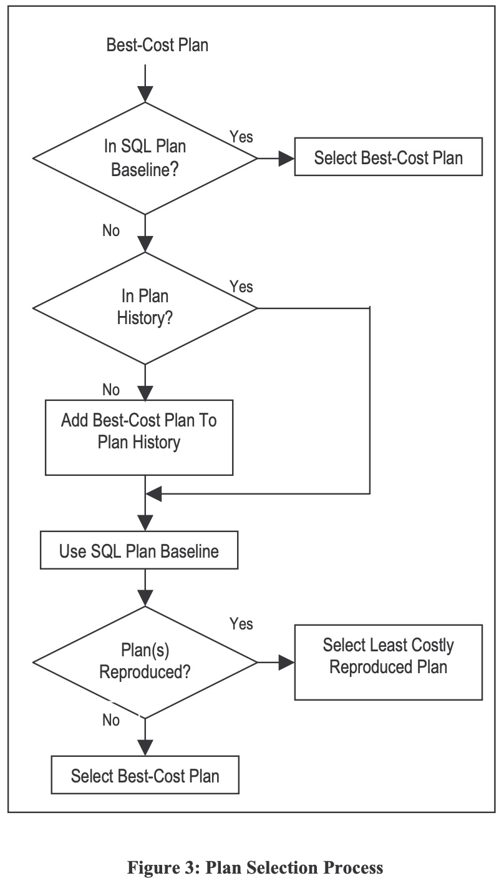  

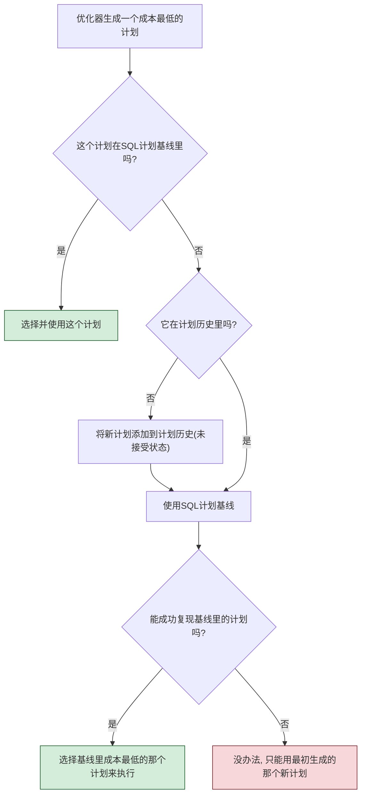

*根据论文图3简化的SPM计划选择流程*

通过这套“**先稳定，后验证，再接纳**”的机制，SPM完美地结合了计划稳定性和适应性的优点 ：

  * **稳定性**：永远不会在未经测试的情况下使用一个全新的、有风险的计划。
  * **适应性**：允许系统通过后台验证，安全、平稳地接纳那些被证明确实更好的新计划，从而实现性能的持续优化。

### 总结

在阅读这篇论文前，请确保您对以下概念有清晰的认识：

  * **SQL执行计划**：数据库执行查询的步骤指南。
  * **查询优化器**：生成执行计划的“大脑”，其决策依赖于**统计信息**。
  * **计划改变**：由于种种原因，优化器会为同一条SQL生成不同的计划。
  * **性能回退 vs. 计划稳定性**：计划改变带来的核心矛盾。
  * **传统解决方案 (Hints/Outlines)**：有效但僵化。

掌握了这些基础，您就能深刻理解SQL Plan Management (SPM) 作为一个创新方案，其设计的精妙之处，以及它为什么能够如论文标题所言，在Oracle 11g中同时实现“**改进的稳定性和性能**” 。
  
## 2 解读论文 
  
好的，这篇名为《Optimizer Plan Change Management: Improved Stability and Performance in Oracle 11g》的论文是数据库性能管理领域的一篇重要文章。它详细阐述了Oracle 11g中引入的一项革命性功能——**SQL计划管理 (SQL Plan Management, SPM)**。

下面我将为您通俗地解读这篇论文的核心思想与关键内容。

### 论文摘要：一句话讲明白

想象一下您每天开车上班，GPS导航就是数据库的“查询优化器”，它会为您规划一条“最佳路线”，这就是“执行计划”。

  * **问题**：有时候GPS会因为路况更新（比如新建了一条高架桥），为您推荐一条新路线。但这条新路线可能因为红绿灯多或者潜在拥堵，反而比您熟悉的老路更慢，导致您上班迟到。这就是“**性能回退**”。
  * **传统方案**：为了避免迟到，您决定“我以后就走老路，再也不听GPS的了”。这很稳定，但您也可能错过那条真正能省时一半的新高架桥。这就是“**计划稳定性**”的代价。
  * **SPM解决方案**：Oracle 11g的SPM功能就像一个更智能的GPS。它发现新路线后，会说：“您先继续走熟悉的老路，我派个‘无人机’去替您跑一遍新路，如果新路确实更快，我再把它加到您的‘可靠路线’收藏夹里供您选择。”

这篇论文的核心，就是介绍SPM如何通过这种“**先求稳、后验证、再采纳**”的机制，完美地平衡了数据库性能的**稳定性**与**适应性**，做到了既不发生性能回退，又能享受到新优化带来的好处 。

-----

### 第一部分：核心问题——“聪明的”优化器为何也会办“坏事”？

数据库的查询优化器 (Query Optimizer) 是一个非常复杂的软件，它会为每一条SQL语句生成一个它认为最高效的**执行计划 (Execution Plan)** 。然而，优化器做出决策的依据是数据库的统计信息、系统参数等 。当这些环境因素发生变化时（例如数据量暴增、数据库版本升级），优化器可能会为同一条SQL生成一个全新的执行计划 。

这种计划的改变可能导致三种结果 ：

1.  性能不变（良性）
2.  性能提升（好事）
3.  **性能回退（坏事）** ：新计划比旧计划慢得多，可能对关键业务系统造成灾难性影响 。

传统的“计划稳定性”技术，如Oracle的“存储大纲 (Stored Outlines)”，通过强制数据库使用固定的旧计划来避免回退 。但这又引出了新问题：

  * **过于僵化**：无法利用系统变化带来的潜在性能提升机会 。
  * **可能失效**：如果旧计划依赖的索引被删除了，强制执行可能会导致更严重的性能灾难 。

因此，数据库管理员（DBA）陷入了一个两难的境地：要么冒险接受新计划可能带来的性能回退，要么固守旧计划而错失性能提升的机会 。

### 第二部分：SPM解决方案——鱼与熊掌兼得的艺术

SPM通过一套完整且自动化的机制，优雅地解决了上述矛盾。其核心由三大功能组成：

#### 1\. SQL计划基线捕获 (SQL Plan Baseline Capture)

这是SPM工作的第一步：识别并收藏“好”的执行计划。

  * SPM会自动识别那些被反复执行的SQL语句（称为“可重复SQL”）。
  * 对于一条被识别出的可重复SQL，它第一次执行时所采用的那个“成本最低的计划”会被自动捕获，并存入一个叫做“**SQL计划基线 (SQL Plan Baseline)**”的集合中 。这个基线里的计划都被认为是性能良好、可被接受的 (accepted plan) 。
  * DBA也可以手动将已知的、性能优异的计划批量加载到基线中 。

我们可以用下图（根据论文图2简化）来理解这个自动捕获过程： 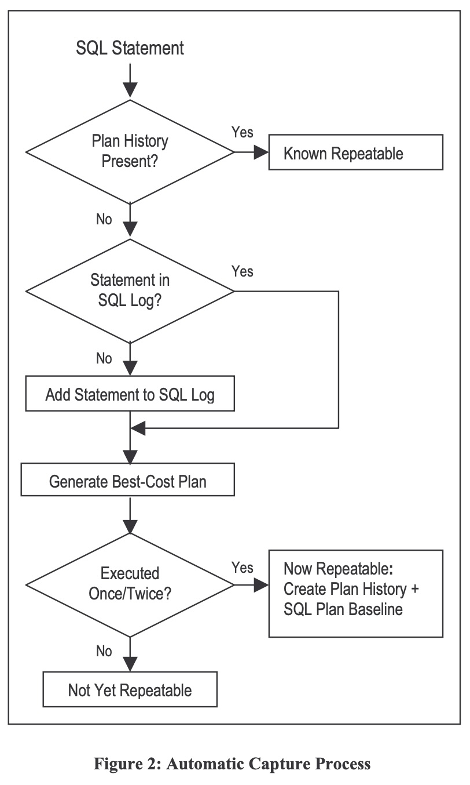  

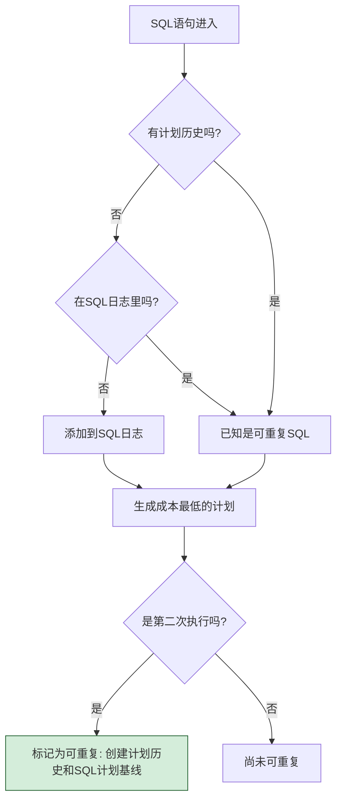

*SPM自动捕获流程示意图*

#### 2\. SQL计划基线选择 (SQL Plan Baseline Selection)

这是SPM**防止性能回退**的关键所在，体现了其“保守”的一面。

当一条设置了基线的SQL再次被编译时，流程如下（根据论文图3解读）：    

1.  优化器仍然会按常规流程，根据当前环境生成一个它认为的“成本最低计划” 。
2.  SPM会检查这个新计划是否存在于该SQL的“计划基线”中 。
3.  **情况一（安全）** ：如果新计划就在基线里，说明它是一个已知的、可信的计划，那么就直接使用它 。
4.  **情况二（风险）** ：如果新计划**不**在基线里，这说明它是一个全新的、未经检验的计划 。此时SPM会：
      * **阻止**立即使用这个新计划 。
      * 将这个新计划作为“未接受”状态存入“**计划历史 (Plan History)**”中，留待后续验证 。
      * 转而从“计划基线”中，选择一个成本最低的、已知的、可信的计划来执行 。

这个选择逻辑确保了线上执行的永远是经过验证的“好”计划，从而从根本上杜绝了性能回退的发生。

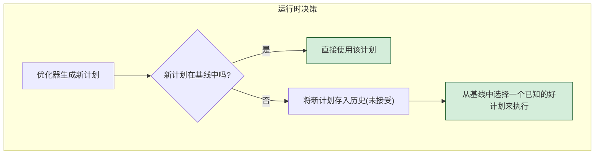

*SPM计划选择核心逻辑*

#### 3\. SQL计划基线演进 (SQL Plan Baseline Evolution)

这是SPM**拥抱性能提升**的关键，体现了其“进取”的一面。

那些被存入历史库的“未接受”新计划并不会被遗忘。SPM提供了一套“演进”机制来验证它们 。

  * DBA可以启动一个验证过程，SPM会在后台对新计划和基线中的某个旧计划进行性能对比测试 。
  * 它会模拟新计划被发现时的真实环境（如绑定变量值）来执行，以保证公平对比 。
  * **如果新计划的性能被证实确实优于旧计划**（超过一个内部阈值），它就会被标记为“已接受”，并正式加入到“SQL计划基线”中 。
  * 这样，在未来，优化器就可以在多个已接受的“好”计划中进行选择了 。

下图（根据论文图4简化）展示了这个验证过程：  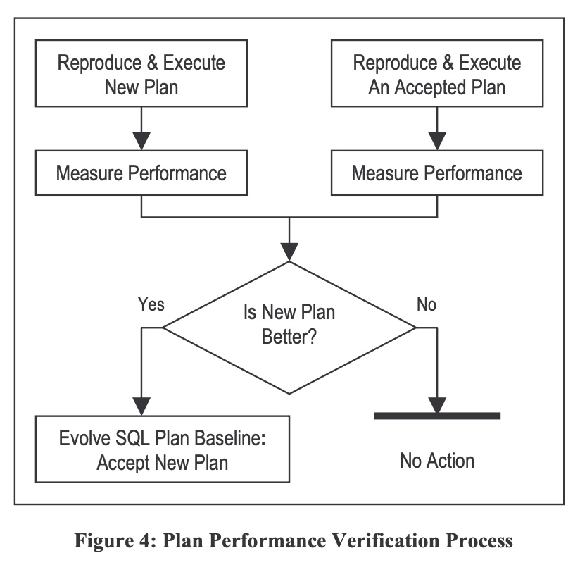  

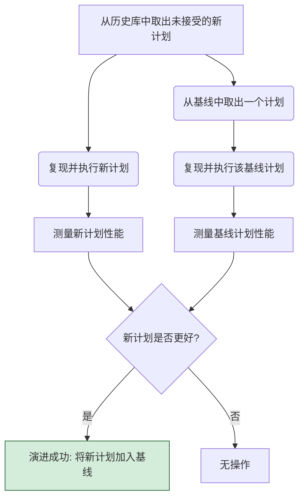

*SPM计划演进验证流程*

通过这三大机制的协同工作，SPM构建了一个**良性循环**：用“基线选择”保证当前性能稳定，同时用“基线演进”不断吸纳更优的新计划，从而让系统性能稳步提升。

### 第三部分：实验与结果——SPM真的有效吗？

为了验证SPM的有效性，论文作者使用了一套非常复杂的大型商业应用（Oracle E-Business Suite）的工作负载进行了7组实验 。

**实验设计概览 (根据论文表1)**：  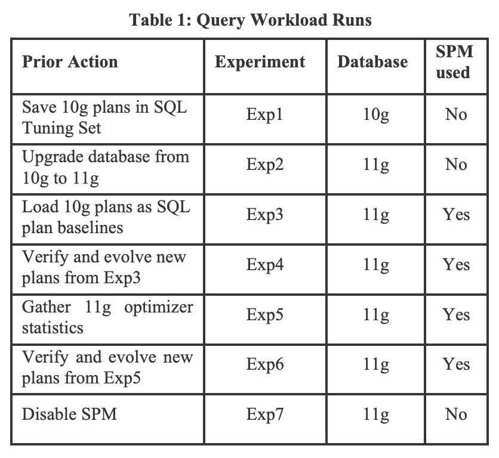  

  * **Exp1**: 在Oracle 10g上运行，作为性能基准 。
  * **Exp2**: 升级到Oracle 11g，但不使用SPM。观察纯粹升级带来的变化 。
  * **Exp3**: 在11g上启用SPM，并加载10g的计划作为基线 。
  * **Exp4**: 对Exp3中发现的新计划进行“演进”操作 。
  * **Exp5**: 重新收集优化器统计信息（一个常见的、易引发计划变化的DBA操作），继续使用SPM 。
  * **Exp6**: 对Exp5中发现的新计划再次进行“演进” 。**这是开启SPM后的最终理想状态**。
  * **Exp7**: 在11g和新统计信息下，禁用SPM。**作为与Exp6对比的关键参照组** 。

**核心实验结果 (解读论文图6和图8)**：  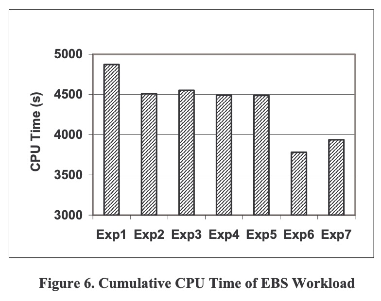  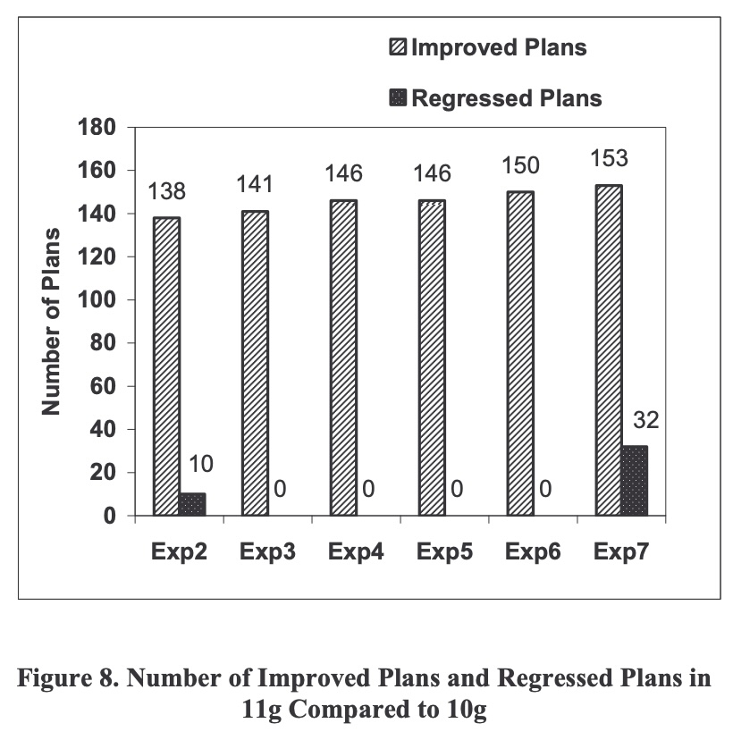  

1.  **SPM显著提升了总体性能**：从论文的图6可以看出，Exp6（完全启用SPM并演进后）的总CPU耗时最低，性能最好 。它甚至比不使用SPM的Exp7还要快将近4% 。这说明，SPM不仅避免了坏计划，还通过演进机制帮助系统找到了比优化器默认选择更好的计划组合。

2.  **SPM彻底消除了性能回退**：这是最惊人的结果，完美展示在论文的图8中。

      * 在**不使用SPM**的Exp2和Exp7中，分别出现了10个和32个性能回退的计划 。
      * 在所有**使用SPM**的实验（Exp3, Exp4, Exp5, Exp6）中，性能回退的计划数量**均为零** 。

    

    ```text
    <-- 性能改善的计划数 (越多越好)    性能回退的计划数 (越少越好) -->

    Exp2 (无SPM):   ################# (138)  |  ## (10)
    Exp3 (SPM):      ################## (141) |  (0)
    Exp4 (SPM):      ################### (146)|  (0)
    Exp5 (SPM):      ################### (146)|  (0)
    Exp6 (SPM):      #################### (150)|  (0)
    Exp7 (无SPM):    ##################### (153)|  ###### (32)
    ```

    *根据论文图8数据进行的文本可视化*

这个结果无可辩驳地证明，SPM成功实现了其核心目标：在允许系统适应性地采纳更优计划的同时，彻底根除了计划改变可能带来的性能回退风险 。

### 结论

这篇论文通过详实的理论介绍和严谨的实验证明，Oracle 11g的SQL计划管理 (SPM) 功能是一个创新且全面的解决方案 。它不再让DBA在“稳定性”和“性能”之间做痛苦的抉择，而是提供了一个自动化的框架，主动管理计划变更，确保关键应用的性能既稳定可预测，又能持续优化 。
  
## 3 术语 
  
根据论文《Optimizer Plan Change Management: Improved Stability And Performance In Oracle 11G》，以下是对其中重要术语的通俗化中文讲解。

### 1\. SQL Plan Management (SPM) - SQL 计划管理

SQL 计划管理（SPM）是 Oracle 11g 中引入的一项核心功能，旨在全面管理 SQL 语句的执行计划，以确保数据库性能既稳定又高效 。

可以把它理解为一个智能的“计划管家”。它的核心目标有两个：

  * **防止性能衰退**：防止优化器突然采用一个比以前更差的“流氓计划”（rogue plan），导致系统性能下降甚至崩溃 。
  * **接纳性能提升**：允许优化器使用新的、更好的计划，但前提是这个新计划必须经过验证，证明它确实比旧计划更优 。

SPM 的整体功能架构如下图所示，它由 SPM 感知优化器、SQL 管理基础（SMB）、后台守护进程和用户界面等多个组件构成 。

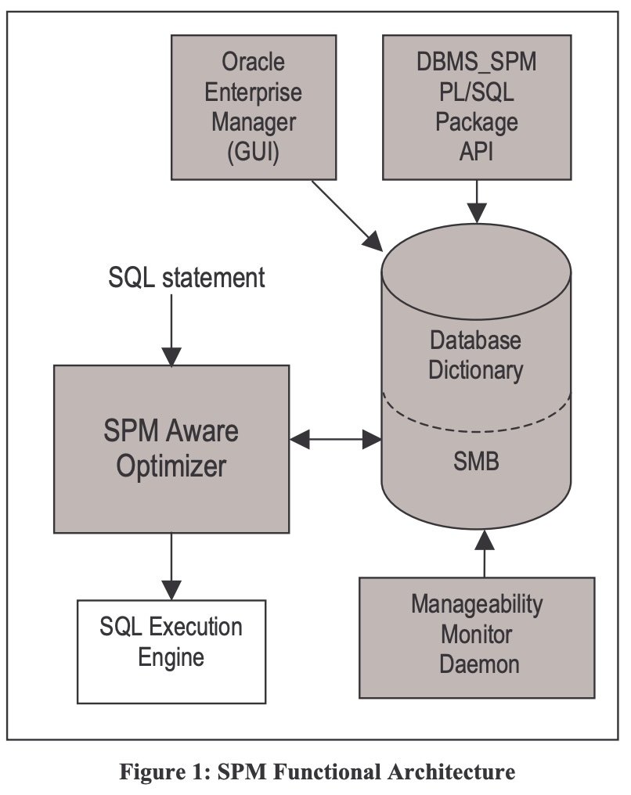  

**图 1: SPM 功能架构图** 

### 2\. Plan Stability (计划稳定性) vs. Plan Adaptability (计划适应性)

这两个术语描述了查询优化器在选择执行计划时面临的一对核心矛盾，SPM 的设计目标就是调和这对矛盾 。

  * **计划稳定性 (Plan Stability)**

      * **讲解**: 指的是强制优化器对某条 SQL 语句始终使用一个固定的、已知的优秀执行计划 。这样做的好处是性能非常稳定，不会因为数据库环境（如统计信息、索引等）的变化而突然变差 。
      * **代价**: 牺牲了优化的灵活性。即使系统发生了有利的变化（例如新建了一个高效索引），优化器也无法生成可能更优的新计划，从而错失了性能提升的机会 。

  * **计划适应性 (Plan Adaptability)**

      * **讲解**: 指的是优化器能够根据数据库系统的当前状态（如数据量增长、参数变更等）动态地生成新的、最适合当前情况的执行计划 。这是优化器默认的、期望的行为。
      * **风险**: 适应性是一把双刃剑。优化器产生的新计划并不能保证一定比旧计划好 。如果新计划更差，就会导致“性能衰退”（Performance Regression）。

SPM 通过引入“计划基线”和“计划演变”机制，试图在“稳定”和“适应”之间取得平衡，既要稳定，又要择优适应 。

### 3\. SQL Plan Baseline - SQL 计划基线

**SQL 计划基线**可以被看作是一个针对特定 SQL 语句的“**白名单**”或“**可信计划集合**” 。

  * **讲解**: 这个集合里存放的都是经过验证，被认为是性能良好或可接受的执行计划，这些计划被称为“已接受计划”（Accepted Plan）。
  * **作用**: 当 SPM 功能启用后，优化器在为一条 SQL 生成执行计划时，不会轻易使用它自己算出来的“最佳成本计划”（Best-Cost Plan）。相反，它会优先从这条 SQL 对应的“计划基线”中选择一个成本最低的计划来执行 。这么做的目的是为了避免采用未经检验的新计划所带来的性能风险。

### 4\. Plan History (计划历史) & Accepted Plan (已接受计划)

  * **计划历史 (Plan History)**

      * **讲解**: 是为某条 SQL 语句记录过的**所有不同执行计划的集合** 。它像一个完整的历史档案，包含了该 SQL 曾经生成过的所有计划，无论好坏。SQL 计划基线是计划历史的一个子集 。

  * **已接受计划 (Accepted Plan)**

      * **讲解**: 指的是计划历史中那些**被验证过性能良好**或被用户**指定为可信**的计划 。只有“已接受计划”才能被放入 SQL 计划基线中，成为优化器执行时的备选项 。一个新的计划在未经“演变”验证前，是“非接受”状态 。

下图清晰地展示了这些概念之间的关系：SQL 管理基础（SMB）存储着所有信息，其中包含了每条 SQL 的计划历史，而计划基线（Plan Baseline）则是由计划历史中的已接受计划（Accepted Plan）组成的。新发现的计划（New Plan）首先会被存入计划历史，但不在基线内，等待后续验证 。

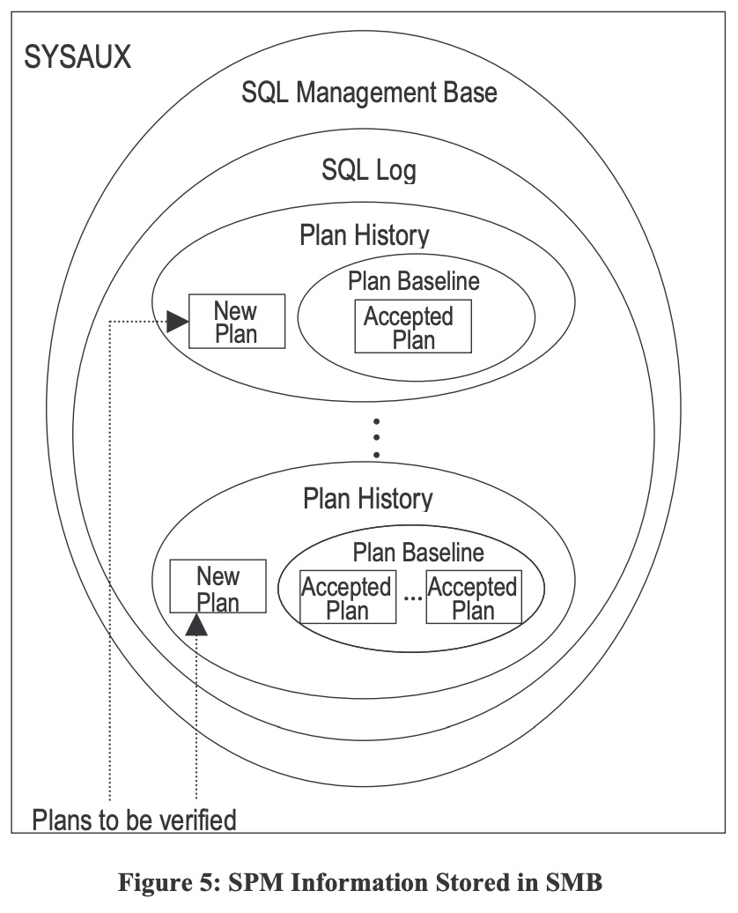  

**图 5: 存储在 SMB 中的 SPM 信息结构** 

### 5\. SPM 的三大核心机制

SPM 的工作流程主要分为捕获、选择和演变三个阶段 。

#### a. SQL Plan Baseline Capture (SQL 计划基线捕获)

  * **讲解**: 这是为 SQL 语句**创建初始计划基线**的过程 。
      * **自动捕获**: 当系统参数 `optimizer_capture_sql_plan_baselines` 设置为 TRUE 时，SPM 会自动识别那些被重复执行的 SQL 语句 。对于一条新识别的重复 SQL，它生成的第一个计划会被自动接纳，并为其创建初始的计划历史和计划基线 。
      * **手动加载**: DBA 也可以手动将已知性能很好的计划（例如从历史缓存或 SQL 调优集中）加载到计划基线中 。

下图展示了自动捕获的流程：SPM 通过 SQL 日志（SQL Log）判断一条 SQL 是否是“重复”的，一旦确认，就为其生成计划历史和基线 。

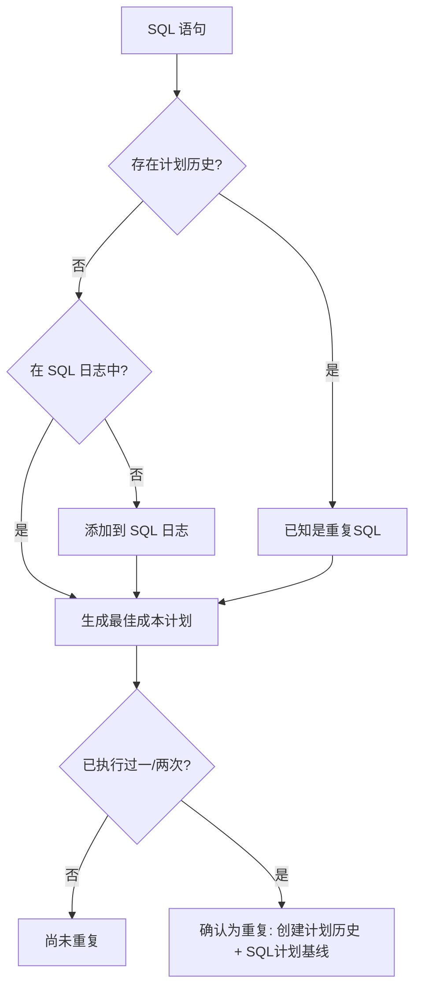

  

**基于图 2 的自动捕获流程示意图** 

#### b. SQL Plan Baseline Selection (SQL 计划基线选择)

  * **讲解**: 这是 SPM **在运行时选择执行计划**的核心逻辑，其首要目标是“**保守**”和“**安全**” 。
  * **流程**:
    1.  优化器首先按常规方式生成一个它认为最优的“最佳成本计划” 。
    2.  然后检查这个新计划是否已经存在于当前 SQL 的“计划基线”中。
    3.  **如果存在**：说明这是个已知的可信计划，直接选用它 。
    4.  **如果不存在**：说明这是一个新计划或一个未被接受的旧计划。此时，SPM 会将这个新计划存入“计划历史”以备后续分析 ，然后从“计划基线”中挑选一个成本最低的“已接受计划”来执行 。
    5.  **特殊情况**：如果计划基线中所有的计划都因环境变化而无法复现，优化器才会退而求其次，选择它最初生成的那个“最佳成本计划” 。

下图详细描绘了这一决策过程 。

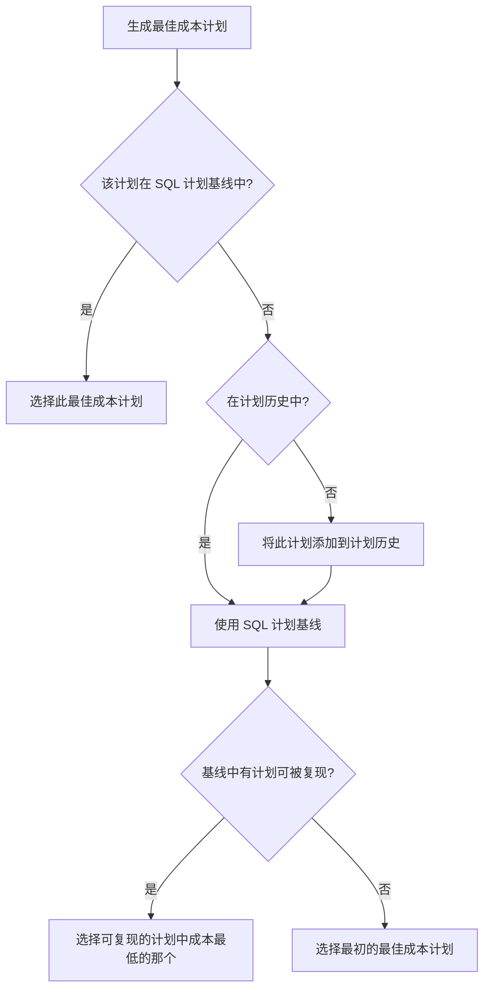

  

**基于图 3 的计划选择流程示意图** 

#### c. SQL Plan Baseline Evolution (SQL 计划基线演变)

  * **讲解**: 这是让 SPM 能够**接纳更优新计划、实现性能提升**的关键机制 。
  * **目的**: 它的目标是通过验证，将那些性能确实更好的新计划从“非接受”状态转变为“已接受”状态，并将其加入到计划基线中 。
  * **验证过程**: DBA 可以运行一个 SPM 工具，该工具会将被验证的新计划与基线中的一个旧计划进行实际执行对比 。如果新计划的执行性能（如CPU时间）明显优于旧计划（超过一个内部阈值），它就会被“接受”并添加到基线中 。原有的旧计划并不会被删除，因为它可能在其他执行环境下依然是最优的 。

下图展示了计划性能的验证过程 。

  

**图 4: 计划性能验证流程** 

通过演变机制，SPM 确保了在维持性能稳定的基础上，系统还能不断地自我优化和进步 。论文中的实验结果（图 8）也证明，启用 SPM 的实验（Exp3 到 Exp6）有效地杜绝了性能衰退的计划（Regressed Plans）。   
  
## 参考        
         
https://dl.acm.org/doi/pdf/10.14778/1454159.1454175    
        
<b> 以上内容基于DeepSeek、Qwen、Gemini及诸多AI生成, 轻微人工调整, 感谢杭州深度求索人工智能、阿里云、Google等公司. </b>        
        
<b> AI 生成的内容请自行辨别正确性, 当然也多了些许踩坑的乐趣, 毕竟冒险是每个男人的天性.  </b>        
    
#### [期望 PostgreSQL|开源PolarDB 增加什么功能?](https://github.com/digoal/blog/issues/76 "269ac3d1c492e938c0191101c7238216")
  
  
#### [PolarDB 开源数据库](https://openpolardb.com/home "57258f76c37864c6e6d23383d05714ea")
  
  
#### [PolarDB 学习图谱](https://www.aliyun.com/database/openpolardb/activity "8642f60e04ed0c814bf9cb9677976bd4")
  
  
#### [PostgreSQL 解决方案集合](../201706/20170601_02.md "40cff096e9ed7122c512b35d8561d9c8")
  
  
#### [德哥 / digoal's Github - 公益是一辈子的事.](https://github.com/digoal/blog/blob/master/README.md "22709685feb7cab07d30f30387f0a9ae")
  
  
#### [About 德哥](https://github.com/digoal/blog/blob/master/me/readme.md "a37735981e7704886ffd590565582dd0")
  
  

  
