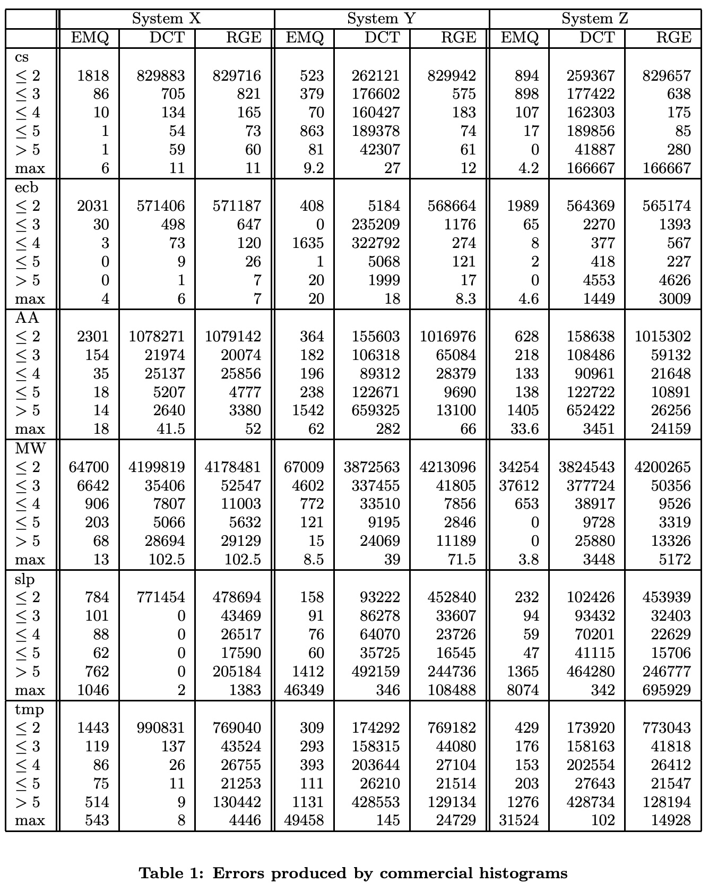
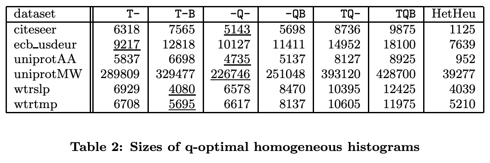
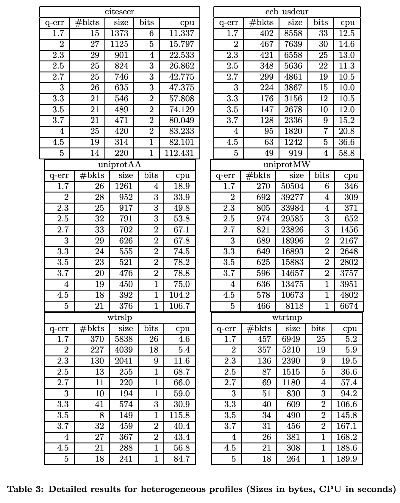
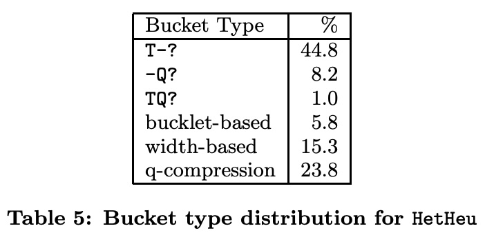

## AI论文解读 | Histograms Reloaded: The Merits Of Bucket Diversity
        
### 作者        
digoal        
        
### 日期        
2025-10-14        
        
### 标签        
PostgreSQL , PolarDB , DuckDB , AI , 论文解读        
        
----        
        
## 背景  
      
https://dl.acm.org/doi/pdf/10.1145/1807167.1807239        
  
提示:          
```          
读懂《Histograms Reloaded: The Merits Of Bucket Diversity》这篇论文需要提前掌握哪些基础知识, 请使用中文通熟易懂的讲解这些基础知识, 可以引用论文中的图、表或使用Markdown支持的图形(text,mermaid等)增加解释性. 
  
使用中文通熟易懂的解读《Histograms Reloaded: The Merits Of Bucket Diversity》这篇论文, 其中的关键内容请着重讲解, 可以引用论文中的图、表或使用Markdown支持的图形(text,mermaid等)增加解释性. 
  
提取《Histograms Reloaded: The Merits Of Bucket Diversity》这篇论文中的重要术语, 使用中文对这些术语进行通熟易懂的讲解, 可以引用论文中的图、表或使用Markdown支持的图形(text,mermaid等)增加解释性. 
```     
  
## 1 前置知识 
  
好的，为了完全理解《Histograms Reloaded: The Merits Of Bucket Diversity》这篇论文，您需要掌握一些关于数据库管理系统的基础知识。这篇论文的核心在于挑战并改进数据库中用于“基数估计”的传统直方图技术，以获得更准确的查询性能预测。

以下是您需要了解的核心基础知识，我会用通俗易懂的中文进行讲解，并引用论文中的图表来增强说明。

### 1\. 数据库查询优化 (Query Optimization)

想象一下，你问数据库一个问题（一个SQL查询），比如“从订单表里找出所有北京地区去年销售额超过1万元的商品种类”。数据库在真正去查找数据之前，会先做一个“作战计划”，这个计划被称为**查询执行计划 (Query Execution Plan)**。

数据库的“大脑”，即**查询优化器 (Query Optimizer)**，会生成许多种可能的执行计划。例如：

  * **计划A**：先把所有订单都扫描一遍，再筛选出北京地区的，最后计算销售额。
  * **计划B**：如果“地区”字段有索引，就先通过索引快速定位到北京地区的订单，然后再计算销售额。

哪个计划更快？优化器需要对每个计划的“成本”（主要是IO开销和CPU计算时间）进行估算，然后选择成本最低的那个来执行 。

这个估算过程就引出了下一个关键概念。

### 2\. 基数估计 (Cardinality Estimation)

**基数 (Cardinality)** 在这里指的就是“查询返回的行数”。

**基数估计**，顾名思义，就是**预测一个查询（或查询的某个中间步骤）会返回多少条数据** 。这个估算至关重要，因为它是计算查询成本的核心依据。如果估算错误，优化器很可能会选出一个非常糟糕的执行计划，导致查询性能急剧下降。

例如，对于上面的查询，优化器需要估算“北京地区的订单”有多少条。

  * 如果估算出来只有几十条，那么计划B（走索引）可能成本很低。
  * 如果估算出来有几百万条（占了总订单的很大比例），那么全表扫描（计划A）可能反而比不断地回表查询索引更快。

论文指出，虽然成本函数本身已经很准了，但基数估计仍然是一个巨大的挑战 ，而直方图就是解决这个问题最主流的工具 。

### 3\. 直方图 (Histograms)

在数据库领域，直方图是一种**数据分布的统计摘要**。它将一个属性（比如“年龄”或“销售额”）的所有值分成若干个**桶 (Bucket)**，然后为每个桶记录一些统计信息 。

#### 传统直方图

传统的直方图，也是这篇论文旨在改进的对象，通常为每个桶存储两个核心信息 ：

1.  **桶内不同值的数量 (Number of distinct values, `d`)**
2.  **桶内所有值的累计频率 (Cumulated frequency, `f_c`)** (或者等价地，平均频率 `f = f_c / d` )

**举个例子：** 假设我们有一个“员工年龄”属性，数据如下：
`22, 23, 23, 25, 31, 32, 32, 32, 45, 48`

我们可以创建一个包含2个桶的直方图：

```text
          | Bucket 1: [20-35] | Bucket 2: [36-50]
------------------------------------------------------
包含的值 | 22,23,23,25,31,32,32,32 | 45, 48
不同值的数量(d) | 5 (22,23,25,31,32) | 2 (45,48)
累计频率(f_c) | 8 (共8个员工) | 2 (共2个员工)
```

当查询 `WHERE 年龄 < 30` 时，优化器会查看第一个桶，根据桶内的数据分布假设（比如假设是均匀分布的）来估算结果。

### 4\. q-error：论文的核心评估指标

传统的统计学通常使用“均方差”（ $l_2$ error ）来衡量误差 。但这篇论文认为，对于基数估计，一个更合适的指标是 **q-error** 。

#### 什么是 q-error?

简单来说，q-error衡量的是**估算值和真实值之间的“比率”或“倍数”差异**。
其定义为 `q = max(估算值 / 真实值, 真实值 / 估算值)` 。

**举例：**

  * 真实值是100，估算值是200。q-error = `max(200/100, 100/200)` = `max(2, 0.5)` = **2**。
  * 真实值是100，估算值是50。q-error = `max(50/100, 100/50)` = `max(0.5, 2)` = **2**。
  * 真实值是100，估算值是101。q-error ≈ **1.01**。

一个完美的估算，q-error为1。q-error越大，说明估算偏差越离谱。

#### 为什么 q-error 很重要？

论文引用了一个关键定理：**最终生成的查询计划的成本，最坏情况下可能与最优计划成本相差 $q^4$ 倍** 。

这意味着，如果你的基数估算的q-error是10，那么你选出的计划可能比最优计划慢上 $10^4=10000$ 倍！这使得q-error成为衡量基数估算质量一个非常关键且有说服力的指标。

论文通过**表1**展示了三个商用数据库系统（代号X, Y, Z）在真实数据集上的q-error表现，结果“令人沮丧” 。

  

**引用论文中的表1 (部分数据)**

下表展示了不同系统在处理不同查询时，产生的q-error有多大。

| Dataset | Query Type | System Y (max q-error) | System Z (max q-error) |
| :--- | :--- | :--- | :--- |
| cs | DCT | 27 | 166667  |
| slp | RGE | 108488  | 695929  |
| MW | RGE | 39  | 5172  |

可以看到，商用系统的最大q-error动辄成千上万，甚至几十万 。这正是论文想要解决的问题。

### 5\. 查询类型 (Query Types)

论文主要针对以下三种基本查询类型进行评估 ：

1.  **EMQ (Exact Match Query)**: 精确匹配查询。例如 `SELECT COUNT(*) WHERE A = x;` 。
2.  **DCT (Distinct Count Query)**: 不同值数量查询。例如 `SELECT COUNT(DISTINCT A) WHERE A BETWEEN lb AND ub;` 。
3.  **RGE (Range Query)**: 范围查询。例如 `SELECT COUNT(*) WHERE A BETWEEN lb AND ub;` 。

理解这三种查询有助于您明白论文中构建的直方图需要同时为这几种估算任务提供准确支持。

### 总结

掌握了以上五个基础知识点，您就可以更好地理解这篇论文的动机和贡献了：

1.  **动机**：数据库查询优化器严重依赖基数估计 。
2.  **问题**：当前主流的、基于传统直方图的基数估计方法，在真实场景中会产生巨大的q-error，导致优化器选择极差的查询计划 。
3.  **目标**：设计一种新的直方图技术，能够将所有查询类型（EMQ, DCT, RGE）的 **最大q-error严格控制在一个很小的范围内（比如2）** ，同时保证存储开销合理 。
4.  **核心思想**：放弃“所有桶都存储相同类型信息”的**同构直方图 (Homogeneous Histograms)** ，转向“不同桶可以根据数据特点存储不同类型信息”的**异构直方图 (Heterogeneous Histograms)** 。

这篇论文的创新之处就在于引入了多种新型的“桶”，并允许它们在一个直方图中混合使用，从而以更低的成本、更灵活地拟合复杂的数据分布，最终实现精准的基数估计。
  
## 2 解读论文 
  
好的，我们来一起深入解读这篇颇具影响力的数据库论文——《Histograms Reloaded: The Merits Of Bucket Diversity》（直方图重装上阵：桶多样性的价值）。

这篇论文的核心思想可以概括为：**抛弃传统“一刀切”的直方图构建方式，通过在一个直方图里混合使用多种不同类型的“桶”（Bucket），来革命性地提升数据库基数估计的准确性，并严格控制最坏情况下的估算错误。**

-----

### 一、问题的根源：商业数据库的估算错得离谱

数据库的查询优化器在决定如何执行一个SQL查询时，严重依赖对查询结果数量（即“基数”）的估算。直方图是实现这一估算最主流的技术。然而，作者首先通过实验指出了一个惊人的事实：**当时顶尖的商业数据库系统，其基数估算经常错得非常离谱** 。

论文采用 **q-error** ( `max(估算值/真实值, 真实值/估算值)` ) 作为核心评估指标。q-error为1表示完美估算，q-error为10表示估算值和真实值差了10倍。而查询计划的优劣与q-error的四次方( $q^4$ )相关，一个看似不大的q-error就能导致灾难性的性能问题 。

  

**关键证据：论文中的表1**

作者对三个商业系统（X, Y, Z）进行了测试，下表是部分触目惊心的结果 ：

| 数据集 | 查询类型 | 系统 Y 最大q-error | 系统 Z 最大q-error |
| :--- | :--- | :--- | :--- |
| cs | DCT | 27 | **166,667** |
| slp | RGE | **108,488** | **695,929** |
| tmp | RGE | **24,729** | 14,928 |

这些高达数万甚至数十万的q-error意味着，优化器在选择查询计划时基本是在“盲人摸象” 。这正是论文要解决的痛点：**如何构建一种直方图，能将最大q-error严格控制在一个可接受的范围（比如2以内），同时空间开销又不能太大？** 

-----

### 二、传统方法的局限：同构直方图 (Homogeneous Histograms)

在传统方法中，一个直方图里的所有桶都采用相同的结构和信息存储方式，作者称之为**同构直方图** 。最经典的方式是，每个桶记录桶内不同值的数量和它们的平均频率 。

作者挑战了这一传统，提出了一些新型的桶。例如，既然q-error是乘法性质的，那么用**q-middle** (`sqrt(min_freq * max_freq)`) 来代表桶内所有值的频率，会比用平均值在控制q-error上更有优势 。

于是，作者设计了多种新的桶类型（如T-, -Q-, TQB-等），并为它们构建了最优的同构直方图。

  

**关键发现：论文中的表2**

该表展示了对于不同数据集，使用不同桶类型的最优同构直方图所需的存储空间（字节） ：

| 数据集 | T- (传统) | -Q- (q-middle) | TQB- | HetHeu (异构) |
| :--- | :--- | :--- | :--- | :--- |
| citeseer | 7565 | **5143** | 9875 | **1125** |
| uniprotAA | 5837 | **4735** | 8925 | **952** |
| wtrslp | **4080** | 6578 | 12425 | **4039** |

从表中可以得出两个重要结论：

1.  **没有万能冠军**：虽然-Q-桶在多数情况下优于传统桶，但并非总是如此（例如wtrslp数据集） 。不存在一种“最好的”桶类型可以通吃所有场景。
2.  **空间开销巨大**：为了将最大q-error控制在2以内，即使是表现最好的同构直方图，其空间开销也远超商业系统常规的3200字节预算 。

这两点共同指向了一个革命性的方向：**我们不应该被限制于只使用一种桶，而应该把它们混合起来！**

-----

### 三、核心创新：异构直方图 (Heterogeneous Histograms)

这正是本文的核心贡献：提出**异构直方图** 。即，一个直方图可以包含多种不同类型的桶，每个桶根据其所覆盖的数据片段的特性，选择最节省空间且能满足误差要求的类型 。

为了实现这一点，作者设计了更多功能强大的桶类型，它们只在异构的场景下才有意义 ：

  * **Width-Based / Bucklet-Based Buckets**: 这两种是高级的“近似桶”。它们不再存储具体数值，而是通过构建一个小型数学模型（如线性函数）来近似一个数据范围内的基数 。这对于变化平缓的数据区域非常有效。
  * **Q-Compression Buckets**: 这是一种“有损压缩桶”。对于那些难以用模型近似的“硬骨头”数据，它不会精确存储每个值的频率，而是将频率映射到一个预设的、满足q-error的区间内，用更少的比特位来编码频率，实现空间和精度的平衡 。

通过组合这些“十八般武器”，异构直方图可以极具适应性地处理各种复杂的数据分布。

<br>
**一个形象的比喻：**
* **同构直方图**：像是一支只由步兵组成的军队，虽然能打仗，但应对不同地形（数据分布）时显得笨拙且成本高。
* **异构直方图**：像是一支拥有步兵、炮兵、侦察兵的合成部队。在平原上用炮兵（近似桶），在山区用侦察兵（压缩桶），在城市里用步兵（传统桶），协同作战，以最低的成本实现战略目标（控制误差）。

-----

### 四、实验结果：效果拔群

作者设计了一个启发式算法 `HetHeu` 来构建异构直方图 。实验结果非常惊人。

  

**关键图表：论文中的表3**

该表展示了使用`HetHeu`算法构建的异构直方图在不同q-error限制下的性能表现 ：

| 数据集 | 最大q-error | 桶数量 | **大小 (字节)** | 构建时间 (秒) |
| :--- | :--- | :--- | :--- | :--- |
| **citeseer** | 2 | 27 | **1125** | 15.8 |
| | 1.7 | 15 | 1373 | 11.3 |
| **uniprotMW** | 5 | 466 | 8118 | 6674 |
| | 4 | 636 | 13475 | 3951 |
| | 2 | 692 | **39277** | 309 |
| **ecb\_usdeur** | 2 | 467 | **7639** | 30 |
| | 3.3 | 176 | 3156 | 12 |

**关键结论：**

1.  **显著的空间节省**：对比表2，异构直方图（HetHeu列）所需的空间远小于任何一种同构直方图 。对于`citeseer`数据集，大小从最优同构的5143字节锐减到1125字节。   
2.  **误差与空间的权衡**：可以灵活地通过放宽q-error要求来换取更小的空间占用 。例如`ecb_usdeur`数据集，将q-error从2放宽到3.3，空间可以从7639字节降至3156字节，这使得该技术非常实用。
3.  **解决了“硬骨头”问题**：对于像`uniprotMW`这样极难近似的数据集，虽然空间开销较大，但我们终于有了一种**能够保证误差上限**的工具，而不是像商业系统那样产生几十万的q-error。

  

**桶多样性的体现：论文中的表5**

这张表统计了在所有测试中（q-error=2），各种桶类型被使用的频率 ：

| 桶类型 | 使用率 (%) |
| :--- | :--- |
| T-? (传统桶) | 44.8 |
| -Q? (q-middle桶) | 8.2 |
| width-based (近似桶) | 15.3 |
| bucklet-based (近似桶) | 5.8 |
| **q-compression (压缩桶)** | **23.8** |

这充分证明了**没有一种桶是多余的**。正是这种多样性和协同工作，才带来了最终的成功 。

### 总结

《Histograms Reloaded》这篇论文的贡献是里程碑式的：

1.  **揭示了问题的严重性**：首次系统性地使用q-error指标，量化了商业数据库在基数估计上的巨大误差。
2.  **打破了思维定式**：证明了单一类型的同构直方图无法同时满足低误差和低空间的要求，必须另辟蹊径。
3.  **提出了革命性方案**：设计并验证了**异构直方图**的有效性，通过混合使用多种创新的桶类型，首次实现了一个能够**保证误差上限**，同时空间开销合理的实用基数估计算法 。

作者在论文结尾算了一笔账：即使为一个数据库中成千上万个属性构建高精度的异构直方图，总的内存成本可能也只需要“一美元”左右 。用如此低的成本换来查询优化器质的飞跃，这笔投资无疑是值得的 。这篇论文为后续数据库基数估计乃至整个自适应数据库系统的研究开辟了新的方向。
  
## 3 术语 
  
好的，这篇论文《Histograms Reloaded: The Merits Of Bucket Diversity》引入并使用了许多关键术语来阐述其核心思想。以下是对这些重要术语的中文讲解，并结合了论文中的图表内容以帮助理解。

-----

### 1\. 基数估计 (Cardinality Estimation)

  * **讲解**: 这是数据库查询优化的一个核心环节 。简单来说，就是在执行一个查询前，**预测该查询会返回多少行数据** 。这个预测的准确性直接影响优化器能否选出最高效的查询执行计划 。错误的估计可能导致查询性能下降几个数量级 。

### 2\. q-error

  * **讲解**: 这是论文用来衡量基数估计准确性的**核心误差指标** 。与传统的绝对误差不同，q-error衡量的是**估算值与真实值之间的比率或倍数关系** 。
  * **定义**: `q = max(估算值 / 真实值, 真实值 / 估算值)` 。一个完美的估算q-error为1 。例如，真实值为100，估算值为200或50，q-error都是2。
  * **重要性**: 论文引用了一个关键定理：查询计划的实际成本最坏可能比最优成本差 **$q^4$** 倍 。这意味着q-error对性能的影响是指数级的，必须严格控制。论文通过**表1**展示了商业数据库中q-error可能高达**108,488**甚至**695,929**，强调了控制该指标的紧迫性 。   

### 3\. 同构直方图 (Homogeneous Histograms)

  * **讲解**: 这指的是一种传统的直方图，其中**所有桶（Bucket）都采用相同的结构和信息存储方式** 。例如，每个桶都只存储“不同值的数量”和“平均频率”这两个信息 。
  * **局限性**: 论文通过**表2**的实验证明，没有任何一种单一的桶类型能在所有数据集上都表现最优 。并且，为了达到较低的q-error，同构直方图通常需要消耗非常大的存储空间 。  

| 数据集 | T- (传统桶) | -Q- (q-middle桶) | HetHeu (异构) |
| :--- | :--- | :--- | :--- |
| citeseer | 7565 字节 | 5143 字节 | **1125 字节** |

  

*上表源自论文表2的数据，显示为达到q-error≤2，同构直方图（前两列）比异构直方图（最后一列）需要更多空间。*

### 4\. 异构直方图 (Heterogeneous Histograms)

  * **讲解**: 这是论文提出的核心创新 。它允许**一个直方图内包含不同类型的桶** 。每个桶可以根据其覆盖的数据片段的特征，选择最适合、最节省空间的类型来存储信息 。这种“因材施教”的方式使得直方图的适应性和效率大大提高。

### 5\. 桶类型 (Bucket Types)

为了实现异构直方图，论文设计了多种功能各异的桶：

  * **传统桶 (T-)**: 每个桶存储不同值的数量（d）和它们的累计频率（ $f_c$ ），这是最基础的类型 。
  * **q-middle 桶 (-Q-)**: 针对q-error的特性进行了优化，它不存储平均频率，而是存储桶内频率的 **q-middle** (`sqrt(min_freq * max_freq)`) 。这在估算精确匹配查询（EMQ）时通常更优 。
  * **近似桶 (Approximation Buckets)**:
      * **Width-based & Bucklet-based**: 这两种是高级桶，它们不再存储具体数值，而是为桶内的数据分布**构建一个数学近似模型**（如线性函数） 。当数据变化比较平滑和有规律时，一个简单的模型就能代替大量原始统计信息，极大地节省空间 。
  * **q-压缩桶 (Q-Compression Buckets)**:
      * **讲解**: 这是一种专门处理“硬骨头”数据（即难以用模型近似的区域）的桶 。它不精确存储频率，而是将频率值进行“有损压缩”，映射到一个能保证q-error上限的数值区间内 。例如，对于q=2，所有在`[1, 4]`区间的频率都可以用`2`来近似 。这是一种在精度和空间之间做出巧妙权衡的策略。
      * **重要性**: **表5**显示，在最终构建的异构直方图中，q-压缩桶的使用率高达**23.8%** ，证明了它在处理复杂数据分布时的关键作用。  

| 桶类型 | 使用率 (%)  |
| :--- | :--- |
| T-? (传统) | 44.8  |
| q-compression | **23.8**  |
| width-based | 15.3  |

  

*上表源自论文表5，显示了q-压缩桶和其他桶类型在异构直方图中的使用频率。*

### 6\. 查询模板 (Query Templates)

论文主要评估直方图对以下三种查询的估算能力 ：

  * **EMQ (Exact Match Query)**: 精确匹配查询，例如 `... WHERE A = x` 。
  * **DCT (Distinct Value Query)**: 查询一个范围内有多少个不同的值，例如 `... COUNT(DISTINCT A) WHERE A BETWEEN lb AND ub` 。
  * **RGE (Range Query)**: 查询一个范围内有多少行数据，例如 `... COUNT(*) WHERE A BETWEEN lb AND ub` 。

理解这些术语是读懂这篇论文精髓的关键。它们共同勾勒出了论文从发现问题（巨大的q-error）、分析瓶颈（同构直方图的局限）到提出创新方案（多样化的桶与异构直方图）的完整逻辑链条。
  
## 参考        
         
https://dl.acm.org/doi/pdf/10.1145/1807167.1807239    
        
<b> 以上内容基于DeepSeek、Qwen、Gemini及诸多AI生成, 轻微人工调整, 感谢杭州深度求索人工智能、阿里云、Google等公司. </b>        
        
<b> AI 生成的内容请自行辨别正确性, 当然也多了些许踩坑的乐趣, 毕竟冒险是每个男人的天性.  </b>        
    
#### [期望 PostgreSQL|开源PolarDB 增加什么功能?](https://github.com/digoal/blog/issues/76 "269ac3d1c492e938c0191101c7238216")
  
  
#### [PolarDB 开源数据库](https://openpolardb.com/home "57258f76c37864c6e6d23383d05714ea")
  
  
#### [PolarDB 学习图谱](https://www.aliyun.com/database/openpolardb/activity "8642f60e04ed0c814bf9cb9677976bd4")
  
  
#### [PostgreSQL 解决方案集合](../201706/20170601_02.md "40cff096e9ed7122c512b35d8561d9c8")
  
  
#### [德哥 / digoal's Github - 公益是一辈子的事.](https://github.com/digoal/blog/blob/master/README.md "22709685feb7cab07d30f30387f0a9ae")
  
  
#### [About 德哥](https://github.com/digoal/blog/blob/master/me/readme.md "a37735981e7704886ffd590565582dd0")
  
  

  
