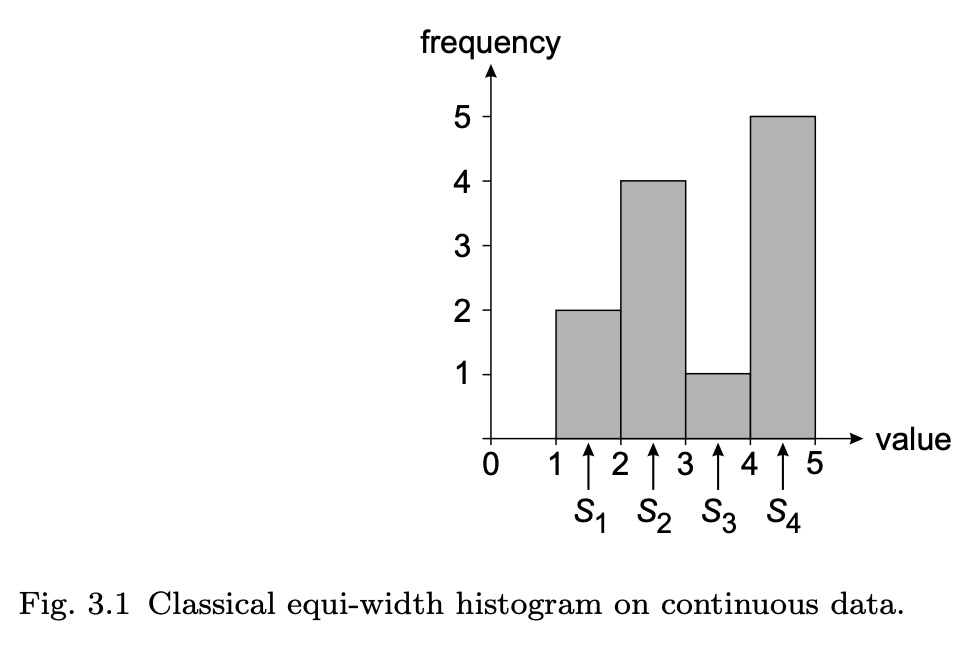
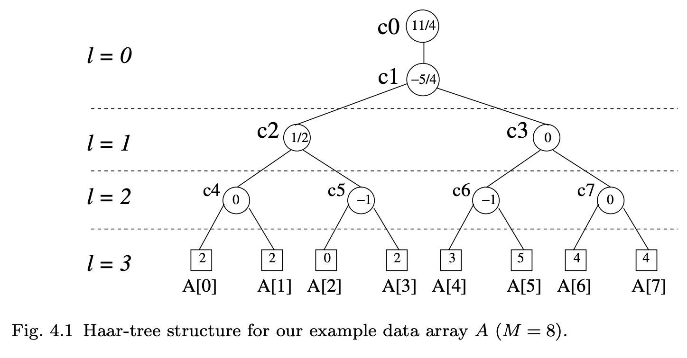
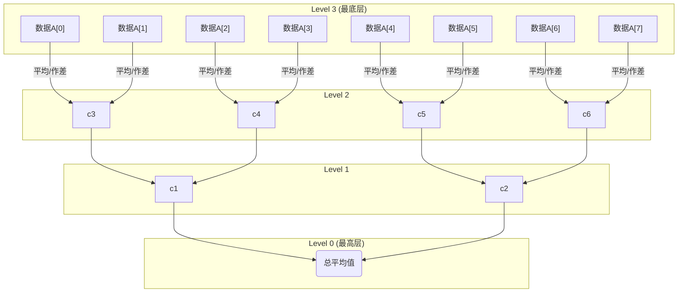
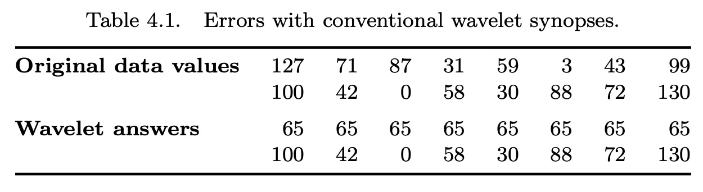
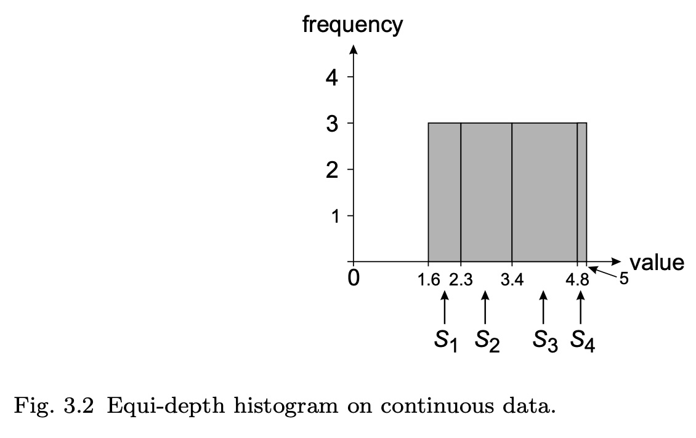
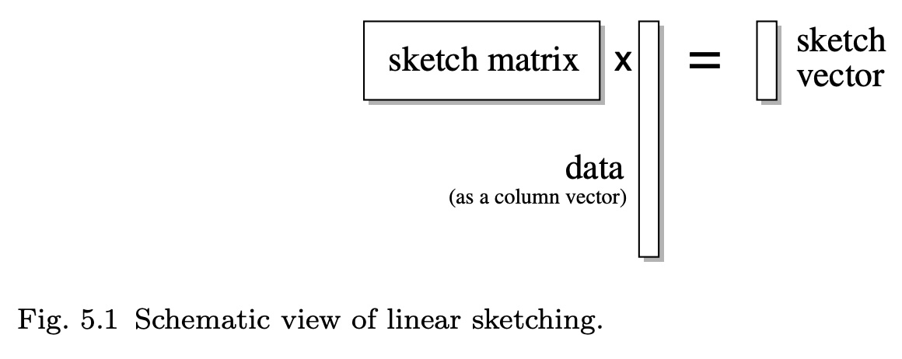

## AI论文解读 | Synopses For Massive Data: Samples, Histograms, Wavelets, Sketches
        
### 作者        
digoal        
        
### 日期        
2025-10-14        
        
### 标签        
PostgreSQL , PolarDB , DuckDB , AI , 论文解读        
        
----        
        
## 背景  
      
https://dsf.berkeley.edu/cs286/papers/synopses-fntdb2012.pdf        
  
提示:          
```          
读懂《Synopses For Massive Data: Samples, Histograms, Wavelets, Sketches》这篇论文需要提前掌握哪些基础知识, 请使用中文通熟易懂的讲解这些基础知识, 可以引用论文中的图、表或使用Markdown支持的图形(text,mermaid等)增加解释性. 
  
使用中文通熟易懂的解读《Synopses For Massive Data: Samples, Histograms, Wavelets, Sketches》这篇论文, 其中的关键内容请着重讲解, 可以引用论文中的图、表或使用Markdown支持的图形(text,mermaid等)增加解释性. 
  
提取《Synopses For Massive Data: Samples, Histograms, Wavelets, Sketches》这篇论文中的重要术语, 使用中文对这些术语进行通熟易懂的讲解, 可以引用论文中的图、表或使用Markdown支持的图形(text,mermaid等)增加解释性. 
```     
  
## 1 前置知识 
  
好的，为了完全理解《Synopses For Massive Data: Samples, Histograms, Wavelets, Sketches》这篇论文，你需要掌握一些横跨数据库、统计学、算法和数学的基础知识。这篇论文实际上是一篇综述（Survey），系统性地介绍了四种核心技术，所以你可以把它看作是学习这个领域的路线图。

下面我将为你通俗易懂地讲解这些必备的基础知识，并引用论文中的图表示例来帮助你理解。

### 核心问题：为什么要懂这些知识？

这篇论文的核心是**近似查询处理 (Approximate Query Processing, AQP)** 。想象一下，你的数据有好几百个G甚至到了P级别（1 PB = 1024 TB），用户想做一个查询，比如统计某个产品的总销售额。如果直接扫描全部数据，可能需要几分钟甚至几小时才能返回结果，这对于需要快速探索数据的分析师来说是无法接受的 。

AQP 的思想是：我们不查原始数据，而是去查一个提前创建好的、非常小的“数据摘要”（也就是论文标题里的 **Synopsis**）。用这个摘要来快速估算一个八九不离十的结果 。这篇论文就是围绕四种主流的摘要技术展开的。

-----

### 1\. 数据库基础知识

这是理解论文应用场景的基石。

  * **关系型数据库和SQL：** 你需要知道数据通常存储在像表格一样的“关系”中，我们使用结构化查询语言 (SQL) 来查询数据 。
  * **聚合查询 (Aggregation Queries)：** 这是论文中最常提到的查询类型。你需要理解 `COUNT` (计数), `SUM` (求和), `AVG` (平均值) 这类操作的含义 。
      * 例如，论文中反复用一个简单的SQL查询作为例子 ：
        ```sql
        SELECT SUM(R.a)
        FROM R
        ```
        这个查询计算了表 `R` 中 `a` 这一列所有值的总和。
  * **数据仓库 (Data Warehouse) 和数据流 (Data Stream)：** 你需要了解数据不仅可以静态地存储在数据库里，也可能以“流”的形式高速、持续地产生，比如网络监控数据、金融交易数据等 。这些场景对处理速度要求极高，使得AQP尤为重要。

### 2\. 概率论与统计学基础

这是理解四种技术中至少三种（采样、直方图、部分小波和所有基数估计算法）的理论核心。

  * **基本概念：随机变量、期望 ( $E[X]$ )、方差 ( $\sigma^2(Y)$ )**

      * **随机变量 (Random Variable):** 可以把它想象成一个“装着随机结果的盒子”。比如，论文中用随机变量 $X_i$ 表示数据项 $i$ 在一次采样中被抽中的次数 。
      * **期望 (Expected Value):** 指的是随机变量的“平均值”或“长期来看最可能出现的值”。比如，如果一个估计量的期望等于真实值，我们就说它是“无偏的”，这是一个非常好的性质 。
      * **方差 (Variance):** 衡量数据围绕期望值的“分散程度”或“波动大小” 。方差越小，我们的估计就越稳定、越可靠。

  * **估计量与偏差 (Estimator & Bias)**

      * **估计量 (Estimator):** 一个用来从样本数据“猜测”或“估计”总体数据特征（如总和、平均值）的公式或方法 。论文中著名的 **Horvitz-Thompson (HT) 估计量** 就是一个核心例子 。
      * **偏差 (Bias):** 指的是估计值的期望与真实值之间的差距。偏差为零的估计量就是“无偏估计量” (Unbiased Estimator) 。

  * **核心采样方法 (Sampling Methods)**

      * **有放回/无放回简单随机抽样 (SRSWR/SRSWoR):** 这是最基础的抽样方式，即每次都从总体中完全随机地抽取一个个体，区别在于抽过的个体是否“放回去” 。
      * **伯努利采样 (Bernoulli Sampling):** 像为数据集里的每个数据项抛一次硬币，正面朝上就选中它 。
      * **分层采样 (Stratified Sampling):** 先把数据分成几个“层”（strata），再从每个层里按比例抽样。如果能把相似的数据分到同一层，这种方法能极大地减小方差，提高估计精度 。

  * **置信区间 (Confidence Intervals) 与中心极限定理 (CLT)**

      * 由于是估计，我们通常不能给出一个确切的值，而是给出一个“范围”，并说明真实值有多大概率落在这个范围里，这就是置信区间 。
      * 比如论文中提到的一个结论：“我们的估计值有（大约）95%的概率落在离正确答案 ±37.10 的范围内” 。
      * 这个结论的理论依据通常是**中心极限定理 (Central Limit Theorem, CLT)**，它告诉我们，当样本量足够大时，样本均值的分布近似于正态分布（钟形曲线），这使得计算置信区间成为可能 。

### 3\. 算法与数据结构

这是理解如何高效构建和查询这些摘要的“内功”。

  * **算法复杂度（大O表示法）：** 你需要了解如何衡量一个算法的运行时间和空间占用，比如 $O(N)$ , $O(logM)$ , $O(M^2B)$ 。这帮助我们判断一个方法对于海量数据是否“实用”。

  * **哈希函数 (Hash Functions)：** 这是一种能将任意大小的输入数据映射成一个固定大小输出（哈希值）的函数。它在**小波技术 (Sketches)** 中是绝对的核心 。

      * 例如，布隆过滤器 (Bloom Filter) 用多个哈希函数来判断一个元素是否存在于一个集合中 。论文第5章中的多种小波技术都依赖于精心设计的哈希函数。

  * **动态规划 (Dynamic Programming, DP)：** 这是一种通过将大问题分解成重叠的子问题来求解的算法思想。在**直方图 (Histograms)** 部分，DP被用来寻找“最优”的桶划分方式，以最小化估计误差 。

  * **树形结构 (Tree Structures)：** 论文中多次使用树来表达层次化分解的思想。

      * **小波技术 (Wavelets)** 中的 **哈尔小波树 (Haar-tree)** 就是一个很好的例子（如下图所示），它直观地展示了数据是如何被层层平均和作差的 。

    

    ```mermaid
    graph TD
        subgraph Level 0
            c0("c0 (整体平均)")
        end
        subgraph Level 1
            c1("c1")
            c2("c2")
        end
        subgraph Level 2
            c3("c3")
            c4("c4")
            c5("c5")
            c6("c6")
        end
        subgraph Data
            A0("A[0]") & A1("A[1]") --> c3
            A2("A[2]") & A3("A[3]") --> c4
            A4("A[4]") & A5("A[5]") --> c5
            A6("A[6]") & A7("A[7]") --> c6
        end
        c3 & c4 --> c1
        c5 & c6 --> c2
        c1 & c2 --> c0
    ```

    *这个简化的Mermaid图展示了哈尔小波的层次结构：底层数据(A[0]...A[7])被两两组合生成上一层的系数(c3...c6)，这个过程不断重复直到顶层的总平均值(c0)。*

### 4\. 数学基础

这部分知识能帮助你更深入地理解某些技术的原理。

  * **线性代数：**

      * **向量、矩阵、内积：** 这对于理解**小波 (Wavelets)** 和 **基数估计算法 (Sketches)** 至关重要。数据可以被看作一个高维向量 $f$ ，而摘要的构建过程可以被看作是用一个矩阵去乘以这个向量（即线性变换）。
      * **基向量、正交基：** 小波变换的本质是将数据从原始基分解到一组新的“小波基”上 。哈尔小波基的正交性是保证其L2误差最优性的关键 。

  * **误差度量 (Error Metrics)：**

      * 为了评价一个摘要的好坏，我们需要量化它的近似误差。论文中提到了多种误差度量，最常见的是 **Lp范数**。
      * **L2 范数 (欧几里得范数):** 也叫“均方根误差”，它计算的是误差的平方和。例如，对于直方图，它的定义是 $E(H) = \sum_{i=1}^{M}(g(i) - \hat{g}_H(i))^2$ 。这个指标对较大的误差比较敏感。
      * **L1 范数:** 误差的绝对值之和。
      * **L∞ 范数:** 最大的那个误差。

### 如何阅读这篇论文？

1.  **从摘要和第一章开始：** 首先确保你完全理解了“为什么需要数据摘要”以及“AQP是什么”。
2.  **分章节阅读：** 这篇论文的四个核心技术章节（2-5）相对独立，你可以选择你最感兴趣或者基础最好的那一章开始 。例如，如果你统计学基础好，可以从第2章“采样”开始。
3.  **先抓核心思想，忽略证明细节：** 第一次阅读时，重点理解每种技术的基本原理、优缺点和适用场景。比如，对于采样，核心就是“用样本估计总体”；对于直方图，就是“分桶统计”。
4.  **对照基础知识：** 当遇到不理解的术语或公式时，可以回头对照我上面列出的基础知识进行学习。例如，看到“unbiased estimator”，就去回顾一下统计学里“无偏估计”的定义。

总而言之，这篇论文虽然长达294页，但结构清晰。只要你具备了上述数据库、统计和算法的基础知识，并采取正确的阅读策略，就能够有效地掌握其核心内容。祝你阅读顺利！
  
## 2 解读论文 
  
好的，这篇《Synopses for Massive Data: Samples, Histograms, Wavelets, Sketches》是一篇重量级的综述性论文，系统地介绍了在大数据背景下，用于“近似查询处理”（Approximate Query Processing, AQP）的四种核心技术。

简单来说，当数据量大到无法在可接受的时间内获得精确查询结果时，我们可以退而求其次，快速地得到一个八九不离十的近似结果。这篇论文的核心就是讲解如何创建和使用四种高效的“数据摘要”（Synopses），用这些小摘要来代替庞大的原始数据，从而实现闪电般的查询速度 。

下面，我将为你通俗地解读这四种关键技术。

-----

### 1\. 采样 (Sampling)

**核心思想：以偏概全，但要有科学依据。**

这是最直观、也是研究历史最悠久的方法 。就像民意调查一样，我们不需要问遍全国所有人，只需随机抽取一小部分有代表性的人，就能大致了解整体的看法。在数据库中，我们也是从海量数据中随机抽取一小部分（例如1%）作为样本，然后直接在这个小样本上执行用户的查询 。

**关键内容：如何从样本结果“猜”回总体结果？**

得到样本上的查询结果后，需要一步“放大”操作来估算总体的结果。这背后最经典的理论是**Horvitz-Thompson (HT) 估计量** 。

  * **基本原理**：如果一个数据项被选入样本的概率是 `p`，那么在计算总和时，这个数据项的贡献就应该被放大 `1/p` 倍，以“代表”那些没被选中的相似数据项 。
  * **举例**：假设我们要计算一个有一万个用户的总消费额。我们随机抽取了100个用户（抽样比为1%），发现他们的总消费额是5000元。一个简单的估计就是将这个结果放大100倍（1 / 1%），估算出总消费额大约是 5000 \* 100 = 50万元 。

**优点与缺点**

  * **优点**：

      * **极其灵活**：几乎任何查询都可以直接跑在样本上，无需为特定查询类型做特殊设计 。
      * **提供误差边界**：统计学理论（如中心极限定理）可以告诉我们这个估计结果的置信区间，例如“有95%的把握，真实值在估算值的±5%以内” 。
      * **可在线优化**：如果觉得当前样本得到的精度不够，可以继续抽样，动态地提高结果的准确性，非常适合交互式分析 。

  * **缺点**：

      * **不适合“大海捞针”** ：如果要查询的是非常罕见的数据（例如，寻找交易额超过1000万的诈骗订单），样本很可能一个也抽不到，导致结果严重失准 。
      * **对数据倾斜和异常值敏感**：如果数据中存在几个“超级大户”，抽中或没抽中他们会对结果产生巨大影响 。
      * **`COUNT DISTINCT`（去重计数）问题老大难**：用采样来估算有多少个不同的用户ID，结果往往非常不准 。

-----

### 2\. 直方图 (Histograms)

**核心思想：化整为零，分区统计。**

直方图是数据库查询优化器里最常用的“老朋友”了 。它的思想很简单：将数据的整个值域（例如，年龄从0到100岁）切分成若干个“桶”（buckets），然后只统计每个桶里有多少数据落进来 。

**关键内容：如何划分“桶”以及如何估算？**

  * **分桶策略 (Bucketing Scheme)**：

      * **等宽直方图 (Equi-width)**：每个桶的宽度（值域范围）相同。例如，将年龄按0-9岁, 10-19岁, ... 这样划分。这种方法简单，但如果数据分布不均（例如，大部分人都在20-40岁），会导致某些桶很满，某些很空，估算误差大 。下图（源自论文Figure 3.1）就是一个等宽直方图的例子。    

      * **等深直方图 (Equi-depth)**：调整每个桶的宽度，使得落入每个桶的数据量大致相等。这种方法能更好地适应数据倾斜，是更常用的策略 。

      * **最优直方图 (V-Optimal Histograms)**：通过动态规划等算法，寻找一种分桶方式，使得在给定桶数量下，整体的估算误差（通常是L2误差，即误差平方和）最小 。

  * **估算方法**：当查询一个范围时（如查询25-45岁的用户数），如果这个范围正好覆盖了几个完整的桶，就直接把这些桶的计数加起来；如果只覆盖了桶的一部分，就按比例估算（例如，覆盖了一半，就取这个桶计数的一半） 。

**优点与缺点**

  * **优点**：

      * **直观易懂**：概念非常简单，结果也容易解释 。
      * **对范围查询友好**：天然适合估算“年龄在...之间”、“销售额在...之间”这类查询 。

  * **缺点**：

      * **维度灾难 (Curse of Dimensionality)**：直方图在一维数据上表现尚可，但随着维度增加（例如，同时按年龄、收入、地域分桶），所需要的桶的数量会指数级爆炸，完全不可行 。
      * **构建成本**：构建高质量的直方图（如等深或最优直方图）通常需要对数据进行排序或多次扫描，成本较高 。

-----

### 3\. 小波 (Wavelets)

**核心思想：从另一个角度看数据，抓大放小。**

小波最初源于信号和图像处理领域 。它的思想是把数据（看作一个信号或函数）通过一个数学变换（如**哈尔小波变换 HWT**），分解成一组“小波系数” 。

**关键内容：哈尔小波变换 (Haar Wavelet Transform)**

哈尔小波变换是最简单的一种小波变换，它通过一个递归的过程来分解数据 。

1.  **两两求平均和作差**：将数据两两配对，计算它们的平均值和差值的一半。平均值序列构成了数据的“低分辨率”概览，而差值序列则记录了丢失的“细节” 。
2.  **递归处理**：对上一层得到的平均值序列，重复第一步的操作，直到最后只剩下一个总平均值。
3.  **结果**：最终得到一个总平均值和一系列在不同尺度上的细节系数。

下图（基于论文Figure 4.1）展示了这个层次分解的过程：   



  * **数据摘要**：小波的一个神奇特性是“能量集中”，即大部分数据的“能量”（信息）会集中在少数几个大的系数上 。因此，我们只需保留**最大的B个系数**，扔掉其他所有的小系数，就能构建一个非常紧凑的摘要。这个摘要在最小化L2误差（误差平方和）方面是**理论上最优的** 。

**优点与缺点**

  * **优点**：

      * **压缩效率高**：能用极少的系数高度近似原始数据 。
      * **构建速度快**：小波变换是线性变换，通常只需一次数据扫描即可完成，时间复杂度为 $O(M)$ 。

  * **缺点**：

      * **不直观**：小波系数的物理意义不像直方图那么容易理解。
      * **L2最优不等于处处最优**：虽然整体误差最小，但可能导致对某些局部数据的估算偏差极大（如论文Table 4.1所示的例子） 。    
      * **同样存在维度灾难问题** 。

-----

### 4\. 基数估计算法/草图 (Sketches)

**核心思想：巧妙哈希，四两拨千斤。**

Sketch是这四种技术中最“年轻”也最“激进”的，它为处理高速数据流而生 。它的核心是一种**线性投影**：可以想象有一个巨大的、固定的“草图矩阵”，用它去乘以代表数据的向量，得到一个非常短的“草图向量”，这个向量就是摘要 。

\<center\>Sketch = Sketch Matrix × Data Vector\</center\>

实际上，这个矩阵通常不是显式存储的，而是通过**哈希函数**来巧妙地实现 。

**关键内容：Count-Min Sketch**

这是Sketch技术中最具代表性的例子之一 。

  * **结构**：它是一个 `d x w` 的二维计数器数组。`d` 和 `w` 是参数，通常不大。它还配有 `d` 个独立的哈希函数，每个函数对应一行 。
  * **更新**：当一个数据项 `i` 到来时（例如，某个商品被购买了一次），对于第 `j` 行（从1到d），我们用第 `j` 个哈希函数计算出 `i` 应该落在该行的哪一列 `h_j(i)`，然后将该位置的计数器 `C[j, h_j(i)]` 加一 。整个更新过程非常快。
  * **查询**：要估算 `i` 的频率时，我们同样用 `d` 个哈希函数找到 `i` 在每一行对应的位置，取出这 `d` 个计数器的值。由于哈希冲突，这些值都是对真实频率的“过高估计”。我们取其中**最小的那个**作为最终的估算值，因为最小的那个“受污染”最轻 。

**优点与缺点**

  * **优点**：

      * **极速**：更新和查询速度极快，非常适合处理网络包、金融交易这类高速流数据 。
      * **空间效率极高**：摘要大小通常是固定的，与数据总量无关。
      * **轻松处理增删**：由于其线性特性，不仅能处理数据增加，也能优雅地处理数据删除（称为"turnstile"模型） 。
      * **`COUNT DISTINCT` 的王者**：以FM-Sketch为代表的多种Sketch算法，是解决去重计数问题的最佳利器 。

  * **缺点**：

      * **功能专一**：一种Sketch通常只为一类或少数几类查询设计，不像采样那样是“万金油” 。
      * **数学原理抽象**：背后的正确性依赖于较为复杂的概率论和随机过程理论。

-----

### 总结与比较

论文的最后一章对这四种方法进行了精彩的总结 。简单来说：

| 技术 | 核心优势 | 核心劣势 |
| :--- | :--- | :--- |
| **采样 (Sampling)** | **灵活性最高**，通用性强，可提供即时误差反馈  | 无法处理“大海捞针”式查询和`COUNT DISTINCT`  |
| **直方图 (Histograms)** | **直观易懂**，对低维数据的范围查询效果好  | **维度灾难**，高维数据下几乎失效  |
| **小波 (Wavelets)** | **压缩率高**，数学性质好，能捕捉多尺度特征  | 同样受**维度灾难**困扰，L2最优不代表局部最优  |
| **基数估计算法 (Sketches)** | **速度最快**，为**数据流**和 **`COUNT DISTINCT`** 而生  | **功能专一**，通用性较差  |

这篇论文为我们描绘了一幅壮丽的蓝图，展示了在数据洪流面前，人类如何用智慧的“四两”来拨动“千斤”，在精确性和效率之间找到绝妙的平衡。
  
## 3 术语 
  
好的，这篇论文《Synopses For Massive Data: Samples, Histograms, Wavelets, Sketches》涵盖了大数据近似查询领域的许多核心概念。以下是对其中一些重要术语的通俗化中文讲解，并引用了论文原文的内容和图示。

### 一、通用核心术语

#### 1\. Synopsis (数据摘要)

  * **讲解**：数据摘要是一个从海量原始数据中提炼出的、紧凑的、有损的概要信息 。它的体积远小于原始数据，但保留了数据的关键统计特征 。我们的目标不是操作庞大的原始数据，而是直接查询这个小巧的摘要，从而快速得到一个近似结果 。这篇论文介绍的四种技术——采样、直方图、小波和基数估计算法——都是创建数据摘要的方法 。

#### 2\. Approximate Query Processing (AQP) (近似查询处理)

  * **讲解**：AQP 是一种处理大数据查询的方法，它不追求返回100%精确的结果，而是旨在快速提供一个足够准确的估算值 。它通过在数据摘要上执行查询来实现这一目标 。AQP对于需要交互式响应时间的探索性数据分析至关重要 ，并且在处理高速数据流时也必不可少 。

#### 3\. Streaming Data (流数据)

  * **讲解**：流数据指的是像高速公路上的车流一样，持续、快速、永无止境地到来的数据序列，例如实时金融交易数据或网络监控数据 。由于数据量巨大且速度飞快，我们通常没有机会将其完整存储下来再进行分析 。基数估计算法（Sketches）等技术特别适合处理这种场景，因为它们可以在数据流过时动态地更新摘要 。

-----

### 二、采样 (Sampling) 相关术语

#### 1\. Horvitz-Thompson (HT) Estimator (HT估计量)

  * **讲解**：HT估计量是一种基于样本来估算总体总和的经典统计方法 。其核心思想是：对于样本中的每一个数据项，我们用它的值除以它当初被选中的概率，然后将所有这些调整后的值相加 。这样做可以对采样过程中的不均等机会进行补偿，从而得到一个“无偏”的估计，即从长期来看，估算值的平均数会等于真实值 。
      * 公式表达为： $Y = \sum_{i \in sample} \frac{t_i}{p_i}$ ，其中 $t_i$ 是数据项的值， $p_i$ 是它被选中的概率 。

#### 2\. Bias and Variance (偏差和方差)

  * **讲解**：这是衡量一个估算质量的两个核心指标 。
      * **偏差 (Bias)**：指的是估算值的“平均误差”，即估算值的期望与真实值之间的差距 。一个好的估算方法应该有很小甚至为零的偏差（即无偏） 。
      * **方差 (Variance)**：指的是估算值自身的“波动性”或“不稳定性” 。如果方差很大，意味着每次估算的结果可能忽高忽低，很不靠谱 。我们希望估算方法的方差也尽可能小 。

#### 3\. Stratified Sampling (分层抽样)

  * **讲解**：分层抽样是一种更高级的抽样技巧，旨在减少估算的方差 。它首先将整个数据集按照某一特征划分为若干个内部相似的“层”（Strata），然后独立地从每个层中抽取样本 。通过为波动性更大（更重要）的层分配更多的样本量（这被称为“奈曼分配”），分层抽样可以比简单的随机抽样获得更精确的估算结果 。

#### 4\. Online Aggregation (在线聚合)

  * **讲解**：在线聚合是一种交互式的查询处理范式，它利用了采样的增量特性 。系统首先基于一个小样本快速返回一个初步的、带有置信区间的近似结果，然后随着时间的推移不断抽取更多的样本，持续地更新和优化这个结果，使用户可以实时观察到估算值逐渐收敛到精确值的过程 。如果用户觉得当前精度已经足够，可以随时中止查询 。

-----

### 三、直方图 (Histograms) 相关术语

#### 1\. Bucketing Scheme (分桶方案)

  * **讲解**：这是构建直方图的核心，即如何将数据的整个值域划分为一系列称作“桶”（Bucket）的区间 。不同的分桶方案会直接影响直方图的估算精度。

      * **等宽直方图 (Equi-width)**：每个桶覆盖的值域范围是相同的 。
      * **等深直方图 (Equi-depth)**：调整每个桶的宽度，使得落入每个桶的数据项数量大致相等 。

    下图（源自论文Figure 3.1和3.2）直观地对比了这两种分桶方式：      

| 等宽直方图 (Equi-width) | 等深直方图 (Equi-depth) |
| :---: | :---: |
|  |  |
| 每个桶的X轴宽度相同。 | 每个桶的面积（代表数据量）相同。 |

#### 2\. V-Optimal Histograms (V-最优直方图)

  * **讲解**：V-最优直方图是一种通过动态规划算法找到的分桶方案，其目标是在给定的桶数量限制下，最小化估算误差的平方和（即L2误差） 。它是一种理论上能达到最高精度的直方图，但计算成本也相对较高 。

#### 3\. Curse of Dimensionality (维度灾难)

  * **讲解**：这是一个普遍存在于数据分析中的问题，在直方图中尤为突出。当需要为多个维度（例如，同时按年龄、收入、地区）构建直方图时，为了覆盖所有组合，所需要的桶的数量会随着维度的增加呈指数级增长 。这使得在高维空间中，直方图变得稀疏且不切实际 。

-----

### 四、小波 (Wavelets) 相关术语

#### 1\. Wavelet Transform (小波变换)

  * **讲解**：小波变换是一种数学工具，能将数据（视为一个信号）分解成不同尺度（分辨率）上的分量 。最简单的是**哈尔小波变换 (HWT)**，它通过递归地对数据进行“两两求平均”和“两两作差”来实现 。变换后得到一组**小波系数 (Wavelet Coefficients)**，其中包含了数据的整体概览信息和在不同层次上的细节信息 。

    下面的Mermaid图展示了HWT的层级分解思想，与论文中的Figure 4.1概念一致：    

    ```mermaid
    graph TD
        A("原始数据 (最高分辨率)") --> B("第一层平均值 + 细节系数");
        B --> C("第二层平均值 + 细节系数");
        C --> D("... ...");
        D --> E("总平均值 (最低分辨率)");
    ```

#### 2\. Coefficient Thresholding (系数阈值化)

  * **讲解**：小波变换后，数据的大部分“能量”或信息通常集中在少数几个数值较大的系数上 。系数阈值化就是一种数据压缩技术，即只保留那些最重要的（通常是绝对值最大的）B个系数，而将其余所有小系数都当作零处理 。用这B个系数构建的摘要在最小化L2误差（平方和误差）方面是理论上最优的 。

-----

### 五、基数估计算法/草图 (Sketches) 相关术语

#### 1\. Linear Sketch (线性基数估计算法)

  * **讲解**：线性基数估计算法是一种特殊的数据摘要，它可以被看作是原始数据向量的一个线性变换（即乘以一个矩阵） 。这个特性使得它非常灵活：两个摘要可以相加得到合并后数据的摘要，也可以相减 。最重要的是，它能很自然地处理数据的增加和删除（`turnstile`模型） 。

    论文中的Figure 5.1形象地展示了这一过程：    

    ```text
     [ Sketch ]  =  [ Sketch Matrix ]  ×  [ Data Vector ]
    ```

    这个过程通常是通过哈希函数高效实现的，而不是真的去构建一个大矩阵 。

#### 2\. Streaming Models (流模型)

  * **讲解**：论文中提到了几种处理数据流的模型，用以描述数据更新的模式 。
      * **Cash-register Model (收银机模型)**：数据项只会出现和增加，就像收银机记录销售一样，没有退货 。
      * **Turnstile Model (旋转门模型)**：数据项既可以增加也可以减少，就像人可以通过旋转门进出一样 。这是更通用但也更难处理的模型。

#### 3\. Heavy Hitters (高频项)

  * **讲解**：高频项指的是在数据集中出现频率超过某个阈值（例如，占总数1%）的数据项 。在网络流量分析、热门商品统计等场景中，快速找出这些高频项至关重要。Count-Min Sketch等基数估计算法非常擅长解决这个问题 。

#### 4\. COUNT DISTINCT (去重计数)

  * **讲解**：这是一个经典的数据库难题：估算一个属性有多少个不重复的值，例如网站的日活跃用户数（UV） 。简单的采样方法在这个问题上表现很差 。而以**Flajolet-Martin (FM) Sketch**为代表的一系列基数估计算法，通过巧妙的概率和哈希技巧，可以用极小的空间（通常是对数级别）得到非常精确的估算结果 。
  
## 参考        
         
https://dsf.berkeley.edu/cs286/papers/synopses-fntdb2012.pdf    
        
<b> 以上内容基于DeepSeek、Qwen、Gemini及诸多AI生成, 轻微人工调整, 感谢杭州深度求索人工智能、阿里云、Google等公司. </b>        
        
<b> AI 生成的内容请自行辨别正确性, 当然也多了些许踩坑的乐趣, 毕竟冒险是每个男人的天性.  </b>        
    
#### [期望 PostgreSQL|开源PolarDB 增加什么功能?](https://github.com/digoal/blog/issues/76 "269ac3d1c492e938c0191101c7238216")
  
  
#### [PolarDB 开源数据库](https://openpolardb.com/home "57258f76c37864c6e6d23383d05714ea")
  
  
#### [PolarDB 学习图谱](https://www.aliyun.com/database/openpolardb/activity "8642f60e04ed0c814bf9cb9677976bd4")
  
  
#### [PostgreSQL 解决方案集合](../201706/20170601_02.md "40cff096e9ed7122c512b35d8561d9c8")
  
  
#### [德哥 / digoal's Github - 公益是一辈子的事.](https://github.com/digoal/blog/blob/master/README.md "22709685feb7cab07d30f30387f0a9ae")
  
  
#### [About 德哥](https://github.com/digoal/blog/blob/master/me/readme.md "a37735981e7704886ffd590565582dd0")
  
  

  
