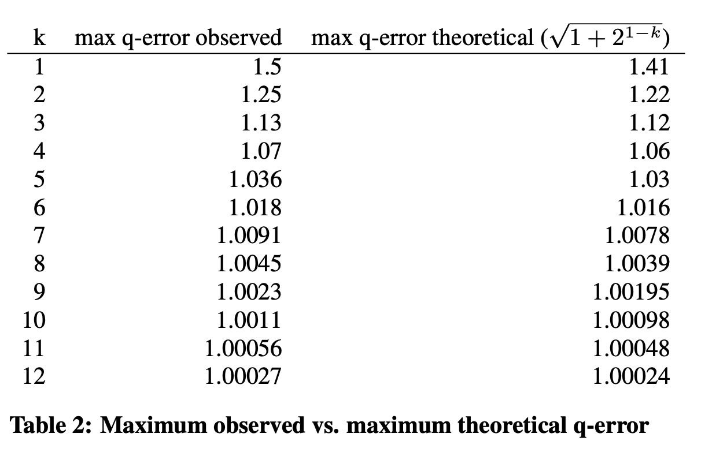
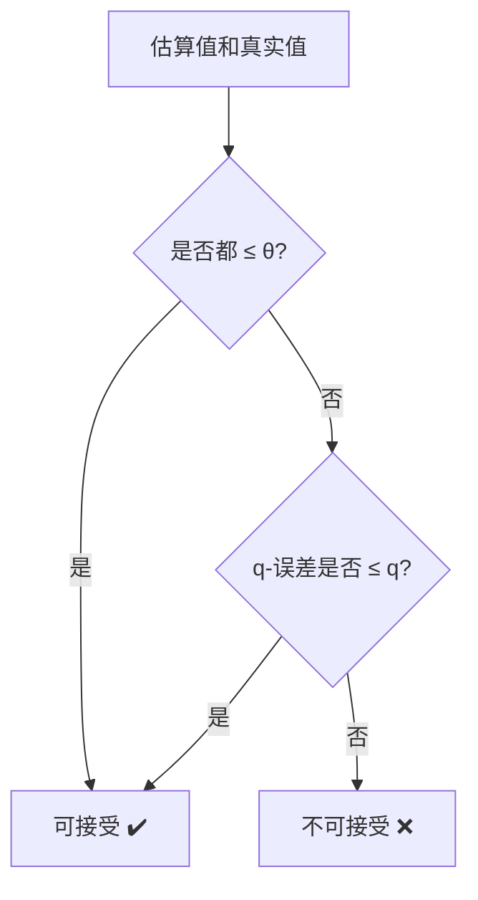
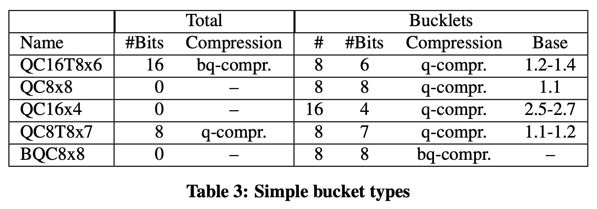
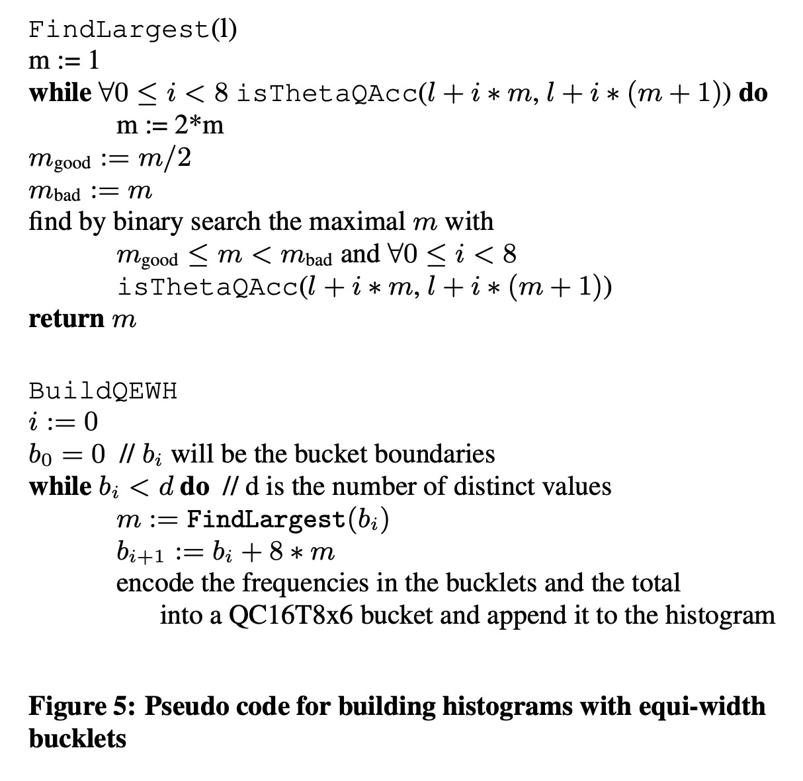
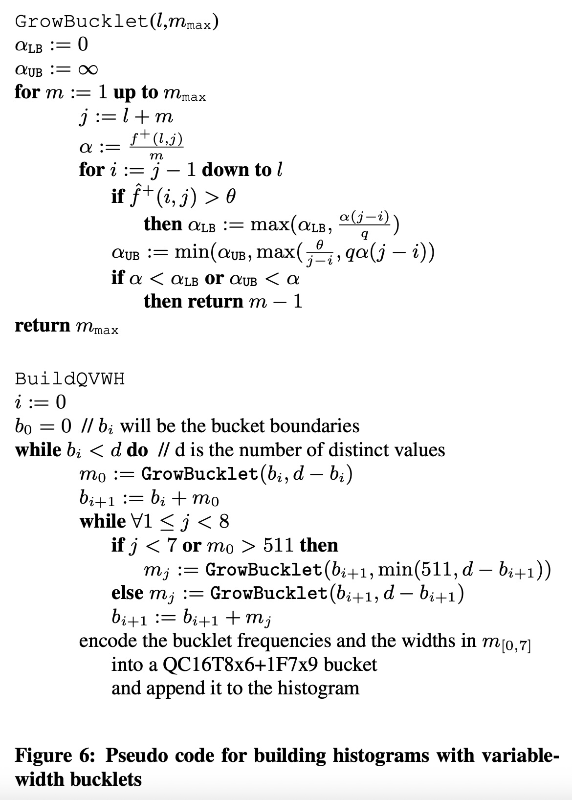
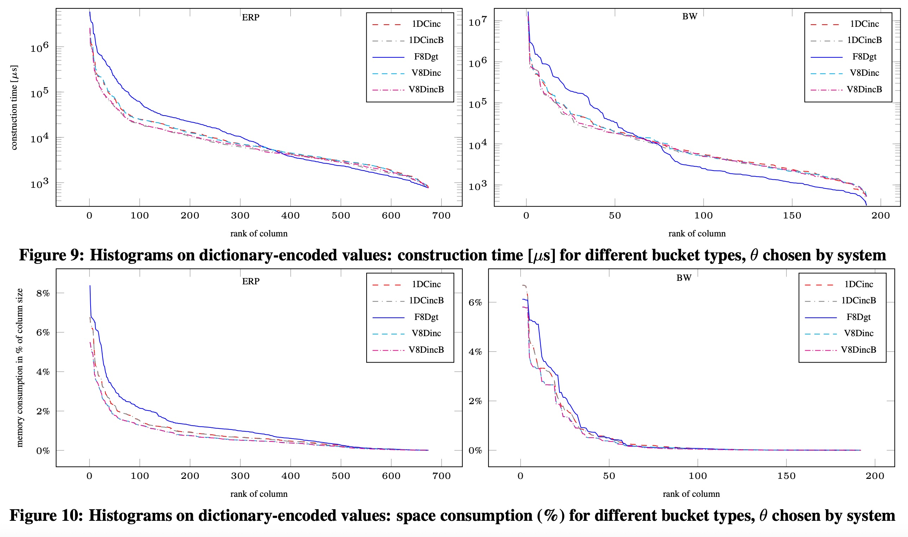
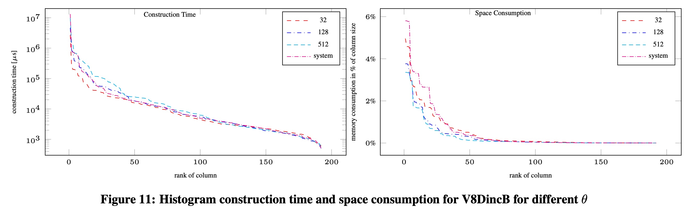
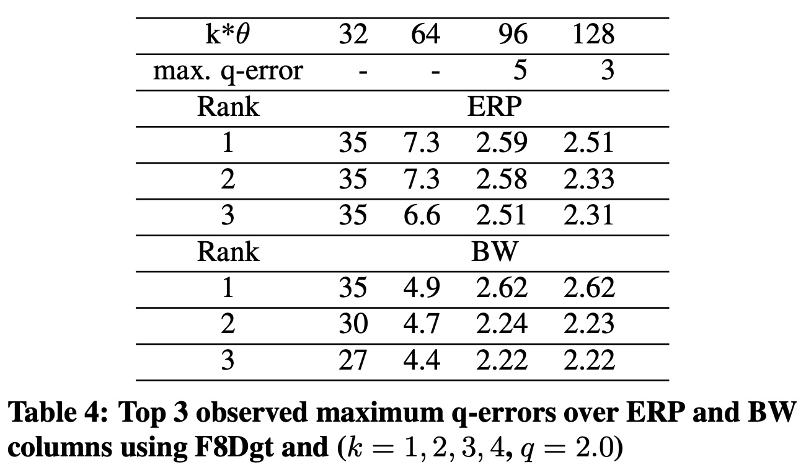
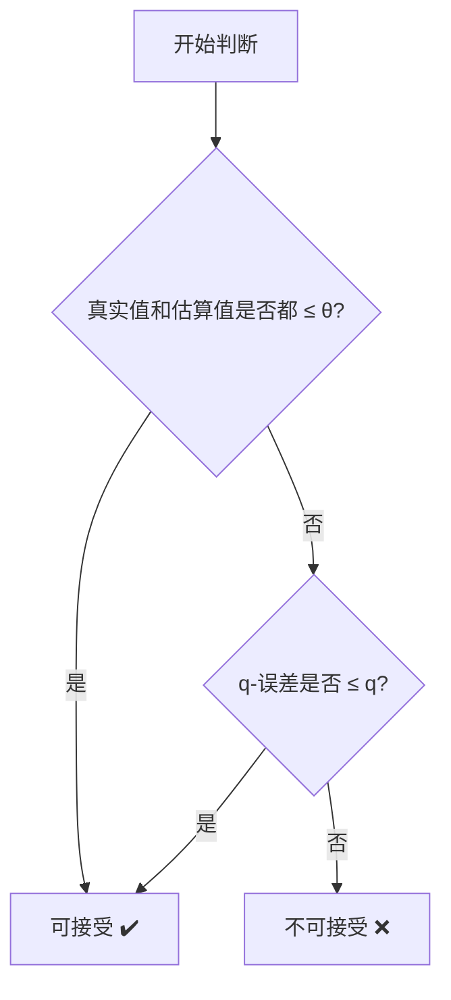

## AI论文解读 | Exploiting Ordered Dictionaries To Efficiently Construct Histograms With Q-Error Guarantees In Sap Hana
        
### 作者        
digoal        
        
### 日期        
2025-10-14        
        
### 标签        
PostgreSQL , PolarDB , DuckDB , AI , 论文解读        
        
----        
        
## 背景  
      
https://dl.acm.org/doi/pdf/10.1145/2588555.2595629        
  
提示:          
```          
读懂《Exploiting Ordered Dictionaries To Efficiently Construct Histograms With Q-Error Guarantees In Sap Hana》这篇论文需要提前掌握哪些基础知识, 请使用中文通熟易懂的讲解这些基础知识, 可以引用论文中的图、表或使用Markdown支持的图形(text,mermaid等)增加解释性. 
  
使用中文通熟易懂的解读《Exploiting Ordered Dictionaries To Efficiently Construct Histograms With Q-Error Guarantees In Sap Hana》这篇论文, 其中的关键内容请着重讲解, 可以引用论文中的图、表或使用Markdown支持的图形(text,mermaid等)增加解释性. 
  
提取《Exploiting Ordered Dictionaries To Efficiently Construct Histograms With Q-Error Guarantees In Sap Hana》这篇论文中的重要术语, 使用中文对这些术语进行通熟易懂的讲解, 可以引用论文中的图、表或使用Markdown支持的图形(text,mermaid等)增加解释性. 
```     
  
## 1 前置知识 
  
好的，为了完全理解《Exploiting Ordered Dictionaries To Efficiently Construct Histograms With Q-Error Guarantees In Sap Hana》这篇论文，你需要掌握一些数据库领域的基础知识。这篇论文的核心目标是为 SAP HANA 数据库构建一种**快速、节省空间且精确**的直方图，以解决查询优化中的基数估计错误问题 。

下面我将用通俗易懂的语言，为你讲解需要预先掌握的几个核心概念。

### 1\. 核心背景：查询优化与基数估计

想象一下你用导航软件查路线，从A地到B地有多条路。导航软件会估算每条路的交通状况（比如车流量、红绿灯数量），然后推荐一条最快的路线。

数据库的**查询优化器 (Query Optimizer)** 就扮演着导航软件的角色。当你向数据库发送一条查询指令（例如 SQL 语句）时，优化器会分析并生成许多种可能的“执行计划”（查询路径），然后选择一个它认为成本最低、执行最快的计划 。

这个决策过程中的关键一步叫做**基数估计 (Cardinality Estimation)**。基数就是指“行数”或“元组数”。优化器需要估算查询的中间步骤会返回多少行数据 。

  * **例子**：一个查询需要连接两个表 T1 和 T2。优化器就需要估算：“从 T1 表中筛选出符合条件的数据后，大概有多少行？”，这个估算结果会直接影响它选择哪种连接算法（比如 Hash Join 还是 Nested Loop Join）。

如果基数估计错得离谱（比如实际有100万行，却估计只有100行），优化器就可能选错“路线”，导致查询变得极慢 。这篇论文研究的直方图，就是为了让这个估算更准确。

### 2\. 核心技术：直方图 (Histogram)

直方图是数据库中用于进行基数估计的一种核心工具。它本质上是数据分布的一种紧凑的、近似的摘要 。

你可以把它理解为一个数据的“条形图”摘要。它将一个属性列的所有值分成若干个**桶 (Bucket)**，每个桶代表一个值的范围，并记录这个范围内的一些统计信息（比如有多少个值、有多少个不重复的值等） 。

当需要估算某个范围查询（如 `WHERE age > 30 AND age < 40`）的基数时，优化器不用扫描整个表，只需查看直方图中覆盖这个范围的几个桶，就能快速得到一个估算值 。

```mermaid
---
title: 数据库直方图示意图
---
bar
    title 年龄分布直方图
    "0-20岁" : 1500
    "21-40岁" : 4500
    "41-60岁" : 2500
    "60岁以上" : 500
```

上图就是一个简单的直方图，它把年龄数据分成了4个桶。这篇论文研究的就是如何更智能、更高效地划分这些“桶”。

### 3\. 核心环境：列式存储与有序字典

这篇论文的技术是为 SAP HANA 数据库设计的，它是一个**列式存储 (Column Store)** 数据库 。与传统按行存储数据的数据库不同，列式数据库将同一列的数据连续存放在一起。这种存储方式在数据分析场景下效率很高。

为了节省存储空间并提升CPU处理效率，现代列式存储系统（包括 SAP HANA）普遍采用**字典编码 (Dictionary Encoding)** 技术 。

  * **字典编码**：将一列中所有不重复的值（原始值）映射到一个从0开始的、连续的整数ID 。之后在列中存储的就不再是原始值（比如字符串"北京"、"上海"），而是这些紧凑的整数ID（比如0, 1）。

这篇论文利用了一个关键特性：**有序字典 (Ordered Dictionaries)**。这意味着字典编码后的整数ID保留了原始值的顺序 。

  * **例子**：如果原始值 "北京" \< "上海" \< "深圳"，那么它们对应的ID也会是 `0 < 1 < 2`。

这个特性带来的巨大好处是，它将原始的、可能很复杂的数据域，转换成了一个**稠密的、离散的整数域** 。这使得构建直方图变得更容易，因为可以直接在这些整数ID上进行计算，而不用处理复杂的原始值。

### 4\. 核心度量：Q-Error (q-误差)

为了衡量基数估计的“精确度”，论文使用了一个叫 **q-误差 (q-error)** 的指标 。它是一种相对误差或乘法误差的度量。

如果真实值为 $f$ ，估计值为 $\hat{f}$ ，那么q-误差的定义是：
$$q\text{-error} = \max\left(\frac{f}{\hat{f}}, \frac{\hat{f}}{f}\right)$$


  * **例子1**：真实值是100，估计值是200。q-误差 = $\max(100/200, 200/100) = \max(0.5, 2) = 2$ 。
  * **例子2**：真实值是100，估计值是50。q-误差 = $\max(100/50, 50/100) = \max(2, 0.5) = 2$ 。

q-误差越接近1，说明估计越准确。一个 q-误差为2的估计意味着估计值在真实值的 `[0.5倍, 2倍]` 区间内。

**q-误差的局限性 (论文的出发点之一):**
q-误差在处理基数非常小的情况时会显得很“夸张”。论文中举了一个例子：如果真实值 $f=1$ ，而估计值 $\hat{f}=10$ ，q-误差高达10 。但对于查询优化器来说，1行和10行的差别通常不会导致生成截然不同的执行计划 。为了解决这个问题，论文引入了新的 **$\theta,q$-可接受性 ( $\theta,q$-acceptability )** 概念，即当基数小于某个阈值 $\theta$ 时，我们就不再关心q-误差有多大 。

### 5\. 核心工具：Q-Compression (q-压缩)

为了让直方图本身足够“节省空间”，论文采用了 **q-压缩 (q-compression)** 技术来存储桶内的统计数据 。这是一种有损压缩方法，其目标是在保证解压后的值的q-误差不超过一个给定上限的前提下，用尽量少的位数来存储一个数字 。

论文中提到了两种q-压缩方法：

1.  **通用q-压缩**：基于对数和幂运算，比较灵活但解压速度较慢 。
2.  **二进制q-压缩**：一种特化的、类似浮点数表示的方法，通过存储一个数的最高几位和它的偏移量（shift）来实现压缩 。它的优点是压缩和解压速度极快 。

论文中的 **Table 2** 展示了二进制q-压缩的效果，说明可以用很少的位数（如8位）来表示非常大的数字，同时将q-误差控制在很小的范围内（如1.05）。    

| \#Bits | Base | Largest compressible number | q-error |
| :---: | :--: | :-------------------------: | :-----: |
|   8   | 1.1  |        32,639,389,743       |  1.05   |


-----

### 总结

掌握了以上五个基础知识点后，你就可以更好地理解这篇论文的脉络了：

> 在 **SAP HANA** 这种**列式存储**数据库中，利用其**有序字典**特性，设计了一套新的算法，用于高效地构建直方图。这种直方图通过**q-压缩**技术来节省空间，并通过一种改进的 **q-误差** 度量（即 **$\theta,q$-可接受性**）来保证**基数估计**的准确性，最终服务于数据库的**查询优化**。

有了这些背景，你再去看论文中关于测试 $\theta,q$-可接受性的算法 (第4节)、从桶扩展到整个直方图的理论 (第5节) 以及具体的直方图构建算法 (第7节) 时，就会豁然开朗。
  
## 2 解读论文 
  
好的，这篇论文《Exploiting Ordered Dictionaries To Efficiently Construct Histograms With Q-Error Guarantees In Sap Hana》的核心思想是为 SAP HANA 数据库设计一种新型的直方图，旨在解决查询优化中一个长期存在的痛点：**基数估计错误**。

简单来说，数据库在执行一条查询前，需要“猜测”每一步会返回多少行数据（即基数），以便选择最高效的执行路径。如果猜错了，查询性能可能会一落千丈 。为了解决这个问题，SAP HANA 管理层提出了三大目标：构建的直方图必须**节省空间**、**构建速度快**且**估算精确** 。

下面，我们将深入解读这篇论文的关键内容。

### 1. 核心创新：从 q-误差 到 $\theta,q$-可接受性

#### 什么是 q-误差 (q-error)？
q-误差是衡量估算精确度的常用指标，它表示估算值和真实值之间的乘法偏差 。其公式为：
$$
q\text{-error} = \max\left(\frac{\text{真实值}}{\text{估算值}}, \frac{\text{估算值}}{\text{真实值}}\right)
$$
q-误差越接近1，估算越准。例如，q-误差为2表示估算值不会偏离真实值的2倍或1/2倍之外。

#### q-误差的局限与解决方案
q-误差有一个问题：在处理非常小的基数时，它会过度惩罚。论文中举例：真实值为1，估算值为10，q-误差高达10 。但在实际场景中，优化器对于1行和10行的处理方式差别不大，这种“巨大”的误差并不会导致选择错误的执行计划 。

为了解决这个问题，论文提出了一个全新的、更实用的度量标准：**$\theta,q$-可接受性 ( $\theta,q$-acceptability )** 。

这个概念引入了一个**阈值 $\theta$** 。其核心思想是：
> 当基数很小（ 即低于阈值 $\theta$ ）时，我们不需要关心估算的精确度，因为无论如何查询都会很快完成 。只有当基数大到足以影响查询计划时，我们才需要保证其 q-误差在 $q$ 之内。

一个估算值是“ $\theta,q$-可接受的 ”，当它满足以下两个条件之一：
1.  真实值和估算值都小于等于 $\theta$ 。
2.  它的 q-误差小于等于 $q$ 。


这个创新极大地放宽了对小基数估算的要求，使得构建更紧凑、更快速的直方图成为可能。

### 2. 关键技术：利用有序字典和高效压缩

#### 有序字典 (Ordered Dictionaries)
SAP HANA 等现代列式数据库采用**字典编码**来压缩数据 。这篇论文利用了其**有序**的特性：编码后的整数ID保留了原始值的顺序 。

这个特性带来的最大好处是，它将原始数据（可能是字符串、日期等）转换成了一个**稠密的、从0开始的整数域** 。这为后续算法的实现提供了极大的便利，因为算法可以直接在这些简单的整数上进行高效计算 。

#### 高效的桶 (Bucket) 设计与压缩
为了节省空间，论文设计了非常紧凑的桶结构。一个标准的64位（8字节）就可以存储一个包含8个子桶（bucklet）的复杂信息 。

这是通过一种叫 **q-压缩** 的有损压缩技术实现的。论文特别介绍了一种速度极快的**二进制q-压缩**，它类似于浮点数表示法，能在几个纳秒内完成压缩和解压，同时将q-误差控制在极低的水平 。

论文中的 **Table 3** 展示了几种桶类型的设计，其中 **QC16T8x6** 是一个典型例子 ：    
* **16位**：使用快速的**二进制q-压缩**存储整个桶的总频率 。
* **8x6 (48位)**：将桶内部分成8个子桶，每个子桶的频率用6位进行**q-压缩**存储 。

这种设计使得直方图在提供高精度估算的同时，占用的空间极小。

### 3. 核心算法：两种直方图构建策略

基于有序字典带来的稠密整数域，论文提出了两种高效的直方图构建算法。

#### 1. 等宽子桶 (Equi-Width Bucklets - QEWH)
这种方法将一个大桶（Bucket）分割成8个宽度（包含的不同值的数量）完全相等的子桶（bucklet） 。

构建过程如 **Figure 5** 所示 ：    
1.  **`FindLargest` 函数**：从一个起始点开始，通过一种“指数增长+二分查找”的策略，快速找到一个最大宽度 `m` 。
2.  这个宽度 `m` 能保证，如果将后续8个连续的、宽度为 `m` 的区间作为子桶，每个子桶都满足 **$\theta,q$-可接受性** 。
3.  **`BuildQEWH` 函数**：循环调用 `FindLargest` 来确定每个大桶的边界，并将其编码后存入直方图 。

#### 2. 可变宽度子桶 (Variable-Width Bucklets - QVWH)
等宽子桶有一个缺点：如果数据分布不均，一个很难处理的小区间可能会导致所有8个子桶的宽度都被限制得很窄，从而浪费空间 。

**QVWH** 解决了这个问题，它允许一个大桶内的8个子桶拥有不同的宽度，适应性更强 。其构建算法（如 **Figure 6** 所示）也更为智能 ：    
* 它采用**增量式构建**方法，逐个“生长”出子桶 。
* **`GrowBucklet` 函数**：从一个点开始，不断尝试向右扩展子桶的边界。在每一步扩展中，它都会检查当前形成的子桶是否仍然满足 $\theta,q$-可接受性。一旦不满足，就停止扩展，并将前一个位置作为子桶的最终边界 。

这种方法消除了“生成再测试”的低效模式，通过维护一个有效参数区间来动态判断，效率更高 。

### 4. 实验结果与结论

论文通过在两个真实世界的SAP数据集（ERP和BW）上进行实验，验证了其方法的有效性。

* **构建速度与空间占用**：
    * 绝大多数情况下，直方图的构建时间远**少于1秒** 。
    * 空间占用远低于10%的目标，通常**低于5%** 。
    * 下图（源自论文 Figure 9 和 Figure 10）直观地展示了这一点，其中 `V8DincB`（采用有界增量搜索的可变宽度子桶）在空间占用上表现最佳 。  

       

    图例：源自论文Figure 9和10的综合示意图，展示了构建时间和空间消耗

* **θ 的影响**：
    * 实验（如 Figure 11）证明了 **$\theta$** 的双重影响：增大 $\theta$ 可以让桶变得更大，从而**减少空间占用**，但同时也会增加算法的检查复杂度，导致**构建时间变长** 。这是一个需要权衡的参数。    

* **估算精度**：
    * 论文通过理论证明和实验验证，即使每个桶是独立的 $\theta,q$-可接受的，由它们组成的整个直方图也能提供一个有界的、高质量的估算误差 。
    * 如 **Table 4** 所示，在全量查询测试中，实际观察到的最大q-误差远低于理论上的最坏情况上界，证明了方法的鲁棒性 。    

### 总结

这篇论文通过引入**$\theta,q$-可接受性**这一创新概念，并巧妙利用SAP HANA的**有序字典**特性，设计出了一套**构建速度极快、空间占用极小且估算精度有保证**的直方图构建方案。它不仅解决了数据库查询优化中的一个实际难题，还为业界提供了一套完整且可行的工程实践。
  
## 3 术语 
  
好的，这是对《Exploiting Ordered Dictionaries To Efficiently Construct Histograms With Q-Error Guarantees In Sap Hana》这篇论文中重要术语的中文解读。

---

### 1. 基数估计 (Cardinality Estimation)
在数据库中，当你执行一条查询时，优化器需要预测查询的每个步骤会返回多少行数据 。这个“预测行数”的过程就是基数估计。准确的基数估计对于生成高效的查询执行计划至关重要 。如果估计错误，可能会导致查询速度变得极慢 。

### 2. 直方图 (Histogram)
直方图是进行基数估计的一种统计工具 。它将一列数据的值范围分割成多个“桶”（Bucket） 。通过记录每个桶内的数据分布摘要信息，优化器可以快速估算某个查询条件会命中多少行数据，而无需扫描整个数据列 。

### 3. 有序字典 (Ordered Dictionaries)
现代列式数据库（如SAP HANA）为了节省空间和提升效率，会使用字典编码技术 。它将列中所有不重复的原始值（例如字符串“北京”）映射到一个唯一的、固定大小的整数ID（例如 0） 。

“有序”是这里的关键特性，意味着编码后的整数ID保留了原始值的排序关系 。例如，如果 "北京" < "上海"，那么它们的ID也会满足 `ID("北京") < ID("上海")` 。这篇论文的核心就是利用这个特性，将复杂的数据处理转变为在**稠密、有序的整数域**上的高效计算 。

### 4. q-误差 (q-error)
q-误差是用来衡量基数估计精确度的一种乘法误差指标 。

如果真实值为 $f$ ，估计值为 $\hat{f}$ ，q-误差的定义为：
$$
||\hat{f}/f||_{Q} := \max(f/\hat{f}, \hat{f}/f) \quad \text{}
$$
q-误差越接近1，说明估计越准确。例如，一个q-误差为2的估计意味着估计值不会超过真实值的2倍或低于真实值的1/2 。

### 5. $\theta,q$-可接受性 ( $\theta,q$-acceptability )
这是论文提出的一个核心创新概念，旨在解决q-误差在处理小基数时过于严苛的问题 。它引入了一个**阈值 $\theta$**，其思想是：当基数足够小（ 低于 $\theta$ ）时，我们不关心估算的误差有多大，因为查询无论如何都会很快；只有当基数超过 $\theta$ 时，才需要保证其q-误差在 $q$ 之内 。

一个估算是“ $\theta,q$-可接受的 ”，需满足以下两个条件之一：
1.  真实值 $f \le \theta$ **并且** 估算值 $\hat{f} \le \theta$ 。
2.  估算的 q-误差 $\le q$ 。



这个概念极大地提升了构建直方图的灵活性和效率 。

### 6. 桶 (Bucket) 与 子桶 (Bucklet)
* **桶 (Bucket)**：是直方图的基本组成单元，代表了数据的一个值范围 。
* **子桶 (Bucklet)**：为了提高精度和压缩效率，论文中的算法将一个大的“桶”再细分为8个更小的“子桶” 。所有子桶的统计信息被压缩后存储在一个单元里（例如一个64位整数） 。

这种“桶-子桶”的层级结构是论文中高效直方图设计的关键之一 。

### 7. q-压缩 (q-compression)
这是一种有损数字压缩技术，目标是用尽量少的位数来存储一个数字，同时保证解压后的数字与原始值之间的q-误差不超过一个预设的界限 。

论文中介绍了两种q-压缩方法：
* **通用q-压缩**：基于对数和幂运算，比较灵活但解压慢 。
* **二进制q-压缩**：一种类似浮点数表示的快速方法，通过存储数字的最高几位及其偏移量来实现压缩 。它的压缩和解压速度极快（纳秒级别），非常适合在查询估算时高频使用 。

**Table 2** 展示了二进制q-压缩的强大效果：仅用8位就可以表示高达三百多亿的数字，且q-误差仅为1.05 。   
  
## 参考        
         
https://dl.acm.org/doi/pdf/10.1145/2588555.2595629    
        
<b> 以上内容基于DeepSeek、Qwen、Gemini及诸多AI生成, 轻微人工调整, 感谢杭州深度求索人工智能、阿里云、Google等公司. </b>        
        
<b> AI 生成的内容请自行辨别正确性, 当然也多了些许踩坑的乐趣, 毕竟冒险是每个男人的天性.  </b>        
    
#### [期望 PostgreSQL|开源PolarDB 增加什么功能?](https://github.com/digoal/blog/issues/76 "269ac3d1c492e938c0191101c7238216")
  
  
#### [PolarDB 开源数据库](https://openpolardb.com/home "57258f76c37864c6e6d23383d05714ea")
  
  
#### [PolarDB 学习图谱](https://www.aliyun.com/database/openpolardb/activity "8642f60e04ed0c814bf9cb9677976bd4")
  
  
#### [PostgreSQL 解决方案集合](../201706/20170601_02.md "40cff096e9ed7122c512b35d8561d9c8")
  
  
#### [德哥 / digoal's Github - 公益是一辈子的事.](https://github.com/digoal/blog/blob/master/README.md "22709685feb7cab07d30f30387f0a9ae")
  
  
#### [About 德哥](https://github.com/digoal/blog/blob/master/me/readme.md "a37735981e7704886ffd590565582dd0")
  
  

  
