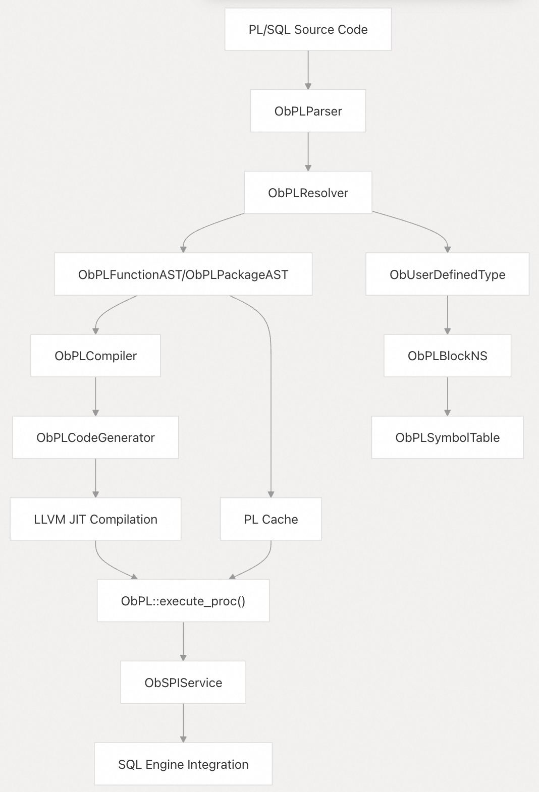
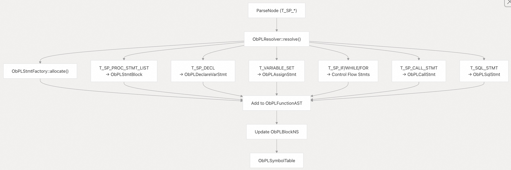
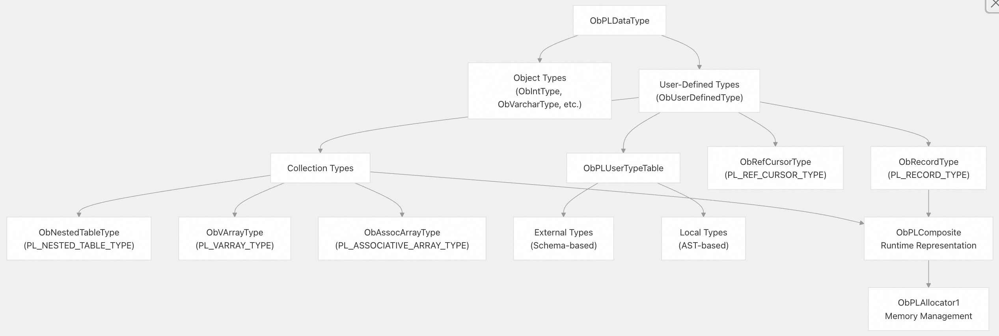
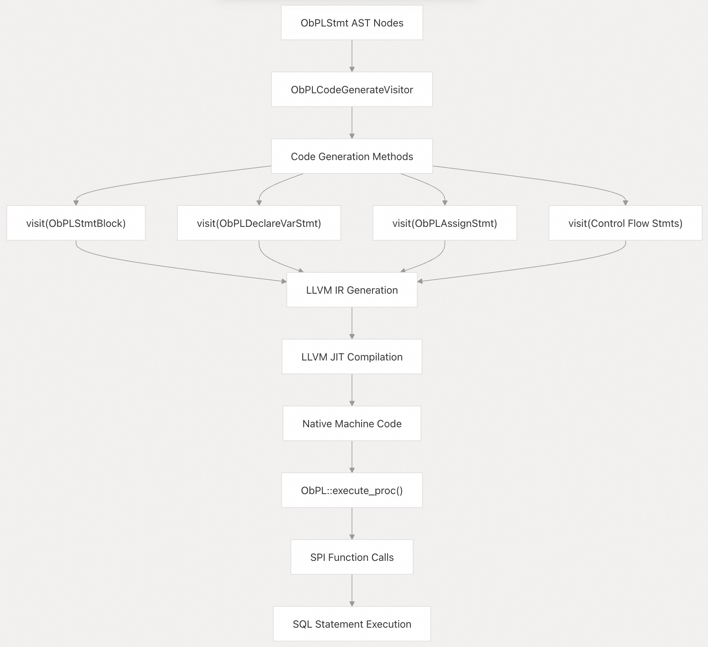
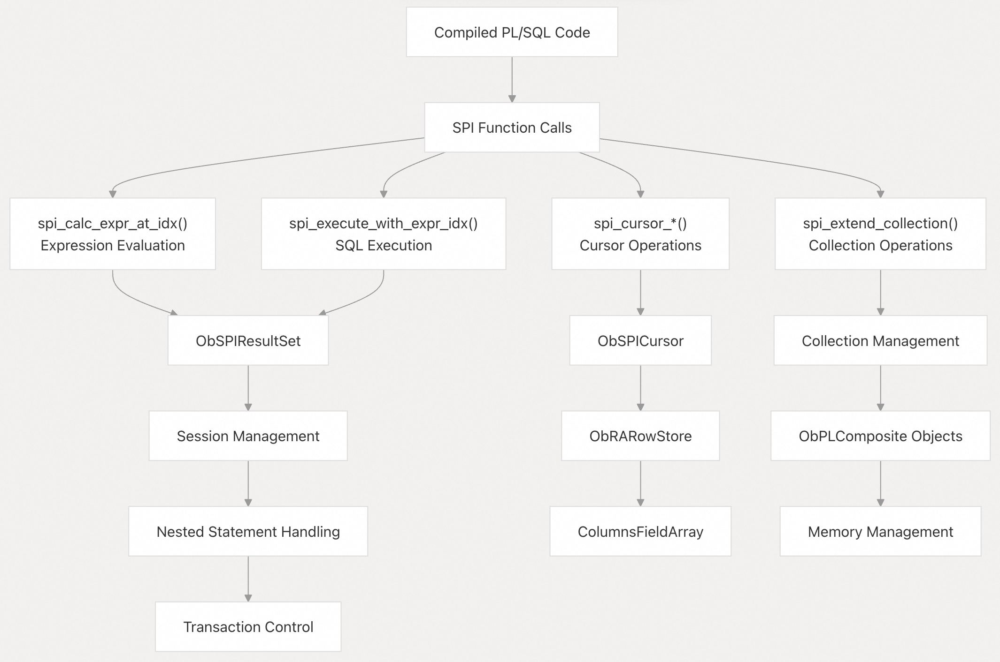
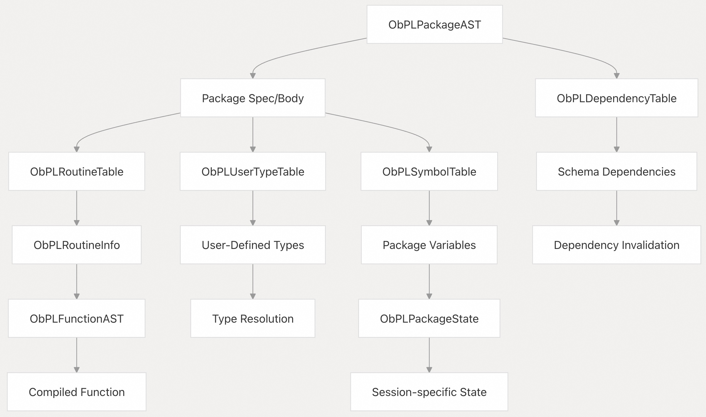
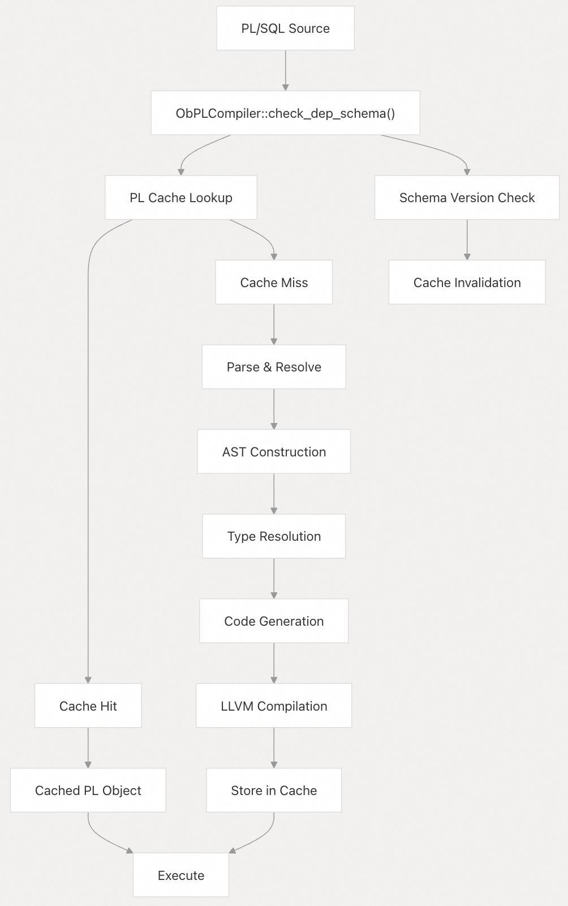

## 体系化剖析开源OB代码: 2.5 PL/SQL 支持系统        
                    
### 作者            
digoal            
                    
### 日期              
2025-10-14                  
             
### 标签                  
PostgreSQL , PolarDB , DuckDB , MySQL , OceanBase             
                   
----               
               
## 背景            
本文介绍 OceanBase 的 PL/SQL（过程语言/SQL）支持系统，该系统用于执行与 Oracle 兼容的存储过程、函数、包和匿名块。PL/SQL 引擎提供过程代码的编译、优化和执行功能。  
  
## 架构概述  
PL/SQL 支持系统由多个相互关联的组件组成，这些组件处理从 PL/SQL 源代码解析到运行时(runtime)执行的完整生命周期。该系统同时支持解释式运行 和 基于 LLVM 的编译后运行，以优化性能。  
  
PL/SQL处理管道:  
  
    
  
**源文件:**  
- https://github.com/oceanbase/oceanbase/blob/8e2580cf/src/pl/ob_pl_resolver.cpp#L222-L780
- https://github.com/oceanbase/oceanbase/blob/8e2580cf/src/pl/ob_pl_compile.cpp#L77-L244
- https://github.com/oceanbase/oceanbase/blob/8e2580cf/src/pl/ob_pl_code_generator.cpp#L30-L37
- https://github.com/oceanbase/oceanbase/blob/8e2580cf/src/pl/ob_pl.cpp#L309-L448
  
## 语句语义解析和 AST 构建  
`ObPLResolver` 类是将 PL/SQL 结构进行语法解析(parser) 和 语义解析(resolution)为抽象语法树 (AST) 的核心组件。它负责将解析树转换为可执行语句。  
  
语句语义解析流程:  
  
    
  
解析器通过 `resolve()` 方法中的 switch 语句处理不同的语句类型，创建适当的语句对象(statement obj), 并维护命名空间(namespace)信息(包括了变量和类型)用于进行语义解析。  
  
**源文件:**  
- https://github.com/oceanbase/oceanbase/blob/8e2580cf/src/pl/ob_pl_resolver.cpp#L222-L780
- https://github.com/oceanbase/oceanbase/blob/8e2580cf/src/pl/ob_pl_stmt.cpp#L65-L88
- https://github.com/oceanbase/oceanbase/blob/8e2580cf/src/pl/ob_pl_resolver.h#L219-L258
  
## 类型系统和用户自定义类型  
OceanBase 的 PL/SQL 引擎支持全面的类型系统，包括标量类型、复合类型（records 和 collections/集合）以及用户自定义类型，并同时集成了 Oracle 和 MySQL 风格的 PL/SQL 语义。  
  
类型系统架构:  
  
    
  
该类型系统支持编译时类型检查和运行时类型操作，并通过专门的内存管理 `ObPLAllocator1` 来管理复合类型。  
  
**源文件:**  
- https://github.com/oceanbase/oceanbase/blob/8e2580cf/src/pl/ob_pl_user_type.cpp#L31-L183
- https://github.com/oceanbase/oceanbase/blob/8e2580cf/src/pl/ob_pl_type.cpp#L34-L101
- https://github.com/oceanbase/oceanbase/blob/8e2580cf/src/pl/ob_pl_stmt.cpp#L98-L137
  
## 代码生成和执行  
PL/SQL 引擎使用 LLVM 进行即时编译以实现高性能。通过 `ObPLCodeGenerator` 将 `AST` 转换为 `LLVM IR`，然后将其编译为本机机器码。  
  
代码生成管道:  
  
    
  
代码生成器生成对 SPI（存储过程接口）函数的调用，用于 SQL 执行、游标管理和异常处理等运行时操作。  
  
**源文件:**  
- https://github.com/oceanbase/oceanbase/blob/8e2580cf/src/pl/ob_pl_code_generator.cpp#L63-L162
- https://github.com/oceanbase/oceanbase/blob/8e2580cf/src/pl/ob_pl.cpp#L76-L244
- https://github.com/oceanbase/oceanbase/blob/8e2580cf/src/sql/ob_spi.cpp#L47-L106
  
## SPI 服务层  
`ObSPIService` 提供已编译的 PL/SQL 代码和 SQL 引擎之间的运行时接口。它处理 PL/SQL 上下文中的 SQL 语句执行、游标操作、参数管理和异常处理。  
  
SPI 服务组件:  
  
    
  
SPI 层管理执行上下文，处理嵌套的SQL语句，并为PL/SQL操作提供事务隔离。  
  
**源文件:**  
- https://github.com/oceanbase/oceanbase/blob/8e2580cf/src/sql/ob_spi.cpp#L122-L528
- https://github.com/oceanbase/oceanbase/blob/8e2580cf/src/sql/ob_spi.h#L102-L161
- https://github.com/oceanbase/oceanbase/blob/8e2580cf/src/sql/ob_spi.cpp#L473-L528
  
## Package 和 Routine 管理  
OceanBase 支持类似 Oracle 风格的包，即过程、函数、类型和变量的集合。包管理系统为 PL/SQL 对象提供封装和命名空间管理。  
  
封装架构:  
  
    
  
包状态管理确保在会话中的过程调用之间保持包变量的值，同时支持适当的清理和依赖性跟踪。  
  
**源文件:**  
- https://github.com/oceanbase/oceanbase/blob/8e2580cf/src/pl/ob_pl_package.cpp#L26-L61
- https://github.com/oceanbase/oceanbase/blob/8e2580cf/src/pl/ob_pl_stmt.cpp#L96-L191
- https://github.com/oceanbase/oceanbase/blob/8e2580cf/src/pl/ob_pl_package_state.cpp#L26-L169
  
## 编译和缓存  
PL/SQL 编译器管理从源代码到可执行对象的转换，并使用复杂的缓存来尽可能避免重新编译。  
  
编译流程:  
  
    
  
编译系统跟踪 schema 依赖关系，并在依赖 schema 发生变化时使缓存对象失效，并且确保缓存对象在分布式环境中的一致性。  
  
**源文件:**  
- https://github.com/oceanbase/oceanbase/blob/8e2580cf/src/pl/ob_pl_compile.cpp#L33-L74
- https://github.com/oceanbase/oceanbase/blob/8e2580cf/src/pl/ob_pl_compile.cpp#L77-L244
- https://github.com/oceanbase/oceanbase/blob/8e2580cf/src/pl/ob_pl_compile.cpp#L851-L959
    
#### [期望 PostgreSQL|开源PolarDB 增加什么功能?](https://github.com/digoal/blog/issues/76 "269ac3d1c492e938c0191101c7238216")
  
  
#### [PolarDB 开源数据库](https://openpolardb.com/home "57258f76c37864c6e6d23383d05714ea")
  
  
#### [PolarDB 学习图谱](https://www.aliyun.com/database/openpolardb/activity "8642f60e04ed0c814bf9cb9677976bd4")
  
  
#### [PostgreSQL 解决方案集合](../201706/20170601_02.md "40cff096e9ed7122c512b35d8561d9c8")
  
  
#### [德哥 / digoal's Github - 公益是一辈子的事.](https://github.com/digoal/blog/blob/master/README.md "22709685feb7cab07d30f30387f0a9ae")
  
  
#### [About 德哥](https://github.com/digoal/blog/blob/master/me/readme.md "a37735981e7704886ffd590565582dd0")
  
  

  
