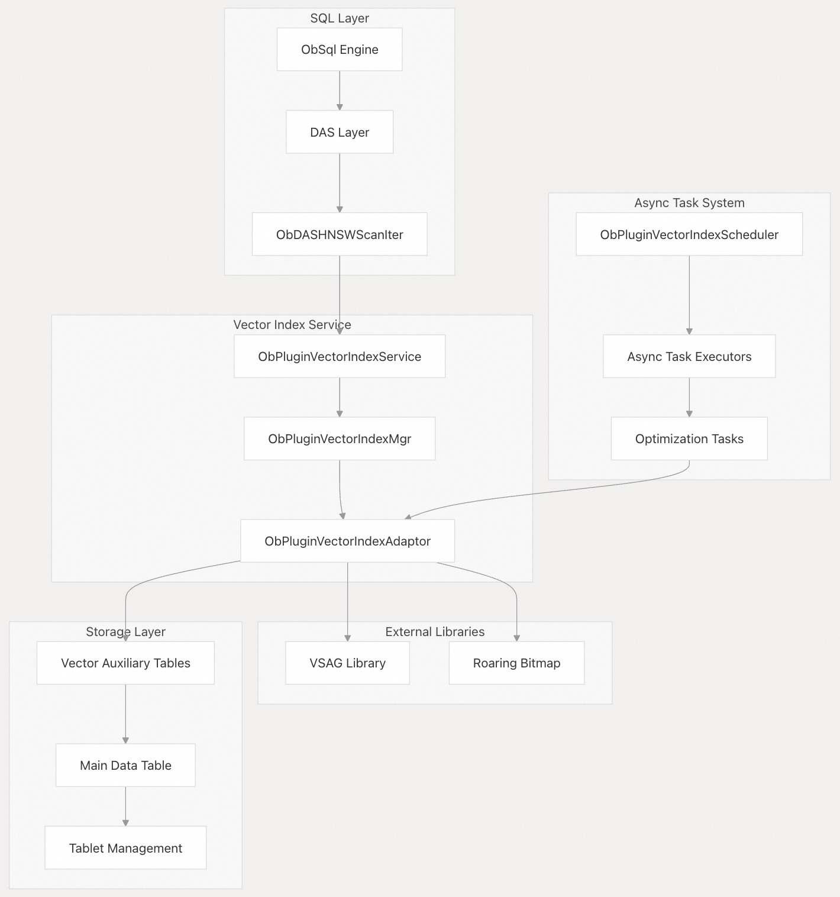
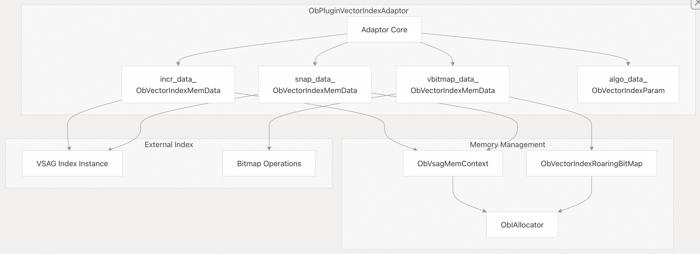
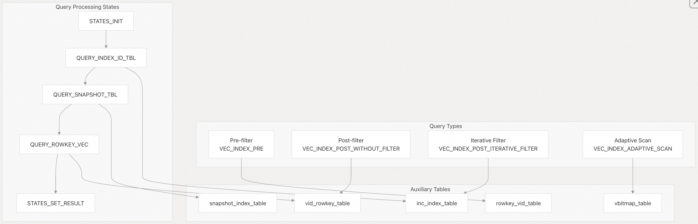
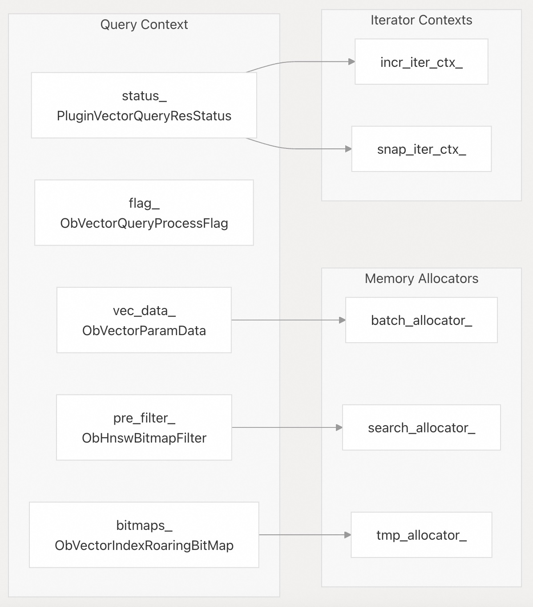
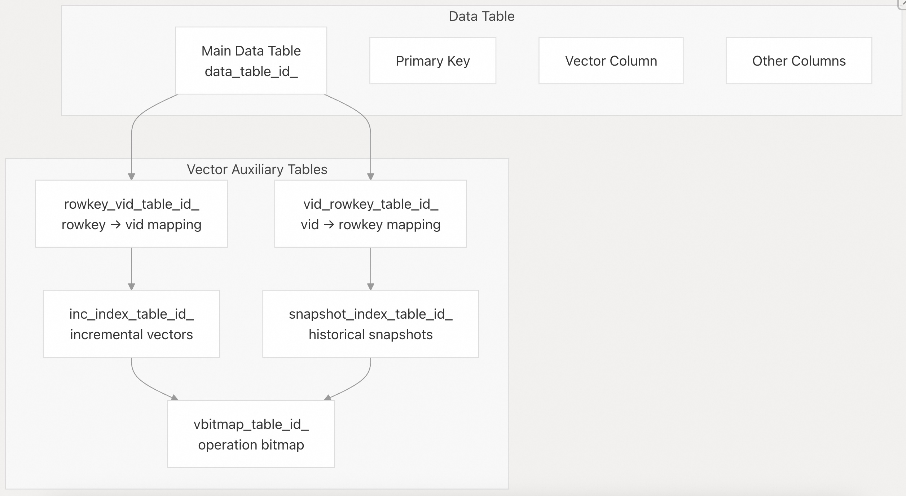
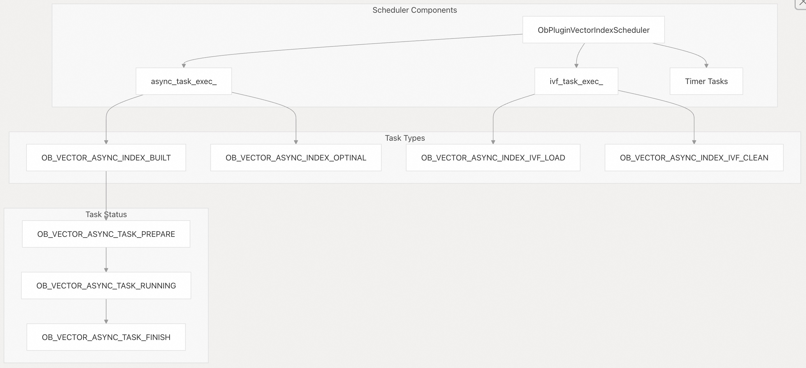
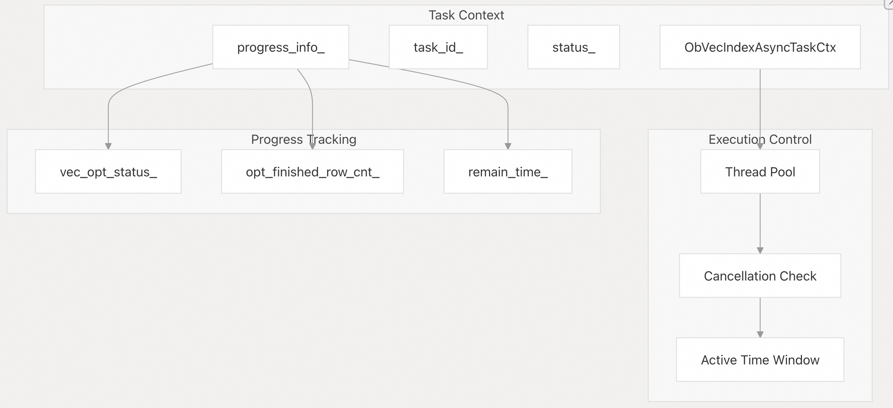

## 体系化剖析开源OB代码: 2.6 向量索引系统          
                      
### 作者              
digoal              
                      
### 日期                
2025-10-14                    
               
### 标签                    
PostgreSQL , PolarDB , DuckDB , MySQL , OceanBase               
                     
----                 
                 
## 背景       
向量索引系统在 OceanBase 分布式数据库架构下提供向量相似性搜索能力，该系统通过HNSW（Hierarchical Navigable Small World）、IVF（Invert File）以及量化(quantization)等多种索引算法/技术，实现对高维向量数据的高效最近邻查询。  
  
该系统通过 DAS（数据访问服务）层与 OceanBase 的 SQL 处理流水线集成，支持独立的向量查询，以及向量相似度与传统 SQL 谓词相结合的混合查询。  
  
## 架构概述  
向量索引系统采用插件式架构，将外部向量索引库（主要是 VSAG lib 库）与 OceanBase 的存储层、查询处理层集成。  
  
### 高级系统架构  
  
    
  
## 核心组件  
  
### 向量索引适配器  
`ObPluginVectorIndexAdaptor` 作为 OceanBase 与外部向量索引库的主要接口，管理多种类型的向量索引数据结构，并协调不同索引类型之间的内存管理。  
  
    
  
适配器管理三个主要数据结构：  
- 索引增量（`VIRT_INC`）：处理新插入和更新  
- 索引快照（`VIRT_SNAP`）：维护历史快照以确保查询一致性  
- 向量位图（`VIRT_BITMAP`）：使用 roaring bitmaps 跟踪删除和插入的向量  
  
### 算法支持  
系统通过 `ObVectorIndexAlgorithmType` 枚举支持多种向量索引算法：  
  
向量索引算法类型	| 描述	| 用例  
---|---|---  
`VIAT_HNSW`	| 分层可导航小世界网络(HNSW) 	| 通用 ANN 搜索  
`VIAT_HNSW_SQ`	| 采用标量量化的 HNSW	| 内存优化搜索  
`VIAT_HNSW_BQ`	| 采用二进制量化的 HNSW	| 超快速近似搜索  
`VIAT_IVF_FLAT`	| 向量的倒排文件(通过kmeans计算N个中心点, 按距离放入各中心点, 形成多中心点聚集存储)	| 大规模精确向量搜索  
`VIAT_IVF_PQ`	| 量化后再倒排	| 压缩向量存储  
`VIAT_HGRAPH`	| 带有额外元数据的 HNSW	| 增强型 HNSW 变体(牺牲一定精确度换取低内存消耗和更高性能)  
  
更多可参考:  
- [《数据库筑基课 - 向量索引之 HNSW》](../202506/20250624_03.md)    
- [《AI论文解读 | Efficient and robust approximate nearest neighbor search using Hierarchical Navigable Small World graphs》](../202506/20250619_02.md)   
  
支持的距离度量包括 L2 欧几里得 (`VIDA_L2`)、内积 (`VIDA_IP`) 和余弦相似度 (`VIDA_COS`)。  
  
## 查询处理管道  
### HNSW 查询执行  
向量查询通过 `ObDASHNSWScanIter` 进行处理，它实现了支持多种过滤策略的复杂查询执行管道。  
  
    
  
查询执行遵循以下阶段：  
- 查询向量准备：从 SQL 表达式中提取并验证查询向量  
- 索引选择：根据数据新鲜度在增量索引和快照索引之间进行选择  
- 过滤策略：根据查询特征应用预过滤、后过滤或自适应过滤  
- 结果聚合：合并来自多个辅助表(疑问: 辅助表是不是指多个向量索引/标量索引? 结果聚合是不是类似PG的多index扫描中的 bitmapAnd/bitmapOr 合并? 看下一节)的结果  
- 距离计算：计算最终的相似度分数进行排名(reranking)  
  
### 查询上下文管理  
`ObVectorQueryAdaptorResultContext` 管理查询状态和结果处理：  
  
    
  
## 存储架构  
### 辅助表结构  
向量索引由多个辅助表支持，这些辅助表维护向量 ID 和物理表 RowID(row keys) 之间的映射：  
  
表类型	| 目的	| Key 列  
---|---|---  
`rowkey_vid_table`	| 将行键(row key)映射到向量 ID 	| rowkey → vid  
`vid_rowkey_table`	| 将向量 ID 映射到行键	 | vid → rowkey  
`inc_index_table`	| 增量索引数据	| vid, vector, metadata  
`vbitmap_table`	| 删除/插入跟踪	| vid, operation_type  
`snapshot_index_table`	| 历史索引快照s	| vid, vector, scn  
  
从辅助表的设计, 可看到OceanBase沿袭了LSM-tree的思想(并非完全一样), 也将数据分成了增量数据、持久化数据, 通过合并将增量数据合并到持久化快照.  
  
    
  
### 内存管理  
系统采用专门的内存管理来进行向量运算：  
- `ObVsagMemContext` ：管理 VSAG 库操作的内存  
- `ObVsagSearchAlloc` ：搜索操作的自定义内存分配器  
- `Roaring Bitmap Memory` ：专门用于位图操作的内存分配  
  
## 异步任务管理  
### 后台优化  
`ObPluginVectorIndexScheduler` 管理用作索引优化和维护的后台任务：  
  
    
  
后台任务包括：  
- 索引构建：从数据表构建新的向量索引  
- 索引优化：将增量更新合并到快照索引中  
- 内存清理：释放未使用的索引内存并清理弃用的适配器  
- IVF 维护：导入和清空 IVF 辅助表  
  
### 任务执行框架  
  
    
  
## 集成点  
### DAS(Data Access Service) 层集成  
向量索引系统通过专门的迭代器和算子与 OceanBase 的 DAS（数据访问服务）集成：  
- `ObDASHNSWScanIter` ：基于 HNSW 的向量扫描主迭代器  
- `ObVectorIndexLookupOp` ：向量扫描运算符  
- `ObDASVecAuxScanCtDef` ：控制向量辅助扫描的定义  
  
### SQL 表达式集成  
在SQL 表达式内即可使用向量运算符，并可与 WHERE 子句和 ORDER BY 运算中的传统谓词结合使用。  
    
#### [期望 PostgreSQL|开源PolarDB 增加什么功能?](https://github.com/digoal/blog/issues/76 "269ac3d1c492e938c0191101c7238216")
  
  
#### [PolarDB 开源数据库](https://openpolardb.com/home "57258f76c37864c6e6d23383d05714ea")
  
  
#### [PolarDB 学习图谱](https://www.aliyun.com/database/openpolardb/activity "8642f60e04ed0c814bf9cb9677976bd4")
  
  
#### [PostgreSQL 解决方案集合](../201706/20170601_02.md "40cff096e9ed7122c512b35d8561d9c8")
  
  
#### [德哥 / digoal's Github - 公益是一辈子的事.](https://github.com/digoal/blog/blob/master/README.md "22709685feb7cab07d30f30387f0a9ae")
  
  
#### [About 德哥](https://github.com/digoal/blog/blob/master/me/readme.md "a37735981e7704886ffd590565582dd0")
  
  

  
