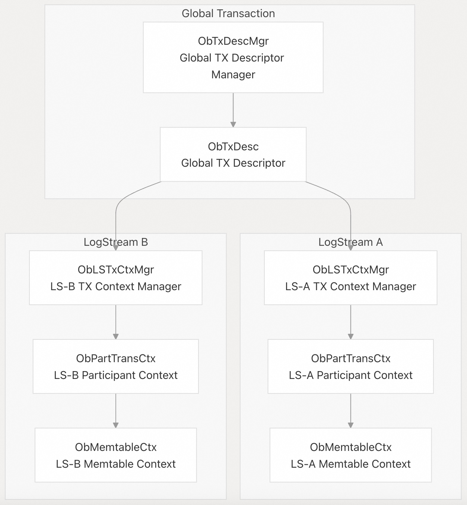

## 体系化剖析开源OB代码: 3.1 事务管理            
                        
### 作者                
digoal                
                        
### 日期                  
2025-10-14                      
                 
### 标签                      
PostgreSQL , PolarDB , DuckDB , MySQL , OceanBase                 
                       
----                   
                   
## 背景         
本文介绍 OceanBase 的分布式事务管理系统，该系统使用两阶段提交协议在分布式架构中提供 ACID 保证。该系统管理事务生命周期，维护多个 LogStream (LS) 之间的一致性，并与存储引擎集成以确保数据完整性。  
  
## 核心架构  
OceanBase 的事务管理基于分布式架构，事务可以跨越多个 LogStream。系统采用`协调者-参与者(coordinator-coordinator)模型`，分布式事务采用两阶段提交(2PC)，本地事务优化为单阶段提交。  
  
### 事务服务架构  
  
  
  
**源文件:**  
- https://github.com/oceanbase/oceanbase/blob/8e2580cf/src/storage/tx/ob_trans_service.h#L9-L500
- https://github.com/oceanbase/oceanbase/blob/8e2580cf/src/storage/tx/ob_trans_part_ctx.h#L154-L187
- https://github.com/oceanbase/oceanbase/blob/8e2580cf/src/storage/tx/ob_trans_ctx_mgr_v4.h#L158-L204
- https://github.com/oceanbase/oceanbase/blob/8e2580cf/src/storage/tx/ob_trans_define_v4.h#L413-L461
  
## 事务的生命周期和状态管理  
OceanBase 中的事务遵循一个定义明确的状态机，覆盖本地事务和分布式事务场景。系统在调度器(coordinator)级别（`ObTxDesc`）和参与者(coordinator)级别（`ObPartTransCtx`）跟踪事务状态。  
  
### 事务状态图  
  
  
  
**源文件:**  
- https://github.com/oceanbase/oceanbase/blob/8e2580cf/src/storage/tx/ob_trans_define_v4.h#L574-L589
- https://github.com/oceanbase/oceanbase/blob/8e2580cf/src/storage/tx/ob_trans_service_v4.cpp#L168-L214
- https://github.com/oceanbase/oceanbase/blob/8e2580cf/src/storage/tx/ob_tx_api.cpp#L284-L365
  
### 关键事务状态  
参考代码： `src/storage/tx/ob_trans_define_v4.h`   
  
关键事务状态表  
  
状态	| 描述	| 代码参考  
`IDLE` | 	事务描述符已分配但尚未启动	  
`ACTIVE` | 	活跃事务正在积极处理操作	  
`IN_TERMINATE` | 	正在进行两阶段提交或回滚	  
`COMMITTED` | 	事务已成功提交	  
`ABORTED` | 	由于冲突或错误，事务中止	  
  
**源文件:**  
- https://github.com/oceanbase/oceanbase/blob/8e2580cf/src/storage/tx/ob_trans_define_v4.h#L574-L589
  
## 两阶段提交协议  
OceanBase 实现了分布式两阶段提交协议，以保证跨多个 LogStream 的 ACID 特性。系统会自动选择本地事务的单阶段优化和分布式事务的完全 2PC 提交。  
  
### 2PC 协调员和参与者(coordinator-coordinator)  
  
  
  
**源文件:**  
- https://github.com/oceanbase/oceanbase/blob/8e2580cf/src/storage/tx/ob_trans_part_ctx.cpp#L754-L865
- https://github.com/oceanbase/oceanbase/blob/8e2580cf/src/storage/tx/ob_two_phase_committer.h#L50-L150
  
### 事务提交决策过程  
提交过程在 `ObPartTransCtx::commit()` 中遵循以下步骤：  
- 选择参与者：通过 `decide_tx_commit_info_()` 确定协调员和参与者  
- 选择协议：选择单阶段（one_phase_commit_()）或两阶段（two_phase_commit()）  
- 分配协调员：作为性能考量, 优先选择本地参与者作为协调员  
- 状态管理：2PC 提交过程中将事务状态转换为 `IN_TERMINATE`   
  
**源文件:**  
- https://github.com/oceanbase/oceanbase/blob/8e2580cf/src/storage/tx/ob_trans_part_ctx.cpp#L754-L865
- https://github.com/oceanbase/oceanbase/blob/8e2580cf/src/storage/tx/ob_trans_service_v4.cpp#L624-L651
  
## 事务上下文管理  
系统在全局级别（`ObTxDesc`）和 per-LogStream 级别（`ObPartTransCtx`）维护事务上下文。上下文管理器负责处理事务上下文的创建、查找和清理。  
  
### 上下文管理器的层次结构  
  
  
  
**源文件:**  
- https://github.com/oceanbase/oceanbase/blob/8e2580cf/src/storage/tx/ob_trans_ctx_mgr_v4.h#L158-L204
- https://github.com/oceanbase/oceanbase/blob/8e2580cf/src/storage/tx/ob_trans_part_ctx.h#L154-L320
  
### 上下文创建和生命周期  
当事务首次访问 LogStream 中的数据时，会按需创建事务上下文。`ObLSTxCtxMgr::create_tx_ctx_()` 方法创建上下文时, 用到以下参数：  
- 事务 ID：集群中的唯一标识符  
- LogStream ID：参与者的目标 LogStream  
- 协调员信息：地址和会话信息详情  
- 超时设置：事务和语句超时值  
- 隔离级别：ACID 隔离要求  
  
**源文件:**  
- https://github.com/oceanbase/oceanbase/blob/8e2580cf/src/storage/tx/ob_trans_ctx_mgr_v4.cpp#L278-L350
  
## 与存储层集成  
事务管理与 OceanBase 的存储层紧密集成, 通过几个关键组件来确保数据一致性和持久性。  
  
### 存储集成架构  
  
  
  
**源文件:**  
- https://github.com/oceanbase/oceanbase/blob/8e2580cf/src/storage/tx/ob_trans_part_ctx.h#L215-L275
- https://github.com/oceanbase/oceanbase/blob/8e2580cf/src/storage/tx/ob_ctx_tx_data.h#L50-L120
  
### 事务状态持久化  
系统通过多种机制来持久化事务状态：  
- 事务日志：通过 `ObTxLog` 类型保持 `redo`、`prepare`、`commit`和`abort` 事务日志状态信息  
- 事务数据：为了读取一致性而存储的commit信息存储于 `ObTxTable`  
- Memtable 集成：活跃事务状态维护在 `ObMemtableCtx`  
  
这些组件之间通过 `ObPartTransCtx` 协调确保数据持久性和可恢复性。  
  
**源文件:**  
- https://github.com/oceanbase/oceanbase/blob/8e2580cf/src/storage/tx/ob_tx_log.h#L39-L100
- https://github.com/oceanbase/oceanbase/blob/8e2580cf/src/storage/tx/ob_ctx_tx_data.h#L50-L120
  
## 高级事务功能  
### 事务隔离级别  
OceanBase 支持所有四种标准 SQL 隔离级别，并分别有具体的实现策略：  
  
隔离级别	| 枚举值	| 实现策略  
---|---|---  
读取未提交	| `ObTxIsolationLevel::RU`	| 最小锁定，允许脏读  
读已提交	| `ObTxIsolationLevel::RC`	| 语句级一致性，默认模式  
可重复读	| `ObTxIsolationLevel::RR`	| 事务级一致性  
可串行化	| `ObTxIsolationLevel::SERIAL`	| 严格可串行化执行  
  
**源文件:**  
- https://github.com/oceanbase/oceanbase/blob/8e2580cf/src/storage/tx/ob_trans_define_v4.h#L174-L181
  
### Savepoints 和 回滚  
系统通过 `ObTxSavePoint` 捕获特定点的事务状态的对象支持 SQL Savepoints：  
  
  
  
**源文件:**  
- https://github.com/oceanbase/oceanbase/blob/8e2580cf/src/storage/tx/ob_trans_define_v4.h#L417-L461
  
### XA 事务支持  
OceanBase 支持 XA（eXtended Architecture）事务，用于跨不同资源管理器进行分布式事务处理。XA 事务使用 `ObXATransID` 作为标识符并与 2PC 协议进行集成。  
  
**源文件:**  
- https://github.com/oceanbase/oceanbase/blob/8e2580cf/src/storage/tx/ob_xa_define.h#L50-L150
- https://github.com/oceanbase/oceanbase/blob/8e2580cf/src/storage/tx/ob_trans_part_ctx.h#L232-L243
  
### Transaction Free(事务解绑/事务无关) Route Optimization  
Transaction Free 路由功能允许事务在不同的 observer node 上执行, 从而优化分布式 SQL 执行，很多情况下不需要进行事务状态迁移。  
  
**源文件:**  
- https://github.com/oceanbase/oceanbase/blob/8e2580cf/src/storage/tx/ob_tx_free_route.cpp#L50-L200
- https://github.com/oceanbase/oceanbase/blob/8e2580cf/src/storage/tx/ob_tx_free_route_state.cpp#L1-L50
       
#### [期望 PostgreSQL|开源PolarDB 增加什么功能?](https://github.com/digoal/blog/issues/76 "269ac3d1c492e938c0191101c7238216")
  
  
#### [PolarDB 开源数据库](https://openpolardb.com/home "57258f76c37864c6e6d23383d05714ea")
  
  
#### [PolarDB 学习图谱](https://www.aliyun.com/database/openpolardb/activity "8642f60e04ed0c814bf9cb9677976bd4")
  
  
#### [PostgreSQL 解决方案集合](../201706/20170601_02.md "40cff096e9ed7122c512b35d8561d9c8")
  
  
#### [德哥 / digoal's Github - 公益是一辈子的事.](https://github.com/digoal/blog/blob/master/README.md "22709685feb7cab07d30f30387f0a9ae")
  
  
#### [About 德哥](https://github.com/digoal/blog/blob/master/me/readme.md "a37735981e7704886ffd590565582dd0")
  
  

  
