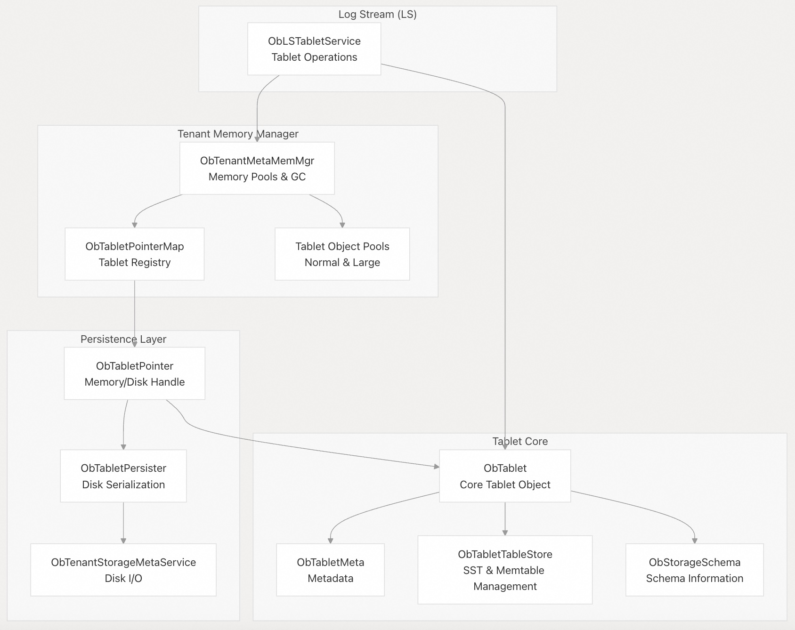
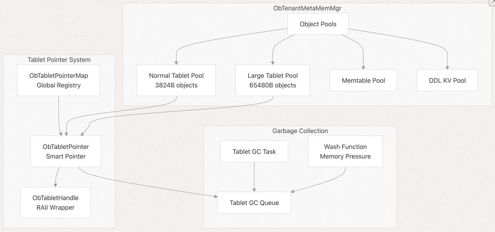
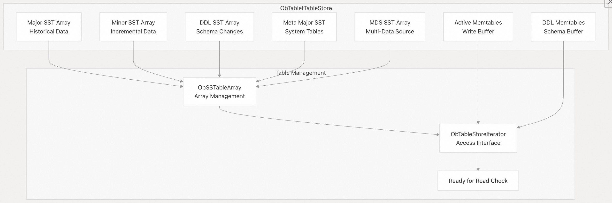

## 体系化剖析开源OB代码: 3.2 Tablet 管理系统              
                          
### 作者                  
digoal                  
                          
### 日期                    
2025-10-14                        
                   
### 标签                        
PostgreSQL , PolarDB , DuckDB , MySQL , OceanBase                   
                         
----                     
                     
## 背景           
本文介绍 OceanBase 中的 Tablet 管理系统，该系统负责处理数据分片（称为 Tablet）的生命周期、持久化和内存管理。Tablet 是基础存储单元，包含用于写入的活跃内存表 (memtable) 和用于存储历史数据的持久化表 SSTable。  
  
## 概述  
Tablet 管理系统负责：  
- Tablet 生命周期：创建、更新和删除数据分片(Tablet)  
- 内存管理：有效管理在内存中的 tablet 元数据和对象  
- 持久性：负责 tablet 在 `写入/读取` 持久化存储过程中的序列化和反序列化  
- 表存储管理：组织每个 Tablet 中的 SSTable 和 memtable  
- 访问控制：通过 pointer handles 提供对 tablet 的线程安全访问  
  
该系统在日志流 (LS/Log Streams) 环境中运行，其中每个 LS 包含代表不同数据分片的多个 tablet。  
  
## 核心架构  
Tablet 管理系统由几个协同工作的关键组件组成：  
  
    
  
## Tablet 生命周期管理  
Tablet 会经历几个生命周期状态，这些状态由 `ObLSTabletService` 管理：  
  
    
  
### Tablet 的创建  
Tablet 通过多种路径生成：  
  
代码见: src/storage/ls/ob_ls_tablet_service.cpp    
  
1、首次创建：  
- `init_for_first_time_creation()` 负责初始化一个全新的 Tablet  
- 如果有必要，创建空的 major SSTable  
- 设置初始元数据和 schema  
  
2、迁移时创建：  
- `migrate_create_tablet()` 负责在数据迁移期间创建 Tablet  
- 使用 `ObMigrationTabletParam` 重建 Tablet 状态  
  
3、转移时创建：  
- `create_transfer_in_tablet()` 负责在 LS 之间转移 Tablet  
  
### Tablet 的更新  
Tablet 会在压缩和合并操作期间进行更新：  
  
代码见: src/storage/tablet/ob_tablet.cpp    
  
合并更新：  
- `init_for_merge()` 在压缩(compaction)数据后创建新的 tablet 版本  
- 使用新的 SSTables 更新表存储  
- 保存 Tablet 元数据并调整版本  
  
### Tablet 的删除  
Tablet 的移除通过两阶段过程进行：  
  
1、逻辑删除：代码见: src/storage/ls/ob_ls_tablet_service.cpp  
- `remove_tablet()` 从活跃服务中移除 Tablet  
- 移至垃圾收集队列  
  
2、物理删除：代码见: src/storage/meta_mem/ob_tenant_meta_mem_mgr.cpp  
- `inner_remove_tablet()` 从内存管理中删除 Tablet  
- 释放所有相关资源  
  
## 内存管理架构  
Tablet 内存管理系统采用带有对象池(object pools)和引用计数器(reference counting)的分层方法：  
  
    
  
### 对象池管理  
系统为不同尺寸的 tablet 维护单独的池：  
  
普通池(Normal Pool)：src/storage/meta_mem/ob_tenant_meta_mem_mgr.h  
  
大池(Large Pool)：src/storage/meta_mem/ob_tenant_meta_mem_mgr.h  
  
池的选择逻辑: src/storage/meta_mem/ob_tenant_meta_mem_mgr.cpp  
```  
int ObTenantMetaMemMgr::choose_tablet_pool_type(  
    const bool is_user_tablet,  
    const int64_t must_cache_size,  
    const int64_t try_cache_size,  
    ObTabletPoolType &type)  
```  
  
### 引用计数  
Tablet 使用原子引用计数来确保内存安全：  
- `inc_ref()` 和 `dec_ref()` 代码见: src/storage/tablet/ob_tablet.h  
- 当引用计数降到零时自动清理 ( 类似PostgreSQL LRU中的sweep clock? )   
- 通过 `ObTabletHandle` 与 RAII 包装器(wrapper)集成  
  
### 垃圾回收  
该系统包括自动垃圾收集：  
- Tablet GC 定期清理任务：代码见: src/storage/meta_mem/ob_tenant_meta_mem_mgr.cpp  
- 内存压力：清洗功能在内存压力期间自动触发  
- 基于队列的处理, FIFO Tablet 清理模式：代码见: src/storage/meta_mem/ob_tenant_meta_mem_mgr.cpp  
  
## 表存储组织  
每个 tablet 都包含一个 `ObTabletTableStore` 组织其数据表：  
  
    
  
### 表存储组件  
表存储管理几种类型的表：  
  
1、Major SSTables：  
- Long-term historical data  
- Result of major compaction  
  
2、Minor SSTables：  
- Incremental changes between major compactions  
- Result of minor compaction  
  
3、DDL SSTables：  
- Schema change operations  
- Direct load operations  
  
4、Memtables：  
- Active write buffer in memory  
- Converted to minor SSTables during freeze  
  
扩展阅读:  
- [《AI论文解读 | The Log-Structured Merge-Tree (LSM-Tree)》](../202509/20250903_05.md)    
- [《数据库筑基课 - lsm-tree》](../202411/20241122_01.md)    
  
### 表存储更新  
表存储更新发生在压缩操作期间, 如：  
- 创建新的表存储  
- 替换 SSTable  
- 管理内存表  
  
代码见: src/storage/tablet/ob_tablet_table_store.cpp  
  
### Tablet 持久化  
持久化系统负责将 tablet 序列化到磁盘、将磁盘中的 tablet 反序列化并加载回内存：  
  
    
  
### 持久化操作  
`ObTabletPersister` 处理核心持久化操作：  
  
1、Tablet 转换：代码见: src/storage/Tablet/ob_tablet_persister.cpp  
- `persist_and_transform_tablet()` 将内存表示转换为磁盘格式  
- 处理不同的持久化上下文（private, shared, etc.）  
  
2、序列化：代码见: src/storage/tablet/ob_tablet.cpp  
- `serialize()` 将 Tablet 数据写入缓冲区(buffer)  
- 包括所有组件地址和元数据  
  
3、反序列化：代码见: src/storage/tablet/ob_tablet.cpp  
- `load_deserialize()` 用磁盘中存储的数据重建 Tablet  
- `deserialize_post_work()` 完成加载过程  
  
### 地址管理  
Tablet 对其组件使用复杂的寻址：  
- Tablet 地址：指向 major Tablet 数据  
- 表存储 地址：表存储数据的引用  
- 存储 schema 地址：对 schema 信息的引用  
- 宏信息 地址：引用宏块信息地址  
  
### 持久化上下文  
支持不同的持久化上下文：  
- 私有存储：标准的本地存储持久性  
- 共享存储：具有不同寻址的共享存储模式  
- 传输操作：Tablet 迁移期间的特殊处理  
  
## 集成点  
Tablet 管理系统与 OceanBase 的其他几个组件集成：  
  
### 事务系统集成  
- 事务上下文：Tablet 参与分布式事务  
- MVCC 支持：表存储为 MVCC 读取维护多个版本  
- 锁管理：与锁内存表集成，实现行级锁  
  
### schema 管理集成  
存储 schema：每个 Tablet 都维护其存储 schema  
schema 版本：Tablet跟踪模式随时间的变化  
DDL 操作：针对 schema 更改操作的特殊处理  
  
### 压缩集成  
- Medium 信息：Tablets 压缩调度信息  
- 合并操作：major/minor tablet 压缩(compaction)期间的表存储更新  
- compaction 历史：跟踪已完成的 compaction 操作  
  
### 高可用性集成  
- 迁移支持：迁移期间的 Tablet 创建和更新  
- 备份/恢复：Tablet 持久化存储支持备份操作  
- 传输操作：在日志流(LS)之间移动 Tablet  
    
#### [期望 PostgreSQL|开源PolarDB 增加什么功能?](https://github.com/digoal/blog/issues/76 "269ac3d1c492e938c0191101c7238216")
  
  
#### [PolarDB 开源数据库](https://openpolardb.com/home "57258f76c37864c6e6d23383d05714ea")
  
  
#### [PolarDB 学习图谱](https://www.aliyun.com/database/openpolardb/activity "8642f60e04ed0c814bf9cb9677976bd4")
  
  
#### [PostgreSQL 解决方案集合](../201706/20170601_02.md "40cff096e9ed7122c512b35d8561d9c8")
  
  
#### [德哥 / digoal's Github - 公益是一辈子的事.](https://github.com/digoal/blog/blob/master/README.md "22709685feb7cab07d30f30387f0a9ae")
  
  
#### [About 德哥](https://github.com/digoal/blog/blob/master/me/readme.md "a37735981e7704886ffd590565582dd0")
  
  

  
