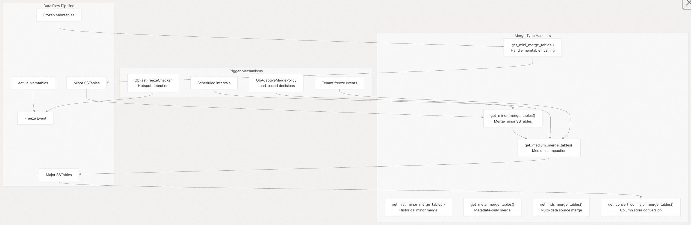
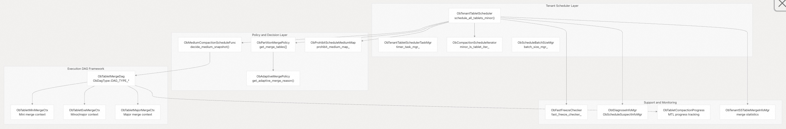
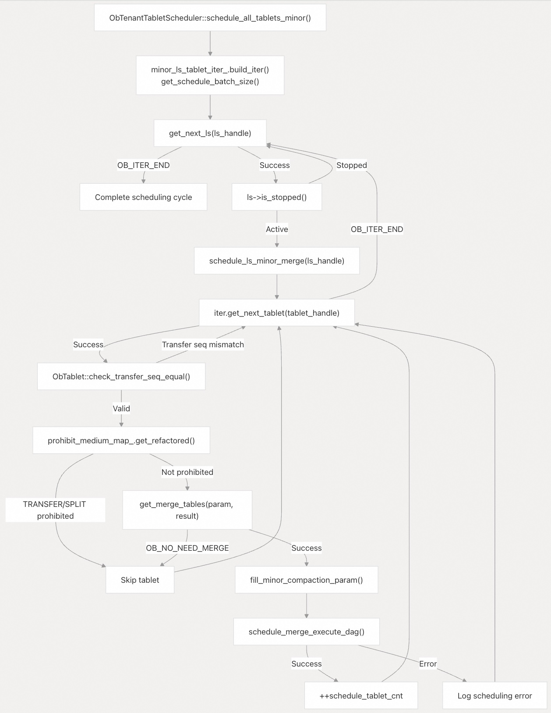
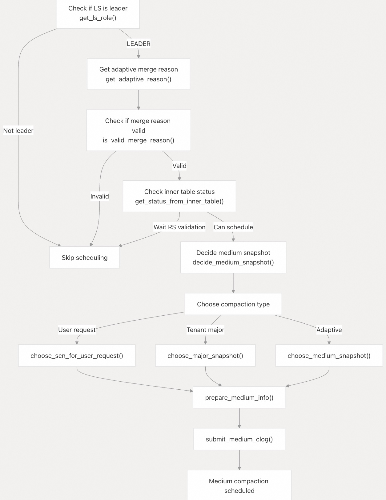
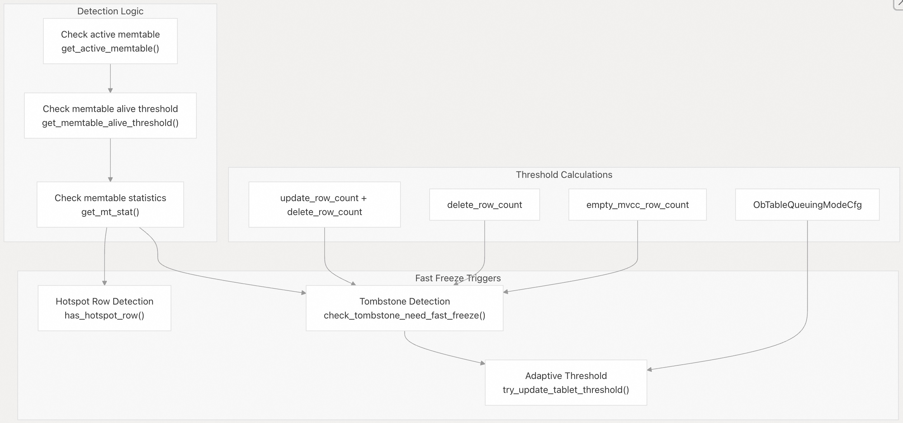
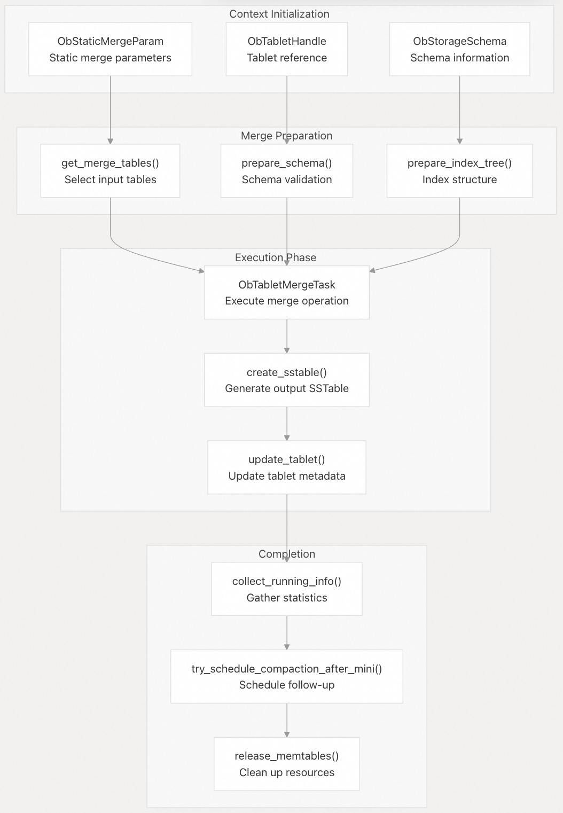
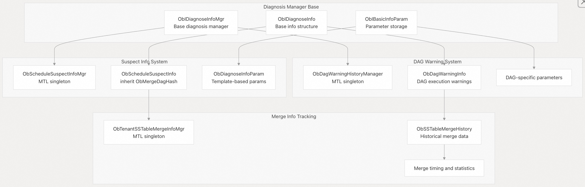

## 体系化剖析开源OB代码: 3.3 存储压缩(Compaction)               
                            
### 作者                    
digoal                    
                            
### 日期                      
2025-10-14                          
                     
### 标签                          
PostgreSQL , PolarDB , DuckDB , MySQL , OceanBase                     
                           
----                       
                       
## 背景             
OceanBase 中的存储压缩(Compaction)是一个关键的后台进程，它通过将多个 SSTable 文件合并为更少、更高效的文件来优化数据存储布局和性能。可阅读LSM-Tree相关论文. 该系统管理各种类型的压缩操作，包括mini, minor, major, medium compactions，每种压缩操作都服务于不同的优化目标。压缩系统负责跨 Tablet 合并操作的调度、执行和监控，同时保持数据一致性和系统性能。  
  
## 压缩类型和概述  
OceanBase 实现了 `ObPartitionMergePolicy::get_merge_tables` 函数数组中定义的几种类型的 compaction 操作，分别针对不同的存储优化场景：  
  
### Merge Type 函数映射  
压缩系统使用函数指针数组根据类型选择(调度)合并操作：  
  
    
  
## 系统架构  
压缩系统遵循分层架构，调度、策略决策和执行之间有明确的分离：  
  
### 核心组件架构  
  
    
  
### 压缩调度流程  
  
    
  
## 关键类及职责  
  
### 调度组件  
类	| 主要职责	| 主要方法  
---|---|---  
`ObTenantTabletScheduler` | 	主压缩调度和协调	| `schedule_all_tablets_minor()`，`update_upper_trans_version_and_gc_sstable()`，`schedule_merge()`  
`ObMediumCompactionScheduleFunc` | 	Medium 压缩调度逻辑	| `schedule_next_medium_for_leader()`，`decide_medium_snapshot()`，`choose_medium_snapshot()`  
`ObFastFreezeChecker` | 	检测需要快速冷冻的情况	| `check_need_fast_freeze()`，`check_hotspot_need_fast_freeze()`  
`ObProhibitScheduleMediumMap` | 	管理禁止 Medium 压缩的 tablets	| `add_flag()`，`batch_add_flags()`，`clear_flag()`  
  
### Merge Policy  
类	| 主要职责	| 主要方法  
---|---|---  
`ObPartitionMergePolicy` | 	确定要合并的表 | 	`get_medium_merge_tables()`，`get_minor_merge_tables()`，`get_mini_merge_tables()`  
`ObAdaptiveMergePolicy` | 	自适应压缩策略 | 	`get_meta_merge_tables()`，`get_adaptive_merge_reason()`  
`ObGetMergeTablesResult` | 	合并表结果 | 	`handle_`, `version_range_`, `scn_range_`  
  
### 执行框架  
类	| 主要职责	| 主要方法  
---|---|---  
`ObTabletMergeDag` | 	merge execution DAG 框架	| `init_by_param()`，`fill_dag_key()`，`create_first_task()`  
`ObBasicTabletMergeCtx` | 	Tablets 合并的基本上下文 | 	`prepare_schema()`，`create_sstable()`，`get_merge_tables()`  
`ObTabletMergeCtx` | 	标准 Tablets 合并上下文 |	`prepare_index_tree()`，`collect_running_info()`，`update_tablet()`  
`ObStaticMergeParam` | 	merge 操作的静态参数 |	`cal_minor_merge_param()`，`cal_major_merge_param()`  
  
## Medium 压缩调度  
中度压缩是介于 minor 压缩和 major 压缩之间的关键优化层。其调度过程涉及复杂的决策：  
  
    
  
## 快速冻结(Freeze)检测机制  
快速冻结机制检测出需要立即冻结内存表(memtable)以维持系统性能的情况：  
  
    
  
## 压缩执行上下文  
执行上下文管理压缩操作的整个生命周期：  
  
    
  
## 诊断和监测  
压缩系统包括全面的监控和诊断功能：  
  
### 诊断系统架构  
  
    
  
### 诊断组件  
  
组件	| 目的	| 主要方法  
---|---|---  
`ObScheduleSuspectInfoMgr`	| 跟踪可疑的调度问题 |	`add_suspect_info()`，`set_max()`，`gc_info()`  
`ObDagWarningHistoryManager`	| 	管理 DAG 执行警告	| `add_dag_warning_info()`，`delete_info()`  
`ObTenantSSTableMergeInfoMgr`	| 	跟踪 SSTable 合并统计数据	| `add_sstable_merge_info()`，`gc_info()`  
`ObTabletCompactionProgress`	| 	监控压缩进度	| `update_progress_status()`，`get_progress_info()`  
  
OceanBase 的存储压缩系统提供了一种强大的、多层次的存储优化方法，通过精心调度和执行各种类型的压缩来平衡性能、资源利用率和数据一致性。  
       
#### [期望 PostgreSQL|开源PolarDB 增加什么功能?](https://github.com/digoal/blog/issues/76 "269ac3d1c492e938c0191101c7238216")
  
  
#### [PolarDB 开源数据库](https://openpolardb.com/home "57258f76c37864c6e6d23383d05714ea")
  
  
#### [PolarDB 学习图谱](https://www.aliyun.com/database/openpolardb/activity "8642f60e04ed0c814bf9cb9677976bd4")
  
  
#### [PostgreSQL 解决方案集合](../201706/20170601_02.md "40cff096e9ed7122c512b35d8561d9c8")
  
  
#### [德哥 / digoal's Github - 公益是一辈子的事.](https://github.com/digoal/blog/blob/master/README.md "22709685feb7cab07d30f30387f0a9ae")
  
  
#### [About 德哥](https://github.com/digoal/blog/blob/master/me/readme.md "a37735981e7704886ffd590565582dd0")
  
  

  
