## 体系化剖析开源OB代码: 3.4 高可用(HA)与数据恢复系统               
                              
### 作者                      
digoal                      
                              
### 日期                        
2025-10-14                            
                       
### 标签                            
PostgreSQL , PolarDB , DuckDB , MySQL , OceanBase                       
                             
----                         
                         
## 背景               
本文介绍 OceanBase 的高可用性 (HA) 和数据恢复系统，该系统提供日志流(LS)迁移、Tablet group 恢复、物理数据复制以及全面的调试(debug)基础架构(Infra)等机制。这些系统通过基于 DAG(有向无环图) 的协调工作流来处理跨分布式集群的迁移、恢复和传输操作，从而确保数据的持久性和可用性。  
  
HA 系统主要包括这几点: 以 `ObStorageHATabletsBuilder` 创建/更新 Tablet、`ObMigrationDagNet` 迁移工作流、`ObTabletGroupRestoreDagNet` 实现恢复操作以及用于测试和验证的广泛调试(debug)同步点。  
  
## 系统架构  
OceanBase 的 HA 和数据恢复系统围绕基于 DAG 的工作流构建，通过专门的管理器类协调 tablet 的构建、迁移和恢复操作。  
  
### HA核心架构  
  
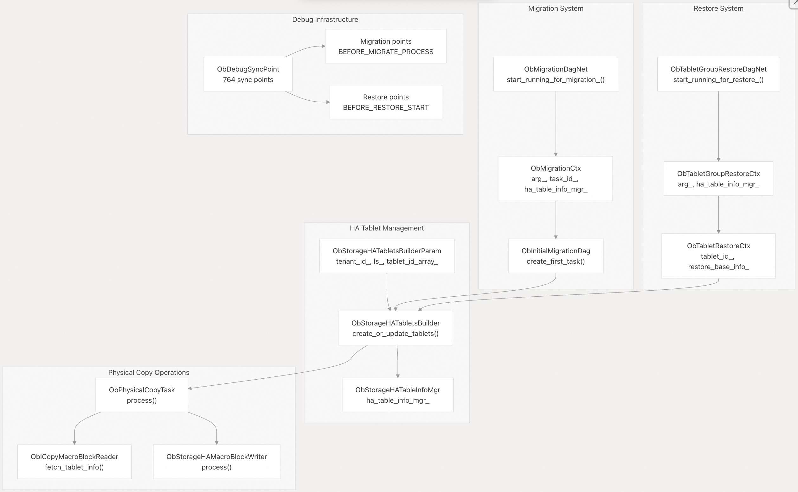  
  
### 关键组件  
组件	| 目的	| 主要方法	| 源文件位置  
---|---|---|---  
`ObStorageHATabletsBuilder` |	在 HA 操作期间创建/更新 tablet	| `create_or_update_tablets()`，`build_tablets_sstable_info()`	| src/storage/high_availability/ob_storage_ha_tablet_builder.h    
`ObMigrationDagNet` |	协调迁移工作流程	| `start_running_for_migration_()`，`clear_dag_net_ctx()` | 	 src/storage/high_availability/ob_ls_migration.h    
`ObTabletGroupRestoreDagNet` |	管理恢复操作	| `start_running_for_restore_()`，`init_by_param()` |	 src/storage/high_availability/ob_tablet_group_restore.h  
`ObPhysicalCopyTask` |	在存储之间传输宏块 |	`fetch_macro_block_with_retry_()`，`process()`	  | src/storage/high_availability/ob_physical_copy_task.h  
`ObBackupSetTaskMgr` |	协调备份操作 |	`process()`，`backup_sys_meta_()`	  | src/rootserver/备份/ob_backup_data_set_task_mgr.h  
`Debug Sync Framework`	| 使用 764 个同步点的testing Infra	 | `DEBUG_SYNC()` |	 src/share/ob_debug_sync_point.h  
  
## 传输(Transfer)操作  
传输操作在同一集群内的日志流之间移动 Tablet，由 `ObTransferHandler` 管理。  
  
### 传输处理程序状态机  
  
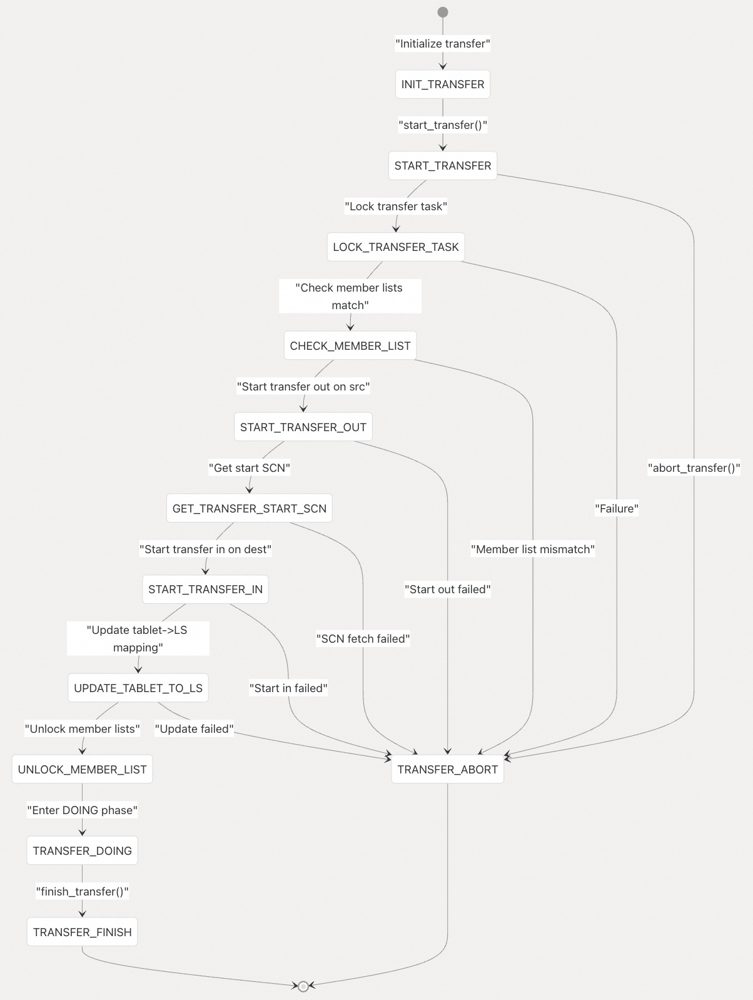  
  
### 传输流程实施  
`ObTransferHandler` 协调程序通过以下主要方法完成 Tablet 传输：  
  
方法	| 目的	| 错误处理  
---|---|---  
`start_transfer()` | 	启动转移流程	| 失败时返回 `INIT`  
`process_start_transfer_()` | 	执行启动逻辑	| 错误时调用 `abort_transfer()`  
`process_doing_transfer_()` | 	处理正在进行的传输	| 遇到允许重试的错误时进行重试  
`finish_transfer()` | 	完成传输	| 将状态更新为“成功”  
`abort_transfer()` | 	取消传输	| 清理状态  
  
  
## 恢复过程  
恢复过程遵循由 `ObLSRestoreHandler` 管理的明确定义的状态机。  
  
### Tablet group 恢复状态机  
  
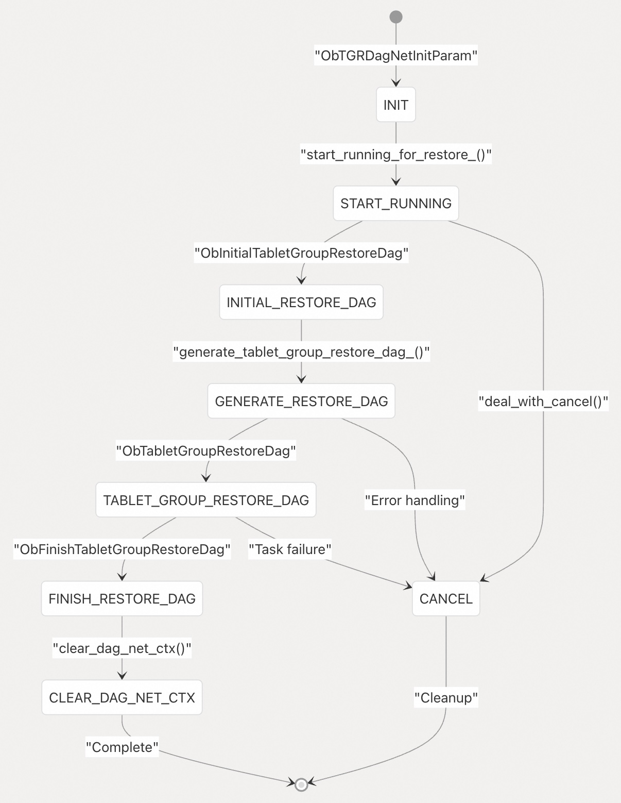  
  
### Tablet 恢复上下文管理  
恢复过程通过跟踪 Tablet 状态和恢复进度的专门类来管理上下文：  
  
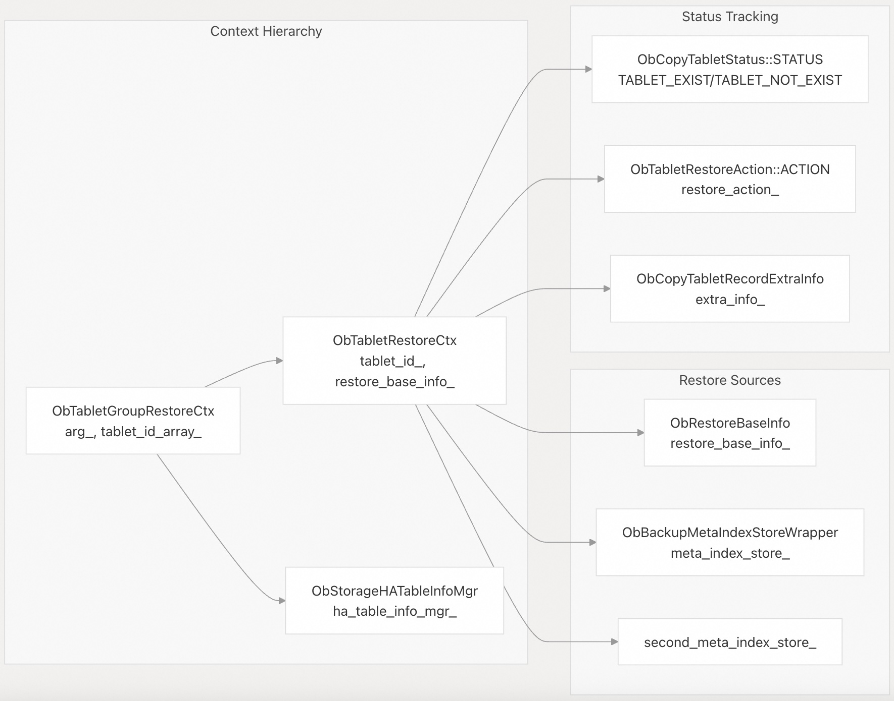  
  
### 备份集成和数据源  
恢复系统与备份基础架构(backup Infra)集成，从外部存储中获取 Tablet 元数据和数据：  
  
组件 |	目的	| 关键操作  
---|---|---  
`ObBackupMetaIndexStoreWrapper` | 	管理备份元数据的索引	| `init()`，`get_backup_meta_index()`  
`ObCopyTabletInfoRestoreReader` | 	从备份中读取 Tablet 信息	| `init()`，`fetch_tablet_info()`  
`ObCopySSTableInfoRestoreReader` | 	从备份中读取 sstable 信息	| `get_next_tablet_sstable_header()`  
`ObCopyMacroBlockRestoreReader` | 	从备份中读取宏块	| `get_next_macro_block()`  
  
## 迁移过程  
OceanBase 通过 `ObLSMigrationHandler` 和 DAG 框架在 OceanBase 服务器之间迁移整个日志流(LogStream)。  
  
### 迁移操作类型  
  
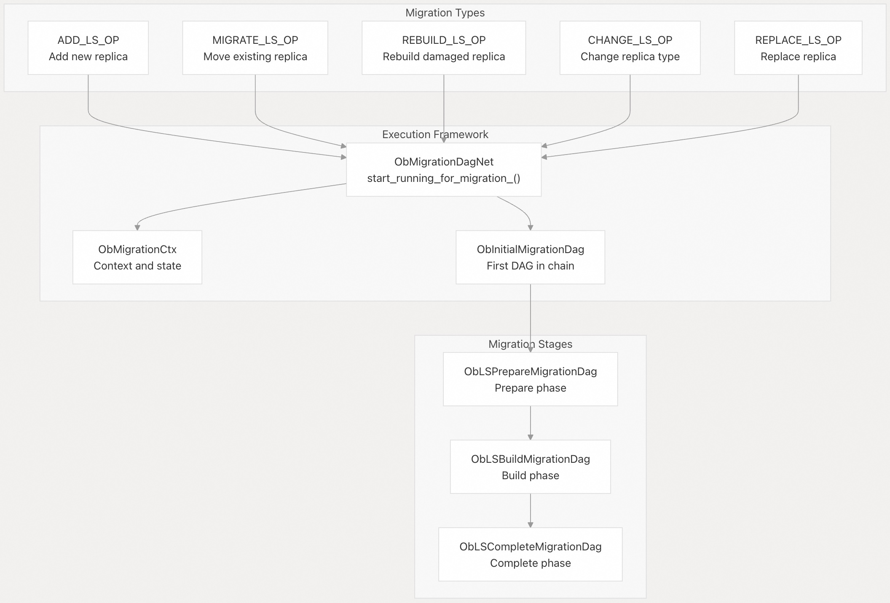  
  
### 迁移上下文和状态管理  
`ObMigrationCtx` 跟踪迁移状态并提供跨 DAG 操作的上下文：  
  
Field	| 目的	 |  参数来源  
---|---|---  
`arg_` | 	迁移参数（`ls_id、type、src、dst`） |	`ObMigrationOpArg`  
`local_clog_checkpoint_scn_` | 	本地检查点位置	| `Palf`  
`src_ls_rebuild_seq_` | 	源重建序列	| 远程 LS  
`ha_table_info_mgr_` | 	在迁移期间管理表元数据	| `ObStorageHATableInfoMgr`  
`tablet_group_mgr_` | 	将 Tablets 分组以便高效处理	| `ObStorageHATabletGroupMgr`  
  
### 迁移期间的 Tablet 构建  
`ObStorageHATabletsBuilder` 处理迁移操作期间的 tablet 创建和更新：  
  
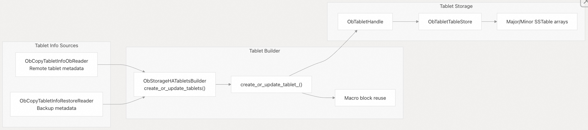  
  
## 重建(rebuild)服务  
`ObRebuildService` 检测并协调整个集群的数据不一致。  
  
### 重建检测和处理  
  
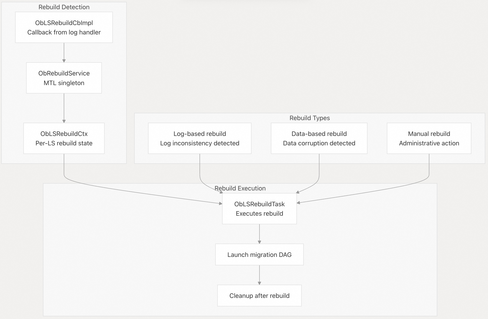  
  
## 物理复制机制  
物理复制使用 `ObPhysicalCopyTask` 在存储位置之间传输宏块。  
  
### 复制任务架构  
  
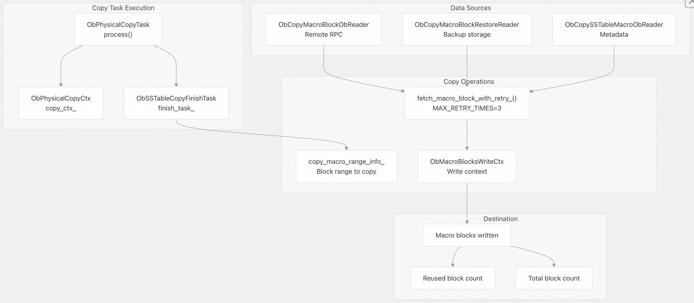  
  
### 复制任务重试逻辑  
复制过程通过重试机制实现了强大的错误处理：  
  
重试场景	| 最大重试次数	| 重试间隔	 | 错误类型  
---|---|---|---  
`fetch_macro_block_with_retry_()` | 	3次尝试	| 重试之间休眠	| 网络、I/O 错误  
`get_remote_logical_sstable_meta_()` | 	内置 RPC 重试	 | Exponential	| RPC 超时  
`read_backup_macro_block_data_()` | 	内置备份重试	| 固定间隔	| 备份存储错误  
  
## 存储 RPC 接口  
HA 操作依赖 `ObStorageRpc` 进行远程数据访问和协调。  
  
### 存储 RPC 操作  
  
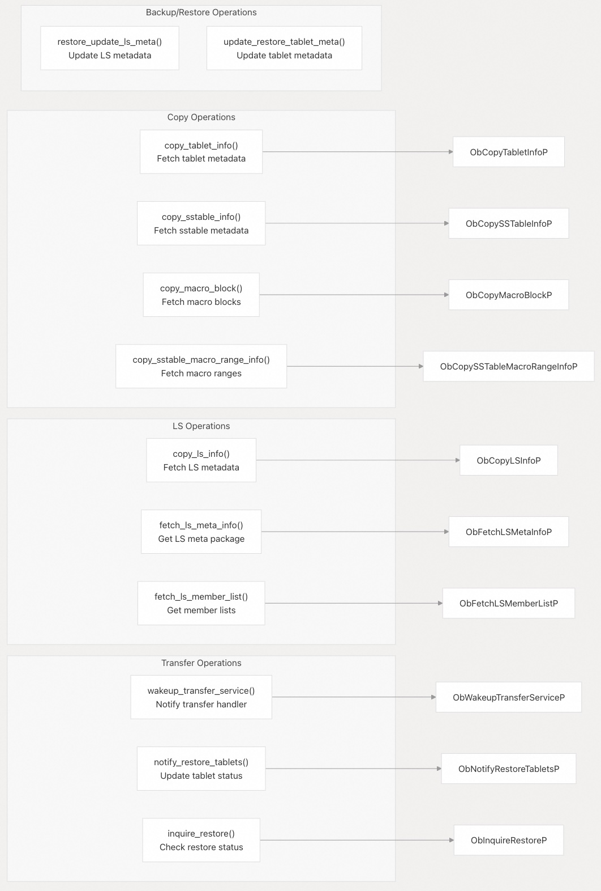  
  
### RPC 参数结构  
HA 操作中使用的关键 RPC 参数结构(struct)：  
  
RPC 操作	| 参数结构	| 关键字段  
---|---|---  
`copy_tablet_info` | 	`ObCopyTabletInfoArg`	| `tenant_id_`，`tablet_id_list_`，`need_check_seq_`，`ls_id_`  
`copy_macro_block` | 	`ObCopyMacroBlockListArg`	|	`tenant_id_`，`table_key_`，`arg_list_`，`ls_id_`  
`fetch_ls_meta_info` | 	`ObFetchLSMetaInfoArg`	|	`tenant_id_`，`version_`，`ls_id_`  
`notify_restore_tablets` | 	`ObNotifyRestoreTabletsArg`	|	`tenant_id_`，`tablet_id_array_`，`restore_status_`，`ls_id_`  
  
## 错误处理和恢复  
HA 操作通过多层实现全面的错误处理。  
  
### HA 上下文错误管理  
  
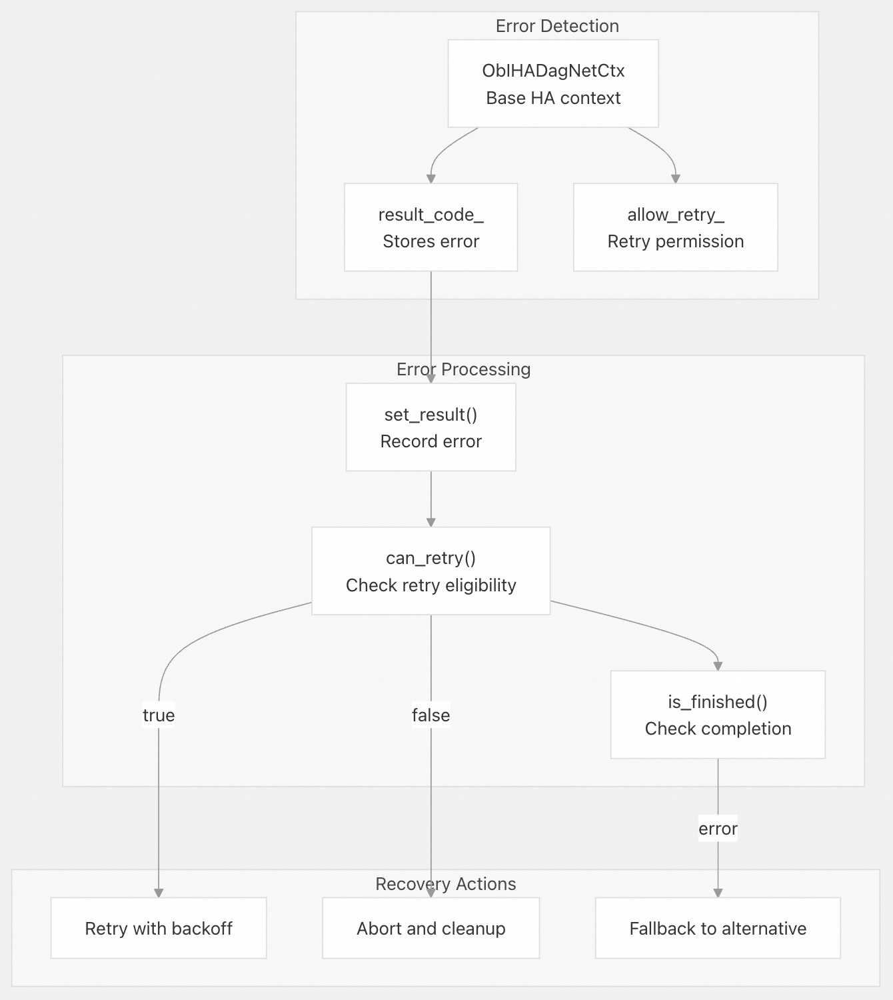  
  
### 迁移状态转换  
迁移状态遵循 `ObMigrationStatusHelper` 中明确定义的故障状态转换：  
  
当前状态	| 故障状态	| 故障恢复行动  
---|---|---  
`OB_MIGRATION_STATUS_ADD` | 	`OB_MIGRATION_STATUS_ADD_FAIL` | 	清理并重试  
`OB_MIGRATION_STATUS_MIGRATE` | 	`OB_MIGRATION_STATUS_MIGRATE_FAIL` | 	恢复原始状态  
`OB_MIGRATION_STATUS_REBUILD` | 	`OB_MIGRATION_STATUS_REBUILD_FAIL` | 	需要人工干预  
`OB_MIGRATION_STATUS_CHANGE` | 	`OB_MIGRATION_STATUS_NONE` | 	恢复正常状态  
  
### Tablet 状态恢复  
在 HA 操作期间，tablet 可能处于需要恢复的不一致状态：  
  
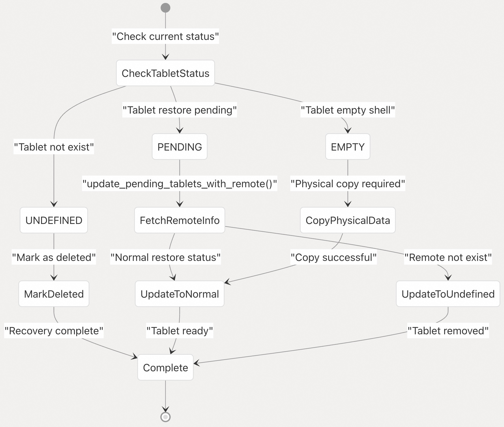  
  
## 调试同步基础设施(Debug Synchronization Infrastructure)  
OceanBase 提供了 764 个调试同步点，用于对 HA 操作进行全面的测试和调试，以 `ObDebugSyncPoint` 枚举形式定义。  
  
调试同步点类别, 参考代码: src/share/ob_debug_sync_point.h    
  
这部分可参考: [《何为MySQL 调试同步基础设施(Debug Synchronization Infrastructure)?》](../202510/20251014_12.md)    
  
### HA 操作中的调试同步使用情况  
调试同步系统在整个 HA 代码中被广泛用于测试特定场景：  
  
同步点	| 使用位置	| 测试目的  
---|---|---  
`AFTER_MIGRATION_FETCH_TABLET_INFO`	| `ob_storage_ha_tablet_builder.cpp` | 测试 tablet 信息获取失败  
`BEFORE_PREPARE_MIGRATION_TASK`	| `ob_ls_migration.cpp` | 在迁移准备之前注入错误  
`BEFORE_RESTORE_START`	| 多个恢复位置	| 控制恢复过程时间  
`BEFORE_BACKUP_META` | 	`ob_backup_data_set_task_mgr.cpp` |  测试备份元数据操作  
`START_TRANSFER_TRANS` |	Transfer 处理程序中 	| 测试转移交易协调  
  
### 调试同步实现模式(pattern)  
调试同步基础设施在 HA 操作中遵循一致的模式(pattern)：  
  
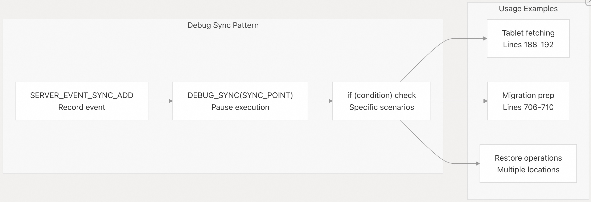  
  
### 调试同步给 HA 测试带来的好处  
广泛的调试同步可实现复杂的测试场景：  
- 故障注入：在特定点暂停以注入故障并测试错误处理  
- 竞争条件测试：控制并发 HA 操作之间的时间  
- 状态验证：在复杂操作期间暂停执行以检查中间状态  
- 性能分析：测量迁移/恢复工作流程中各个阶段的延迟  
- 集成测试：协调不同 HA 子系统之间的时间  
  
## 小结  
OceanBase 的高可用性和数据恢复系统提供了一个全面的框架，用于确保数据的持久性和可用性。该系统采用状态驱动的方法，并通过有向无环图 (DAG) 管理分阶段操作，以处理复杂的恢复和迁移场景。关键机制包括：  
- tablet 级修复，优先修复系统 tablet  
- 具有重试机制的物理块复制  
- 用于高效组织数据的表存储管理  
- 使用智能重试策略进行错误处理  
  
这些机制协同工作，即使在遇到硬件故障或其他灾难性事件时也能提供强大的数据保护。  
    
#### [期望 PostgreSQL|开源PolarDB 增加什么功能?](https://github.com/digoal/blog/issues/76 "269ac3d1c492e938c0191101c7238216")
  
  
#### [PolarDB 开源数据库](https://openpolardb.com/home "57258f76c37864c6e6d23383d05714ea")
  
  
#### [PolarDB 学习图谱](https://www.aliyun.com/database/openpolardb/activity "8642f60e04ed0c814bf9cb9677976bd4")
  
  
#### [PostgreSQL 解决方案集合](../201706/20170601_02.md "40cff096e9ed7122c512b35d8561d9c8")
  
  
#### [德哥 / digoal's Github - 公益是一辈子的事.](https://github.com/digoal/blog/blob/master/README.md "22709685feb7cab07d30f30387f0a9ae")
  
  
#### [About 德哥](https://github.com/digoal/blog/blob/master/me/readme.md "a37735981e7704886ffd590565582dd0")
  
  

  
