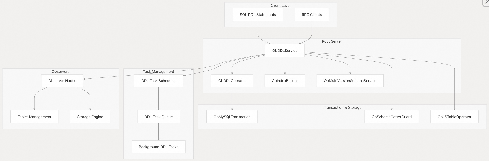
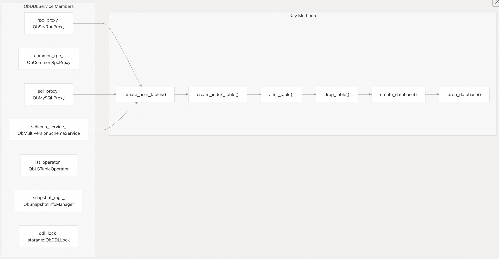
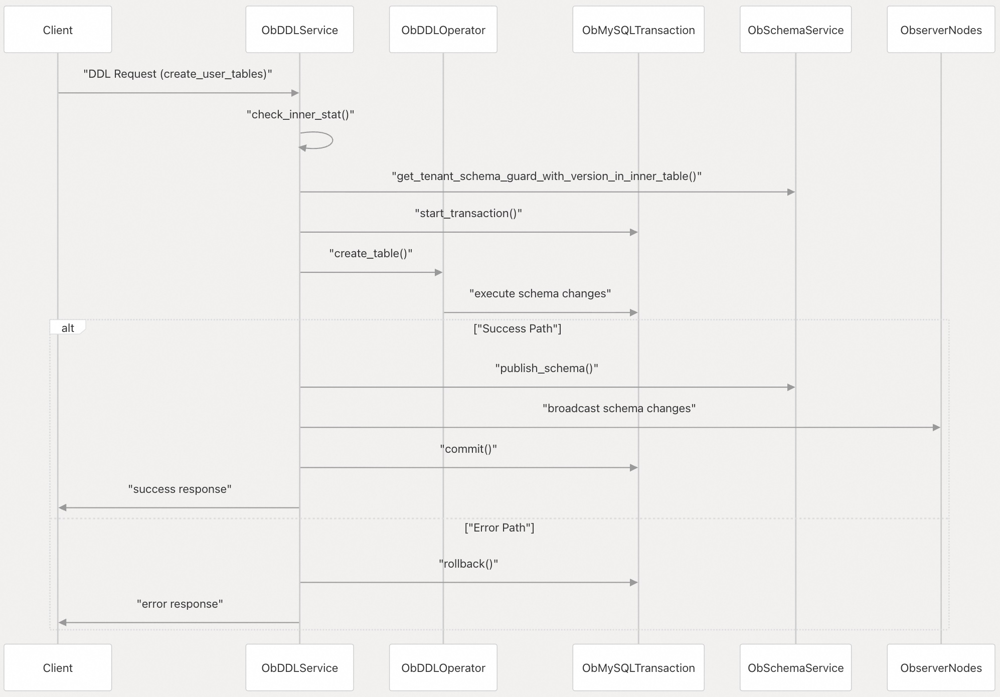
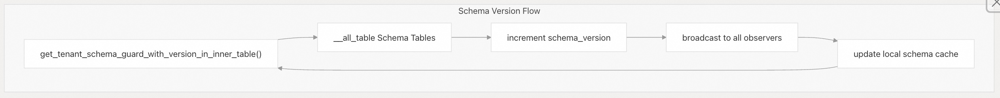
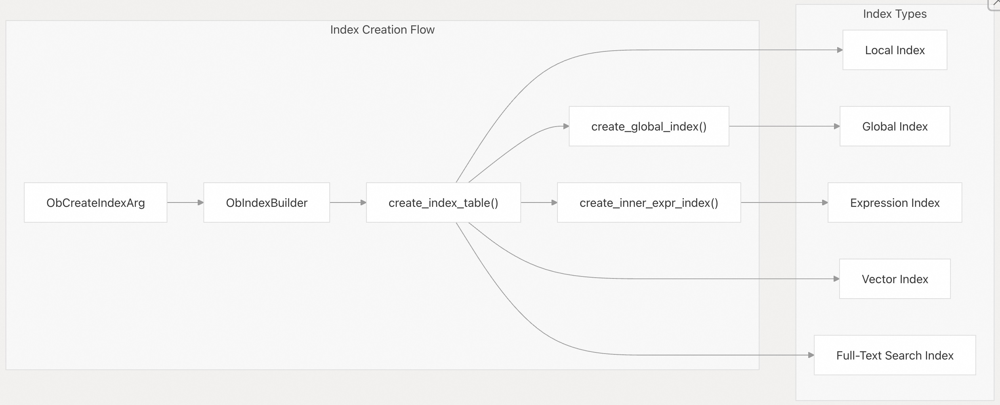
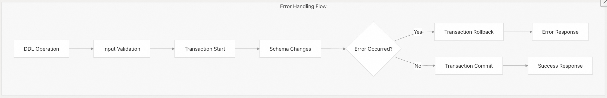

## 体系化剖析开源OB代码: 4.1 DDL 服务与操作                
                                
### 作者                        
digoal                        
                                
### 日期                          
2025-10-14                              
                         
### 标签                              
PostgreSQL , PolarDB , DuckDB , MySQL , OceanBase                         
                               
----                           
                           
## 背景                 
本文介绍 OceanBase 中的 DDL（数据定义语言）服务架构，该服务负责协调整个分布式数据库系统的 schema 变更。DDL 服务负责处理表创建、索引管理、数据库操作以及 schema 修改等操作。  
  
## 架构概述  
DDL 服务在根服务器(root server)上充当集中式协调器，负责处理 schema 变更请求并确保整个分布式集群的一致性。它与多个子系统集成，以处理可能跨越多个节点且需要协调的复杂操作。  
  
  
  
DDL 服务核心组件:  
  
**源文件:**  
- https://github.com/oceanbase/oceanbase/blob/8e2580cf/src/rootserver/ob_ddl_service.h#L99-L128
- https://github.com/oceanbase/oceanbase/blob/8e2580cf/src/rootserver/ob_ddl_service.cpp#L105-L146
  
## 核心组件  
### ObDDLService  
`ObDDLService` 类是所有 DDL 操作的主(main)入口点。它维护与基本服务的连接，并为每种类型的 schema 操作提供方法。  
  
  
  
`ObDDLService` 类结构:  
   
**源文件:**  
- https://github.com/oceanbase/oceanbase/blob/8e2580cf/src/rootserver/ob_ddl_service.h#L110-L127
- https://github.com/oceanbase/oceanbase/blob/8e2580cf/src/rootserver/ob_ddl_service.cpp#L119-L145

### RPC 集成  
DDL 操作通过 RPC 接口暴露给外部调用，允许远程执行 schema 变更。RPC 系统使用特定的数据包代码(packet codes)来识别不同的 DDL 操作。  
  
RPC 操作	| 数据包代码	| 描述  
---|---|---  
`OB_CREATE_TABLE` |	0x203	| 表创建操作  
`OB_DROP_TABLE` |	0x204	| 表删除操作  
`OB_ALTER_TABLE` |	0x205	| 表结构修改  
`OB_CREATE_INDEX` |	0x20E	| 索引创建操作  
`OB_DROP_INDEX` |	0x20F	| 索引删除操作  
`OB_CREATE_DATABASE` |	0x208	| 数据库创建操作  
`OB_DROP_DATABASE` |	0x209	| 数据库删除操作  
  
**源文件:**  
- https://github.com/oceanbase/oceanbase/blob/8e2580cf/deps/oblib/src/rpc/obrpc/ob_rpc_packet_list.h#L122-L134
- https://github.com/oceanbase/oceanbase/blob/8e2580cf/deps/oblib/src/rpc/obrpc/ob_rpc_packet_list.h#L208-L209
  
## DDL 操作流程  
DDL 操作遵循标准化流程，确保整个分布式系统的一致性和正确的错误处理。  
  
  
  
DDL 操作序列:  
  
**源文件:**  
- https://github.com/oceanbase/oceanbase/blob/8e2580cf/src/rootserver/ob_ddl_service.cpp#L278-L364
- https://github.com/oceanbase/oceanbase/blob/8e2580cf/src/rootserver/ob_ddl_service.cpp#L148-L211
  
### schema 版本管理  
DDL 服务维护严格的 schema 版本控制，以确保整个分布式系统的一致性。每次 schema 更改都会增加版本号，并传播到所有节点。  
  
  
  
schema 版本管理:  
  
**源文件:**  
- https://github.com/oceanbase/oceanbase/blob/8e2580cf/src/rootserver/ob_ddl_service.cpp#L148-L211
- https://github.com/oceanbase/oceanbase/blob/8e2580cf/src/rootserver/ob_ddl_service.cpp#L213-L247
  
## 索引管理  
索引操作代表了 DDL 功能的很大一部分，通过管理本地和全局索引的专用组件来处理。  
  
### `ObIndexBuilder` 集成  
`ObIndexBuilder` 和 `ObDDLService` 类处理索引特定操作（包括创建、删除和重建）。  
  
  
  
索引管理架构:  
  
**源文件:**  
- https://github.com/oceanbase/oceanbase/blob/8e2580cf/src/rootserver/ob_ddl_service.h#L129-L200
- https://github.com/oceanbase/oceanbase/blob/8e2580cf/src/rootserver/ob_index_builder.cpp#L40-L75
  
## 事务协调  
DDL 操作需要谨慎的事务管理，以便在 schema 更改期间保持 ACID 属性。该服务使用 `ACIDObMySQLTransaction` 属性来确保复杂操作的原子性。  
  
### 事务生命周期  
阶段	| 操作	| 目的  
---|---|---  
验证|	`check_inner_stat()`	| 验证服务状态  
准备|	`get_tenant_schema_guard_with_version_in_inner_table()`	| 获取一致的 schema 视图  
执行|	`create_tables_in_trans()`	| 执行 schema 更改  
提交|	`commit()` 或者 `rollback()`	| 完成或中止更改  
传播|	`schema` 广播	| 将变更分发给 observers  
  
**源文件:**  
- https://github.com/oceanbase/oceanbase/blob/8e2580cf/src/rootserver/ob_ddl_service.cpp#L357-L364
- https://github.com/oceanbase/oceanbase/blob/8e2580cf/src/rootserver/ob_ddl_operator.cpp#L1-L50
  
## 错误处理和恢复  
DDL 服务实现了完善的错误处理机制，保证 Schema 操作过程中的系统稳定性。  
  
  
  
DDL 操作中的错误处理:  
  
**源文件:**  
- https://github.com/oceanbase/oceanbase/blob/8e2580cf/src/rootserver/ob_ddl_service.cpp#L339-L364
- https://github.com/oceanbase/oceanbase/blob/8e2580cf/src/rootserver/ob_index_builder.cpp#L61-L74
    
#### [期望 PostgreSQL|开源PolarDB 增加什么功能?](https://github.com/digoal/blog/issues/76 "269ac3d1c492e938c0191101c7238216")
  
  
#### [PolarDB 开源数据库](https://openpolardb.com/home "57258f76c37864c6e6d23383d05714ea")
  
  
#### [PolarDB 学习图谱](https://www.aliyun.com/database/openpolardb/activity "8642f60e04ed0c814bf9cb9677976bd4")
  
  
#### [PostgreSQL 解决方案集合](../201706/20170601_02.md "40cff096e9ed7122c512b35d8561d9c8")
  
  
#### [德哥 / digoal's Github - 公益是一辈子的事.](https://github.com/digoal/blog/blob/master/README.md "22709685feb7cab07d30f30387f0a9ae")
  
  
#### [About 德哥](https://github.com/digoal/blog/blob/master/me/readme.md "a37735981e7704886ffd590565582dd0")
  
  

  
