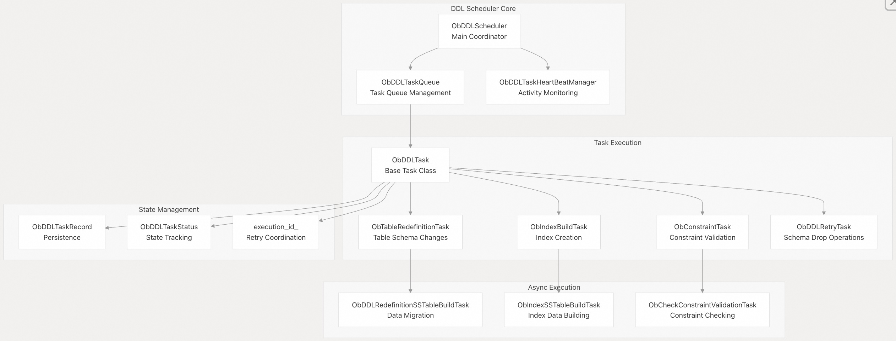
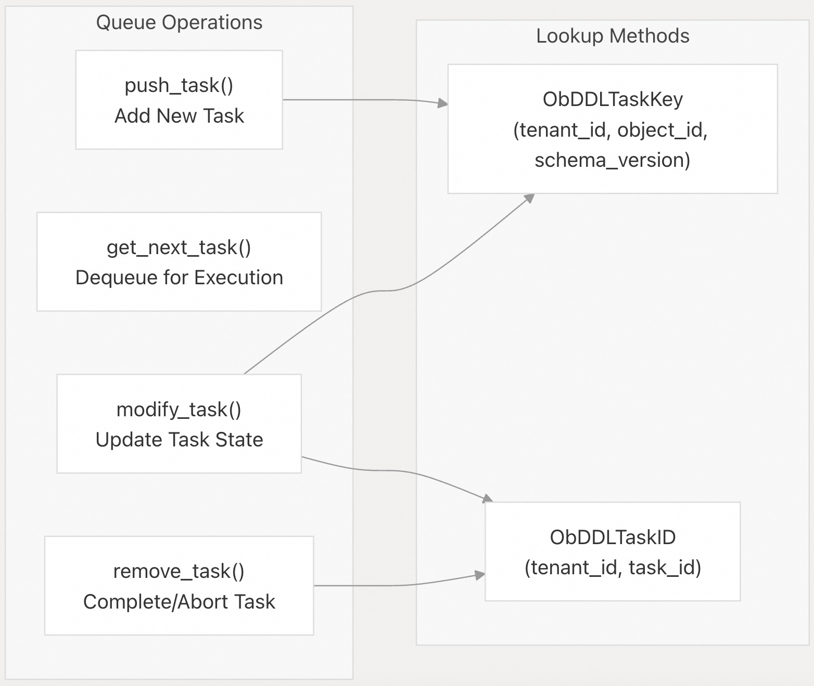
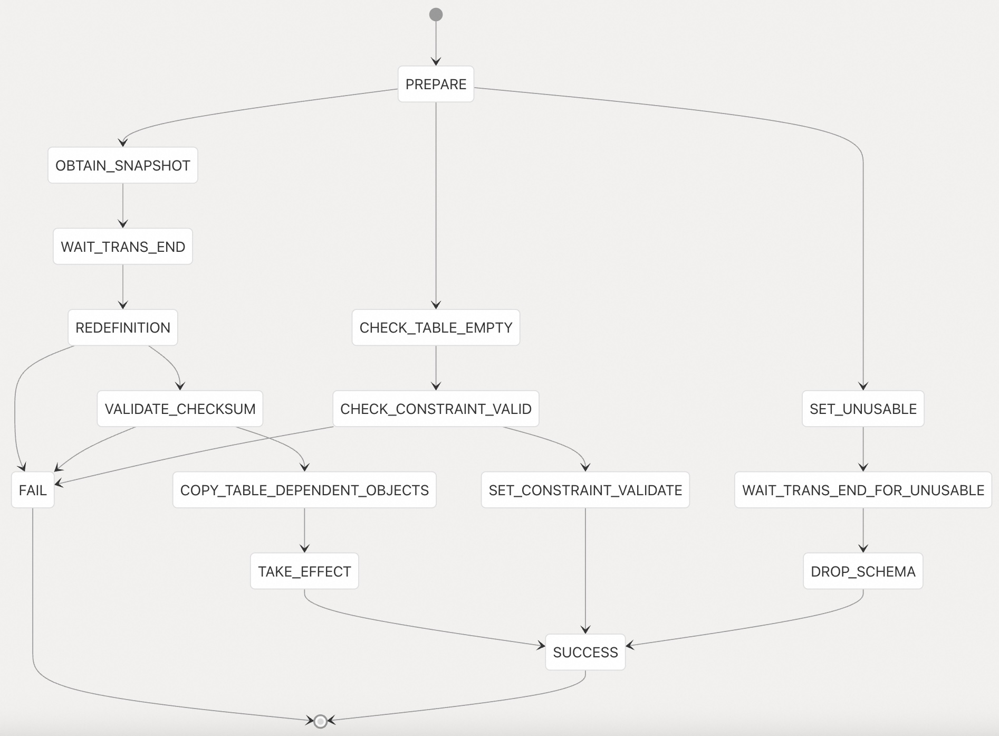
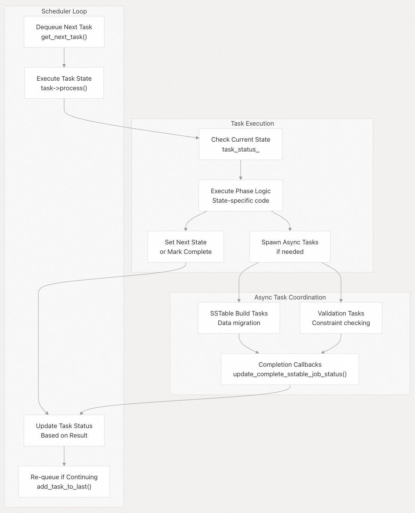
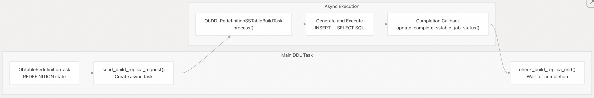

## 体系化剖析开源OB代码: 4.2 DDL 任务调度系统                  
                                  
### 作者                          
digoal                          
                                  
### 日期                            
2025-10-14                                
                           
### 标签                                
PostgreSQL , PolarDB , DuckDB , MySQL , OceanBase                           
                                 
----                             
                             
## 背景                   
本文介绍 OceanBase 中的 DDL（数据定义语言）任务调度系统，该系统管理索引创建、表重定义和约束验证等长时间运行的 schema 操作的执行。调度器负责协调分布式系统中的这些操作，处理任务排队、执行、监控和重试逻辑。  
  
## 架构概述  
DDL 任务调度系统由一个管理任务队列的中央调度程序组成，每个任务代表一个长时间运行的 DDL 操作，该操作可能跨越多个阶段并需要跨多个节点进行协调。  
  
    
  
**源文件:**  
- https://github.com/oceanbase/oceanbase/blob/8e2580cf/src/rootserver/ddl_task/ob_ddl_scheduler.h#L57-L99
- https://github.com/oceanbase/oceanbase/blob/8e2580cf/src/rootserver/ddl_task/ob_ddl_task.h#L37-L72
- https://github.com/oceanbase/oceanbase/blob/8e2580cf/src/rootserver/ddl_task/ob_ddl_scheduler.cpp#L46-L98
  
## 核心组件  
### ObDDLTaskQueue  
`ObDDLTaskQueue` 库是管理 DDL 任务的中央存储库。它维护一个链表决定了任务执行的顺序, 一个task key和task ID的哈希映射用于快速查找任务.   
  
组件	| 目的	| 主要方法  
---|---|---  
`task_list_` | 	执行顺序 |	`get_next_task()`，`add_task_to_last()`  
`task_map_` | 	通过 `ObDDLTaskKey` 查找任务	| `modify_task()`，`get_task()`  
`task_id_map_` | 	通过 `ObDDLTaskID`	查找任务 | `abort_task()`，`update_task_ret_code()`  
  
队列支持各种任务管理操作：  
  
    
  
**源文件:**  
- https://github.com/oceanbase/oceanbase/blob/8e2580cf/src/rootserver/ddl_task/ob_ddl_scheduler.h#L57-L99
- https://github.com/oceanbase/oceanbase/blob/8e2580cf/src/rootserver/ddl_task/ob_ddl_scheduler.cpp#L83-L137
  
### ObDDLTaskHeartBeatManager  
心跳管理器会跟踪任务活动，以检测并清理不活动(inactive)的任务。它会为每个活动任务维护一个时间戳，并定期识别在超时阈值内未报告活动状态(activity)的任务。  
  
**源文件:**  
- https://github.com/oceanbase/oceanbase/blob/8e2580cf/src/rootserver/ddl_task/ob_ddl_scheduler.h#L101-L115
- https://github.com/oceanbase/oceanbase/blob/8e2580cf/src/rootserver/ddl_task/ob_ddl_scheduler.cpp#L420-L509
  
## 任务生命周期和状态  
DDL 任务通过一个定义明确的状态机进行，不同类型的操作对应不同的阶段。`ObDDLTaskStatus` 枚举定义了可能的状态：  
  
    
  
状态转换由每个任务的 `process()` 方法管理，该方法实现当前状态的逻辑并根据完成状态确定下一个状态。  
  
**源文件:**  
- https://github.com/oceanbase/oceanbase/blob/8e2580cf/src/share/ob_ddl_common.h#L173-L230
- https://github.com/oceanbase/oceanbase/blob/8e2580cf/src/rootserver/ddl_task/ob_ddl_task.cpp#L762-L895
  
## 任务类型和 DDL 操作  
系统支持各种 DDL 操作类型，每种类型都有专门的任务实现：  
  
### 表重新定义(Redefinition)任务  
处理需要数据迁移的复杂 schema 变更：  
  
DDL 类型	| 任务类	| 目的  
---|---|---  
`DDL_TABLE_REDEFINITION` | 	`ObTableRedefinitionTask` | 	常规表结构更改  
`DDL_MODIFY_COLUMN` | 	`ObTableRedefinitionTask` | 	修改列  
`DDL_ADD_PRIMARY_KEY` | 	`ObTableRedefinitionTask` | 	添加主键  
`DDL_ALTER_PARTITION_BY` | 	`ObTableRedefinitionTask` | 	修改分区  
  
### 索引操作  
索引生命周期管理和 building：  
  
DDL 类型	| 任务类	| 目的  
---|---|---  
`DDL_CREATE_INDEX` | 	`ObIndexBuildTask` | 	索引创建  
`DDL_CREATE_PARTITIONED_LOCAL_INDEX` | 	`ObIndexBuildTask` | 	分区本地索引  
`DDL_DROP_INDEX` | 	`ObDropIndexTask` | 	索引删除  
`DDL_CREATE_VEC_INDEX` | 	`ObVecIndexBuildTask` | 	向量相似性索引  
  
### 约束操作  
处理约束验证：  
  
DDL 类型	| 任务类	| 目的  
---|---|---  
`DDL_CHECK_CONSTRAINT` | 	`ObConstraintTask` | 	check 约束 验证  
`DDL_FOREIGN_KEY_CONSTRAINT` | 	`ObConstraintTask` | 	外键约束 验证  
`DDL_ADD_NOT_NULL_COLUMN` | 	`ObConstraintTask` | 	添加 NOT NULL 约束  
   
**源文件:**  
- https://github.com/oceanbase/oceanbase/blob/8e2580cf/src/share/ob_ddl_common.h#L65-L147
- https://github.com/oceanbase/oceanbase/blob/8e2580cf/src/share/ob_ddl_common.cpp#L38-L222
  
## 调度与执行机制  
调度程序通过主处理循环进行操作，该循环将任务从队列中取出并根据其当前状态执行它们：  
  
   
  
### 执行 ID 和重试逻辑  
任务使用 `execution_id_` 来协调重试并确保幂等性。当任务需要重试异步操作时，它会递增`执行 ID`，以使之前的所有尝试无效。  
  
**源文件:**  
- https://github.com/oceanbase/oceanbase/blob/8e2580cf/src/rootserver/ddl_task/ob_ddl_scheduler.cpp#L139-L153
- https://github.com/oceanbase/oceanbase/blob/8e2580cf/src/rootserver/ddl_task/ob_ddl_task.cpp#L1089-L1157
  
## 异步任务执行  
许多 DDL 操作会生成异步子任务，用于数据密集型操作，例如 SSTable 构建或约束验证。这些任务实现了 `ObAsyncTask` 接口，并提交到线程池执行。  
  
### SSTable 构建任务  
对于需要数据迁移的操作，任务会生成 `ObDDLRedefinitionSSTableBuildTask` 实例来执行 SQL 从而完成复制和转换数据任务：  
  
   
  
### 索引构建任务  
`ObIndexSSTableBuildTask` 用于跨分区并行构建索引, 代码:   
- src/rootserver/ddl_task/ob_index_build_task.cpp  
- src/rootserver/ddl_task/ob_ddl_redefinition_task.cpp  
  
**源文件:**  
- https://github.com/oceanbase/oceanbase/blob/8e2580cf/src/rootserver/ddl_task/ob_ddl_redefinition_task.cpp#L86-L250
- https://github.com/oceanbase/oceanbase/blob/8e2580cf/src/rootserver/ddl_task/ob_index_build_task.cpp#L67-L216
  
## 监控和进度跟踪  
系统提供全面的监控功能，用于跟踪 DDL 进度.   
  
### 任务状态监控  
每个任务都维护详细的状态信息，包括：  
- 当前阶段（`task_status_`）  
- 数据操作进度百分比  
- 扫描、排序和插入阶段的已完成行数统计  
- 错误信息和重试尝试状态  
  
### 心跳和健康监测  
`ObDDLTaskHeartBeatManager` 跟踪任务活动：  
- 任务必须在 5 分钟内报告活动  
- 自动识别非活动任务以进行清理  
- 支持通过`跟踪 ID`优雅地取消任务  
  
### 进度报告  
通过 `ObDDLDiagnoseInfo` 系统报告任务进度，该系统跟踪：  
- scan 线程的活动和行数统计  
- sort 操作的进度和内存使用情况  
- insert 操作吞吐量和完成率  
- 向量索引的构建进展  
      
**源文件:**  
- https://github.com/oceanbase/oceanbase/blob/8e2580cf/src/share/ob_ddl_common.h#L791-L1065
- https://github.com/oceanbase/oceanbase/blob/8e2580cf/src/rootserver/ddl_task/ob_ddl_scheduler.cpp#L485-L509
  
#### [期望 PostgreSQL|开源PolarDB 增加什么功能?](https://github.com/digoal/blog/issues/76 "269ac3d1c492e938c0191101c7238216")
  
  
#### [PolarDB 开源数据库](https://openpolardb.com/home "57258f76c37864c6e6d23383d05714ea")
  
  
#### [PolarDB 学习图谱](https://www.aliyun.com/database/openpolardb/activity "8642f60e04ed0c814bf9cb9677976bd4")
  
  
#### [PostgreSQL 解决方案集合](../201706/20170601_02.md "40cff096e9ed7122c512b35d8561d9c8")
  
  
#### [德哥 / digoal's Github - 公益是一辈子的事.](https://github.com/digoal/blog/blob/master/README.md "22709685feb7cab07d30f30387f0a9ae")
  
  
#### [About 德哥](https://github.com/digoal/blog/blob/master/me/readme.md "a37735981e7704886ffd590565582dd0")
  
  

  
