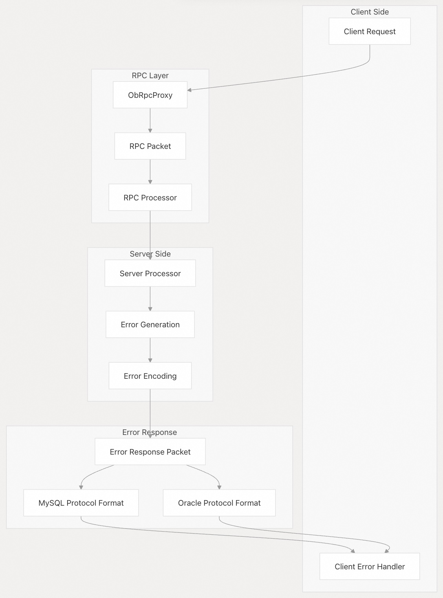

## 体系化剖析开源OB代码: 4.3 错误处理和 RPC 系统                   
                                    
### 作者                            
digoal                            
                                    
### 日期                              
2025-10-14                                  
                             
### 标签                                  
PostgreSQL , PolarDB , DuckDB , MySQL , OceanBase                             
                                   
----                               
                               
## 背景                     
本文涵盖了 OceanBase 完善的错误处理框架及其与 RPC 通信基础设施(Infra)的集成，该系统在整个分布式数据库系统中提供统一的错误码、跨库(MySQL,Oracle)兼容性映射以及强大的错误传播机制。  
  
## 系统架构  
OceanBase 实现了一套集中式错误处理系统，作为 SQL 处理、存储操作和 RPC 通信中所有错误报告的基础。该系统提供了错误代码标准化、多数据库兼容(MySQL,Oracle)和结构化错误传播的功能。  
  
### 错误代码架构  
  
  
  
## 错误代码系统  
### 错误代码组织  
错误处理系统将错误代码组织成逻辑范围，每个范围服务于特定的系统组件：  
  
范围	| 目的	| 示例  
---|---|---  
-4000 至 -4500	| 一般系统错误	| `OB_ERROR`，`OB_ALLOCATE_MEMORY_FAILED`，`OB_TIMEOUT`  
-4500 至 -5000	| `RootServer` 操作	| 服务器管理、集群协调  
-5000 至 -6000	| SQL 层错误	| 解析器错误、schema 错误、权限错误  
-6000 至 -7000	| 事务层错误	| 提交/回滚失败、锁冲突  
-8000 至 -9000	| 致命错误	| 需要关闭连接的严重系统故障  
  
### 错误定义宏  
系统使用几种宏类型来定义具有不同兼容性要求的错误：  
  
```  
// Basic error definition  
DEFINE_ERROR(symbol, code, mysql_code, sqlstate, message)  
  
// Oracle-compatible error  
DEFINE_ORACLE_ERROR(symbol, code, mysql_code, sqlstate, mysql_msg, oracle_code, oracle_msg)  
  
// PL/SQL specific error  
DEFINE_PLS_ERROR(symbol, code, mysql_code, sqlstate, mysql_msg, oracle_code, oracle_msg)  
```  
  
## 跨数据库兼容性(MySQL,Oracle)  
  
  
  
## RPC 错误处理  
### RPC 特定的错误代码  
系统针对 RPC 通信失败定义了具体的错误码：  
  
错误代码	| 符号 |	描述  
---|---|---  
`-4011`| 	`OB_PACKET_NOT_SENT`| 	RPC 数据包传输失败  
`-4119`| 	`OB_RPC_PACKET_TOO_LONG`| 	RPC 数据包超出大小限制  
`-4121`| 	`OB_RPC_SEND_ERROR`| 	RPC send 操作失败  
`-4122`| 	`OB_RPC_POST_ERROR`| 	RPC post 操作失败  
`-4128`| 	`OB_RPC_PACKET_INVALID`| 	RPC 数据包格式无效  
`-4265`| 	`OB_RPC_CONNECT_ERROR`| 	RPC 连接建立失败  
  
### 错误传输机制  
  
  
  
## 表达系统集成  
### 表达式错误类型  
表达式求值系统通过 `ObItemType` 枚举系统与错误处理框架紧密集成：  
  
  
  
### 函数的错误处理  
表达式系统为不同的函数类别提供了专门的错误处理：  
  
函数类别	| 错误处理方法  
---|---  
算术运算	| 溢出检测、除零检查  
字符串函数	| 长度验证、编码检查  
日期/时间函数	| 格式验证、范围检查  
聚合函数	| 空值处理、类型兼容性  
系统函数	| 权限检查、资源可用性  
  
## 错误上下文和传播  
### 错误上下文结构  
  
  
  
### 语句类型集成  
错误系统通过语句类型框架与 SQL 语句处理集成：  
  
语句类型	| 错误处理	| 权限检查  
---|---|---  
`T_SELECT` | 	读取权限错误，schema 验证	 | `ACTION_TYPE_SELECT`  
`T_INSERT` | 	约束违规、类型不匹配	 | `ACTION_TYPE_INSERT`  
`T_UPDATE` | 	并发冲突、验证错误	 | `ACTION_TYPE_UPDATE`  
`T_DELETE` | 	约束违规	 | `ACTION_TYPE_DELETE`  
`T_CREATE_TABLE` | 	schema 冲突、资源限制	 | `ACTION_TYPE_CREATE_TABLE`  
  
## 致命错误处理  
### 致命错误类别  
`-8000` 到 `-9000` 范围内的致命错误需要立即终止连接并执行系统恢复程序：  
  
  
  
## 与分布式操作集成  
错误处理系统为分布式数据库操作提供专门的支持，确保跨集群节点的一致错误报告，并在故障情况下保持事务完整性。  
  
### 分布式事务错误处理  
事务层错误（范围 `-6000` 到 `-7000`）包括针对分布式场景的专门处理：  
- 分布式死锁检测：`OB_DEAD_LOCK` 具有集群范围的检测能力  
- 共识失败：与 Paxos/Raft 共识协议集成  
- 网络分区处理：裂脑场景的超时和重试机制  
- 资源冲突：跨节点资源争用解决  
  
### RPC错误恢复  
RPC 系统实现了复杂的重试和回退机制：  
- 自动重试：可配置针对瞬时网络故障的重试策略  
- 断路器：防止分布式调用中的级联故障  
- 负载均衡：RPC 错误时自动故障转移到健康节点  
- 连接池：高效的连接重用和错误清理  
       
#### [期望 PostgreSQL|开源PolarDB 增加什么功能?](https://github.com/digoal/blog/issues/76 "269ac3d1c492e938c0191101c7238216")
  
  
#### [PolarDB 开源数据库](https://openpolardb.com/home "57258f76c37864c6e6d23383d05714ea")
  
  
#### [PolarDB 学习图谱](https://www.aliyun.com/database/openpolardb/activity "8642f60e04ed0c814bf9cb9677976bd4")
  
  
#### [PostgreSQL 解决方案集合](../201706/20170601_02.md "40cff096e9ed7122c512b35d8561d9c8")
  
  
#### [德哥 / digoal's Github - 公益是一辈子的事.](https://github.com/digoal/blog/blob/master/README.md "22709685feb7cab07d30f30387f0a9ae")
  
  
#### [About 德哥](https://github.com/digoal/blog/blob/master/me/readme.md "a37735981e7704886ffd590565582dd0")
  
  

  
