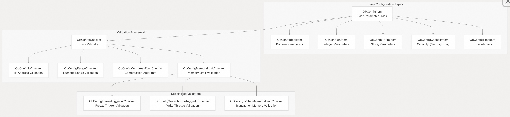

## 体系化剖析开源OB代码: 5.1 参数配置系统                    
                                      
### 作者                              
digoal                              
                                      
### 日期                                
2025-10-14                                    
                               
### 标签                                    
PostgreSQL , PolarDB , DuckDB , MySQL , OceanBase                               
                                     
----                                 
                                 
## 背景                       
本文介绍 OceanBase 的分层参数配置系统，该系统管理集群级别和租户级别的数据库设置。该系统提供类型安全的参数定义、验证框架、动态配置更新和持久化机制。  
  
## 架构概述  
OceanBase 实现了一套多级参数配置系统，既支持集群范围的配置，也支持租户级的配置。该系统基于类型安全的参数定义框架构建，具备可验证、持久化和动态更新功能。  
  
## 参数配置架构  
  
  
  
**源文件:**  
- https://github.com/oceanbase/oceanbase/blob/8e2580cf/src/share/parameter/ob_parameter_seed.ipp#L1-L2000
- https://github.com/oceanbase/oceanbase/blob/8e2580cf/src/share/config/ob_server_config.h#L82-L165
- https://github.com/oceanbase/oceanbase/blob/8e2580cf/src/observer/omt/ob_tenant_config_mgr.h#L106-L200
- https://github.com/oceanbase/oceanbase/blob/8e2580cf/src/observer/omt/ob_tenant_config.h#L34-L125
- https://github.com/oceanbase/oceanbase/blob/8e2580cf/src/share/config/ob_config.h#L91-L243
  
## 参数层级和范围  
配置系统在两个主要层级上运行：影响所有租户的集群范围参数，以及租户级的特定租户参数。  
  
参数范围层次结构  
  
  
  
**源文件:**  
- https://github.com/oceanbase/oceanbase/blob/8e2580cf/src/share/parameter/ob_parameter_seed.ipp#L15-L21
- https://github.com/oceanbase/oceanbase/blob/8e2580cf/src/share/parameter/ob_parameter_seed.ipp#L152-L183
- https://github.com/oceanbase/oceanbase/blob/8e2580cf/src/share/parameter/ob_parameter_attr.h#L1-L200
  
### 集群参数  
集群参数使用 `OB_CLUSTER_PARAMETER` 宏定义，全局应用于所有租户。主要类别包括：  
  
类别	| 示例	| 作用  
---|---|---  
Storage	| `data_dir`，`datafile_size`，`memory_limit`	| 磁盘和内存分配  
Network	| `rpc_port`，`devname`，`mysql_port`	| 网络连接  
Logging	| `syslog_level`，`trace_log_slow_query_watermark`，`enable_sql_audit`	| 调试和监控  
Security	| `ssl_external_kms_info`，`tde_method`	| 加密和身份验证  
  
  
### 租户参数  
租户参数使用 `OB_TENANT_PARAMETER` 宏，可以根据指定租户进行配置：  
  
类别	| 示例	| 作用  
---|---|---  
Memory Management	 | `memstore_limit_percentage`，`freeze_trigger_percentage`	  | 内存分配控制  
Execution Control	 | `cpu_quota_concurrency`，`px_workers_per_cpu_quota`	 | 资源利用率  
Compatibility	 | `compatible`，`enable_monotonic_weak_read`	 | 功能启用  
Storage Behavior	 | `storage_rowsets_size`，`default_table_store_format`	 | 数据存储优化  
  
**源文件:**  
- https://github.com/oceanbase/oceanbase/blob/8e2580cf/src/share/parameter/ob_parameter_seed.ipp#L26-L60
- https://github.com/oceanbase/oceanbase/blob/8e2580cf/src/share/parameter/ob_parameter_seed.ipp#L354-L520
  
  
## 参数类型和验证  
配置系统支持多种参数类型及其相关的验证框架。每种参数类型都提供专门的解析、验证和存储功能。  
  
参数类型系统  
  
  
  
**源文件:**  
- https://github.com/oceanbase/oceanbase/blob/8e2580cf/src/share/config/ob_config.h#L91-L243
- https://github.com/oceanbase/oceanbase/blob/8e2580cf/src/share/config/ob_config_helper.h#L36-L500
- https://github.com/oceanbase/oceanbase/blob/8e2580cf/src/share/config/ob_config_helper.cpp#L34-L700
  
### 参数类型定义  
系统使用位于 `ob_parameter_seed.ipp` 的特定类型的宏定义参数：  
- `DEF_STR`：带有可选验证约束的字符串参数  
- `DEF_INT`：带范围检查的整数参数  
- `DEF_BOOL`：布尔参数（true/false）  
- `DEF_CAP`：容量参数（内存/磁盘大小）  
- `DEF_TIME`：时间间隔参数  
- `DEF_LOG_LEVEL`：日志记录级别参数  
  
每个参数定义包括：  
- 默认值  
- 值范围或验证约束  
- 参数属性（范围、可编辑级别、section）  
- 文档字符串(参数的描述?)  
  
### 验证框架  
`ObConfigChecker` 层次结构提供了可扩展的验证：  
  
checker 类型 |	目的	| 示例参数  
---|---|---  
`ObConfigIpChecker` | 	IP 地址格式	| 网络接口设置  
`ObConfigCompressFuncChecker` | 	压缩算法	| `default_compress_func`，`log_transport_compress_func`  
`ObConfigMemoryLimitChecker` | 	内存大小限制	| `memory_limit`，`system_memory`  
`ObConfigFreezeTriggerIntChecker` | 	内存表冻结阈值 |	`freeze_trigger_percentage`  
  
**源文件:**  
- https://github.com/oceanbase/oceanbase/blob/8e2580cf/src/share/parameter/ob_parameter_macro.h#L43-L150
- https://github.com/oceanbase/oceanbase/blob/8e2580cf/src/share/config/ob_config_helper.cpp#L68-L300
  
## 配置管理生命周期  
配置系统支持参数更新的“持久性、验证和动态更改”全生命周期管理。  
  
参数更新流程  
  
  
  
**源文件:**  
- https://github.com/oceanbase/oceanbase/blob/8e2580cf/src/share/config/ob_server_config.cpp#L93-L122
- https://github.com/oceanbase/oceanbase/blob/8e2580cf/src/observer/omt/ob_tenant_config_mgr.cpp#L270-L291
- https://github.com/oceanbase/oceanbase/blob/8e2580cf/src/observer/omt/ob_tenant_config.cpp#L199-L279
  
### 参数配置持久化  
参数配置数据存储在 OceanBase 内部表中：  
- `__all_sys_parameter`：集群级参数  
- `__tenant_parameter`：租户特定参数  
  
`ObSystemConfig` 类管理数据库持久性并提供读取和写入配置数据的方法。  
  
### 动态配置更新  
租户配置通过 `TenantConfigUpdateTask` 支持动态更新：  
- 版本检测：通过 `ObTenantConfig::got_version()` 检测配置变化  
- 任务调度：异步调度更新以避免阻塞  
- 批处理：多个参数更改被批处理为单个更新操作  
- 验证：所有更改在应用前均经过验证  
  
**源文件:**  
- https://github.com/oceanbase/oceanbase/blob/8e2580cf/src/share/config/ob_system_config.cpp#L35-L100
- https://github.com/oceanbase/oceanbase/blob/8e2580cf/src/observer/omt/ob_tenant_config.cpp#L106-L193
  
## 关键代码实体  
### 核心配置类  
类	| 目的	| 主要方法  
---|---|---  
`ObServerConfig` | 	集群级配置管理 | 	`read_config()`，`add_extra_config()`，`check_all()`  
`ObTenantConfigMgr` | 	多租户配置协调 | 	`refresh_tenants()`，`get_lease_response()`，`add_tenant_config()`  
`ObTenantConfig` | 	单个租户配置 | 	`got_version()`，`read_config()`，`update_local()`  
`ObConfigItem` | 	基本参数配置实现 | 	`set_value()`，`str()`，`check()`  
`ObSystemConfig` | 	数据库参数配置持久层 | 	`update()`，`find()`，`read_config()`  
  
### 配置访问模式  
系统通过以下方式提供线程安全的配置访问：  
- `GCONF`：全局宏, 用于访问集群配置  
- `TENANT_CONF(tenant_id)`：用于特定租户配置访问的宏  
- `ObTenantConfigGuard`：用于租户配置访问的 RAII 包装器(wrapper)  
  
```  
// Cluster parameter access  
int64_t port = GCONF.mysql_port;  
  
// Tenant parameter access    
omt::ObTenantConfigGuard tenant_config(TENANT_CONF(tenant_id));  
if (tenant_config.is_valid()) {  
    int64_t cpu_quota = tenant_config->cpu_quota_concurrency;  
}  
```  
  
### 虚拟表集成  
系统通过虚拟表公开配置(SQL接口可访问数据库配置)：  
- `__all_virtual_sys_parameter_stat`：当前参数值和元数据  
- `__all_virtual_tenant_parameter_info`：租户特定参数信息  
  
这些虚拟表提供了对配置数据的 SQL 访问，方便用户进行监控和管理。 
   
**源文件:**  
- https://github.com/oceanbase/oceanbase/blob/8e2580cf/src/share/config/ob_server_config.h#L208-L209
- https://github.com/oceanbase/oceanbase/blob/8e2580cf/src/observer/omt/ob_tenant_config_mgr.h#L36-L54
- https://github.com/oceanbase/oceanbase/blob/8e2580cf/src/observer/virtual_table/ob_all_virtual_tenant_parameter_info.cpp#L23-L100
    
#### [期望 PostgreSQL|开源PolarDB 增加什么功能?](https://github.com/digoal/blog/issues/76 "269ac3d1c492e938c0191101c7238216")
  
  
#### [PolarDB 开源数据库](https://openpolardb.com/home "57258f76c37864c6e6d23383d05714ea")
  
  
#### [PolarDB 学习图谱](https://www.aliyun.com/database/openpolardb/activity "8642f60e04ed0c814bf9cb9677976bd4")
  
  
#### [PostgreSQL 解决方案集合](../201706/20170601_02.md "40cff096e9ed7122c512b35d8561d9c8")
  
  
#### [德哥 / digoal's Github - 公益是一辈子的事.](https://github.com/digoal/blog/blob/master/README.md "22709685feb7cab07d30f30387f0a9ae")
  
  
#### [About 德哥](https://github.com/digoal/blog/blob/master/me/readme.md "a37735981e7704886ffd590565582dd0")
  
  

  
