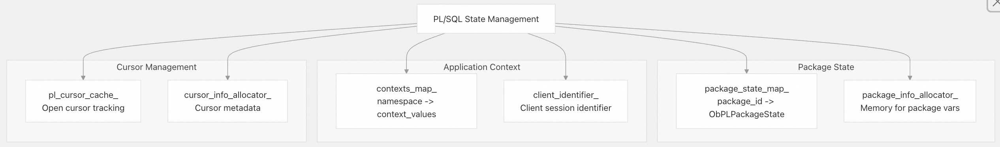

## 体系化剖析开源OB代码: 5.2 会话管理                     
                                        
### 作者                                
digoal                                
                                        
### 日期                                  
2025-10-14                                      
                                 
### 标签                                      
PostgreSQL , PolarDB , DuckDB , MySQL , OceanBase                                 
                                       
----                                   
                                   
## 背景                         
本文涵盖 OceanBase 中的 SQL 会话生命周期、状态管理和变量处理。会话管理涵盖用户连接状态、系统变量和用户变量、预处理语句(prepared statement)以及分布式执行的会话同步。  
  
## 核心架构  
会话管理系统由两个main class层次结构和用于管理 SQL 连接、用户状态和系统变量的支持组件组成。  
  
### 会话类(class)层次结构  
  
    
  
`ObBasicSessionInfo` 类提供核心会话功能，包括系统变量存储、租户信息和基本生命周期管理。`ObSQLSessionInfo` 通过 SQL 特定功能（如预处理语句、PL/SQL 包状态和分布式执行支持）扩展此功能。  
  
**源文件:**  
- https://github.com/oceanbase/oceanbase/blob/8e2580cf/src/sql/session/ob_basic_session_info.h#L186-L189
- https://github.com/oceanbase/oceanbase/blob/8e2580cf/src/sql/session/ob_sql_session_info.h#L100-L101
- https://github.com/oceanbase/oceanbase/blob/8e2580cf/src/sql/session/ob_sql_session_info.h#L285-L381
  
## 会话生命周期管理  
### 会话初始化  
会话创建遵循多阶段初始化过程，该过程设置系统变量、分配器和连接状态。  
  
    
  
`ObBasicSessionInfo` 中的 `init()` 是初始化核心会话状态的方法：  
  
组件 |	目的  
---|---  
`user_var_val_map_`	| 用户自定义变量存储  
`debug_sync_actions_`	| 调试同步点  
`sys_vars_cache_`	| 系统变量的快速访问缓存  
`tz_info_wrap_`	| 会话时区配置  
  
**源文件:**  
- https://github.com/oceanbase/oceanbase/blob/8e2580cf/src/sql/session/ob_basic_session_info.cpp#L233-L276
- https://github.com/oceanbase/oceanbase/blob/8e2580cf/src/sql/session/ob_sql_session_info.cpp#L204-L265
  
### 会话重置(reset)和清理(cleanup)
会话清理通过 `destroy()` 方法处理事务回滚、临时表清理和资源释放。  
  
    
  
**源文件:**  
- https://github.com/oceanbase/oceanbase/blob/8e2580cf/src/sql/session/ob_sql_session_info.cpp#L710-L828
- https://github.com/oceanbase/oceanbase/blob/8e2580cf/src/sql/session/ob_basic_session_info.cpp#L278-L307
  
## 系统变量管理  
### 变量存储架构  
系统变量使用双层存储系统来提高性能：直接数组(direct array)用于快速访问，哈希映射(hash maps)用于按名称查找。  
  
    
  
系统变量以 JSON 格式定义，并通过代码生成为 C++ 类。`ObSysVarFactory` 创建变量的实例，`ObSysVariables` 提供默认值和元数据。  
  
**源文件:**  
- https://github.com/oceanbase/oceanbase/blob/8e2580cf/src/share/system_variable/ob_system_variable_init.json#L1-L50
- https://github.com/oceanbase/oceanbase/blob/8e2580cf/src/share/system_variable/ob_system_variable_factory.h#L26-L32
  
### 变量作用域(scope)和标志(flag) 
系统变量具有不同的可见性范围和行为标志，定义在 `ObSysVarFlag`：  
  
标志(flag)	| 描述	| 影响  
---|---|---  
`GLOBAL_SCOPE` | 	变量具有全局可见性	| 可以在集群级别设置  
`SESSION_SCOPE` | 	变量具有会话可见性	| 每个会话可以有不同的值  
`NEED_SERIALIZE` | 	必须同步	| 发送到远程执行节点  
`INFLUENCE_PLAN` | 	影响查询计划	| 触发计划缓存失效  
`READONLY` | 	无法修改	| 系统控制的值  
  
**源文件:**  
- https://github.com/oceanbase/oceanbase/blob/8e2580cf/src/share/system_variable/ob_system_variable_init.h#L22-L40
- https://github.com/oceanbase/oceanbase/blob/8e2580cf/src/share/system_variable/ob_system_variable_init.json#L8-L15
  
### 变量同步  
对于分布式 SQL 执行，会话变量使用实现了 `ObSessInfoEncoder` 接口的专用编码器进行同步。  
  
    
  
**源文件:**  
- https://github.com/oceanbase/oceanbase/blob/8e2580cf/src/sql/session/ob_sql_session_info.h#L285-L381
- https://github.com/oceanbase/oceanbase/blob/8e2580cf/src/sql/session/ob_sql_session_info.cpp#L1570-L1650
  
## 会话状态组件  
### 连接以及用户信息  
会话通过各种成员变量维护详细的连接和身份验证状态：  
  
    
  
会话存储连接元数据、用户身份验证详细信息以及用于协议(wire protocol)协商和安全相关的客户端信息。  
  
**源文件:**  
- https://github.com/oceanbase/oceanbase/blob/8e2580cf/src/sql/session/ob_basic_session_info.h#L441-L554
- https://github.com/oceanbase/oceanbase/blob/8e2580cf/src/sql/session/ob_basic_session_info.cpp#L731-L756
  
### 预处理语句(prepared statement)管理  
会话通过维护语句元数据和参数信息的哈希映射来跟踪预处理语句(prepared statement)：  
  
    
  
`ps_session_info_map_` 将客户端语句 ID 映射到特定于会话的预处理语句信息，同时 `ps_name_id_map_` 处理命名的预处理语句(named prepared statement)。  
  
**源文件:**  
- https://github.com/oceanbase/oceanbase/blob/8e2580cf/src/sql/session/ob_sql_session_info.h#L631-L890
- https://github.com/oceanbase/oceanbase/blob/8e2580cf/src/sql/session/ob_sql_session_info.cpp#L830-L890
  
### 包和上下文管理  
为了与 Oracle 兼容，会话维护 PL/SQL 包状态和应用程序上下文：  
  
    
  
`package_state_map_` 在调用之间维护PL/SQL 包变量值，同时 `contexts_map_` 存储可通过 `DBMS_APPLICATION_INFO` 过程访问的应用程序定义的上下文值。  
  
**源文件:**  
- https://github.com/oceanbase/oceanbase/blob/8e2580cf/src/sql/session/ob_sql_session_info.h#L1540-L1580
- https://github.com/oceanbase/oceanbase/blob/8e2580cf/src/sql/session/ob_sql_session_info.cpp#L320-L370
  
## 分布式执行的会话同步  
### 同步架构  
OceanBase 支持分布式 SQL 执行，其中必须使用会话编码器框架(session encoder framework)在多个节点之间同步会话状态。  
  
    
  
### 会话更改跟踪  
会话通过各种追踪机制来跟踪哪些信息发生了变化以及需要同步：  
  
更改类型	| 追踪方法	| 同步触发器  
---|---|---  
系统变量	| `changed_sys_vars_` 数组	| 变量赋值  
用户变量	| `changed_user_vars_` 数组	| 变量赋值  
数据库上下文	| `is_database_changed_` flag	| `USE` database  
包状态	| `package_changed_info_`	| PL/SQL 执行  
事务状态	| `tx_desc_` 变化	| 事务操作  
  
`ObMPUtils` 中的 `add_changed_session_info()` 函数处理这些变化并将其编码为 MySQL 协议响应。  
  
**源文件:**  
- https://github.com/oceanbase/oceanbase/blob/8e2580cf/src/sql/session/ob_sql_session_info.h#L227-L262
- https://github.com/oceanbase/oceanbase/blob/8e2580cf/src/observer/mysql/obmp_utils.cpp#L43-L140
  
## 性能优化  
### 系统变量缓存  
频繁访问的系统变量被缓存在 `SysVarsCache` 以提高性能：  
  
    
  
缓存存储常用的变量，如`sql_mode`、`autocommit`和时区信息，以便快速访问而无需数组查找。  
  
### 内存管理  
会话使用针对不同数据类型的专用分配器(allocator)来优化内存使用：  
  
分配器	| 目的	| 特征  
---|---|---  
`block_allocator_` | 	常规会话数据	| 小块(small block)分配  
`ps_session_info_allocator_	` | 预处理语句(prepared statement)	| 固定大小的对象  
`cursor_info_allocator_	` | PL/SQL 游标	| 游标元数据  
`package_info_allocator_` | 	包状态	| PL/SQL 变量  
`sess_level_name_pool_` | 	字符串存储	| 会话生存期(Session-lifetime)字符串  
  
**源文件:**  
- https://github.com/oceanbase/oceanbase/blob/8e2580cf/src/sql/session/ob_basic_session_info.h#L74-L84
- https://github.com/oceanbase/oceanbase/blob/8e2580cf/src/sql/session/ob_basic_session_info.cpp#L74-L84
  
## 集成点  
### MySQL 协议集成  
会话状态变化通过 `ObMPUtils` 实现的 MySQL 协议扩展传达给客户端：  
- OK 数据包包含通过 `add_changed_session_info()` 发出的会话状态更改通知  
- 系统变量变化被编码在响应数据包中  
- 应用程序上下文变化触发客户端通知  
- 预处理语句生命周期事件更新客户端状态  
  
### 事务集成  
会话维护事务描述符(descriptor)并与事务层协调：  
- `tx_desc_` 指向活动事务描述符  
- 事务超时使用会话配置的值 `get_query_timeout()`  
- 隔离级别通过 `tx_isolation` 进行会话特定的设置  
- 自动提交行为通过 `autocommit` 变量控制每个会话  
  
`is_server_status_in_transaction()` 方法根据事务描述符状态和自动提交设置确定会话是否应向客户端报告事务状态。  
    
**源文件:**  
- https://github.com/oceanbase/oceanbase/blob/8e2580cf/src/observer/mysql/obmp_utils.cpp#L26-L140
- https://github.com/oceanbase/oceanbase/blob/8e2580cf/src/sql/session/ob_basic_session_info.cpp#L181-L195
  
#### [期望 PostgreSQL|开源PolarDB 增加什么功能?](https://github.com/digoal/blog/issues/76 "269ac3d1c492e938c0191101c7238216")
  
  
#### [PolarDB 开源数据库](https://openpolardb.com/home "57258f76c37864c6e6d23383d05714ea")
  
  
#### [PolarDB 学习图谱](https://www.aliyun.com/database/openpolardb/activity "8642f60e04ed0c814bf9cb9677976bd4")
  
  
#### [PostgreSQL 解决方案集合](../201706/20170601_02.md "40cff096e9ed7122c512b35d8561d9c8")
  
  
#### [德哥 / digoal's Github - 公益是一辈子的事.](https://github.com/digoal/blog/blob/master/README.md "22709685feb7cab07d30f30387f0a9ae")
  
  
#### [About 德哥](https://github.com/digoal/blog/blob/master/me/readme.md "a37735981e7704886ffd590565582dd0")
  
  

  
