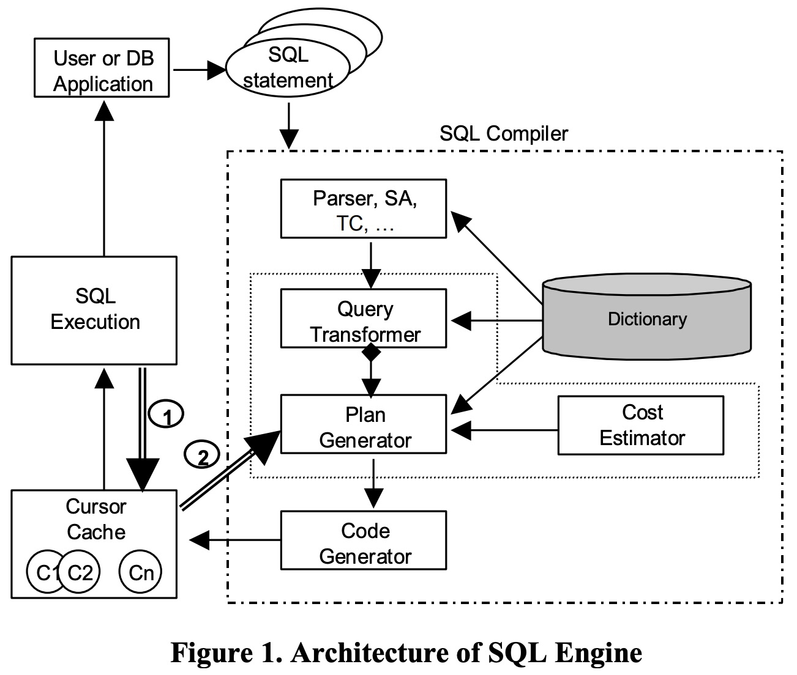
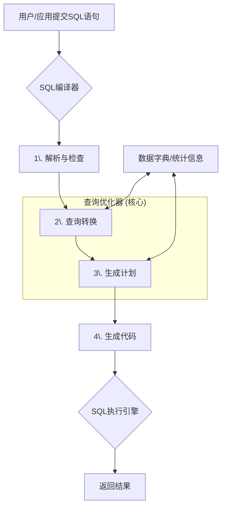
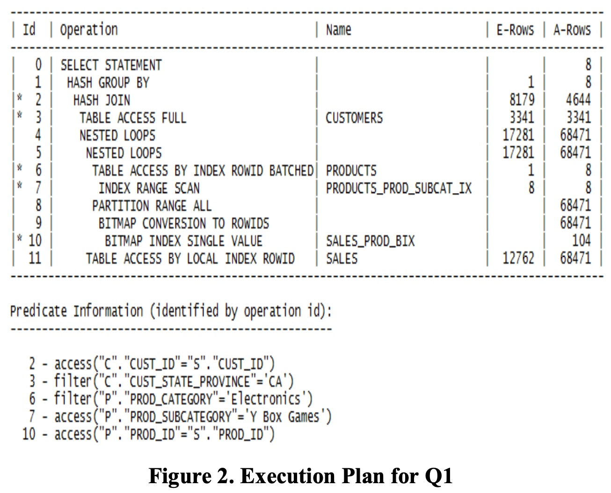
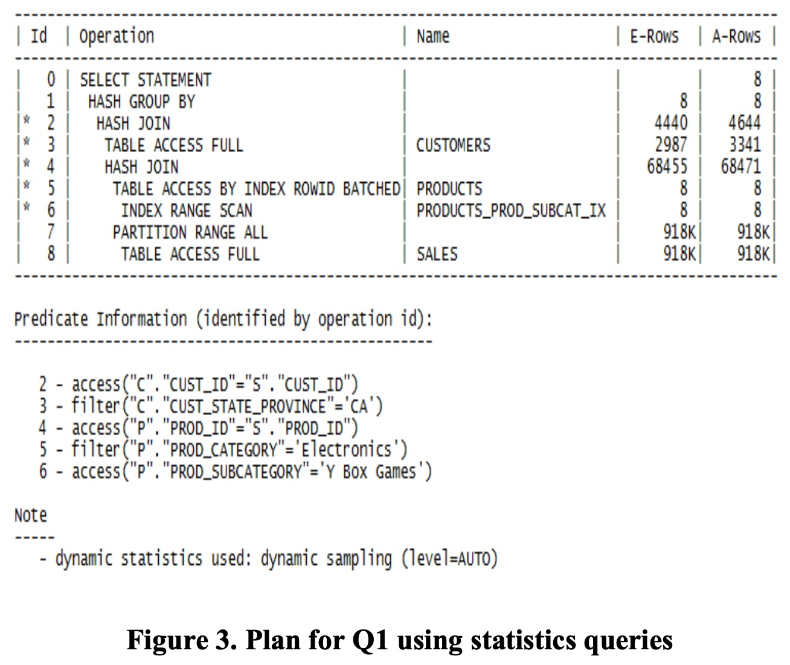
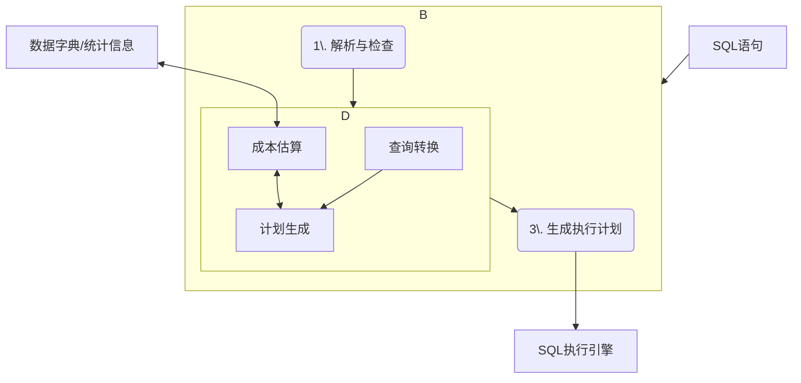
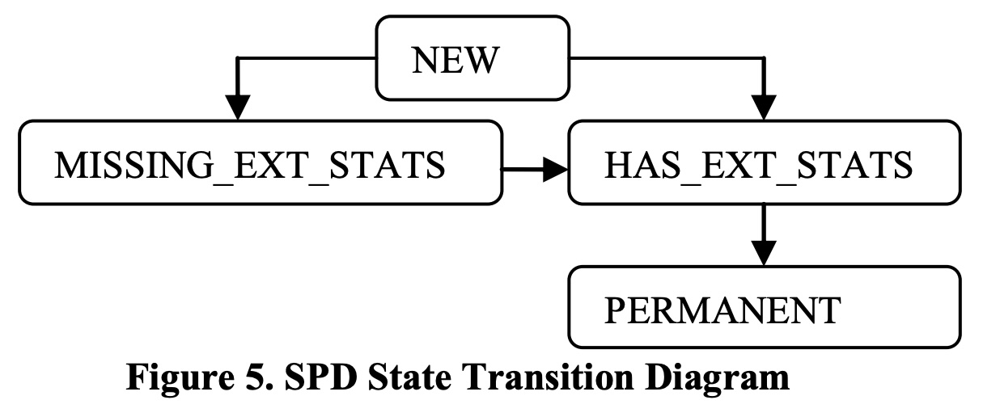
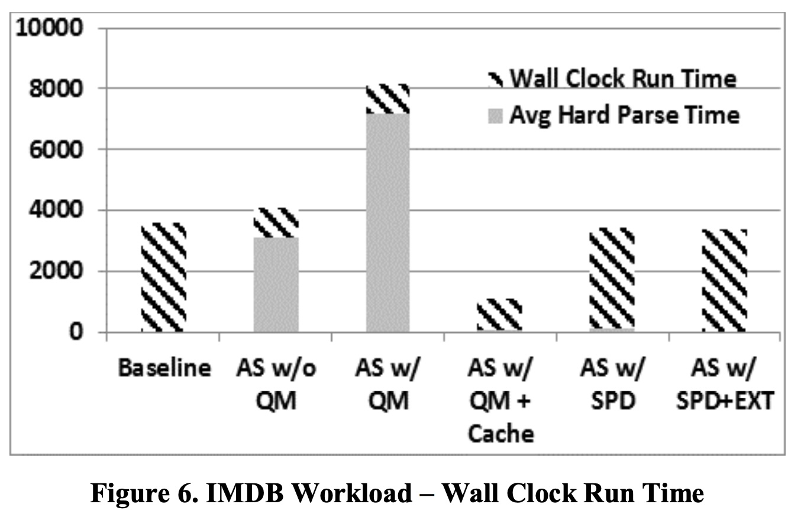

## AI论文解读 | Adaptive Statistics In Oracle 12C
        
### 作者        
digoal        
        
### 日期        
2025-10-15        
        
### 标签        
PostgreSQL , PolarDB , DuckDB , AI , 论文解读        
        
----        
        
## 背景  
      
https://www.vldb.org/pvldb/vol10/p1813-zait.pdf        
  
提示:          
```          
读懂《Adaptive Statistics In Oracle 12C》这篇论文需要提前掌握哪些基础知识, 请使用中文通熟易懂的讲解这些基础知识, 可以引用论文中的图、表或使用Markdown支持的图形(text,mermaid等)增加解释性. 
  
使用中文通熟易懂的解读《Adaptive Statistics In Oracle 12C》这篇论文, 其中的关键内容请着重讲解, 可以引用论文中的图、表或使用Markdown支持的图形(text,mermaid等)增加解释性. 
  
提取《Adaptive Statistics In Oracle 12C》这篇论文中的重要术语, 使用中文对这些术语进行通熟易懂的讲解, 可以引用论文中的图、表或使用Markdown支持的图形(text,mermaid等)增加解释性. 
```     
  
## 1 前置知识 
  
好的，为了帮助您更好地理解《Adaptive Statistics in Oracle 12c》这篇论文，我将为您梳理和讲解需要预先掌握的核心基础知识。这些知识主要围绕数据库如何处理和优化一条SQL查询语句展开。

### 引言

想象一下，你用导航软件找一条从家到公司的最佳路线。导航软件（查询优化器）会根据它掌握的实时路况、红绿灯数量、道路限速等信息（统计信息）为你规划一条“最快”的路线（执行计划）。但如果路况信息是过时的或不准确的（统计信息不准），它很可能会给你一条很堵的“冤枉路”。

这篇论文的核心，就是解决数据库中类似的问题：当数据库对数据量的“估算”出现严重偏差时，如何动态地、自适应地纠正这个错误，从而生成更优的执行计划，让查询变得更快。

要理解它的解决方案，我们首先需要了解数据库内部处理SQL查询的全过程。

-----

### 基础知识一：SQL的生命周期与核心组件

当用户或应用程序发送一条SQL语句给数据库时，它会经历一个复杂的处理流程，这就像一个产品的生产流水线。论文中的**图1**完美地展示了这个流程。



*论文中的图1：SQL引擎架构*

我们可以将这个流程简化为以下几个关键步骤：



1.  **SQL编译器 (SQL Compiler)**: 这是SQL语句处理的“总指挥部”。

      * **解析、语义分析、类型检查 (Parser, SA, TC)** : 这一步类似于代码编译器的语法检查。数据库会检查你的SQL有没有写错、表和字段是否存在、数据类型是否匹配等 。
      * **查询优化器 (Query Optimizer)** : 这是整个流程的“大脑”，也是这篇论文的重点。它的唯一目标是为一条SQL语句找到**成本最低**（通常意味着执行时间最短）的执行方式 。它由以下几个部分组成：
          * **查询转换器 (Query Transformer)**: 它会尝试用一种语义完全等价但可能更高效的方式来重写你的SQL 。例如，将复杂的子查询展开成连接（Join）操作 。
          * **计划生成器 (Plan Generator)**: 它会探索多种可能的执行路径 。比如，是先连接A表和B表，再连接C表？还是先连接B表和C表？对于每一张表，是全表扫描还是走索引？
          * **成本估算器 (Cost Estimator)**: 对于计划生成器提出的每一种可能性，它都会进行“成本估算” 。这个成本是IO、CPU等资源的综合评估值 。成本越低，代表执行效率越高 。
      * **代码生成器 (Code Generator)**: 一旦优化器确定了最佳方案，代码生成器就会产生一个可供执行的内部指令，这个指令集合被称为“游标”或“执行计划” 。

2.  **SQL执行引擎 (SQL Execution)**: 这是“行动部队”，它会严格按照代码生成器给出的“执行计划”去操作数据，并最终返回结果 。

3.  **数据字典 (Dictionary)**: 这是数据库的“元数据”存储中心，记录了所有表、列、索引的定义，以及最重要的——**统计信息** 。优化器的所有决策都严重依赖于这里的统计信息 。

-----

### 基础知识二：查询优化器的三大决策与“基数估算”

为了找到成本最低的计划，查询优化器（特别是计划生成器）必须做出几个关键决策，而这些决策都依赖一个核心概念——**基数估算 (Cardinality Estimation)**。

**基数 (Cardinality)**：简单来说，就是指一个操作（如过滤、连接）之后，预计会返回多少行数据。

**基数估算**：就是优化器在执行前，对每一步操作会产生多少行数据的**预测**。这是查询优化中最核心也最容易出错的环节，论文称之为“每个查询优化器的阿喀琉斯之踵” 。

以下是优化器基于基数估算所做的关键决策：

1.  **访问路径选择 (Access Path Selection)** 

      * **全表扫描 (Full Table Scan)**: 像翻书一样一页一页地读完整张表，找出符合条件的行 。
      * **索引扫描 (Index Scan)**: 像查书的目录一样，通过索引直接定位到数据所在的位置 。
      * **决策依据**: 如果优化器估算 `WHERE` 条件过滤后只会返回很少的几行数据（基数小），那么走索引会非常快。反之，如果估算会返回表中大部分的数据（基数大），那么直接全表扫描可能比先查索引再回表访问数据更高效 。**错误的基数估算**会导致选错访问路径。

2.  **连接顺序选择 (Join Order Selection)** 

      * 对于 `A JOIN B JOIN C`，存在多种连接顺序，如 `(A join B) join C` 或 `A join (B join C)`。
      * **决策依据**: 优化器会优先选择能让**中间结果集**最小的连接顺序。如果先连接两张大表产生了一个巨大的中间结果，后续操作的成本会非常高 。**错误的基数估算**会让优化器无法准确判断中间结果集的大小，从而选择了糟糕的连接顺序。

3.  **连接方法选择 (Join Method Selection)** 

      * **嵌套循环连接 (Nested Loop Join)**: 适用于一个表很小（基数小），另一个表很大的情况 。
      * **哈希连接 (Hash Join)**: 适用于两个都比较大的表进行等值连接。
      * **决策依据**: 连接方法的选择直接取决于优化器对输入数据集（即连接的表或中间结果集）的基数估算 。估算错了，方法也就选错了。

-----

### 基础知识三：执行计划与问题的直观体现

**执行计划 (Execution Plan)** 是优化器最终决策的可视化产物，它详细描述了数据库获取查询结果的每一步骤 。读懂执行计划是理解性能问题的关键。

论文中的**图2**就是一个典型的执行计划，它直观地暴露了基数估算错误的问题。



*论文中图2的一部分，展示了Q1查询的执行计划*

请注意这张表中的两列：

  * **E-Rows (Estimated Rows)**: 优化器**估算**的行数。
  * **A-Rows (Actual Rows)**: 查询**实际执行**后返回的行数。

在**ID=6**这一行，优化器估算对 `PRODUCTS` 表应用两个过滤条件后只会返回 **1** 行数据 (`E-Rows=1`) 。但实际执行时，却返回了 **8** 行 (`A-Rows=8`) 。

这个 **8倍** 的偏差就是**基数估算错误** 。这个错误的原因是，`prod_subcategory` 和 `prod_category` 这两列之间存在**数据相关性**，但优化器默认它们是独立的，导致估算严重偏低 。这个小小的错误会像滚雪球一样向上传播，影响上层操作（如ID=5, 4）的基数估算，最终可能导致优化器选择了一个完全错误的连接方法或顺序，使得整个查询变慢 。

-----

### 总结：将基础知识与论文核心思想联系起来

现在，我们可以将这些基础知识串联起来，理解这篇论文到底想做什么：

1.  **问题的根源**：数据库的**查询优化器**在做决策时，严重依赖对每一步操作会返回多少行数据的**基数估算**。
2.  **问题的表现**：由于**数据相关性**等复杂因素，优化器依赖的预先计算的**统计信息**可能不够准确，导致**基数估算**出现巨大偏差。
3.  **问题的后果**：错误的估算导致优化器选择了低效的**执行计划**（错误的访问路径、连接顺序或方法），最终导致SQL查询性能低下。
4.  **论文的解决方案（Adaptive Statistics）** ：
      * **发现问题**：在SQL执行后，比较估算的行数（E-Rows）和实际的行数（A-Rows）。如果差异巨大，就做一个“标记”（即SQL Plan Directive, SPD） 。
      * **解决问题**：当优化器下一次碰到带有这种“标记”的查询结构时，它不再完全相信旧的统计信息，而是在编译时**动态地**对真实数据进行一次快速的**采样查询**，以获得一个更精确的基数估算 。
      * **最终效果**：基于这个更准确的动态估算，优化器就能生成一个更优的执行计划（如论文中图3所示），从而大幅提升查询性能。  

掌握了以上这些关于SQL处理流程、查询优化、基数估算和执行计划的基础知识后，您就能更轻松地理解《Adaptive Statistics in Oracle 12c》中提出的技术细节、动机和它所带来的价值了。
  
## 2 解读论文 
  
好的，我们来一起通俗易懂地解读这篇技术论文——《Adaptive Statistics In Oracle 12C》。

### 论文精讲：《Adaptive Statistics In Oracle 12C》——让数据库优化器“吃一堑，长一智”

想象一下，你正使用导航软件去一个陌生的地方。导航软件（**查询优化器**）会根据它掌握的地图数据和“预测”的路况（**统计信息**）为你规划一条最佳路线（**执行计划**）。但如果它预测“某条路不堵”，而实际上堵得水泄不通，你就会被带上一条“冤枉路”。

这篇论文的核心，就是解决数据库中类似的问题：当数据库对数据量的“估算”出现严重偏差时，如何让它能像一个智能导航一样，**动态地、自适应地**纠正错误，从而生成真正高效的执行计划。

-----

### 第一部分：问题的根源——“估算”失准的优化器

当您向数据库提交一条SQL查询时，它内部一个叫做**查询优化器 (Query Optimizer)** 的核心组件会负责制定执行这条SQL的“作战计划” 。这个过程大致如下：



优化器的所有决策，比如是全表扫描还是走索引、多表连接的先后顺序等，都依赖于一个关键环节——**基数估算 (Cardinality Estimation)** 。

**基数估算**：简单来说，就是在SQL执行前，**预测**每一步操作会返回多少行数据 。这篇论文直言，这是“每个查询优化器的阿喀琉斯之踵” ，因为一旦估算错误，后果会非常严重。

**【案例展示：一次失败的估算】**

论文以一个查询（Q1）为例，展示了估算错误的后果。我们来看一下它的执行计划（下图简化自论文图2）：  

| Id | Operation | Name | E-Rows (估算行数) | A-Rows (实际行数) |
|:---|:---|:---|:---|:---|
| ... | ... | ... | ... | ... |
| 6 | TABLE ACCESS ... | PRODUCTS | **1** | **8** |
| 5 | NESTED LOOPS | | 17281 | 68471 |
| 4 | NESTED LOOPS | | 17281 | 68471 |
| ... | ... | ... | ... | ... |


在第6步操作中，优化器基于已有的统计信息，**估算**对`PRODUCTS`表进行过滤后只会返回 **1** 行数据 。但实际执行时，却返回了 **8** 行 。这个8倍的偏差就是**基数估算错误**。

这个看似微小的错误会像滚雪球一样被放大：

1.  因为估算输入只有1行，优化器在第5步选择了一个适合小数据量的`NESTED LOOPS`连接方法 。
2.  但实际上输入有8行，这使得`NESTED LOOPS`的效率远不如其他连接方法（如哈希连接），最终导致整个查询变慢。

-----

### 第二部分：核心解法——自适应统计（Adaptive Statistics）

面对“估算不准”的难题，Oracle 12c提出的核心思想非常直观： **与其费力去猜，不如在做计划前，先去现场快速“看一眼”** 。

这个“看一眼”的动作，被称为**执行统计查询 (statistics queries)** 。在正式编译和优化SQL时，优化器会针对估算不准的部分，动态地执行一个迷你的、轻量级的查询，直接从真实数据（或其样本）中获取准确的行数信息 。

**【效果对比：一次成功的估算】**

当对同一个查询（Q1）启用自适应统计后，我们得到了一个全新的、更优的执行计划（下图简化自论文图3）：

| Id | Operation | Name | E-Rows (估算行数) | A-Rows (实际行数) |
|:---|:---|:---|:---|:---|
| ... | ... | ... | ... | ... |
| 5 | TABLE ACCESS... | PRODUCTS | **8** | **8** |
| 4 | HASH JOIN | | 68455 | 68471 |
| ... | ... | ... | ... | ... |


观察第5步，通过动态采样，优化器准确地**估算**出`PRODUCTS`表过滤后会返回 **8** 行数据 。基于这个准确的信息，它在第4步果断放弃了`NESTED LOOPS`，选择了更适合当前数据量的`HASH JOIN`连接方法 。最终，整个查询的性能得到了显著提升。

-----

### 第三部分：关键技术——如何让“自适应”既智能又高效？

动态执行“统计查询”虽然能获得准确的基数，但如果每次优化都这么做，编译SQL的时间会变得非常长。因此，论文介绍了几个关键技术来控制开销，让这个功能变得实用。

#### 1\. 自适应采样 (Adaptive Sampling)

  * **核心思想**：不扫描全表，只读取一小部分数据样本来估算整体情况 。
  * **智能之处**：它不是一次性决定样本大小，而是采用迭代的方式 。
    1.  先取一个小样本，计算出基数估算值和一个“置信区间”（即估算的靠谱程度） 。
    2.  如果置信区间太宽（说明结果可能不准），它会自动计算出还需要多少额外的样本量 。
    3.  然后采集更多样本，重复这个过程，直到估算结果达到预设的质量标准为止 。

#### 2\. SQL计划指令 (SQL Plan Directives - SPDs)

这是整个自适应机制的 **“记忆”和“触发”系统** ，好比一个“错题本” 。

  * **如何创建（记录错题）** ：当一条SQL执行完毕后，系统会比较计划中的“估算行数”和“实际行数” 。如果发现某个操作的偏差非常大，系统就会自动创建一个**SPD**，把这个“容易估算错误的查询结构”（比如对某几个特定列的组合过滤）记录下来 。
  * **如何使用（复习错题）** ：当优化器下一次遇到包含类似“错误结构”的新查询时，它会检查是否存在对应的SPD 。如果存在，SPD就会像一个警报，**指示**优化器对这部分使用“自适应采样”来获取更准确的基数，而不是盲目相信旧的统计信息 。

通过SPD，系统确保了动态采样的“好钢用在刀刃上”，只在那些已知存在估算风险的地方才触发，从而大大减少了不必要的性能开销 。

#### 3\. 自动扩展统计 (Automatic Extended Statistics)

SPD不仅能触发动态采样，还能 **指导系统进行长期的“补课”** 。

  * **核心思想**：如果系统发现某个SPD总是因为某几列数据之间存在**相关性**而被触发（例如，`省份='加州'` 和 `城市='洛杉矶'` 总是同时出现），它就会将此信息记录下来 。

  * **状态流转**：一个SPD的生命周期体现了这种学习过程（下图简化自论文图5）。

    ```mermaid
    graph TD
        A(NEW 新建指令) --> B(MISSING_EXT_STATS 发现缺少关联统计);
        B --> C(HAS_EXT_STATS 已自动创建关联统计);
        C --> D(PERMANENT 关联统计仍无效, 永久采样);
    ```

    

    1.  指令被创建后是`NEW`状态 。
    2.  优化器使用它时，发现是列相关性问题，于是将其标记为`MISSING_EXT_STATS`，并建议后台创建一个能描述这种相关性的“扩展统计” 。
    3.  当后台任务自动创建了这个扩展统计后，指令状态变为`HAS_EXT_STATS` 。从此以后，优化器会优先使用这个新的、更准确的统计信息，**不再需要进行动态采样** 。
    4.  只有在极少数情况下，即使创建了扩展统计也无法解决问题时，指令才会变为`PERMANENT`，强制后续查询总是使用动态采样 。

这个机制实现了从“临时解决（采样）”到“永久修复（创建新统计）”的智能进化。

-----

### 第四部分：效果评估——付出的代价与获得的回报

论文通过两个工作负载（IMDB和真实客户）的实验证明了该功能的有效性。

  * **核心结论**：启用自适应统计（AS w/ QM）会 **增加查询的编译时间（Avg Hard Parse Time）** ，因为需要额外执行采样查询 。但是，它能找到更优的执行计划，从而**大幅缩短查询的实际执行时间（Wall Clock Run Time）** 。



*数据来源: 论文图6*

上图显示，与基线（Baseline）相比，启用自适应统计（AS w/ QM）虽然让灰色部分的编译时间显著增加，但带斜线的执行时间大幅减少，总体耗时（柱子总高度）明显降低。

  * **缓存的作用**：当启用缓存（AS w/ QM+Cache）后，采样结果可以被重用，使得后续执行的编译时间大幅下降，几乎回到了基线水平，实现了性能和开销的最佳平衡 。

### 总结

《Adaptive Statistics in Oracle 12c》介绍了一套智能的查询优化反馈系统。它通过以下环环相扣的机制，让数据库优化器具备了“自我学习和修正”的能力：

1.  **事后反思**：通过比较估算与实际执行的差异，识别出优化器的“知识盲区”。
2.  **即时求证**：在下次遇到同样问题时，通过动态采样获取真实数据，做出正确决策。
3.  **长期巩固**：将“知识盲区”转化为永久的、更完善的统计信息，从根本上解决问题。

这套机制有效地解决了长期困扰数据库的基数估算难题，通过在编译期付出少量可控的代价，换来了执行期巨大的性能提升。
  
## 3 术语 
  
好的，以下是对《Adaptive Statistics In Oracle 12C》这篇论文中核心术语的通俗化中文讲解。

### 1\. 查询优化器 (Query Optimizer)

  * **通俗讲解**：查询优化器是数据库的“大脑”或“导航系统” 。当你输入一条SQL查询语句时，它不会立即执行，而是由优化器先进行分析。优化器的目标是从成千上万种可能的执行方式中，找出一条成本最低（通常意味着速度最快）的路径来获取数据 。

  * **论文中的角色**：这篇论文介绍的所有技术，都是为了给这个“大脑”提供更准确的信息，帮助它做出更明智的决策，避免像使用过时地图导航一样，把查询带入“拥堵路段”。

### 2\. 执行计划 (Execution Plan)

  * **通俗讲解**：执行计划是查询优化器这个“大脑”最终生成的“行动方案”或“导航路线图” 。它详细列出了获取查询结果的每一个步骤、步骤的顺序以及每个步骤使用的方法（例如，是全表扫描还是索引扫描） 。

  * **论文中的体现**：论文中的图2和图3就是两个执行计划的例子。通过对比计划中的两列，我们可以直观地看到问题的所在和解决后的效果： 

      * **E-Rows (Estimated Rows)**：优化器**估算**这一步会返回的行数。
      * **A-Rows (Actual Rows)**：实际执行时**真正**返回的行数。
        当这两个数字差异巨大时，就意味着优化器的“导航地图”出错了 。

    *在论文图2的计划中，优化器估算（E-Rows）第6步只返回1行，但实际（A-Rows）返回了8行，这是一个典型的估算错误 。*

### 3\. 基数估算 (Cardinality Estimation)

  * **通俗讲解**：这是优化器在制定计划时最核心、也最困难的工作——**预测**每一步操作会产生多少行数据 。这个预测的准确性直接决定了最终执行计划的优劣 。论文称之为“每个查询优化器的阿喀琉斯之踵” 。

  * **为何重要**：

      * **访问路径选择**：如果估算结果集很小，优化器会选择走索引；如果很大，则可能选择全表扫描 。
      * **连接顺序**：优化器会优先连接那些能让中间结果集变得更小的表 。
      * **连接方法**：估算的数据量大小决定了是使用适合小数据量的嵌套循环连接（Nested Loop Join）还是适合大数据量的哈希连接（Hash Join） 。

### 4\. 统计查询 (Statistics Queries)

  * **通俗讲解**：这是一种“即时侦察”手段。当优化器对自己的估算没有信心时，它不会完全依赖旧的统计数据（“地图”），而是在制定计划的过程中，动态地执行一个迷你的、轻量级的查询去直接“看一眼”真实数据 。

  * **论文中的角色**：这是“自适应统计”功能的核心武器。通过执行统计查询，优化器可以获取到当前操作非常精确的基数，从而纠正错误的估算 。论文中的Q3、Q4、Q5就是统计查询的例子 。

### 5\. 自适应采样 (Adaptive Sampling)

  * **通俗讲解**：“即时侦察”也要讲究效率，不能把整个战场都跑一遍。自适应采样就是一种高效的侦察方法，它不去扫描整张表，而是随机抽取一小部分数据块（样本）进行分析，并以此来推断整体情况 。

  * **智能之处**：它不是一次性采样，而是迭代进行。如果第一次采样的结果不够“自信”（统计学上的置信区间太宽），它会自动计算并采集更多的样本，直到结果的质量达标为止 。

### 6\. SQL计划指令 (SQL Plan Directives - SPD)

  * **通俗讲解**：这是优化器的“错题本”或“备忘录” 。当一次查询执行完，系统发现优化器的估算（E-Rows）和实际情况（A-Rows）差异巨大时，就会自动在这个“错题本”上记一笔，这个记录就是SPD 。

  * **工作流程**：

    ```mermaid
    graph TD
        A[SQL执行] --> B{估算 vs 实际<br>差异大吗?};
        B -- 是 --> C["创建SPD<br> (记下这个易错的查询结构)"];
        B -- 否 --> G[正常结束];
        D[未来的新SQL] --> E{优化时检查<br>是否存在相关SPD?};
        E -- 是 --> F[触发“统计查询”<br>进行“即时侦察”];
        E -- 否 --> H[使用常规统计];
    ```

    SPD确保了高成本的“即时侦察”只在那些已知存在估算风险的地方触发，从而控制了性能开销 。

### 7\. 扩展统计 (Extended Statistics)

  * **通俗讲解**：常规的统计信息一次只分析一列，它无法理解列与列之间的内在关联（例如，“省份”和“城市”这两列的数据是强相关的）。扩展统计就是一种更高级的统计信息，它可以分析多列组合的情况，从而让优化器理解这种数据相关性 。

  * **与SPD的联动**：SPD的“错题本”功能还能指导系统进行“补课”。如果一个SPD的产生原因是由于列相关性，系统就会自动为这个列组合创建扩展统计 。这相当于从“临时抱佛脚（每次都采样）”升级为“掌握知识点（创建永久的扩展统计）”，从根本上解决问题。

    论文中的图5展示了SPD的状态变迁，体现了这一智能过程 ： 
    **NEW** (新指令) → **MISSING\_EXT\_STATS** (发现需要扩展统计) → **HAS\_EXT\_STATS** (已创建扩展统计，不再需要采样) 。

### 8\. 游标缓存 (Cursor Cache)

  * **通俗讲解**：这是数据库内存中的一块“快捷方式”区域。优化器辛辛苦苦生成的执行计划（在Oracle中称为“游标”）会被存放在这里 。当下次执行完全相同的SQL语句时，数据库可以直接从缓存中获取现成的执行计划，无需再次进行耗时的编译和优化过程 。

  * **论文中的意义**：由于执行计划被缓存，首次执行SQL的“编译时间”（Parse Time）就显得尤为重要。自适应统计因为增加了“统计查询”这一步，会延长首次编译的时间，但论文的实验证明，这种时间上的投入能换来后续执行效率的巨大提升，是完全值得的。
  
## 参考        
         
https://www.vldb.org/pvldb/vol10/p1813-zait.pdf    
        
<b> 以上内容基于DeepSeek、Qwen、Gemini及诸多AI生成, 轻微人工调整, 感谢杭州深度求索人工智能、阿里云、Google等公司. </b>        
        
<b> AI 生成的内容请自行辨别正确性, 当然也多了些许踩坑的乐趣, 毕竟冒险是每个男人的天性.  </b>        
    
#### [期望 PostgreSQL|开源PolarDB 增加什么功能?](https://github.com/digoal/blog/issues/76 "269ac3d1c492e938c0191101c7238216")
  
  
#### [PolarDB 开源数据库](https://openpolardb.com/home "57258f76c37864c6e6d23383d05714ea")
  
  
#### [PolarDB 学习图谱](https://www.aliyun.com/database/openpolardb/activity "8642f60e04ed0c814bf9cb9677976bd4")
  
  
#### [PostgreSQL 解决方案集合](../201706/20170601_02.md "40cff096e9ed7122c512b35d8561d9c8")
  
  
#### [德哥 / digoal's Github - 公益是一辈子的事.](https://github.com/digoal/blog/blob/master/README.md "22709685feb7cab07d30f30387f0a9ae")
  
  
#### [About 德哥](https://github.com/digoal/blog/blob/master/me/readme.md "a37735981e7704886ffd590565582dd0")
  
  

  
