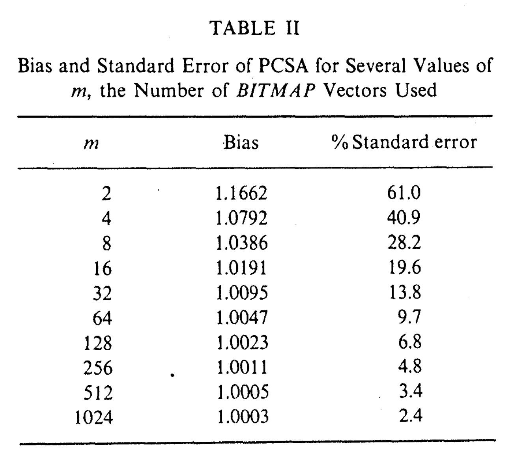

## AI论文解读 | Probabilistic counting algorithms for data base applications
        
### 作者        
digoal        
        
### 日期        
2025-10-15        
        
### 标签        
PostgreSQL , PolarDB , DuckDB , AI , 论文解读        
        
----        
        
## 背景  
      
https://algo.inria.fr/flajolet/Publications/FlMa85.pdf        
  
提示:          
```          
读懂《Probabilistic counting algorithms for data base applications》这篇论文需要提前掌握哪些基础知识, 请使用中文通熟易懂的讲解这些基础知识, 可以引用论文中的图、表或使用Markdown支持的图形(text,mermaid等)增加解释性. 
  
使用中文通熟易懂的解读《Probabilistic counting algorithms for data base applications》这篇论文, 其中的关键内容请着重讲解, 可以引用论文中的图、表或使用Markdown支持的图形(text,mermaid等)增加解释性. 
  
提取《Probabilistic counting algorithms for data base applications》这篇论文中的重要术语, 使用中文对这些术语进行通熟易懂的讲解, 可以引用论文中的图、表或使用Markdown支持的图形(text,mermaid等)增加解释性. 
```     
  
## 1 前置知识 
  
好的，为了完全理解Philippe Flajolet和G. Nigel Martin的这篇开创性论文《Probabilistic Counting Algorithms for Data Base Applications》，您需要掌握以下几个领域的基础知识。这篇论文的核心思想非常巧妙，即用极小的内存空间来估算一个巨大数据集中不同元素的数量（即“基数”）。

下面我将为您通俗易懂地讲解这些必备的基础知识，并引用论文中的内容和图表来辅助说明。

### 1\. 核心问题：基数估计 (Cardinality Estimation)

首先，你需要明白论文要解决的问题是什么。

  * **什么是基数 (Cardinality)？**
    一个集合中 **不重复** 元素的个数。例如，集合 `{A, B, C, A, B, B}` 的大小是6，但它的基数是3（因为只有A、B、C三种不同的元素）。

  * **为什么这个问题在数据库中很重要？**
    论文在引言中就举了一个例子 。假设要计算两个数据集A和B的交集 `A ∩ B`，至少有两种策略：

    1.  对A进行排序，然后逐个检查B中的元素是否存在于A中。
    2.  分别对A和B进行排序，然后像合并拉链一样找到共同的元素。

    这两种策略的计算成本（时间复杂度）与数据集的大小 (`a` 和 `b`) 以及它们的基数（不同元素的数量 `α` 和 `β`）密切相关 。数据库的查询优化器需要**预先估计**这些基数，才能选择最高效的执行计划 。

    **简单来说：** 不知道数据集中有多少“不同”的东西，就没法选择最优的处理方法。而精确计算基数本身可能非常耗时和消耗内存（比如需要一个巨大的哈希表来存储所有见过的元素），甚至比后续的查询操作还要慢 。因此，我们需要一种快速的、占用内存小的 **估算** 方法。

### 2\. 基础工具：哈希函数 (Hash Functions)

哈希函数是整个算法的基石。

  * **什么是哈希函数？**
    它是一个数学函数，能将任意大小的数据（如一个字符串、一个文件）映射成一个固定长度的数值，这个数值称为哈希值 。你可以把它想象成是为数据生成一个紧凑的“指纹”。

  * **理想的哈希函数有什么特点？**
    对于这篇论文的算法，我们需要一个“足够好”的哈希函数，它应该满足 **均匀性 (Uniformity)** 。这意味着：

    1.  输入数据的微小变化会导致输出的哈希值发生巨大且无规律的变化。
    2.  哈希值的输出结果在整个可能范围内是均匀分布的，就像掷一个绝对公平的骰子，每个点数出现的概率都一样。

    这个特性至关重要，因为它保证了后续的概率分析是有效的。算法的有效性完全建立在哈希值是随机且均匀分布的假设之上 。

### 3\. 算法核心思想 (The Core Idea)

这是论文最巧妙的部分，我们分步来理解 `COUNT` 这个基础流程 。

1.  **为每个元素生成哈希值**：遍历数据集M中的每一个元素`x`，计算其哈希值`hash(x)`。由于哈希值是均匀分布的，我们可以把它看作一个随机的二进制数串。

2.  **观察哈希值的二进制模式**：算法关注的是哈希值 **从右到左（从低位到高位）第一个‘1’出现的位置**。论文中用函数 `ρ(y)` 来表示这个位置 。

      * 例如，假设一个哈希值是 `...1011000`（二进制），那么`ρ(y)`的值就是3（位置从0开始数）。
      * 这个`ρ(y)`的值，等价于这个数末尾有多少个连续的0。

3.  **利用概率进行推断**：

      * 一个随机的二进制数，末尾是`1`的概率是 $1/2$ 。
      * 末尾是`10`的概率是 $1/4$ 。
      * 末尾是`100`的概率是 $1/8$ 。
      * ...
      * 末尾是`1`前面有`k`个0的模式（即 `ρ(y) = k`）出现的概率是 $2^{-(k+1)}$ 。

    这意味着，`ρ(y)`的值越大的模式越稀有。如果我们看到了一个`ρ(y)=k`的哈希值，我们可以粗略地推断，我们可能已经见过了大约 $2^{k+1}$ 个不同的元素。

4.  **使用BITMAP记录观察结果**：算法使用一个位图（`BITMAP`）数组来记录观察到的`ρ`值的最大模式 。`BITMAP`是一个只包含0和1的数组。

      * 初始化 `BITMAP` 数组全为0 。
      * 对于每一个元素的哈希值，计算出其 `ρ` 值，设为 `index`。
      * 然后将 `BITMAP[index]` 的位置设为1 。
      * `for all x in M do: index := ρ(hash(x)); BITMAP[index] := 1;`

    处理完所有数据后，`BITMAP`的样子很可能像这样：`111111011000...`，前面是连续的`1`，后面是稀疏的`1`和`0`。

5.  **估算基数**：算法认为，`BITMAP`中 **第一个0出现的位置（设为R）** 携带了关于基数`n`的关键信息 。直观上，如果`R`是第一个0的位置，意味着我们已经见过了所有 `ρ` 值小于 `R` 的模式，但还没见过 `ρ` 值为 `R` 的模式。这暗示着基数`n`的大小约等于 $2^R$ 。

    论文中给出了一个非常形象的例子：

      * 数据集：Unix手册的26692行文本，其中16405行是唯一的（即基数 n = 16405）。
      * 运行算法后得到的`BITMAP`是：
        ```text
        位置: 0  1  2  3  4  5  6  7  8  9 10 11 12 13 14 15 ...
        值:   1  1  1  1  1  1  1  1  1  1  1  1  0  0  1  1 ...
        ```
      * 在这里，第一个0出现在位置 **12**。而 $2^{12} = 4096$ , $2^{13} = 8192$ , $2^{14} = 16384$ 。可以看到， $2^{14}$ 与真实基数16405非常接近！这个例子有力地证明了算法思想的有效性。

### 4\. 概率论与统计学基础

仅仅使用 $2^R$ 作为估计是不够精确的。为了提高准确性，需要一些概率和统计知识。

  * **期望 (Expected Value)**：单个`R`的值有随机性，但它的数学期望（平均值）是稳定的。论文通过复杂的数学分析得出，`R`的期望值并非简单的 $log_2n$ ，而是约等于 $log_2(φn)$ ，其中 $φ \approx 0.77351$ 是一个“修正因子” 。因此，更准确的估算公式是 $n \approx 2^R / φ$ 。

  * **标准差 (Standard Deviation)**：单个`R`的估计值虽然在“平均上”是准的，但波动可能很大。论文计算出`R`的标准差约为 $1.12$ ，这意味着估计结果很容易偏离一个二进制数量级（即偏离一倍或一半），这对于很多应用来说是无法接受的 。

  * **通过平均降低误差**：统计学的一个基本原理是，通过多次独立测量并取平均值，可以显著降低最终结果的误差。这引出了算法的优化版本。

### 5\. 算法的优化：随机平均 (Stochastic Averaging)

为了解决单个`BITMAP`不准确的问题，论文提出了**PCSA (Probabilistic Counting with Stochastic Averaging)** 算法 。

  * **朴素想法**：使用`m`个不同的哈希函数，得到`m`个独立的`BITMAP`和`m`个独立的`R`值。最后将这`m`个结果平均，得到一个更稳健的估计。缺点是计算`m`次哈希成本太高 。

  * **巧妙的随机平均**：只用 **一个** 哈希函数，但准备`m`个`BITMAP`数组。

    1.  对元素`x`计算一次哈希值 `h`。
    2.  将`h`的前几位（例如 `h mod m`）作为索引，选择`m`个`BITMAP`中的一个 。
    3.  将`h`的剩余部分用于计算`ρ`值，并更新所选的那个`BITMAP`。

    这样，数据流被随机地“分发”到`m`个桶中，每个桶都在独立地进行概率计数。最终，将`m`个桶的结果进行平均，得到最终的基数估计 。这种方法在效果上等同于使用`m`个哈希函数，但计算成本大大降低。

    论文中的 **Table II** 清晰地展示了这种优化的效果：   

    | m (BITMAP数量) | Bias (偏差) | % Standard error (标准差百分比) |
    | :---: | :---: | :---: |
    | 2 | 1.1662 | 61.0 |
    | 4 | 1.0792 | 40.9 |
    | 8 | 1.0386 | 28.2 |
    | 16 | 1.0191 | 19.6 |
    | 32 | 1.0095 | 13.8 |
    | **64** | **1.0047** | **9.7** |
    | **128** | **1.0023** | **6.8** |
    | **256** | **1.0011** | **4.8** |
    | 1024 | 1.0003 | 2.4 |

    从这个表格可以直观地看到，随着`m`（代表内存使用量）的增加，标准差（代表估计的误差）显著下降。例如，当`m=64`时，误差约为10% ；当`m=256`时，误差能降低到约5% 。这完美体现了 **空间-精度权衡 (Space-Accuracy Tradeoff)**。

### 6\. (可选) 高等数学知识

如果你想深入理解论文中公式的推导过程（例如 $φ \approx 0.77351$ 是如何算出来的），那么你需要了解一些高等数学工具，主要用于论文的“渐进分析”部分：

  * **梅林变换 (Mellin Transform)** ：一种积分变换，非常适合用来分析具有“分形”或“标度”特性的函数的渐近行为。
  * **伽马函数 (Gamma Function)** 和 **留数定理 (Residue Theorem)** ：这些是复分析中的工具，用于求解梅林变换的反演积分，从而得到期望和方差的精确渐近表达式。

对于大多数读者而言，**无需掌握这部分数学推导**，只需理解并接受其结论（例如`φ`和标准差的数值），就能完全明白算法的设计思想和应用价值。

### 总结

要读懂这篇论文，你需要按以下顺序构建你的知识体系：

1.  **理解问题**：为什么要估算基数？（数据库查询优化）
2.  **掌握工具**：什么是哈希函数，为什么需要均匀性？
3.  **吃透核心思想**：如何通过观察哈希值的二进制末尾0的个数来推断基数？（`ρ`函数和`BITMAP`）
4.  **接受统计修正**：为什么一个`BITMAP`不够准？（期望和标准差）
5.  **学习优化技巧**：如何用随机平均（PCSA）以低成本提高精度？（空间-精度权衡）

掌握了以上五点，你就能领会这篇论文的精髓。而高等数学部分则是为那些希望从理论上验证算法正确性的研究者准备的。
  
## 2 解读论文 
  
好的，这篇由Philippe Flajolet和G. Nigel Martin在1985年发表的论文《Probabilistic Counting Algorithms for Data Base Applications》是一篇里程碑式的著作。它提出了一种非常巧妙的方法，可以用极小的内存空间（例如几十到几百个字节）和极快的速度，来估算一个超大数据集（比如数据库中的一张大表）中不重复元素的数量。

下面，我将为您通俗易懂地解读这篇论文的核心思想和关键内容。

### 核心问题：为什么要估算“不重复元素的数量”？

想象一下，数据库管理员需要执行一个复杂的查询，比如计算两个巨大数据表A和B的交集。论文开篇就指出，完成这个任务有多种策略 ：
1.  **策略一**：将表A排好序，然后逐个检查表B中的记录是否存在于A中。
2.  **策略二**：将表A和表B都排好序，然后像拉拉链一样同步扫描，找出共同的记录。

哪种策略更快？这很大程度上取决于A和B中 **不重复元素的数量**（也称为 **基数 (Cardinality)**） 。如果表A中重复的记录特别多（基数很小），那么策略一可能就非常高效。数据库的“查询优化器”如果能提前知道这个基数，就能做出明智的选择，从而将查询速度提升成百上千倍 。

然而，精确计算基数本身就很慢，通常需要大量的内存来存储所有已经见过的元素，这违背了优化的初衷 。因此，本文的目标就是设计一种 **快速、省内存的估算算法**。

### 关键思想一：基础计数流程 (The Basic COUNT Procedure)

这是论文最核心、最巧妙的构想。算法的直觉来源于对随机数据的统计观察。

1.  **哈希函数**：首先，我们需要一个好的哈希函数 (hash function)。它可以将任意一条记录（比如一个用户名、一个IP地址）转换成一个足够长且看起来完全随机的二进制数 。理想情况下，任何记录转换后的二进制数都像是公平地抛硬币生成的一样。

2.  **观察二进制模式**：算法并不关心哈希值的具体大小，而是关心它的 **二进制表示中，从右边数过来第一个“1”出现的位置**。论文将这个位置定义为函数 `ρ(y)` 。

    * `...1011`**`1`** -> `ρ(y) = 0`
    * `...010`**`1`**`0` -> `ρ(y) = 1`
    * `...11`**`1`**`00` -> `ρ(y) = 2`
    * `...0`**`1`**`000` -> `ρ(y) = 3`

3.  **概率直觉**：由于哈希值是随机的，我们可以推断：
    * 大约有 $1/2$ 的哈希值 `ρ(y)=0` (末位是1)。
    * 大约有 $1/4$ 的哈希值 `ρ(y)=1` (末位是10)。
    * 大约有 $1/8$ 的哈希值 `ρ(y)=2` (末位是100)。
    * ...
    * `ρ(y)=k` 这种模式出现的概率是 $2^{-(k+1)}$ 。

    这意味着 `ρ` 值越大的模式越稀有。如果我们观察到了一个 `ρ` 值为 `k` 的哈希值，可以粗略地认为我们可能已经见过了约 $2^{k+1}$ 个 **不同** 的哈希值。

4.  **使用BITMAP记录**：算法使用一个位图数组 `BITMAP` 来记录观察到的 `ρ` 值。
    * `BITMAP` 初始化为全0 。
    * 对数据集中的 **每一条** 记录 `x`，计算 `index = ρ(hash(x))` 。
    * 将 `BITMAP[index]` 的值设为1 。

    这个流程走完后，`BITMAP` 的形态通常是前面一长串连续的 `1`，后面是稀疏的 `0` 和 `1` 。因为 `ρ` 值小的模式很容易出现，所以它们对应的位置很快就被置为1了。

5.  **估算基数**：算法认为，`BITMAP` 中 **第一个0出现的位置** (我们称之为 `R`) 暗示了基数 `n` 的大小。直观上，`R` 是第一个0，说明我们已经见过了所有 `ρ` 值小于 `R` 的模式，但还没见过 `ρ` 值为 `R` 的模式。这强烈暗示了基数 `n` 大约是 $2^R$ 。

论文中给了一个真实世界的例子来说明这个思想的威力：
* **数据集**：Unix系统手册，包含16405个不重复的文本行 (即真实基数 n = 16405)。
* **运行结果**：得到的 `BITMAP` 是 `111111111111001100000000`。
* **观察**：第一个0出现在位置12 (`R=12`)。而最右边的1出现在位置15。
* **估算**： $2^{14} = 16384$ ，这个值与真实基数16405惊人地接近！

### 关键思想二：修正与优化 (PCSA 算法)

虽然 $2^R$ 是个不错的粗略估计，但它并不够精确，且波动性很大。

* **偏差修正**：通过复杂的数学分析（梅林变换等），作者发现 `R` 的期望值（平均值）更接近于 $log_2(φn)$ ，其中 $φ \approx 0.77351...$ 是一个常数 。因此，一个更精确的估算公式是 $n \approx 2^R / φ$ 。

* **降低误差 (Stochastic Averaging)**：单个 `R` 的估计标准差高达1.12，这意味着结果可能偏离真实值一倍以上，这在实际应用中是不可接受的 。
    为了解决这个问题，论文提出了核心算法——**PCSA (Probabilistic Counting with Stochastic Averaging)**。
    它的想法是“分桶”然后取平均，但实现得非常巧妙：
    1.  不再使用1个`BITMAP`，而是使用 `m` 个 (比如 `m=64`) 。
    2.  对于一条记录，只计算 **一次** 哈希值 `h`。
    3.  用 `h` 的前几位来决定使用哪个 `BITMAP` (例如，桶的编号 `a = h mod m`) 。
    4.  用 `h` 的剩余部分来计算 `ρ` 值 (例如，`index = ρ(h div m)`)，并更新对应桶的`BITMAP[a]` 。

    这样，所有的数据被随机地、均匀地分配到了 `m` 个桶中，每个桶都在独立地进行概率计数。最后，将这 `m` 个桶的结果进行平均，得到一个更稳定、更精确的最终估计值 。

### 算法效果：空间与精度的权衡

PCSA算法的优雅之处在于它提供了一个清晰的 **空间-精度权衡**。使用的`BITMAP`数量 `m` 越多，占用的内存越多，但结果就越准。论文中的 **Table II** 直观地展示了这一点：

| m (BITMAP数量) | Bias (偏差) | % Standard error (标准差百分比) |
| :---: | :---: | :---: |
| 2 | 1.1662 | 61.0 |
| 8 | 1.0386 | 28.2 |
| 32 | 1.0095 | 13.8 |
| **64** | **1.0047** | **9.7** |
| **128** | **1.0023** | **6.8** |
| **256** | **1.0011** | **4.8** |
| 1024 | 1.0003 | 2.4 |

  

*(数据来源: Flajolet & Martin, 1985, Table II)*

从上表可以看出：
* 当 `m=64` 时，仅需几百字节的内存，就能实现约 **10%** 的平均误差 。
* 当 `m=256` 时，误差可以降低到约 **5%** 。

对于数据库优化这类场景，这种级别的精度已经完全足够了。

### 应用：分布式计算

该算法还有一个巨大的优势：非常适合分布式环境。假设一个文件被分散在`s`台不同的服务器上，要计算全局的基数：
1.  每台服务器独立运行PCSA算法，生成自己的 `m` 个`BITMAP`向量 。
2.  每台服务器只需将它最终得到的 `m` 个`BITMAP`向量发送给一个中心处理器 。
3.  中心处理器将收到的所有`BITMAP`向量按位进行 **逻辑或 (OR)** 操作。例如，对于第一个桶，`BITMAP_final[0] = BITMAP_server1[0] OR BITMAP_server2[0] OR ...`。
4.  最终得到的`BITMAP`向量就等同于在整个数据集上运行一次算法的结果，可以用它来估算全局基数 。

这个过程的通信成本极低（只需传输几个小小的`BITMAP`），且最终的估算精度 **不会有任何损失** ，这在分布式数据处理中是非常宝贵的特性。

### 总结

《Probabilistic Counting Algorithms》这篇论文提出了一种革命性的基数估计算法。其核心贡献可以概括为：
* **巧妙的直觉**：利用哈希值的二进制低位模式的出现概率来推断不重复元素的数量。
* **高效的优化**：通过“随机平均”（PCSA）技术，使用多个`BITMAP`分桶处理，显著提高了估算的精度和稳定性。
* **出色的实用性**：算法速度快，内存占用极小，并提供了可控的“空间-精度”权衡，且完美适用于分布式计算环境。

这个算法后来演变成了著名的 **Flajolet-Martin (FM) Sketch**，并启发了后续一系列更先进的算法，如LogLog Counting和HyperLogLog，它们共同构成了现代大数据基数估算领域的基石。
  
## 3 术语 
  
好的, 这篇由Philippe Flajolet和G. Nigel Martin在1985年发表的论文《Probabilistic counting algorithms for data base applications》是数据流算法领域的开创性著作之一. 它介绍了一类非常巧妙的算法, 可以在只占用极小内存的情况下, 单次遍历数据就能估算出其中不重复元素的数量.

以下是该论文中一些重要术语的中文讲解, 并结合了论文中的图表演示.

-----

### 1\. 基数 (Cardinality)

  * **通俗讲解**: "基数"就是指一个数据集合中, 去掉所有重复项后, 独一无二的元素的总数量. 例如, 集合 `{A, B, C, A, B}` 的基数是3 (分别是A, B, C).

  * **论文中的重要性**: 论文开篇就指出, 在数据库中, 估算基数对于"查询优化"至关重要. 例如, 在计算两个表的交集时, 如果能提前知道各个表中不同元素的数量(即基数), 就可以选择成本最低的计算策略. 传统精确计算基数的方法需要排序或使用大量辅助存储空间, 成本很高, 而本文提出的概率算法则旨在用极小的成本来"估算"这个值.

### 2\. 概率计数 (Probabilistic Counting)

  * **通俗讲解**: 这是一种与"精确计数"相对的概念. 它并不试图得到100%准确的答案, 而是通过数学和统计学方法, 得到一个与真实值非常接近的估算值. 这么做的好处是极大地节省了计算时间和存储空间.

  * **论文中的核心思想**: 算法的核心不是记录下所有见过的元素, 而是观察这些元素经过某个哈希函数处理后, 其二进制表示所呈现出的统计学规律. 通过观察这些规律, 就能反推出大概有多少个不同的元素.

### 3\. 哈希函数 (Hashing Function)

  * **通俗讲解**: 哈希函数就像一个"搅拌机", 你可以把任何数据(例如一个字符串、一个文件)扔进去, 它都会输出一个固定长度的数字(或字符串), 这个输出值就是"哈希值". 一个好的哈希函数能确保不同的输入会得到看似随机且均匀分布的输出值.

  * **论文中的应用**: 它是整个算法的基石. 论文假设存在一个能将数据记录均匀地转换成整数的`hash`函数. 后续所有的统计观察都建立在这些哈希值的二进制形式上.

### 4\. BITMAP (位图)

  * **通俗讲解**: BITMAP是一个核心数据结构, 本质上是一个只包含0和1的数组. 在这个算法里, 它的每个位置`i`都对应一种二进制模式 (即以`i`个0开头, 后面跟一个1).

  * **工作原理**:

    1.  初始化一个所有位都是0的BITMAP数组: `BITMAP[0...L-1]`.
    2.  对于数据集中的**每一个**元素`x`:
        a. 计算其哈希值: `h = hash(x)`.
        b. 找出`h`的二进制表示中, 从右到左第一个'1'出现的位置, 记为`index` (这个操作由函数`ρ`完成).
        c. 将`BITMAP`数组中第`index`个位置的值设为1: `BITMAP[index] = 1`.
    3.  所有元素处理完毕后, `BITMAP[i]`为1, 就意味着我们至少见过一个元素的哈希值, 其二进制表示是以`i`个0开头, 接着是一个1的模式(`...10...0` - 共`i`个0).

  * **论文中的示例**: 论文对一个包含16405个不同行的文件进行了处理, 得到的`BITMAP`向量如下:

    ```text
    111111111111001100000000
    ```

    
    在这个向量中, 第一个0出现在第12个位置(从0开始计数). 算法正是利用这个"第一个0的位置"(记为`R`)来估算基数`n`的大小的, 因为理论上`R`约等于`log₂(φn)`.

### 5\. 函数 $\rho(y)$

  * **通俗讲解**: 这个函数的作用是"寻找最低位的1". 它输入一个整数`y`, 输出`y`的二进制表示中, 从右往左数第一个'1'所在的位置(从0开始).

  * **示例**:

      * 如果`y = 12`, 二进制是 `...001100`. 那么`ρ(12) = 2`, 因为最低位的1在第2个位置.
      * 如果`y = 8`, 二进制是 `...001000`. 那么`ρ(8) = 3`.

  * **论文中的作用**: 它的输出值被直接用作`BITMAP`数组的索引(`index`).

### 6\. 随机平均 (Stochastic Averaging)

  * **通俗讲解**: 单次使用`BITMAP`进行估算, 结果的随机误差可能较大(标准差约1.12, 意味着估算值可能偏离真实值一个二进制数量级). 为了提高精度, 一个简单的想法是使用`m`个不同的哈希函数, 得到`m`个估算值, 最后取平均. 但计算`m`个哈希函数成本太高. "随机平均"是一个更巧妙的方法: 只用**一个**哈希函数, 但将它的输出值分成两部分.
    1.  一部分用于选择`m`个`BITMAP`中的哪一个 (例如, `hash(x) mod m`).
    2.  另一部分用于在选定的`BITMAP`中执行原始的概率计数逻辑 (例如, `hash(x) div m`).
        这样就达到了类似使用`m`个独立哈希函数的效果, 但每次处理元素时成本几乎没有增加.

### 7\. PCSA (Probabilistic Counting with Stochastic Averaging)

  * **通俗讲解**: PCSA是这篇论文提出的最终优化算法的名称, 它结合了基础的"概率计数"方法和"随机平均"技术, 以达到更高的估算精度. `m`(即`BITMAP`的数量)越大, 结果越准.

  * **精度与存储的关系**: 论文给出了非常明确的精度指标. `m`的值决定了算法占用的内存和估算的精度.
  
    | m (BITMAP 数量) | 估算偏差 (Bias) | 标准误差 (% Standard error) |
    | :--- | :--- | :--- |
    | 16 | 1.0191 | 19.6% |
    | 32 | 1.0095 | 13.8% |
    | 64 | 1.0047 | 9.7% |
    | 128 | 1.0023 | 6.8% |
    | 256 | 1.0011 | 4.8% |
    | 1024 | 1.0003 | 2.4% |

      

    *(该表数据来自原论文 Table II)*

    从表中可以看出, 使用64个`BITMAP`向量(`m=64`)时, 典型的精度约为10%; 而当`m`增加到256时, 精度可以提升到5%左右. 这也验证了标准误差与 $1/\sqrt{m}$ 成反比的结论.

### 8\. 修正因子 $\varphi$ ( Correction Factor $\varphi$ )

  * **通俗讲解**: 这个因子是一个"魔法常数", 约等于`0.77351`. 经过数学家们的严谨分析, 发现直接使用`BITMAP`中第一个0的位置`R`来估算, 即`2^R`, 结果会存在一个系统性的偏差. 将估算结果除以这个修正因子 $\varphi$ 后, 就能得到一个在统计上更准确的无偏估计.

这个因子在最终的估算公式中扮演了关键的修正角色:
$$\text{估算基数} \approx \frac{m}{\varphi} \times 2^{(\text{所有R的平均值})}$$


总而言之, 这篇论文通过结合哈希函数、位图操作和随机平均等技术, 开创性地解决了一个在当时非常困难的问题: 如何在资源极其有限的条件下, 快速估算海量数据中的基数. 这些思想后来演化出了如LogLog、HyperLogLog等更为先进的算法, 并广泛应用于网络流量监控、大数据分析和数据库系统等领域.
  
## 参考        
         
https://algo.inria.fr/flajolet/Publications/FlMa85.pdf    
        
<b> 以上内容基于DeepSeek、Qwen、Gemini及诸多AI生成, 轻微人工调整, 感谢杭州深度求索人工智能、阿里云、Google等公司. </b>        
        
<b> AI 生成的内容请自行辨别正确性, 当然也多了些许踩坑的乐趣, 毕竟冒险是每个男人的天性.  </b>        
    
#### [期望 PostgreSQL|开源PolarDB 增加什么功能?](https://github.com/digoal/blog/issues/76 "269ac3d1c492e938c0191101c7238216")
  
  
#### [PolarDB 开源数据库](https://openpolardb.com/home "57258f76c37864c6e6d23383d05714ea")
  
  
#### [PolarDB 学习图谱](https://www.aliyun.com/database/openpolardb/activity "8642f60e04ed0c814bf9cb9677976bd4")
  
  
#### [PostgreSQL 解决方案集合](../201706/20170601_02.md "40cff096e9ed7122c512b35d8561d9c8")
  
  
#### [德哥 / digoal's Github - 公益是一辈子的事.](https://github.com/digoal/blog/blob/master/README.md "22709685feb7cab07d30f30387f0a9ae")
  
  
#### [About 德哥](https://github.com/digoal/blog/blob/master/me/readme.md "a37735981e7704886ffd590565582dd0")
  
  

  
